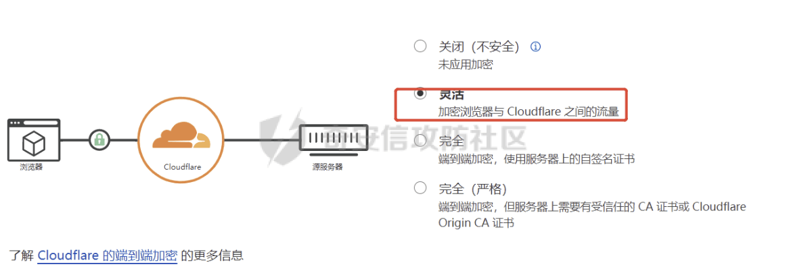
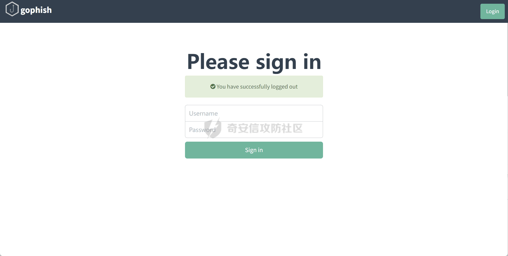
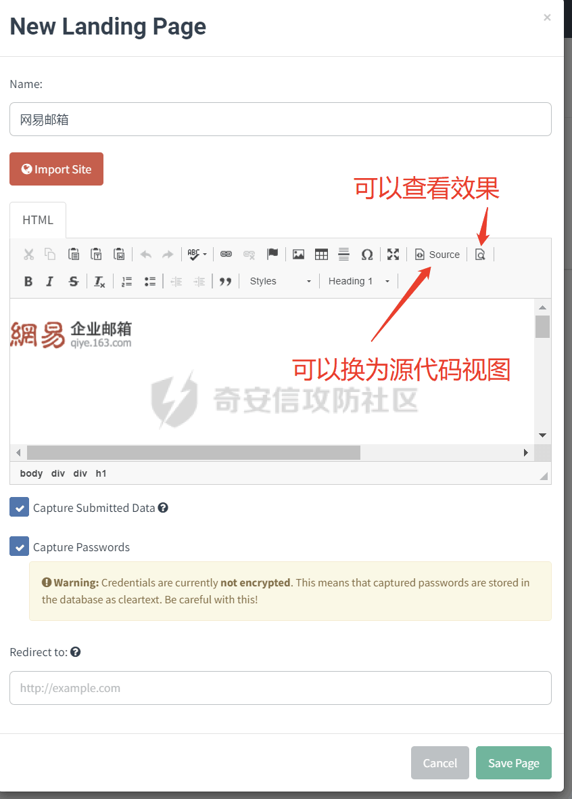
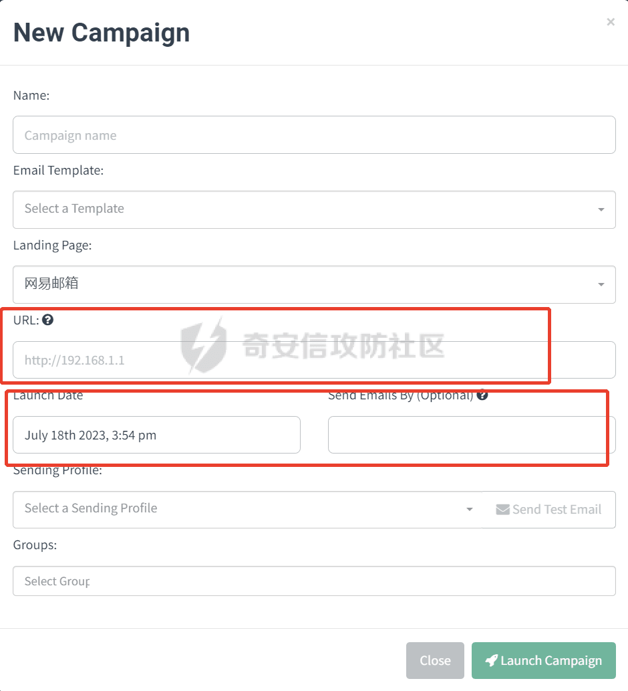

# 奇安信攻防社区 - 无痕制作钓鱼邮件

### 无痕制作钓鱼邮件

声明：利用钓鱼网站骗取银行卡或信用卡账号、密码等私人资料属于非法行为，请不要进行任何非授权的网络攻击，由于传播、利用本文所提供的信息而造成的任何直接或间接的后果及损失，均由使用者...

**声明：**  
利用钓鱼网站骗取银行卡或信用卡账号、密码等私人资料属于非法行为，请不要进行任何非授权的网络攻击，由于传播、利用本文所提供的信息而造成的任何直接或间接的后果及损失，均由使用者本人负责，文章作者不为此承担任何责任。

废话不多说，先说一下本次钓鱼演练需要准备的东西，接下来我们将会从以下 5 个方面进行钓鱼邮件的制作。

> 1.香港服务器（必须）
> 
> 2.域名
> 
> 3.cloudflare
> 
> 4.EwoMail 邮件服务器
> 
> 5.gophish

## 一：服务器准备

```php
最好是香港的，因为国外的ip大概率会被网易邮箱、QQ邮箱进行拦截而且后面做https+域名映射的时候国内服务器域名没有备案的话不会让使用，所以最好选择香港的服务器，网上随便买个香港服务器就行了，系统的话我们选择centos7.9因为后面要安装很多东西最好选择跟我一样的系统版本避免安装时报错，这里需要全新的系统，如果自己有服务器而且上面有安装其他服务的最好重装一下或者购买新的服务器。
```

## 二：域名

```php
我们需要购买相似的域名来增加钓鱼的命中率，比如对方的邮箱使用的是zhangsan@bitebi.com（主域名是bitebi.com），那我们需要购买和这个相似的域名，例如：bittbi.com、bitebl.com等相似的域名，域名在哪儿购买都行，国内国外无所谓的，如果是国内例如阿里、腾讯的域名后面进行dns修改的时候需要等2天的时间，因为后面我们需要使用cloudflare进行dns伪装和https所以需要对域名解析的dns进行修改。
```

  
我这里买的阿里云的，我们购买成功以后就可以看到我们的域名，这里暂时先不管，我们进行下一步操作。

## 三：cloudflare 搭建

```php
Cloudflare是一家全球性的互联网安全、性能优化和分发服务提供商。该公司提供了一系列的云计算服务，包括内容分发网络（CDN）、DDoS攻击防护、安全防护、域名解析、SSL证书和边缘计算等。我们这里用来使用cloudflare的cdn和https来规避网易邮箱的封禁和拦截，达到伪装和防止溯源的目的。
```

### 3.1 添加域名站点

[https://dash.cloudflare.com/](https://dash.cloudflare.com/)

**(1) 选免费 -> 继续 -> 确认**


  
**(2) 左边点 DNS-> 记录 -> 添加记录**

**(3) 添加两条**


这里说明一下，类型我们都选择 A 记录，然后名称就是主域名前面的名称，比如我们申请的域名是 bittbi.com 这个域名，那么名称我们就可以填写 www，那么整个域名就是 www.bittbi.com。内容填写我们前面提到的服务器也就是我们的 vps。

### 3.2 域名 dns 更改

```php
这里需要修改域名的dns解析值，查看上图我们会发现cloudflare有一个NS类型的值，这里我们需要在域名里面把值修改为cloudflare中NS类型的值，这样你ping域名的时候就会解析到cloudflare的cdn，这里我们以阿里云为例子，回到刚刚阿里云那个界面点击全部域名那个"1"按钮就会跳转到如下：
```


点击管理：


选择修改 dns，填写我们刚刚 cloudflare 中 NS 类型的值，阿里云需要等待 48 小时 dns 服务器才会更改生效，如果不着急的话可以选择阿里云，很着急的话选择国外的也行。

### 3.3cloudflare ssl 配置：

**(1) 改为灵活，因为完全在国内会非常慢**



**(2) 点客户端证书 -> 创建**

  
**(3) 选择 ECC-> 创建证书**


**(4) 左边缓存 -> 配置 -> 开发者勾上**


**(5) 左边规则 -> 添加两个规则 -> 选择缓存级别 -> 选择绕过 -> 保存**


这里“url/说明”填写我们之前申请的主域名

```php
*.bittle.com/*
bittle.com/*
```

\*号必须要有，速通符


## 四：EwoMail 邮件服务器

```php
EwoMail邮件服务器是一个用于搭建和管理企业级邮件系统的软件解决方案。它提供了完整的电子邮件服务，包括收发邮件、邮件存储、邮件过滤、用户管理和安全控制等功能。
```

### 4.1 关于 25 端口

```php
25端口为SMTP(Simple Mail Transfer Protocol，简单邮件传输协议)服务器所开放，主要用于发送邮件。EwoMail服务器支持创建邮箱账号，EwoMail服务器创建的不同账号收发邮件没有限制，使用EwoMail创建的邮箱账号，向EwoMail外部发送邮件时，需要使用25端口，这里就是为什么要**香港的服务器**，因为香港的服务器不需要向服务器厂商申请可以直接开放就能使用，如果是腾讯云、阿里云、京东云等这些国内服务器厂商都要走审批工单才能开放25端口，如果这里使用了这些云服务器那么后面的https就无法使用了，因为域名没有备案无法解析到国内的服务器。
```

### 4.2 搭建步骤

#### 4.2.1：检查 selinux

```php
vi /etc/sysconfig/selinux 

SELINUX=enforcing 改为 SELINUX=disabled
```

#### 4.2.2：git 安装

```php
yum -y install git 

cd /root 

git clone https://gitee.com/laowu5/EwoMail.git 

cd /root/EwoMail/install #需要输入一个邮箱域名，不需要前缀，列如下面的 bittbi.com

sh ./start.sh bittbi.com // 注意安装时更改为自己的主域名
```

#### 4.2.3：host 替换

```php
vim /etc/hosts

127.0.0.1 mail.bittbi.com smtp.bittbi.com imap.bittbi.com
```

#### 4.2.4：创建邮箱账号

登录邮箱管理后台：[http://IP:8010](https://link.juejin.cn/?target=http%3A%2F%2FIP%3A8010)（默认账号 admin，密码 ewomail123），进行账号创建


```php
注意添加邮箱账号时，需要更换为自己的主域名，也就是`sh ./start.sh bittbi.com ` 命令执行时候的域名，我以示例域名bittbi.com为例那么就是zhangsan@bittbi.com。
```

#### 4.2.5：邮箱登录

使用浏览器打开[http://IP:8000](https://link.juejin.cn/?target=http%3A%2F%2Fip%3A8000%2F)，例如：[zhangsan@bittbi.com](mailto:zhangsan@bittbi.com)进行登录


这里可以发送邮件，我们可以自行测试一下邮件能否发送，发送一封测试就行。

#### 4.2.6：注意事项

如果想要重新安装的话只能通过重装系统才能解决，默认后台运行不需要每次都启动脚本，启动一次即可。

## 五：gophish 搭建

```php
Gophish是一款开源的渗透测试工具，用于模拟和执行钓鱼攻击。它的设计目的是帮助安全专业人员评估和增强组织的防御能力，通过模拟真实的钓鱼攻击来测试员工的警觉性和安全意识。

    使用Gophish，安全团队可以创建和发送钓鱼电子邮件、网页钓鱼页面以及其他钓鱼形式的伪造信息，以诱使目标用户提供敏感信息或执行特定的操作。Gophish提供了灵活的模板和配置选项，使用户能够定制和伪造各种类型的钓鱼攻击，包括欺骗性的登录页面、恶意附件和虚假的重要通知等。

    除了发起钓鱼攻击，Gophish还提供了详细的分析和报告功能。它可以跟踪受攻击用户的行为，例如打开邮件、点击链接或输入凭据等，并生成相应的报告和统计数据。这些数据可以帮助安全团队评估钓鱼攻击的成功率、目标用户的易受攻击性和潜在的安全风险。

    需要注意的是，Gophish只能在合法和授权的渗透测试活动中使用。未经授权和合法许可的使用可能涉及非法行为和侵犯隐私问题。在使用Gophish或其他类似工具之前，务必遵循适用法律法规和道德准则，并获得相关授权和许可。
```

#### 5.1：安装 gophish

```php
安装包下载：https://github.com/gophish/gophish/releases，这里我建议本机开代理下载下来然后传到服务器上面进行解压使用，如果服务器网速很好可以使用 wget 进行下载
```

```php
wget https://github.com/gophish/gophish/releases/download/v0.10.1/gophish-v0.10.1-linux-64bit.zip
```

注意这是 64 位的

下载以后解压

```php
unzip gophish-v0.10.1-linux-64bit.zip -d ./gophish
```

进入 gophish 修改配置文件，因为我们服务器是在公网所以要改一个配置

```php
vi config.json
```


改为 0.0.0.0，即为全部用户可访问

#### 5.2：gophish 使用详情

```php
chmod +x gophish

nohup ./gophish > gophish.log 2>&1 &
```

```php
访问`https://ip:3333/`（注意使用 https 协议）尽量登录后在功能面板`Account Settings`处修改高强度密码 (admin/gophish)
```

如果依旧访问不到后台管理系统，有可能是服务器未对外开放 3333 端口，可查看防火墙策略、配置 iptables 等方式自检




#### 5.3：功能介绍

进入后台后，左边的栏目即代表各个功能，分别是`Dashboard仪表板`、`Campaigns钓鱼事件`、`Users & Groups用户和组`、`Email Templates邮件模板`、`Landing Pages钓鱼页面`、`Sending Profiles发件策略`六大功能，接下来逐一介绍此功能。

##### 5.3.1：Sending Profiles 发件策略

说白了就是绑定一个发钓鱼邮件的邮箱账号


Name：这里建议选择邮箱名字，做到见名知其意

From：就是发送到对方邮件后想显示的效果，比如你想模仿网易安全中心那么就是“网易安全中心[zhangsan@bittbi.com](mailto:zhangsan@bittbi.com)”，这里的域名要自行替换哦

UserName：就是刚刚邮件服务器创建的邮箱名字

PassWord：邮箱密码

Email Headers:这个需要自己改，如果用默认的直接会被拦截掉，如何去找这个？可以自行百度该字段的意义然后里面会有很多，或者自己先用网易发一封正常的邮件然后导出为 eml 格式的文件用 txt 打开找到这个字段复制下来就好了，这里给大家一个例子：

  
X-Mailer:Foxmail 6, 15, 201, 21 \[cn\]

  
这里可以发送一封测试邮件进行测试，如果有收到说明就没问题。

##### 5.3.2：Landing Pages 钓鱼页面




这里有几个点需要注意，重点说一下

\*\*Name：\*\\\*还是跟之前一样的，命名规范

\*\*Import Site：\*\*要克隆的页面，输入域名就可以克隆页面，但是这个里面有很多的坑，要么就是捕捉不到数据要么就是乱码，所以接下里给大家讲讲如何避免这种情况

**必看）经验之谈 · 注意事项**  
在导入真实网站来作为钓鱼页面时，绝大多数情况下并非仅通过 Import 就能够达到理想下的克隆，通过多次实践，总结出以下几点注意事项

【捕获不到提交的数据】导入后要在 HTML 编辑框的非 Source 模式下观察源码解析情况，如果明显发现存在许多地方未加载，则有可能导入的源码并非页面完全加载后的前端代码，而是一个半成品，需要通过浏览器二次解析，渲染未加载的 DOM。这种情况下，除非能够直接爬取页面完全加载后的前端代码，否则无法利用 gophish 进行钓鱼，造成的原因是不满足第 2 点。  
【捕获不到提交的数据】导入的前端源码，必须存在严格存在\\<form method="post" ···>\\<input name="aaa" ··· /> ··· \\<input type="submit" ··· />结构，即表单（POST 方式）— Input 标签（具有 name 属性）Input 标签（submit 类型）— 表单闭合的结构，如果不满足则无法捕获到提交的数据  
【捕获不到提交的数据】在满足第 2 点的结构的情况下，还需要求\\<form method="post" ···>在浏览器解析渲染后（即预览情况下）不能包含 action 属性，或者 action 属性的值为空。否则将会把表单数据提交给 action 指定的页面，而导致无法被捕获到  
【捕获数据不齐全】对于需要被捕获的表单数据，除了 input 标签需要被包含在

结构中，所以如果遇到新坑，先将该结构排查一遍，还是不行，再另辟蹊径。

所以我们在构造钓鱼页面的时候也是最复杂的，这里页面需要大家自己构造，因为不同的场景构造的钓鱼页面也是不一样的，这里我放模板出来也没有意义，如果后面有需要的话我后面在补充。

##### 5.3.3：Email Templates 钓鱼邮件模板

  
这里给一个做好的模板照片，导入.eml 格式的目的是为了套用格式使其看起来更加真实，如下图是我做的一个：


##### 5.3.4：Users & Groups 用户和组


要么 Add 单独添加，如果量少的话。批量添加的话就是 Download CSV Template 点击这个下载模板，然后按照格式填入进去在点击旁边红色的按钮导入即可。

##### 5.3.5：Campaigns 钓鱼事件

Campaigns 的作用是将上述四个功能`Sending Profiles`、`Email Templates`、`Landing Pages`、`Users & Groups`联系起来，并创建钓鱼事件

这个模块就是把之前的全部添加进去，这里需要将的就是 URL 这一个和 Launch Date、Send Emails By (Optional)



url：填入我们之前 cloudflare 里面设置的域名


```php
https://bittbi.com
```

这样我们点击跳转以后就会跳转到 https 这个页面，同时也使用的是 https，浏览器也不会报错看起来更真实，而且我们使用了 cdn 让蓝方队员难以溯源。

**Launch Date:**  
Launch Date 即钓鱼事件的实施日期，通常如果仅发送少量的邮箱，该项不需要修改。如果需要发送大量的邮箱，则配合旁边的`Send Emails By`效果更佳。`Launch Date`作为起始发件时间，`Send Emails By`作为完成发件时间，而它们之间的时间将被所有邮件以分钟为单位平分。例如，`Launch Date`的值为`2023.06.22，09:00`，`Send Emails By`的值为`2023.06.22，09:04`，如果我们需要发送 50 封邮件，那么每分钟发送的邮件就是：邮件总数/分钟数，50/5=10，也就是每分钟发送 10 封。这样的好处在于，当需要发送大量的钓鱼邮件，而发件邮箱服务器并未限制每分钟的发件数，那么通过该设定可以限制钓鱼邮件不受约束的发出，从而防止因短时间大量邮件抵达目标邮箱而导致的**垃圾邮件检测**，甚至**发件邮箱服务器 IP 被目标邮箱服务器封禁**。

##### 5.3.6：Dashboard 仪表板

```php
当创建了钓鱼事件后，Dashboard 会自动开始统计数据。统计的数据项包括当创建了钓鱼事件后，Dashboard 会自动开始统计数据。统计的数据项包括**邮件发送成功的数量及比率**，**邮件被打开的数量及比率**，**钓鱼链接被点击的数量及比率**，**账密数据被提交的数量和比率**，**以及收到电子邮件报告的数量和比率**。另外，**还有时间轴记录了每个行为发生的时间点**。另外，**还有时间轴记录了每个行为发生的时间点**
```


## 六：总结

```php
整个钓鱼邮件就搭建好了，这里和以往其他文章不一样的地方在于新增了https协议让其看起来更真实，使用了cdn让蓝队增加溯源难度，更加贴合红队以及常见钓鱼攻击者的攻击手法。其次就是在构建域名的时候我们用了https证书和cdn网易邮箱或者qq邮箱在识别我们链接的时候不会拉黑和提示垃圾邮件，因为我们整个域名处于白名单状态，可以饶过网易邮箱的策略。最后唯一需要注意的就是在邮箱构建模块和网页构建这两个部分需要投入很多的精力去伪造，伪造的越好钓的鱼就越多，识别是否钓鱼邮件的最稳的方法就是查看域名，通过查看域名的方式来判断无疑是最合适的方法。在最后再次声明，本次教学分享只为**知识探讨和学习**，**利用钓鱼网站骗取银行卡或信用卡账号、密码等私人资料属于非法行为，请不要进行任何非授权的网络攻击，由于传播、利用本文所提供的信息而造成的任何直接或间接的后果及损失，均由使用者本人负责，文章作者不为此承担任何责任。**
```
