# 奇安信攻防社区 - 某 oa 命令执行漏洞挖掘思路

### 某 oa 命令执行漏洞挖掘思路

前段时间看到某系统爆出一个 RCE，随后找到了源码对漏洞进行分析，并利用历史漏洞找到了其他突破点，进而找到新的漏洞。

前段时间看到某系统爆出一个 RCE，随后找到了源码对漏洞进行分析，并利用历史漏洞找到了其他突破点，进而找到新的漏洞。

# 0x01 历史漏洞分析

首先来看一个历史漏洞，Ognl 表达式注入导致 RCE，具体 payload 如下

```php
POST /common/common_sort_tree.jsp;.js HTTP/1.1
Host: xx.xx.xx.xx
Accept-Encoding: gzip, deflate
Content-Length: 174
Accept-Language: zh-CN,zh;q=0.8
Accept: */*
User-Agent: Mozilla/5.0 (Windows NT 5.1; rv:5.0) Gecko/20100101 Firefox/5.0 info
Accept-Charset: GBK,utf-8;q=0.7,*;q=0.3
Connection: close
Cache-Control: max-age=0
Content-Type: application/x-www-form-urlencoded

rootName={%25Thread.@fe.util.FileUtil@saveFileContext(new%20java.io.File("../web/fe.war/123.jsp"),new%20sun.misc.BASE64Decoder().decodeBuffer("d2hvYW1p"))%25}
```

首先该系统在未登录的状态下默认是无法直接访问一些 jsp 文件的

在`web.xml`中可以看到对 jsp 的使用的过滤器

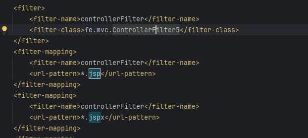

查看 ControllerFilter5 中的 doFilter

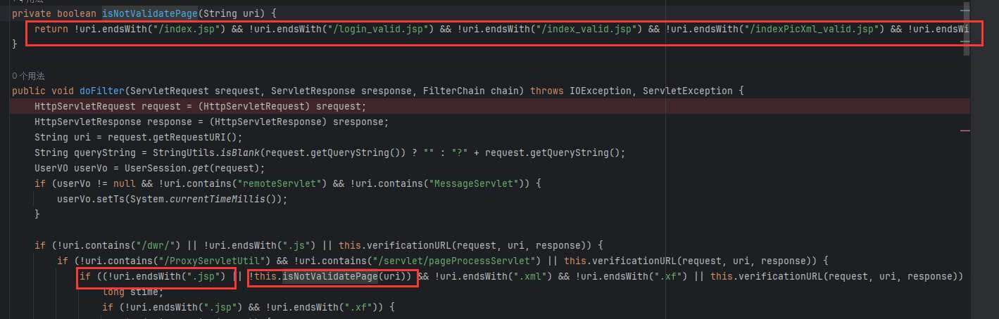

发现会判断 uri 的结尾是否是`.jsp`，判断 jsp 是否在白名单列表里，如果不在则返回 302 重定向到登陆页面，可以可以利用 tomcat 特性使用`;`绕过，因为 在 URL 中遇到`;`号会将`;xxx/`中的**分号与斜杠之间的字符串以及分号本身**都去掉，当然也可以用 url 编码绕过，这点在这里不做过多分析。

然后通过 payload 可以看到漏洞点在 common\_sort\_tree.jsp，并且 Ognl 表达式通过`rootName`参数传递并执行，然后查看具体代码：  
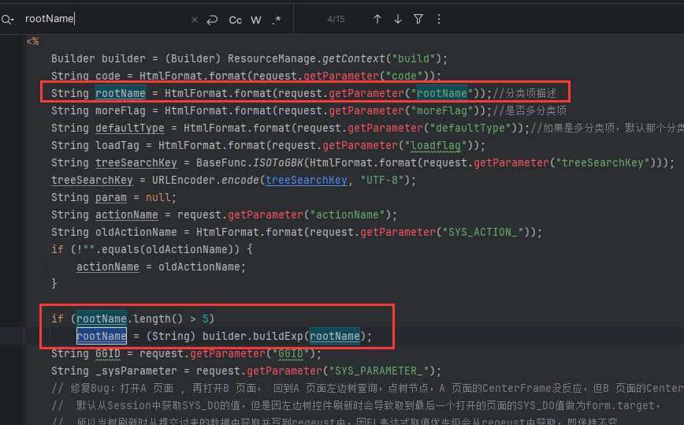

通过查看该 jsp 文件可以看到`rootName`通过传参得到，然后传入`builder.buildExp`方法

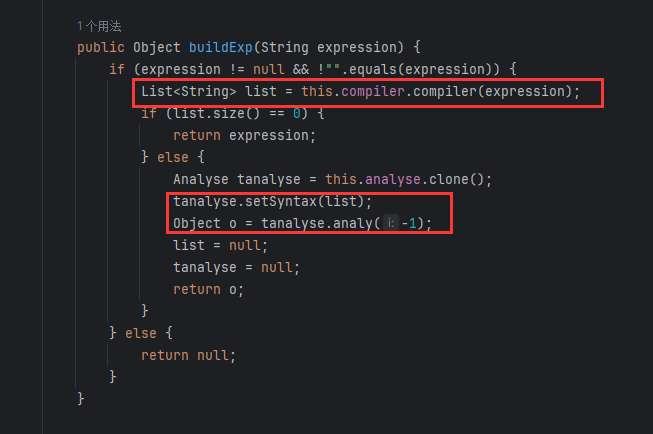

传入的语句首先会进行`compiler`生成一个列表，这个方法的主要功能是将输入的表达式进行编译，生成子表达式的列表，并在必要时替换原始表达式中的子表达式。该方法使用了一些标签和映射（`startMap` 和 `stopMap`）来辅助解析和替换。

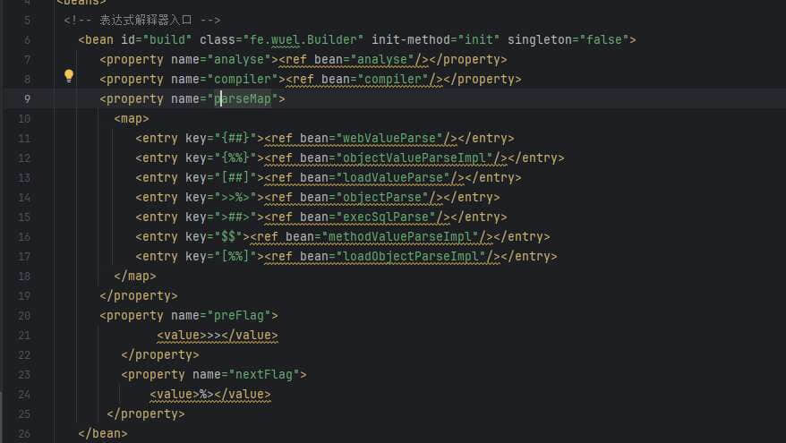

然后在 bean.xml 中定义了一个`parseMap` 它表示了每个标签所对应的类方法，例如在 payload 中使用的是``就对应使用的是`objectValueParseImpl`bean 的标识符

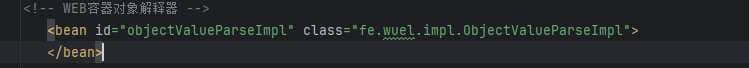

然后使用该类的实现作为 bean 的实例。.

然后在初始化方法的时候，遍历`parseMap`，并且取前两个字符和后两个字符分别作为 start(起始符) 和 stop(结束符)

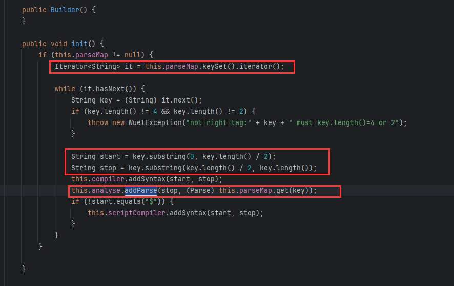

然后使用`this.analyse.addParse`，生成`mapValue`

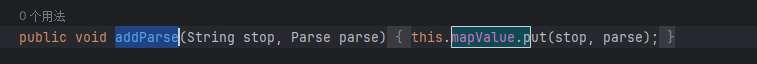

然后使用`tanalyse.analy`进行分析并返回结果

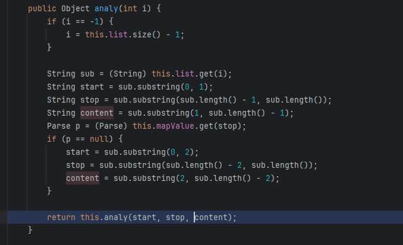

在`analy`中提取开始标签和结束标签和内容 content

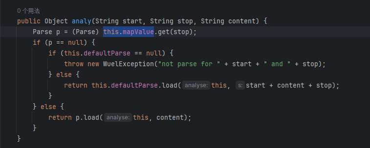

然后再这个`analy`方法中，首选会确定需要调用的函数，使用`this.mapValue`通过`stop`也就是尾部标识符获取对应的类名，这里的`this.mapValue`是一个 hashmap，然后使用最下面的`p.load`调用对应的方法。在该方法中然后调用了`getValue`，这里代码就省略了

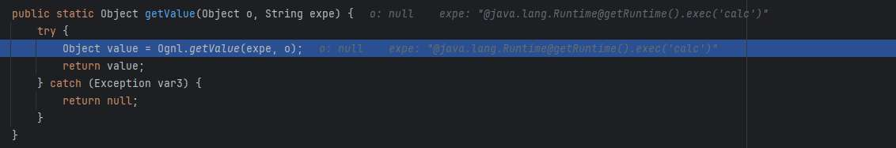

最终到达`Ognl.getValue`并执行 Ognl 语句造成 RCE。

# 0x02 其他漏洞发现

了解完了历史漏洞触发的流程，可以发现漏洞的根本原因是最开始的`builder.buildExp`方法对参数过滤不严格造成的，如果按照这个思路去找漏洞，可以看看还有哪里调用了这个方法，并且参数是否可控。

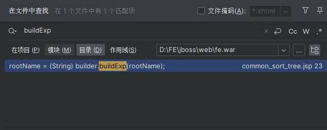

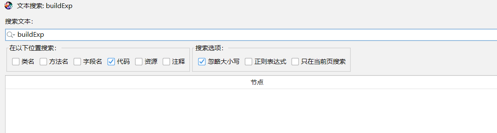

分别在 jsp 和 jar 包中搜索相关关键字，发现没有其他的引用。

但是当我们回头看这个类中所定义的其他方法时，发现了其他和`buildExp`相似的方法

例如`build`，他和`buildExp`除了方法名不一样内容都是一样的

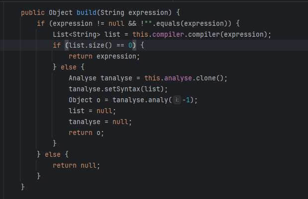

包括其他方法，也有简介的调用了`build`方法，例如：

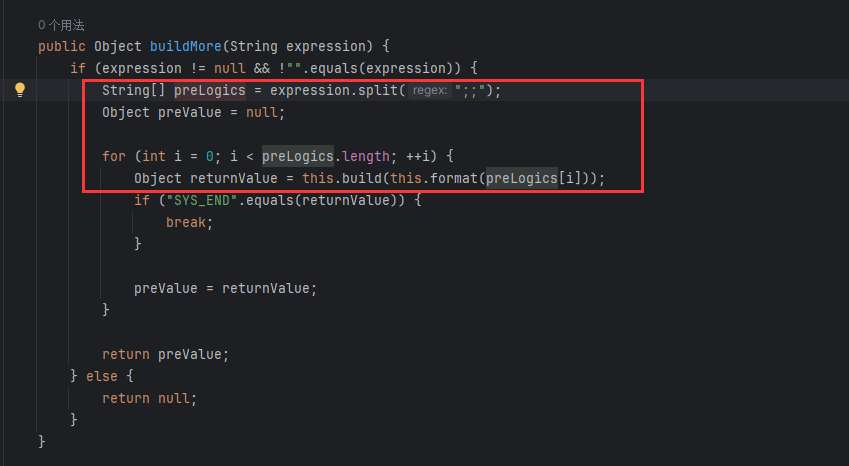

所以这就大大扩大了我们的寻找范围，通过正则`[\.| ]+builder\.build`，找到了很多调用的地方，接下来就是看看哪些参数可控

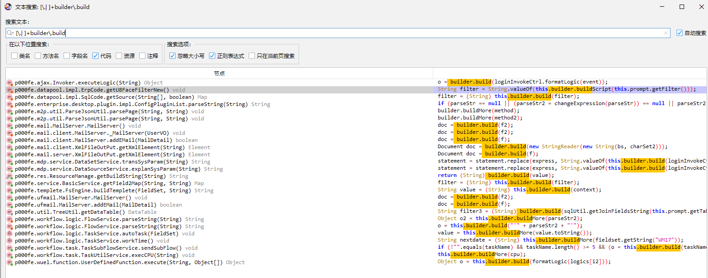

这里找到其中一个，也就是上图搜索结果中的第一个：

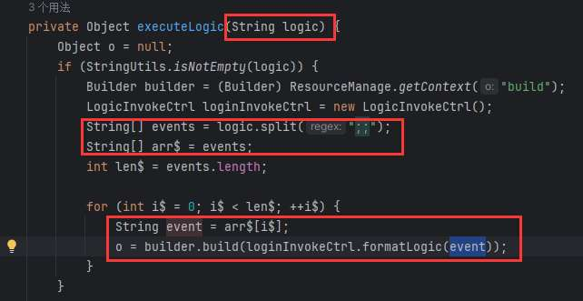

但是这里的 event 会经过`loginInvokeCtrl.formatLogic`的格式化，在这个函数中，会在`logic`前后加上标识符，

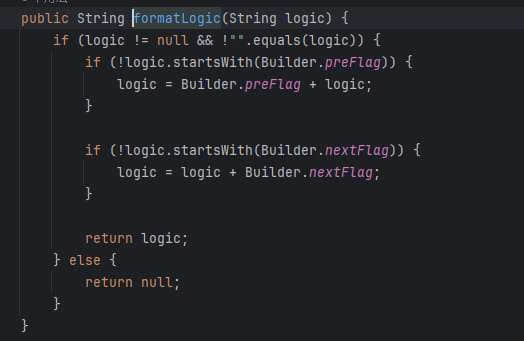

但这并不影响，因为在 build 中的 compiler 会一层一层剥离语句，首先会执行最内层的标签里的语句。

接着继续追踪`executeLogic`看哪些地方调用了

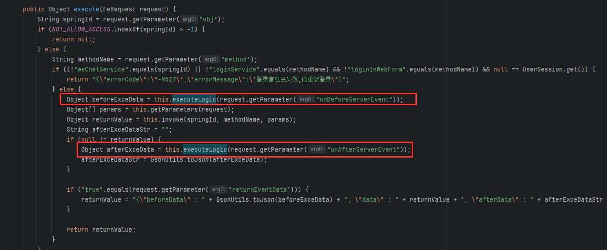

在`execute`中，这两处均被调用了，并且参数时通过`request.getParameter`获得的，也是可控的。

但是该语句是在一个 if 判断条件中，需要满足用户登录或者指定的 methodName 和 springId，这两个值也是通过`request.getParameter`直接获取到的

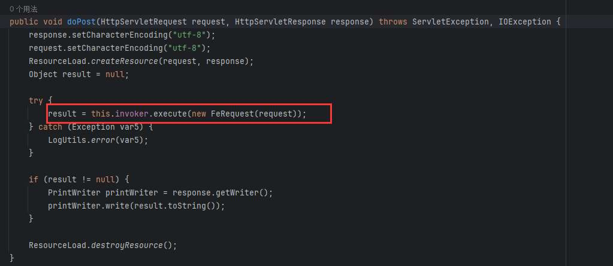

然后继续向上追踪，终于找到了触发的地方`doPost`

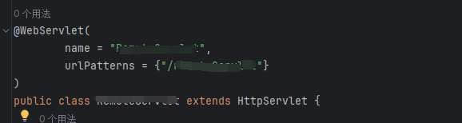

同样找到了它的 url 映射路径。至此，请求路径，以及所有的请求参数都是可控的，且请求参数可以直接传递到具有漏洞的方法里。
