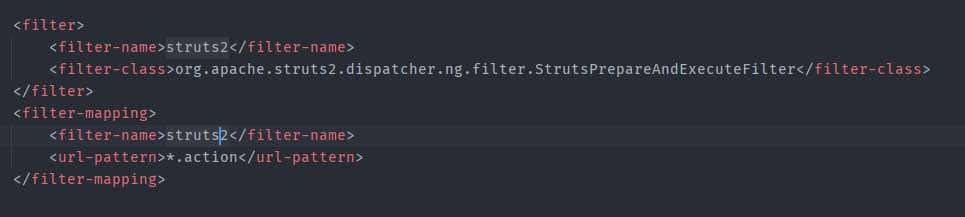
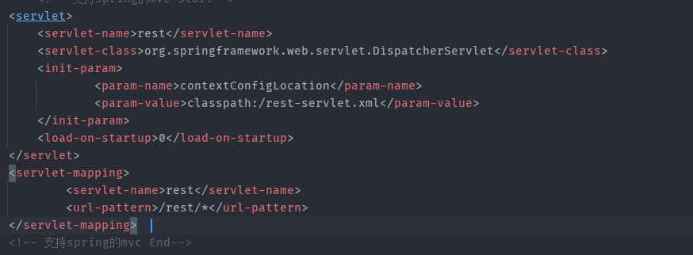
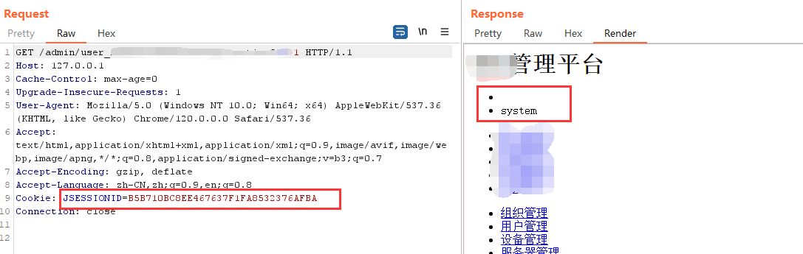
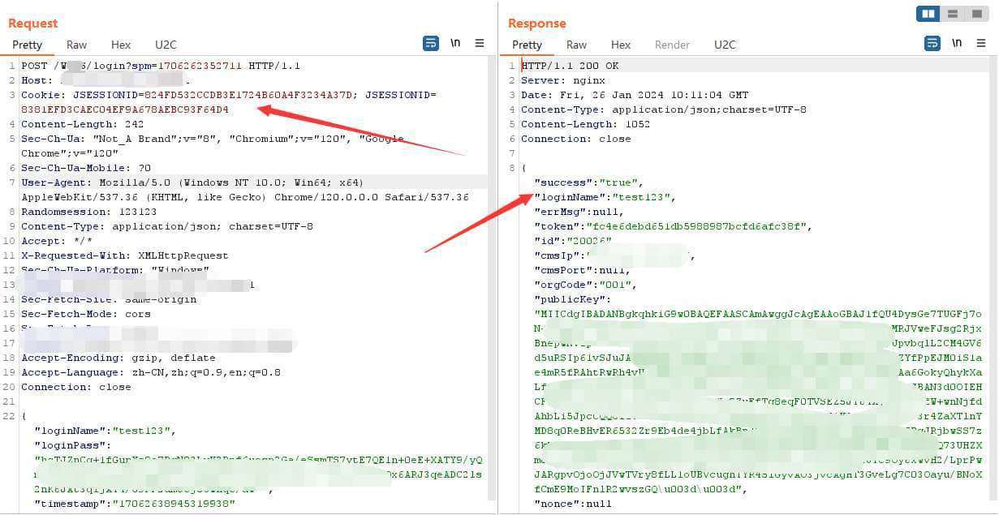
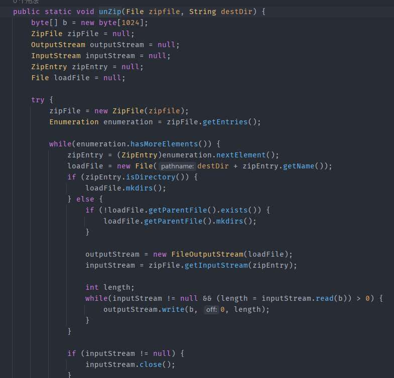

# 奇安信攻防社区 - 某园区系统登录绕过分析

### 某园区系统登录绕过分析

最近看到某园区系统去年有个登录绕过 + 后台上传的组合漏洞，本着学习的心态分析了一下该漏洞，虽说前期了些踩雷，但是也有意外收获。

# 某园区系统登录绕过分析

最近看到某园区系统去年有个登录绕过 + 后台上传的组合漏洞，本着学习的心态分析了一下该漏洞，虽说前期了些踩雷，但是也有意外收获。

## 0x01 前置知识

该项目由 struts2 和 spring 两种框架组成，在 web.xml 中可以看到





请求以`.action`结尾会按 struts2 处理，`/rest`开头会按 spring 处理

poc 都是以`.action`所以需要关注`struts.xml`这一配置文件

> struts.xml 是 Struts2 框架的核心配置文件，该文件主要用于配置 Action 和请求的对应关系，以及配置逻辑视图和物理视图（逻辑视图就是在 struts.xml 文件中配置的 <result> 元素，它的 name 属性值就是逻辑视图名；物理视图是指 <result> 元素中配置的结果页面，如 JSP 资源的对应关系。

相当于是定义了请求路由对应处理类方法，同时还定义了 struts2 的处理拦截器

该项目主要定义了如下拦截器


对其一一分析，在`Intercptor`类中发现了对路由做鉴权限制


当请求路由不在 if 判断中的其他请求路由会判断 session 有效性，做鉴权。

## 0x02 漏洞分析

第一步首先是访问`/admin/sso_initSession.action`获取一个 session，但是发现上面这个`Intercptor`类白名单放行的路由里并没有`sso_initSession`，按理是要鉴权，为啥可以直接访问呢。

在 struts2 中其实需要配置 action 中带`interceptor-ref`这一标签才会走过滤器


而`sso_initSession.action`中没有定义，所以该接口是可以未授权访问的。

根据配置`sso_initSession.action`对应的类方法是`ssoAction#initSession()`方法，跟进看看怎么个事


这里会创建一个为空的 user 对象，并对 session 进行初始化，返回 session 的值。

值得注意的是该 user 对象其实只是类对象为空，而本身不是 null，相对于是一个没权限的 session，但是这个 session 却能绕过拦截器中`userBean==null`的判断，所以该 session 可以访问任意接口。

下一步就是调用用户创建接口来创建有权限的角色

具体逻辑是在`userAction#save()`方法


这里的 this.userBean 其实是由 http 传参来构建的，在 struts2 中参数绑定是内部进行反射构造的，需要绑定的 java bean 对象必须要实现 get/set 方法。

主要逻辑是`this.userManager.addUser(this.userBean);`，前面有个判断如果密码被 rsa 加密了会解密。

跟进其实现


首先是调用`this.validationUser()`判断用户名是否存在，不存在的话继续往下

这里`isEncrypt`为 true，还调用`EncryptionUtils.getEncryptedText()`，对密码进行加密

```java
public static String getEncryptedText(UserBean checkedUser) {
        return "true".equals(ConfigReader.getStringIsNull("user.loginpass.encryted")) ? encrypt(checkedUser.getLoginName() + ":dss:" + checkedUser.getLoginPass()) : checkedUser.getLoginPass();
    }

public static String encrypt(String text) {
        String password = null;

        try {
            MessageDigest md = MessageDigest.getInstance("MD5");
            md.update(text.getBytes("UTF-8"));
            byte[] b = md.digest();
            StringBuilder sBuilder = new StringBuilder();

            for(int offset = 0; offset < b.length; ++offset) {
                int i = b[offset];
                if (i < 0) {
                    i += 256;
                }

                if (i < 16) {
                    sBuilder.append("0");
                }

                sBuilder.append(Integer.toHexString(i));
            }

            password = sBuilder.toString();
        } catch (Exception var7) {
            logger.error(var7);
        }

        return password;
    }
```

相当于`用户名`+`:dss:`+`明文密码`做 md5 加密。

随后将其存入数据库中完成用户创建。

## 0x03 漏洞复现

首先访问`/admin/sso_initSession.action`创建低权限 session


随后访问`/admin/user_save.action`创建用户


然后就可以使用该账号的登录


## 0x04 举一反三

通过上面分析在创建新 session 时会有一个 new UserBean() 的操作


于是全局搜索该代码字符串


可以看到仅有 33 处，我们可以排除 get 相关的方法，最终在其中找到两处调用。

第一处是在`VideoxxxAction`中存在一个私有方法

```java
private void loginxxxx() {
    if (null == this.session.get("user")) {
        UserBean userBean = new UserBean();
        userBean.setId(1L);
        userBean.setLoginName("system");
        this.session.put("user", userBean);
        this.getVideoPlanManager().setFlushModeEager();
    }

}
```

当 session 中没有用户信息时，该方法会直接赋予 system 权限的用户信息，但是因为是私有方法无法直接通过`Videoxxx_loginxxx.action`直接访问，于是我们向上寻找其用例。

该 action 提供了 init 的公有方法

```java
public String init() {
    this.loginxxxx();
    ...
    return "videoxxx_init";
}
```

其中就有调用我们上面的危险方法

### 验证

访问上述接口获取 session 值


该 session 可访问后台接口



另外一个在 service 里需要跟进到具体调用，感兴趣的可以自己发现一下。

## 0x05 补充

此时我们发现创建的用户其实没有访问/admin 的权限，




这主要是因为/WxxS 模块是由 spring 框架开发的，而/admin 模块是由 struts2 框架开发的，两个 session 对象不是同一个，在/admin 模块中的拦截器取到的 userBean 对象为 null，所以导致无法访问/admin 下的鉴权接口，因而肯定有东西会将他们的 session 连接到一块。

我们来看看/WxxS 模块登录接口


可以看到数据包中返回的 token，字段名为`subSystemToken`，然后在/admin 目录中的 loginAction 也出现了该字段


该接口会接收`subSystemToken`的传参，同时在 session 中找到该 token 的 userBean 对象，随后更新 session 并在返回包中返回

利用该接口的 cookie 我们就可以正常访问/admin 下的路由了


最后是上传点，其在`/recover_recover.action`中


该类定义了名为 recoverFile 的 File 类对象，同时在 isProgressCreated 为 true（默认为 true）进入对 recoverFile 的操作

首先会进入`this.validatePassword()`方法


可以看到接收一个 password 参数，将`loginName`和传入的`password`初始化出`checkUser`，调用`isMatch`方法与数据库中的`loginName`的用户信息做对比


可以看到其实是判断两个密码是否相同，这里因为当前用户是我们自己创建的所以传入`用户名`+`:dss:`+`明文密码`的 MD5 值即可绕过该方法的判断。

随后来到`this.recoverManager.recover()`方法


主要是通过`ZipUtils.unZip()`方法来解压压缩包文件，按照以往漏洞分析此处应该是有目录穿越可以解压到指定目录



在`unzip()`方法中果真没有对`../`的处理，而 destDir 默认在配置文件中找到


所以构造的压缩包需要穿越到 tomcat 目录下才可以，即该系统默认为`../../../../../../../../../../../../../opt/tomcat/webapps/upload/`
