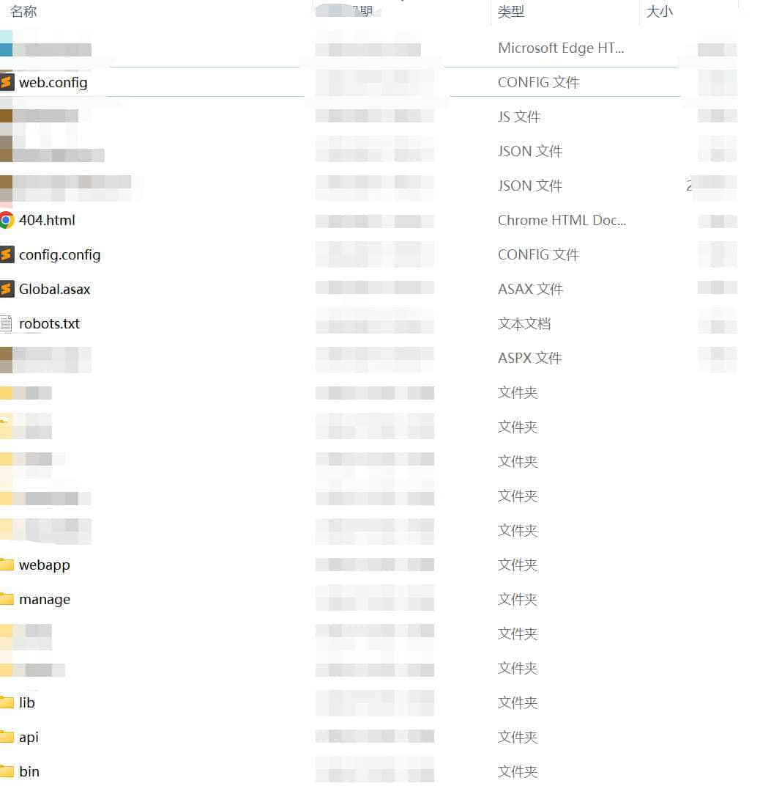
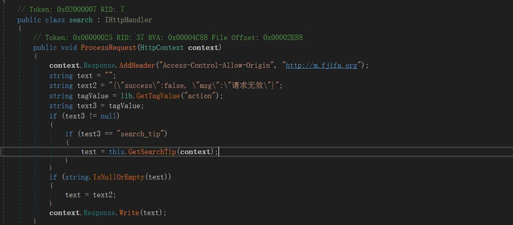
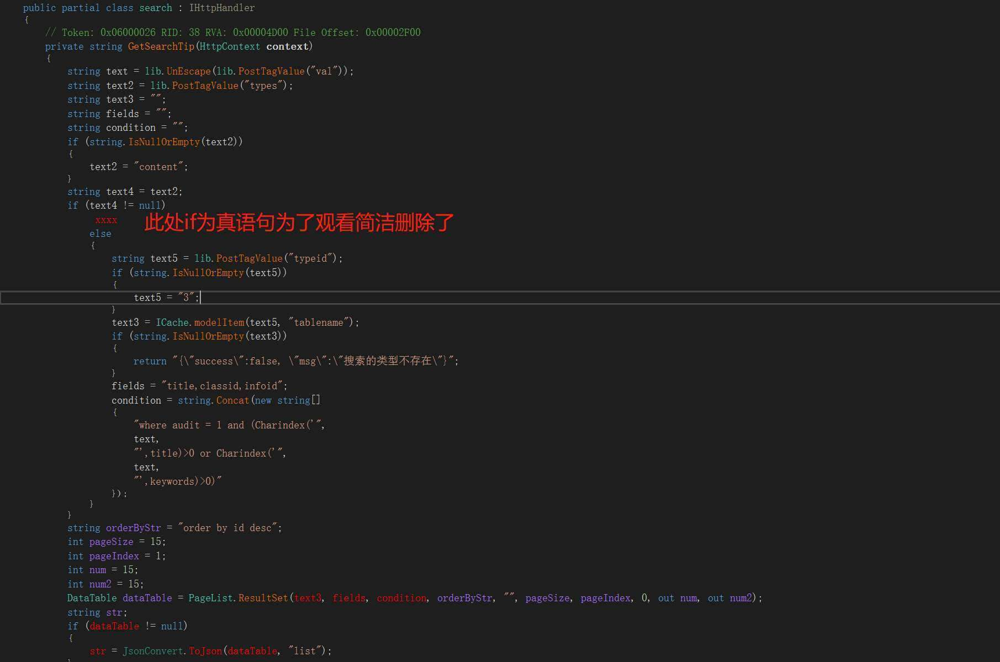
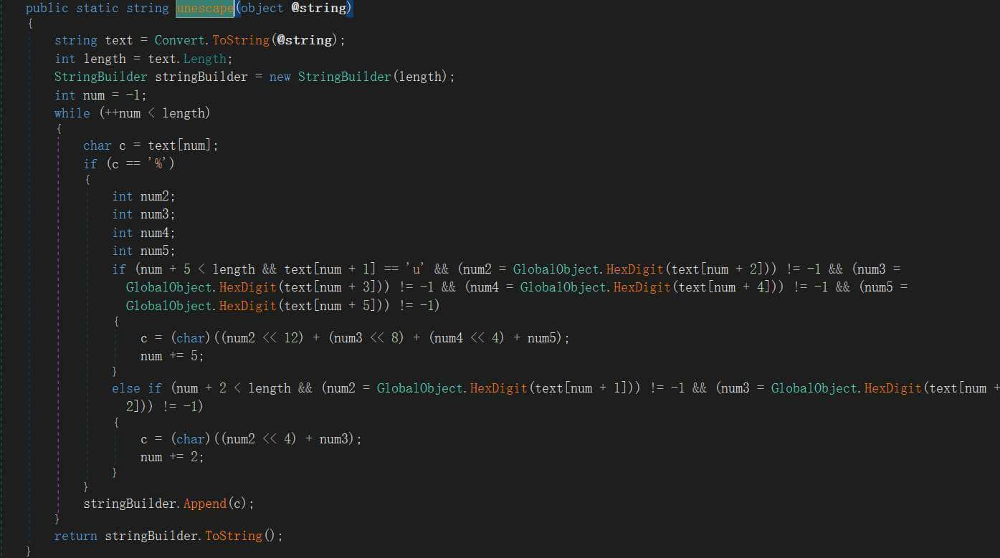
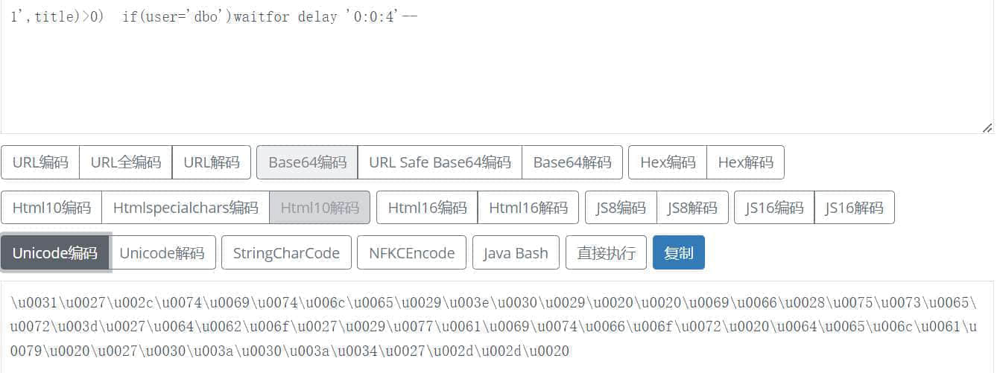
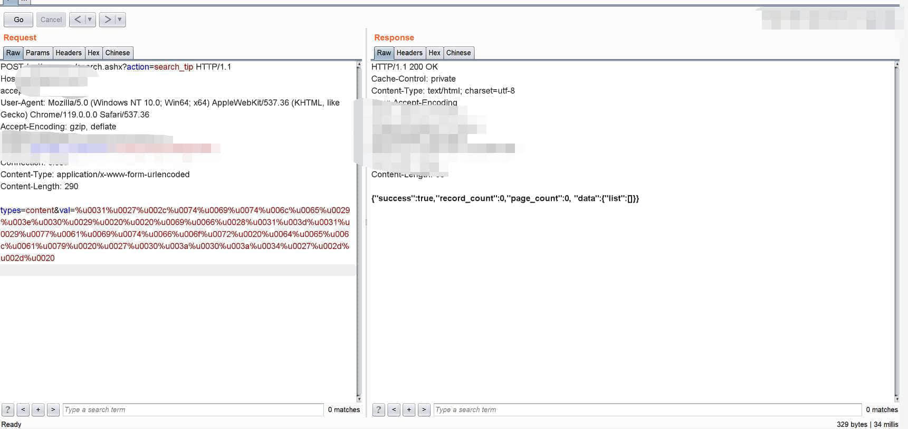
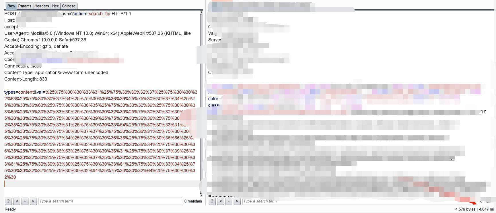

# 奇安信攻防社区 - 某次实战代码审计出 sql 注入漏洞记录

### 某次实战代码审计出 sql 注入漏洞记录

某次项目中朋友拿到了一份 web 的源码让帮忙看下，通过审计发现多处注入，挑选一处记录一下

# 前言

某次项目中朋友拿到了一份 web 的源码让帮忙看下，通过审计发现多处注入，挑选一处记录一下

cms 源码解压查看目录格式如下



系统使用 asp.net 运行环境

故先来看看 Global.asax 和 web.config 文件

```php
PS:

Global.asax是一个文本文件,它提供全局可用代码。这些代码包括应用程序的事件处理程序以及会话事件、方法和静态变量。通常ASP.NET的全局过滤代码就是在这里面。

web.config是基于XML的文件，可以保存到Web应用程序中的任何目录中，用来储存数据库连接字符、身份安全验证等
```

Global.asax 基本没有啥有效的信息，在 web.config 中发现了使用的 URL Rewrite（URL Rewrite 是截取传入 Web 请求并自动将请求重定向到其他 URL 的过程）


例如在处理请求/api/a/b/c 之类的请求时，将其他转发给/api/a/b/c.ashx 文件进行处理，通过测试目标站点时 bp 的 history，找到代码位置


api 目录下有三个目录，其中 manage 与 user 目录均需要登录，目标站点又没有注册的功能，也没找到注册的接口，故只能找找 common 中看有没有利用的点

/api


/api/user


/api/manager


/api/common


对其中的功能逐一分析，最终在 search.ashx 中发现漏洞，分析过程如下

首先了解下.net 的必备知识

```php
ASPX.cs是页面后的代码，aspx负责显示，服务器端的动作就是在aspx.cs定义的。
.cs是类文件，公共类
.ashx是一般处理程序，主要用于写web handler,可以理解成不会显示的aspx页面，不过效率更高
dll就是cs文件编译之后的程序集，一般在/bin目录下
```


通过查看 search.ashx，发现其后端代码位置在 xxxxcms.web.dll 中

将 api/bin/xxxxcms.web.dll 放入 dnspy 中，查看代码



ProcessRequest() 方法中，获取 url 中 action 的值，当其为 search\_tip 时，调用 GetsearchTip() 方法，否则返回请求无效

跟进 GetsearchTip() 方法



使用 PostTagValue() 方法获取并处理 post 请求包请求体中 val 参数的值，接着使用 UnEscape() 方法对其进行处理

同时判断了请求体中 types 的值如果为空则设置为“content”

最后将 val 参数拼接到了 condition 数组中，执行 ResultSet 方法，分析发现 ResultSet 方法经过多次重载后最终将 condition 数组中的值未过滤拼接后调用“SelectRecords”存储过程带入数据库中执行查询


SelectRecords 存储过程 (可以在源码中的数据库安装文件 install.sql 中找到)


所以只要我们的传参经过 PostTagValue() 和 UnEscape() 处理后没有被拦截，那么此处至少是存在一个 sql 注入的

接着着重看这俩方法做了什么

其中 PostTagValue() 函数跟进发现为过滤函数


过滤了单引号等大量危险字符等之后返回，本来看到这以为基本凉凉了

接着经过 UnEscape() 函数处理




​ 该方法会遍历输入字符串的每个字符，如果遇到 '%' 字符，则会判断后面的字符是否符合转义字符的格式。

-   如果字符 '%' 后面紧跟着字符 'u'，并且接下来的四个字符都是有效的十六进制数字，则将这五个字符解析为一个 Unicode 字符，并将其添加到 StringBuilder 中。（unicode 解码，不过识别的是%u开头，而不是\\u开头的）
-   如果字符 '%' 后面紧跟着两个有效的十六进制数字，则将这两个字符解析为一个字符，并将其添加到 StringBuilder 中（url 解码）

​ 是的，就是这么抽象，这个解码的操作居然放在了过滤函数的后面，那么就可以利用该函数的解码操作，将数据先编码绕过 PostTagValue() 其中的危险字符检查，再经过 UnEscape() 解码直接拼接 sql 注入的 payload。

​ 那么就可以通过将 sql 语句进行 url 编码&&unicode 编码（并将反斜杠替换为%号）进行绕过关键字的检测。

​ 值得注意的是，当使用 Content-Type:为 application/x-www-form-urlencoded 的请求体进行传参的时候，后端会默认先对请求体进行一次 url 解码，所以当我们直接把 sql 语句 unicode 编码一次，并将反斜杠替换为%号，并不能执行成功





因为此时后端先将请求体进行了 url 解码，把其中的百分号当成 url 编码的百分号了

只需再将数据 url 编码一次即可



当然，post 请求的传参往往可以将请求体改成上传格式的来绕过一些过滤不严格的 waf，此处发现该系统也同样可以接收并处理上传格式的数据，由于上传格式的请求体并不会默认 url 解码一遍，所以利用上传格式的数据包直接将语句进行 url 编码&&unicode 编码（并将反斜杠替换为%号）即可


