# 奇安信攻防社区 - 汽车 CAN 总线 -01 介绍

### 汽车 CAN 总线 -01 介绍

免责声明：本文涉及到的所有技术仅用来学习交流，严禁用于非法用途，未经授权请勿非法渗透。否则产生的一切后果自行承担！一旦造成后果请自行承担！如有侵权烦请告知，我们会立即删除并致歉，谢谢！本专题文章将分为三部分：介绍、攻击、演示，本文为第一部分汽车 CAN 总线介绍。

# 工作原理

# CAN 总线协议介绍

CAN 是控制器局域网络 (Controller Area Network, CAN) 的简称，是由以研发和生产汽车电子产品著称的德国 BOSCH 公司开发的一种串行通讯协议总线，它可以使用双绞线来传输信号，是世界上应用最广泛的现场总线之一，是当前应用最广的汽车总线，并最终成为国际标准（ISO 11898）。

CAN 总线通常采用屏蔽或非屏蔽的双绞线，总线接口能在极其恶劣的环境下工作。根据 ISO 11898 的标准建议，即使双绞线中有一根断路，总线都必须能继续工作。

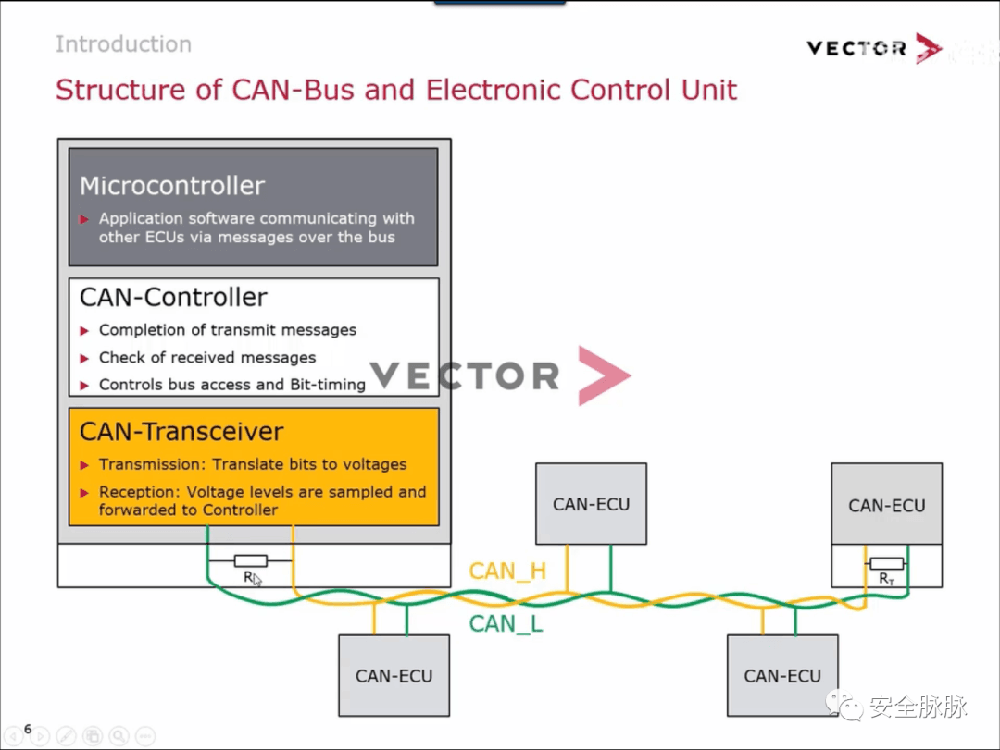

在一个 CAN 总线上，存在 CAN 传输器，CAN 控制器以及微控制器。CAN 传输器以及控制器负责建立 CAN 协议的底层规则，微控制器负责提取 CAN 协议部分并提供给应用程序使用。

## 寻址方式

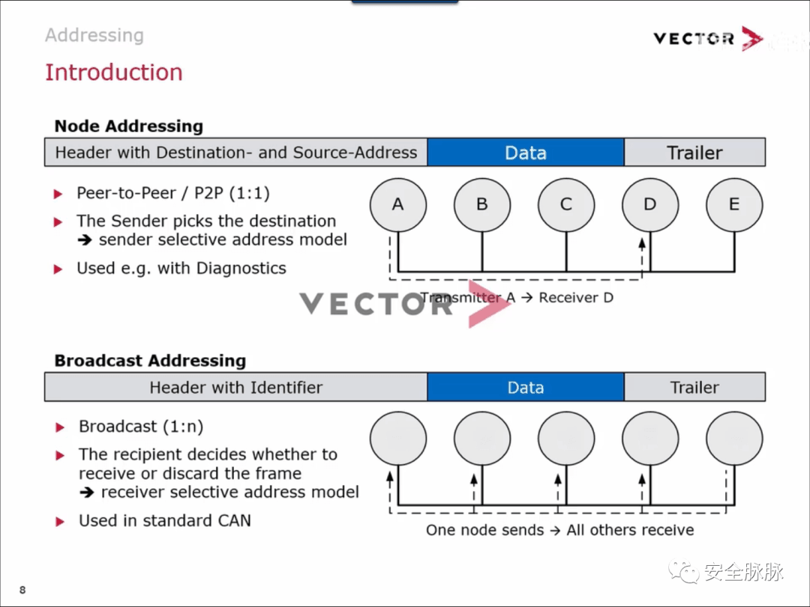

CAN 协议具备两种寻址方式一种是点对点传输，一种是广播传输。

## CAN 过滤器

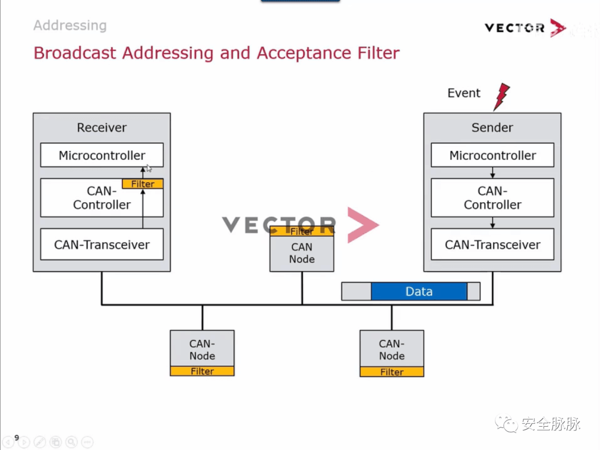

在 CAN 网络上控制器部分，实现了过滤节点，将不属于自身以及自身不感兴趣的报文进行过滤。

## 冲突访问与仲裁

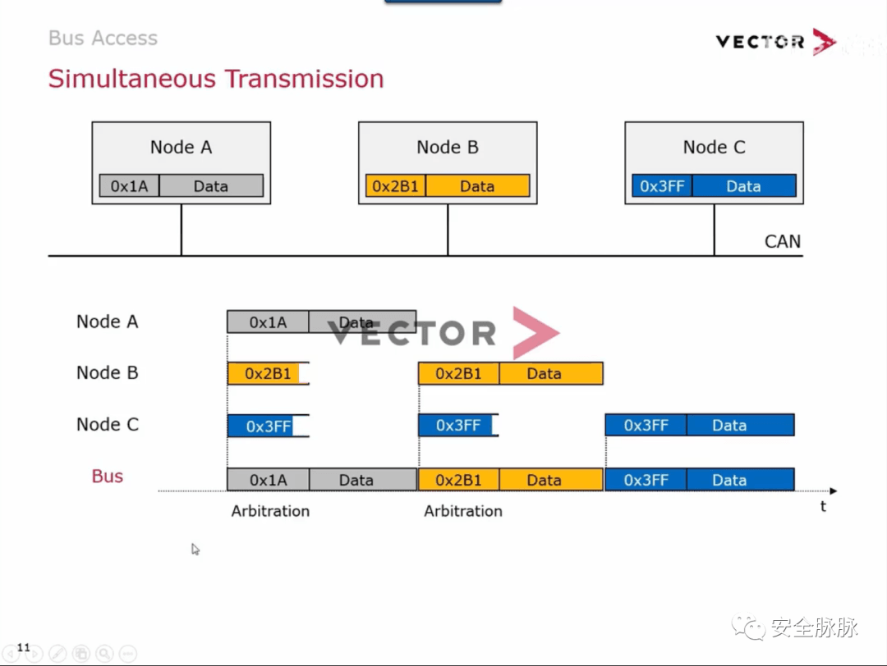

上图可以看出总线上三个节点同时发送报文，但是是由优先级的，谁先发谁后发都是有一定规则。

### 优先级裁定

显性与机制

不同节点同时发送数据，0 为显性位，1 位隐形位。将按照$1 & 0$的方式来确定发送优先级，仲裁优胜一方将继续发送并仲裁，另外一方将从发送节点转为接收节点，上图的节点 A 仲裁输了，将转换身份从发送节点转变为接收节点。随后 B,C 节点继续仲裁。

#### 优先级

介于仲裁优先级判断方式，*CANID*越低优先级越高。

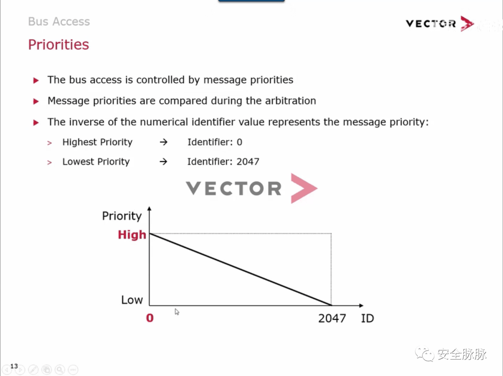

## 报文协议

| 名称  | id 长度 | 数据长度 | 常见度 |
| --- | --- | --- | --- |
| 远程帧 | 11 位 | 0   | 不常见，仅起请求作用 |
| 标准帧 | 11 位 | 64 位 | 常见  |
| 扩展帧 | 29 位 | 64 位 | 商用车常见 |
| 扩展远程帧 | 29 位 | 0 位  | 极少见 |

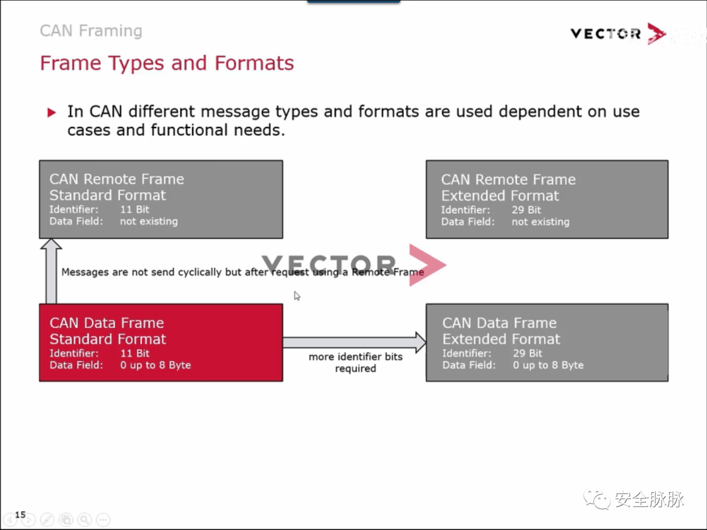

### 完整的一帧 CAN 报文

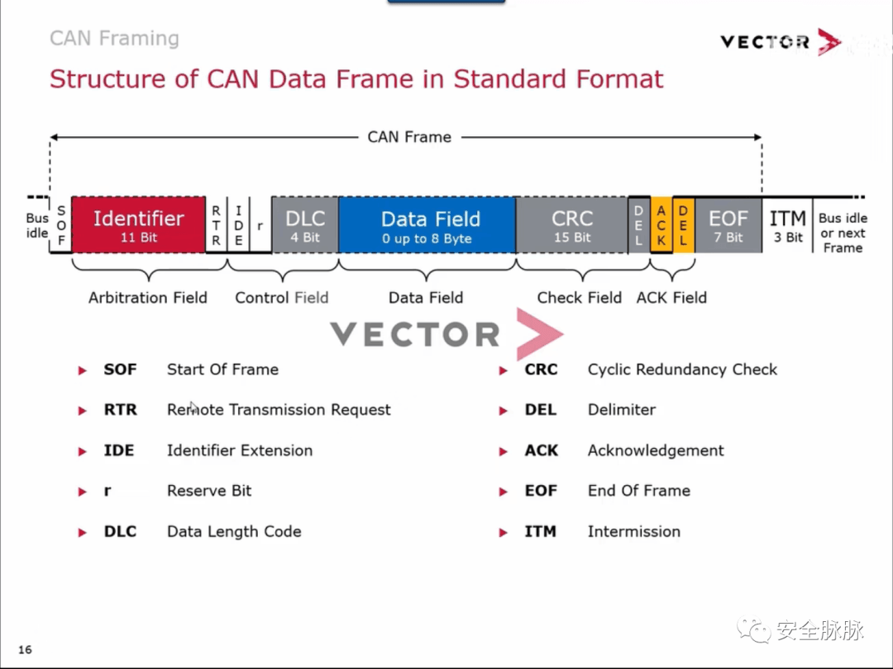

### 帧起始 (*SOF*)

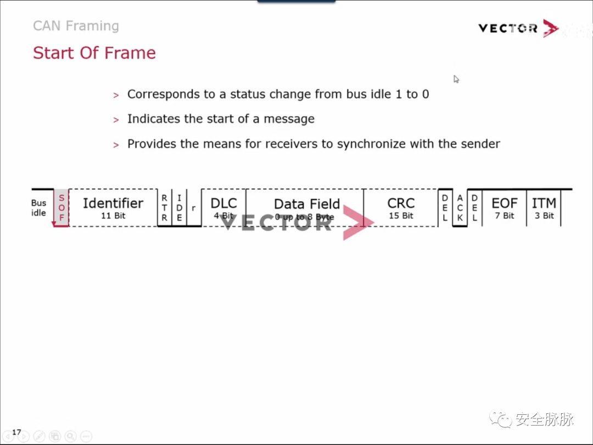

发送节点设置起始为 0，表示总线非空闲。接收节点与发送节点做硬同步。

### 标识 (*Identifier*)

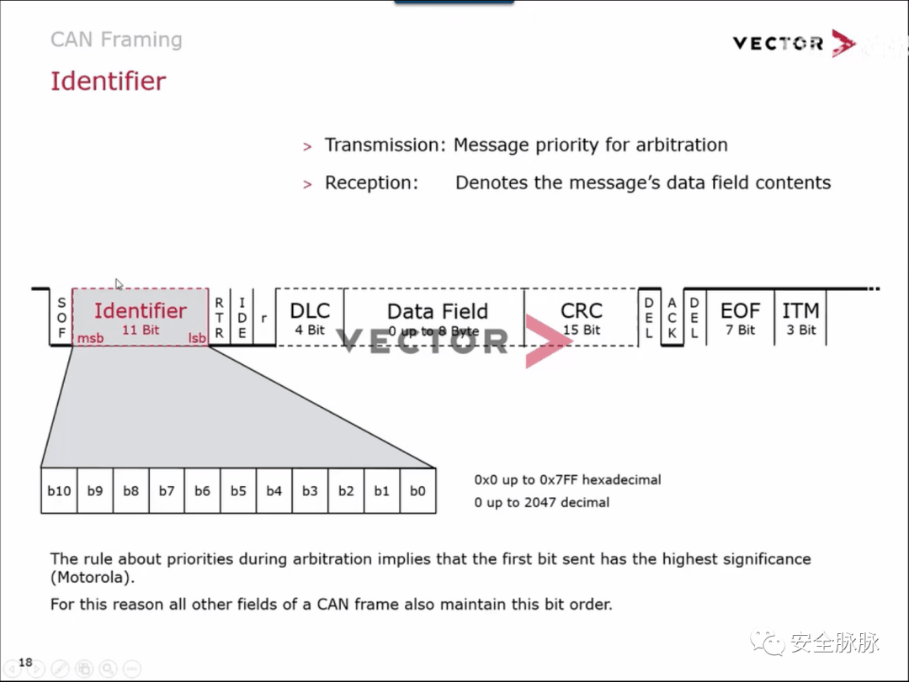

### 远程传输请求 (*RTR*)

-   0 表示此帧是数据帧
-   1 表示此帧是远程帧

### 标识扩展 (*Identifier Extension*)

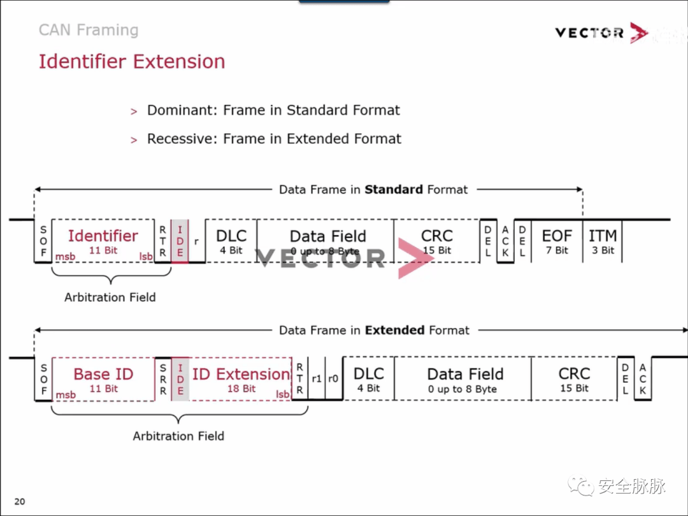

-   0 表示此帧是标准 CAN 报文
-   1 表示此帧是扩展 CAN 报文

#### 扩展帧的远程请求位 (*SRR*)

在**扩展帧**状态下，*SRR*位与*RTR*的作用相同，都是表示此帧是否是一个远程帧。

### 保留位 (*r*)

此位是存在标准帧上无意义，一般为 0。在 CANFD 时对此进行重新定义。

### 数据长度与数据 (*DLC*)

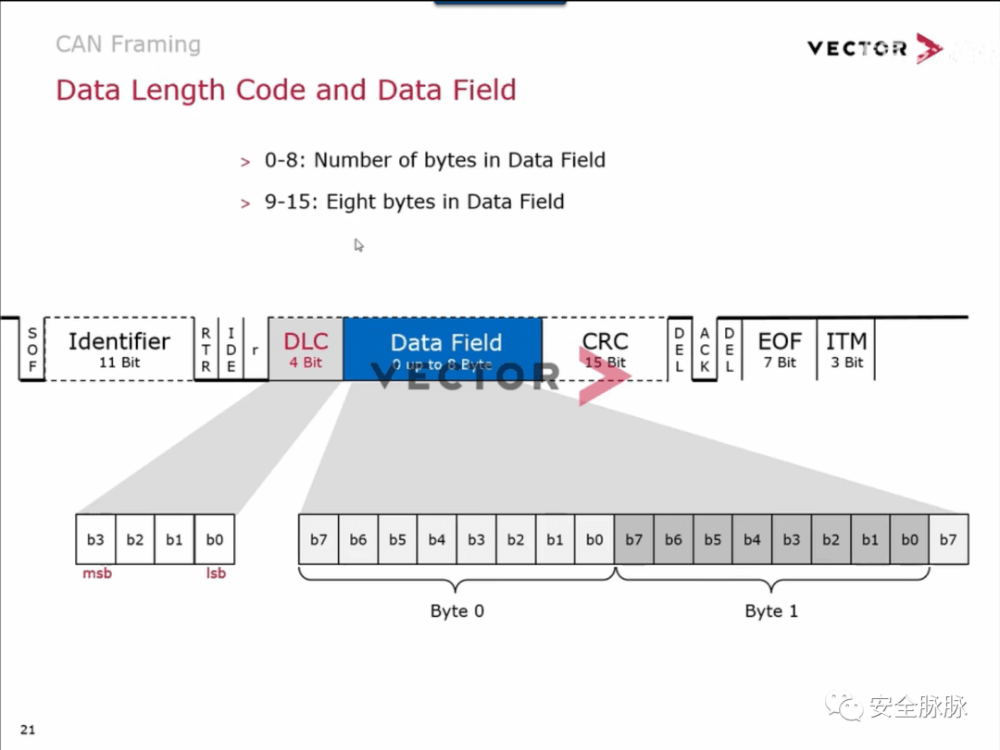

此域总共 4 位可以表示 0-15 个整数。

-   0-8 表示实际数据段的字节数
-   9-15 表示数据段有 8 个字节

在 CANFD 中将数据段可以扩展到 16 个字节。

### 循环校验 (*CRC*)

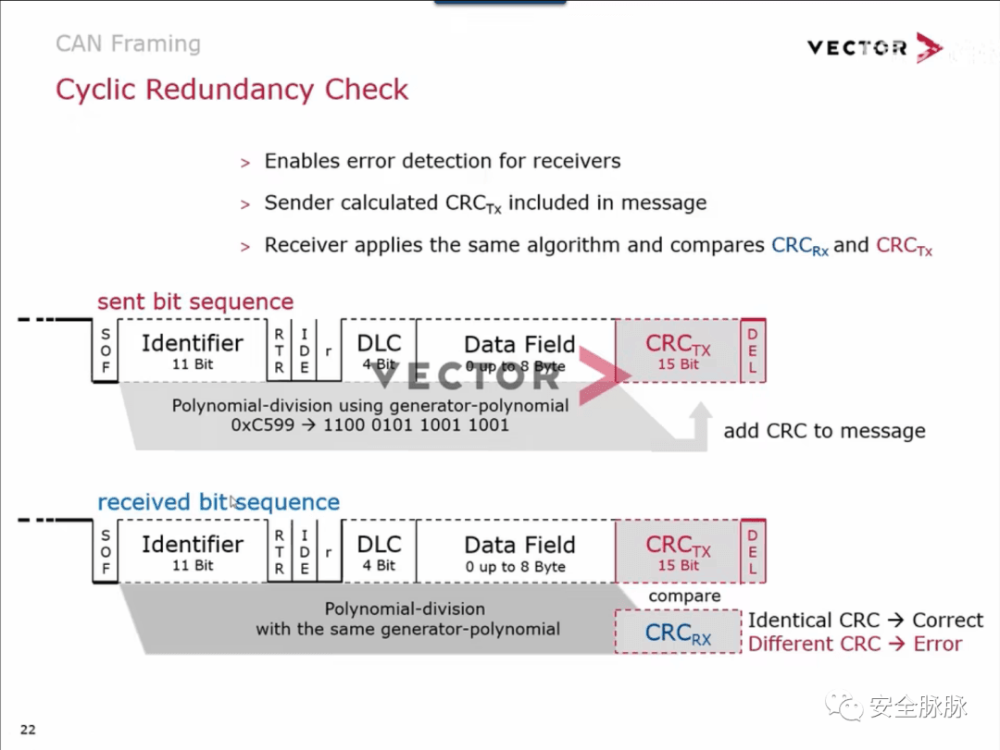

发送节点计算从*SOF*到数据部分的校验值存入*CRC*字段中。接收节点按照同样的算法进行计算并与*CRC*中的值进行比较。

### 界定符位 (*DEL*)

固定格式 1，目前无实际意义。

### 应答位 (*ACK*)

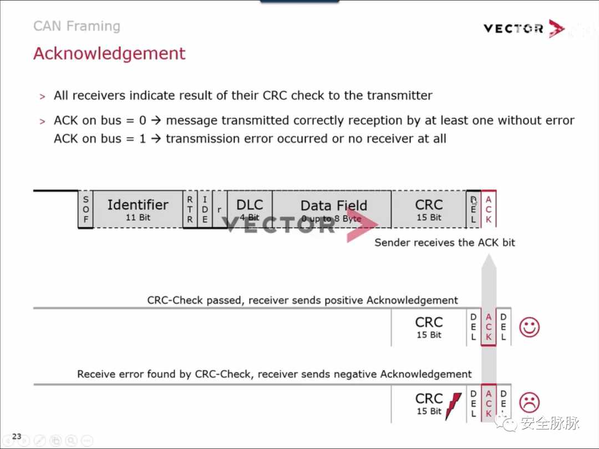

接收节点会根据 CRC 得校验来设置*ACK*位来表明传输是否存在错误。

-   0 表示成功
-   1 表示失败

发送节点在发送帧之后会接收回应帧，如果*ACK*位为 0，则表示发送数据成功，它会继续发送。如果为 1，则发送节点会停止发送并再之后发送一个错误帧。

### 界定符位 (*DEL*)

固定格式 1，目前无实际意义。

### 结束位 (*EOF*)

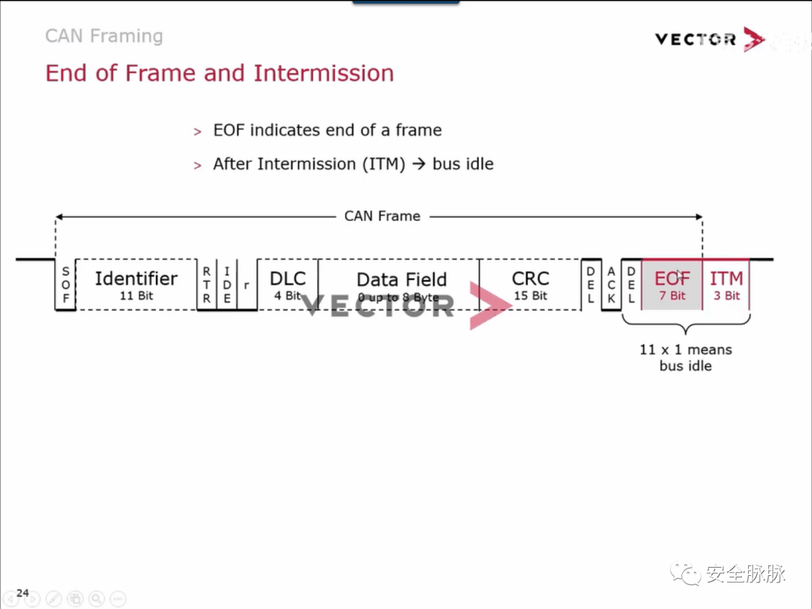

*EOF*是连续的 7 个 1 表示一帧的结束。*ITM*是帧间隔，是三个 111，紧跟在每帧的*EOF*后。

## 总线空闲

因为*DEL* + *EOF* + *ITM*一般是连续 11 个 1。所以在检测到总线上存在连续 11 个 1 时，即表示总线空闲。当有节点检测到总线上连续 11 个 1 时既可以在总线上发送数据。

这里就造成了一个问题，如果在一帧报文中出现 11 个 1 的话如何解决。这里就涉及到位填充的机制了。

## 位填充

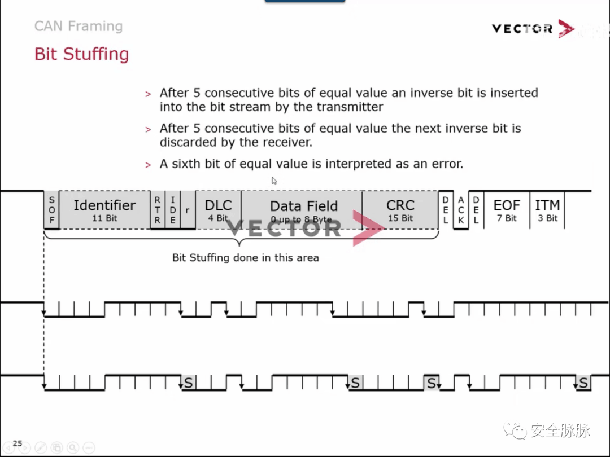

在总线上，如果存在连续 5 个 1 或者 0，那么会在随后插入一个相反的位。填充范围是从*SOF*开始到*CRC*结束。也就是说报文区域不可能存在连续相同的位。从上图可以看出，连续存在是包含了插入相反位的状况，也就是说连续五个 1 后，插入一个 0，如果报文正常时跟的连续 4 个 0，那么加上插入的 0 又构成连续 5 个 0，那么就又插入了 1。下图清晰的展示了这种情况。

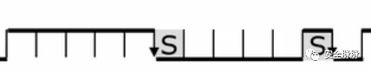

## 数据保护机制

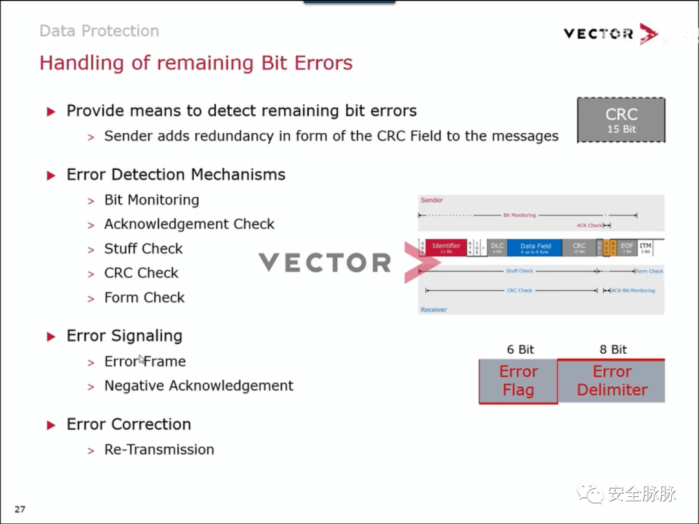

以下列出了几种检测手段。

-   位检查
-   ACK 回应包
-   ACK 回应位检查
-   CRC 校验
-   位填充
-   格式检测

ACK 回应包，CRC 校验，位填充。都在以上小节叙述过了，下面小节讲解位检查、格式检查以及 ACK 回应位检查。

### 位检查

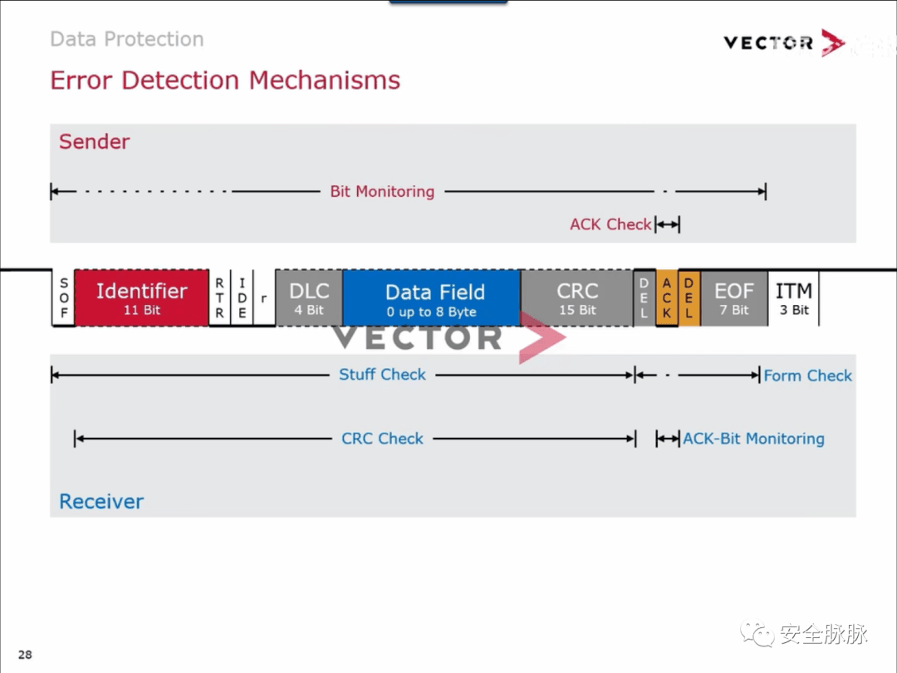

发送节点通过位监控的手段来检测是否发送错误，具体原理就是检测回应报文是否与发送一致。这里分几个部分，在上图中在仲裁场也就是*Identifier*+*RTR*部分（图中显示为虚线）如果发 1 读 0，不会认为这事一个位错误，当作仲裁失败处理。但是发 0 读 1。在*ACK*部分也是虚线表示，因为*ACK*是返回 0 表示回应正确。1 表示错误，所以发 1 读 0，是没有错误的。

### 格式检测

格式检测就是检测两个*DEL*位以及*EOF*位是否为 1，这样的固定格式。如果检测到错误则会发送错误帧。

### ACK 回应位检查

ACK 回应检查一般由接收节点来填充回应，当它发送了回应包，它也会回读总线上的回应包，如果它发送的是 1，回读到的是 0，那么它会认为破坏了帧的内容，则这个节点就会在下一帧发错误帧。

## 错误帧

当一个错误被检测到，那么错误帧会在下一刻立即发送。这里除了 CRC 校验错误。CRC 校验错误会在返回给发送节点之后，由发送节点判断 ACK 位是否为 1 来确定是否发送错误帧。

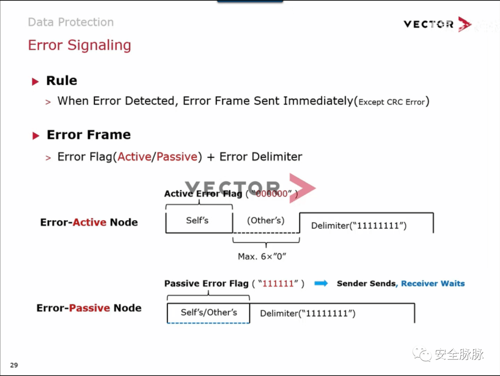

### 错误帧格式

错误帧是由错误标志位 + 错误界定符组成。错误标志位由主动状态与被动状态组成。

#### 主动错误状态 (*Error-Active Node*)

在主动检测到发送存在错误时，节点会发送 6 个 0 的测试标志位 +8 个 1 的错误界定符，但是可能总线上存在其他节点也在发送主动错误帧，所以这里的错误标志位可能不止 6 个。

#### 被动错误状态 (*Error-Passive Node*)

在被动错误状态，将发送 6 个 1 的测试标志位 +8 个 1 的错误界定符。如果是发送节点它的错误状态是直接可以发出来的，但当接收节点处于被动错误状态时，检测到错误，它发送的错误帧可能会被其他节点的发送覆盖掉，所以它只能等待处于主动状态的节点发送 6 个 0 后，它再发送 6 个 1。

### 错误帧例子讲解

首先假设所有节点都处于主动状态，也就是说当它们检测到错误后，会连续发 6 个 0 和 8 个 1。下图展示了，当发送节点发送数据 3 个 1 后又发送了 1 个 0，但是根据位监控机制回读总线上读出来是 1。

那么它会发送 6 个 0 与 8 个 1，表示错误。

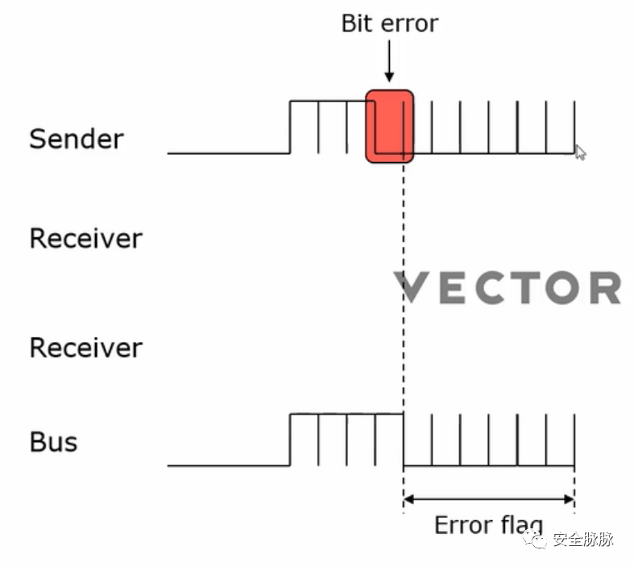

但是接收节点读取总线数据，它读到错误发送 1，它是不知道 1 是错误的。它继续读取直到读取到连续的 6 个 0。由于位填充规则总线上是不可能有连续 6 个相同的位的。破坏了填充规则。

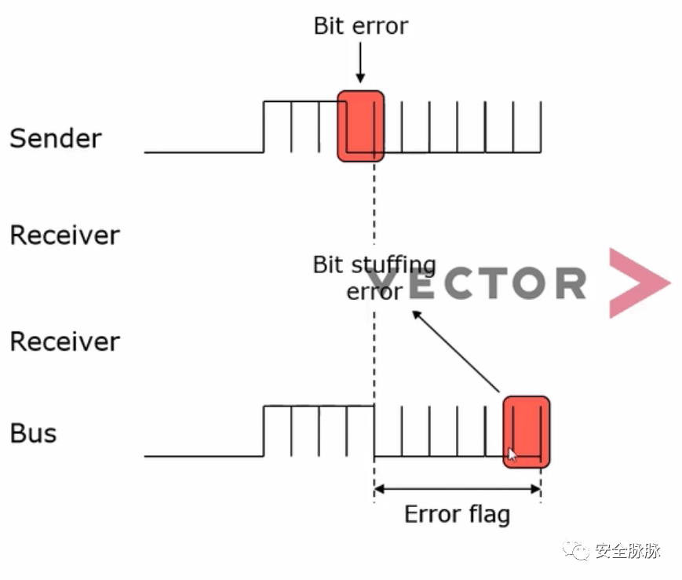

它会任何这是一个错误，它会发送一个 6 个 0 加 8 个 1 的主动错误帧。从下图可以看出是所有接收节点都会这样去做。

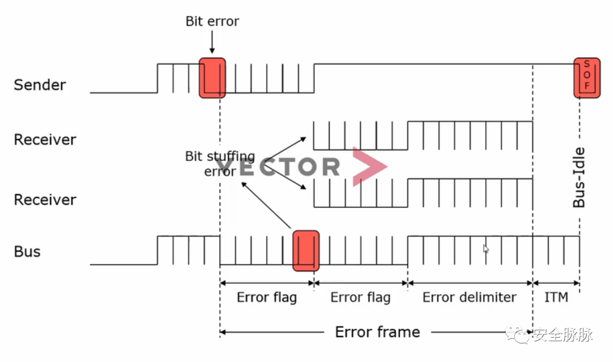

那么此时错误帧可能存在连续 12 个 0 外加 8 个 1。最后会再填充 3 个 1 的帧间隔，总共连续 11 个 1，那么总线又进入一个空闲状态。那么发送节点会将这帧进行重发。从上图可以看出，再出现错误时，只要是参与通讯的节点都会发送错误帧。

### 错误状态判断

下图展示了主动错误状态与被动错误状态的转换。可以看出总共有三种状态，那么一个节点就有这三种状态。

1.  主动错误状态
2.  被动错误状态
3.  BUS OFF 状态

在每个节点内实现了两个寄存器，一个是 TEC（发送错误计数器）一个是 REC（接收错误计数器）。节点内部通过这两个计数器的数值来完成两个错误状态的切换。当**TEC 与 REC 都小于等于 127**时，节点处于主动错误状态，当**TEC 或者 REC 数值大于 127**时，状态切换到被动错误状态，当**TEC 和 REC 都小于 128 时**节点又切换回主动错误状态，当处于被动错误状态时，**TEC 大于 255**那么会切换到 BUSOFF 状态，在 BUSOFF 状态，或者通过软件重置或者等待连续 128 组 11 个 1 后转为主动错误状态。

在 CAN11898-1 中明确定义了 TEC,REC 的数值说明。简要来讲就是当一个节点成功发送一帧报告，那么它的 TEC 与 REC 的计数就减 1。发送节点在发送数据后检测到错误，那么它的 TEC 就会加 8。接收节点率先检测到错误之后它的 REC 就会加 8。如果在其他节点检测到错误帧的状况下，又检测到错误那么它的 REC 就会加 1。具体可参见标准。

### 主动错误状态与被动错误状态的不同

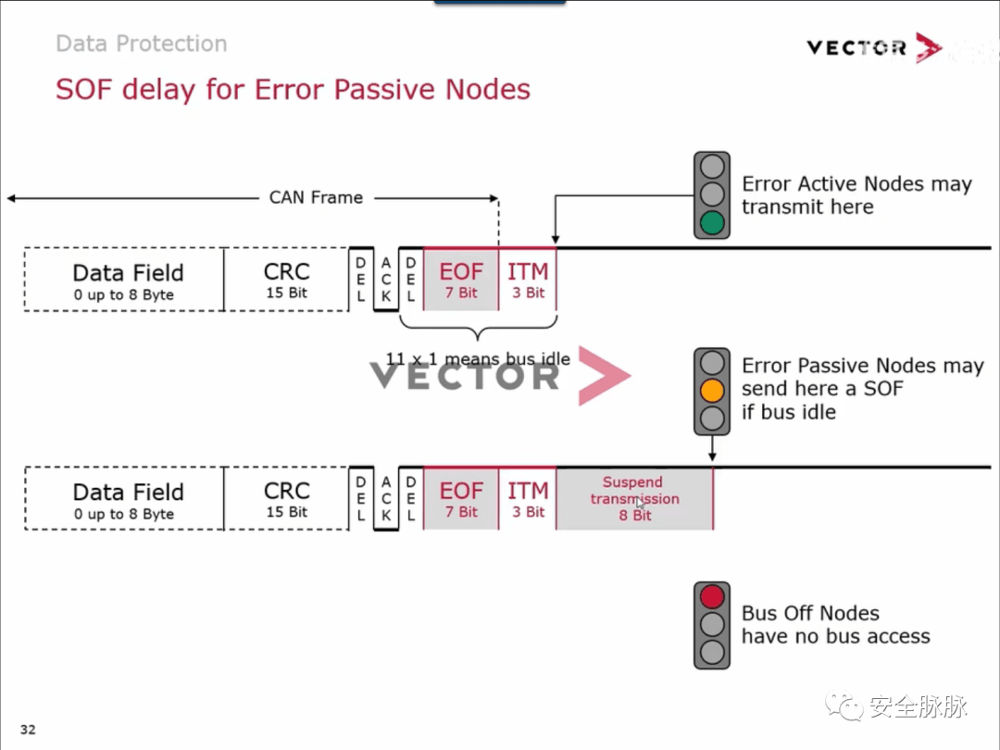

三种错误状态的不同，在主动错误状态的节点，就是正常的节点，收发都是正常的。但是当处于被动错误状态在检测到连续 11 个 1 的帧末尾后，它是不能直接发送数据的，它必须等待 8 位的空闲时间后再进行发送。这是对它的一个惩罚。当进入 BUSOFF 状态的节点那么是不允许它发送数据的。
