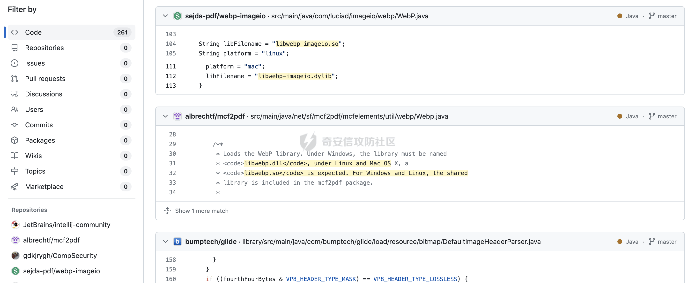
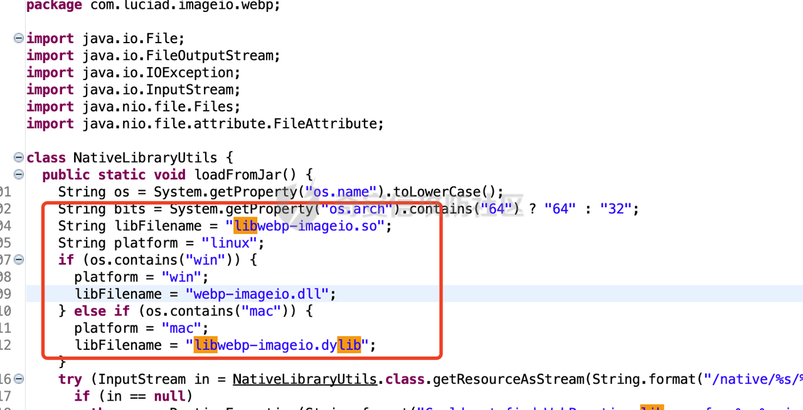
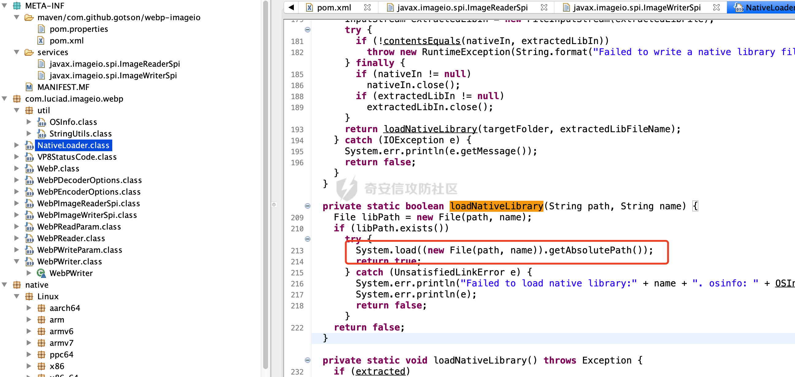
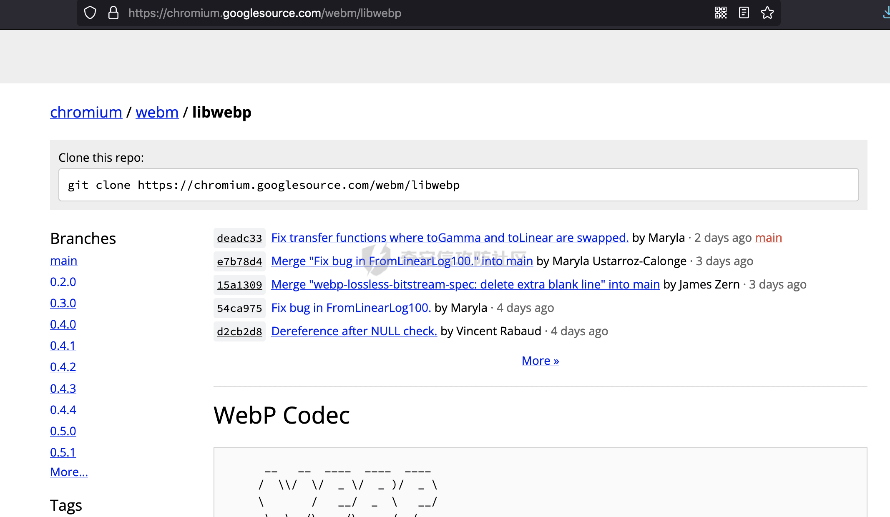
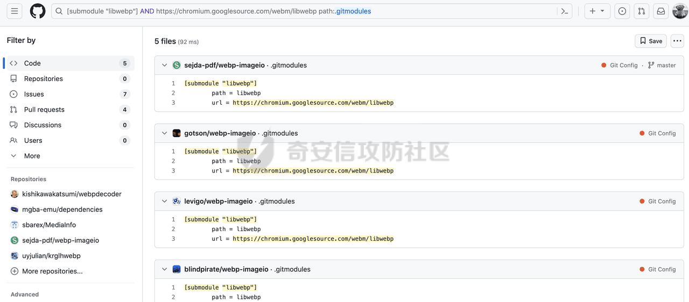
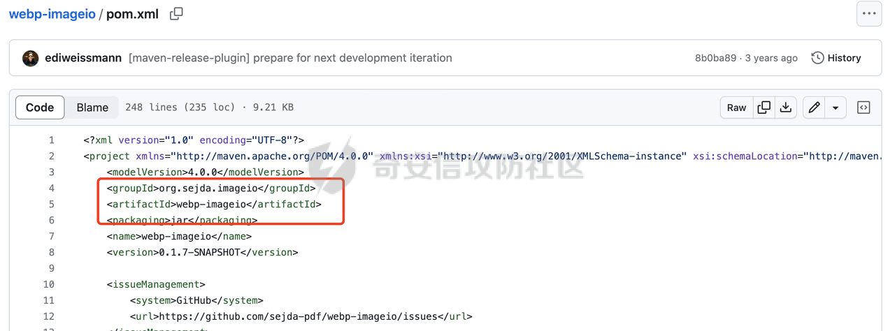
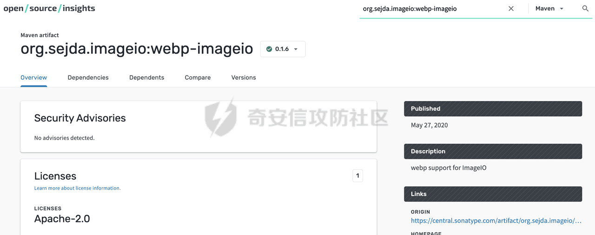
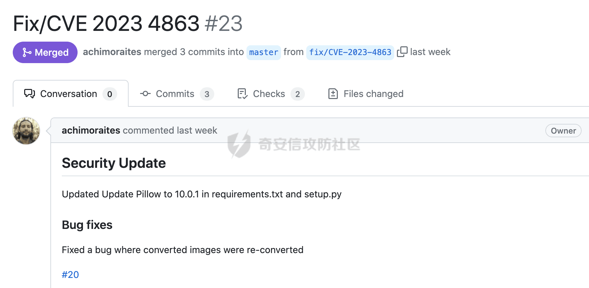

# 奇安信攻防社区 - 浅谈 Maven 三方包引入动态链接库排查方法

### 浅谈 Maven 三方包引入动态链接库排查方法

前段时间苹果、谷歌、Mozilla 和微软等公司积极修复了 libwebp 组件中的缓冲区溢出漏洞，Maven 中的不少依赖库也通过动态链接库的方式对 libwebp 进行了封装调用，跟在 pom 中直接/间接依赖不一样，这种问题可能更加复杂，快速找到这些引入了漏洞缺陷的依赖库并进行升级修复是很重要的。

# 0x00 前言

前段时间谷歌披露了 WebP 组件的高危漏洞 CVE-2023-4863。该漏洞是由于 BuildHuffmanTable() 填充二级表时，可能会出现写入越界，利用该漏洞可以在目标系统执行任意代码。

```php
Libwebp是一个开源的用于编码和解码WebP图像格式的C/C++库。它提供了一组函数和工具，用于将图像数据编码为WebP格式，并将WebP格式的图像解码为原始图像数据。Libwebp库可以作为其他程序的依赖库，用于添加WebP图像格式的支持。Libwebp应用范围非常广泛，被使用到各个软件上面。
```

因为 libwebp 是针对 webp 图像格式解析的基础库，服务端应用也可能受到影响。除了上层应用会直接依赖外，可能存在被其他组件封装的情况，例如 Java 的很多三方包（公司之外的开源库，比如 apache、ibm、google 等发布的依赖）是通过 Maven 维护的，其中的不少依赖库也通过动态链接库的方式对 libwebp 进行了封装调用。

跟在 pom 中直接/间接依赖不一样，这种问题可能更加复杂，没办法通过类似 Maven 的依赖项插件或者 IDE 的依赖视图进行排查。如何快速找到这些引入了漏洞缺陷的依赖库并进行升级修复是很重要的。


# 0x01 排查方法

下面从代码的角度列举几种排查的方法：

## 1.1 解压后对二进制文件进行特征匹配

类似 jar/war/aar 包，可以进行解压提取，然后通过 strings、fgrep 等方式对二进制文件进行特征查找。

例如 org.sejda.imageio:webp-imageio 解压后的内容包含 libwebp 的动态链接库，此时可以对二进制文件进行特征查找：


Maven 维护了一个中央仓库（repo1.maven.org），所有第三方库将自身的 jar 以及相关信息上传至中央仓库，Maven 就可以从中央仓库把所需依赖下载到本地。这里可以爬取对应的依赖进行解压分析，但是这种缺点是太慢且占用资源。

## 1.2 Github 关键字搜索

首先最容易想到的就是代码关键字搜索，但是这里容易引入大量的误报，需要大量的人力进行复查。这里提供几个思路，在一定程度上减少误报问题。

-   **检索动态链接库文件名**

动态链接库是一种包含可执行代码和数据的文件，用于在程序运行时加载和执行函数和资源。这些文件**在不同操作系统上有不同的扩展名**，例如 Windows 平台上的 DLL，Linux 和 Unix 平台上的 So 还有 macOS 平台上的 dylib。通过这个特征结合正则表达式可以进行简单的搜索。

同样的以 libwebp 为例，在 github 中尝试搜索如下内容，通过正则匹配包含 "libwebp"关键字并以 ".so"、".dll" 或 ".dylib" 结尾的文件名或字符串：

```text
/libwebp.*.[so|dll|dylib]/ AND language:Java
```

以其中的结果 sejda-pdf/webp-imageio 为例：



可以看到该组件依赖在内部使用 JNI 来与 libwebp 进行交互：



-   **检索 README 中的关键描述**

`README` 是一个常见的文件，通常包含在软件项目的根目录中，其作用是提供有关项目的基本信息和文档。一般内容主要包括：

1.  **项目介绍**：通常包含一个简要的项目介绍，解释项目的名称、目的和背景。这有助于其他开发者或用户快速了解项目是什么。
2.  **安装和配置**：通常包含安装项目所需的步骤和配置说明。这可能包括依赖项的安装、环境设置和配置文件的说明。
3.  **使用说明**：提供了项目的基本用法和示例。这有助于用户了解如何使用项目，包括命令行选项、API 调用或其他用法示例。
4.  **贡献和开发指南**：一些 README 文件包含有关如何贡献到项目的信息，包括代码贡献、问题报告和代码风格指南。
5.  **许可证信息**：可能包含有关项目使用的许可证信息，以及如何合法地使用项目的细节。
6.  **版本历史**：一些 README 文件包含项目的版本历史，列出不同版本的改动和更新说明。
7.  **联系方式**：通常提供了项目维护者的联系信息，以便用户和贡献者能够获取支持或反馈问题。
8.  **其他信息**：具体内容可能因项目而异。有些 README 文件还包括关于项目结构、目录布局、测试方法、性能指南等其他相关信息。

同样以 libwebp 为例子，在一些项目的 README.md 文件中，如果引入了 libwebp，可能会在 README.md 进行相关的说明，方便后续的维护。此时就可以结合 github 的搜索语法进行搜索了。

若要在文件路径中搜索，需要使用 path: 限定符。这将匹配包含文件路径中任意位置的术语的文件。这里搜索条件可以设置  
为`https://developers.google.com/speed/webp/`,这里是 webp 的介绍，webp 是由谷歌推出的一种全新图片文件格式，而 Libwebp 是谷歌提供用于编码和解码 WebP 格式图像的库，README.md 很可能包含对应的介绍内容。

对应的查询语法

```text
https://developers.google.com/speed/webp/ path:README.md 
```

可以看到在检索出来的 usefulness/webp-imageio 项目的 README.md 的描述中提及了 webp 相关内容：


从 libwebp-jni 目录大致可以判断该项目 usefulness/webp-imageio 同样引入了 libwebp 动态链接库。

-   **检索 Java 调用动态链接库中的特征代码**

在 Java 中，可以通过 Java Native Interface（JNI）来调用动态链接库（DLL、SO、dylib 等）。JNI 允许 Java 代码与本地代码进行交互，从而调用本地库中的函数。例如一般情况下代码里会使用 `System.loadLibrary()`或 `System.load()` 来加载本地库。使 Java 虚拟机能够访问本地库中的函数。那么可以直接搜索对应的关键字，结合前面的两种思路综合进行判断。

例如 com.github.gotson:webp-imageio 中就包含了`System.load()`关键字，结合 native 目录中引入的 so 文件大致可以判断该组件引入了 libwebp 动态链接库：



## 1.3 Git:submodule 子模块

`.gitmodules` 文件是 Git 用于管理子模块的配置文件。子模块是一个包含在父 Git 仓库中的独立仓库，允许你在一个 Git 仓库中引入和管理另一个 Git 仓库的特定版本。通常包含以下信息：

1.  子模块的路径（path）：指定子模块在父仓库中的存放位置。
2.  子模块的 URL（url）：指定子模块的远程 Git 仓库的 URL。
3.  子模块的引用（reference）：指定子模块所使用的特定版本或引用。这通常是一个提交（commit）哈希值或分支名。

可以通过这种方式在项目中引入第三方库。

同样的以 libwebp 为例，`https://chromium.googlesource.com/webm/libwebp`是对应的代码仓库：



根据前面的分析，可以尝试如下查询：

```Plain
[submodule "libwebp"] AND https://chromium.googlesource.com/webm/libwebp  path:.gitmodules
```

查询结果如下，以 sejda-pdf/webp-imageio 为例：



项目中包含 pom 文件：



根据其 groupId 和 artifactId（org.sejda.imageio:webp-imageio）查询可知其是一个 Java 的依赖组件：



上面的查询语法里，`[submodule "libwebp"]`里的 libwebp 可能以任意字符命名，那么可以直接检索`.gitmodules`文件里的 url 信息：

```Plain
https://chromium.googlesource.com/webm/libwebp  path:.gitmodules
```


通过这种方式可以得到其他引入了 libwebp 动态链接库的依赖组件`com.github.usefulness:webp-imageio`。

这几种方法也是有缺陷的，虽然快但是不一定全。

得到这些存在风险的组件以后，可以监控相关作者安全版本的发布，及时升级到最新版本。对于不再维护的组件，及时寻找可行的替代方案，避免不必要的安全风险。

## 1.4 Pull Request

前面提到，获取到存在风险的组件以后，主要是为了获取到相关安全版本的发布，即使升级/替代对应的组件依赖，避免不必要的风险。

根据 GitHub 的官方文档，Pull Request 是一种通知机制，它可以告知仓库的其他开发者，推送了一个仓库新分支。通过 Pull Request，可以和仓库的协作者一起讨论和审查提交的代码，审查通过后，就可以提交到仓库的主分支中。

通过这个机制可以检索对应的 CVE 编号，查看相关仓库是否提交了对应的修复代码。及时跟进并升级存在风险的组件依赖。

同样以 libwebp 为例，对应的 CVE 编号为 CVE-2023-4863、CVE-2023-5129，那么可以进行如下的查询：

```http

https://github.com/search?q=CVE-2023-4863&amp;type=pullrequests
```

从查询的结果即可筛选出修复了对应漏洞的组件以及对应的安全版本：


例如 python 的 achimoraites/Python-Image-Converter 进行了对应的漏洞修复，这里也可以结合`language:Java`关键字筛选出 Java 相关修复了 libwebp 漏洞的组件：



但是通过这种方法查询，github 默认限制返回 1000 条，同时还有一定的风控策略，批量获取的话需要结合各种排序方式多获取几次然后进行进一步的去重。跟前面的几种检索方法一样，虽然快但是不一定全。

# 0x02 其他

除了上面提到的思路以外，还可以通过类似进程扫描、HIDS 信息收集等各方能力尽可能的获取对应的资产信息，在一定程度上尽可能的覆盖查找存在漏洞风险依赖组件。
