# 奇安信攻防社区 - 记一次 DebugBlocker 程序的分析

### 记一次 DebugBlocker 程序的分析

记录一下自己遇到 "Debug Blocker" 的分析过程。

# 记一次 DebugBlocker 程序的分析

## 前言：

DebugBlocker 是一种较为高级的反调试技术，前段日子朋友被问到相关知识就帮忙分析了一下，发现考察的是是这个知识点，调试下来确实繁琐，于是就有了这篇文章，仅复述一下我自己的分析过程。繁琐的原因可以归结为，自调试只是个手段，自修补才是核心，不让它自调试程序就不能补全自身。  
分析当中如有错误还请指正！

**样本 hash：**

| MD5 |
| --- |
| 6ddc62859c20aec71ccf25ea7e36fa5e |
| 06fa781ffddc810af6ff3b51ed861be6 |

## 开始分析：

程序主函数展现出的是很常规的 Windows 窗体程序代码，代表了其拥有一个图形化界面，并且接收并处理窗体消息：

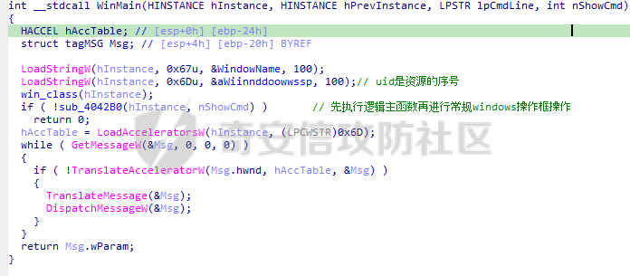

稍微值得注意一下的就是它注册了一个快捷键，但是该快捷键的也只是引导到菜单的关于框而已，并没有更多信息。

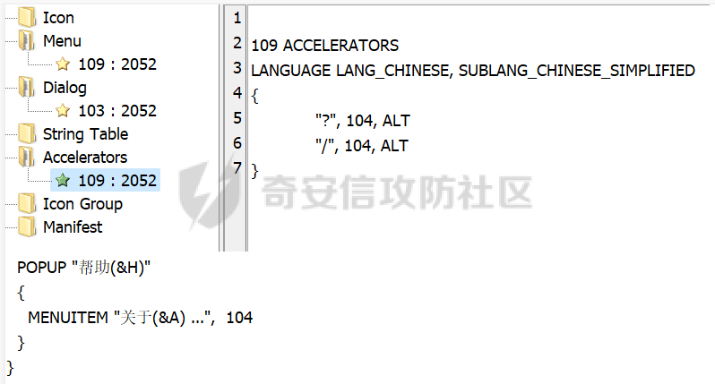

## 主要特征：

程序的第一个特点是多次使用 IsDebuggerPresent() 函数检测调试行为，并以此作为后续操作条件。绕过也非常简单，执行后修改 ZF 状态寄存器即可。


在逻辑构成方面，程序首先批量动态获取所需函数地址并暂存于变量中，使用的是相对简单的 LoadLibraryA、GetProcAddress 函数。而对应的 DLL 库和函数名都采用运行时异或解密的方式进行提取，相对常规。


  
在逐个获取并重命名所有动态获取的函数后，根据 API 参考文档格式化各个结构体的参数类型，处理后的结果大致如下所示。

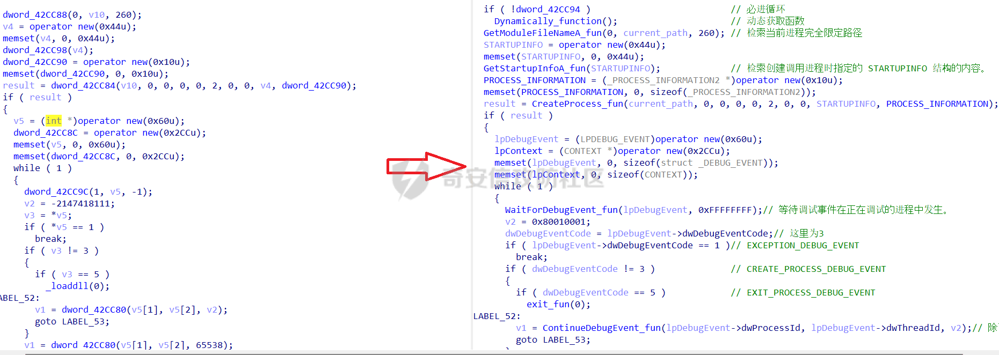

## DebugBlocker 反调试

从其前置逻辑处理中获知其以 DEBUG\_ONLY\_THIS\_PROCESS 模式开启并调试自身作为的子进程后，整个分析方向就变了。以调试模式启动的进程是没法再附加自己的调试器的，那就只能一边调试父进程，一边静态描绘出子进程的逻辑。


## 父子进程沟通：

从整体上来看，父子进程的信息沟通传递是通过 PROCESS\_INFORMATION、CONTEXT 和 LPDEBUG\_EVENT 这三个结构体来进行的。

### **结构体方面：**

#### **PROCESS\_INFORMATION：**

PROCESS\_INFORMATION 和 CONTEXT 搭配使用，因为其是调用 CreateProcess 函数时用于接收新创建的进程和首要线程的信息，主要包含用于标识被创建进程及其主线程的句柄。通过这些句柄和标识符就可以是获取和设置子进程（线程）的 CONTEXT 内容，从而进行下一步对 CONTEXT 的利用。

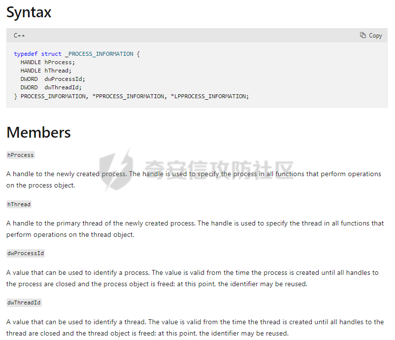

#### **CONTEXT**：

CONTEXT 包含了那个时刻的几乎所有寄存器的值，然而每个寄存器都有其特定的用途，所以可以定义程序很多关键的地方并进行处理，常用于执行很多系统内部操作。在本程序中主要使用的是 ESP、EIP、EAX 寄存器。


#### **DEBUG\_EVENT：**

DEBUG\_EVENT 用于记录和描述调试事件，由 WaitForDebugEvent 函数捕获子进程（线程）中发生的系统异常并填充到该结构体中。子进程首先在启动时会发生各种系统异常，这些异常会被父进程选择过滤掉，然后是程序中自行构造的异常，这些异常会被父进程捕获并由此进行下一步操作。

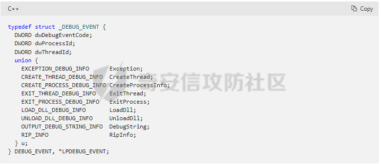


### **代码方面：**

#### 异常事件过滤：

在前面以调试模式启动进程后，父进程就开始通过 WaitForDebugEvent 函数捕获子进程的异常，并依据填充的 DEBUG\_EVENT 结构体中 dwDebugEventCode 字段值所代表的异常类型进行分类处理。

这些异常事件都是系统在初始化程序的过程会引发的，但只有 EXCEPTION\_DEBUG\_EVENT 事件能被进一步处理，因为程序自行构造异常的代码抛出的也是这个事件，在后面的代码中会有对该事件的来源和具体细节进行判定，从而过滤掉系统引发的部分。


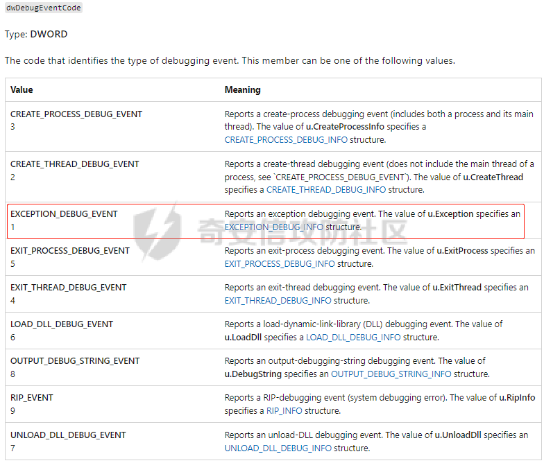

在前面得到 EXCEPTION\_DEBUG\_EVENT 异常后就开始进行来源和具体细节判定了，第一次判定是细分异常代码，0x80000003 代表的 EXCEPTION\_BREAKPOINT 常由 INT3 触发，这也是程序构造异常的方式。第二次是对异常发生的地址进行限制，sub\_409070 & 0xFFFF0000 是取高 4 位地址，也就是 0x40000，这是用户程序的装载基址。通过这两次限制后才得以确定进入到程序自定义的异常了，由此进入下一步操作。


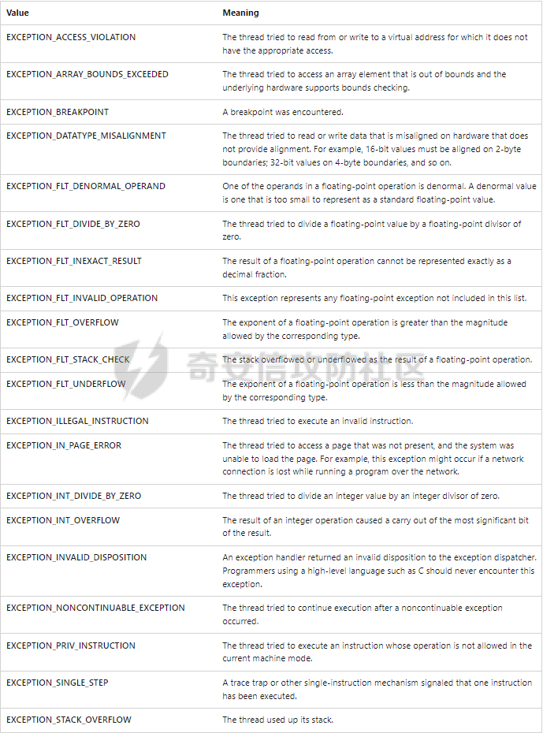

#### 子进程执行暂停和异常定位：

需要提及的是在 WaitForDebugEvent 函数捕获到异常后子进程是已经暂停了的，ContinueDebugEvent 函数用于恢复子进程执行流，但这是在后续操作实现完之后的。


在后续处理操作中，父进程通过 GetThreadContext 获取的子进程的 CONTEXT 上下文信息也是在发生异常的那一时刻的，对父进程下个断点，通过 CONTEXT 中 EIP 寄存器的值能定位到子进程发生异常的代码。


在反汇编窗口中跟踪 CONTEXT 结构，并在数据区覆盖上结构体即可查看对应的字段值。（对于那些有共用体 union 的结构体的话就得手动转换了，因为共用体依上下文来定，IDA 处理不了）

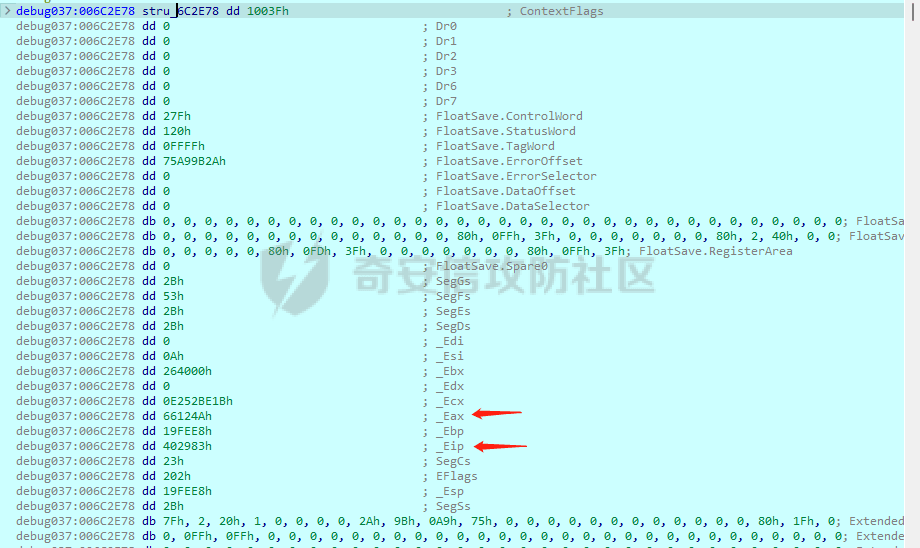

由此可以看到子进程的异常触发在 EIP = 0x402983 处，由于是父子进程都是同一个文件，所以在当前代码中定位到如下图所示。\_\_debugbreak() 在汇编中是一个简单的 int 3; 这就是程序构造异常的 EXCEPTION\_BREAKPOINT 异常。 （这里是程序的开头部分，下面的 sub\_402A50 就是逻辑主函数了，也就是我们上面一直在分析的函数）


#### 利用 CONTEXT 进行数据传递：

前面说过 CONTEXT 包含了那个时刻的几乎所有寄存器的值，在子程序发生异常被暂停时，子进程的数据传递就通过存放在寄存器来进行。上图有个匪夷所思的点就是在 \_\_debugbreak() 前面有一个 result = 0x66124A，在汇编层面上这是对 eax 的赋值，第一次看的时候我还很懵逼，后来才发现这是子进程特地存放在 CONTEXT 结构体中传递给父进程的。


父进程在每一次捕获到子程序自定义构造的 int3 EXCEPTION\_BREAKPOINT 异常之后，都会提取子进程 CONTEXT 上下文，获取其上一行代码所插入的 EAX 值并作为条件执行依据以进行后续操作。

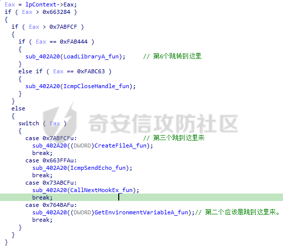

## 恢复控制流和程序代码：

子进程的每一次异常中断都会交付给父进程进行处理，父进程获取子进程 CONTEXT->EAX 值来进行条件跳转。通过 WriteProcessMemory 函数和 CONTEXT->ESP 的值修改子进程的堆栈，从而恢复原有代码。再通过改写 CONTEXT->EIP 的值来恢复控制流。

这也就是为什么在没有设立互斥体和分支语句的状态下程序不会无限递归地创建自身。

### **外层：**

这里说的外层是指第一层的手法，因为内层中有点不同，所以区分开来写，具体如下所示：

#### 栈替换：

第一个条件跳转中执行如下图所示的部分，其中第一行的 sub\_404070 就是程序的原有代码（这点在后面会详细分析）。


第一个 WriteProcessMemory 函数把 sub\_404070 写入到了 ESP-8 的位置，第二个 WriteProcessMemory 函数把 EIP 所指向的 0x402983 的 INT 3 代码位置的**下一行**写入到 ESP-4 中（就是 jmp <return> ）。


然后把原堆栈指针 ESP 值往后移动了 8 位，那现在堆栈值就变成如下所示：


最后一行的修改 EIP 值比较有意思，lpContext->Eip = (DWORD)sub\_4029A0 中，sub\_4029A0 是一个“空函数”，这里一开始我也不知所云，但是后来发现这是在构建不平衡栈。


#### 不平衡跳转：

正常来说一个函数由 call 指令调用，调用时会压入下一行指令地址。在函数内部堆栈通常是平衡的，入栈出栈都会成对出现，call 指令和 retn 指令相对，retn 语句相当于 POP EIP，把控制流指向函数的下一行地址。

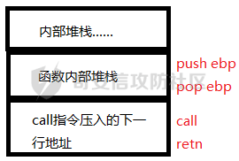

关键就是上面的 lpContext->Eip = (DWORD)sub\_4029A0 中，直接把 EIP 指向了函数内部，也就是缺少了 call 指令，retn 单独出现，由于前面栈替换和 ESP-8 的栈指针移动，等到函数内部处理完后，此时的栈顶就是 sub\_404070 函数了。通过这种不平衡的函数构造，实现了控制流跳转。

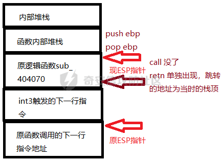

但是这种不平衡会在最后变回正常，因为原 ESP 指针指向的就是 int3 触发所在的函数调用时压入的下一行地址。

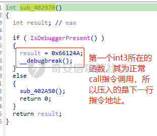

#### 下一次循环：

前面所说的操作都是在子进程产生异常后，父进程对其异常的捕获和内存修改。在循环中，对子进程每一次异常的捕获都会进行一系列操作：子进程暂停——>CONTEXT 信息传递——>子进程控制流恢复——>子进程代码修改——>恢复子进程执行。

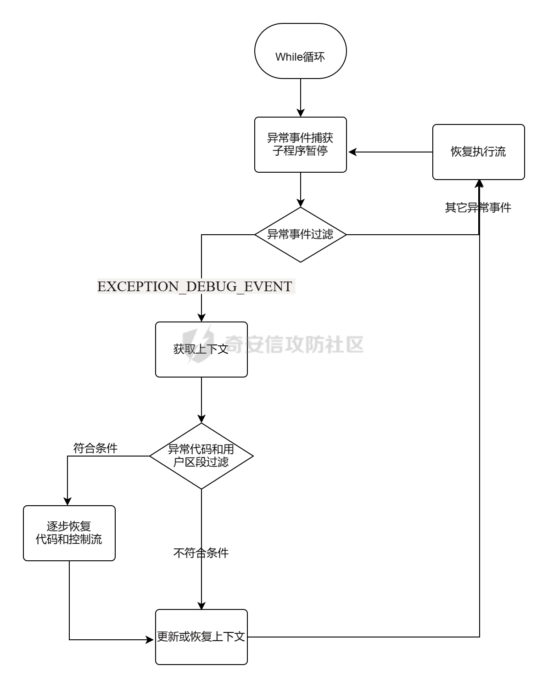

### **内层：**

内层恢复是指在原逻辑函数 sub\_404070 中的操作，在该函数中所有字符串都由数组动态异或解密而来。而在反编译中这些函数都是没有参数的，原因就是参数传进去后没有被调用，所以 IDA 省略了这些参数。


  
进入到这些函数后会发现都是同样手法构造的 int3 异常，和 eax 的赋值。跟随外层 switch 语句后发现传入的参数为最开始动态获取参数的地址，说明这是要被恢复的函数。

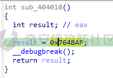


在该函数内部是也是在外层不平衡栈的基础上再继续附加，也都是 EIP 直接指向函数开头的不平衡调用，稍微不一样的就是这里是 ESP-4 的栈，每次函数调用完后再继续利用此区域，直到 Sub\_404070 函数执行完为止。


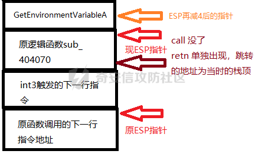

## 原逻辑分析：

在用前面“恢复控制流和程序代码”的“内层”章节中已解释了原逻辑函数中对函数的替换操作，下面是替换后的程序。


关键的点是解密了一个 system.dll 的文件内容并下放到前面获取的 temp 环境变量目录下。


对该导出函数进行分析后发现主要逻辑在 load 函数中，而 load 函数中的代码也是动态异或解密出来的


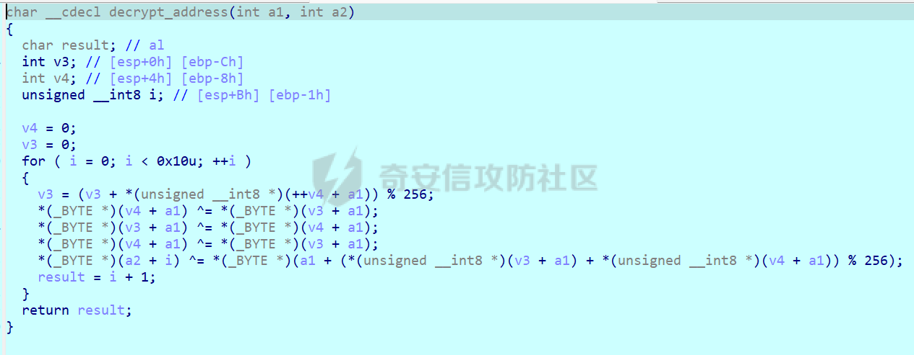

进入到 load 函数中答案基本就出来了，因为考察的是前面的 DebugBlocker，附上解密脚本，细节不再深究：

```python
a1 = [0xB0, 0x89, 0x4C, 0x82, 0x55, 0x88, 0x49, 0xE9, 0xEA, 0x5A, 
  0xC7, 0xE2, 0x23, 0x66, 0xF3, 0x17, 0x67, 0x06, 0xCF, 0x64, 
  0xB6, 0x1B, 0x4D, 0xD7, 0xC8, 0x7D, 0x9A, 0xAF, 0x8B, 0xEB, 
  0x2B, 0x37, 0xDB, 0x9E, 0x28, 0xBD, 0x40, 0x20, 0xC4, 0x02, 
  0x14, 0xAD, 0xBB, 0xF0, 0x1F, 0xB7, 0xF5, 0x8F, 0x6B, 0xDC, 
  0x05, 0x25, 0xAC, 0x81, 0xE0, 0xB3, 0xA5, 0x21, 0x72, 0xEF, 
  0xEE, 0xDE, 0xA9, 0xA8, 0x7B, 0x7E, 0xD5, 0xD9, 0x63, 0xD0, 
  0xE5, 0x6D, 0x24, 0x68, 0xB5, 0x11, 0x27, 0x57, 0x51, 0x8E, 
  0x86, 0x44, 0x87, 0x26, 0x5D, 0x56, 0x7A, 0xA6, 0xE6, 0xCC, 
  0x65, 0xC6, 0x03, 0xDF, 0x3A, 0xCB, 0x7C, 0x79, 0x07, 0x19, 
  0xFE, 0x73, 0x0D, 0x3D, 0xD6, 0xD1, 0xED, 0x74, 0x35, 0x29, 
  0x4B, 0x6C, 0x42, 0x5B, 0xC5, 0xA2, 0x34, 0x3E, 0xDA, 0xBA, 
  0x7F, 0xE1, 0x9F, 0xBE, 0xFB, 0x85, 0x5F, 0xA4, 0x3F, 0xFD, 
  0xE8, 0x77, 0x04, 0xFC, 0x80, 0x09, 0xAB, 0xF1, 0x1C, 0xB1, 
  0xD4, 0x94, 0x9D, 0x1A, 0x13, 0xA7, 0x62, 0xCD, 0x39, 0x54, 
  0x4F, 0xF7, 0x0F, 0x2E, 0x31, 0x38, 0x30, 0x52, 0xF4, 0x8A, 
  0x46, 0x76, 0x01, 0x48, 0x5C, 0x96, 0xF2, 0x0B, 0x8D, 0x1E, 
  0x18, 0xF8, 0xF6, 0x70, 0x2D, 0xA0, 0xAE, 0x59, 0xB8, 0x78, 
  0xB2, 0x12, 0x3B, 0x33, 0xB4, 0x9C, 0x2A, 0x0C, 0xCA, 0x4E, 
  0x5E, 0x6F, 0x4A, 0xC1, 0xEC, 0xBC, 0x69, 0xFA, 0x98, 0xBF, 
  0x1D, 0x43, 0x0A, 0x53, 0x92, 0xC9, 0x0E, 0x45, 0xDD, 0xC2, 
  0x47, 0xD2, 0x90, 0x91, 0xF9, 0x2F, 0x6A, 0x22, 0x41, 0x50, 
  0x08, 0xA1, 0x6E, 0xE7, 0x8C, 0x10, 0x93, 0x71, 0xD8, 0x16, 
  0x36, 0xC3, 0xCE, 0x97, 0xE3, 0x32, 0xC0, 0xA3, 0x75, 0xFF, 
  0xAA, 0x9B, 0x61, 0x83, 0x84, 0x3C, 0x60, 0x95, 0xB9, 0x58, 
  0x2C, 0xD3, 0x15, 0x99, 0xE4, 0x00]
a2 = [0xa9,0x97,0x70,0x29,0xed,0x3a]

a3 = a1        
v3 = 0
v4 = 0
result = 0
for i in range(6):
  v4 = v4 + 1
  v3 = (v3 + a3[v4]) % 256
  a3[v4] ^= a3[v3]
  a3[v3] ^= a3[v4]
  a3[v4] ^= a3[v3] 
  a2[i] ^= a3[(a3[v3]+a3[v4])%256]
  result = i + 1
#print(''.join(chr(i) for i in a2))
print(a2)
```

## 参考链接：

[https://forum.butian.net/share/1754](https://forum.butian.net/share/1754)  
[https://bbs.kanxue.com/thread-273294.htm](https://bbs.kanxue.com/thread-273294.htm)  
[https://www.anquanke.com/post/id/100115](https://www.anquanke.com/post/id/100115)  
[https://blog.csdn.net/qq\_39249347/article/details/108579376#t0](https://blog.csdn.net/qq_39249347/article/details/108579376#t0)  
[https://www.cnblogs.com/MousseLee/p/16439115.html](https://www.cnblogs.com/MousseLee/p/16439115.html)  
[https://www.freebuf.com/articles/others-articles/181085.html](https://www.freebuf.com/articles/others-articles/181085.html)  
[https://zhuanlan.zhihu.com/p/120189651](https://zhuanlan.zhihu.com/p/120189651)  
[https://bbs.kanxue.com/thread-267013.htm](https://bbs.kanxue.com/thread-267013.htm)  
[https://bbs.kanxue.com/thread-10670.htm](https://bbs.kanxue.com/thread-10670.htm)
