# 奇安信攻防社区 - 记一次绕过 waf 的文件上传

### 记一次绕过 waf 的文件上传

在某次渗透测试中，发现了一个通用上传的点，但经过测试发现，该网站存在 waf，但是最终绕过 waf，成功拿到 shell

在某次渗透测试中，发现了一个通用上传的点，但经过测试发现，该网站存在 waf，但是最终绕过 waf，成功拿到 shell

# 0x01 漏洞发现

在对某网站进行渗透测试时，偶然发现一个未授权接口，并且通过接口名可以判断出该接口可能存在文件上传，

当上传正常后缀名时，会提示 200，并且文件可以成功上传

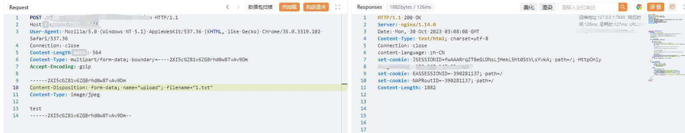

当上传 jsp 等后缀时，会请求失败返回空

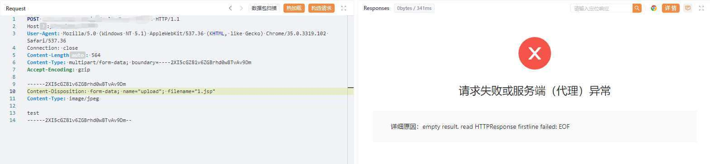

从这里可以判断出改网站存在 waf，当检测到请求包检测到威胁时会自动拦截丢弃。

既然是从 waf 层面检测的，那我们绕过的思路就是构造一个畸形的语句或者其他无法被 waf 识别但是能够被后端解析方法，比如通过**MIME 编码**进行绕过

# 0x02 MIME 编码

> （注意，这里说的 MIME 编码可**不是**将 Content-Type 修改为 image/png 等类似的方式进行绕过的，这种方式修改的是 MIME type。而我们今天所说的是 MIME 编码。）

**Multipurpose Internet Mail Extensions** (**MIME**) ，通常也称为**多用途互联网邮件扩展**，从字面意思可以看出，他的出现是为了扩展了电子邮件的格式，支持 ASCII 字符集以外二进制数据（例如图像、音频、视频或其他文件）转换为文本数据，以便能够安全地传输和处理。从 commons-fileupload 库版本 1.3 开始，FileUpload 可以处理 RFC 2047 编码的标头值。

对于后端的解析，不同的库对这一部分的解码大同小异但是都可以自动识别并对 MIME 编码后的数据进行解码，这里我们通过对 commons-fileupload 库的分析，来看看后端是如何自动解析 MIME 编码后的数据的

> Commons Fileupload 是一个用于处理文件上传开源的 Java 库，可以在 Apache 官方网站上下载到最新版本。它的文档和示例代码也提供了详细的使用说明，方便开发人员快速上手，提供了一组简单易用的 API，用于在 Web 应用程序中处理文件上传操作。它支持多种文件上传的方式，包括通过表单提交、通过 HTTP POST 请求以及通过 Multipart 请求等方式。

在 ParameterParser 中会对请求的参数进行解析

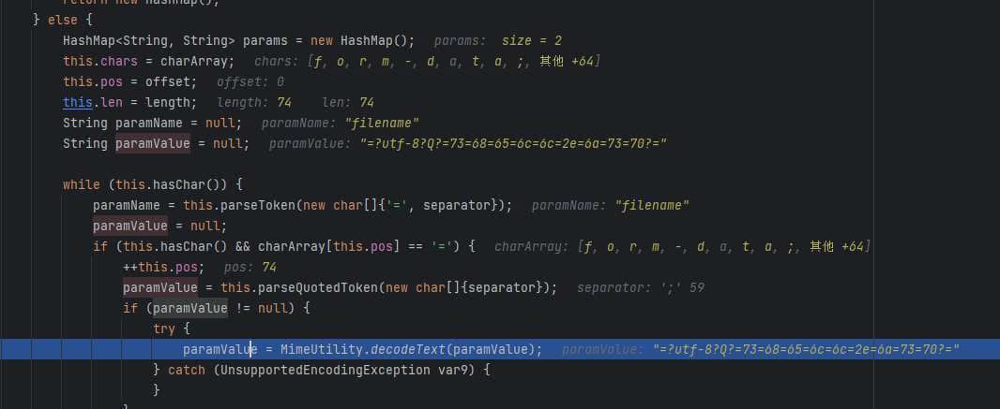

其中这里调用了`MimeUtility.decodeText()`对参数进行解析，继续跟进`decodeText`方法

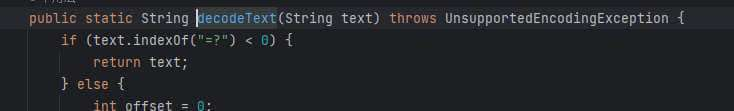

他会自动判断是否以`=?`开头的，如果不是直接返回原字符，否则进入 else 语句

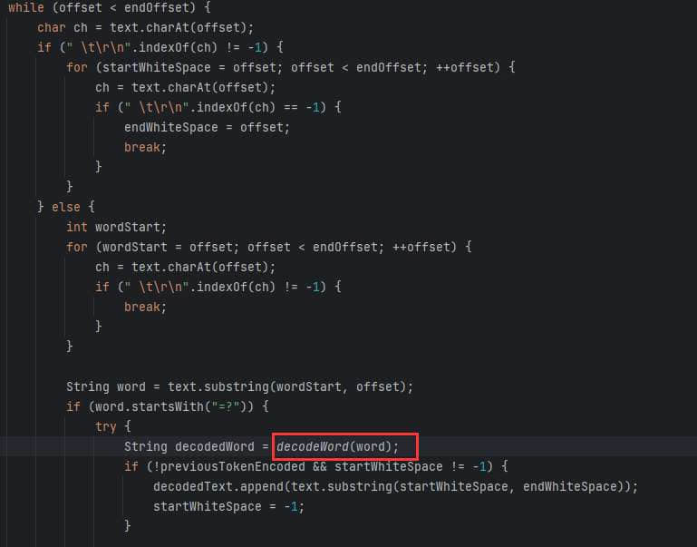

然后去除开头和结尾的`[space]\t\r\n`，继续判断是否以`=?`开头，接着进入 decodeWord 进行解码

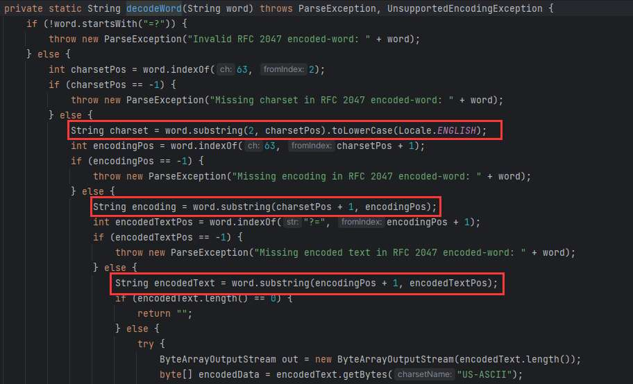

在`decodeWord`中，会解析 MIME 编码，具体做法是通过`?`（ascii 码值为 63）进行分割，分别提取出 charset(字符集)，encoding(编码方式)，encodedText(编码后的文本)

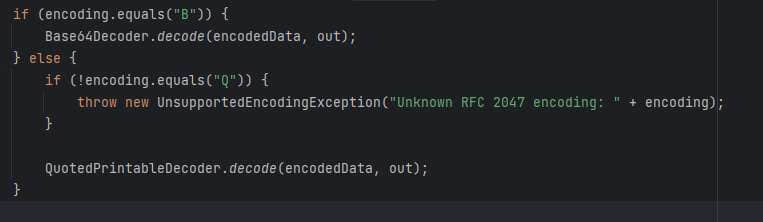

然后判断编码方式，当编码方式为`B`时，是将`encodedText`的值进行 base64 编码，当编码方式为`Q`时，会进入`QuotedPrintableDecoder.decode(encodedData, out)`方法

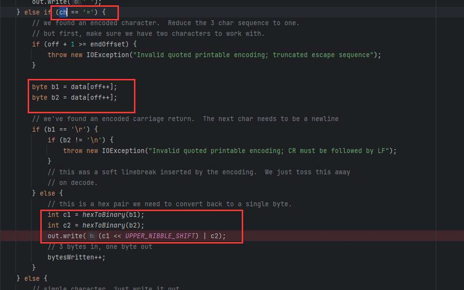

取`=`后的两个两个十六进制数字，并将其转换为 ascii 码值对应的字符。

所以 MIME 编码的格式为`=?charset?encoding?encoded text?=`

下面是对这个格式的详细解释：

1.  **\=?**：编码的起始标记，表示编码的开始。
2.  **charset**：表示字符集，即非 ASCII 字符所使用的字符编码集。这通常是一个标识字符集的文本字符串，例如 UTF-8 或 ISO-8859-1。
3.  **encoding**：表示编码方式，即用于将字符编码为 ASCII 字符的具体方法。常见的编码方式包括"Q"和"B"。
    -   "Q"表示 Quoted-Printable 编码，它将非 ASCII 字符编码为"="后跟两个十六进制数字的形式。
    -   "B"表示 Base64 编码，它将数据编码为一系列 ASCII 字符。
4.  **encoded text**：是实际编码后的文本，即包含非 ASCII 字符的原始文本的编码版本。
5.  **?=**：编码的结束标记，表示编码的结束。

举个栗子：

如果将`shell.jsp`通过 Quoted-Printable 编码方式为`=?utf-8?Q?=73=68=65=6c=6c=2e=6a=73=70?=`

如果将`shell.jsp`通过 Base64 编码方式为`=?utf-8?B?c2hlbGwuanNw?=`

# 0x03 waf 绕过

这里的绕过 waf 的方式也是将文件名或将所有参数都通过 MIME 编码后发送：  
将 filename 和 name 的值进行 MIME 编码后进行发送：

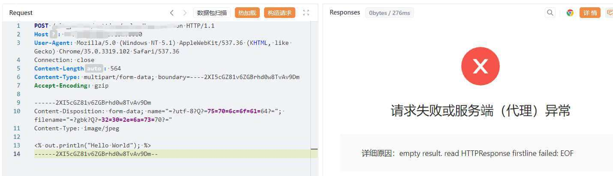

依然返回空被 waf 拦截了，难道是 waf 还会检测上传文件的内容？

于是将上传的内容修改为其他结果，上传成功，果然 waf 会对上传的内容也会进行检测，那我们还需要对内容进行免杀

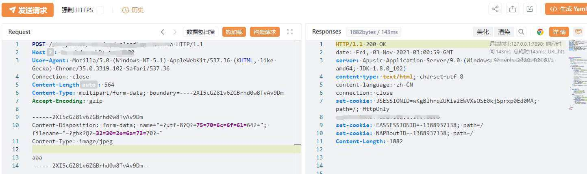

这里的绕过方法很多，这里用 jspx 利用命名空间进行绕过

由于 jspx 实际上是以 xml 形式编写的 jsp，因此它继承了 xml 的各种特性，包括 CDATA 和 HTML 实体编码，同时也包括了命名空间的特性。

这是 jspx 的 helloword

```php
<jsp:root xmlns:jsp="http://java.sun.com/JSP/Page" version="2.0">
    <jsp:directive.page contentType="text/html" pageEncoding="UTF-8"/>
    <jsp:scriptlet>
        out.println("Hello World!");
    </jsp:scriptlet>
</jsp:root>
```

这里使用 yzddMr6 师傅的方法，在`jsp:scriptlet`这个标签中，jsp 就是默认的命名空间，但是实际上可以随意替换成其他名字，这样就绕过了对 jsp:scriptlet 的过滤

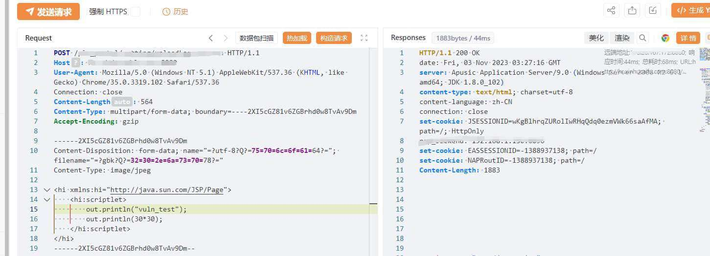

上传成功，然后访问上传的 shell，成功解析

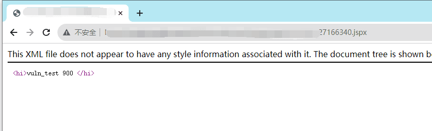
