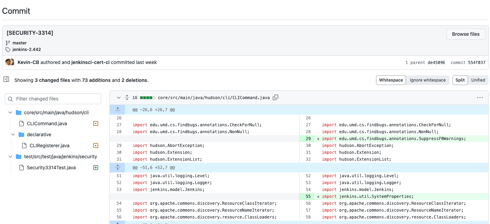
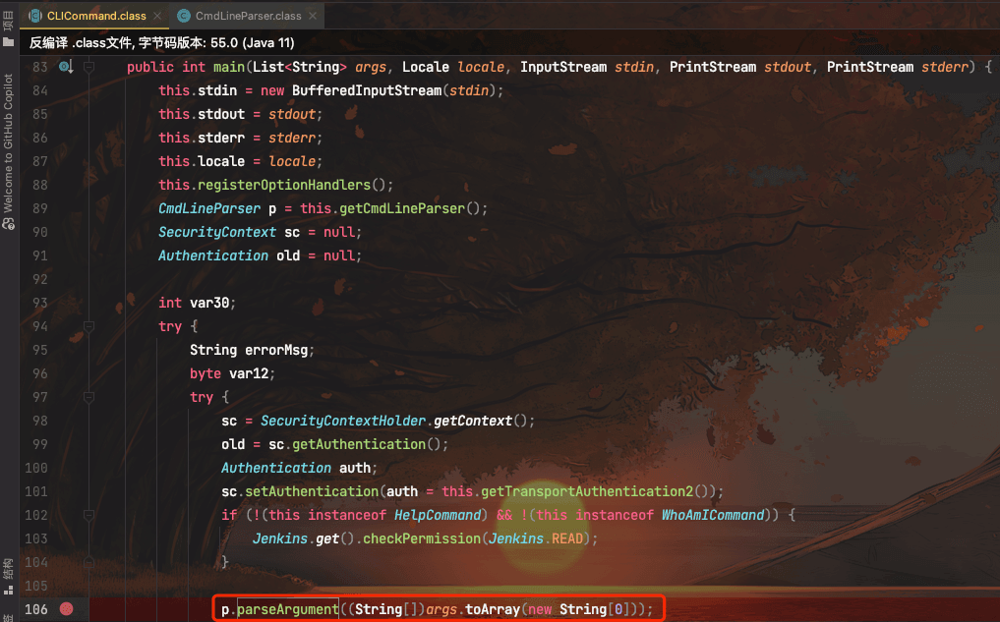
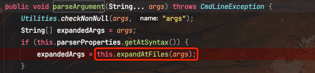
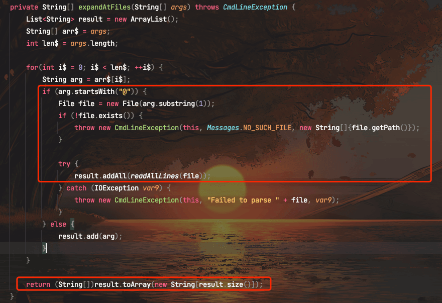
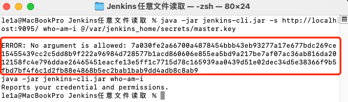

# 奇安信攻防社区 - 通过补丁分析 Jenkins 任意文件读取漏洞（CVE-2024-23897）

### 通过补丁分析 Jenkins 任意文件读取漏洞（CVE-2024-23897）

通过补丁分析 Jenkins 任意文件读取漏洞（CVE-2024-23897）

作者：Le1a@threatbook  
校验：jweny@threatboook

# 漏洞描述

Jenkins 是一个开源软件项目，是基于 Java 开发的一种持续集成工具，用于监控持续重复的工作，旨在提供一个开放易用的软件平台，使软件项目可以进行持续集成。Jenkins 有一个内置的命令行界面（CLI），可从脚本或 shell 环境访问 Jenkins。处理 CLI 命令时，Jenkins 使用 args4j 库解析 Jenkins 控制器上的命令参数和选项。

Jenkins 处理 CLI 命令的命令解析器中的 expandAtFile 功能存在任意文件读取漏洞，未经身份认证的远程攻击者利用该漏洞可以读取部分文件的有限行内容，攻击者经过身份验证或目标 Jenkins 更改了默认”Security”配置可以通过该漏洞读取任意文件，攻击者进一步利用该漏洞并结合其他功能可能导致任意代码执行。

# 漏洞分析

该漏洞成因比较简单。  
通过补丁可以发现，主要是对`CLICommand.java`文件做了修改。



跟进该文件，可以发现在 main 函数中，把 CLI 的参数传入了`parseArgument()`函数进行解析



继续跟进



继续跟进到`expandAtFiles()`函数后，可以发现，如果参数以`@`开头，那么将会把`@`后面的内容当作路径，建立一个 File 对象，并且会读取该文件的内容，并添加至 result 中返回。



而 CLI 参数可控，所以通过以下命令即可读取 Jenkins 中的`master.key`文件

```php
java -jar jenkins-cli.jar -s http://localhost:9095/ who-am-i @/var/jenkins_home/secrets/master.key
```

# 漏洞复现

通过 CLI 工具读取目标服务器上的 master.key 文件

```php
java -jar jenkins-cli.jar -s http://localhost:9095/ who-am-i @/var/jenkins_home/secrets/master.key
```



# 处置建议

-   使用[https://github.com/jenkinsci-cert/SECURITY-3314-3315中的脚本删除CLI](https://github.com/jenkinsci-cert/SECURITY-3314-3315%E4%B8%AD%E7%9A%84%E8%84%9A%E6%9C%AC%E5%88%A0%E9%99%A4CLI) HTTP 端点和禁用 SSH 端口
-   目前官方已有可更新版本，建议受影响用户升级至：Jenkins >= 2.442 或 Jenkins LTS >= 2.426.3。下载链接：[https://www.jenkins.io/download/](https://www.jenkins.io/download/)
