# 如何使用 VeraCrypt 保护 PC 上的敏感文件

如果您正在寻找一种简单而强大的方法来加密从系统驱动器到备份介质的任何文件，并将其存储于这两者之中的任何地方，那么 VeraCrypt 是一款可帮助您锁定保护文件的开源软件。请继续阅读，我们将会向您展示如何使用它。

  

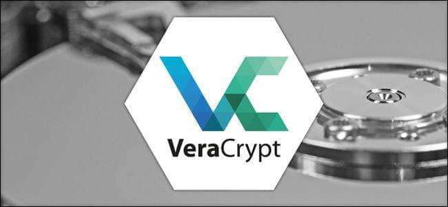

  

## 什么是 TrueCrypt / VeraCrypt，为什么要使用它？

保护您不希望其他人看到的文件的最佳方法是加密。加密本质上是使用密钥将文件转换为不可读的乱码，除非您使用该密钥将其解锁。

TrueCrypt 曾是一种流行的影响力最大的（没有之一）的磁盘加密工具，一个开源的动态加密应用程序，当年揭发了 NSA 棱镜门丑闻的斯诺登也亲睐使用这款加密软件。TrueCrypt 使您可以像处理常规驱动器上的文件一样使用加密文件。如果没有即时加密，那么积极地使用加密文件将是一个巨大的痛苦，其结果通常是人们只是不对自己的文件进行加密，或者因嫌解密和加密的麻烦而使用不安全的方法加密文件。

几年前，经常会有这种段子：某天突发奇想要在一台新电脑上安装 TrueCrypt，去官网下载时才发现早已物是人非，TrueCrypt 官网宣布于 2014 年 5 月因为安全问题停止开发。事实上当时 TrueCrypt 因为美国政府安全审计问题压力，拱手认输而关闭。VeraCrypt 是 TrueCrypt 的分支，于 2013 年 6 月发布，法国安全顾问 Mounir Idrassi 是项目的主要开发者。VeraCrypt 是比 TrueCrypt 更出色的替代加密软件，在 TrueCrypt 停止开发之后，要寻找 TrueCrypt 的替代，可能没有比 VeraCrypt 更好的了。

使用 VeraCrypt 的即时加密系统，您可以创建一个加密卷（甚至是一个完全加密的系统驱动器）。加密卷中的所有文件均已加密，您可以使用 VeraCrypt 将其安装为普通驱动器以查看和编辑文件。当您在上面完成工作后，您可以卸下该卷。VeraCrypt 会处理所有事务，将文件临时保存在内存 RAM 中，然后自动进行清理，并确保文件无损。

VeraCrypt 也可以加密您的整个驱动器，至少在某些 PC 上是可行的，但是我们通常建议使用 Windows 的内置 Bitlocker 功能来加密整个磁盘。VeraCrypt 是为文件组创建加密卷的理想选择，而不是对整个启动驱动器进行加密，在这方面 Bitlocker 是一个更好的选择。

## 为什么使用 VeraCrypt 代替 TrueCrypt？

从技术上讲，您仍然可以根据需要使用旧版本的 TrueCrypt，甚至可以按照本指南进行操作，因为 TrueCrypt 和 VeraCrypt 的界面几乎完全相同。VeraCrypt 解决了 TrueCrypt 的代码审核带来的一些小问题，更不用说对自己代码的审核了。它对 TrueCrypt 基础的改进为它成为真正的继任者奠定了基础，尽管它运行比 TrueCrypt 慢一些，但正如知名安全专家史蒂夫·吉布森（Steve Gibson）所说的，现在是转而使用 VeraCrypt 的好时机。

如果您使用的是旧版本的 TrueCrypt，则并不是很紧迫要更换到 VeraCrypt，它仍然非常可靠。但是 VeraCrypt 是未来趋势，比如您要设置新的加密卷，则应该更换使用 VeraCrypt，毕竟 TrueCrypt 官网最后发布提供的最新 7.2 版本不支持创建新的加密卷。

## 如何安装 VeraCrypt

对于本教程，您只需要做一些简单的操作：

-   获取下载 VeraCrypt 的免费副本。
-   以计算机的管理员身份运行安装。

仅此而已！您可以获取 Windows、Linux 或 Mac OS X 的 VeraCrypt 版本，然后以管理员权限安装（不能以受限/guest 帐户权限运行 VeraCrypt）。在本教程中，我们将使用 Windows 版本的 VeraCrypt 并将其安装在 Windows 10 电脑上。

VeraCrypt 官网下载地址为：[https://www.veracrypt.fr/en/Downloads.html](https://www.veracrypt.fr/en/Downloads.html)

  

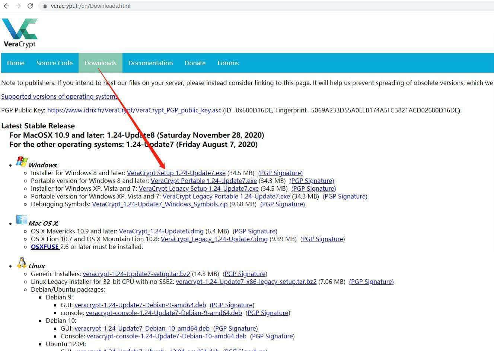

  

在国内，此官网下载地址可能很慢，可能会遇到多次重试下载失败，则可以到国外知名开源软件网站[http://sourceforge.net](http://sourceforge.net/)下载，地址为：[https://sourceforge.net/projects/veracrypt/](https://sourceforge.net/projects/veracrypt/)

  

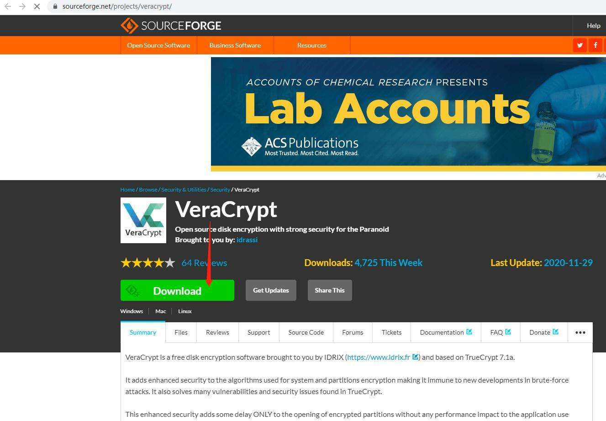

  

目前 windows 最新版本是官方今年 8 月 7 日发布的 1.24-Update7，macos 最新版本则是官方一周前的 11 月 28 日发布的 1.24-Update8。与其它任何应用程序一样，下载并安装 VeraCrypt。只需双击下载后的 exe 文件 VeraCrypt Setup 1.24-Update7.exe，建议右键点击该文件，选择以管理员身份运行，按照向导中的说明进行操作即可。

  

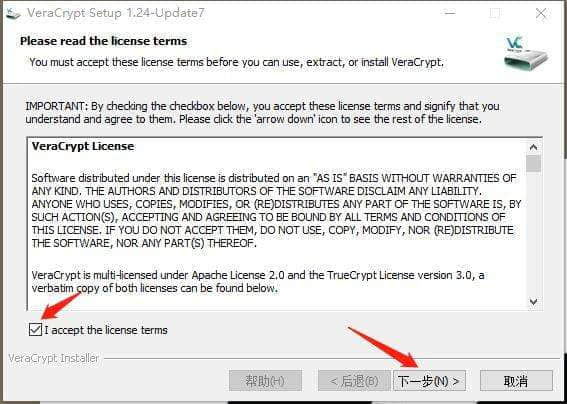

  

在安装过程中，可以选择“安装”选项，例如“为所有用户安装”和“将.hc 文件扩展名与 VeraCrypt 相关联”。可以按默认选择即可。安装到最后，会提示是否禁用 Windows 快速启动，因为在开启 Windows 快速启动的情况下，VeraCrypt 存在个别未知问题，建议选择禁用之，然后按提示重启电脑生效。

## 如何创建加密卷

应用程序完成安装并重启电脑后，导航至“开始”菜单并启动 VeraCrypt。您将看到下面的屏幕：

  

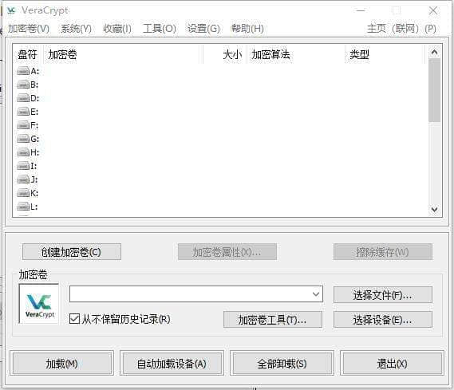

  

您需要做的第一件事就是创建一个加密卷，因此单击“创建加密卷”按钮。这将启动“加密卷创建向导”，并提示您选择以下卷类型之一：

  

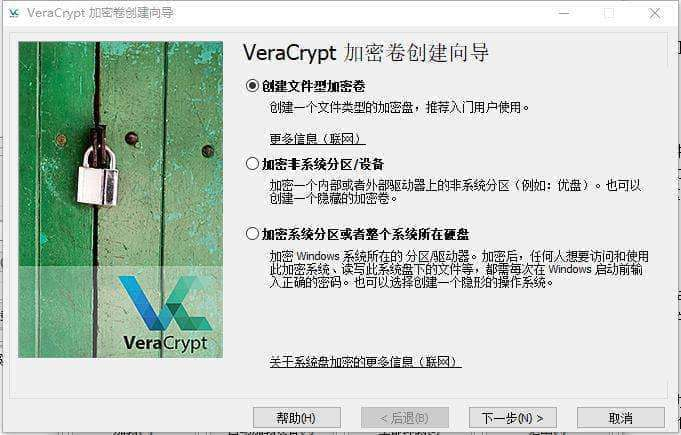

  

卷可以像放在驱动器或磁盘上的文件卷一样简单，也可以像对操作系统的全盘加密一样复杂。对于本指南，我们力求把事情变得简单，并着重于介绍如何设置易于使用的本地容器。默认选择“创建文件型加密卷”，我们只需要点击下一步。

接下来，向导将询问您是否要创建标准卷或隐藏卷。再次，为了简单起见，在这一点上，我们将跳过“隐藏卷”的讨论。这绝不会降低我们正在创建的卷的加密级别或安全性，因为“隐藏卷”只是一种混淆加密卷位置的方法。

  

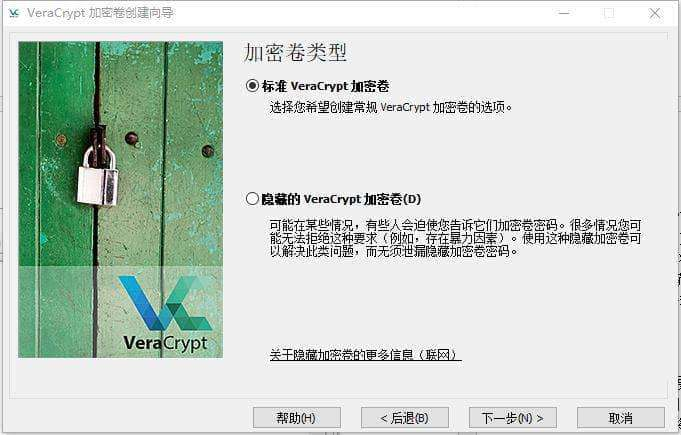

  

直接点击下一步，接下来，您需要为卷选择一个做任意的名称和任意位置。这里唯一重要的参数是主机驱动器有足够的空间来创建要使用的卷（即，如果要使用 100GB 的加密卷，则需要选择具有 100GB 以上可用空间的驱动器）。建议驱动器选择除 C 盘外的非系统盘存放，以免重装系统时造成数据丢失，下图，我们将把加密的卷放在数据盘驱动器 D 盘不易被误删除的目录中，并取名为 do-not-del，文件名称任意，不需要有扩展名，即 D:\\backup\\do-not-del。

  

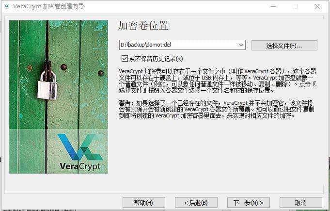

  

现在是时候选择您的加密方案了。您在这里真的不会出错。是的，有很多选择，但是所有选择都是非常可靠的加密方案，并且出于实用目的是可以互换的。例如，在 2008 年，FBI 花费了一年多的时间试图解密涉及金融诈骗的巴西银行家的 AES 加密硬盘。如果您是数据保护偏执狂，有条件寻求数据取证专家的意见，您可以通过下拉菜单按缩写字母名称选择不同加密算法和哈希算法，以提升加密级别，您会放心地知道自己的数据是安全的。通常情况下，我们按默认选择点击下一步即可。

  

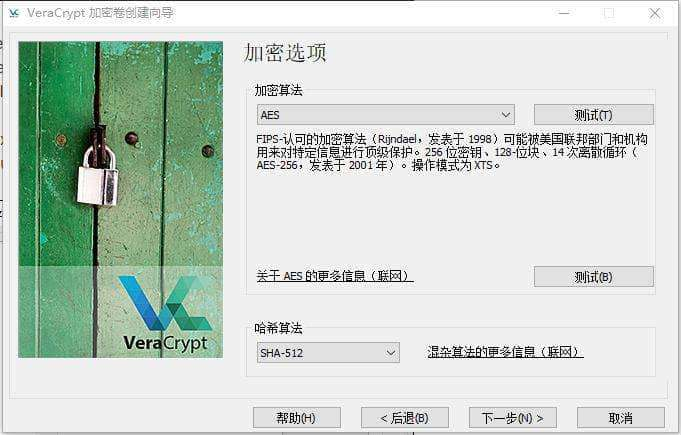

  

在下一步中，您将选择卷大小。您可以以 KB、MB 或 GB 为单位进行设置。我们为该示例创建了 5GB 的测试卷。

  

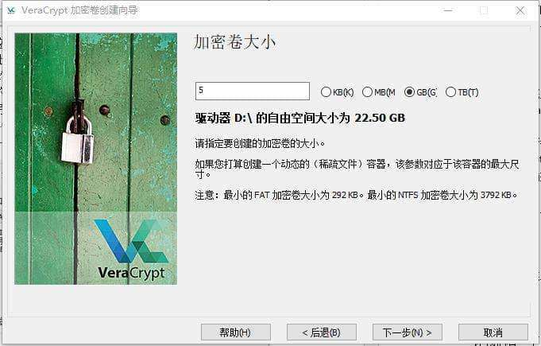

  

点击下一步，出现如下图的设置密码框。这里要记住一件事：短密码是个坏主意。您应该创建至少 20 个字符长的密码。我们建议您创建一个强大而不易忘记的密码。一项很棒的技巧是使用密码短语而不是简单的密码。这是一个示例：In2NDGradeMrsAmerman $ aidIWasAGypsy。这样的密码比你使用诸如 password123、day 这样的脆弱密码好。

  

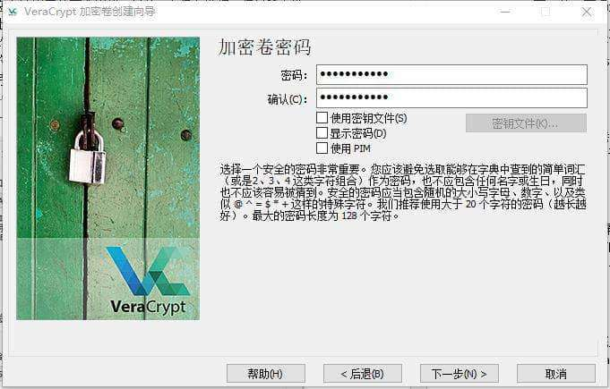

  

如果您使用了弱密码，比如密码字符长度太少，向导会给出警告窗口：

  

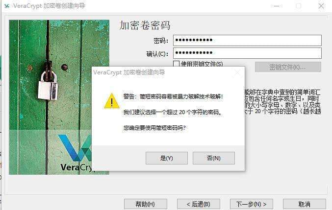

  

在设置好安全强度的密码后，点击下一步，在创建实际卷之前，创建向导将询问您是否打算存储大文件。如果您打算在卷中存储大于 4GB 的文件，请点击选择“是”，它会调整文件系统以更好地满足您的需求。

  

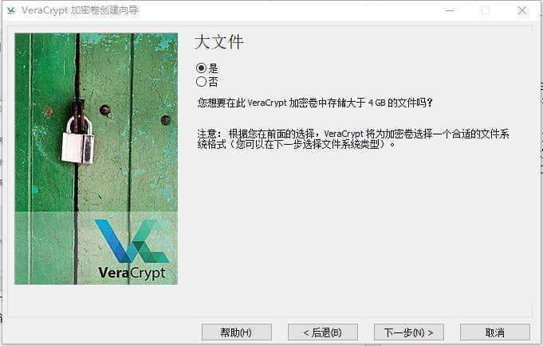

  

在“加密卷格式化”屏幕上，您需要四处移动鼠标以生成一些随机数据。

  

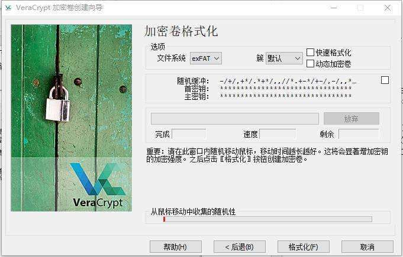

  

产生足够的随机性后，点击“格式化”按钮。

  

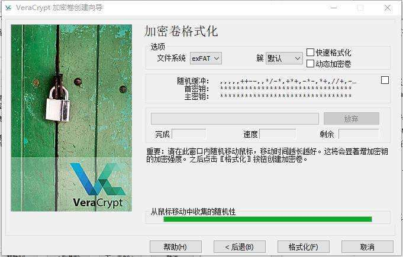

  

您也可以在格式化前选择要格式化的文件系统格式，比如 NTFS 之类的，但为了兼容性，建议不用选择，就按默认的 exFAT 进行格式化。

  

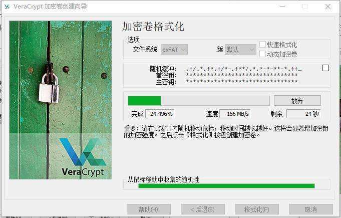

  

格式化过程完成后，向导会弹窗提示已经完成加密卷的创建：

  

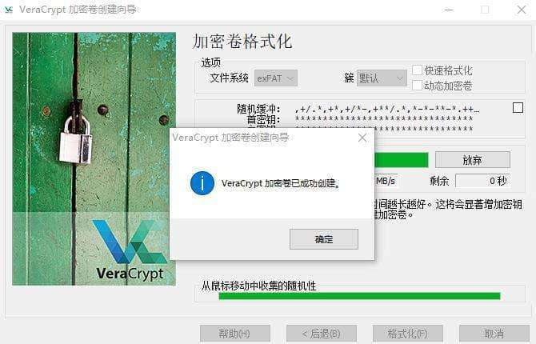

  

点击确定后返回向导页面：

  

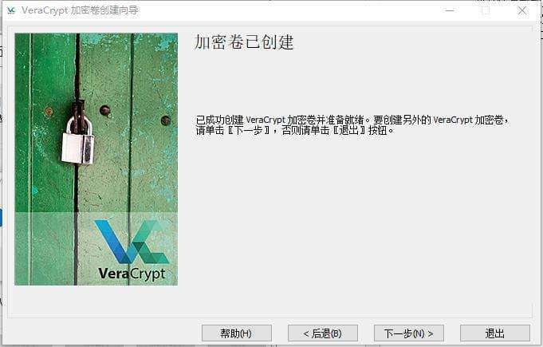

  

此时，您如果需要再创建一个新的加密卷，则点击下一步，重复上面的流程，如果不需要，则点击退出按钮，返回到前面 VeraCrypt 的主界面。

现在，无论您的加密卷放置在何位置，它仅仅是一个单纯的文件，您还需要在 VeraCrypt 中将其挂载使用。

## 如何挂载加密卷

单击 VeraCrypt 主窗口中的“选择文件”按钮，然后导航到存放 VeraCrypt 加密卷的目录。选择我们刚才创建的加密卷文件后，为安全起见，默认选择了“从不保留历史纪录”，不建议取消此勾选，再从上面的框中选择一个可用的驱动器盘符。我们选择了 X，然后单击加载。

  

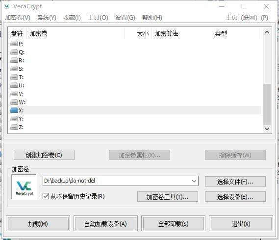

  

此时按提示输入前面设置的加密卷密码，然后单击确定。

  

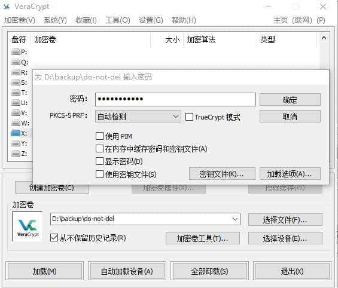

  

需要耐心等待片刻，如下图：

  

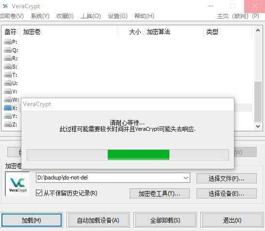

  

加载成功后，主界面如下图：

  

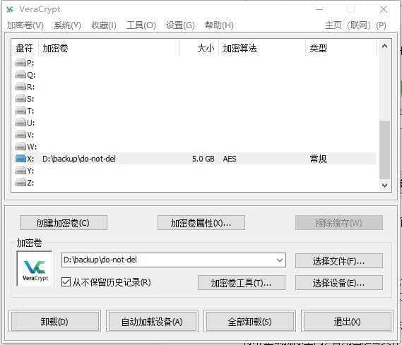

  

让我们看一下“我的电脑”，可以看到我们的加密卷已成功加载：

  

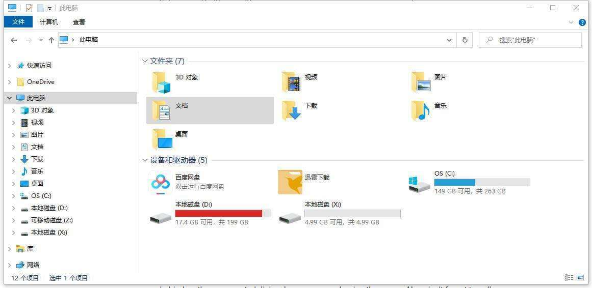

  

哦耶！成功了！5GB 的加密卷呈现在您面前，正如兹母制作的甜点一样甜得美不可言。现在，您可以进入该加密卷，将所有您想要防止窥探的敏感文件拷入其中。

将敏感文件复制到加密卷中后，请不要忘记对其进行安全擦除。常规文件系统存储是不安全的，除非正确地擦除空间，否则已加密文件的痕迹将保留在未加密磁盘上。另外，当您不需要使用加密卷时，不要忘记在 VeraCrypt 中“卸载”加密卷。
