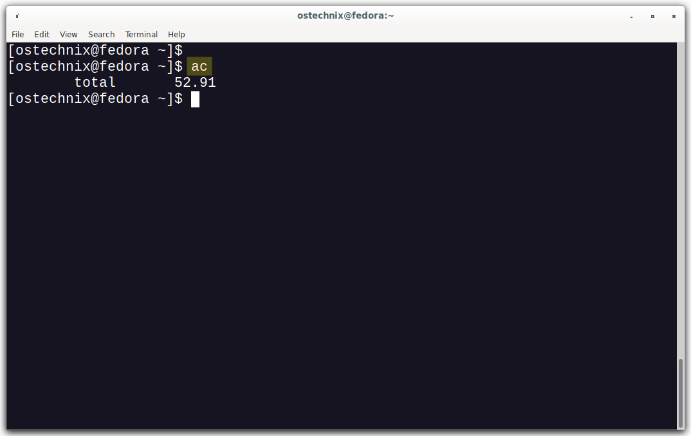
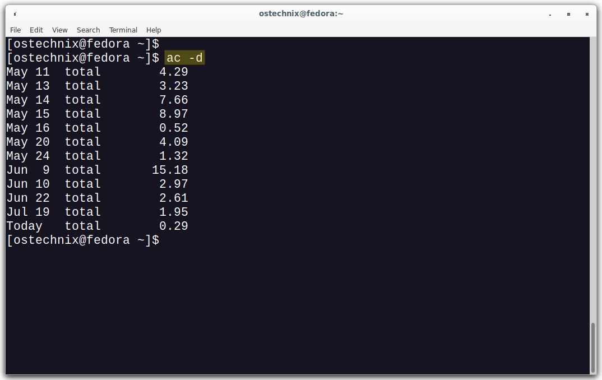
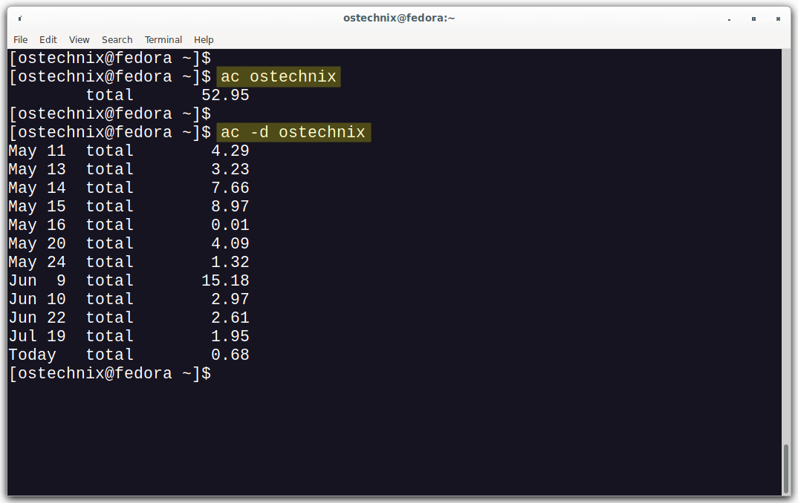

# (4) Inoreader - 技术 | 如何在 Linux 中监控用户活动


作为一位 Linux 管理员，你需要跟踪所有用户的活动。当服务器发生故障时，你可以分析和查看用户活动，以便寻找问题的根源。监控 Linux 用户有多种方式。本指南将专门讨论 **GNU 记账工具**，这是一项用于监视 Linux 用户活动的实用工具。

### 什么是记账工具？

记账工具可以提供诸如 Linux 系统中的连接、已执行的程序以及系统资源的使用等有底系统使用信息。这些记账工具可以通过 `psacct` 或 `acct` 软件包安装。

`psacct` 和 `acct` 实际上是相同的。在基于 RPM 的系统中，它以 `psacct` 的形式存在；而在基于 DEB 的系统中，它作为 `acct` 提供。

你可能想知道 `psacct` 或 `acct` 工具的作用。通常，用户在命令行的历史记录会保存在他们的 `$HOME` 目录下的 `.bash_history` 文件中。有些用户可能会尝试编辑、修改或删除这些历史记录。

然而，即使他们完全 [清除了命令行历史](https://ostechnix.com/how-to-clear-command-line-history-in-linux/)，记账工具依然能够获取用户活动信息。这是因为，**所有进程记账文件都由 root 用户拥有**，而普通用户则无法进行编辑。

### Linux 中如何安装 psacct 或 acct

`psacct`/`acct` 被打包在多种流行的 Linux 发行版本中。

如果要在 Alpine Linux 中安装 `psacct`，请运行以下命令：

```plain
$ sudo apk add psacct
 
```

如果在 Arch Linux 及其变体版本（如 EndeavourOS 和 Manjaro Linux）中安装 `acct`，请运行以下命令：

```plain
$ sudo pacman -S acct
 
```

在 Fedora、RHEL 及其衍生版本（如 CentOS、AlmaLinux 和 Rocky Linux）中安装 `psacct`，请运行以下命令：

```plain
$ sudo dnf install psacct
 
```

在 RHEL 6 以及更早版本中，你应当使用 `yum` 命令而非 `dnf` 来安装 `psacct`。

```plain
$ sudo yum install psacct
 
```

在 Debian、Ubuntu 以及 Linux Mint 中，通过如下命令来安装 `acct`：

```plain
$ sudo apt install acct
 
```

若在 openSUSE 中安装 `acct`，则运行：

```plain
$ sudo zypper install acct
 
```

### 启动 psacct/acct 服务

要启用并开启 `psacct` 服务，请执行以下命令：

```plain
$ sudo systemctl enable psacct
 
```

接着启动 `psacct` 服务：

```plain
$ sudo systemctl start psacct
 
```

如果你需要检查 `psacct` 服务是否已加载和激活，可以运行：

```plain
$ sudo systemctl status psacct
 
```

在基于 DEB 的系统中，安装完成之后，`acct` 服务会自动启动。

如果你想验证 `acct` 服务是否已经启动，可以执行以下命令：

```plain
$ sudo systemctl status acct
 
```

```plain
● acct.service - Kernel process accounting
 
     Loaded: loaded (/lib/systemd/system/acct.service; enabled; vendor preset: enabled)
 
     Active: active (exited) since Thu 2022-10-13 16:06:35 IST; 28s ago
 
       Docs: man:accton(8)
 
    Process: 3241 ExecStart=/usr/sbin/accton /var/log/account/pacct (code=exited, status=0/SUCCESS)
 
   Main PID: 3241 (code=exited, status=0/SUCCESS)
 
        CPU: 879us
 

 
Oct 13 16:06:35 ubuntu2204 systemd[1]: Starting Kernel process accounting...
 
Oct 13 16:06:35 ubuntu2204 accton[3241]: Turning on process accounting, file set to '/var/log/account/pacct'.
 
Oct 13 16:06:35 ubuntu2204 systemd[1]: Finished Kernel process accounting.
 
```

### 利用 psacct 或 acct 来监测 Linux 中的用户活动

`psacct`（进程记账）软件包包含以下用来监测用户和进程活动的工具：

-   `ac` - 提供用户登录时间的统计信息。
-   `lastcomm` - 展示先前执行过的命令的信息。
-   `accton` - 开启或关闭进程记账。
-   `dump-acct` - 把 `accton` 的输出文件转化为易读的格式。
-   `dump-utmp` - 以易读的方式打印 `utmp` 文件。
-   `sa` - 汇总信息，关于先前执行的命令。

现在就让我们一起了解如何通过每个工具来监控 Linux 用户的活动。

#### 1、使用 ac 命令

`ac` 工具可以为你提供以小时为单位的连接时间报告，这样你就能知道用户或一组用户连接到系统的时长。

##### 1.1、展示所有用户的总连接时间

```plain
$ ac
 
```

上述命令会显示所有用户的总连接时间（单位为小时）。

```plain
total       52.91
 
```



##### 1.2、按日期排序显示所有用户的总连接时间

你可以通过使用 `-d` 参数，按日期排序显示所有用户的连接时间，操作如下：

```plain
$ ac -d
 
```

示例输出：

```plain
May 11	total        4.29
 
May 13	total        3.23
 
May 14	total        7.66
 
May 15	total        8.97
 
May 16	total        0.52
 
May 20	total        4.09
 
May 24	total        1.32
 
Jun  9	total       15.18
 
Jun 10	total        2.97
 
Jun 22	total        2.61
 
Jul 19	total        1.95
 
Today	total        0.29
 
```



##### 1.3、获取各个用户的总连接时间

使用 `-p` 参数，你可以查看每位用户各自在系统中总的连接时长。

```plain
$ ac -p
 
```

示例输出：

```plain
ostechnix                           52.85
 
root                                 0.51
 
total       53.36
 
```


##### 1.4、显示指定用户的总连接时间

你还可以显示特定用户的总登录时间。

```plain
$ ac ostechnix
 
```

示例输出：

```plain
total       52.95
 
```

##### 1.5、显示特定用户各日期的总连接时间

要按日期查看某个用户的登录时间，可以运行：

```plain
$ ac -d ostechnix
 
```

示例输出：

```plain
May 11	total        4.29
 
May 13	total        3.23
 
May 14	total        7.66
 
May 15	total        8.97
 
May 16	total        0.01
 
May 20	total        4.09
 
May 24	total        1.32
 
Jun  9	total       15.18
 
Jun 10	total        2.97
 
Jun 22	total        2.61
 
Jul 19	total        1.95
 
Today	total        0.68
 
```



如需更多详情，可参考手册页面。

```plain
$ man ac
 
```

#### 2、lastcomm 命令使用示例

`lastcomm` 工具用于列出过去执行过的命令，它会按执行的最近程度将命令列在前面。

##### 2.1、展示过去执行的命令

```plain
$ lastcomm
 
```

示例输出：

```plain
systemd-hostnam  S     root     __         0.06 secs Thu Oct 13 17:21
 
systemd-localed  S     root     __         0.06 secs Thu Oct 13 17:22
 
bash              F    ostechni pts/1      0.00 secs Thu Oct 13 17:22
 
awk                    ostechni pts/1      0.00 secs Thu Oct 13 17:22
 
bash              F    ostechni pts/1      0.00 secs Thu Oct 13 17:22
 
uname                  ostechni pts/1      0.00 secs Thu Oct 13 17:22
 
bash              F    ostechni pts/1      0.00 secs Thu Oct 13 17:22
 
sed                    ostechni pts/1      0.00 secs Thu Oct 13 17:22
 
bash              F    ostechni pts/1      0.00 secs Thu Oct 13 17:22
 
bash              F    ostechni pts/1      0.00 secs Thu Oct 13 17:22
 
grep                   ostechni pts/1      0.00 secs Thu Oct 13 17:22
 
bash              F    ostechni pts/1      0.00 secs Thu Oct 13 17:22
 
bash              F    ostechni pts/1      0.00 secs Thu Oct 13 17:22
 
grep                   ostechni pts/1      0.00 secs Thu Oct 13 17:22
 
bash              F    ostechni pts/1      0.00 secs Thu Oct 13 17:22
 
bash              F    ostechni pts/1      0.00 secs Thu Oct 13 17:22
 
[...]
 
```

##### 2.2、打印特定用户先前执行的命令

上述命令显示的是所有用户的命令。要显示特定用户以前执行的命令，可以使用下面的命令：

```plain
$ lastcomm ostechnix
 
```

示例输出：

```plain
less                   ostechni pts/1      0.00 secs Thu Oct 13 17:26
 
lastcomm               ostechni pts/1      0.00 secs Thu Oct 13 17:26
 
lastcomm               ostechni pts/1      0.00 secs Thu Oct 13 17:26
 
lastcomm               ostechni pts/1      0.00 secs Thu Oct 13 17:26
 
gdbus                X ostechni __         0.00 secs Thu Oct 13 17:24
 
lastcomm               ostechni pts/1      0.00 secs Thu Oct 13 17:24
 
ac                     ostechni pts/1      0.00 secs Thu Oct 13 17:24
 
update-notifier   F    ostechni __         0.00 secs Thu Oct 13 17:23
 
apport-checkrep        ostechni __         0.06 secs Thu Oct 13 17:23
 
apport-checkrep        ostechni __         0.05 secs Thu Oct 13 17:23
 
systemctl              ostechni __         0.00 secs Thu Oct 13 17:23
 
apt-check              ostechni __         0.81 secs Thu Oct 13 17:23
 
dpkg                   ostechni __         0.00 secs Thu Oct 13 17:23
 
ischroot               ostechni __         0.00 secs Thu Oct 13 17:23
 
dpkg                   ostechni __         0.00 secs Thu Oct 13 17:23
 
[...]
 
```

##### 2.3、打印特定命令的执行次数

你还可以查看特定命令被执行的次数。

```plain
$ lastcomm apt
 
```

示例输出：

```plain
apt              S     root     pts/2      0.70 secs Thu Oct 13 16:06
 
apt               F    root     pts/2      0.00 secs Thu Oct 13 16:06
 
apt               F    root     pts/2      0.00 secs Thu Oct 13 16:06
 
```

如上述输出所示，root 用户执行了 `apt` 命令三次。

更详细的信息，可参考手册页：

```plain
$ man lastcomm
 
```

#### 3、sa 命令示例

`sa` 实用程序将总结关于先前执行的命令的信息。

##### 3.1、打印所有命令的总结

```plain
$ sa
 
```

示例输出：

```plain
1522    1598.63re       0.23cp         0avio     32712k
 
    139     570.90re       0.05cp         0avio     36877k   ***other*
 
     38     163.63re       0.05cp         0avio    111445k   gdbus
 
      3       0.05re       0.04cp         0avio     12015k   apt-check
 
     27     264.27re       0.02cp         0avio         0k   kworker/dying*
 
      2      51.87re       0.01cp         0avio   5310464k   Docker Desktop
 
      5       0.03re       0.01cp         0avio       785k   snap-confine
 
      8      59.48re       0.01cp         0avio     85838k   gmain
 
      5     103.94re       0.01cp         0avio    112720k   dconf worker
 
     24       3.38re       0.00cp         0avio      2937k   systemd-udevd*
 
      7       0.01re       0.00cp         0avio     36208k   5
 
      3       1.51re       0.00cp         0avio      3672k   systemd-timedat
 
      2       0.00re       0.00cp         0avio     10236k   apport-checkrep
 
      2       0.01re       0.00cp         0avio   4316160k   ThreadPoolForeg*
 
      2       0.00re       0.00cp         0avio      8550k   package-data-do
 
      3       0.79re       0.00cp         0avio      2156k   dbus-daemon
 
     12       0.00re       0.00cp         0avio     39631k   ffmpeg
 
[...]
 
```

##### 3.2、查看进程数量和 CPU 分钟数

要打印基于每个用户的进程数量和 CPU 分钟数，运行带 `-m` 标志的 `sa` 命令：

```plain
$ sa -m
 
```

示例输出：

```plain
1525    1598.63re       0.23cp         0avio     32651k
 
root                                  561     647.23re       0.09cp         0avio      3847k
 
ostechnix                             825     780.79re       0.08cp         0avio     47788k
 
gdm                                   117      13.43re       0.06cp         0avio     63715k
 
colord                                  2      52.01re       0.00cp         0avio     89720k
 
geoclue                                 1       1.01re       0.00cp         0avio     70608k
 
jellyfin                               12       0.00re       0.00cp         0avio     39631k
 
man                                     1       0.00re       0.00cp         0avio      3124k
 
kernoops                                4     104.12re       0.00cp         0avio      3270k
 
sshd                                    1       0.05re       0.00cp         0avio      3856k
 
whoopsie                                1       0.00re       0.00cp         0avio      8552k
 
```

##### 3.3、打印用户 ID 和命令名称

对于账户文件中的每个命令，使用 `-u` 标志打印用户 ID 和命令名称。

```plain
$ sa -u
 
```

示例输出：

```plain
root       0.00 cpu      693k mem      0 io accton          
 
root       0.00 cpu     3668k mem      0 io systemd-tty-ask 
 
root       0.00 cpu     3260k mem      0 io systemctl       
 
root       0.01 cpu     3764k mem      0 io deb-systemd-inv 
 
root       0.00 cpu      722k mem      0 io acct.postinst   
 
root       0.00 cpu      704k mem      0 io rm              
 
root       0.00 cpu      939k mem      0 io cp              
 
root       0.00 cpu      704k mem      0 io rm              
 
root       0.00 cpu      951k mem      0 io find            
 
root       0.00 cpu      911k mem      0 io gzip            
 
root       0.00 cpu      722k mem      0 io sh              
 
root       0.00 cpu      748k mem      0 io install-info    
 
root       0.00 cpu      911k mem      0 io gzip            
 
[...]
 
```

如需更多详细信息，请参考手册页：

```plain
$ man sa
 
```

#### 4、dump-acct 和 dump-utmp 命令

`dump-acct` 实用工具将 accton 格式的输出文件显示为人类可读的格式。

```plain
$ dump-acct /var/account/pacct
 
```

`dump-utmp` 将 utmp 文件显示为人类可读的格式。

```plain
$ dump-utmp /var/run/utmp
 
```

如需了解更多详情，请参考手册页：

```plain
$ man dump-acct
 
```

```plain
$ man dump-utmp
 
```

#### 5、accton 命令

`accton` 命令将允许你开启或关闭记账。

要开启进程记账，请运行：

```plain
$ accton on
 
```

要关闭它，运行：

```plain
$ accton off
 
```

如需了解更多详情，请参考手册页：

```plain
$ man accton
 
```

### 总结

每个 Linux 管理员都应该知道 GNU 记账实用程序，以便注意所有用户的行为。在故障排除时，这些实用程序会非常有帮助。

### 资源

-   [GNU 记账实用程序官网](https://www.gnu.org/software/acct/manual/accounting.html)

*（题图：MJ/da3f7e79-2a53-4121-a2ed-d63a22c3d3f4）*

- - -

via: [https://ostechnix.com/monitor-user-activity-linux/](https://ostechnix.com/monitor-user-activity-linux/)

作者：[sk](https://ostechnix.com/author/sk/) 选题：[lkxed](https://github.com/lkxed) 译者：[ChatGPT](https://linux.cn/lctt/ChatGPT) 校对：[wxy](https://github.com/wxy)

本文由 [LCTT](https://github.com/LCTT/TranslateProject) 原创编译，[Linux 中国](https://linux.cn/) 荣誉推出
