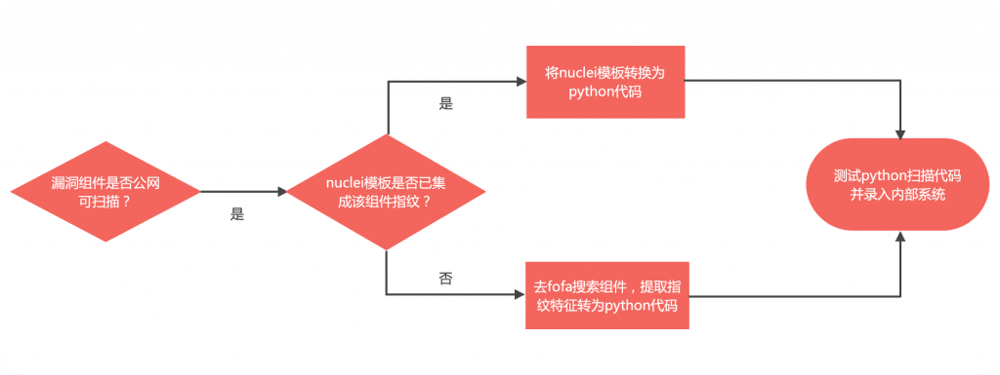

# 如何用 GPTs 提升工作效率 – Zgao's blog

### 如何用 GPTs 提升工作效率

现在每天的工作已经离不开 chatGPT 了，由于我每天需要研判各种漏洞情报，并把组件的指纹转化为对应的内部扫描系统的插件。然而大部分指纹在 nuclei 的模板中都有集成，可以直接复用。所以工作的流程大致如下。

很明显第三步和第四步都可以用 chatGPT 来辅助完成。但是实际使用的过程中发现，每次都要对应的把 nuclei 的模板给到 chatGPT，并且生成出来的代码格式和质量都参差不齐，还需要自己再手动修改才能使用。而 GPTs 的出现则完美解决了这个问题，极大提升工作效率。

文章目录

-   [创建 GPTs](#%E5%88%9B%E5%BB%BAGPTs "创建GPTs")
-   [下载 nuclei 的扫描模板](#%E4%B8%8B%E8%BD%BDnuclei%E7%9A%84%E6%89%AB%E6%8F%8F%E6%A8%A1%E6%9D%BF "下载nuclei的扫描模板")
-   [配置 GPTs](#%E9%85%8D%E7%BD%AEGPTs "配置GPTs")
-   [测试 GPTs 效果](#%E6%B5%8B%E8%AF%95GPTs%E6%95%88%E6%9E%9C "测试GPTs效果")

## 创建 GPTs

## 下载 nuclei 的扫描模板

## 配置 GPTs

在 instruction 中给出 prompt，把输出的格式和 python 代码模板都描述清楚，这样可以确保输出的代码完全一致。

这里把 nuclei 的模板作为语料给到 GPT 学习，后面每次使用的时候 GPT 都会从你提供的语料中查找信息，作为输入源，就避免了每次都要给 GPT 待转化的 nuclei 模板。

## 测试 GPTs 效果

GPTs 直接让工作效率起飞。
