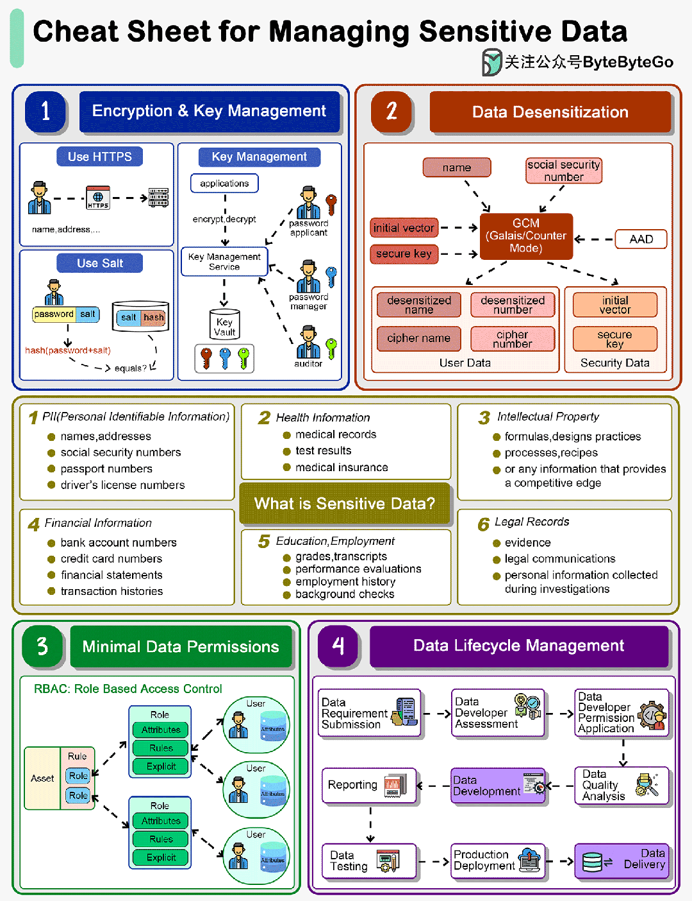

# 如何管理系统中的敏感数据？

如何在系统中管理敏感数据？下图列出了一系列指导原则。

## 什么是敏感数据？

个人身份信息 (PII)、健康信息、知识产权、财务信息、教育和法律记录都属于敏感数据。

大多数国家都有要求保护敏感数据的法律法规。例如，**欧盟的《通用数据保护条例》（GDPR）****对数据保护和隐私制定了严格的规定**。不遵守这些法规可能会导致巨额罚款、法律诉讼以及对违规实体的制裁。

我们在设计系统时，需要考虑对敏感数据的安全性。

## 01 数据加密和密钥管理

数据传输需要使用 SSL 加密。密码不应以纯文本形式存储。

在密钥存储方面，我们设计了不同的角色，包括密码申请人、密码管理人和审核人，他们都持有一把密钥。**我们需要三把钥匙才能打开一把锁**。

## 02 数据脱敏

数据脱敏，又称数据匿名化或数据消毒，是指从数据集中删除或修改个人信息，使个人身份不易被识别的过程。这种做法对于保护个人隐私和确保遵守数据保护法律法规至关重要。数据脱敏通常用于外部共享数据（如用于研究或统计分析），甚至用于组织内部，以限制对敏感信息的访问。

GCM 等算法**将密码数据和密钥分开存储**，这样黑客就无法破译用户数据。

## 03 最小数据权限

为了保护敏感数据，我们应该授予用户最小的权限。通常，我们会设计**基于角色的访问控制（RBAC）**，根据授权用户在组织中的角色来限制他们的访问权限。这是一种广泛使用的访问控制机制，可简化用户权限管理，确保用户只能访问其角色所需的信息和资源。

## 04 数据生命周期管理

当我们开发报告或数据源等数据产品时，需要设计一个流程来维护数据质量。在开发过程中，应授予数据开发人员必要的权限。数据上线后，应取消他们的数据访问权限。
