# 2023 年度总结：阅读地图 - 少数派

**Matrix 首页推荐**

- - -

这篇文章去年年底就想写了，一直没动笔，因为有两本很喜欢的书没看完，截止今天也没看完，索性先放下，就围绕 2023 年看完的书来写吧。这可能是我的强迫症，要看到最后一页才算读完，有点像期待电影最后的彩蛋一样，有时候确实能收获惊喜。

在写去年的年终总结时，我意识到了自己的阅读方法。比如我想读中国历史，起初只是有兴趣，读完一本后自然就被引到下一本，就这样一直读下去，形成一条路，通往对中国历史的了解，对民族和文化的了解。在 2023 年（下文用「今年」指代），我继续这个方法，从一个自己感兴趣的点开始，**用一本接一本的书铺开一条条路，以此形成了我的「阅读地图」**。

今年一共读了 34 本书，下面以「路」展开，写出我推荐的 24 本书。

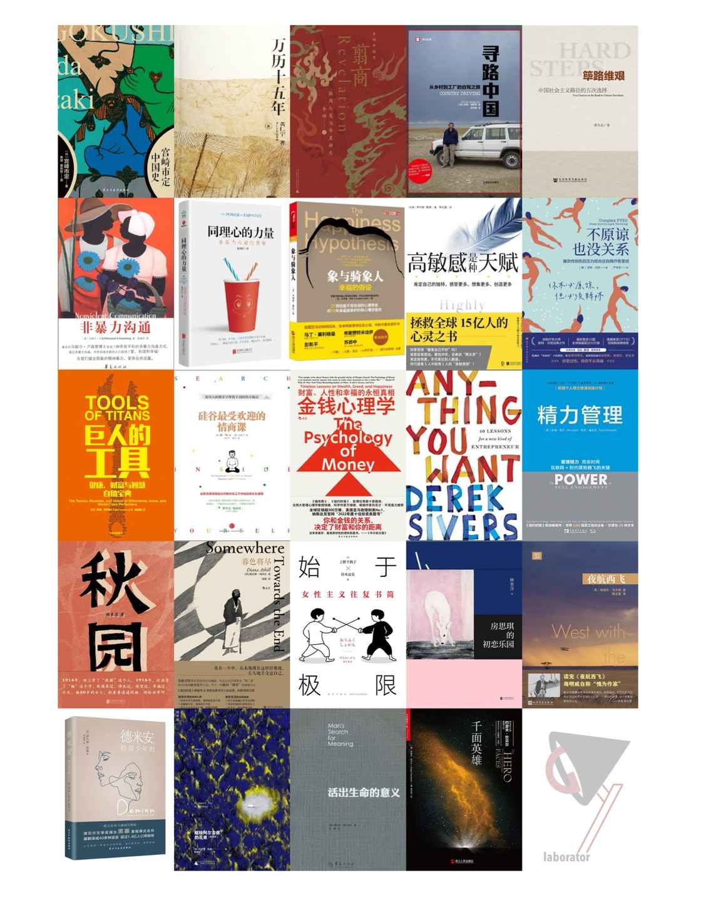

by AGuiJ

## 第一条路：关于中国

由 5 本书组成为两条并行的线，分别是「中国历史」和「了解中国」。

乍看起来前者似乎是在后者范围内的，可读了历史类书籍后我就觉得中国历史需要被独立看待，以便用客观的视角去理解。理由是**中国历史不只是中国人写的**。随着阅读的深入，你会发现中国历史学者的研究离不开日本、以及大量华裔学者的贡献，他们是我们口中的「他者」。

比如黄仁宇和宫崎市定。我是在 2022 年通过黄仁宇的[《中国大历史》](https://book.douban.com/subject/1015699/)开启对中国历史的了解的，今年接着读了他最受欢迎的著作[《万历十五年》](https://book.douban.com/subject/1041482/)，再读了宫崎市定[《宫崎市定中国史》](https://book.douban.com/subject/30415556/)。

宫崎市定是日本人，致力于研究中国史，生于 20 世纪的第一年：1901 年。黄仁宇在湖南出生，56 岁入了美国籍，死于 20 世纪的最后一年：2000 年。两位历史学家都生活在同一个时代，一个「负责」开头，一个「负责」结尾。不知道这种时代特性是否对他们产生了影响，宫崎市定在书的一开头就强调历史不是客观的学问，并不是谁来写都一样，他认为历史学家所做的判断要在基于自己的决定并承担全部责任的情况下做出，而不是左看看、右看看再来决定自己的态度。黄仁宇在《中国大历史》的自序中强调自己写的历史是从技术的角度看，而不是从道德的角度检讨。方法是将现有中国史料高度压缩，构成一个简明而前后连贯的纲领，在与欧美史比较的基础上加以研究。

以上，在我看来，黄仁宇提供的是「他者」视角，从外向内看；宫崎市定提供的不是「他者」的视角，而是中立者的视角。

拿书中的内容来说明。

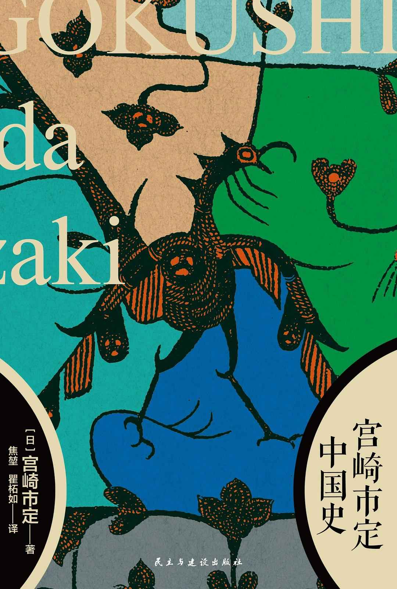

《宫崎市定中国史》从三代（夏商周）写到中华民国，篇幅最多的是从北宋开始到清结束的「近世史」（这是他对时代的分法），其中又以宋代着墨最重。在概述中作者写到「中国在大约北宋一代展开自己的文艺复兴之后，其文化已凌驾于西亚之上，于是出现了由东向西的文化潮流。其中能明确观察到的，是中国绘画的影响。随后在「南宋、金」这一章里，秦桧设计罢免岳飞，将其投狱，致其冤死。宋高宗与大金皇帝缔结和约，不仅要给对方钱，还要给大金皇帝行臣下礼。作者发出了「**这真是闻所未闻，无比屈辱**」的感慨。在经历了北宋的统一、文艺复兴和经济繁荣后又走向分裂和政治的崩坏，这种感慨是不可避免的。

所谓中立的态度，我认为不是不带感情的研究者，而是跟随历史起落的观察者。不过很遗憾，本书对国民政府以及抗日战争的描写只有寥寥几页。

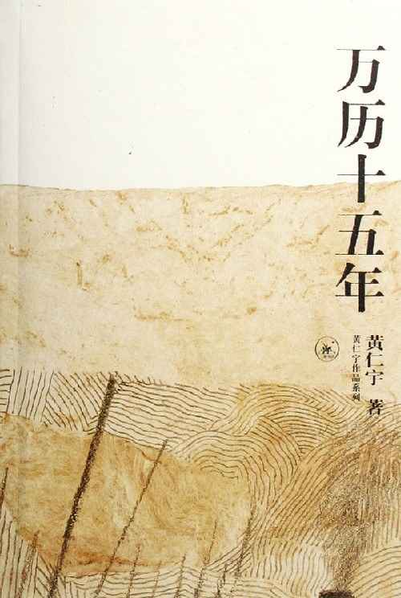

《万历十五年》从万历皇帝写起，一共七章，围绕 1587 年的若干事件，细致地描写出明代走向灭亡的种种伏笔。

我想这本书之所以受欢迎，和黄仁宇对明史的兴趣分不开，他在自序中写道：「多年以来摸索于材料之中，我对明史中的若干方面形成了自己的初步看法，开始摆脱了人云亦云的束缚。」所以他笔下的万历皇帝是颠覆普通人认知的，是「苦」的：「**皇位是一种社会制度，他朱翊钧却是一个有血有肉的个人**。一登皇位，他的全部言行都要符合道德规范，但是道德规范的解释却分属于文官。」最终，朱翊钧转向消极无为，成了后世口中的懒皇帝。

这本书对我的启发还有很多，书中内容也帮助我串起了很多零散的点，以后可能会写到。

除以上两本历史书，今年还读了[《翦商》](https://book.douban.com/subject/36096304/)。

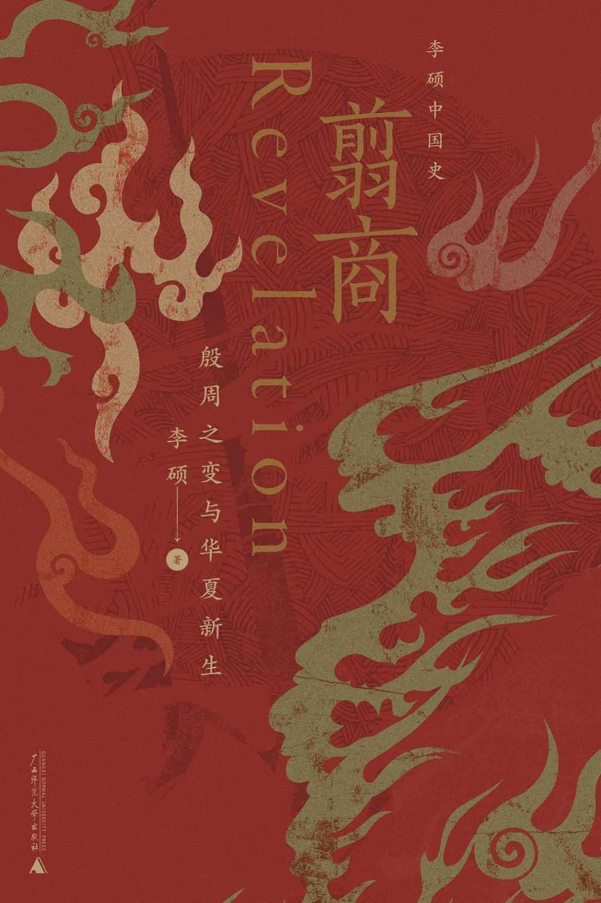

这是一本对从夏到商再到周的历史及文化的解读，作者用考古成果和甲骨文研究成果作为支撑，试图为读者描绘出一种华夏文明最初的模样。这个模样，贯穿着「活人祭祀」，是蛮荒时代生存法则的呈现：为了生就得死，想拥有就得奉献，要保护自己就得排异。

在阅读过程中，能感受到作者所付出的心力，一方面是对大量史料的梳理，另一方面是需对现代人无法理解的野蛮行为进行推测。每一次书中写到考古挖掘出的「人祭坑」，我都感觉作者写出被献祭的儿童和成人数字是客观的，可透过纸背似乎又满是荒唐和绝望。

刚好读这本书的时候电影[《封神》](https://movie.douban.com/subject/10604086/)火了，一边是用神话封装的娱乐故事，苏妲己成了妖怪，唯爱殷寿，助纣为虐；另一边是作者推测的历史中，苏妲己是把周昌从纣王的牢狱中解救出来的关键。而书名的翦是取自甲骨文中「歼灭」的意思，翦商正是指周昌从依附商族，到被囚禁，再到密谋取而代之的过程。如何使其光明正大呢，也许书写历史的人选择了红颜祸水。由此窥见，女性作为男权的替罪羊已经太久太久了。

「了解中国」的路径是类似的。

[《寻路中国》](https://book.douban.com/subject/5414391/)提供「他者」的角度，作者是美国人彼得·海斯勒，又名何伟，97 年在重庆涪陵教过书。《筚路维艰：中国社会主义路径的五次选择》是向内看的视角，巧合的是作者萧冬连也是湖南人，和黄仁宇一样也当过兵，现在是解放军上校。

读《寻路中国》能很明确感受到何伟是站在外国人的视角去理解自己在中国大陆上遇到的种种事情，当然也跟他写的是纪实文学分不开，毕竟故事发生在 1997 年到 2007 年的中国，即使他想让自己不那么显眼，也是很难的。正是通过他的视角，我们得以把中国人习以为常的事，掰开了看。

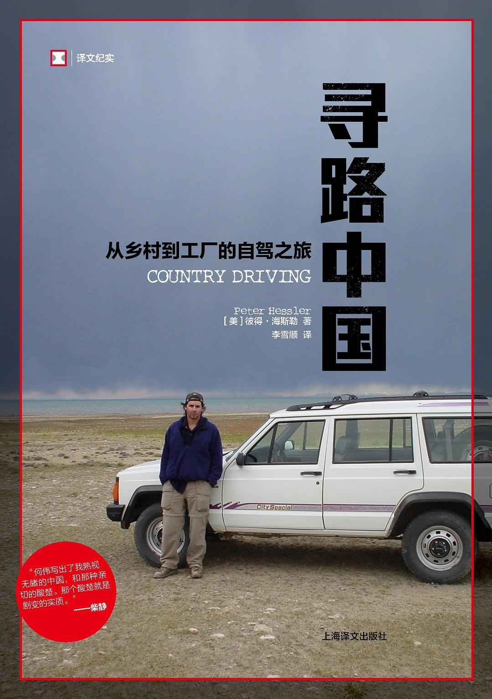

让我印象最深刻的有两处。

有趣的是，我习惯在读一本书的时候，把从哪里知道这本的信息源头记录起来，《寻路中国》是来自我关注的美妆博主——En-J 的推荐，她时常分享自己的书单。我喜欢这样看似毫无关联的信息渠道，有助于打破信息壁垒。

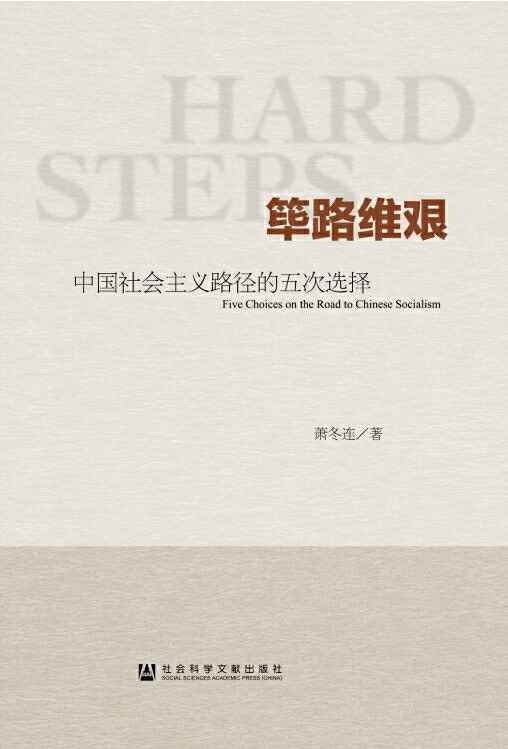

在之前的文章里我写过，[《筚路维艰》](https://book.douban.com/subject/26171466/)给我的启发是对「二元思维」的理解。查资料的时候，看到萧冬连的主要论文就有《中国二元社会结构形成的历史考察》，可见对这方面他的研究是扎实的。

这本书是对当代中国史的研究，从 1949 年起到转向改革开放。整本书读下来，不敢说字字珠玑，确实是非常有态度的。作者在前言中写到自己作为一个严肃的历史研究者，避免为主观情绪所左右，不做简单的道德和价值评判，把「追寻真相作为自己的任务」。多的就不展开了，全书 22 万字，没有废话，值得买回家读一读。

另外，这本书正是本文一开头提到的「读到最后有彩蛋」。在正文后，收录了六名专家学者针对本书初稿所给出的意见，根据他们的发言录音整理成文。很精彩，读完后我理解到什么是「筚路维艰」，正是把心里话讲出来的过程。

巧合的是，萧东连还写过一本名为《求索中国》的书，并未面向普通读者出售。一边是寻路，一边是求索，可以看到，路一直都在，只是你走不走得通而已。

没想到第一条路就写了这么多，确实是太喜欢和中国、中国历史有关的书了。我知道对一些不那么爱看书的朋友来说，这块内容其实不太好「下手」，提到「历史」，难免觉得枯燥乏味，可是一旦你遇到像黄仁宇、宫崎市定、萧东连、李硕、何伟这样的作者，从这些中立、求真、有扎实的研究基础的学者开始，他们的书一定会让你爱不释手。毕竟，中国这么大，可读的、要读的东西太多了，总会有让你好奇的、兴奋的，甚至是无法释怀的那条路，走上去吧，它必定充满奇迹，充满发现。

还有四条路，对我来说，它们的关系是用**「心理学」**打基础，以**「个人成长」**作为「道」，以**「认知与方法」**作为「术」，**「女性主义」**是靠山和补给，保持探索和发现。下面一一展开。

## 第二条路：心理学

由 5 本书组成。

整个 2023 年我花在阅读上的时间和精力不少，仅次于写作。很多时候读完一本书，受到了启发，我都会很有感觉地把读后感写出来，在「心理学」和「认知与方法」这两条路上尤为明显：

-   《非暴力沟通》和《同理心的力量》：[上半年阅读心得（上）](http://mp.weixin.qq.com/s?__biz=MzA5Nzg4NTM5Nw==&mid=2247484940&idx=1&sn=f110df8547d986c375a93124ef36140c&chksm=909b4bb6a7ecc2a01096fe61feff9f5fe4a58a43627caa376fa8e1193e63202c3c061c352aad&scene=21#wechat_redirect)
-   《高敏感是种天赋》：[认识一种天赋](http://mp.weixin.qq.com/s?__biz=MzA5Nzg4NTM5Nw==&mid=2247485183&idx=1&sn=c8c731f35762a5684dccf2e21f53023b&chksm=909b4b45a7ecc253b113a04d625a2ba650337e2afced383349feffce60972c1393ef31b9249a&scene=21#wechat_redirect)
-   《不原谅也没关系》：「[受害者思维](http://mp.weixin.qq.com/s?__biz=MzA5Nzg4NTM5Nw==&mid=2247485160&idx=1&sn=8ca70ccd4876c24f18520b6f7d8a77f9&chksm=909b4b52a7ecc24446d2d31c358857421977256a56b5f7cbd6a5915edc3a523b5dc3be969c5b&scene=21#wechat_redirect)」[的讨论（下）](http://mp.weixin.qq.com/s?__biz=MzA5Nzg4NTM5Nw==&mid=2247485160&idx=1&sn=8ca70ccd4876c24f18520b6f7d8a77f9&chksm=909b4b52a7ecc24446d2d31c358857421977256a56b5f7cbd6a5915edc3a523b5dc3be969c5b&scene=21#wechat_redirect)

还有一本没写过的是[《象与骑象人》](https://book.douban.com/subject/20260640/)，是偶然有一天听一个播客节目，主播们分享了自己做心理咨询的体验，其中就提到了这本书，我就立刻在微信读书里找到它，开始读起来。

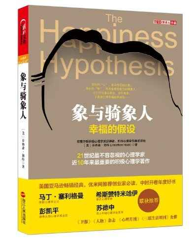

这里插一句，微信读书确实是阅读好伴侣，可以帮你统计阅读时长，在读完时整理笔记也特别方便，我的方式就是读完后把笔记复制到 Notion 上，再进行下一步的归纳总结。并且，有时候想到某一个点，忘了是书里哪部分的内容，也可以很方便地在微信读书里通过搜索关键词来找到，这一点是在读纸质书时做不到的。不过微信读书的缺点也很明显，会有书籍下架一说，所以我这两年还是会收藏纸质书的。

回到《象与骑象人》，我觉得这本书的名字就很有意思。

在读之前，我偶尔会看到别人的文章或对话里提到：**房间里的大象**（Elephant in the room）。它是用来隐喻某件虽然明显却被集体视而不见、不做讨论的事情或者风险，亦或是一种不敢反抗争辩某些明显的问题的集体迷思。起源于俄语，被作为一种概念代称而广泛传播是从 1885 年马克·吐温创作的短篇小说《白象失窃记》开始。

我的好奇在于「象」和「骑象人」分别指代的是什么，既然这是一本心理学著作，那它要讲的故事是怎样的。

作者引用了佛陀、心理学家、哲学家、科学家的智慧和研究结果，得出如下结论：

> 骑象人扮演的是顾问的角色，也是一位仆人，他不是国王、总裁，也不是能紧控缰绳的马夫。骑象人是加扎尼加所称的「诠释模块」，它是有意识的、控制后的思考。相反，大象则是骑象人以外的一切。大象包含我们内心的感觉、本能反应、情绪和直觉，这些都是自动化系统的组成要件。

围绕着「**骑象人无法在违背大象本身意愿的情况下命令大象**」这个观点，整本书的结构就分为了「人象对峙」「大象的力量」「驭象之道」和「驭象而奔」这四个部分。

这样看起来逻辑挺清晰的，可是在读的时候，却觉得散，是相对这个结构而言的散。因为每一章的内容并不是完全独立，第一部分里有大象的力量，第三部分里又有驭象而奔，给你一种什么感觉呢，就是你带着读到这个主题的预期往下走的时候，发现自己得到的却不是这个主题，或者不全是这个主题的内容。

直到查资料的时候，看到了这本书的原版。首先从书名开始就和中文版不太一样，原名是*The Happiness Hypothesis: Finding Modern Truth in Ancient Wisdom*，直译过来是，幸福的假设：从古代智慧中发现现代真理；其次是章节，并没有上面写到的四个部分，就是十一个章节。

这才发现中文版有多么地「自以为是」，加了一个概括性的书名，然后就得围绕着这个它概括出对应的结构，看似乎增强了逻辑性，实则更改了书的本意。整本书的主题不只是讲象和骑象人的关系，而是作者基于自己的积极心理学研究背景，对历史上思想家们智慧的提炼，围绕美德、幸福、成就感和人生意义的探讨。

不知道出品方的理念是什么，从卖书的角度来说，就像一开始我也是对书名产生了兴趣，他们起了一个吸引人的名字，并保证读者翻阅目录时能维持这种吸引力，然后下单。可始终是曲解了作者的本意，也剥夺了读者自行探索的一种可能性。作者当然也想自己的书卖得好，但这肯定不是他最在意的事，如果是，那他写不出这本书；如果出品方觉得是，那他们肯定没读过这本书。

在不少中文版的外文书籍上，我都产生过类似的疑惑，读完后明白书是好书，内容是有启发有意义的，可阅读体验就不太好，所以有机会还是多读原版。多一句嘴，语言绝对不是一个障碍，而是一个机会，一把钥匙。

回到「心理学」这条路，一开始也是感兴趣，有种自己的病自己治，「久病成良医」的想法，从上面一篇篇读后感是看得出来的。渐渐地发现，心理学是一门融合了哲学、医学的学问，至少在我看来是这样，有时候作者的观点是基于实验结果和科学研究成果的，有时候又是带有主观推测性的，所以，这里就有很多可能性，给我的感觉就是它是「素质教育」，就是你自己去理解，自己去玩儿吧，玩出心得，玩出体会，那就是你自己的东西。而不是应试教育，不是学了这门课后去回答别人出的考卷，也不是超出这门课以外的东西都会被禁止的。

## 第三条路：认知与方法

由 6 本书组成，其中有四本也在之前的文章里写过了：

-   《巨人的工具》：[好观点不如好问题](http://mp.weixin.qq.com/s?__biz=MzA5Nzg4NTM5Nw==&mid=2247485084&idx=1&sn=b72f78d3c06cf2dacb5dc8376c7887d9&chksm=909b4b26a7ecc230f8d4ddda4fe0051226baa22373b7c931b1c51e3c88608d8e1d208b245d53&scene=21#wechat_redirect)
-   《硅谷最受欢迎的情商课》：[上半年阅读心得（下）](http://mp.weixin.qq.com/s?__biz=MzA5Nzg4NTM5Nw==&mid=2247484950&idx=1&sn=3ee8a4816c4add838cd73d7c7077f25e&chksm=909b4baca7ecc2ba52257a18e42b238bf3fa25ae7458fda09a9755902374090d8464c91fb578&scene=21#wechat_redirect)
-   《金钱心理学》：[我接受自己的失败](http://mp.weixin.qq.com/s?__biz=MzA5Nzg4NTM5Nw==&mid=2247485093&idx=1&sn=e96db5d034d8c6ae78d213c21d42ed15&chksm=909b4b1fa7ecc209163344c8c7c2ee1f3a9a2039d72f0b6fbc176c2b59b3921c5038287dd038&scene=21#wechat_redirect)
-   《精力管理》：[给自己提问](http://mp.weixin.qq.com/s?__biz=MzA5Nzg4NTM5Nw==&mid=2247485117&idx=1&sn=94291d069ecdb77378be887cbc27ac71&chksm=909b4b07a7ecc211bb15ec620f111309dd8fe9d936fc4447bda7aa48d4d5d455b8f0ee2d9936&scene=21#wechat_redirect)

还有两本，分别是《有限与无限的游戏》和我读完的第一本英文书《Anything You Want》。都很短，前者不到 7 万字，后者不到 90 页。

这两本书给我的感悟是，越简单的道理越深刻。以及，**有时候看起来很简单的一本书，实则很深奥；有时候看起来不好理解的书，其实很简单**。

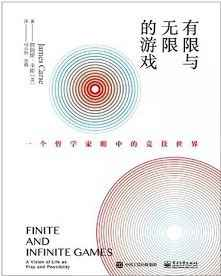

[《有限与无限的游戏》](https://book.douban.com/subject/33438841/)我从 7 月读到 8 月，中间卡在某一章，读了几遍感觉都不太能理解，不知道为什么。当时还去小红书发了贴，有网友评论说：「会先逼着自己看完，当下没看懂也没关系，留个印象，后续看相关书籍的时候可能某一个瞬间就通了」。我觉得他说得很有道理，读书就是这样的，不懂没关系，没记住也没关系，你会在某一个瞬间发现自己能开始融会贯通了，那些曾经的障碍点就被一一击破。而对于这本书，我的方法是先看完，然后通过实践来理解，也就是让自己成为「无限游戏」的玩家，具体是怎么做的呢，可能后面会来写一写。

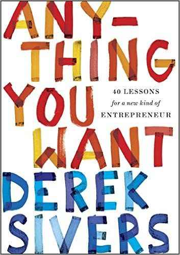

[《Anything You Want》](https://book.douban.com/subject/26979259/)是一本英文书，我的英语水平一般，主要欠缺在单词量上。这么看起来，读这本书其实会挺吃力的。实际却出乎我的意料，两天就看完了，还收获了很多新的单词。

我觉得最重要的是拿起书就开读，不要觉得自己英语不行，这不行那不行，一上来就是畏难心理，把这些想法放在一边，不去理会，只需要知道自己是想读这本书的，去读就好了。因为它不是一本教科书，也不是大部头的社科类书籍，简单来说就是作者分享自己的生意经，分享自己的心路历程，没有那么书面化，即使有不懂的单词，也可以猜出这段话的意思。然后你就会发现，很有意思，为什么说语言不是一个障碍，而是一把钥匙，它让你有机会和更多的人对话。读书不就是和作者对话的过程吗。我也会继续读英文书籍，不为了学英语，只为了看见和对话。

## 第四条路：女性主义

由 5 本书组成，每一本都令人动容。

为什么说「女性主义」是我的靠山和补给，首先当然因为我是女性，这是事实，我接受这个事实，并不与之对抗；其次是看到了女性在不平等和被压迫的生存状态下的坚韧，这来自于母亲，也来自创造生命和生命本身的力量。

《秋园》和《暮色将尽》正是表达了女性力量的作品。巧合的是，自传体小说《秋园》中的主角秋园生于 1914 年，自传《暮色将尽》的主角也就是作者本人生于 1917 年。同样的年代，经历着完全不同的生活，一种是近乎绝望的处境，一种是出生即充满可能性的处境。这世间有公平吗，从出生起，我们就开启了不公平，这似是造物主的礼物。

读《秋园》时，我数次落泪，无法平静克制地读这本书。你会觉得有时候人活着怎么就这么难，为什么时代会这么阴暗，人祸何以至此！可是，当杨本芬花甲之年开始写作，把母亲秋园的故事写出来时，在她 80 岁这本书才出版，你会感受到她的勇气，母亲的勇气，是一棵大树，深深扎根于这片土地，世世代代传承着，足以面对所有处境。豆瓣上有一个书评写道：「**这本写母亲的书，不叫《关于我母亲的一切》，这本写乡村的书，不叫《乡间生死》。她就叫《秋园》**。」

《暮色将尽》的作者戴安娜·阿西尔当了一辈子图书编辑，70 多岁开始写作，101 岁去世，通过她的笔，我们能看到衰老是一种优雅的，主动的，毋需被评判的生活状态，她写到自己 60 岁时还有满意的性生活，80 岁时还能开车上路……原以为暮色将尽是面对死亡的恐惧，结果是生命的丰盛和圆满。与其说阿西尔是幸运的，不如说她选择以幽默的态度来面对生活，她坦诚地写道自己的弱点、秘密，真实地面对自己拥有的和不曾企及的。

真实的故事传递真诚，总是能引人共鸣。

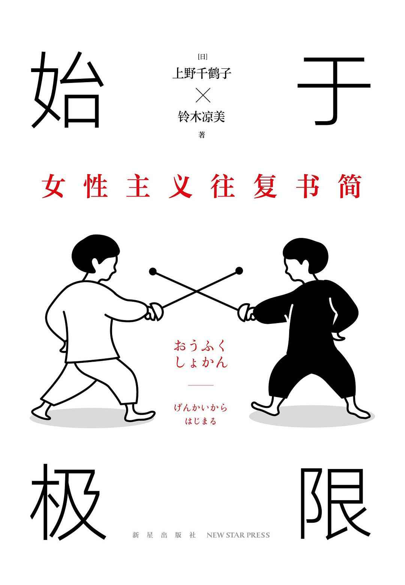

[《始于极限》](https://book.douban.com/subject/35966120/)就是这样一次真诚的对话，来自著名的女性主义社会学家上野千鹤子和曾做过夜总会女招待、AV 女演员等工作的铃木凉美。

她们围绕着当下热门的主题进行讨论，你来我往，有时候就像本书中文版封面上两个击剑的人一样，针尖对麦芒。在一次次对话中，你能感受到铃木凉美的疑惑，这些疑惑你身上也有，很多女性身上也会有；而上野千鹤子老师乐于从这些疑惑中发现你的真实需求，你的渴望是什么，她不妄加引导，而是通过分享自己的人生经历来告诉你，这不是一条孤独的寻找答案之路。我很喜欢豆瓣上一个网友的点评：「大是大非可能很容易判断，然而琐碎和细节的日常才更需要分辨。书里说出了性从业者的心理损伤，母女代际间的问题……把日常中遇到的不那么明显的迷惑解释得很清楚。」

女性常常被定义为容易陷入细节的角色，她们会顾不了大局，从这本书里你会发现，**所谓的大局，不过是掩盖日常细节的借口，那些被细节困住的女性，需要的不是拥有顾全大局的能力，正是觉察细节的判断力**。

《房思琪的初恋乐园》在我和余老师的播客节目《抽空聊聊》里讲过了：[抽空聊聊 03](http://mp.weixin.qq.com/s?__biz=MzA5Nzg4NTM5Nw==&mid=2247485006&idx=1&sn=1ced585994fcd23d4668d5a375bd858f&chksm=909b4bf4a7ecc2e2c0d2898557a4dfa4520412b6650b39b003910a0c527d7f46502932f8effe&scene=21#wechat_redirect)。在这里也欢迎大家收听《抽空聊聊》，我们想通过这个节目传递的一份真诚和陪伴，分享我们看到的故事、听见的意见以及产生的感悟，以及不会停止的对生活的热爱。目前由于没有具体的反馈，处于停滞不前的创作状态，希望能有你的鼓励。

还有一本是[《夜航西飞》](https://book.douban.com/subject/26912301/)。

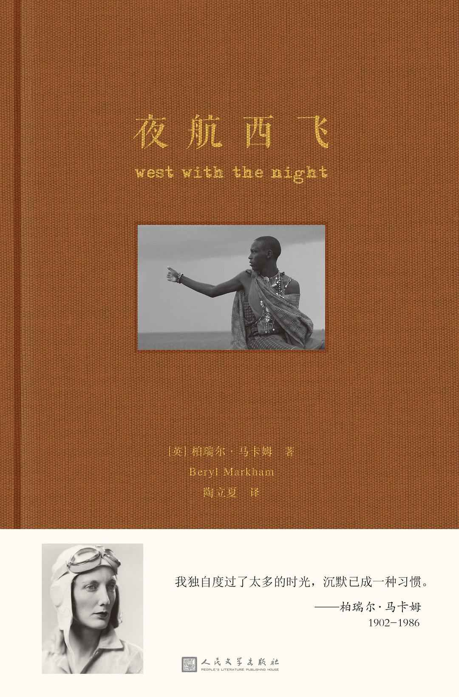

这是一本自传，作者是四岁时随父亲到了肯尼亚，十八岁便成为非洲首位持赛马训练师执照的女性，非洲第一位职业女飞行员的柏瑞尔·马卡姆。这是我个人今年第二喜欢的一本书（最喜欢的一本在结尾），这个评价非常主观也非常个人的，不值得参考。我感觉它不像一本自传，也不是纪实文学，我就是当小说来读的。

在这本书里我读到一种不限于性别，就像开着飞机翱翔在天空上的柏瑞尔，享受着孤独，享受着生命本身的状态，和自然、和动物连接，没有人群，没有束缚，所有的问题都可以不是问题，所有的问题都可以不需要答案。阅读这本书的时候，我就是处于这样的状态，无依无靠，也无需依靠。我看到有书评写这本书：「通篇的文字都充斥着令人烦躁的文艺范儿……最要命的是作者真是想到哪里写哪里，说句不好听的，简直是东一榔头西一棒子」，下面我想引用一段原文，试图理解为什么这个书评会这样写，以及为什么我喜欢柏瑞尔的文字：

> 即便在飞机中独处一晚和一天这么短的时间，不可避免地孤身一人，除了微弱光线中的仪器和双手，没有别的能看；除了自己的勇气，没有别的好盘算：除了扎根在你脑海的那些信仰、面孔和希望，没有别的好思索——这种体验就像你在夜晚发现有陌生人与你并肩而行那般叫人惊讶。你就是那个陌生人。

## 第五条路：个人成长

终于来到了 2023 阅读地图的最后一条路，由《德米安：少年彷徨时》《千面英雄》和《活出生命的意义》三本书组成。

[《千面英雄》](https://book.douban.com/subject/26707803/)这本书出现在「个人成长」似乎有些牵强，不过我觉得它是最「点题」的。个人成长是每个人走自己的路，而每个人的路都不同，一千个读者有一千个哈姆雷特，一千个人就是一千个英雄。书中讲述的英雄之旅的故事，就是神话故事中知天命的英雄，展开了自己的历险，经历了「**启程 - 启蒙 - 归来**」这三种旅程。

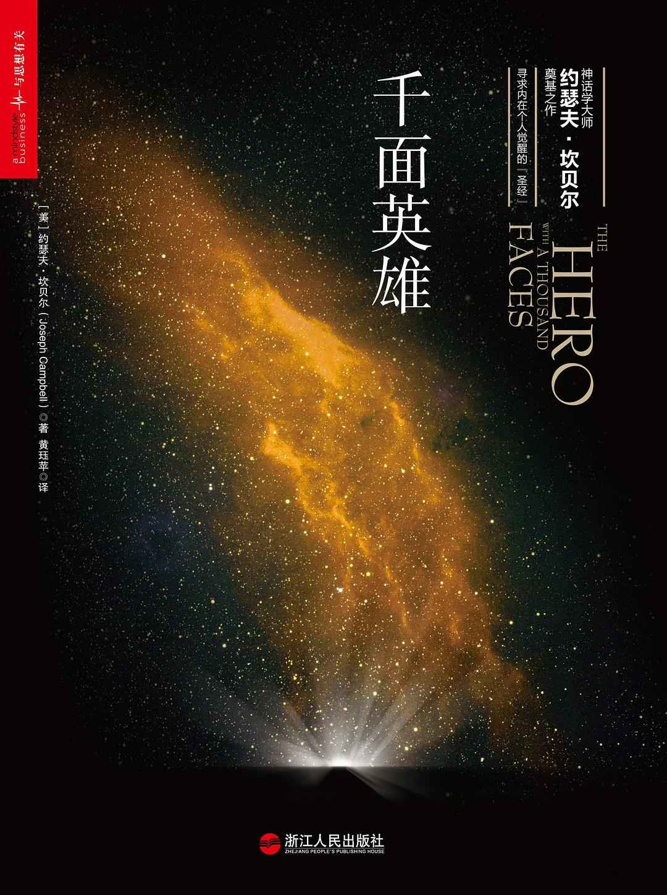

这本书也是很多作家的灵感来源，比如 J. K. 罗琳，比如《星球大战》的导演和编剧乔治·卢卡斯。一翻开这本书我就收获了惊喜，序言里写到作者的生平，有一段是「全球经济灾难持续了整个 20 世纪 30 年代，像很多人一样，坎贝尔失业了，他连续五年找不到工作，于是选择了看书。」谢谢，有被安慰到。

我和坎贝尔不一样，我写不出《千面英雄》，同样的是，他也写不出我的故事。对我来说，个人成长就是认识到你和别人不一样。

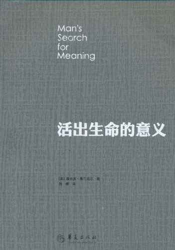

[《活出生命的意义》](https://book.douban.com/subject/5330333/)是在我 2023 年一开始感觉状态低迷的时候读的，这本书很棒，作者是纳粹集中营的一名幸存者，也是一名神经与精神病学教授和心理学家。在被送到集中营前，他就开始思考这本书的内容了，因为他曾在维也纳的一所医院负责照顾自杀未遂的病人们 7 年。所以这本书是真人真事，作者写出自己的故事，也写出病人的故事，还有对其「意义疗法」的介绍——这部分我个人感觉有些专业。

我会把这本书推荐给觉得自己生活挺无聊的人，或者偶尔冒出觉得生活很无聊的念头的人，以及有过轻生念头的人。它完全不是一本「心灵鸡汤」，因为本书作者是一名务实的学者及医生，你能从文字中看出他对严谨的追求，如这段话：「**对意义的认识在我看来最实在不过，就是意识到了现实背景下的某种可能性，或者通俗地说，意识到在给定情境下『能够做些什么』**。」

以及我很喜欢的这段话：

> 由于生命中每一种情况对人来说都是一种挑战，都会提出需要你去解决的问题，所以生命之意义的问题实际上被颠倒了。人不应该问他的生命之意义是什么，而必须承认是生命向他提出了问题。

除开对「人生意义」的启发，作者在全书中的很多观点都令我深有感触，所以相信这本书对你会有所帮助。

第三本，[《德米安：少年彷徨时》](https://book.douban.com/subject/34798904/)。

这是很薄的一本书，德国作家黑塞于 1919 年写的。100 年过去了，这些文字还是能引起我的共鸣，感觉人生真的很简单，就是不断地追寻自我，这期间必然有自我怀疑和否定，以及孤独，都是很自然的事。只不过有的人像黑塞是从小就开始这个旅程，有的人是 60 岁开始，还有的人比如我是 30 岁开始，都没有问题，没有对错，接受命运的安排就好了。

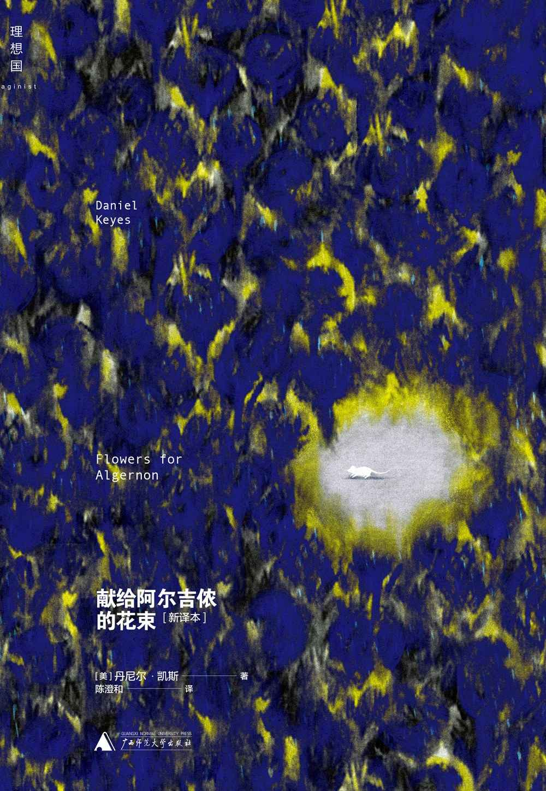

最后，还有一本书推荐，是 2023 年我最喜欢的一本书：《[献给阿尔吉侬的花束](https://book.douban.com/subject/26362836/)》，这是一本小说，这本书教会我：用爱的语言记录自己的一生。仅此而已，足够了。

读过的每一本书都是我脚下坚实的路，那就明年见吧，看看我会走到哪里。

感谢阅读。

