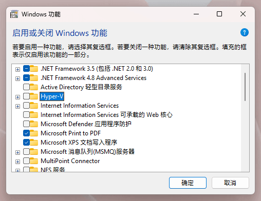
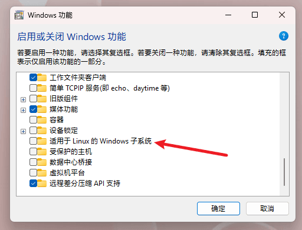
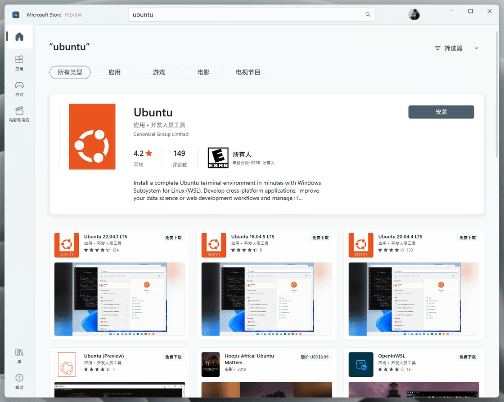
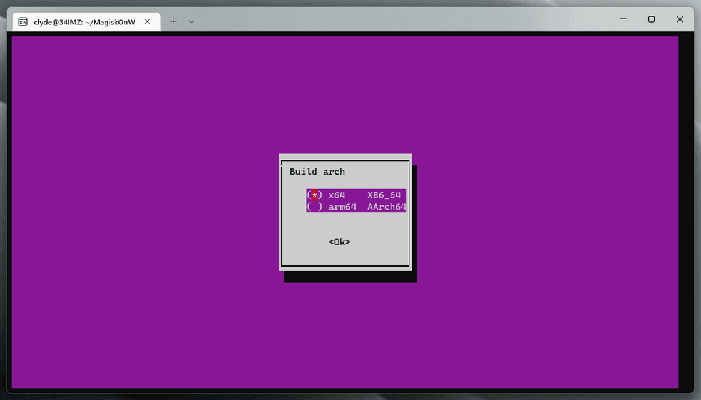
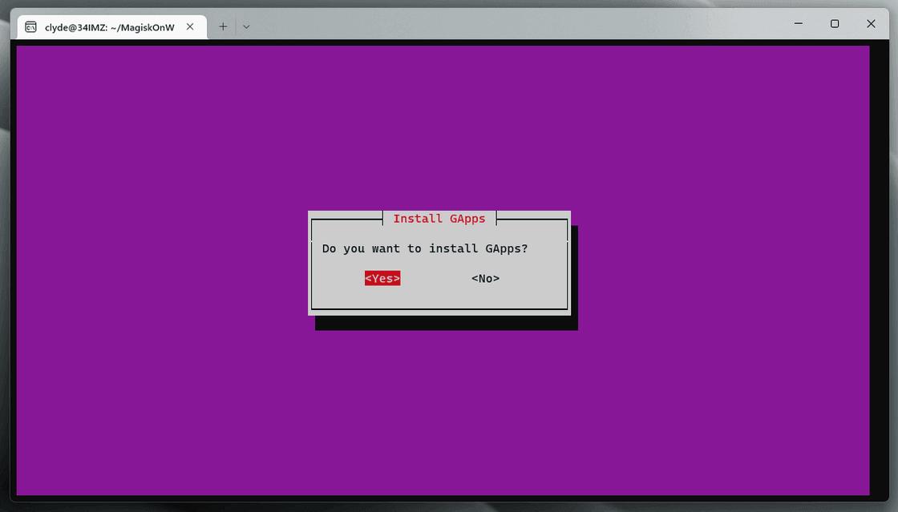
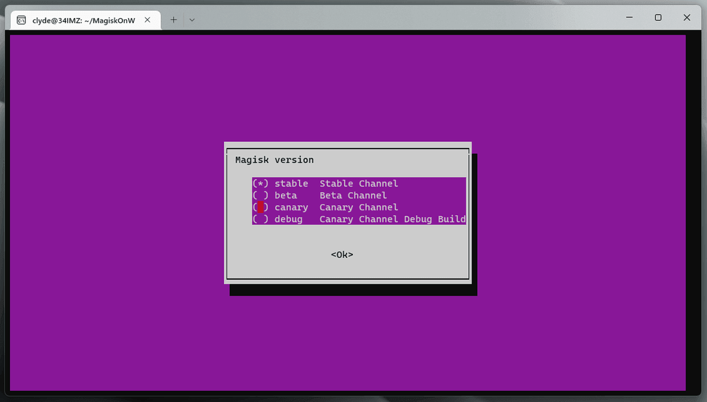
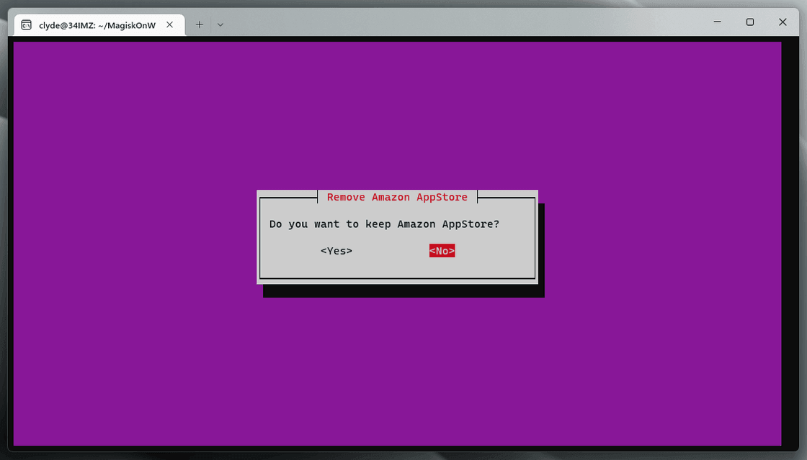
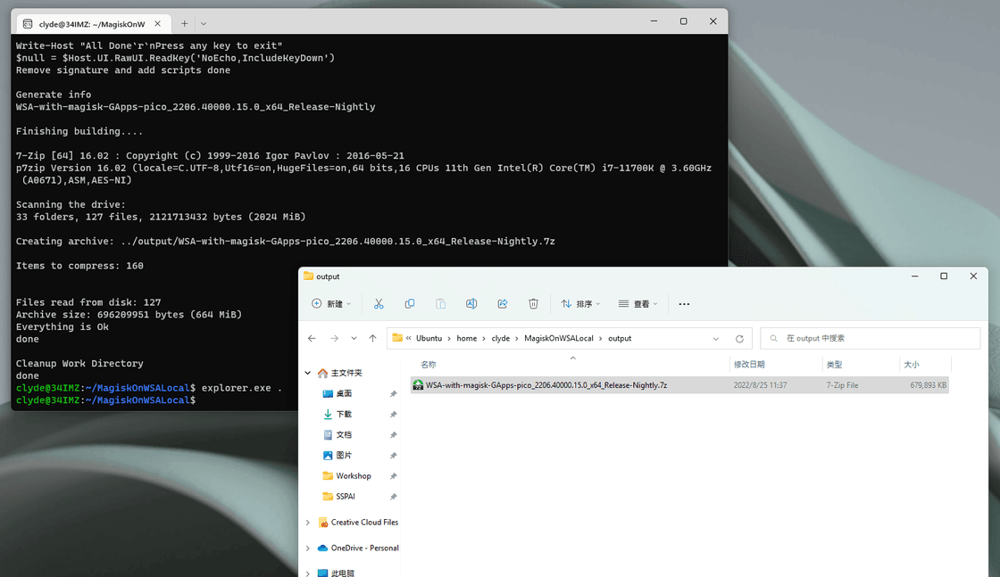
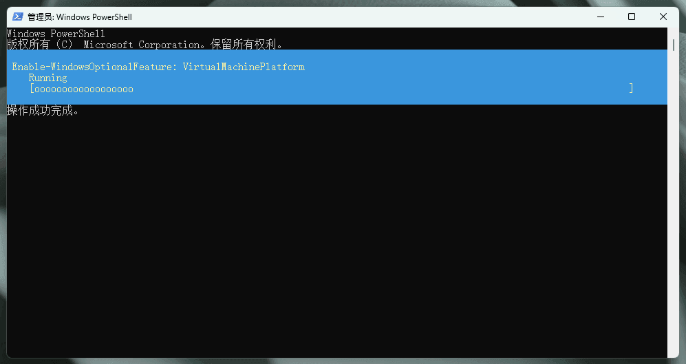

# 一日一技 | WSA 定制安装，找回你需要的 Google 服务和 Magisk - 少数派

早前的 WSA 新版体验曾介绍过一个名为 [MagiskOnWSA](https://sspai.com/link?target=https%3A%2F%2Fgithub.com%2FLSPosed%2FMagiskOnWSA%2Factions) 的 GitHub 项目，借助 GitHub Actions，这个项目可以云端打包一份包含 Magisk 和 GApps 的 WSA 安装包，用起来非常方便省事。

**关联阅读：**[为大屏体验优化的 Android 与 Windows 碰撞：WSA 新版升级与体验](https://sspai.com/post/73422)

本月早些时候，这个项目因违反 GitHub Actions 服务条款而被封禁。所幸开发者很快上线了脱离 GitHub Actions 依赖的本地版本 [MagiskOnWSALocal](https://sspai.com/link?target=https%3A%2F%2Fgithub.com%2FLSPosed%2FMagiskOnWSALocal)（以下简称 MoWL）。借助这个项目，我们依然可以手动配置一份内置 Google 服务和 Magisk 框架的 WSA 安装包。

因为安装打包脚本主要转为本地运行，MoWL 的配置和使用流程相比此前更加复杂。如果你仍有类似需求，希望本文能为你提供一些参考。

MoWL 的主要打包流程从 GitHub Actions 迁移到了本地，因此在 Windows 11 中，我们首先需要配置一套能够在本地运行的 Linux 环境。

这里我们用到的是微软官方推出的适用于 Linux 的 Windows 子系统（以下简称 WSL）。以 MoWL 所推荐的 Ubuntu 为例，在最新版 Windows 11 中，我们可以按照以下步骤来进行安装。

**首先，确保系统已开启虚拟化和 WSL 相关功能**：

1.  在 BIOS 中开启虚拟化支持
2.  在开始菜单中搜索并运行「启用或关闭 Windows 功能」
3.  找到并开启 Hyper-V 和「适用于 Linux 的 Windows 子系统」选项

重启设备后，计算机便准备就绪了。

启用 Hyper-V 与 WSL

随后我们打开命令提示符（`Win+R` 输入 cmd 并回车），输入并执行以下命令来安装 Ubuntu 子系统：

`wsl --install -d Ubuntu`

下载、安装完成后设置好子系统的用户名和密码，Ubuntu 便配置完成了。

配置好虚拟化和 WSL 功能后你也可以直接从 Microsoft Store 进行安装

P.S. 关于 WSL 子系统，不同设备、不同 Windows 版本可能会遭遇不同的安装问题，但大部分问题都可以参考微软官方的配置文档进行排查：

-   [安装 WSL](https://sspai.com/link?target=https%3A%2F%2Fdocs.microsoft.com%2Fzh-cn%2Fwindows%2Fwsl%2Finstall)
-   [旧版 WSL 的手动安装步骤](https://sspai.com/link?target=https%3A%2F%2Fdocs.microsoft.com%2Fzh-cn%2Fwindows%2Fwsl%2Finstall-manual)
-   [排查适用于 Linux 的 Windows 子系统问题](https://sspai.com/link?target=https%3A%2F%2Fdocs.microsoft.com%2Fzh-cn%2Fwindows%2Fwsl%2Ftroubleshooting)

**接下来我们在 Ubuntu 中进行 WSA 安装包编译**。依次执行：

1.  `git clone https://github.com/LSPosed/MagiskOnWSALocal` 将 MoWL 项目克隆至本地
2.  `cd MagiskOnWSALocal` 跳转至本地 MoWL 目录
3.  `scripts/run.sh` 执行安装包定制脚本

在接下来的步骤中，MoWL 贴心地提供了视觉化的交互页面，我们可以根据实际情况，通过方向键选择需要的 WSA 版本（x64/arm64）、GApps 版本、Magisk 版本并去除几乎没用的亚马逊应用商店。

选择架构与 GApps

选择 Magisk 版本与亚马逊商店精简

另外，如果你需要帮朋友生成一份定制安装包，也可以选择自动对输出文件进行压缩打包。

脚本运行完成后，我们可以通过在 Ubuntu 中执行 `explorer.exe .` 来调用 Windows 资源管理器进行浏览，然后找到 MagiskOnWSA\\output 目录中的安装包目录或压缩包，将其移动至其他位置即可。

得到了一份安装包

至此，我们便得到了此前需要通过 GitHub Actions 自动编译得来的安装包。有了安装包，后续的 WSA 安装流程就跟此前是一样的了：在 WSA 目录中找到 Install.ps1，然后通过 PowerShell 管理员模式执行

`PowerShell.exe -ExecutionPolicy Bypass -File .\Install.ps1`

即可完成安装。安装后 Play 商店和 Magisk 将会自动打开。

进行安装

最后提一点来自 MoWL 项目开发者的小 tips：如果你想对 WSA 和 Magisk 进行更新，删除 MagiskOnWSALocal\\download 目录然后重新运行 run.sh 脚本即可获取新版本，最后只需将新版本安装包覆盖到现有 WSA 目录并重新执行 Install.ps1 即可保留数据进行升级。

如果你在安装过程中遇到任何问题，欢迎在评论区留言进行讨论。如果你顺利配置好了环境和脚本，愿意为其他不愿动手的网友打包、上传定制安装包，也欢迎在评论区进行分享。

**关联阅读：**

-   [不用装双系统，直接在 Windows 上体验 Linux：Windows Subsystem for Linux](https://sspai.com/post/43813)
-   [为 WSL 配置这些新功能，不用虚拟机也能体验完整 Linux](https://sspai.com/post/74167)

\> 暑期征文 [数字文具盒](https://sspai.com/post/74751) 火热征稿中，分享学习方法，拿走现金奖励 🎓

