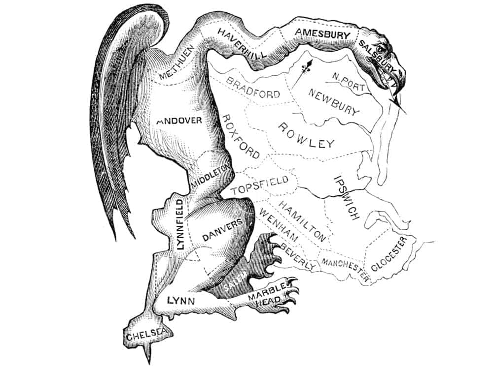
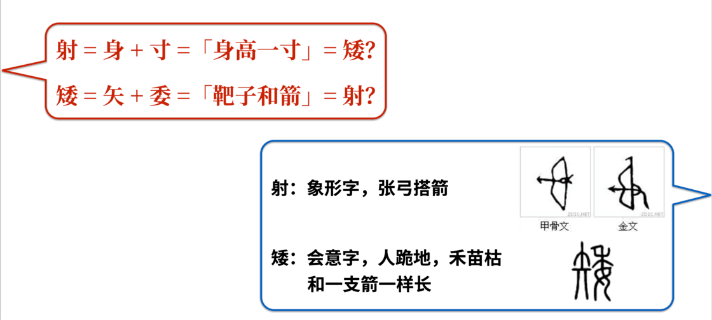
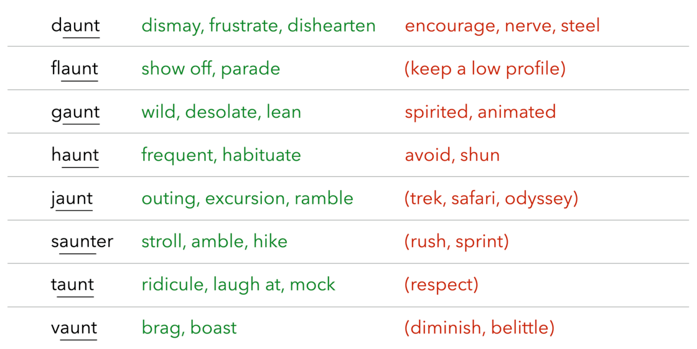
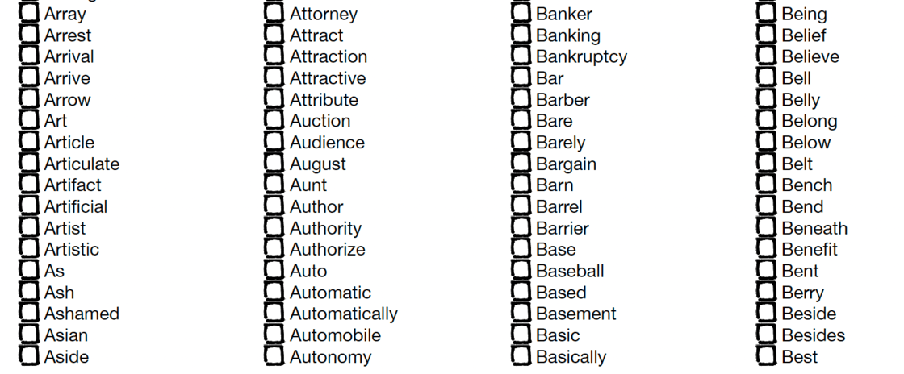

# 以 GRE 为例：如何背多背好英语单词 - 少数派

以 GRE 为例：如何背多背好英语单词

[乔淼](https://sspai.com/u/qiaomiao/updates)

12 月 06 日

作者注：本文以 GRE 考试的词汇学习为例，并以 GRE 考试的题目作为示例。笔者以同样的方法论尝试过高考英语的教学辅导，同样可以起到良好效果。你完全可以读过本文后向下兼容，用于较低级别考试（如托福、四六级和中高考）的词汇学习。

GRE（Graduate Record Examination）或 GRE General Test（GRE 通用考试）是以英语为载体的思维能力测试，主要考查以英语为工作语言的阅读、推理、分析和写作能力。GRE 由美国教育测验服务社（ETS）命题并推广，在同类考试中被公认为难度最高的几种之一。GRE 主要用于研究生和商学院项目的入学申请。许多研究生院和商学院将 GRE General Test 成绩作为录取的硬性条件。

- - -

十年前我在新东方讲课时，总有学生来找我诉苦：

> 老师，我「已经」把单词书背了三遍（或五遍），为什么还有那么多词不认识呢？

「GRE 红宝书」收录了 6000 多个词汇。按照每一遍每个单词 5 秒来计，重复一遍全书需要 8.5 小时。我们建议用 300 小时学习词汇，也即，至少等于把红宝书重复 35 遍。

「才」背了五遍，怎么能行呢？至少也要 30 遍！

回答一个问题：备考 GRE，到底需要多...

备注：GRE（GraduateRecordExaminat...

[↓↓↓](https://sspai.com/post/82557)  
  
sspai.com  
  
[↑↑↑](https://sspai.com/post/82557)

本文是一个技术性总结，旨在为各位需要学习英语、准备考试的朋友提供一套比较完整的单词记忆方法论——或者说，如何尽可能高效地完成 30 遍「背」单词的任务。这里先将文中的主要结论罗列如下：

> 1\. 背单词的需求客观存在
> 
> 2\. 背单词的本质是形成并掌握词汇背后的概念
> 
> 3\. 背单词的效果同时取决于学习时间、学习频率和学习深度
> 
> 4\. 掌握正确的有意义学习方法有助于后期快速扩充词汇量
> 
> 5\. 根据词汇量的层级，在不同阶段有不同的最优学习策略

## 我们为什么必须「背」单词？要背多少词？背到什么程度？

在英语学习——特别是以通过考试为目的的学习——过程中，「背单词」三个字是我们通常无法绕开的。无论是英语语言能力考试（如托福或雅思）还是以英语为载体的学术/思维能力考试（如 SAT 或 GRE），考试难度的提升总是伴随着词汇量要求的水涨船高。例如，大学四级考试的词汇大纲明确包含了约 4500 个词，六级的大纲则包含约 6000 个词。

考试对词汇量的要求客观存在于高位，我们在学习和应考时的词汇水平客观处于某个低位。在复习备考周期相对短、时间相对有限的情况下，我们大概率无法通过常规的阅读、观影等语言输入迅速实现词汇量的积累，只能临阵磨枪、死记硬背。这就是我们为什么必须背单词：因为**过去学得很少，此刻时间太短，未来要求很高。**

背单词的需求不仅发生在外语考试中。相信大多数读者和我一样，在高三的时候，为了应对汉语语文的高考题，背了很多古汉语的词汇，以及现代汉语中的成语和习语——包括字形、读音和语义。你是否还记得「空穴来风」究竟是毫无依据，还是其来有自？你是否曾将明火执仗和仗义执言的「仗」混淆为「杖」？你是否还记得「怙恶不悛」和「黑黢黢」怎么读？……道理是一样的：我们先前读过的书太少，头脑中的语料库太小，积累的词汇和语义太少，只能不择手段先把它们背下来、挺过考试这一关再说。

不止是高考，公考和教资也会考成语……

我们要不要背单词、要背多少单词，是由学习目标决定的。不参加考试或者对成绩没有追求，就没必要如此「背」汉语成语。同理，如果你的目标只是模糊的「学好英语」，而不是「达到某个考试对应的能力水平」，那么你完全不需要「背」单词，更不需要继续阅读本文。如果你有个明确的学习目标，想在相对较短的时间内达到，那么接下来的内容就是为你而写。

难度较高的考试可能并不存在「必考词汇」和「超纲词汇」。托福和 GRE 考试的命题方 ETS，没有为这些考试发布任何词汇大纲，也没有说明「哪些单词一定不做考查要求」。也即，数十万英语词汇，理论上在考试题中都有可能出现。我们只能基于对过往考题的分析，将那些「出现的可能性非常低」及「虽然出现但即使不认识也没关系」的词排除掉，将剩下来的「高频词」「重点词」筛选出来，大致估算出考试对词汇量的要求。例如，托福或雅思考试要求考生的词汇量达到 8000-10000，GRE 则要求 17000-22000。这是顺利应考、拿到较好成绩的底线要求。在此基础上，词汇量多多益善。

主流考试不会拿出诸如 Pneumonoultramicroscopicsilicovolcanoconiosis 这样的冷门词汇（对，你没看错，这是一个英语单词）要你回答其词义，也不会简单询问「肚脐用英文怎么说」。阅读、文法和听力等「输入」类考题通常会采选现实的语料库，例如期刊文章或教授的讲座。口语和写作等「输出」类考题通常会给出一个特定话题，要求给出切题的反应。无论是输入还是输出，只要涉及到单词，本质上都不是在考查「对这个词的拼写、词形的记忆」，而至少是对这个词（以及其含义）进行再认，或者主动应用。换句话说，背单词的「背」，至少意味着记住这个词的词形和含义的对应关系。如果可以的话，最好还能理解，并进行主动应用。

英语中的很多单词拥有不止一个含义。有些词存在一个「基础释义」，并在使用过程中扩展出了一些「衍生释义」。例如 mantle 最初指的就是一种没有袖子的、宽大的、罩在外面的服饰，后来泛指「笼罩或包裹在其他事物外面的东西」，又衍生出「地幔」等特定含义。**我们背单词的最低目标，是至少知道这个单词在考试（或日常语境）中的一个常用含义。**

到这里做一个阶段性的小结：我们已经知道了为什么要背单词，需要背多少单词，以及背单词意味着什么。在明白了「是什么」和「为什么」之后，我们就可以继续讨论「怎么做」。这就涉及到四个具体的技术问题：用什么样的学习材料，每天花多少时间，具体如何操作，学到什么程度。

## 背单词的最优方法，以及折中方法

如果你参加的不是专门的学科类考试，例如 GRE Subject Test，就没必要专门去背各种高精尖的学科术语，也不需要记过于生僻、少见的词汇。我们需要掌握的是那些常考或「高频」的词汇。这种词汇一般已经有很多总结成型的词表。以 GRE 考试为例，从早年的「红宝书（GRE 词汇精选）」以降，市面上出现了很多不同的词汇书，还有背单词的 app 和小程序。词汇书无需依赖电子设备，不容易分心。电子背单词工具便于记录，有较强的获得感。你可以视情况二者择其一而使用。至于选哪本词汇书/词表更好，我的建议是，在时间允许的情况下，尽量选收录词较多的那一本，尽可能覆盖较大的范围。

我在之前的一篇文章中谈到了以「备考」为主要目的的学习时长。例如，从大学六级水平出发备考 GRE，大约需要 600 小时的有效学习时间。你的备考时间中至少有一半会花在背单词上。距离考试的时间跨度越短，你每个学习日花在背单词上的时间应该越长。在最极端的情况下，如果除了吃饭、睡觉、上厕所，所有其他时间（约 16 小时）都用于词汇学习，你应该可以在 15-20 天内完成 GRE 词汇学习所需的任务量。

这种高强度、短时间、大量集中的学习方法有其合理性。在一项发表于 2014 年的研究中 1，研究者设计了一种高强度机械重复的学习方法，要求大学生被试每天用尽可能多的时间背大学六级词汇。经过前测和 20 天的学习后，两组被试接受了一次后测，并在两个月后接受了第二次后测。实验组在第一次后测时成绩相比前测有明显提高，平均词汇量增加了 1800 个，且第二次后测时仍然维持 90% 以上的记忆率。控制组在第一次后测时平均词汇量提升了约 460 个，但在第二次后测时忘掉了新学词汇的 85%。

「17 天搞定 GRE 单词」「7 天搞定托福词汇」并不仅仅是一个噱头。但你是否有这样一段不受干扰的时间，能否承受这种学习强度以及随之而来的痛苦？

如果答案是否定的，我们就只能退而求其次，在日常生活中尽可能挤出学习时间来背单词。在这个折中的方案里，具体的时间分配原则有两条：

> 1\. 优先分配碎片时间
> 
> 2\. 分散学习优于连续学习

所谓碎片时间，就是你「随时随地」能够掌控的零散时间，例如等车、等上菜、排队、课间……这种时间不适宜做其他一些天然需要「完整时间」的学习任务，比如读一篇文章。但单词学习的单位是「一个词」，可以随时开始、随时停下，因而天然地与碎片时间匹配。每当有碎片时间出现，你都可以拿出手机或词汇书，随手学几个单词。如此积少成多，你就可以节约出一些完整的时间，用于其他的学习任务。

分散学习，则意味着我们要以「少量多次」的形式进行词汇学习。我们来想象一下：你与某个貌不惊人、毫无特点的同学，在一个月内总共有五分钟面对面的时间。在一种情况下，你盯着 TA 看了五分钟，然后这一个月都没有再见到过。在另一种情况下，你每天和 TA 两次擦肩而过，每次五秒。在哪一种情况下，你更容易对这个同学形成记忆、保有印象呢？显然是后者。把单词换成同学，就是我们的分散学习：也即，在学习词汇时，不要一次性盯着一个或几个词，试图将它们一下子背会，而是要快速、大量地「浏览」词汇，通过多次重复形成记忆。

你每天可以分配总共 30 分钟的多次碎片时间，加上 2~3 段、每段 20-30 分钟的完整学习时间，用总共约 70-90 分钟进行词汇学习。按照 5 秒一个词的速度计算，你可以看完 8~10 个 List（每个 List 包含 100 个单词），平均每周将红宝书这样的词汇书完整「背」一遍。

这种学习方法乍看是反直觉的。我们往往更加习惯于连续学习一个内容，直至可以初步「背诵」，之后再过渡到下一个内容。我们也更习惯用一个连续的时间「专心致志」进行学习，至少能够因此获得一些安全感。但如前所述，对初学者来说，每个单词就像一个无甚特点的人，持续盯着 TA 看是没有用的，不如零敲碎打、多见几次。所以，至少在刚开始背单词的时候，我建议你进行若干轮这样快速的浏览，争取「重复」见到每一个单词尽可能多次，而不追求单次完成浏览后的「回忆正确率」。

这只是第一步。我们要先形成一些印象，稍后再用其他方法加以巩固。

## 词以「性」记：从刷遍数到分类巩固

我们需要背的单词大部分属于以下五类之一。

第一类是实意名词，指的是具体存在的、指代对象比较单一且清晰的事物。我们在初学一门语言时会接触到大量最常见的实意名词，如家人和日常生活中的各种物品。特别常见的实意名词如家人、食物和日常物品，在低水平的考试中可能会作为考点。复杂的实意名词在高水平的考试中可能出现，但通常伴随解释，即使没有背过也不影响解题，如 plesiosaurus（蛇颈龙）。因此针对实意名词的记忆策略和要求，只要一句话就可以带过。

> 常见的实意名词记形象（看物识词），不常见的实意名词不用刻意背。

第二类是抽象名词。它们包括但不限于「学科术语」或「专有概念」，在更广泛的语境中都可以见到，很难直观理解，需要专门定义和展开解释。例如，juxtaposition（并置法，将两个事物放在一起对比呈现，突出其差异性或相似性），gerrymander（为了让某个政党在选举中不正当地获得多数票而划分选区的行为），以及  filibuster（通过长篇大论的发言拖延或阻止正常议程的行为）。我们学习某种语言越是精深，就越需要有能力用该语言讨论抽象、复杂、深奥的内容。故而越是高水平的英语考试，就必然涉及越多、越复杂的抽象名词。我们若没有掌握足够多的抽象名词，就很难在这样的考试中得到高分。

gerrymander 的典故

你不需要知道犀牛、恒河猴、马蹄蟹和阋神星的正确拼写，但你需要在看到吹牛大王（braggart）、甜言蜜语地欺骗（wheedle）、含沙射影（innuendo）、似非而是的观点（paradox）和似是而非（speciousness）的时候，清晰地知道作者用这些词表达了什么样的含义。

记忆抽象名词的基本原则，如同学习任何领域的「名词解释」，就是尝试通过实例、图示或典故对概念进行可视化。例如上文的 gerrymander，这个词取自美国政治家 Gerry 和 salamander（火蜥蜴）的合成词，背后的典故也大致上对应于其释义。学习者只需要以搜索引擎查询，就能很方便地检索到这些词的词源，以及相关的图示。

询问 chatGPT 也是非常好的学习方法。例如上文中的 innuendo（含沙射影），我们只需要简单地输入一行指令，就可以得到一个进一步的解释，以及一个非常具体的例子。这比询问任何辅导老师都更加快捷方便。

第三类是动词。我们在汉语中有重视名词多过动词的习惯 2，而英语的核心其实是动词而非名词。汉语中「弱动词」和「大名词」的组合，例如「达成现代化」「实现变革」，若直译为英语的「reach the goal of modernization of XXX」「accomplish the transformation」，就会变成 Chinglish（中式英语）。地道的英语表达通常只需动词 modernize 和 transform。从这个意义上来说，作为中国学习者，我们可以将每一个英语动词视为一个「动起来的概念」进行理解。简单的动作如 eat 或 drink 可以当做实意名词，直接记忆「动态的画面」；抽象的动作则可以类比于抽象名词，通过实例、图示或可视化的方式进行理解，然后再去记忆。

最后两类词分别是形容词和副词。它们的作用都是「修饰」，只是作用对象不同：修饰一切名词都要使用形容词，修饰一切非名词成分都要使用副词。如果说名词是「静态概念」而动词是「动态概念」，那么形容词和副词就可以理解为是「概念具有的特征」。那些简单、直观的特征，我们可以再一次当做实意名词，记忆具体的画面；比较抽象的特征，就可以类比为抽象名词，借助于搜索引擎等学习工具，进行可视化的理解。

## 为什么背单词一定要理解概念？

无论记哪种词，我们都要超越词汇，学习其背后的概念。在学习过程中，「理解」的重要性又远高于「记忆」。这样做的理由有二。首先，「有意义学习」无论在学习效果还是主观体验方面都优于单纯的「机械学习」。我们能否在完全不理解概念的情况下，通过最纯粹的死记硬背实现有效记忆？理论上当然可以。艾宾浩斯在研究遗忘曲线时使用的就是完全没有任何意义的音节。如果我们完全不理解英语单词背后的概念，那么背单词就等于背无意义音节，只要重复足够多的遍数，一定能够记住，但所需的时间更长，过程也更加枯燥、痛苦。反之，通过理解单词背后的概念，我们加深了对单词的「加工深度」，而加工深度和记忆效果存在明显的正相关。能够提高效率，同时减少痛苦，何乐而不为。

其次，考试对词汇的考查要求基于概念理解，而非机械记忆，仅仅知道肚脐眼是 belly button 或者 umbilicus 是不够的。你至少需要将单词的词义嵌入一个具体语境，或者在一个具体语境中推断词义。一种考法是 Word in Context 题型，如下例所示：

> 原文：This position regards Renaissance prints as passive representations of their time—documents that reliably record contemporary events, opinions, and beliefs—and therefore as an important means of accessing the popular contemporary consciousness.
> 
> *题目：Replacement of the word“passive”with which of the following words results in the least change in meaning for the passage? （上文中的 passive 一词与下列哪一个词的词义最为接近？或，将上文中的 passive 替换为下列哪一个词，对原文语义的改变最小？）*
> 
> A. Disinterested
> 
> B. Submissive
> 
> C. Flaccid
> 
> D. Supine
> 
> E. Unreceptive

此题表面上是考查我们的「词汇量」，但仅仅记得「passive = 被动」是不够的。我们首先要判断 passive 一词在原文语境中具体意味着什么。根据原文，两个破折号之间的语义解释了 passive：它在这里作为形容词，是「reliably recorded」的同义。也即，此处的「被动」实际上意味着「忠实地、原封不动地还原/反应/记录原始事物的」。接下来，我们还要判断选项中五个词何者表示这种「被动」——事实上，这五个词都可以含混地理解为某种意义上的「被动」，但只有 A 选项「公正、中立、无偏袒、无主观倾向」与原文中 passive 代表的含义一致，因此正确答案选择 A。如果仅仅机械记忆单词，而不理解概念，那么五个选项选哪一个都仿佛有点正确。

这是 GRE 的一道简单题，在考场上做这样一道题的时间不能超过 60 秒。如果你想要把英语学到一个很高的水平，那么上述程度的单词理解和记忆精度就是必须的。

另一种考法是 Text Completion，如下例所示：

> Personal sacrifice without the promise of immediate gain is an anomaly in this era when a sense of \_\_\_\_\_\_ is the most powerful predisposition shaping individual actions.
> 
> A. fairness
> 
> B. humanitarianism
> 
> C. causality
> 
> D. ambiguity
> 
> E. entitlement

这道题要求我们选出最合适的一个词填入空格，构成一个逻辑自洽、语义通顺的句子。原文内容并不难理解，空格所填的内容对应于「Personal sacrifice with the promise of immediate gain」。做出牺牲后可以立即得到回报，这是一种什么样的理念？很多中国学生可能会基于「背诵」过的释义，想当然地选择 A 项的「公平」，而不明白为什么 E 项的「权利」才是正确答案。但如果我们能理解英语中的「fairness」实际上意味着无偏差（公正）且具有合法性，「entitlement」则意味着赋予某人得到某物的资格，那么何者与原文中的「immediate gain」更加匹配，就是不言而喻的。

从概念理解这个目标出发，我们就可以明白，用「联想」或者「谐音」等奇怪的方法背单词，看似有趣，实则无益有害。这些段子很容易污染我们习得的概念，甚至妨碍概念（以及下文中概念网络）的形成。这类学习方法在笔者看来，甚至不值一驳。

意思就是，爱走邪路的人，随便你……

## 进一步理解概念：词根词缀和构词法

英语的构词法规则允许名词、动词、形容词和副词通过后缀（或词尾）的变化相互衍生。在记忆一个词的时候，我们通过增加或减少后缀，可以得到它的一些变体。例如，escalator（自动扶梯）的名词后缀改为动词后缀，就得到了 escalate（逐步升级），然后加入形容词的词尾得到 escalating（逐步升级的）。反之也有形容词延伸到动词，再延伸到名词的例子，例如 modern → modernize → modernization。

后缀主要改变词性，前缀（或词头）则主要改变词义的方向。英语中有很多成对出现的前缀，将它们与同一个词根组合，就能得到成对的反义词。例如在 tension（压力）的前面加上 hypo-（低）或 hyper-（高），就能得到「低血压」或「高血压」。但表示相近含义的前缀可能不止一个，在具体构词的时候用到哪一个前缀，是没有一定之规的。例如，将 hyper- 加在 sonic（音速的）前面，就会得到「高超音速」，这比 supersonic 更快。super- 作为前缀，大家很熟悉，因为每个人都知道 supermarket 是什么。而「亚音速」却不会使用 hypo- 这个前缀，而是使用了另一个意义相近的前缀 sub-（在……之下）。

同样的情况也出现在后缀的选用上。这意味着我们在学习词汇的时候，只能用词根词缀来「理解」已经存在的单词，上文中提到的 Pneumonoultramicroscopicsilicovolcanoconiosis 这个超长单词，其实就是 pneumono-(肺) + ultra（高于，极为）+ microscopic（细微）+ silico（硅）+ volcano（与火山有关的）+ coni（尘埃）+ osis（疾病），则词义很容易理解：尘肺病。

不要拿着无知当个性用来装 X……

但我们不能用「拆词根词缀」的方法现猜单词的词义。这后一种做法在汉语中就是「望文生义」，很容易闹出笑话。例如 disinterested 和 uninterested，分别带有表示否定的前缀 dis- 和 un-，但含义截然不同：前者是「公正，中立，无偏袒」，后者是「不感兴趣」。又例如 flammable 和 inflammable，看似后者带有一个前缀 in-，且该前缀有时用于表示「否定」，但这两个词其实含义相同，都表示「可燃的，易燃的」。

词根词缀不能用于望文猜词，但可以用于词汇扩展。通过前后缀的变化，我们能够从一个「核心词」出发，绘制思维导图，一次性掌握它的多个变体和/或各种关联词。到这里，我们就进入了词汇学习的第三个阶段：在理解单个词概念的基础上，将多个词建立起联系，形成概念之间的网络。走到这一步，我们就已经接近了一切有效学习的核心。3

## 如何织就单词概念的网络？

常见的「织网」路径有以下几种：

> 1\. 同义词 - 近义词 - 反义词
> 
> 2\. 形近词 - 易混词
> 
> 3\. 关联词

同义词、近义词和反义词是考试中经常会直接涉及的内容。当我们的词汇量和语言能力达到一定水平后，就会需要在表达中体现出词汇、用语的多样性。也即，同样的语义，在第二遍、第三遍表述时，不是机械重复原来的用词，而是进行同义替换。这就需要我们以组为单位，掌握一个「意群」中的多个词汇。这些词（或概念）可能彼此绝对同义，也可能在微妙之处有所区别，因而可用于表达不同的含义。例如，都是表「复杂」的形容词，complex，intricate，sophisticated 和 complicated 的含义各有细微差异。想要了解这些差异，最好的办法是查阅英英词典 4，或者询问 chatGPT。chatGPT 在语言学习方面可以视为极好的语法、词汇和语用综合智能大辞典。

现行 GRE 考试中的 Sentence Equivalence 题目，可以视为在语境中考查同义词/近义词的题目。例如：

> By about age eight, children’s phonetic capacities are fully developed but still \_\_\_\_\_; thus children at that age can learn to speak a new language with a native speaker’s accent.
> 
> A. plastic
> 
> B. vestigial
> 
> C. inarticulate
> 
> D. unformed
> 
> E. nascent
> 
> F. malleable

这类题目要求我们选择两个选项填入空格，两个选项填入后形成的两个句子在语义上构成「等价」，因此得名为「句子等价」题。我们根据上题的句子可知，空格所填内容对应于「在学习第二语言时可习得和母语者一样的口音」，则正确答案为 A 和 F，二者都有「可塑」之意。C 和 D 选项构成一对近义词「不清晰，未成型」，但并不符合句子的语义逻辑。

反义词在阅读理解、逻辑推理和分析性写作中经常需要用到。2011 年改革前的 GRE 考试中有直接考查反义词的题目，由于形式过于简单粗暴，如今已经取消。但这些「老题」仍然可以作为练习或自查，用来检验我们的词汇量。

同义词/近义词和反义词的织网学习可以采用「成对意群」的方法。例如，我们找到两个相反的概念，一个叫做「鲁莽冲动」，一个叫做「谨慎小心」。然后，我们将考试中涉及到的、有关这两个概念的词分别汇总，形成的两组词就是两个成对的意群。在同一个意群内的词，彼此构成同义词或近义词；在两个意群之间，存在大量的反义词词对，其中一些是考试会直接考查的。这个新的意群词表，就会成为我们在背单词后期用到的新材料。

笔者自己编制的意群词表

形近词和易混词指的是那些拼写、读音非常接近但含义并无太大关系的词。例如 compliment 和 complement，这两个词拼写非常相近，甚至读音都一样，但意思大相径庭：前者是「赞扬」，后者是「补充物」。这样的词，我们就可以刻意拿出来，放在一起背，并时常在回忆中进行辨析。

关联词是那些成组、成套出现的词。我们从小就习惯了这种学习的方式。例如，我们会把周一到周日、一月到十二月的词全部归纳在一起进行记忆。在更高水平的词汇学习中也存在大量这样的情况。例如四个用于描述性格的形容词，choleric, sanguine, melancholic, phlegmatic, 分别对应于希波克拉底用来形容人性格的「四体液学说」。这四个词在 GRE 词表中都有收录。编制词表的人可能不会把它们专门收录在一起，但我们若能意识到四个词的关联，就可以将它们成套整理，并放在一起记忆。

对一组形似词及各自同义词/近义词和反义词的扩展

综上，当我们将同义词、反义词分别按照意群组织，加入某些易混词，再加入词根词缀或其他成套的关联，就会在头脑中形成一个庞大的概念表。知识在头脑中储存的方式并不是单个孤立的「抽屉」，而是一张相互关联、并且可以随时灵活变动结构的网络。单个的知识点价值非常有限，真正的价值在于它能够与其他已有的知识建立多少关联，以及能够被归入多少不同的类别。如果你对一个单词的加工已经达到了这种深度，就根本无需担心「记不住」它了。

## 总结：30 遍单词，是这样「背」完的

如果从零基础开始，你总是要经历几个学习阶段，才能走到最后的这一步。首先，1000 个以下的常用词汇，因为大部分是日常概念，很容易视觉化，你可以结合生活经验快速掌握。从这里往上，词汇量达到 3000-4000（大致对应高考到四级水平）可以开始引入语法知识和词性分类，然后死记硬背。大多数成年学习者的初始水平大约在这个区间内。

为了检验你的词汇量，你可以找到一个名为「Basic 5198」的词表。这是「老罗英语培训」的葛志福老师早年编制的一个 check list，收录了英语中最常用的 5198 个单词。在看到词表中的一个词时，如果你至少明确知道该单词的一个意思，就可以在旁边划勾。如果词表上你划勾的词超过 90%，就可以无压力开始准备托福或 GRE 这个水平的考试。反之，你可能需要先背大学四级词汇，并做更多的基础练习。

Basic 5198 的「界面」

词汇量达到 4000-6000 时（大致对应六级水平），你可能开始掌握基本的构词法规律，学习一些常见的词根词缀。如果前面的这些基础都已经打好，那么当词汇量进一步提升时，我们就可以逐步建立起基于意群的概念网络，并利用词根词缀实现词汇的快速扩充。

此处的「快速扩充」其实并不容易。如整篇文章所述，即使是从六级水平到 GRE 水平，我们还是需要对词表进行若干次机械学习，以便形成印象。这个「若干次」可能需要重复 10~20 遍。在此基础上，我们去熟取生，对这些难词进行进一步的精加工，此时对每个词的重复可能又会达到 10~20 遍。在背单词之余，我们做了一些考试题，在题目语境中见到、重复、验证这些词，可能还会有 10-20 遍。**因此，在整个复习备考过程中，我们对那些重点词汇的学习，总体上不会少于 30 至 60 遍。以上就是「至少背 30 遍单词」的完整过程。**

如何检验自己是否「学有所成」呢？两个最简单的标准，就是（1）看自己能否直接看懂英英词典上的单词释义，并且（2）用自己的语言解释每一个词的含义。如果你在阅读英英词典释义的过程中又产生了更多的生词，以至于要继续查阅这些「新词」的含义，那么你的词汇量就仍嫌不足。反之，如果你能无压力地读懂这些英英释义，那么你的词汇量、阅读理解、概念和知识储备，就都会有一个质的飞跃——应对考试，就更是不在话下了。

读懂这个，你才能变强

当然，你也不需要强迫自己一开始就读懂《韦氏学院词典》的单词释义。有一些对学习者更加友好的英英词典可以在初期作为你的参照，例如《柯林斯高阶学习词典》或《牛津英汉双解词典》。词典的选用和查阅也是一个很大的话题，留待另文讨论。

就写到这里。祝各位学习愉快。

- - -

-   1Qun Wu,A Rote Strategy in Memorizing Vocabulary for ESL Learners, Procedia - Social and Behavioral Sciences, Volume 143,2014,Pages 294-301
-   2 关于「名词化」问题，请参见《中式英语之鉴》一书。
-   3 有关概念网络与学习的关联，可参照侯世达所著《表象与本质》。
-   4 目前普遍认为 ETS 出题参考的词典是《韦氏学院词典（Merriam-Webster's Collegiate Dictionary）》。在备考托福或 GRE 等考试时，以这本词典为核心参考资料为宜。

我们为什么必须「背」单词？要背多少词？背到什么程度？

背单词的最优方法，以及折中方法

词以「性」记：从刷遍数到分类巩固

为什么背单词一定要理解概念？

进一步理解概念：词根词缀和构词法

如何织就单词概念的网络？

总结：30 遍单词，是这样「背」完的

[Tlyer](https://sspai.com/u/bg6wez/updates)

12 月 07 日

很专业的文章，受益匪浅。闲着无聊，每天在地铁上用 app 背单词。随手选的托福词书，4000 多个词汇。碎片时间，词书已经背了一半。突然发现，随处可以看懂的英文内容真的变多了。通过背单词的 app，明白了用词根记单词的重要性。要是上学那会儿有这无聊劲就好了。。。

315

[阿兜](https://sspai.com/u/mym8eenb/updates)

12 月 07 日

请问您用的什么 APP，可以推荐一下吗？

0

[Tlyer](https://sspai.com/u/bg6wez/updates)

回复

[阿兜](https://sspai.com/u/mym8eenb/updates)

12 月 07 日

不背单词 😁

4

[helloleefong](https://sspai.com/u/helloleefong/updates)

回复

[Tlyer](https://sspai.com/u/bg6wez/updates)

12 月 07 日

这个 app 挺不错。在用。

0

[炮姐家的蓄电池](https://sspai.com/u/fjmr0gvt/updates)

12 月 07 日

过来人想起从前的再要你命 3000……Verbal 部分真是全体中国考生的痛

06

[getdancing](https://sspai.com/u/vxjle82g/updates)

12 月 06 日

最近正好开始背 GRE 单词，不是为了备考，纯粹想拓展下词汇量，文章很有帮助

36

[少数派 80887503](https://sspai.com/u/rz6gzs68/updates)

12 月 11 日

不如靠阅读原版书和期刊积累，GRE 的词汇很多这辈子都用不到

0

[getdancing](https://sspai.com/u/vxjle82g/updates)

回复

[少数派 80887503](https://sspai.com/u/rz6gzs68/updates)

12 月 11 日

背单词和大量阅读都在进行，稍微专业点的文章还是能见到不少 GRE 单词的

0

[乔淼](https://sspai.com/u/qiaomiao/updates)

回复

[少数派 80887503](https://sspai.com/u/rz6gzs68/updates)

12 月 13 日

甚至玩个 DOtA 都会遇到很多 GRE 词汇的。

0

[顽童林疋](https://sspai.com/u/x23sy5mx/updates)

12 月 08 日

凡「背」单词皆不可取

04

[哈哈哈哈](https://sspai.com/u/uoxfpwyv/updates)

12 月 06 日

以前用过个 app 叫词根单词，觉得很不错，现在也不知道怎么样了

02

[NXNES1](https://sspai.com/u/w6bmqa21/updates)

12 月 08 日

《以 GRE 为例：如何背多背好英语单词 - 少数派》摘要如下：▎一句话描述本文总结了 GRE 考试中背单词的需求和方法，强调了理解单词背后的概念的重要性，以及通过词根词缀和构词法来扩展词汇量和建立词汇概念网络的方法。▎文章略读 1\. 文章强调了背单词需求的存在，并指出背单词的本质是形成并掌握词汇背后的概念。这一点从商业角...展开

01

[ruluer](https://sspai.com/u/tgplz67c/updates)

12 月 11 日

在时间分配这一段里，作者分享了很不错的思路，就我个人看来，List 背单词这个 APP 就刚好与之十分契合。

00

[sunshy](https://sspai.com/u/zamdk3zm/updates)

12 月 08 日

防止自己看完就忘简单来个笔记，其中参杂个人理解，推荐阅读原文哦。🎈🎈🎈1.先弄清背单词的目的，这和你定的目标相关，如果只是模糊的“我想学好英语～”，而不是通过某项考试这类有明确分数和时间要求的目标，那你可以 return 了。2.背单词最低目标就是知道你所背单词的一个常用含义 (一个！常用！含义！我奔着最低去的)。【背...展开

00

[TayllenFull](https://sspai.com/u/mxws3vgr/updates)

12 月 08 日

今天看少数派又收获一篇好文章！另外稍稍偏题一下，想请问大家，中文词汇方便，有什么方便添加生词本背诵记忆的软件/APP 么？阅读时碰到一些陌生的字词，在阅读软件里划线标记后可以导出，但是不知道可以去哪里复习巩固一下

00

[Hermann](https://sspai.com/u/6mv2kc2j/updates)

12 月 07 日

如果只是想测试一下单词量，我也推荐一个网站吧，与 Basic 5198 是类似的。[https://preply.com/en/learn/english/test-your-vocab](https://sspai.com/link?target=https%3A%2F%2Fpreply.com%2Fen%2Flearn%2Fenglish%2Ftest-your-vocab)

20

[Elizen](https://sspai.com/u/elizen/updates)

12 月 08 日

不错不错，测了一下，还是 4000，但是人家都说 4000 应该可以用英语生活了，但我还是不太行...

0

[Hermann](https://sspai.com/u/6mv2kc2j/updates)

回复

[Elizen](https://sspai.com/u/elizen/updates)

12 月 08 日

其实 4000 单词是可以的，讲的句子并不一定要非常完整和正确，即使讲几个单词，加上肢体语言，去点餐，打车，母语人士都是可以理解的，即使你说错了，他们还会问你要讲的是不是正确的词的意思。但是想要正确、地道、流利确实比较困难😬

0

[yqh](https://sspai.com/u/3a0me1z8/updates)

12 月 07 日

请问 Basic 5198 在哪里有呢，Google 百度都没搜到

10

[乔淼](https://sspai.com/u/qiaomiao/updates)

12 月 13 日

链接：[https://pan.baidu.com/s/1-BQpmPlhQ7NQoVBG7gVN\_w?pwd=chck](https://sspai.com/link?target=https%3A%2F%2Fpan.baidu.com%2Fs%2F1-BQpmPlhQ7NQoVBG7gVN_w%3Fpwd%3Dchck) 提取码：chckBASIC 5198 下载地址。

1

[摩凡陀](https://sspai.com/u/5yj246vr/updates)

12 月 07 日

超级干货~

00

[若为雄才](https://sspai.com/u/iplane787/updates)

12 月 07 日

感谢分享！

00

[雨林](https://sspai.com/u/abtyjso1/updates)

12 月 07 日

现在背单词 app 有什么好推荐的吗？

40

[乔淼](https://sspai.com/u/qiaomiao/updates)

12 月 07 日

之前我在用的是“不背单词”。没有完美适合所有人的 app，你可以多找几个体验一下，确认哪一个最符合自己的学习习惯。

0

[sunshy](https://sspai.com/u/zamdk3zm/updates)

12 月 08 日

我试过墨墨单词，不背单词，等其它单词软件，现在一直在用百词斩。。这个确实是看个人习惯，有人诟病百词斩里的图词对照最后只记得图，我反而觉得图片给我一种上下文提示，彩色图片相比文字更有趣也更容易被大脑记住。不过他们最近新出了一种深度背词模式我没咋用过。

0

[皮下小杜](https://sspai.com/u/tvffbgqr/updates)

12 月 14 日

扇贝。我打卡 1400 多天了，从高中到考研。

0

[雨林](https://sspai.com/u/abtyjso1/updates)

回复

[皮下小杜](https://sspai.com/u/tvffbgqr/updates)

12 月 18 日

厉害了，坚持这么久

0
