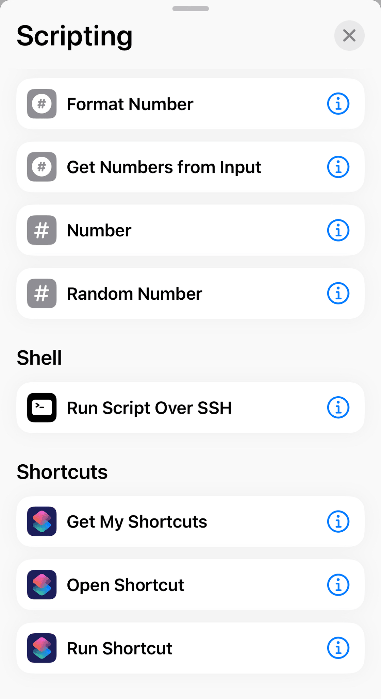
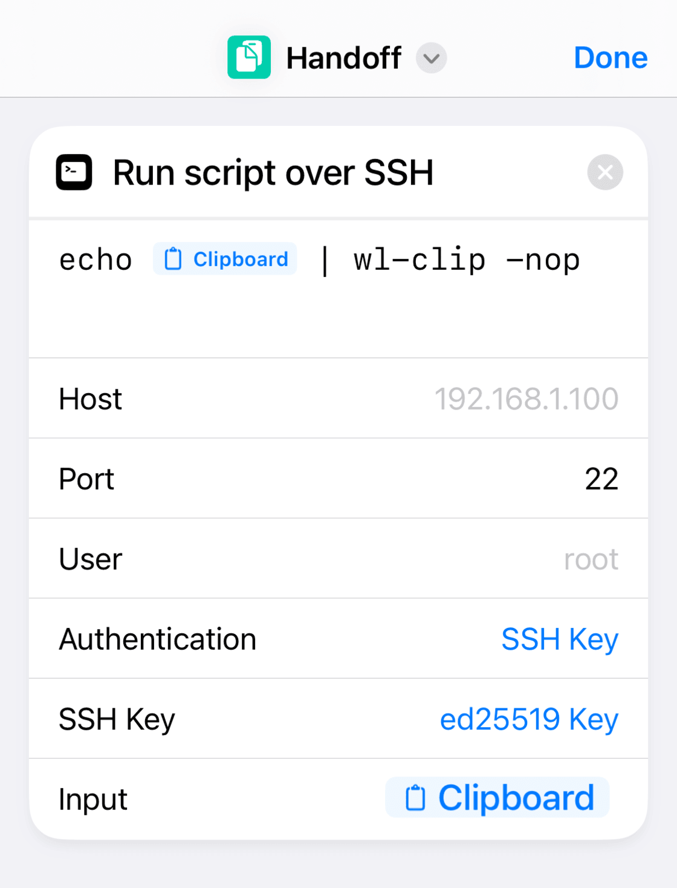
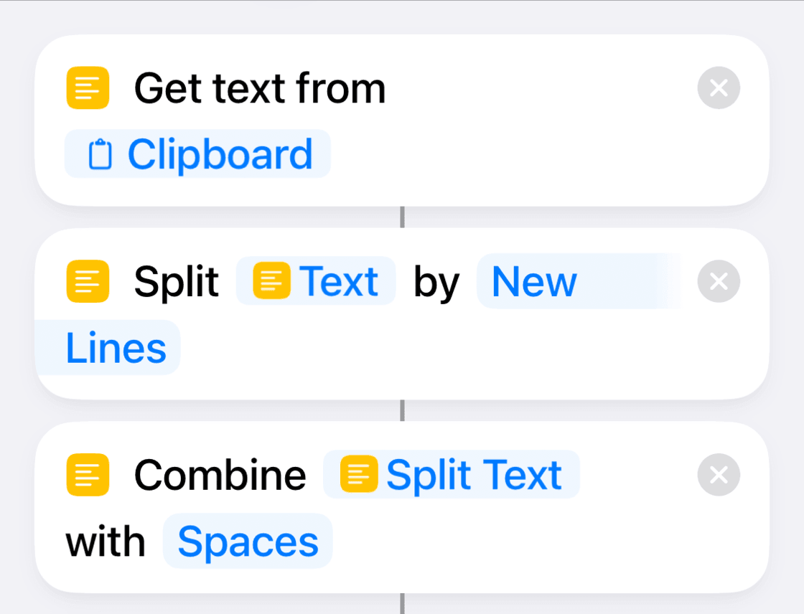

# 利用快捷指令，Linux 简单「接力」iOS 剪贴文本 - 少数派

**Matrix 首页推荐** 


- - -

### 引言

有快速复制 iOS 文本到 Linux 的小需求，对微信发送消息仅仅为了传输剪贴板内容而登录一个 IM 的方式感到不适；网页端微信登录需要扫码，我也绝不会在 Linux 下安装微信。以前使用 flomo 进行同步，和微信网页端的区别是可以密码登录，也无需每次都登录，但是同步起来需要时间，比起 Apple 生态的「接力」（Handoff）实在相形见绌。

### 实践

「快捷指令」能不能做到呢？发现快捷指令中「脚本」分项下有 Shell：通过 SSH 运行脚本。



Run Script Over SSH

图中使用英文界面是因为个人觉得和代码相关的内容使用中文翻译没有直接使用英文直观。脚本命令十分简单，实测可以直接编写运行多行复杂脚本；或者直接在 Linux 上写好 Shell 脚本文件，在指令中使用一行命令运行脚本文件即可。

参考环境是基于 wlroots 的 dwl，在 Wayland 下使用 wl-clipboard 的命令为：

```null
echo $Clipboard | wl-clip -nop
```

其中`-n`参数指定不复制转行符号 1；`-o`参数代表只伺服一次复制就退出，在制作这个快捷指令时，我发现使用「通过 SSH 运行脚本」和在一个真实 SSH 客户端运行命令还是有一些出入，比如在运行上面的命令后快捷指令不能停止，即使加上`&>/dev/null 2>&1`后台运行依然不能结束；`-p`代表指定使用上次的复制内容 2。运行成功后需要使用`wl-paste -np` 得到传输的剪贴文本 3。



Shell 命令及参数

X11 下其实方便一些——

```null
echo $Clipboard | DISPLAY=:0 xclip -sel clip -r &>/dev/null 2>&1
```

注意 X 协议下需要指定`DISPLAY`变量，这里指定常见的本地`0`显示，也可以使用`-d`参数指定显示。同样的也需要指定`-sel`参数指定使用上次的复制内容，`-r`代表不复制换行符，这是针对某些情况下，需要复制的内容后其实应该是 wrap 却有换行符，否则指令运行后在 Linux 上粘贴得到的是断开的同一段文字


wrap 粘贴却得到换行

最后的`&>/dev/null 2>&1`是为了结束快捷指令运行。X 协议下指令运行成功后，直接使用粘贴快捷键即可输出剪贴文本。

Linux 当然需要开启 SSH 服务，如上图所示我选择方便的默认 22 端口，使用密钥登录提高安全性。至此基本功能已完成，但使用过程中发现有不能完全复制多段文字，不清楚是否是换行符号作祟。我使用「合并文本」功能简单合并多段文字到一段。



一些处理多段文字的丑陋操作

### 一些其它思路

-   其实在自己动手做之前，已多次打开少数派开始淘金，这篇文章给了我一些灵感，但使用 base64 编解码没有实践成功。

SSH 下跨系统连通剪贴板 - 少数派

终端是很多人日常打交道的工具之一。比如，深度学习是目前一个...

[↓↓↓](https://sspai.com/post/71018)  
  
sspai.com  
  
[↑↑↑](https://sspai.com/post/71018)


-   直接编写完整脚本，可以进一步执行特定文本处理。
-   「快捷指令」中其他指令，如变量、在每个切段中进行处理等，也许有适合预处理复制内容的操作。

### 总结

实在丑陋拙劣的闲暇尝试，如果有更好的方法，请怀抱大爱分享，感激不尽。


-   1 下文中对此作出改进，但这个参数是否真的发挥作用我无法考证
-   2 不明白 wl-clipboard 的逻辑，实际测试不添加 p 参数无法完成预想的操作
-   3 或许笔者忽略了类似 X 协议下的快捷键粘贴方法
