# 如何设计 2.5G 家用内网，聊聊我的选购安装思路 - 少数派

笔者家中网络上次升级后，是以软路由做主路由，然后三台 MX4200+1 台 MX2001 无线 MESH 完成的无线覆盖。但是领势 MX 系列的固件只能在路由模式下开启无线 Mesh。这样即便是光猫桥接软路由拨号，无线接入的设备也是多了一层 NAT。而华硕在 AP 模式下的可自定义设置项是远远高于其他两家，而且 AiMesh 2.0 完全可以工作在 AP 模式下，所以本次升级还是将目光瞄准了华硕 ASUS/玩家国度 ROG 的路由器，完成无线组网。有游戏下载需求一定要降低 NAT 类型，也就是减少路由层级。

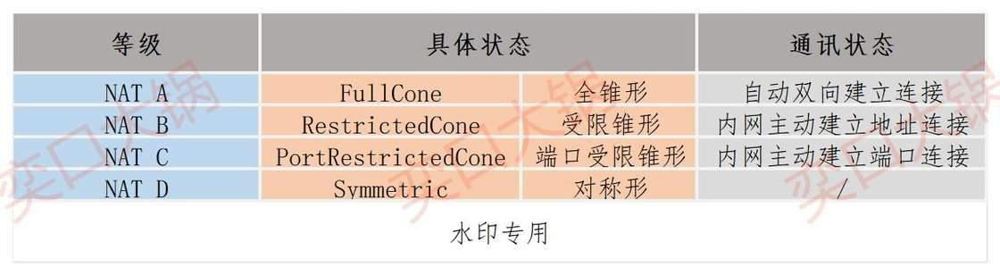

申请公网 IP、光猫改桥接、路由拨号一套组合拳下来，就没啥问题了。多一层路由转发，就降低一层。先前是主路由拨号 + 无线路由固定 IP 的模式，但给了公网 IP 所以还算可用。如果是 NAT D 这种，不管是打游戏还是 P2P 下载就都不灵了，基本上也就只能刷刷视频。当然对于 Xbox、Switch、Play Station 这类的游戏影音设备，记得开启路由的 Upnp 功能，要不然还是不能玩。

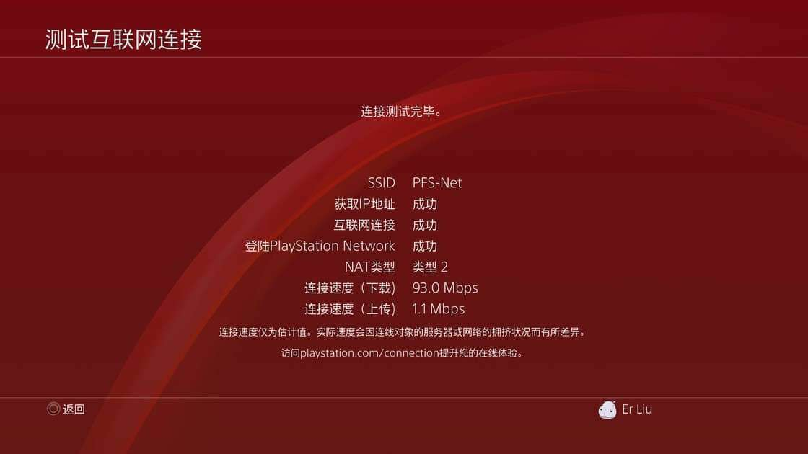

选型要根据具体需求确定，现阶段规划思路就是保证正房的 100 平米保证 2.5Gbps 有线 + 满血 2.4Gbps 的 Wi-Fi 6 下全覆盖，东西厢房、主院与东小院保证 500Mbps 左右的的无线覆盖。

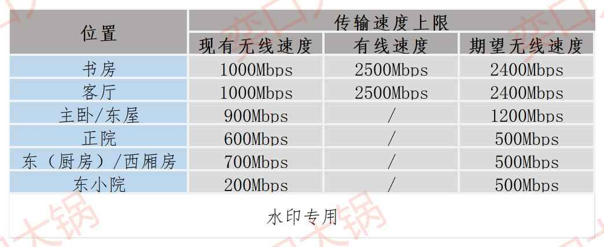

而且采用 AiMesh2.0 的话，后续升级扩大覆盖高速率面积，只需要添加足够的节点就能够保证网速达标。国内很多家庭在装修之时都没有考虑网络覆盖的问题，所以有一阵信号放大/中继器的销量就不低，但是无线中继的层级越多，网速越慢延迟越高。因为 Wi-Fi 本质是个半双工的传输模式，每过一层速度都要减半。Mesh 就是规避无线中继的逐级减半问题，才应运而生的。双频 Mesh 实际也存在多级掉速的问题，而且这些双频 AX 路由器基本都是中低端的价格和配置。所以主节点和主干子节点最好还是要选择三频的，其他边缘节点可以选择双频这些更便宜的。各家的三频路由都是单有一路无线回程，在保证你主干节点全速传输的同时，边缘节点不会空有链接速度而实际传输速度上不去的情况。

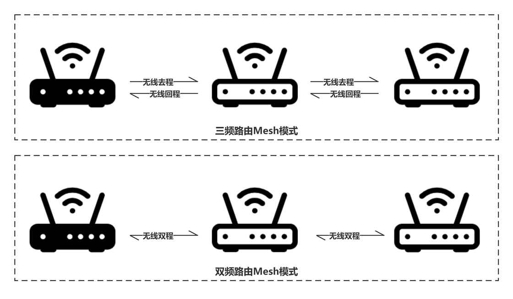

## **1.内网拓扑规划思路**

**更换 2.5G 光猫**，原有的光猫虽然是 10GPON，但是 4 个 LAN 口都是千兆，下行速度最高就是千兆网口理论上限。考虑到带宽预留和看北京这边自行更换光猫的用户实测，跑到 1200-1300Mbps 还是没问题的，算下来就是 20% 的提升。笔者家中需要使用 IPTV 和固话，所以先前包括猫棒在内的众多设备，都没走到替换光猫这一步。基于以上需求，加上运营商是北京联通，最后是￥599 入手了中兴 G7615 这台光猫，提供了 1 个 2.5G 有线网口与 3 个千兆有线网口，现在小黄鱼上已经降到￥199-299 这个范围了。

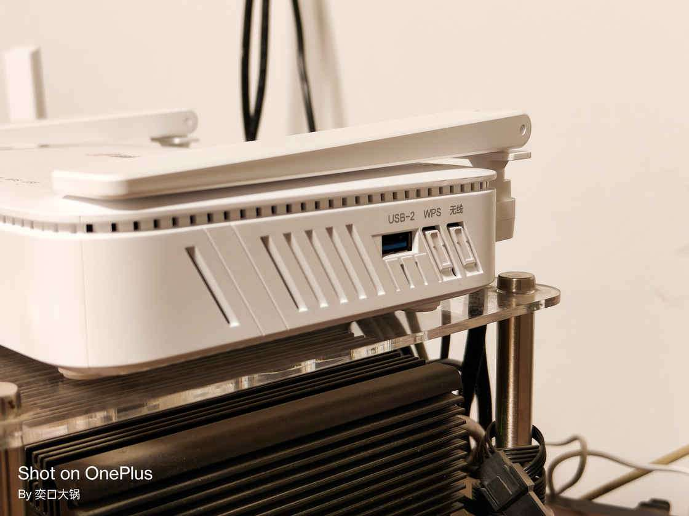

**SSID 转移，**原来家中设置了 3 个 SSID 分别供高速接入、智能家居与库房使用。高速接入和智能家居这俩肯定是要保留的，库房覆盖这个直接改掉就 OK。整体替换后的 SSID 设置具体情况如下表，之后还会针对智能家居布置中枢网关，打算之后再研究下具体如何布设。

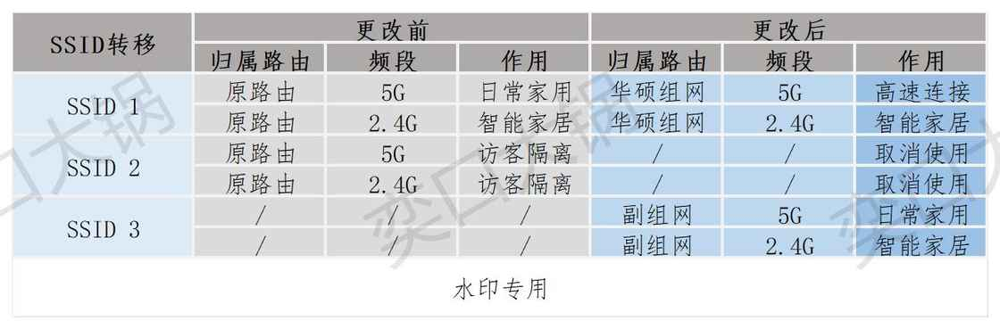

**软路由设置，**新光猫虽然是套用旧光猫的所有设置，但是为了方便远程调试，还是得对软路由进行修改，将 IP 段从变更到 192.168.0.X，将先前 192.168.1.X 的让渡给光猫。变更 IP 段之后，像是 NAS、打印机这些先前固定 IP 的设备，就必须要手动重设了。这个部分就纯手工了，后续更换主路由还得再重新配置一遍。

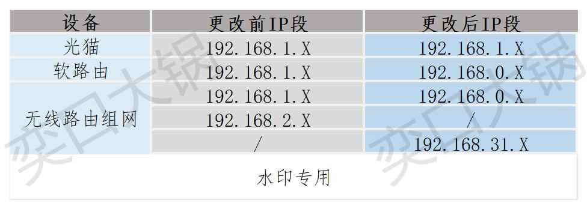

**路由模式设定，**需要主节点以 AP 模式运行，二级子节点通过 AiMesh 2.0 以无线回程方式完成组网。后续升级的话，可以使用主节点修改为路由模式置换软路由，这样 Mesh 的拓扑不需要改动。或者用支持 BE 的主路由替换软路由，主节点重设为子节点，也可以通过后续可能上的让渡功能，免于二次配置的繁琐。

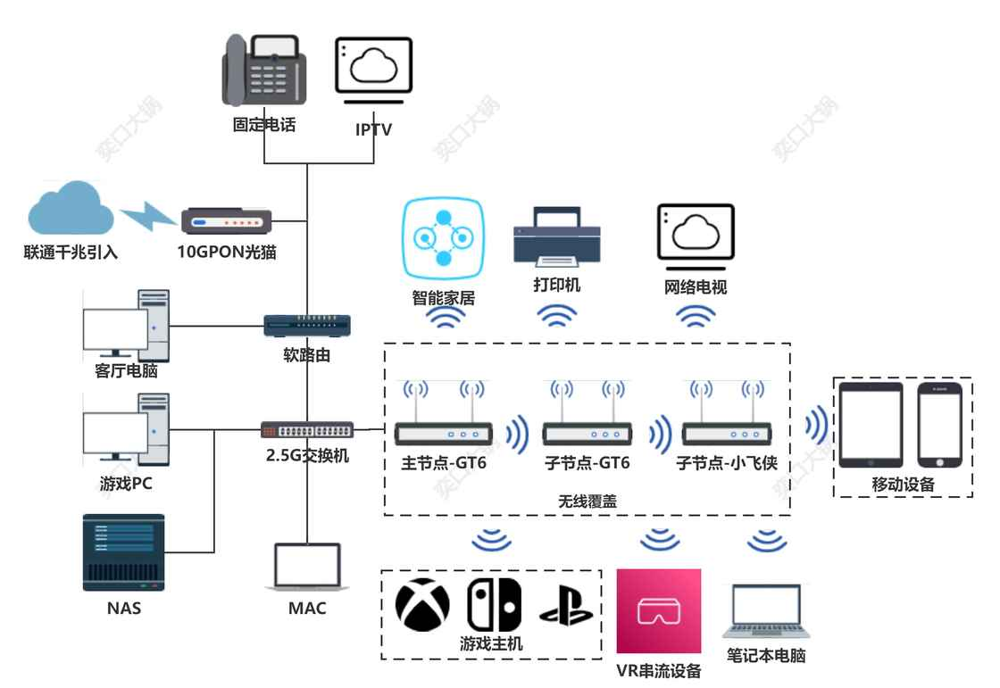

## **2.主要设备选型与实际拓扑**

有线 2.5Gbps 对设备的要求不算高，设备集中到交换机就行了。但考虑到 2.4Gbps 的无线覆盖，AP 或者主路由还是得有对应的 2.5G WAN/LAN 接口。原来是 N5095 四 2.5G 网口的软路由，下挂一路到书房 2.5Gbps 交换机，有线这部分就完成了。像是华硕 ROG 电竞系列的硬路由，更多是单/双 2.5/10G 网口（BE96 你往后站站，我组网时候你还没出来），所以更建议高速口直接挂高速交换机，进而接入其他高速网络设备。

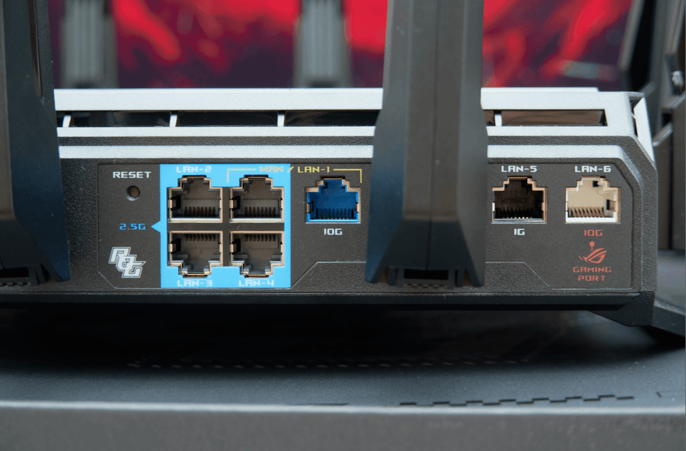

x86 的软路由可玩性都很高，但是都比较挑内存和固态。arm 的软路由价格又居高不下，配置 2.5G 的价格就令人难以接受了。现在 4 口 2.5G 的 N6005 软路由准系统，￥600 就能搞定了，自己配一根内存和固态也就再多个一二百。要是能接受 J4125、N5095 这些处理器的话还能便宜点。

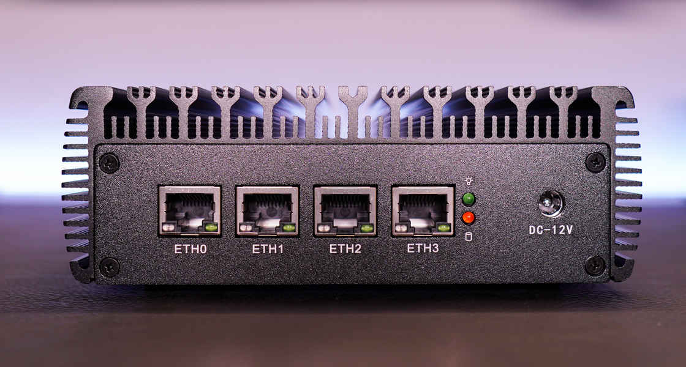

已经有了主路由了，下面就只需要考虑 AP 节点了，只需要完成无线覆盖，不需要进行 NAT 转发。ROG 路由器的实际联机体验，确实更稳定、更低延迟，为了打游戏付出这部分溢价也是值得的。所以综合考虑了价格因素和后续升级，最终选择了玩家国度 ROG 魔方幻双支套装作为主覆盖，华硕 ASUS 小飞侠通过无线 Mesh 补全边边角角的无线覆盖，保留后续的升级空间。

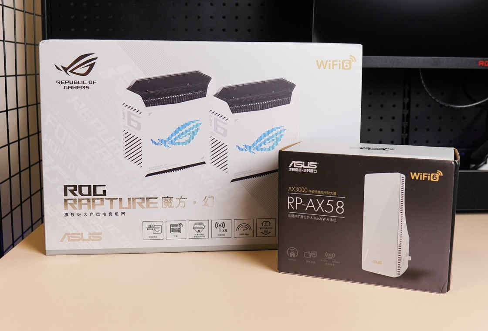

已经把光猫换成桥接，用主路由拨号了，别自己再套一层了。设备选型的要求是，必须能在 AP 模式下完成 Mesh 组网，那就只需要考虑华硕的 AiMesh 2.0 了。不管是御三家，还是先后下场消费级的新老势力，搞出的各种 Mesh 协议，基本都要搞个非 AP 的主节点组网。 加上考虑配合之后更换主路由，所以 ROG 魔方幻双支套装，来完成 Wi-Fi 6 频段的无线覆盖。

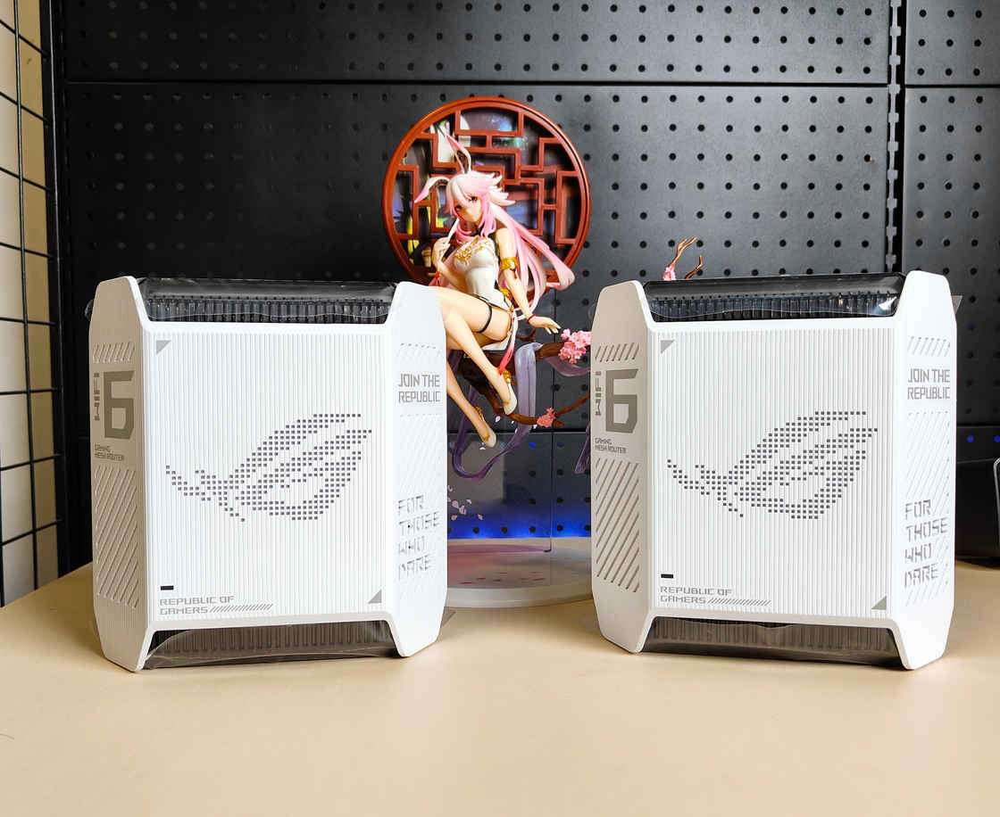

ROG 魔方幻套装是出厂就已经完成预配对，并且在主节点背后有对应的指示贴纸。把主节点调整到 AP 模式，再将其他子节点连接到主节点，完成无线覆盖。后续更换 ROG 电竞主路由之后，就需要二次重置将这俩都作为子节点使用了。

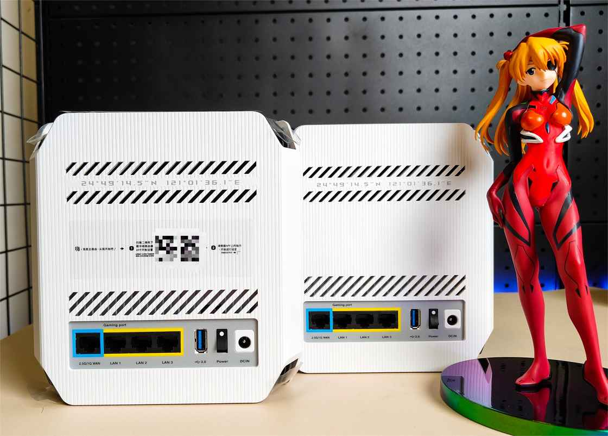

ROG 魔方幻内置了 9 根增益天线，专门为电竞需求优化了无感漫游，专门 4804Mbps 电竞无线回程频段。后面实测数据也可以看到延迟表现相当优秀。毕竟是 ROG 血统的路由器，硬件级的优化能够进一步降低延迟，针对 ROG 自家设备还有更进一步的优化。当然，就和笔者之前测 Killer 网卡一样，这些功能在网络环境差的时候，提升感才更明显。电竞加速应该是在无线环境较差时候，才能发挥出更明显的作用，如果你的电脑/手机是无线连接的话，效果应该会很不错。宿舍先前用的是小米 AX3000T，主卧电脑桌那里打游戏，时不时的就丢个包卡一下，真的很难受。

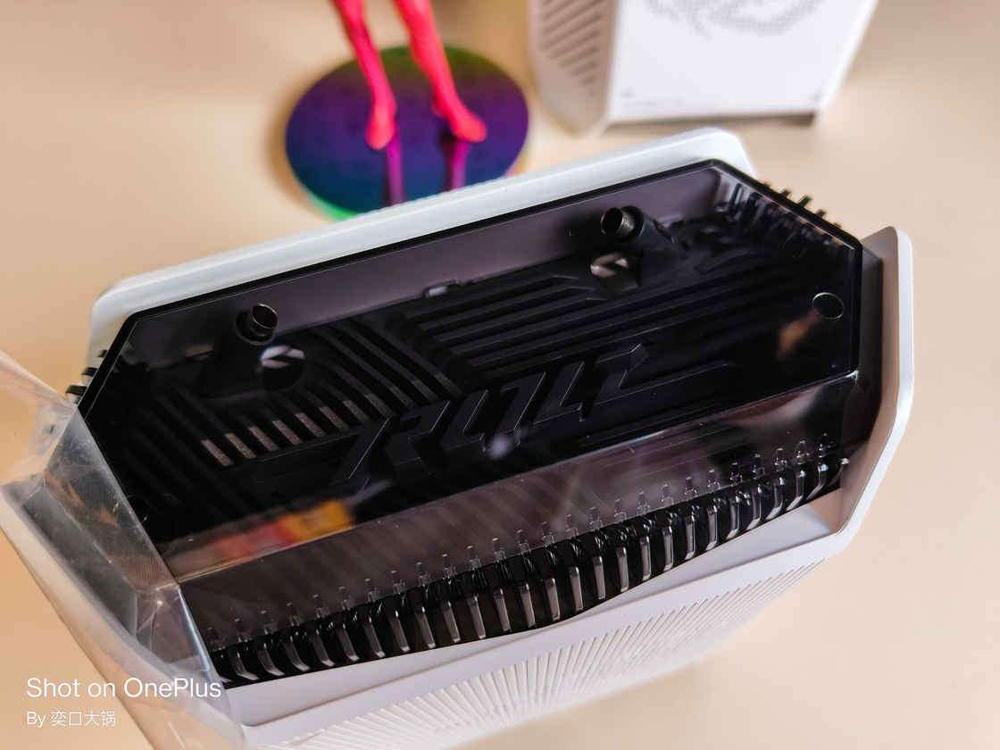

华硕的玩法就有点意思了，还是在 5G 频段下，AX3000 的设备都是 2T2R，可以匀出一条空间流‘中继’，能够保证 1.2Gbps 的传输能力。理想的节点布置方式能够保证，即便多次 Mesh 过后网速也不会降太多。而 AX5400 这些，能够拉出一路 2T2R 的空间流，从而保证 2.4Gbps 的传输能力。而我们的无线终端，像是手机和电脑更换的无线网卡，顶天也就是 2T2R 最高 2.4Gbps。而 AX10000/11000 的设备就更狠了，两路 4T4R 的空间流，直接保证 4.8Gbps 的传输能力。

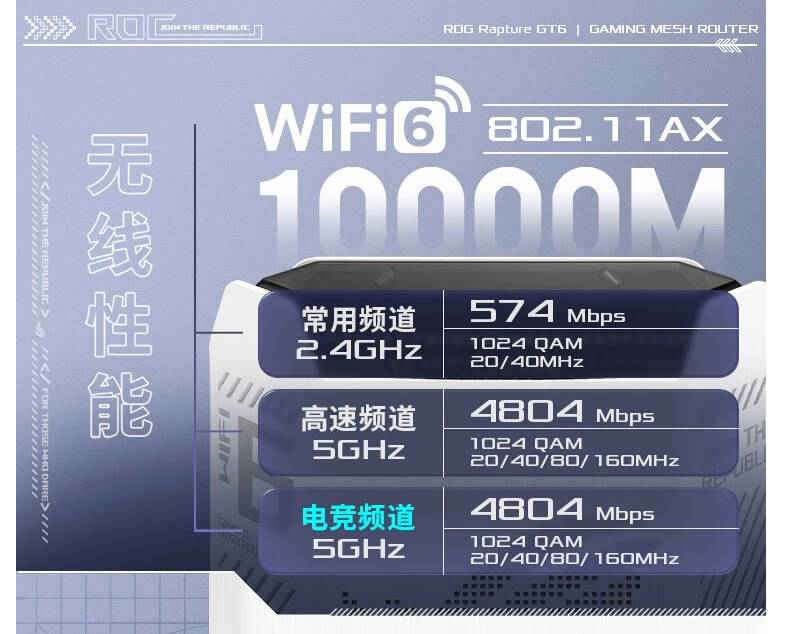

单从连接速度上说，2T2R 的 2.4Gbps 基本上足够和 2.5G 的有线网口持平了，旗舰级产品的实测传输速率是能到 280-290MB/s 的。而且 ROG 魔方幻只有 1 个 2.5G WAN 口，LAN 口均为千兆，但正巧布置点只能走无线回程，以 AP 模式工作正好。后续更换的主路由，需要像现在软路由一样，至少有一进一出的 2 个 2.5G 网口，LAN 口直接接到 2.5G 交换机上扩展，保留现有的结构。

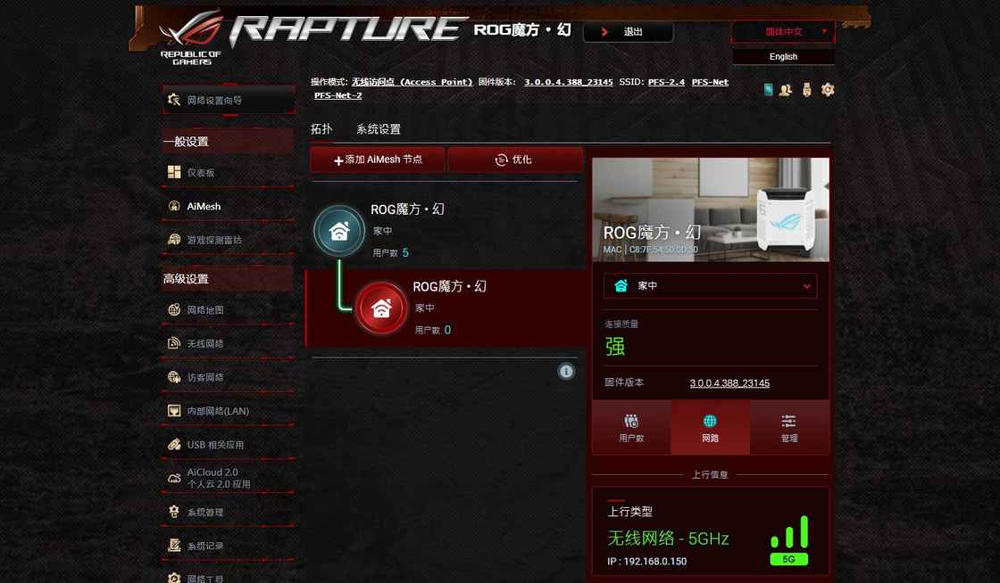

现在的主路由还是之前的 N5105 软路由，不过也就是正常跑 OpenWRT，实际上没跑什么插件。而且这个小主机的散热很成问题，现在考虑后续换个 ROG GT-AX6000 或者最新一代八爪鱼，游戏加速直接用内置的插件跑就好了。去广告的插件现在没啥配置简单又好用的，几个需要更新规则用着解析速度都挺慢。

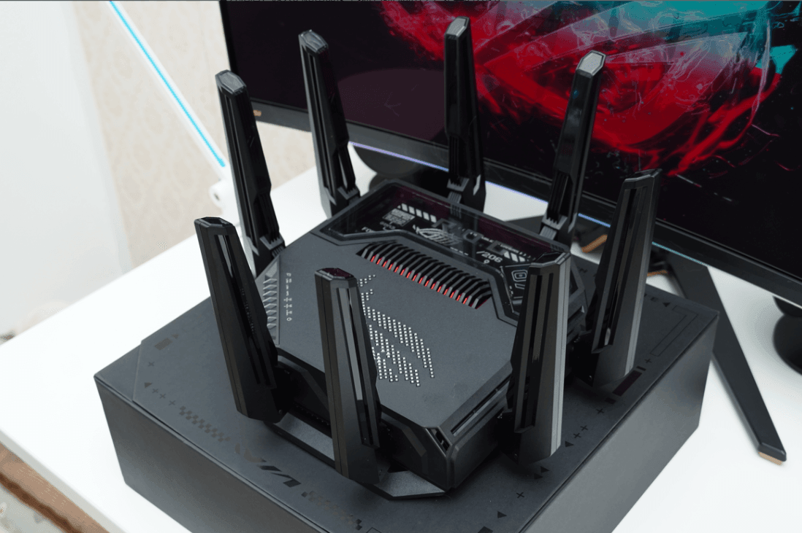

当然这就是下一步搞万兆内网的事了，毕竟手里有了锤子看什么都像钉子。不过对于大部分人而言，2.5G 内网是绝对绝对够用了，笔者单纯就是玩心重，总想搞点有的没的，这样的习惯太费钱了。

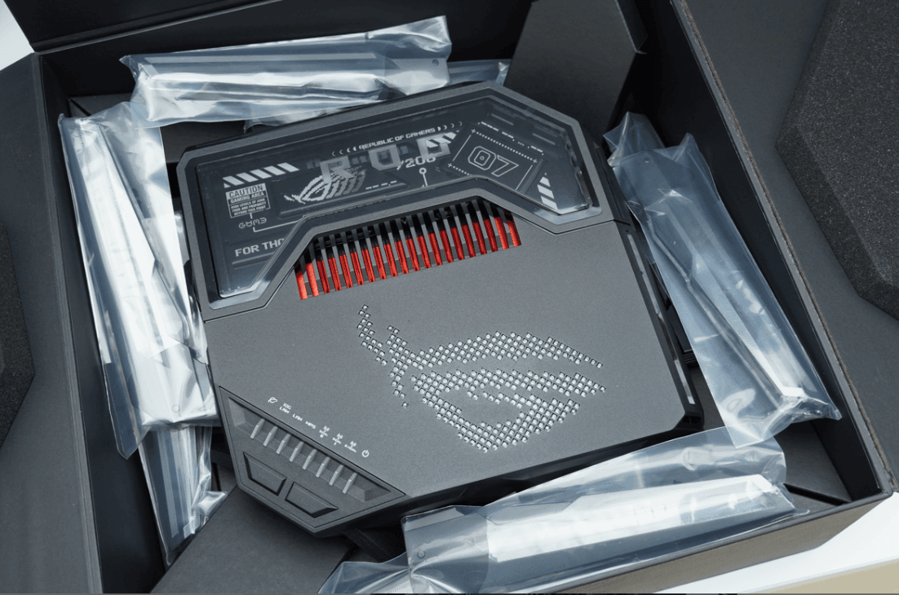

补充无线覆盖的子节点路由则是选用了华硕 RP-AX58 小飞侠，两颗 5G 独立 FEM，双频 Wi-Fi 6，5G 频段 160MHz 满血。再加上 1.7GHz 的博通四核处理器，这个性能相当强了。虽然造型挺像电力猫，但它真的不是电力猫。

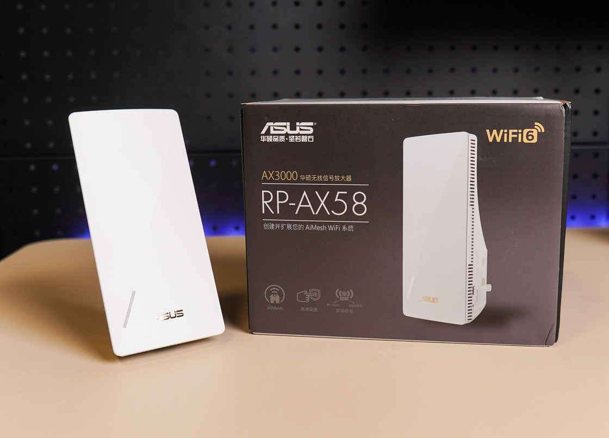

小飞侠不需要单独的适配器，直接插到插板上就能用了。不需要拖着电源线和网线，一大堆坨在那。以补充覆盖无线的中继节点来看，不过这个尺寸也着实不算小。但看后续实测的数据，这个体积一点没浪费。独立 FEM 和全尺寸内置天线，你把它当做路由，这个尺寸那是真小。

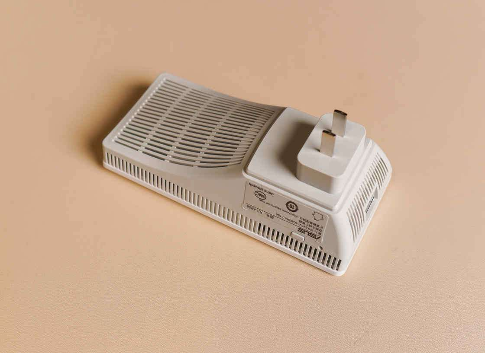

前两年五口 2.5G 交换机还得小五百，现在这个价完全可以买八口 2.5G 带 1 个万兆电口的交换机了。挑个便宜的随便买，完全不会踩雷。

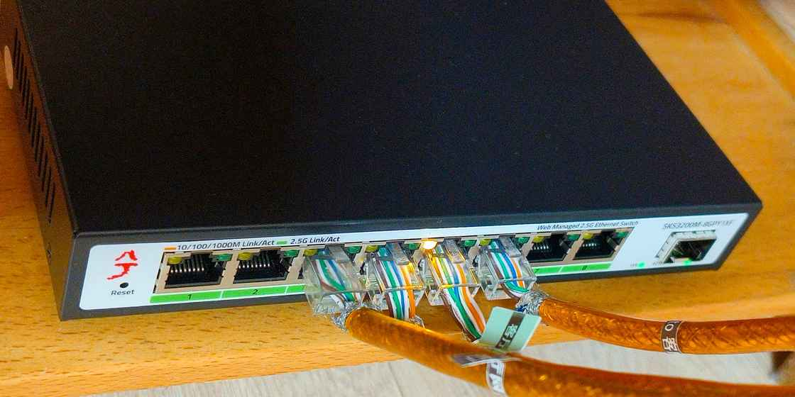

## **3.组网后实测**

组网情况就如与上节的拓扑图所示，笔者的需求很简单：书房、客厅满足 2.5G 有线 +2.4G 无线即 300MB/s 级的传输速度，主院、东小院及东西厢房保证 500Mbps 即 60MB/s 级的传输速度。这个要求不算太高，尤其是拢共只有 3 个节点来保证 300 平左右院落的网络覆盖。测试定点选择了书房 - 主节点，客厅 - 子节点，主卧 - 主节点，东/西厢房，正院，东小院 - 小飞侠子节点这些代表性点位进行测试。

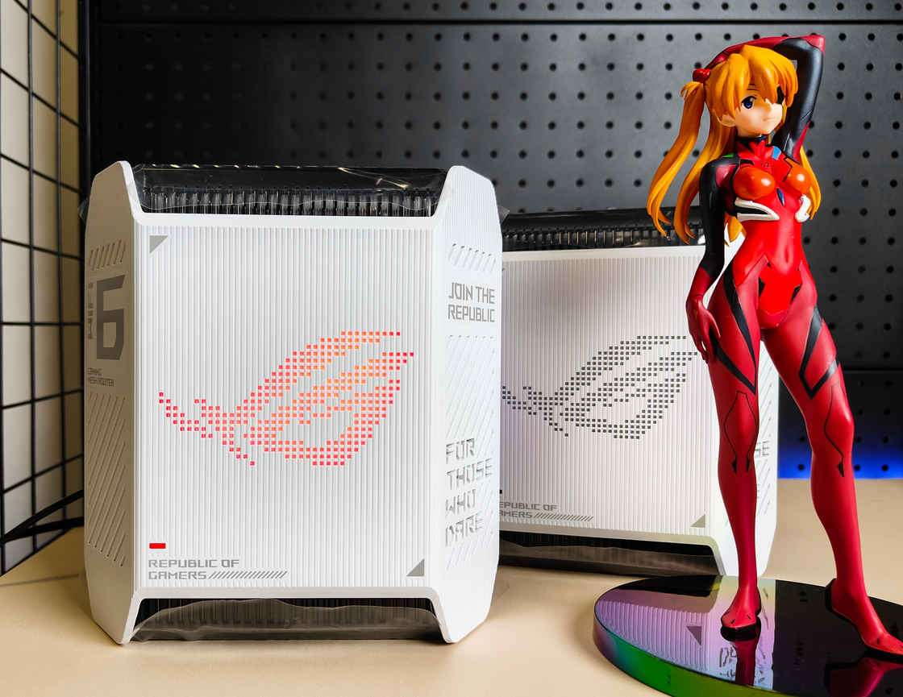

另外为了保持 ROG 幻魔方组的这套网，能够完美发挥实力。故还购买两台小米 AX3000T 接入软路由，作为二级路由，提供访客网络服务，防止污染 DHCP 影响正常网络的使用。之前使用领势套装就有这个问题，加起来就那么多设备，结果时不时网就要假死下。也没办法挨个审查接入设备，索性全都换了完事。顺便限制了上传速度，后续研究下估计要做个隔离。这部分的测试就不做展开了。

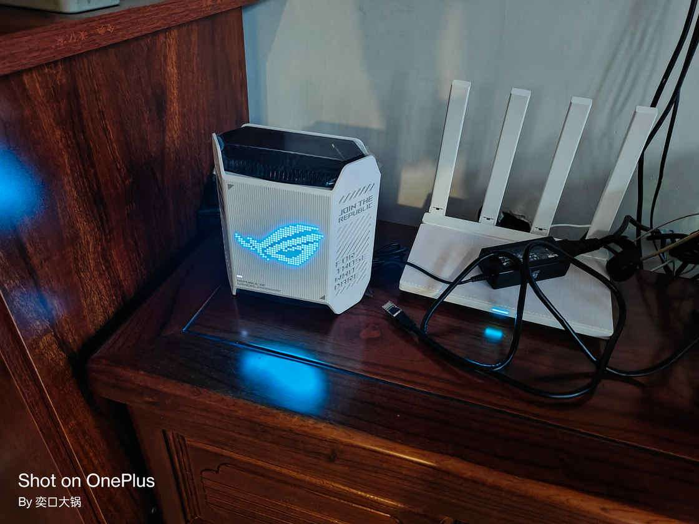

主节点放在了书房角落，因为北京的联通测速点经常性跑不满，所以直接切换了联通河南 5G 的测速点。可以看到下载速度终于破千兆了，下载达到了 1068Mbps，信号强度 -6dB，链接速度 2401Mbps。后面实测发现最高的下载速度基本在 1200-1300Mbps 左右，不过文章中还是以连续的测试结果为准。

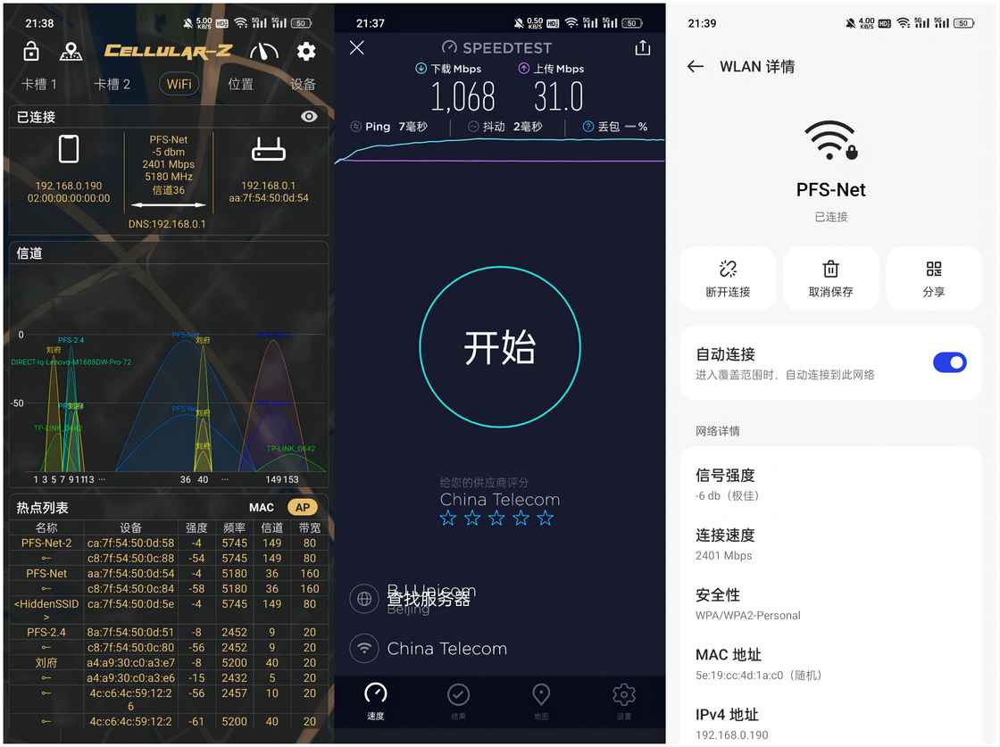

客厅部署子节点，与主节点隔了一堵墙。在客厅测得的下载速度在 1172Mbps，信号强度 -6dB，链接速度 2401Mbps。这个测试时间更早，所以下载速度比书房主节点和卧室的速度都要快上 100Mbps 左右。现在测试外网速率就比较麻烦，不容易找到能够跑满的节点。子节点基本是多了 10ms 左右的延迟，是相当优秀的表现了。

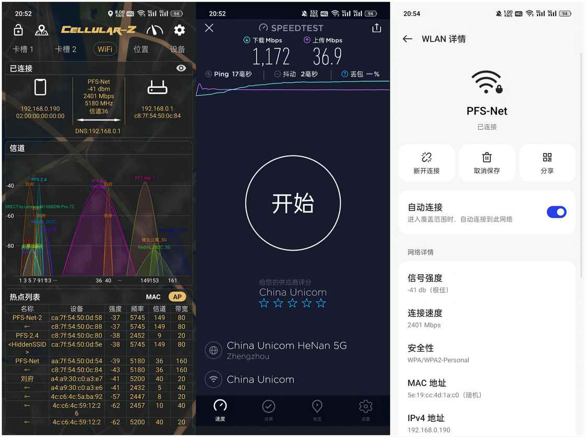

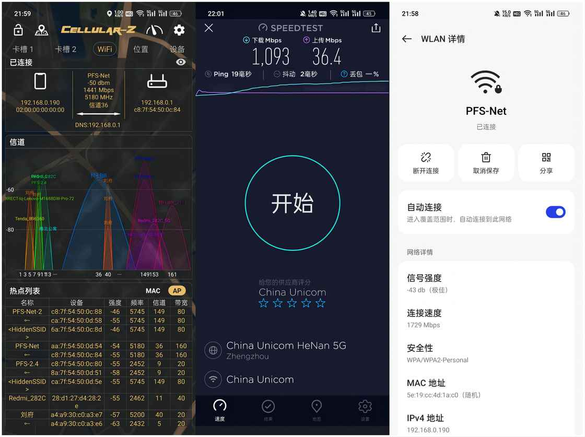

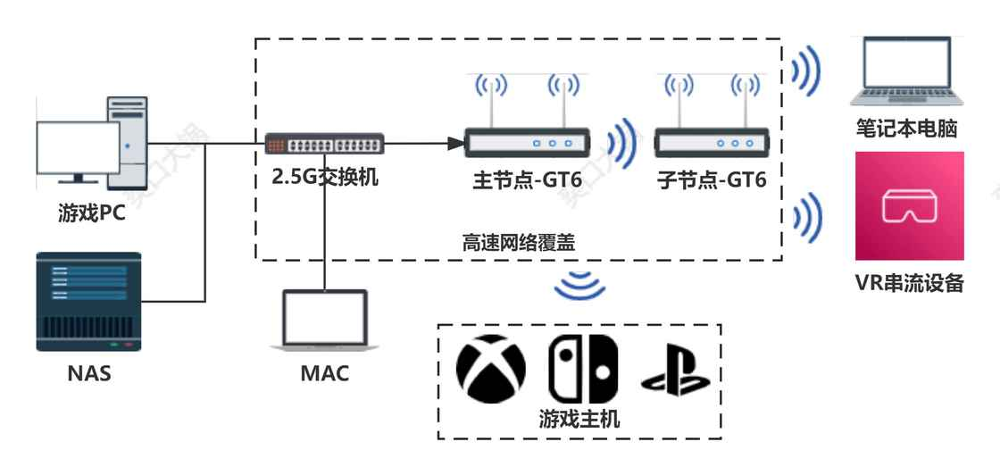

正房部分的测试做完了，就可以开始测试厢房和院子里了。在院内影壁前进行测试，中间隔了一层玻璃隔断，一层砖墙和一层铁皮，测得下行速度为 874Mbps，信号强度 -51dB，链接速度 864Mbps。应该是连接到了子节点，相比原有情况增加了 6ms 的延迟，也是完全可以接受的。

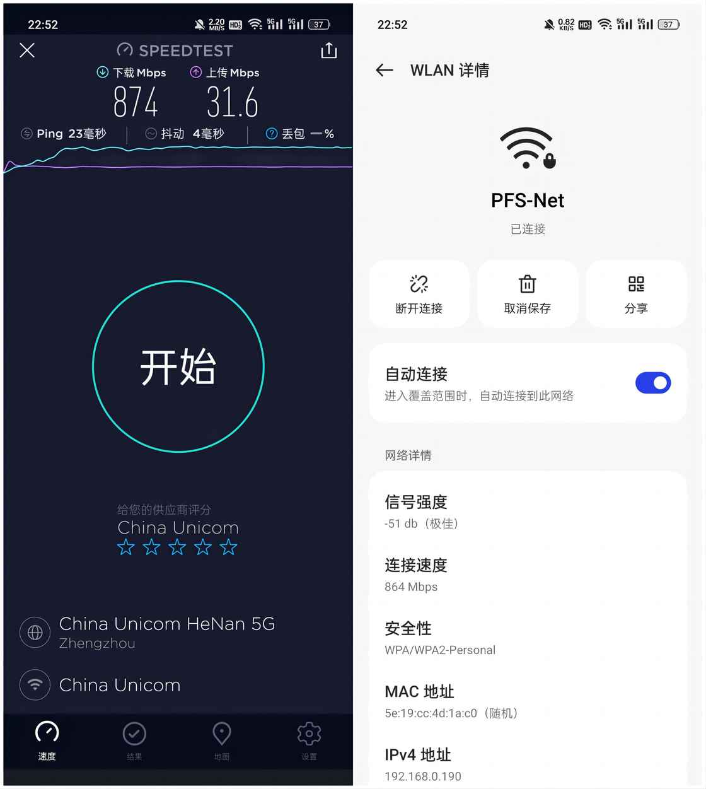

厨房在东厢房南侧，遮挡是最多的，等于是两堵 37 砖墙，传输速度自然也就是最低的，下行速度为 506Mbps，信号强度 -61dB，链接速度 576Mbps。强度和连接速度基本匹配。厨房/西厢房想要获得更好的网络，就得继续在影壁到门楼的位置多布置一个子节点了。

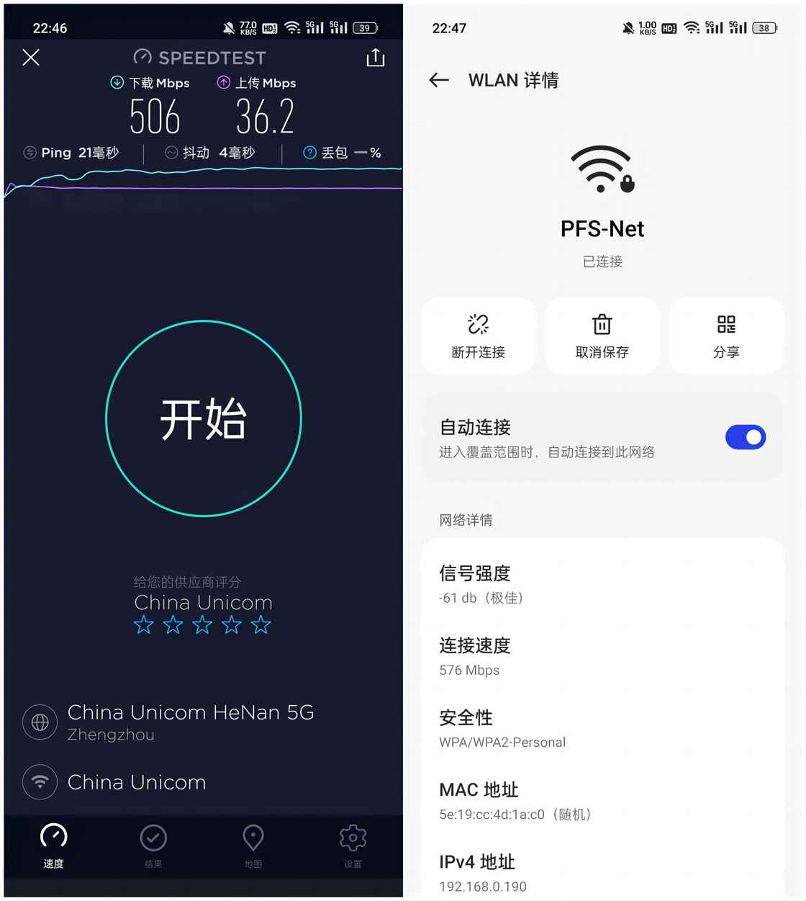

再来看看东小院，直接把小飞侠布置到东小院库房的吊顶中，在东小院院中测得的，下行速度为 749Mbps，信号强度 -47dB，链接速度 1152Mbps。RP-AX58 是挂载到子节点之下的，而二者之间相隔两堵 12 砖墙，一堵 37 砖墙，而且角度还有相当程度的偏离。加上之后的实测判断， 二者间的传输速度也就是在 800Mbps 左右，对于普通用户而言是个完全可用的状态，也完全满足了笔者的预估需求。

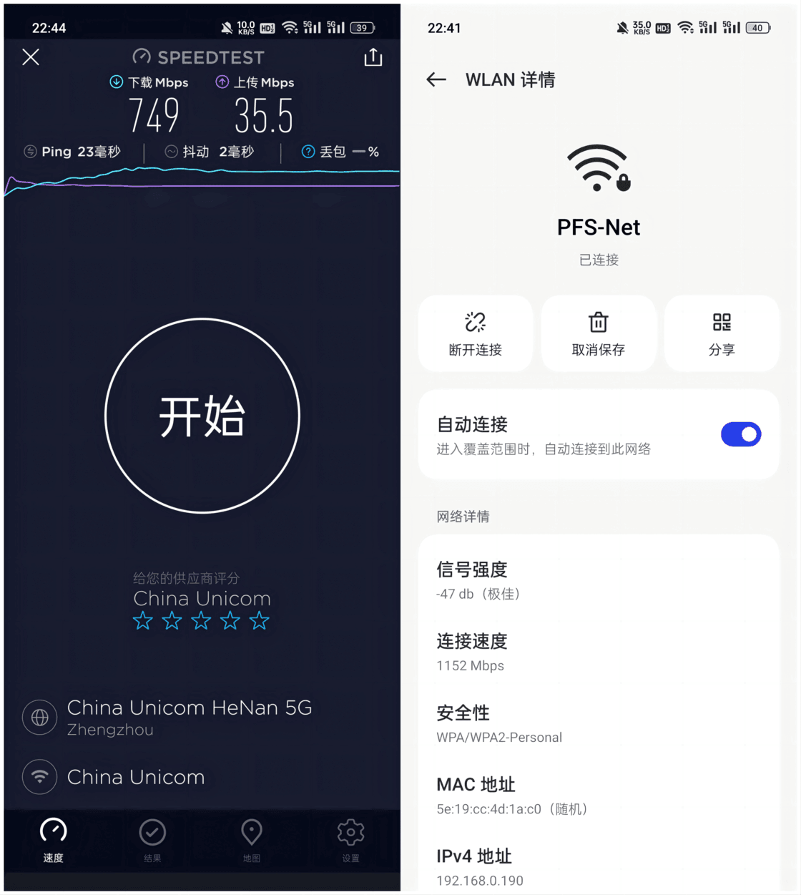

## **4.无线补充设备的选择**

华硕在售支持 AiMesh 的路由器，最多可以 9 台路由设备组网。所以具体选择哪款还是得根据使用环境出发，笔者是库房吊顶做了个插座，小飞侠做好网口与底部防尘即可。小飞侠是和 RT-AX57 同配的，或许之后也会出个联发科方案的小飞侠热血版，按照 AX57 和热血版的定价思路，那绝对能杀疯。

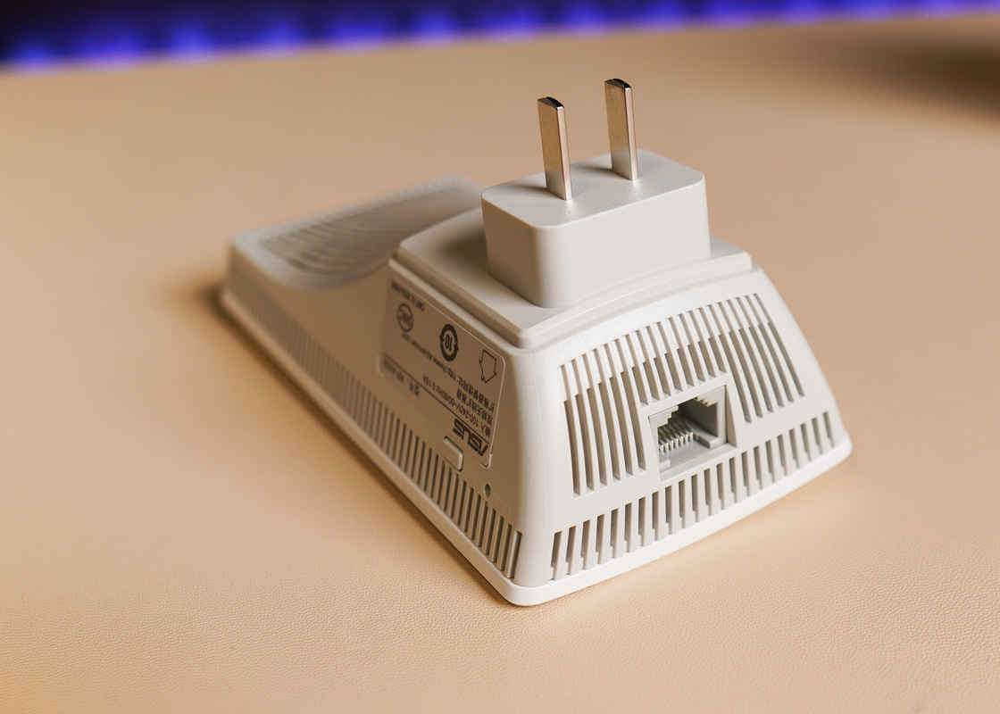

只要支持 AiMesh 2.0 华硕路由器，就能接入组网补充无线覆盖。笔者家这种一个大院一个小院，加起来也就三百多平，使用 ROG 魔方幻双支 + 华硕小飞侠，完全能够满足使用需求了。除了三个大对角的位置，传输速度都很 OK。如果需要上墙节点的话，也可以选择华硕 RT-AX57 热血版，这应该是最便宜的支持 AiMesh 2.0 的满血 Wi-Fi 6 路由器了。

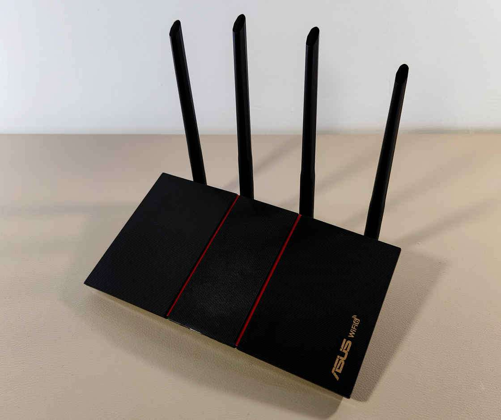

顶多是之后在门楼补充一个节点保证东南/西南角，厨房补充一个节点辅助覆盖东小院的前院，但是外面厕所已经拆了改室内了，这几个位置确实也不会有用机情况了。看看下一步更新之后，再怎么排布和补充吧。

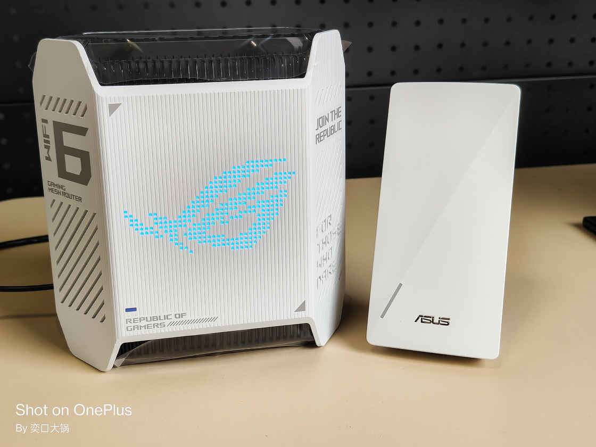

## **5.总结**

万兆分为光口和电口两种，一般需要单独装配接入，所以驱动和设置都会占用大量的时间和精力，碰上不支持速率自适应更是头疼。价格上的差距更是明显，2.5G 的交换机现在基本是白菜价了，纯万兆的的交换机那价格就不多说了；而且你的终端设备，手机、平板、笔记本这些顶天是个 2T2R 能够跑满 2.4Gbps 的连接速度。对于普通用户而言，基本 2.5G 有线传输 + 满血 Wi-Fi 6 无线覆盖就已经是最优解了。不管是在配置难度，还是网络设备成本，抑或是终端设备支持上都是最合适的。

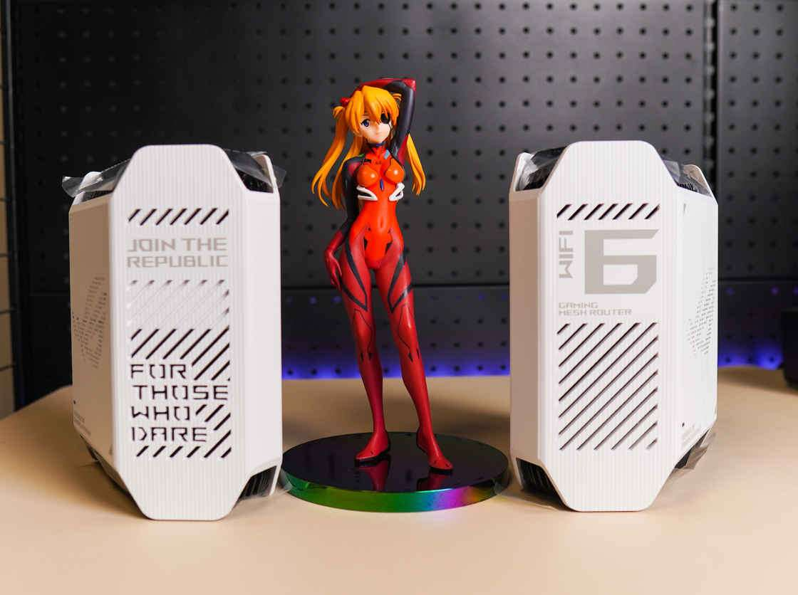

更何况万兆肯定是纯内网需求，国内运营商顶天有个 2000Mbps 的接入服务，2.5G 有线全链路已经能够 99.99% 的人的需求了。更何况这个 2000M 的价格实在是，没啥人能承受的起，这定价都快顶笔者现在用的 1000M+200M 两条价格的三倍了，现在网上也没有相关的宣传了，只有在线下营业厅能够开行这项业务。

本文中除华硕 BE96 及交换机的实拍图片来自朋友，联通宣传图来自网络，ROG 魔方幻商详来自商品截图外，其他所有图片表格均为本人实拍自制。

**如果觉得此篇文章对您有帮助的话，还请多多点赞、收藏评论。这里是老锅，我们下期再见！**
