# 寻找最适合写小说的工具——novelWriter - 少数派

我喜欢写小说，偶尔脑子里蹦出来那么一个灵感，在脑子里就把他构思了个七七八八。于是就想着，要不？写下来吧。

于是，便开始选择称手的兵器。

写小说这件事，应该需要一件称手的兵器。

相对于笔记软件的百家争鸣，写作软件相对来说就比较稀缺。尝试了网上推荐较多的 Scrivener、Effie，以及相对用户较少的 Writeathon。

用起来最舒服的就是 Scrivener，但在 win 平台上的中文体验真的很差，并且对于非作家的我，写小说只是自己的爱好，目前为止，并无收入，所以在选择软件的时候尽可能的选择免费的软件。

经过了各种寻找，发现了 novelWriter。

## novelWriter 介绍

[novelWriter](https://sspai.com/link?target=https%3A%2F%2Fgithub.com%2Fvkbo%2FnovelWriter)是一个开源软件，Github 上 1.6k Star。使用 Python 的 PyQt5 构建，可用于 Windows、Mac、Linux 系统。

在 GitHub 上的介绍是这样的。

> novelWriter is an open source plain text editor designed for writing novels. It supports a minimal markdown-like syntax for formatting text. It is written with Python 3 (3.8+) and Qt 5 (5.10+) for cross-platform support.

novelWriter 是一个纯文本编辑器，并没有思维导图，卡片视图，也无法插入图片，但对于写故事，他是足够的。正如 novelWriter 的名字，它更适合写故事，或者说，它只适合写故事（小说和非虚构的故事）。

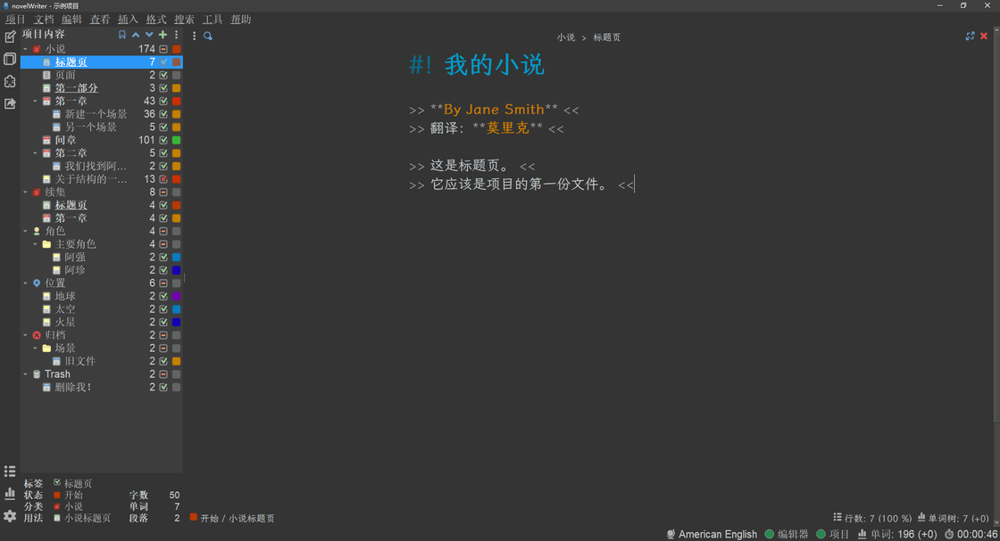

## 文档结构

novelWriter 的根目录下可以创建***小说、归档、情节、角色、位置、时间线、物品、条目和自定义***9 种类型。其中小说目录可创建多个。

文档类型可以分为两类，**小说文档**和**笔记文档**，小说文档写小说主体，笔记文档用于构建设定。

小说文档只可以创建在小说目录下，笔记文档可以创建在包括小说文档的所有目录下。

每个根目录下也可以创建文件夹进行组织和管理。

且两种文档类型可以相互转换。

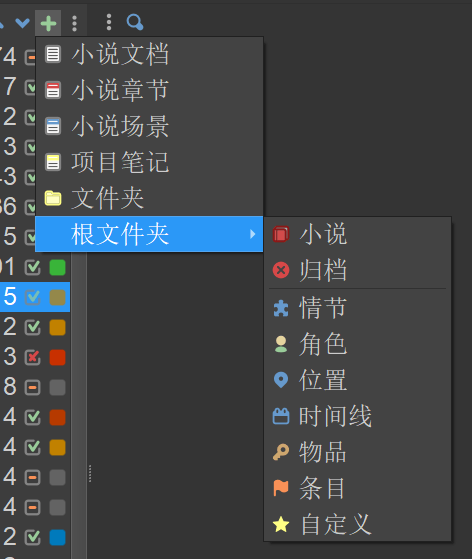

​

### 小说文档

novelWriter 采用最基本的 markdown 语法。每一个小说文档都基于标题进行构建：

-   一级标题用于小说**标题页或者中间章**；
-   二级标题构建**小说章节**；
-   三级标题构建**场景**；
-   四级标题构建**场景中的不同部分**。

小说编辑过程中可以每部分都新建一个文档，也可以整本小说都写在一个文档中，写完再根据标题进行拆分。

### 笔记文档

笔记文档可以创建在任何类型的目录下，进行小说的设定，备忘，大纲的撰写。

## 编辑器

### 文本格式

novelWriter 使用简单的 Markdown 语法及简单的 Shortcode 语法：

-   标题
    -   一级标题`# ​`
    -   二级标题`##`
    -   三级标题`###`
    -   四级标题`#### ​`
-   加粗
    -   `​**加粗文本**`
    -   `​[b]加粗文本[/b]`
-   斜体
    -   ​`_斜体文本_​`
    -   ​`[i]斜体文本[/i]`
-   删除线
    -   ​`~~删除~~​`
    -   `​[s]删除[/s]​`
-   下划线`[u]下划线[/u]​`
-   `上标内容[sup]上标[/sup]​`
-   `下标内容[sub]下标[/sub]`

### 对齐和缩进

在文档文件中，默认文本将采用左对齐或两端对齐。可以通过使用一组‘>>’或‘<<’符号，来指定特定段落的对齐方式，使用‘>’和‘<’符号，使段落从左右两边进行缩进。

```ruby
这段文本是左对齐的。<<
>> 这段文本是右对齐的。
>> 这段文本是居中的。<<
> 这段段落从左边距和右边距都进行了缩进。这在您想要引用一大段文本时非常有用。<
```

### 评论与注释

概要评论可在表格试图中显示。

-   概要评论：`%Synopsis: ​`
-   短评论：`%Short: ​`

### 文本替换

在小说编辑过程中使用`<文本>​`进行占位，在转换到阅读视图以及导出和预览时可以根据项目设置中的替换规则进行替换。

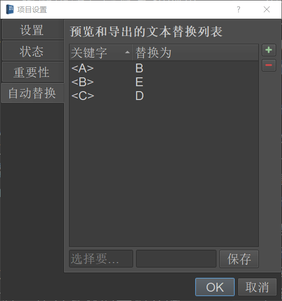

## 小说组织

### 视图

项目视图为小说所有笔记与小说文档进行构建的视图。

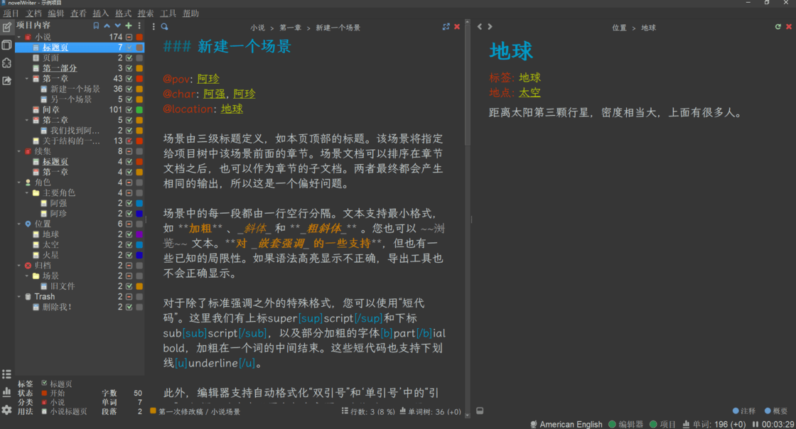

大纲视图在侧边栏显示小说的大纲，只包含小说文档。根据标题级别进行识别，一个文档多个文档都可识别。

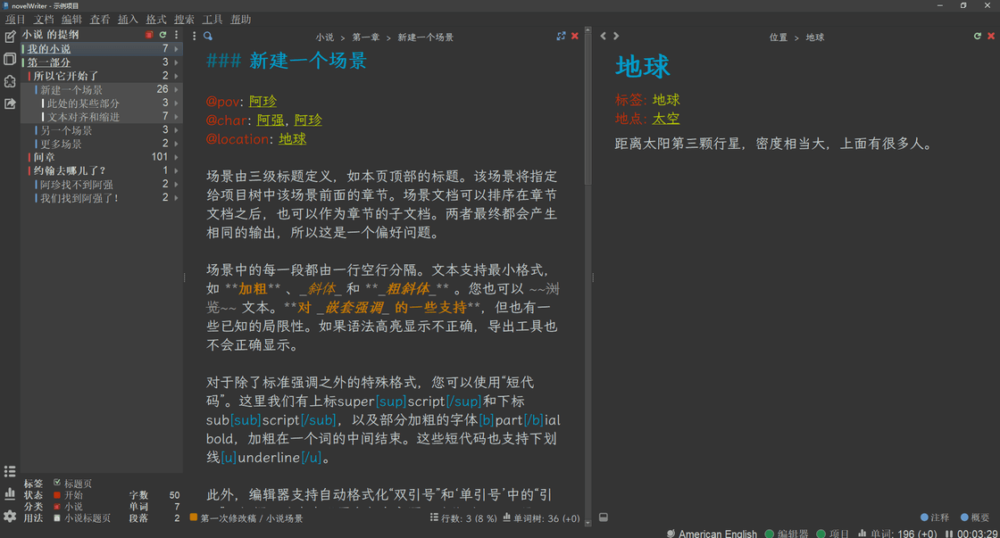

在项目视图和大纲视图中，选中文档在文档树底部的信息栏可以显示该文档的属性信息。

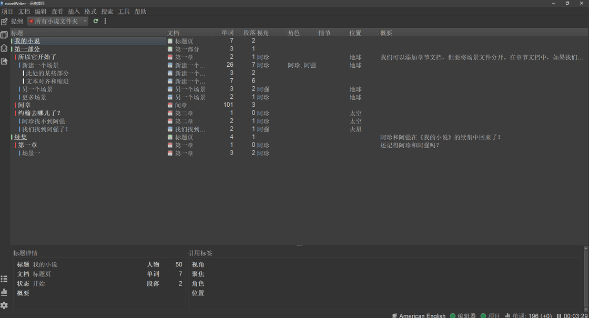

### 标签和参考

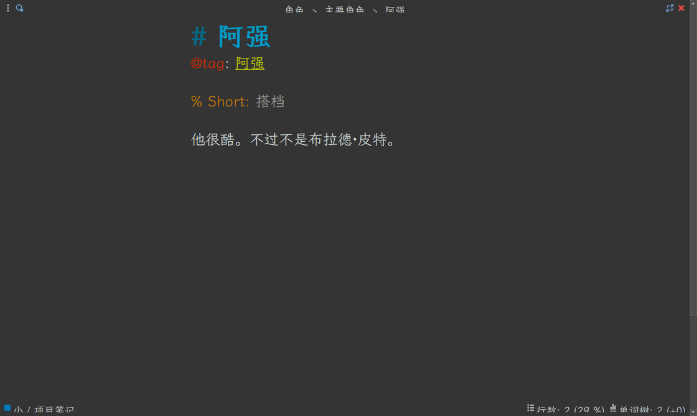

也可以使用特定语法为文档添加参考属性：

-   情节：`@plot:​`
-   角色：
    -   视角角色：`@pov:`
    -   焦点角色：`@focus:`
    -   次要角色：`@char:`
-   位置：`@location:​`
-   时间线：`@time:​`
-   物品：`@object:`
-   条目：`@entity:​`
-   自定义：`@custom:​`

在所有页面（小说文档中，每个标题都可以理解为一个文档）中都可以使用该种语法添加属性，且会针对属性类型进行建议。

注意，被关联的文档需要使用`@tag:标签内容`​进行标签定义。

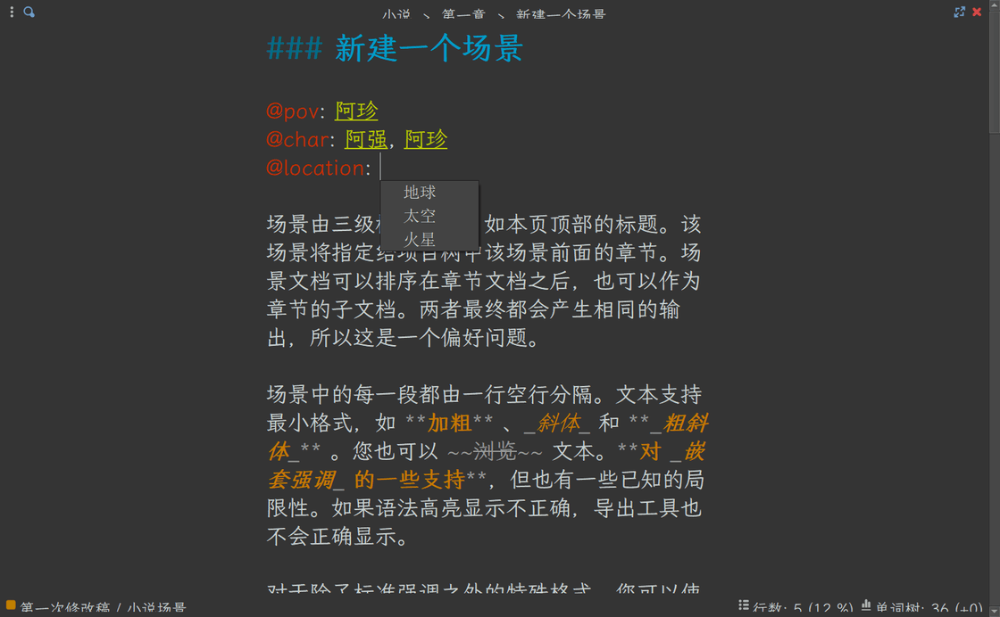

在小说编辑过程中，鼠标放在属性链接上，点击跟随标签，可在侧边栏打开这篇文档，进行参考。

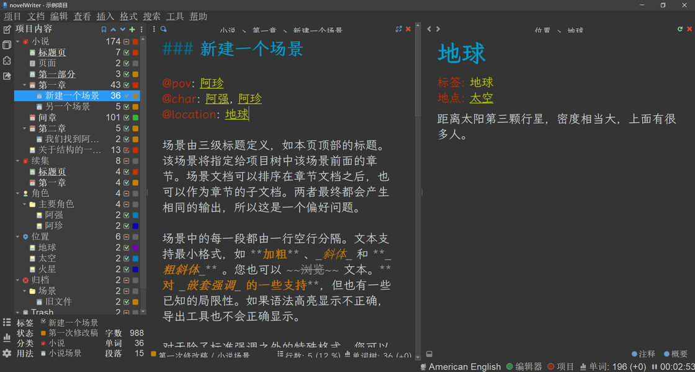

### 状态、活动状态、重要性

文档树中每一级名称后分别为**字数、活动状态、状态\\重要性**。

活动状态有两种，**活动**与**非活动**。分别以方框内的✔和❌显示：

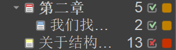

小说文档可以设置状态，可在文档树内切换和自定义，也可在项目设置中自定义。

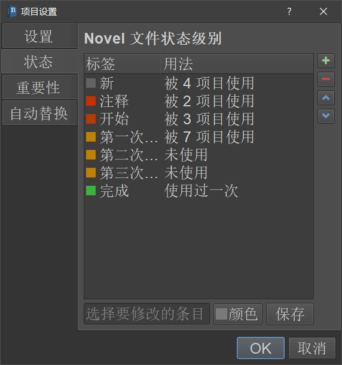

笔记文档可以设置重要性，类似于小说文档的状态设置。

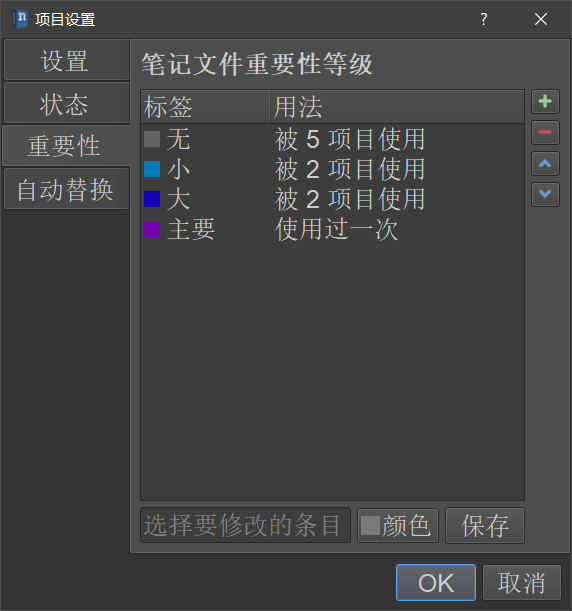

### 其他

#### 导出

在一本小说写完可以进行构建导出，可自定义进行文档过滤，进行预览，并导出多种格式。

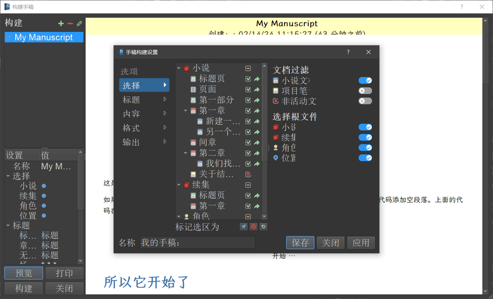

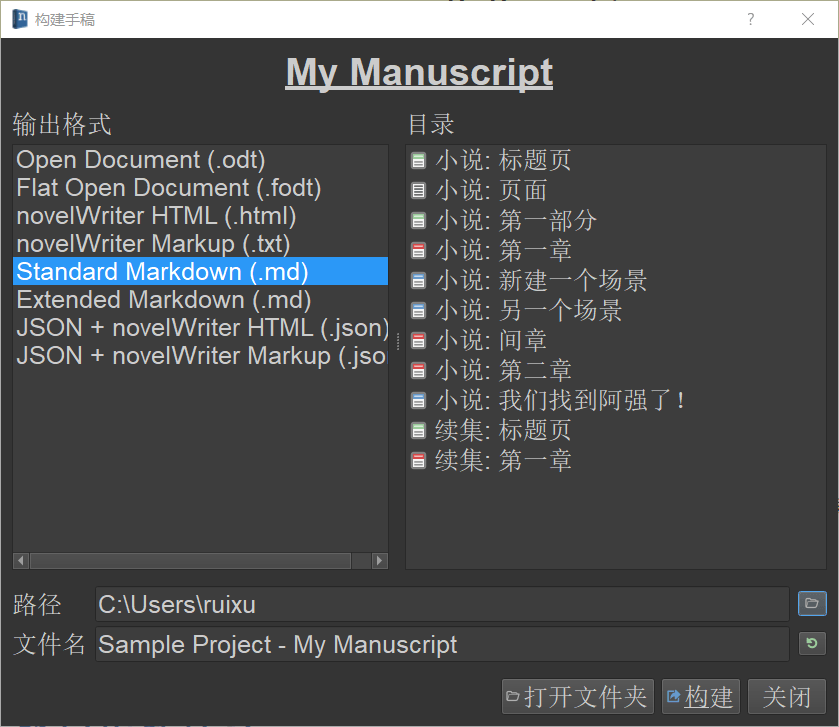

#### 写作统计

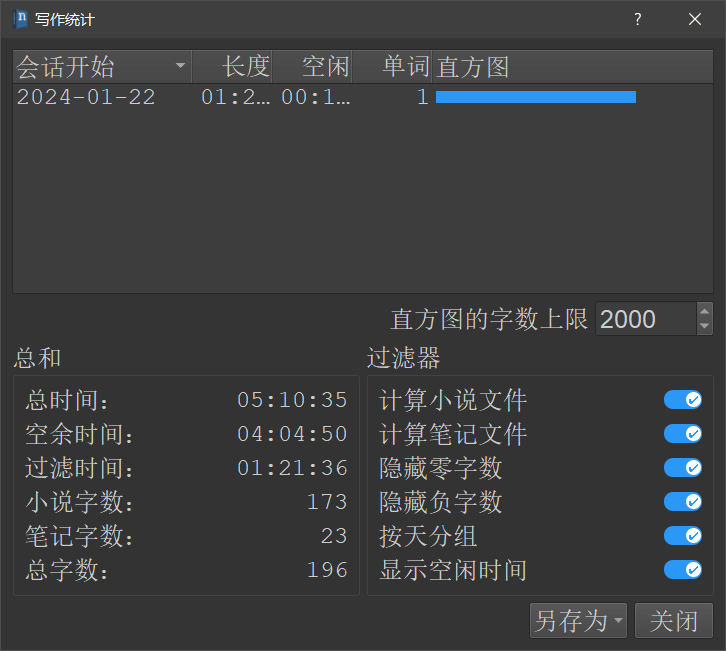

## 现存问题

由于汉字等 CJK 语言文字的特性，字数统计规则与英文等字母文字不同，汉字的字数统计并不是根据空格进行分割，所以在字数统计中，“字数”是汉字的**字符数**，“单词”对于汉字的统计并无意义，可以忽略，针对这个问题，我在 GitHub 上也已经与开发者进行了探讨，对于 CJK 文字的改进也纳入规划。

## 总结

写小说的重点永远在写，工具只是工具，本文章只是对于 novelWriter 的一个简单的推荐和上手介绍，或许介绍的并不全面。是否选择它，还需要看自己用着是否舒服，别被工具绑架，专心去创造故事。
