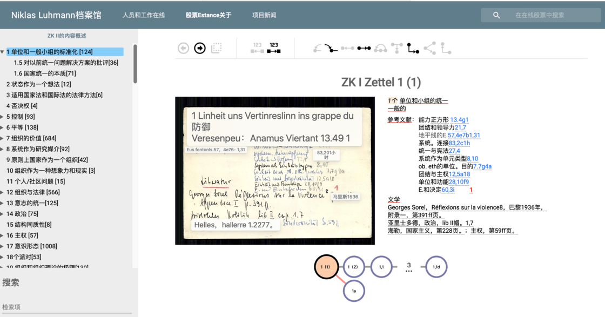
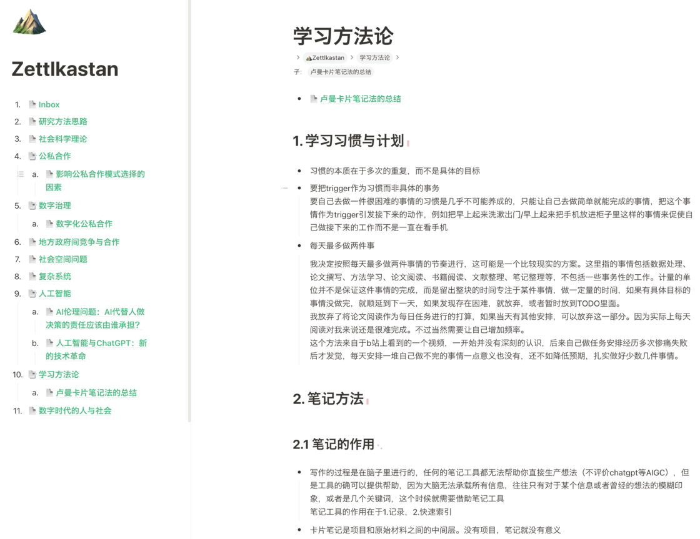
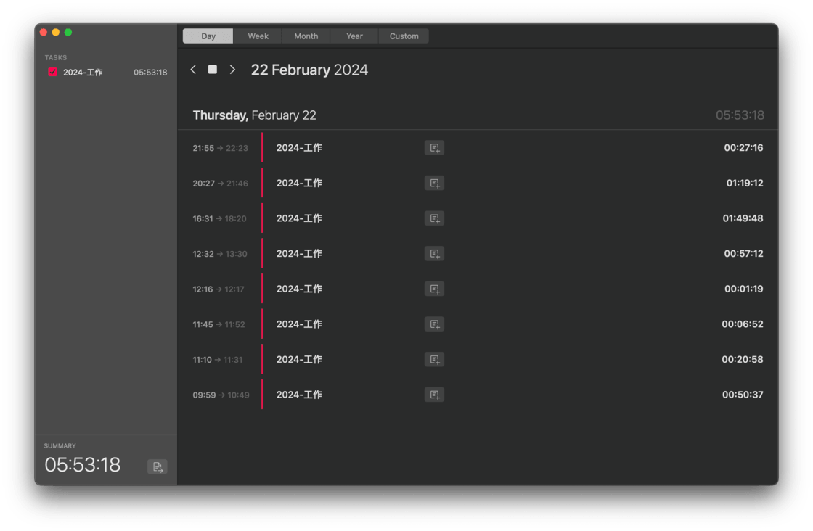
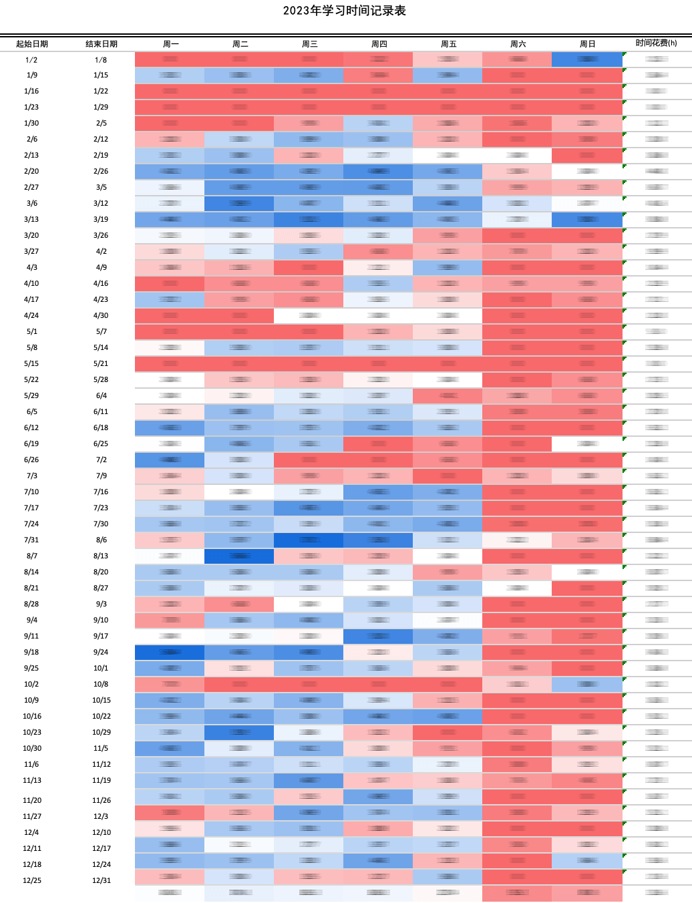
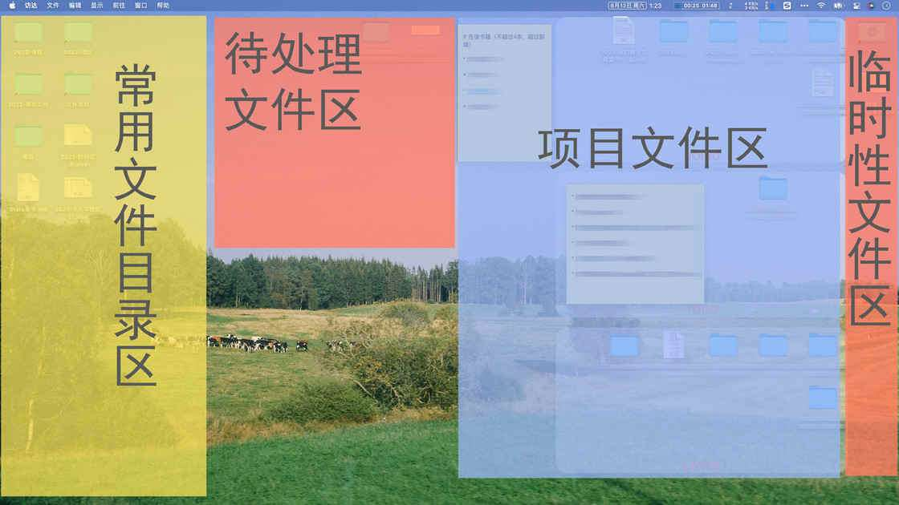
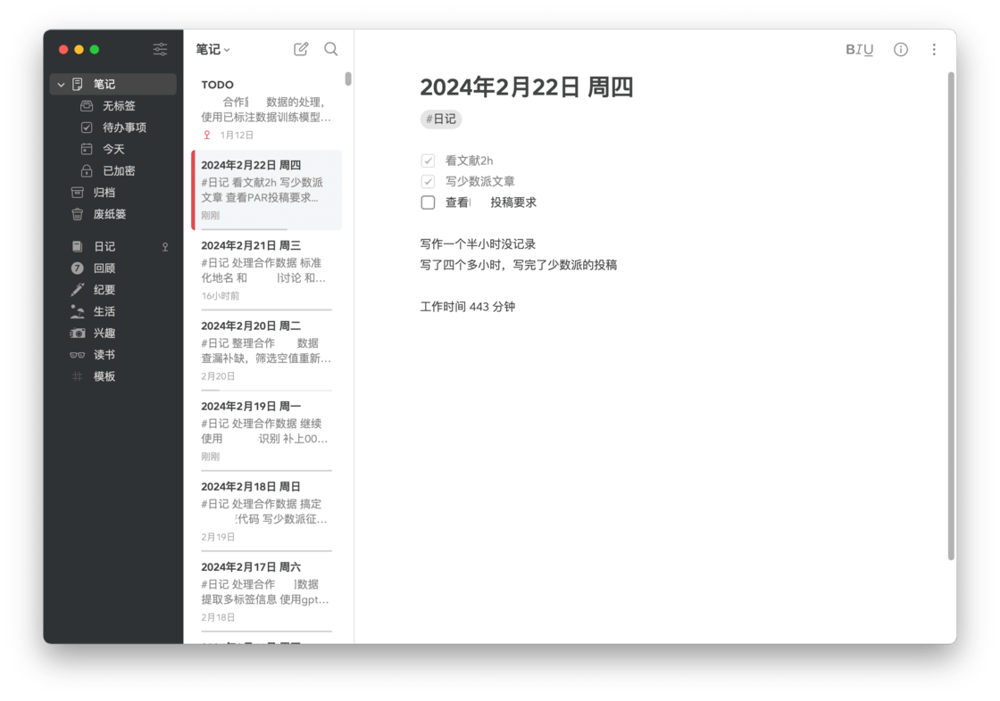
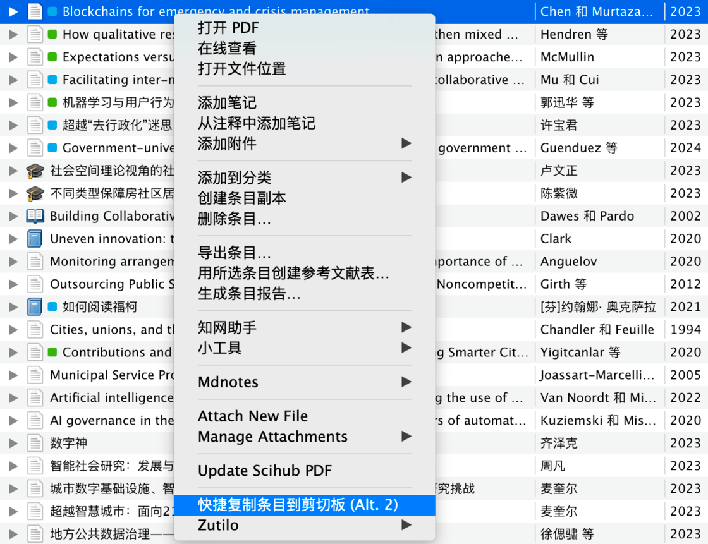

# 年度征文 | 绝知此事要躬行：谈谈笔记与自我管理的元方法论 - 少数派


- - -

「本文参加 2023 年度征文活动。我的 2023 年度关键词是：**独立**」

回顾 2023 年，「独立」的确是我的一个重要关键词。作为一个社科博士研究生，我第一次独立开展自己的研究，明确了自己作为一个独立的研究者未来的研究方向，跌跌撞撞走上了一条职业道路；与此同时，我也在众多少数派文章的启发下，独立摸索出了一套基本适合自己、能够坚持下去的自我管理与笔记方法。

但是，今天我的重点不在于介绍工具与方法本身，而是想进一步谈谈一个更加基本，也是更加重要的问题：**如何才能找到一个自己能够坚持用下去的方法？**毕竟，再好再精妙的方法工具，如果不去使用，就还比不上一支笔一张纸。

这是一个普遍存在的问题。相信大家都有过被人安利了一种方法/工具但是由于各种原因半途而废的经历。就我而言，自 2021 年接触笔记工具以来，我几乎尝试过所有近两年在少数派上被人所介绍过的工具与方法，但是没有一种是我能够按照作者的说明使用下来的。究其原因，我觉得还是在于方法与工具是非常个人化的东西，由于每个人的使用目的、个人特质不同，对 A 适用的方法也许对 B 就没有用处。因此，与其说「被动寻找」，不如说应该根据自己的需要，去「独立创造」自己的方法。

而对这个问题的讨论在少数派上还有所欠缺。我们可以看到大量介绍自己的工具方法论的文章，作者上来就表示「我每天需要阅读/处理大量的信息……」，文中多种应用搭配的流程、复杂的使用技巧往往令初学者望而生畏。然而他们往往没有说自己哪里来的执行力让他们完成这些复杂的流程，以及他们的流程是如何从零开始一步步建立起来的。也有可能是他们本身天赋异禀，做这些是自然而然的如同吃饭喝水一般，但我想对于大部分人来说（包括我自己），如果不能契合自己当前的执行能力，再好的工具方法也很快就会陷入摆烂的境地。

每个人的精力与热情是有差异的也是有限的，因此，关键在于找到一些办法，在自身行动力执行力的限制下，让自己可以做更多的事情，也即我所说的笔记与自我管理的元方法论。下面，我想结合自己的探索经历，谈一些作为一个低执行力的人在这个问题中的经验见解，希望对你有所帮助。

## **1\. 取其上者得乎中：学习方法需要尽可能参照原始资料**

尽管我强调应该去「独立创造」自己的方法，但是显然任何人都不可能完全从零开始，借鉴吸收别人的优秀经验是非常必要的。但是问题也出在这里，一方面，正如前面所说的，许多作者可能侧重于介绍他们的工具方法的创新之处，但是对于实践过程中遇到的各种细节问题的处理一笔带过，让人在学习过程中经常发现障碍重重；另一方面，大部分人的工具方法都是在一些现有的概念上发展起来的，如「卡片笔记法」「P.A.R.A」「inbox」「每日笔记」等等，但是每个人对此的理解都有所不同，甚至不同人之间的解释会自相矛盾，很容易在学习实践时陷入困境。

如何才能解决这个问题？我认为，**如果对于某个方法感兴趣，学习方法时应当尽可能回到这个概念提出的源头中去，去理解这些概念最主要的提出者是如何使用这些方法的，如此才能高效理解并且根据自己的需要运用。**最理想的情况就是能够获取使用这些方法的原始资料，例如流程视频、原始笔记等，其次才是介绍方法的二手资料——魔鬼都藏在细节里面。

我尝试卡片笔记法的过程就是一个例子。

我最早知道卡片笔记法是通过少数派上和燕燕老师的一篇文章：[**卡片笔记法、Roam Research 与个人笔记体系的建立——拯救「写过就忘」**](https://sspai.com/post/65224) ，当时刚开始做学术研究的我真是觉得相见恨晚，立马按图索骥又阅读了作者引用的 ***How to take smart notes*** 这本书。简言之，这本书根据卢曼教授的 zettelkasten 方法，将笔记分为闪念笔记（临时笔记记录想法），文献笔记（阅读过程中记录总结）、永久笔记（将文献笔记归纳整理）、索引笔记（按照标签索引永久笔记），依次构成了一个完整的笔记流程。

随后，我开始使用 RoamResearch 实践这个方法，但是很快我就发现一些难以克服的问题。例如，永久笔记应该按照什么样的结构组织？索引笔记在这里发挥了什么作用？哪些永久笔记应该相互关联？笔记的颗粒度应该细到什么程度？RoamResearch 带来了双向链接的功能，但是较低的链接成本反而使得链接更加混乱：在刚开始使用时，我恨不得给每一个概念都创建一个页面卡片，每次使用这个概念都要打上链接引用，没过多久，大量的链接使得我在写笔记时疲惫不堪，每写一个词都要思考一下是不是要打双链，笔记也被切割地支离破碎，难道卢曼是骗人的吗？

实际上，问题出在这本书而非方法本身。作者不是这个方法的最初提出者，也没有对卢曼的原始方法进行深入的介绍，而是像「如何把大象塞进冰箱」的问题一样，浮光掠影地介绍了几个步骤就草草了事。好在，和燕燕老师在文中提供了卢曼原始卡片的 [**电子数据库链接**](https://sspai.com/link?target=https%3A%2F%2Fniklas-luhmann-archiv.de%2Fbestand%2Fzettelkasten%2Fsuche)，不死心的我又去翻看了卢曼的原始笔记，后续又阅读了卢曼自己对 zettlkasten 的 [**介绍**](https://sspai.com/link?target=https%3A%2F%2Fzhuanlan.zhihu.com%2Fp%2F208063561)，以及卢曼卡片笔记的整理人和研究者 Schimidt 的 [**介绍文章**](https://sspai.com/link?target=https%3A%2F%2Fbrill.com%2Fview%2Ftitle%2F26377) ，才真正理解卡片笔记法的含义。

简言之，卢曼的卡片笔记库并不是什么不可修改的「永久笔记」，而是一个草稿库，充满了前后矛盾、自我否定，因此在写笔记时大可不必紧张是否完美。只不过，其是以知识概念而非文章为单元进行组织的，目的是为了克服学术研究过程中知识体系的模糊与不确定性。今天我们翻开一本教科书都能找到清晰的知识大纲，但是在教科书诞生之前，面对庞杂的知识体系，应该如何定位并提出想法？卢曼说：「无序和有序的结合才能产生秩序」。他的笔记库就是如此。

卢曼首先构建了一个略微有序的框架，包括一系列存在差异的主题，以及主题下的次级主题，如在卢曼的第一个笔记库中，第 12 个主题是「组织与法律」，12.5 的次级主题是「法律的本质特征，一、积极性」，并写下了概念的来源与基本含义；然后 12.6 的内容是「二、法律的技术性」，在卡片中用一句话对法律的技术性进行定义；12.7 的内容是「三、法律的可预见性」。

在构建了这个基本的有序框架后，无序的部分登场了：根据自己的阅读，卢曼在这个框架的基础上添加相关的笔记卡片，例如 12.5a 提出法律的积极性与主权概念共同起源，12.5b 介绍了最先提出法律积极性的人，12.5c 又跳出去写了法律本身的起源，12.5c1 又是对 12.5c 内容的评论...... 此外，这个有序的框架也不是不变的，而是可以生长：例如在 12.14 中，卡片主题就转向到了组织科学。而索引卡片（一般放在最前面，如下图的 1(1) ）就是帮助自己在无序中定位的工具。

基于自己的理解，我使用思源笔记「独立创造」了我能够坚持使用的 zettlkasten。不过介绍具体的方法操作不是本文的目的（我的方法也可能只适合我自己，我的认知也是我个人的认知），我的目的在于强调，这个参照原始资料的学习过程是「独立创造」方法的关键。



卢曼卡片笔记的数字化资料库（翻译页面后）



我的 Zettelkasten

## **2\. 磨刀会误砍柴功：尽可能使用简单熟悉的工具实现核心功能需求**

在有了方法的指引后，我们仍然需要使用具体的工具来实践。这可能也是大家最感兴趣的部分：在数字笔记应用井喷的今天，把玩各种美观精巧的工具本身就是一件有意思的娱乐活动。我自己就曾经沉浸其中，除了 RoamResearch 之外，Obsidian, Logseq, Heptabase, NotePlan, Things, Devonthink 等等应用都曾躺在我的电脑中。我还热衷于各类插件，不断尝试配置各种主题外观、日记模版、日程安排、文件管理、阅读 - 记录联动流程，却又始终找不到完全满意的解决方案。直到我在少数派上阅读到 [**译文 | 过去 12 年里，我的生产力工具只是一个 .txt 文件**](https://sspai.com/post/71705) 这篇文章，我才开始反思自己是否被工具所绑架了。

如题目所言，这篇文章的作者只用了一个 txt 文件就实践了自己的日程管理方法论，而我现在的体会也是如此：学习工具这件事情本身也是有成本的，并且这件事本身不能带来产出。对于精力有限的初学者而言，也许更好的方法是：**利用一些自己熟悉的或者简单的基本工具，根据自己的需要以及想法，实现核心功能**。相比于花费时间学习了解别人的完成品工具来说，这种方式可以帮助你充分理解、适应工具（毕竟是你自己做的），还能够反过来逼迫自己想清楚想要用这个工具做什么，更能够帮助自己坚持使用下去——这种**「独立」**创造的自我成就感也是直接使用别人的成品工具无法替代的。

基于这种思路，我创造了很多属于自己的工具用法，并且一直坚持使用了下来。例如我在过去 [**谈谈我的数字文具「盒」：如何围绕 Mac 桌面构建简易数字化工作流程**](https://sspai.com/post/75146) 这篇文章里面提到的，我使用桌面文件夹分区管理来实践 P.A.R.A 文件管理法；设计了一个简单的 Excel 表格 + 简单的正向计时器 Kilokki Slim 实践柳比歇夫时间记录法，记录每日工作时间。感兴趣的朋友可以翻看这篇文章。





典型的一天时间记录与我 2023 年的工作时间记录表



我的桌面文件分区方法

此外，我还放弃了一众双链笔记应用，使用 Bear ——这款在今天看起来有点简陋的笔记应用，记录每天的日记。因为我发现，对我而言将每天的日记与日程管理联动、使用双链链接日记与其他笔记并无用处，日记对我来说是一个当天辅助记录、思考的工具，让我快速进入状态，记住每天要做的事情——事实上我基本上不会去翻看之前的日记，即便需要，搜索功能就已经足够。所以我只需要每天新建一个文档，自动命名为日期，然后开始记录就行了，对于那些做不完的任务，手动移动到后一天即可。截止 2024 年 2 月 22 日，我已经坚持记录了 881 天。即便是在使用较为复杂的双链笔记记录卡片笔记时，我也仅仅使用了其基本的大纲笔记以及少量的块链接功能——重要的是我自己设计的笔记组织原则。



我的 Bear 笔记

事实上，自己创造工具的门槛并没有那么高，毕竟已经有很多前人为我们搭建了良好的平台。设计一个表格、排布一下文件夹位置，一个属于你的工具就诞生了。即便是进阶的需要涉及代码的操作，在 ChatGPT 的时代对于一般人而言也绝非遥不可及。例如，为了实现 Zotero 中文献与卡片笔记的链接，我没有去尝试那些复杂难懂的插件配置，而是根据自己最基本的需要：一键生成一个「作者 - 年份」格式的，可以从外部跳转回 Zotero 固定条目的 Markdown 链接，借鉴基于 zutilo 的相似的脚本，在 ChatGPT 的帮助下生成了一个脚本 [**zotero\_markdown\_citation\_link**](https://sspai.com/link?target=https%3A%2F%2Fgithub.com%2Flittleironx%2Fzotero_markdown_citation_link) 。只需要一次快捷键，就能生成类似于下面的链接，简单地解决了自己的问题。

```null
[Chen & Murtazashvili(2023)](zotero://select/items/0_FL7IE3S9)
```



## **3\. 世界的本质是混乱：抛弃掌控所有信息的幻想，一切以产出为目的**

在创造了顺手的工具后，还有一个重要的问题阻碍我们坚持笔记与自我管理。那就是信息过载带来的系统崩溃。我们记笔记、进行自我管理是希望能够在有限的时间里处理更多的信息、做更多的事情。但是往往一个有效的方法会给人带来一种错觉，即我们可以掌控我能接触到的所有有价值的信息。但是在信息爆炸的今天，这种想法只是一种一厢情愿，由此带来的信息过载问题反而会给自己施加过大的压力，最终导致系统的崩溃。而解决方法也很简单，**承认人的能力限度，放弃控制一切的欲望，专注于眼前的目标**。作为一本介绍阅读方法的经典书籍，《如何阅读一本书》中对此进行了阐述。作者在论及主题阅读的方法时说：

> 就算你已经很熟练阅读技巧了，你也不一定读每本书都要用上同样的力气。你会发现在某些书上运用这些技巧是个浪费。就是最优秀的阅读者也只会选少数相关的几本书，依照这个规则的要求做出近似的大纲来。

> 你要了解，影响你执行这个规则的程度的因素，不光是时间和力气而已。你的生命是有限的，终有一死。一本书的生命也是有限的，就算不死，也跟所有人造的东西一样是不完美的。因为没有一本书是完美的，所以也不值得为任何一本书写出一个完美的纲要。你只要尽力而为就行了。

那么我们应该把注意力放在哪里，如何判断内容的重要性？我认为，应当以当前的项目为首要目标。一个人的兴趣是广泛发散的，但是在进行一个项目时，就必须聚焦到特定的范围内，这个范围就是处理信息的主要范围，换言之，如果不是为了产出什么，就没必要花费力气仔细阅读/做笔记。

卢曼的笔记就是一个例子，卡片笔记是项目和原始材料之间的中间层。没有项目，笔记就没有意义。作为一个极其高产的学者，卢曼的卡片笔记就是为其产出的文章而写的。换言之，如果不是他目前关心的议题，就不会花费过多时间在记录上面，最多留一个简单的索引，写上在某某书中提到了一个有意思的观点。对于这一点，[***ANTINET ZETTELKASTEN***](https://sspai.com/link?target=https%3A%2F%2Fgithub.com%2Fdawangeee%2FAntinet-Zettelkasten-Chinese) 一书进行了较为详细的论述。

> 有意识地阅读是一个改变游戏规则的简单方法。卢曼在阅读时总是有一个明确的目标。他使用短期项目（研究论文），使他能够立即应用他的许多想法，如果这些想法不是立即有用的，他会将 ExRefs 放在适当的位置上，以便在需要时反思和使用。

> 对于那些难以抗拒但不立即适用的知识，只需在您的 Antinet 中创建一个 ExRef 来记录材料。简而言之，您创建主要笔记（特别是反思笔记）的时间应该用于立即适用的材料。

## **4\. 最重要的是对目标的热爱与激情**

因此，当你迷茫于工具方法到底能否给自己带来帮助时，不妨抽身问问自己，我究竟想要做什么？当你知道这个问题的答案时，工具方法的答案或许就在眼前。


