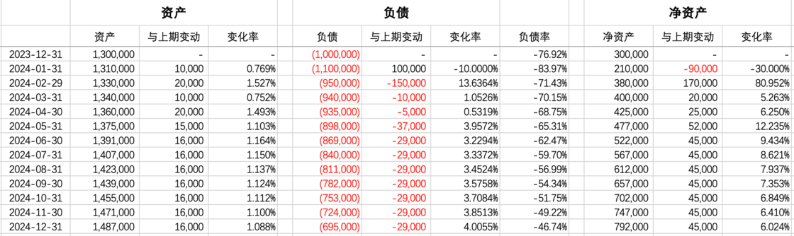

# 年度征文｜新手家庭财务初探 - 少数派

**编注：**

- - -

「本文参加 2023 年度征文活动。我的 2023 年度关键词是：平衡」

### 前言

过去五年来，我一直保持着记账的习惯。经历了多年的实践，也逐渐探索出了适合自己的记账逻辑。直到去年（2023 年），我和女朋友去民政局领了证。

结婚之后，账目就很难再以个人的形式延续下去。单就支出项目来说，就有很多个人类目和共同类目。同时，关于婚后的资金如何支配和记录等等问题，都会将原有的个人财务逻辑打散。

因此，我需要重新思考家庭视角下的财务管理逻辑，以及适配的记账方式。

### 基本逻辑：融合，且独立

搭伙过日子之后，很多个人支出项目，就变成了共同支出（如房租水电燃、下馆子、购买生活用品等），但很多个人支出，就还是个人支出（如工作餐、买咖啡、买点小物件等），更有一些个人支出，最好还是属于个人支出（如给对方买的各种程度的礼物）。

一种最为熟知的方式，是一个人管理全部钱财，然后给另一个人「零花钱」用来自由支配，即「A 上交全部收入，B 负责管理全部支出」。这意味着其中一方获得收入后，将全部上交所得。这种方式是最一股脑解决问题的，但是当下的人活的越来越独立自我，这样很可能会削弱其中一个人对劳动与所得之间的正向反馈。毕竟收入这件事情变得渐渐无感（赚多少也都交上去了）。我们也想尝试更加适应每个人心态的方式。

另一种方式，是类似「A 负责房租，B 负责吃饭」这种模式。在领证以前，我们大致是以这样的方式来生活的，既显得很独立，又好像在搭伙。但是领证以后，所需要的支出就不仅仅是这些了，还会增加很多大件支出、人情往来、长期或短期的贷款等等更加复杂的支出项目。因此这样的方式似乎无法继续成为主导的方式。

直到我看了 [@也谈钱](https://sspai.com/u/8svl8l2c/updates) 的一篇公众号文章 - [《老婆想学钢琴，但我觉得负担不起》](https://mp.weixin.qq.com/s/lW2Vf4QERujlQ-y65ASXCQ)，从中获得了些许启发。当晚和家属商量一番，就决定参照实践一下。

具体的模式是「设立共同账户，共同存入，并负责个人及共同支出」：

1.  每月商议存入共同账户的数字。（可以是对等的，也可以不等）
2.  家庭共同支出，由这个共同账户来承担。
3.  个人支出（通常是信用卡），也用这个共同账户来还款。

感谢@古希腊掌管爱情的神（草履虫）的制图

选择这种模式的思考如下：

1.  共同账户的建立，有一种**共同储蓄**的感觉。
2.  从自己每个月收入中提出大部分来存入。这样更能增加每个人对这个家庭的**贡献感**。
3.  同时个人保有一定量的**现金储备**，能应对一些特殊情况，心里不慌。
4.  每个人工作都很辛苦。不会有任何一个人在收到工资后，马上「全部上交」自己的收入。对收入和工作在心理上的**等价**感，保持一定的良性关系。
5.  双方对自有资金拥有一定的**自主权**，这也意味着，互相买一些小礼物大礼物等等，还会使用到「自己的钱」。这个钱可以是在存入共同账户之后的个人结余（等同于自己省出来的明着的小私房）。
6.  为什么个人支出也用共同账户来支付呢？主要是希望通过这种方式把个人支出与预算都拉入到一个公共视野里，双方不过多干预，但也受到一定的**软性控制**（如设定预算）。

### 实际操作：消费卡与储蓄卡

针对上一章节的财务逻辑，需要选择一种**既方便操作**、**又好区分账户**的实操模式。

目前我和家属设置了 3 张消费卡和 1 张储蓄卡。分别为：

1.  A 的消费信用卡
2.  B 的消费信用卡
3.  共同消费信用卡
4.  共同账户储蓄卡

前两项很好理解，各自的消费用各自的信用卡。当涉及到共同的消费时（例如一起下馆子、超市买菜、共同打车等），就使用第三项的共同消费信用卡。通常，一张卡只能记在一个人的银行名头下，那么 A 可以开启微信的「亲属卡」或是支付宝的「亲情卡」功能，让 B 来刷这个「共同消费信用卡」。

第四项的共同账户储蓄卡，有如下功能：

1.  接收每个月双方的存入
2.  给前面三个信用卡进行还款
3.  支付只支持转账的共同支出（如房租等）

通过这样的组合方式，就完成了三类消费账户以及共同账户的分类。但是为什么一定要搞得这么麻烦区分多个消费卡呢？这跟接下来的记账逻辑和预算控制有关，可看下一章节。

### 家庭账本：从记录明细，到记录总额

过去五年我使用 MoneyWiz 来记账，方式是那种事无巨细的每笔都记，当然有很多类别已经合并简化，因此虽然是每一笔都记录，但实际操作起来也不会十分麻烦。

领证之后，我重新思考了一下记账这件事情。

原本我是希望通过详尽的记账来随时了解自己的资产情况，以及通过记账和预算，来控制各类消费支出。长此以往，我其实已经逐渐养成了不胡乱消费的习惯。对待必要消费（如房租水电等），平时的控制意义并不大，该花就得花了。对于非必要消费（如随手点杯奶茶，买个 XX 等），我已经养成了事前思考这东西是否必要然后再下单的习惯。因此，控制支出这件事情，我早已不再依赖记账。而记账这件事情，更多的作用仅是让我了解当下的资产状况。

既然如此，我们商量过后的家庭记账模式，就不在聚焦**流水明细**，而是更关注**月度总额**及**结余情况**。每个月底，盘算一下各消费账户的负债额度，然后记录一下本月的结余情况。汇总各类资产与负债，按月份制作报表，用来观察家庭财务状况的走势。具体操作见可下一章节。

### 两种表格：账本与报表

相比个人，经营一个小家庭，与经营一个公司更加类似。两个人组建的小团体，有各种类目的资产（房产、投资理财、现金账户、公积金账户、应收账款等），与种类繁多的负债（房贷、信用卡负债、消费贷款、其他贷款等）。因此我们将采用**收支余额表**和**资产负债表**，来视图描述我们的财务状态。简单来说，就是**账本**和**报表**。

#### 账本：收支余额表

（财务上并没有这种表，是自制命名的。）

这个表对应的是原本的「记账」功能。以月为单位，记录四个账户的现金流量情况：

1.  A 消费信用卡支出额度，对应的就是 A 的当月消费
2.  B 消费信用卡支出额度，对应的就是 B 的当月消费
3.  共同消费信用卡的支出，对应的是当月共同消费
4.  共同账户储蓄卡的结余，对应的是共同账户的余额

上面四句话看起来像是废话。但是这里所要回答的是前一章节的问题：为什么设置这四个账户。

（以上数据完全虚构，仅供参考样式。）

同时，仅记录总额不能够很好的达到控制预算的目的。生活中时常会出现这样一类消费，难以分类：

1.  不具有典型的日常性
2.  消费频率偏低
3.  作为特殊消费，需要回顾余额

这类消费，通常相对孤立存在，或者总量偏少，若为了他们再分类，有点略显麻烦。因此我们对每月消费账目的记录，变成了日常总量 + 各类非日常消费。例如可以看到每月的条目如下：

1.  2024-02：消费总额 5678 元
2.  2024-02：日常消费 3456 元
3.  2024-02：理发卡 600 元，优衣库衣服 400 元，保险费 800 元……

通常，我们只对日常消费进行预算控制，而非日常的部分，会以一个相对粗略的原则来控制。毕竟家庭不比公司，有时候要控制预算，但也要考虑生活品质。过分卡时间和卡金额，也会一定程度影响到生活的观感。

（以上数据完全虚构，仅供参考样式。）

再利用 Excel 的数据透视表，自动生成各月份各类别的小计总计。每一个分项汇总仅作为参考和回顾。目前并没有针对这些项目的刚性预算控制。

（以上数据完全虚构，仅供参考样式。）

#### 报表：资产负债表

月底，将收入存入共同账户，共同账户还清了三张消费信用卡，理财账户余额有变动，公积金账户的钱有增有减。这一系列以月度为周期的账户变动发生之后，就可以记录一笔当月的资产负债情况。

记录过当月的表后，再将当月的数据汇入到总表当中，逐月可对比资产负债的变动情况。这样的用处是能够更加数据化家庭的资产负债变动走势。还了多少贷款了，又增加了多少存款了，资产负债率变成多少了，都有一个以月为周期的趋势。方便两个人对家庭的整体财务状况有个了解。

目前我所关注的是「资产负债率」，在资产负债长期处于动态变化的状态下，这个指标是我觉得能够总体概括家庭财务风险等级的重要指标。同时，它也可以作为我们在财务运作（是否考虑提前还贷，是否新增其他贷款，额度多少，是否加大投资理财等）方面的重要参考依据。

（以上数据完全虚构，仅供参考样式。）

（以上数据完全虚构，仅供参考样式。）

### 维护平台：Office 365

关于在线表格，尝试过 Airtable 和 Notion，但是使用下来发现他们的表格比较固定（比方说同一列要么是数字，要么是公式，不可以同时出现数字和公式），导致可自定义性比较差一点。并且比较热门的 Notion 中的表格，界面中无关要素偏多，导致表格中的文本数字等不够突显或不能一目了然。

最终我们还是回归原始，使用了 Excel，通过 Office 365 实现线上共享使用，加上一些简单的 VLOOKUP 和 数据透视，目前足以应付当前需求。自定义强，意味着需要经过一番打磨才会让表格显得好看且可读性强。因此这个表格的范式，还在不停的增强当中。但是首当其中，是功能上要先满足需求，这一点上使用 Excel 还是很容易的。

### 后记

人生就是在不断探索。在不同的阶段，找寻合适的方式来生活，是一生的课题。

过去我自己生活，只要找到属于自己的方式就可以达到自洽。以后搭伙过日子，就要通过协商和更多方面的考虑来构建合伙模式。每个人、每个家庭的个性、条件、情况都各有不同，因此每个人都应当找寻更适合自己的方式。本文仅以一个小例子作为阐述，也是对 2023 年身份转变后，个人对家庭财务思考的总结。

\> 关注 [少数派公众号](https://sspai.com/s/J71e)，解锁全新阅读体验 📰

