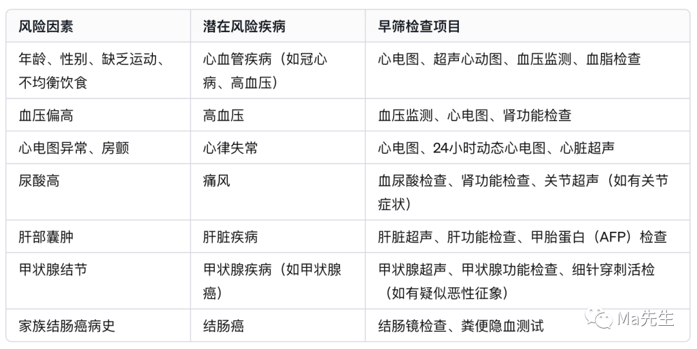
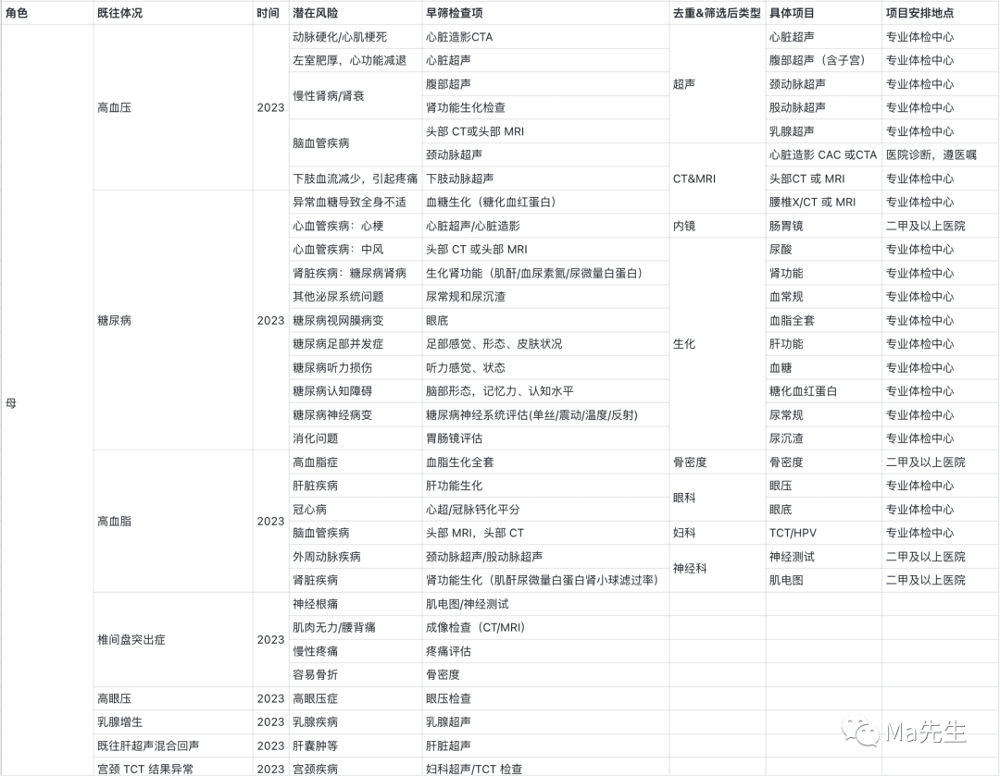
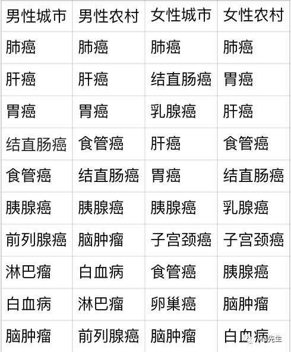
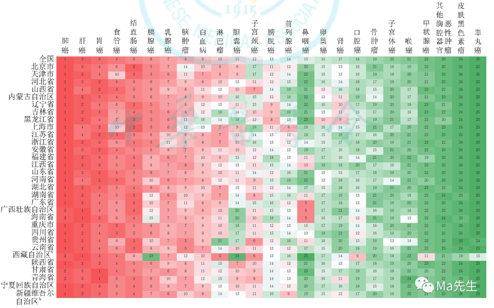

# 思路分享：制定最适合你的体检项目 - 少数派

思路分享：制定最适合你的体检项目

[非专人士](https://sspai.com/u/5d6vdzvx/updates)

11 月 30 日

**Matrix 首页推荐** 

- - -

又到了一年一度为爸妈囤体检套餐的时节，这篇内容本来计划双十一发，但如果我自己没有完整的验证一轮可行性的话，容易带来一些误导。所以双十一我根据下方内容为女友父母购买了体检套餐，并且让他们完成了体检，进行了一些思路上的小优化后，最终形成了本篇内容。

相比两年前的那篇文章，这篇内容不是傻瓜版方案，而是需要你自己动手花一些时间，整理出最适合的体检项目。在按下方的方式做完这件事，我才第一次比较清晰的能够认识到他们身体具体的风险因素，并开始针对异常项，在日常做精细化管理。

## 体检肯定是有用的

在各大平台检索后，我的感受是很多人对体检有个误区：

> 每年体检报告大夫都说没啥事，怎么就突然生大病了，体检没用，小病没事儿大病查不出。

体检肯定是有用的，如何发挥关键作用体现在两个动作，一是体检项的选择，二是体检后的异常项关注。

举个例子，50 岁人群，体检项只有最基本的内外科、血常规、肝肾功能、腹部超声，这种情况下是很难查出这个年龄段可能高发的潜在冠脉狭窄、动脉斑块问题，就容易出现这些指标看起来都正常，但可能突然有一天胸痛，紧急支架。这就是第一种情况，体检好像没有查出相关潜在风险。

近些年会发现一些癌症的发病率在提升，同时临床治愈率也在上升，除了新药物研发的作用外，有效的体检能发现很多早癌，早癌的治愈率很高，所以同时提升了癌症发现数量和治愈数量。而发现得早，就是体检的核心意义。

## 有效体检

有效体检就是解决两个问题，一个是检什么，另一个是检后做什么。生不生病是个概率游戏，至今没什么妙招能一步攻克，我们也不必焦虑到体检需要覆盖身体的方方面面，得利用概率，去看看最可能发生的问题是否已经有了坏苗头就好。

### 「基础体检项选择」

绝大部分时候我们是已经看到了一份体检套餐，密密麻麻的项目让人眼花缭乱，很难判断这份套餐是否合理。而我这两年根据自己的各种经验总结的逻辑是：从疾病风险结果反推体检项。

先不考虑体检项本身，而是先搞清楚自身可能存在的风险疾病，再从疾病早筛所需要检查的项目入手，就能够清晰的知道我做了这些体检项，排查了哪些可能的疾病。

每个人的体况不同，如何清楚自身的所有疾病风险，我总结了一个初版公式：

> 风险因素=性别/年龄 + 工作状态 + 生活状态 + 既往体况 + 家族病史 + 癌症筛查

这个公式里只有癌症筛查是相对有准确统计数据相对标准化的（后面会有单独章节）。其他因素相对而言会更个性化。

在没有什么医学背景和健康管理经验的情况下，如何判断这些因素可能产生的潜在疾病风险呢？至少从 2023 年起，可以尝试利用最新的 AI 大模型能力（国内的各家大模型都可以使用，可以选择自己沟通最顺畅的）来搞定这件事。几乎没什么上手难度，我举一个例子。

> 性别/年龄：男性，50 岁
> 
> 工作状态：普通内勤白领，办公内容主要是坐在电脑前，每日办公 8-10 小时
> 
> 生活状态：运动不多（一个月两三次），爱吃辣，爱吃肉，不爱吃菜
> 
> 既往体况：过往检查异常项有血压偏高、心电图提示钙化和房颤、尿酸高、肝部有囊肿、甲状腺结节
> 
> 家族病史：母亲结肠癌

无论使用哪个模型，可以将上述内容输入，并给出 AI 输出的要求。一个简单的 prompt 供参考，你可以自行探索和调整：

> 我将输入给你：性别、年龄、工作状态、生活状态、既往体况、家族病史等信息，请生成一个全面的检查项目表格。确保表格涵盖所有可能的风险因素、对应可能的高风险疾病和对应疾病的早筛检查项目，包括但不限于心血管疾病、糖尿病、肝脏疾病、甲状腺问题、慢性病、以及任何相关的遗传性健康风险。检查项目应详尽、具体，并考虑到个人的生活和工作环境对健康的潜在影响。

这是 GPT 返回给我的内容，上边是一次性输入后拿到的输出。

当下我个人会利用 AI 精细化逐一沟通风险项。比如我会具体的咨询该年龄生活工作习惯下，可能存在的高风险疾病有哪些，回答后，让它基于这些疾病给出体检早筛的项目，最终整理成表格，下边是多轮对话后的结果。

通过这种方式获取到的体检项，就可以对照体检套餐，看看本次套餐覆盖了上述哪些疾病，哪些没有覆盖。就能够做到个性化的调整。我个人觉得，你越事无巨细的告知它，它也会更加有针对性的分析可能存在的风险，并给出要做哪些项目的建议。

我根据女友父母的既往体况，和 GPT 进行了比较深入的沟通，尤其是针对既往症相关的疾病风险梳理，整理出了下方的内容（非 GPT 直接输出）。

## 「癌症早筛体检项选择」

整理完基础项目，就可以看看一个独立的部分——癌症早筛。

至今都很难做到谈癌不色变，甚至在我看来，为中老年群体体检，一个非常重要的目的就是癌症早筛。无论哪种癌症只要能在早期发现，生存率都会比较可观。

那如何判断哪些癌症需要筛查，根据权威数据，关于中国恶性肿瘤发病相关数据统计可以这样获得：国内有一家《中华肿瘤杂志》期刊，它会不定期发布一篇文献，说明中国恶性肿瘤流行情况。

打开[中华医学期刊全文数据库](https://sspai.com/link?target=https%3A%2F%2Fwww.yiigle.com%2Findex)，检索恶性肿瘤流行数据，将看到 2023 年发表基于 2016 年数据的最新流行研究。可能有人会觉得 2016 年的数据比较老，不过我个人的理解是，我要用这个数据做什么，其实只是需要一个列表：中国人最经常患或身故风险高的癌症有哪些。所以只要能够反应一个最新趋势即可。2016 年的完整数据，在 2023 年完成统计分析和发表，对于普通人来说足够用。如果你需要查询具体某一种癌症相关的内容，会有更新的数据作为支撑的文献，可以按需搜索。

基于这篇文献，我提取出了几组恶性肿瘤死亡率排名前十的数据，分别是按性别维度，和按区域维度。使用方式就是根据自身情况按性别和所在地域筛选出高发恶性肿瘤。

## 套餐选择

基础项目和防癌早筛项目全部整理完后，就到了套餐匹配，在本次的逻辑下，这个步骤就变成了最机械的动作，就是匹配。不过这件事对于不同预算的群体来说，思路可能有所不同。

预算很高（3000-10000）：建议直接到三甲医院体检中心按需求定制体检项目，医院的核心优势有两个，一个是检查医师会更为专业，甚至能在报告中直接给出临床诊断，二是如果真的查出些问题，在后续问诊、甚至住院过程中，相同的检查项目无需二次再做，医院相信自己的检测结果，但对于体检中心的结果，医生通常会参考，但仍然需要重复检查。

预算正常（1000-3000）：大部分检查项目放在体检中心，个别项目医院筛查，比如肠胃镜、增强 CT 等。在父母愿意肠胃镜的情况下，不要选择胶囊肠胃镜，取不了病灶、切不了息肉、还贵。如果父母不愿意肠胃镜，可以选择这两年比较火的常卫清检测盒。这类检测盒的特异性核心在结肠癌上，但如果肠胃有炎症、溃疡、息肉等，就很难检测出，算是一种兜底方案。

中低预算（1000 以内）：项目选择上重点关注既往症、生活工作习惯等导致的高风险疾病，多余的预算放在癌症早筛的前三项或前五项。

有个省钱的小细节，关注父母社保所在地的医保政策，看看年统筹额度支持哪些场景，如果支持门诊统筹，额度有个 1000、2000 的，那么一些放射、内镜项目就可以选择在医院挂号做，能省一些钱。比如这次女友母亲的退休职工医保做肠胃镜，总额 1900，统筹后自费不到 300，当然这一个项目基本用掉了她所有的统筹额度。

## 体检报告解读

上边大量的篇幅讲了如何选择体检项目，第二部分要聊的就是体检报告异常项的解读。在我这两年的各种体检报告解读服务体验下来，除非是一个对你个人有着长期了解的人，否则整体服务都比较机械式，听上两个感觉我也能干这个活。并且现在还有了 AI 加持，如果你不嫌麻烦，其实可以将异常项都摘录出来，让 GPT 给你一些建议，重点的沟通放在哪些异常项需要到专科门诊问诊。这样你在就诊前差不多能够知道可能的病是什么，可能要做哪些检查进一步明确，加上大夫的专业性，能够对这个异常项有一个清晰明确的认识。

我个人总结出了几个基本逻辑，供参考：

**异常指标做对比**：连续 2-3 年的检查报告，将异常项放在一起做对比，关注异常值、描述有怎样的变化。

如果是血液生化等功能性指标，相同指标连续 2-3 年均异常，则需要择期医院就诊排查；相同指标突然异常，可关注自身症状，有症状务必医院排查，无症状但个人谨慎可调整生活方式 1-2 月后单独复查指标，心态比较好则可选择 1 年后体检再看。我个人的报告阅读经验，肝功能、肾功能、尿常规、尿酸、血脂是比较容易产生异常的情况，但也是和日常生活方式息息相关的指标，如果最近一年「作」得比较厉害，在这些指标异常时，就是一种黄灯警告，需要及时调整。如果是超声、放射等报告，异常内容的对比核心看描述和大小，比如结节、囊肿大小如何变化，描述的话语上是否有变化，如果结节、囊肿连续两年增大，则最好开始在医院随访就诊，大夫将能给出更精确的复查周期。如果结节、囊肿的描述发生变化，比如去年只有大小描述，其他正常，今年描述中增加了「磨玻璃」「点状强回声」「钙化」等字眼，无论是 AI 还是大夫，都会针对这些字眼更为谨慎或者说定期复查就变成了一个确定性的事情。

**多指标合并**：针对同一个部位，生化与超声/放射单独看可能都只是一种可能性，可重视也可下个周期再说，但合并看就有可能会更多信息。

比如甲状腺，超声提示有个结节，此时如果甲状腺功能指标正常，那么大概率观察即可，而如果甲状腺功能指标异常，则一定需要医院专科就诊随访大概率会存在「甲亢」「甲减」；再比如肝肾，超声提示有囊肿、结石、钙化灶等，如果生化指标正常，则可观察，如果生化指标不正常，则需要医院随访就诊。

**既往症合并**：如果过去已经有某项疾病，体检中的项目可以顺便当作一次复查或相关项筛查。

比如因骨质疏松或其他相关疾病服用某些药物时，血钾、血钙、肝肾功能都有可能因为服药而出现异常，日常吃药时不太会关注此类情况，也很少会谨慎到用药一两个月复查肝肾功能，体检可以顺便基于当前用药进行一个评估。

再比如三高、冠心病等慢性病，此类疾病通常需要长期服药，并且也会忽略复查，有三高等疾病的人体检就可以重点关注一下相关指标在服药的情况下是否在合理正常的范围内。这里的正常指基于患者体况，比如冠心病患者的血脂的正常值就需要比标准正常值再低一些；痛风患者的尿酸值就需要比正常值再低 50-100 才更为稳妥。如果体检结果发现相关指标没有达标，医院就诊换药、复查就是必须的，切忌自行配药调药，网络发达，可以随便搜一些自我诊断最后追悔莫及的例子。

讳疾忌医是这个阶段很多人的心态，我有一个小感受可以分享给你，没什么明显症状时发现的问题，可能才是真正的病早期、亚健康风险期，在这个阶段很多问题可以通过真正意义上的「不打针、不吃药、无需保健品」方式痊愈，还身体健康稳态。

生病是概率，而很多时候这个概率可以人为控制到最低，剩下的再交给命运。

## 尾巴

过去在体检问题上我也喜欢伸手党，喜欢现成的体检方案，最好链接都发给我，但在这一年的各种经历后，我逐渐感受到疾病预防的关键是什么，只有对自己的身体状况充分清晰、对自身疾病情况充分熟悉和理解，才能真正的获得合理高效的医学建议，才能真正规避疾病风险，这些事情确实很耗费精力，并且需要认真不偷懒的对待才会有好的效果。虽然长期的健康管理道阻且长，但的确可以先从为自己为家人规划一次合理的体检开始。

如果这篇文章仍然没有解决你的困惑，欢迎私信、留言沟通。如果本文对你有帮助，欢迎点赞、分享，这将给我非常大的帮助。

\*文章首发公众号：Ma 先生

#### 关联阅读

-   [什么都可以以后再说，体检为什么不可以？](https://sspai.com/post/77776)

\> 关注 [少数派公众号](https://sspai.com/s/J71e)，解锁全新阅读体验 📰

体检肯定是有用的

有效体检

「基础体检项选择」

「癌症早筛体检项选择」

套餐选择

体检报告解读

尾巴

全部评论 (7)

热门排序

写下尊重、理性、友好的评论，有助于彼此更好地交流～

[非专人士](https://sspai.com/u/5d6vdzvx/updates)

1 天前

有朋友评论区提到保险了，就顺便简单提一下，我也做了几年保险经纪人，积累了些经验，简单分享，如果有朋友们有需求或者爱看，可以点赞或者回复提问，我可以尝试把相关内容发表在少数派这边。如果确实已经体检了，体况不佳的情况下，投保建议找靠谱的经纪人协助寻找和制定投保策略，好的经纪人能节省非常多的时间和精力，并且因为保险统一定价，...展开

011

[Zach 同学](https://sspai.com/u/zach18/updates)

1 天前

无脑公司套餐中

05

[少数派\_1082248](https://sspai.com/u/ynzxolnz/updates)

1 天前

一个提醒：如果近期打算买保险建议不要体健，万一检出小毛病可能会导致不能够买或者不保那个器官（我上半年阳过之后去做 ct 发现有个结节，碰巧打算买医疗险结果好多款都不能买，要求半年到一年后复查没问题才能买）

23

[非专人士](https://sspai.com/u/5d6vdzvx/updates)

1 天前

对的，如果有投保打算，体检建议放在投保等待期后。

0

[Zen](https://sspai.com/u/yqp9c3jw/updates)

1 天前

俺就是后悔了，查出来一个问题，啥保险也买不了，只能买那种惠民保，先买保险，再考虑体检。

0

[圣西罗老球童](https://sspai.com/u/xlgend8l/updates)

17 小时前

借助大模型这个思路很值得学习

00

[请向前](https://sspai.com/u/v3qoka2f/updates)

1 天前

好文，正在考虑给爸妈体检

00

没有更多评论了哦
