# 用统计学分析了 5108 个打工人的人生，我发现了赚钱的秘密｜青工所 2 - 少数派

**Matrix 首页推荐** 


- - -

关于赚钱的深度研究：我分析了 5108 个打工人的人生

 小凡今天出片了吗 关注

00:00 / 33:49

自动

倍速

进入哔哩哔哩，观看更高清

#### **本集研究员：青工所小凡**

## **起点：谁不想多挣点钱呢？**

> 多上一年学可以增加 20% 的收入，
> 
> 人缘好增加 16% 的收入，
> 
> 一个月发两条朋友圈增加 7% 的收入
> 
> ……

过去几个月，我开始了一场关于赚钱的深度研究：学历高赚钱更多吗？长得高赚钱更多吗？健身、读书、学英语能帮你赚更多钱吗？

我研究了 88 个和收入有关的因素，从父母、学历、家庭人口，到心理状况、发朋友圈频率，涵盖了你能想到的方方面面。在一个包含了 1312 个变量和 28530 个观测数的庞大数据库里，我质疑数据、清洗数据；最后，我看到了 5108 个普通人的人生。

我做的这一切，并不是想提供一套可以照方抓药的「赚钱秘籍」，因为这 88 个变量加起来，对于「我们怎样才能赚到钱」这件事，也仅仅只有 46.7% 的解释力。

**究竟是什么在影响我们的收入？这其中，有多少是我们可以掌控的？**

我过往的许多模模糊糊的感受，在这个研究的过程中一再被凿实；它也让我看清，究竟是什么样的变量牵引着我们走到了今天。

## **画线的科学**


这句来自福尔摩斯的金句被印在了这本统计学经典教材的第一页，读起来很抽象，但统计学主要就干两件事：描述统计和推断统计。

**描述统计其实就是你最常听到的各种统计报告干的事情**，收集数据，画出各种各样的图表，计算你最关心的数据，我们的 GDP、平均工资、出生率、失业率 1 等等。

**而我们要做的，更接近推断统计，列出方程，找到事物之间的关系，把模糊的关系变成精确的数字。**比如：

> 房价每上升 1%，婚龄人口初婚年龄平均增加 1.108 岁；
> 
> 认同「男生更擅长数学」的男生，数学分数高 4.8%，而认同这一观念的女生，数学分数低 5.4%；
> 
> 紫外线强度每增加 1%，劳动活跃度降低 1.3%，人均 GDP 降低 1.5%。

而这个过程，被叫做回归——regression。如果用可视化的方式表现出来，回归方程其实就是在图上画一条线。如果图上的数据点离这条线越近，它的模拟和预测效果就越好，意味着我们找到了事物之间的规律。


2021 年，David Card 等人凭借劳动经济学的研究获得了诺贝尔经济学奖，核心就是靠他画出了几条这样的线，证明了移民的增加并不会对本地劳动力的失业率和工资水平造成显著影响。

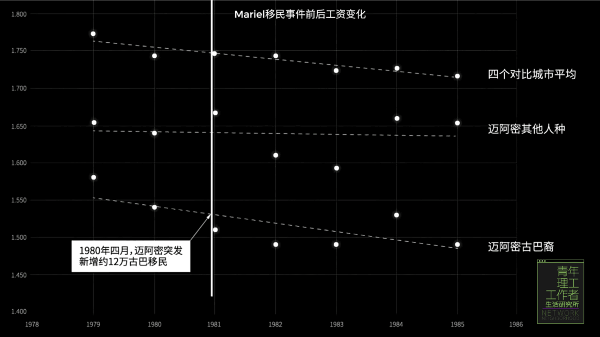

具体到我们关于赚钱的研究里，其实要做的，也是画线。

在统计学的世界里，线对应着方程，而大家最常用的经典方程，其实只是最符合常识的方程，比如——明瑟收入方程。

1974 年，劳动经济学家雅各布·明瑟分析了受教育程度、工作经验和收入之间的关系，提出了这个经典方程：


-   w ：代表收入，w0 就是 0 教育 0 工作经验参加工作的收入，可以理解为一种社会最低工资
-   s ：表示受教育年限
-   x ：表示工作年限

**明瑟方程猜想，教育程度越高、工作经验越丰富，收入就越高。所以，我们的最终收入，就是最低工资加上这两部分的带来的增益。**

具体到公式，每多上一年学，工资收入增加 ρ，而每多工作一年，工资增加 β1，不过工作经验带来的收入增幅是有上限的，所以还需要加上一个 x 平方项，前面的 β2 是负数，让增速逐渐减慢。

而这个 ln 是自然对数，它可以缩小工资的变化范围。

现在，为了计算任意教育程度和工作年限的人的期望收入，我们还差的是这四个固定参数 w0、ρ、 β1、 β2 的值。我们需要大量的人的收入、受教育年限、工作经历的数据来确定这四个常数项的值。

但问题是，上哪找那么多人自爆工资呢？

## **28530 人的 1312 个问题**

最初，我想到了国家统计局，但他们表示不太方便提供数据。

一番搜索后，我找到了一个数据库，CFPS（China Family Panel Studies） ——中国家庭追踪调查。这是国内一个大规模、综合性的、以学术为目的的社会追踪调查项目，它的基线样本覆盖 25 个省、市、自治区，代表了中国 95% 的人口。

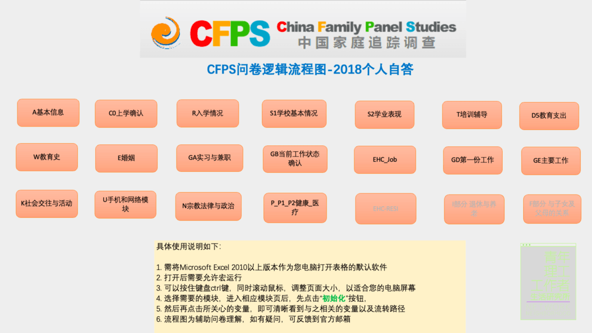

在 CFPS 官网，我找到一份 127 页的用户使用手册。可以看到，问卷以外还有大量核实数据、清洗数据的工作，例如对样本进行电话或实地核查、采访回放，对逻辑错误的数据进行清洗等，非常严谨。

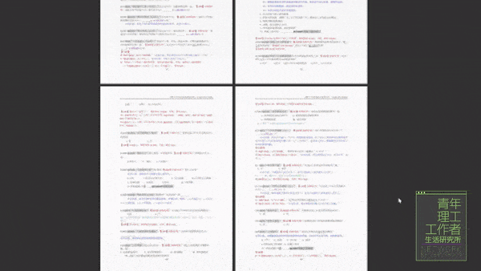

而问卷本身也足够复杂，这里我们可以看到 CFPS 完整的问卷逻辑流程。一共分成了 24 个模块，每一个模块里，都是一张这样庞大的流程图。

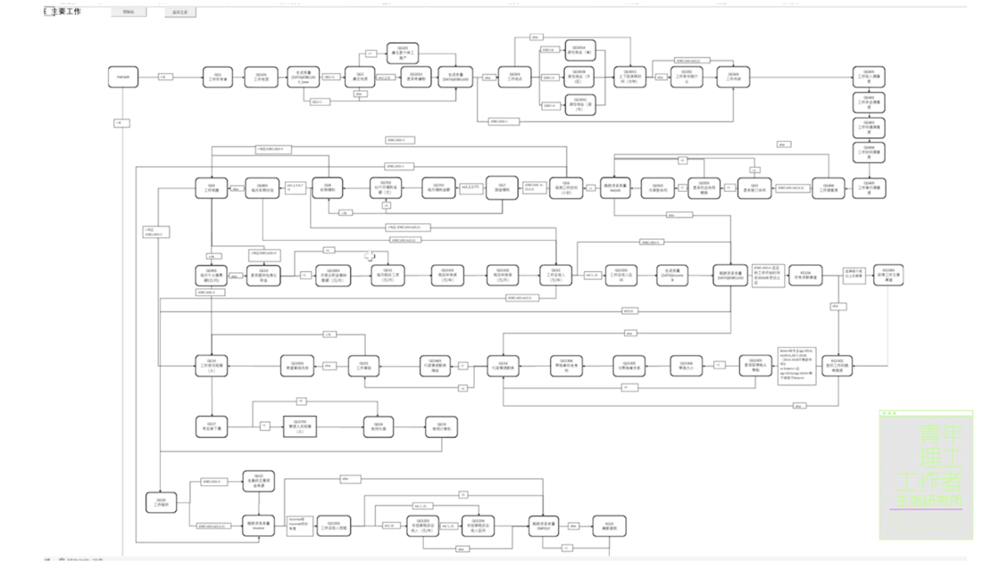

这些线表示提问流程，根据不同的回答引向不同的分支问题。

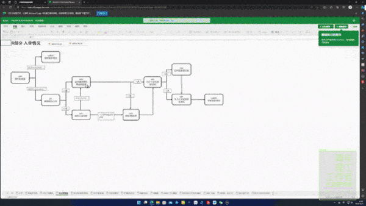

当然，肯定也少不了关于个人收入情况的调查。而我们想要研究的关于赚钱的一切，就隐藏在收入和这些变量之中。

而这么宝贵的数据，我们普通人也是可以免费使用的，只需要注册账户、提交申请，通过审核后就可以下载了。

用数据分析软件 STATA 打开 CFPS 2020 个人库 ，我们可以看到一张有着个人 ID、年龄、学历、婚姻状况、生活习惯等 1312 个变量和 28530 个观测数的巨大表格。

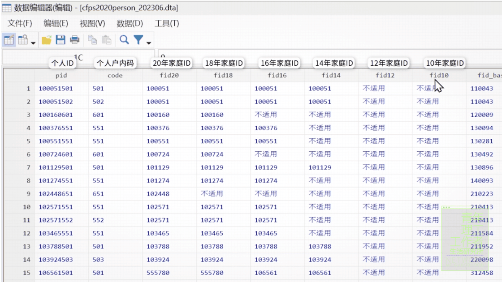

根据明瑟收入方程，我们需要获得人们收入、教育和工作经验的数据。

我找到了名为 emp\_income 的变量，它代表过去 12 个月所有工作的税后工资性收入，以及代表教育年限变量 cfps2020eduy，但并没有工作年限。好在，我们还可以根据定义来计算，用受访者年龄减去他的受教育年限再减去平均入学年龄 6 岁就是他的工作年数了，写成命令就是这样：

```javascript
gen workingyear = age - 6 - cfps2020eduy
```

之后，我们只需要再生成工资的对数项和工作年限的平方项，就有了明瑟方程里的全部变量。

```javascript
gen wk2=workingyear^2
gen lnw=ln(emp_income)
```

接下来，只要进行回归，我们就可以计算明瑟方程里的全部未知数了。

## **还是别看了**

根据我们设定的回归方程和 CFPS 数据，如果把收入作为 z 轴，教育年限作为 x 轴，工作年限作为 y 轴，我们还可以在三维空间里完整表示出它们之间的关系，这里的每一个点，都代表了一个具体情况下的人的收入。


0 教育 0 工作经验的人的工资是每年 2 万 3 千块，上 16 年学也就是本科毕业后增加到年薪 3 万 7，再有 10 年工作经验的话，会到每年 4 万 1 千多块，相当于每月 3471.6 元，税后。

emmmm，是不是有点太低了？

重看我们的数据就会发现，这个结果确实有点问题。小孩、老人，不领工资的农民其实都不在关于工资问题的讨论范围之内，要得到更准确的结果，就得去掉这部分人的数据。

去掉这部分人群后，数据库的观测人数从 28530 人直接降到了 5108 人。 

重新计算，结果会怎样呢？

最明显的变化是，教育水平的影响变大了，学历越高，差距越大。但相比筛选数据之前，工资提升也挺有限的，本科应届生工资只多了 400 块。

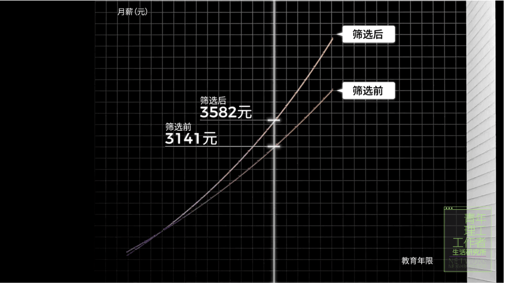

问题出在哪？

让我们再重新审视一下明瑟方程，一个明显不太自然的地方是，明瑟方程假定了每多一年教育对应的收入增幅都是恒定的，但实际情况显然不是这样。

10 年和 11 年教育经验的差距，会远远小于 11 年和 12 年教育经验的差距，因为前者只是从高一到高二，只有初中文凭，而后者则是从高三顺利毕业，拥有高中学历。

或许，我们可以试试去掉教育年限，直接把学历作为变量，让明瑟方程变成这样：


比如一个人是高中毕业后工作，那么就可以用文盲 + 小学 + 初中 + 高中的收入数值加工作年限情况来计算，这样还能更直观的看出来，每多完成一个学历，到底具体能多多少钱。

用这个新方程再计算一次，结果看起来靠谱多了。2020 年，本科应届生的月薪已经能有 4000，硕士更是到了 6000。收入和教育之间的关系不再是沿着曲线稳定提升，而是随着学历阶跃式上升。而提升最大的还得是本科，相比高中学历有着 1.7 倍的工资涨幅。

看起来，我已经找到了赚钱的秘诀，只要学历高，工资就会变高。

真的是这样吗？

## **提升一下解释力**

r-squared，r 的平方，这个指标的中文可以说成是决定系数或者是拟合优度，顾名思义，就是拟合的优秀程度，专门用来评价回归结果对于数据的解释力有多高。

r 方表示的其实就是线和点之间的关系，它们越接近，r 方越大，线的预测效果就越好。 R 方等于 1，则完美拟合，意味着这条线可以 100% 解释每一个数据点。

而在我们刚刚的研究里，r 方怎么样呢？

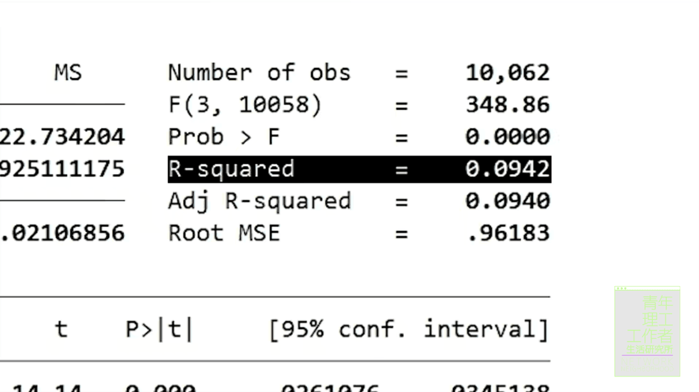

第一版回归结果里，r 方只有 0.09，筛完数据分好学历，也只上升到了 0.16。

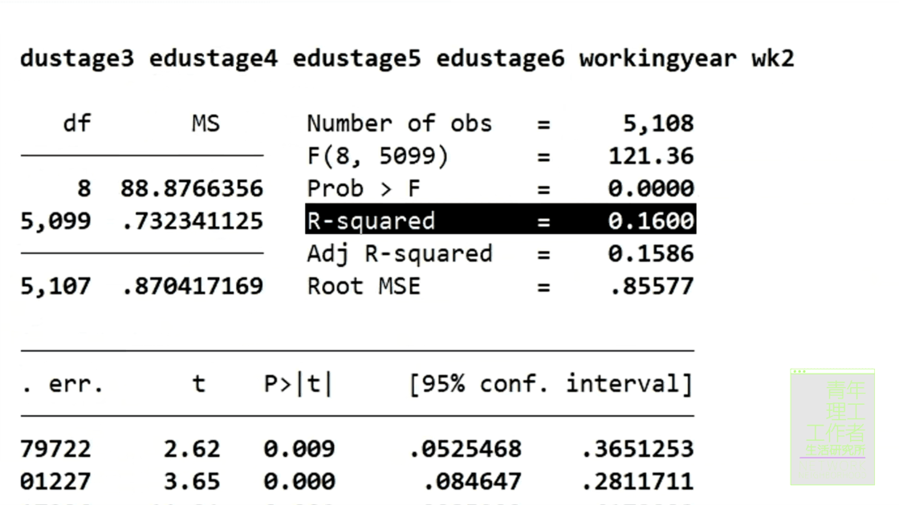

0.16 的 r 方大概是什么概念？

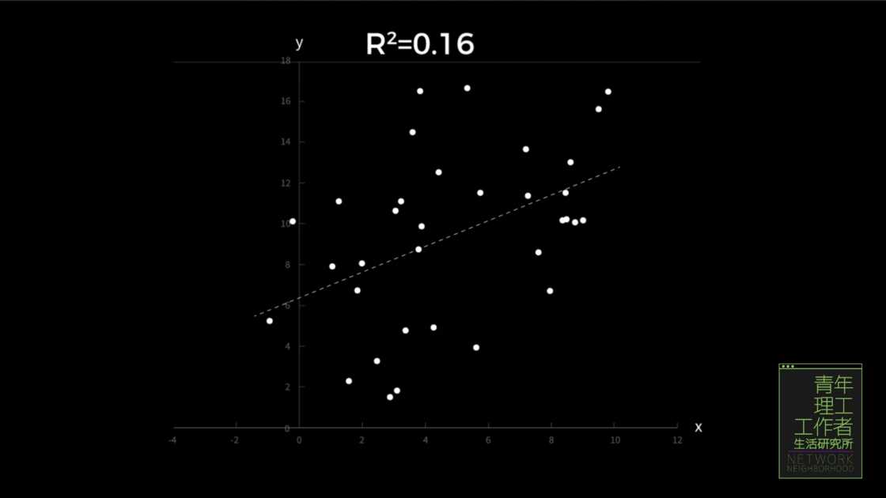

如果用一个二维点阵图表现大概就是这样，的确有一些隐隐约约的趋势，但还存在着大量无法被解释的数据。也就是说，我们刚刚辛辛苦苦算出来的，学历和工作年限对收入的影响，只有 16% 的解释力。

要更进一步接近赚钱的真相，我们唯一能做的，就是加入更多变量，比现在多得多的变量，才有可能在多维空间里足够接近现实世界的数据，让 r 方尽可能变大。

我们可以试着先加入一个变量，比如——你所在的城市。


不过由于 CFPS2020 的数据隐私保护，我们暂时只能分出「北京上海」和「其它城市」这两类。北京上海拿到的工资几乎是普通城市的 2 倍，2020 年，本科应届生在北京的月薪已经能有 6677 元了。

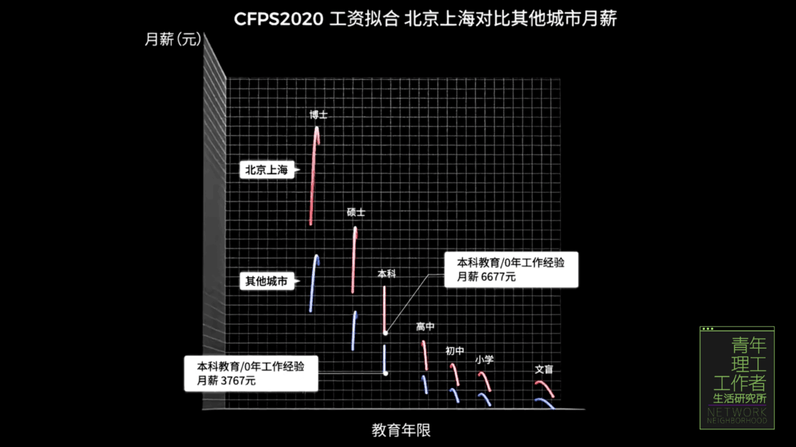

增加城市变量的同时，r 方从 16% 提高到了 19%，这意味着我们对工资的解释力又强了一些。

但是这还远远不够，不如来个大的，一次性把 CFPS 里所有可能和工作有关的变量全部都筛选出来，全部加入到方程中，看看结果如何。

## **关于赚钱的一切**

在筛选变量的过程中，我似乎看到了 5108 个不同的人生，每一个变量，每一次选择，让我们成为了今天的自己。

这里有那些你一出生就已经决定的事情：性别、民族、父母学历、家庭情况；也有很多你自己的重大选择：在什么城市工作、从事什么行业、是否结婚、有几个小孩；然后也有你和这个世界相处的方式：你的人缘、信念、和父母的关系、心理，也有很多看起来无关紧要的生活习惯：是否午休、是否吸烟、你的运动和发朋友圈频率。


在实际筛选的过程中，我选择了回答率比较高的、尽量贴近日常生活的变量，排除了答案有明显耦合的变量。例如，有个变量来自问题「你对伴侣对于家务的贡献满意度如何」，这个问题本身是有价值的，但回答这个问题的前提是当前有伴侣、非单身，那么这个问题就和「当前婚姻状况」的问题耦合了，这会让两个变量的结果都不可靠。

最后，我选出了 88 个新变量。

接下来要做的，就是体力活了。分析变量、理解变量、清洗变量，把它们一个一个加到修改好的明瑟方程里，现在，我们已经有了一个这样的超级公式。


来看看美丽的统计学究竟会告诉我们什么。

首先，需要说明的是，下面的数据只是来自我们对这些生活在 2020 年的 5000 多个打工人的分析结果，无法绝对客观的反映社会现实，但是，如果你把自己代入进这 5108 个不同的人生，感觉就不一样了：

> 你们的平均工资是 4583 元，如果工资超过 2 万 5，已经可以排进前 10%，而最差的 10%，月薪不到 2200 元。
> 
> **对工资影响最大的，是城市、行业和学历。**
> 
> 博士收入是文盲收入的 2.4 倍，即使是本科毕业，收入也比高中毕业高 24.4%，不过看起来，小学初中和高中学历的工资差距倒不大。
> 
> 最赚钱的行业确实是我们大家都知道的金融、计算机、房地产，他们比收入最低的农林牧渔业要高百分之四五十，不过到了 2023 年，房地产的收入就不好说了。
> 
> 而差距最大的因素，还是城市。在北京工作，会在比工资最低的宁夏收入高 2.5 倍，比大多数内陆省份都要高 40% 到 60%。
> 
> 但对于外地人来说，在北京这样的城市工作，也要承担巨大的代价。数据告诉我们，88.6% 的人都选择在自己出生的省份工作，而在北京上海出生的人里，更是有 98.7% 都在本地工作，当然，很有可能是那些选择出国的人已经调查不到了。
> 
> **所以，或许你收入不错，但你要知道，这里有不少其实来自你天生的优势。**
> 
> 除了你的出生地，如果你长的高，会比最矮的人群收入高大约 20%（男 26.9%，女 14.2%）。如果你的惯用手是左手，会比其他人收入高 15.6%。如果你性格外向擅长交际，收入会比人际关系最差的高 24.4%。
> 
> 如果你是男的，平均收入也会比女性高 36.3%。进一步拆分会发现，其实结婚前的男女收入是差不多的，收入更高的，是已婚男性，比已婚女性高 31.7%。如果女性还要多做家务，多花时间照料父母，收入差距还会扩大到 49.5%。
> 
> 不过，家里有没有钱，对于工资收入的影响倒是没有想象的那么大，家庭资产超过 1000 万的，比资产不到 1 万的，工资也仅仅只高了 35.9% 而已。
> 
> 但努力始终是有意义的，2010 年，这 1546 个在北京上海工作的人里，来自外地出生的人比本地人的收入要高 19.6%，因为能留在大城市，意味着他们已经足够优秀。
> 
> **另外，我们还发现了很多你可能没有意识到的神秘因素：**
> 
> 偶尔发朋友圈的人，比用微信但从来不发的人高 8.1%。
> 
> 最近抽烟的比不抽烟的收入高 11.3%。
> 
> 每天睡 10 小时以上的人，比睡 6⁠–7 小时的人，收入高 9.3%。
> 
> 和父亲关系不亲近比和父亲关系亲近的收入还要高 8.2%。 

至于为什么会这样，我们其实也难以解释，或许你会有自己的答案。

除此以外，其实还有大量无关紧要的变量。我按照对工资的影响程度从大到小做了一个排序，你会发现，最重要的学历、城市、行业、性别、婚姻这几项，已经超过了最不重要的六十多项变量。


所以，在我们做完这一切之后，现在的 r 方有多大了呢？

——46.7%。

统计学竟然可以解释 46.7%，也仅仅只能解释 46.7%。

## **46.7% 的人生**

所以，我们所做的这一切究竟有什么意义？

在开始这期关于赚钱的研究之前，我以为我可以通过统计学找到一些变有钱的规律，读大学可以增加 24% 的收入，人缘好增加 24% 的收入，偶尔发朋友圈增加 8% 的收入，诸如此类。

但我们现在知道，这些并不是原因，而是结果。

**统计学研究并没有为我们指明未来的方向，但统计学告诉了我们如何看清自己，看清究竟是什么样的变量牵引着我们走到了今天。**

**从小学开始，当代生活和现代教育就在要求我们理性，要求我们量化一切，要求我们寻找一种确定性的答案和路径。**上什么样的辅导班、考什么样的大学、找什么样实习、选什么样的研究生专业、上岸国企、上岸公务员、上岸互联网大厂、然后买房、结婚、生子、再为孩子计算他的人生。

我很难评价这样是否正确，对于我们很多人来说，追逐那 46.7% 的确定性已经是唯一可以抓住的机会。

**但统计学也告诉我们，总有 53.3% 是无法被计算的，这其中除了运气，也包含了种种后天的选择，交往的朋友、个人的品德、生活的勇气、坚定的信念…只是它们的影响暂时无法用统计学来量化。或许那些无法被计算的部分，才是真正的你。**

而无论你选择什么样的叙事，别忘了，虽然总的可能性不变，但个体永远有无限可能——这就是统计学。

\> 关注 [少数派公众号](https://sspai.com/s/J71e)，解锁全新阅读体验 📰


