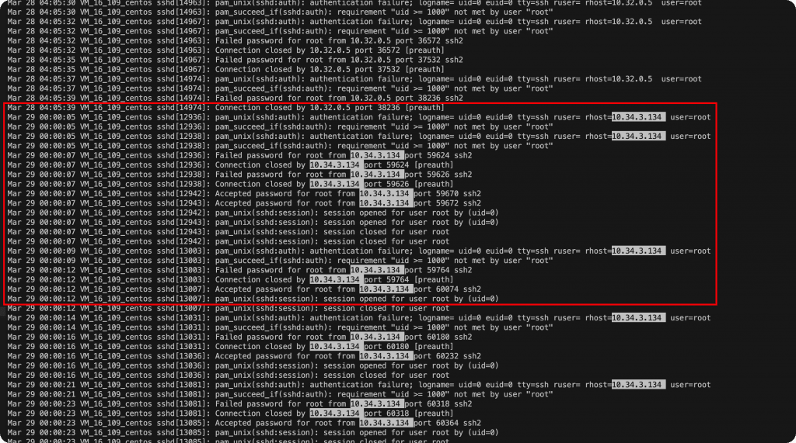
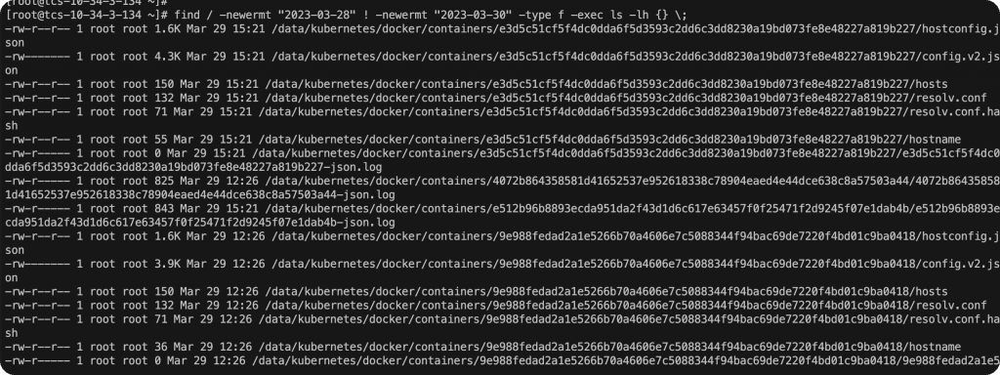
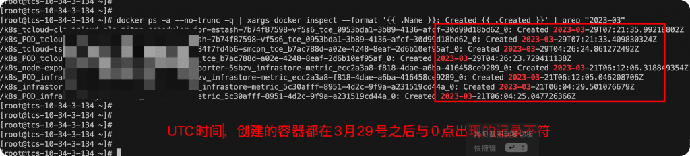
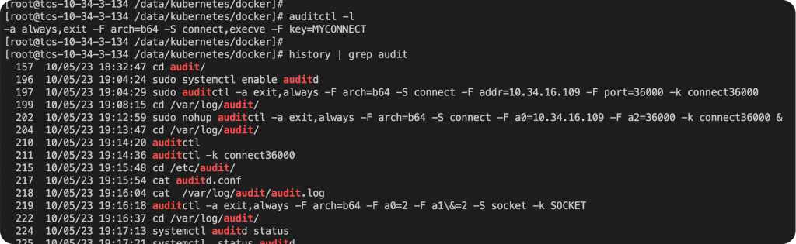
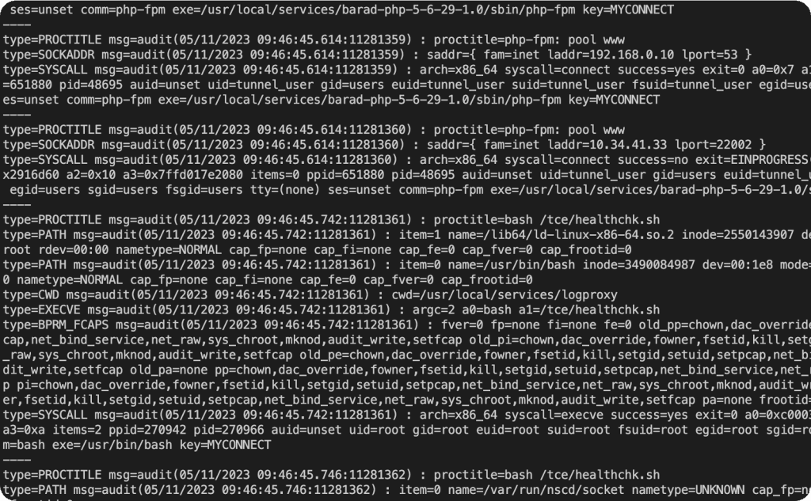
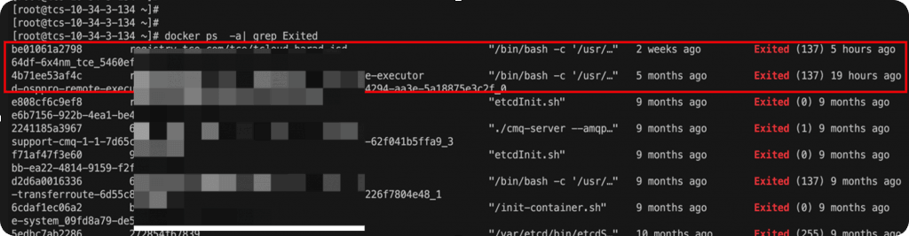
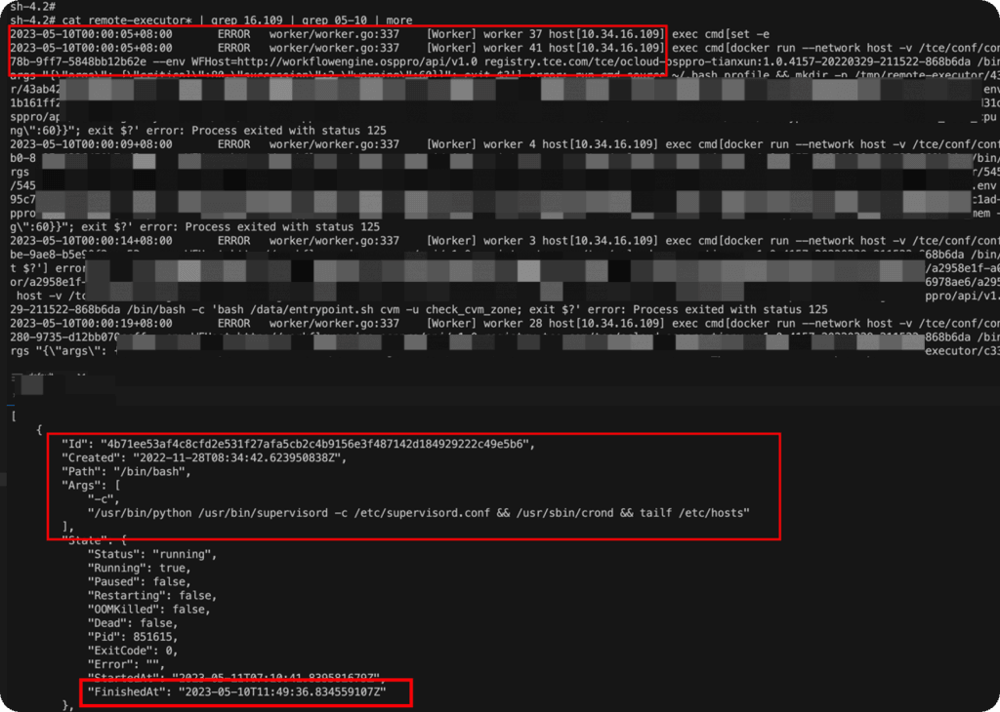

# 应急响应-K8s 异常 ssh 登录排查 – Zgao's blog

### 应急响应-K8s 异常 ssh 登录排查

作者 [Zgao](https://zgao.top/author/zgao/)

> 某内网 k8s 集群主机安全告警存在 ssh 爆破成功的记录，上机排查发现该主机存在长达几个月的异常 ssh 登录，每天固定凌晨 0 点 -4 点出现 ssh 登录记录，并且同一个 ip 的 ssh 登录失败和成功的记录交叉出现。

初步判定这是一起非入侵导致的应急事件，但是该如何定位 k8s 容器出现异常 ssh 登录的原因呢？

## 定位异常记录最早出现时间



通过查询日志找到最早的异常 ip 的 ssh 登录失败的记录，定位到第一次出现时间为 3 月 29 日 0 点。对应的 ip 是一台 k8s 集群的 node 节点，上面运行全部的是容器服务。因此排查的方向从 主机 –> 容器。

## 查找对应时间新创建的容器和文件变动

查找 3 月 29 号 k8s 主机上的文件变动。

```plain
find / -newermt "2023-03-28" ! -newermt "2023-03-30" -type f -exec ls -lh {} \;
```



可以看到确实是有文件变动，很有可能是在 3 月 29 号这天，新起的容器服务导致 ssh 登录异常。查找 3 月 29 号创建的容器。

```plain
 docker ps -a --no-trunc -q | xargs docker inspect --format '{{ .Name }}: Created {{ .Created }}' | grep "2023-03"
```



需要注意，docker 的时间通常是 utc 时间转换 cst 时间还需要 +8 小时。

这里与猜测不符，所以并非是在 3 月 29 号附近的新创建的容器导致的异常。

## auditd 审计网络请求和命令



k8s 的容器数量众多，一台主机运行几百个容器，逐个排查效率太低。既然确定异常 ssh 的登录记录在每天凌晨会固定出现。所以直接开启 auditd 进行网络请求和命令的审计。命令如下：

```plain
auditctl -a always,exit -F arch=b64 -S connect,execve -F key=MYCONNECT
```

然后就是等第二天收审计的结果。



但正常情况下，audit 必定能抓取到网络请求的进程，但是在 audit 审计的日志中未能发现在 0 点 -4 点之间异常的 ssh 网络请求信息。

因此，推测在 0 点前必定有容器异常退出或者容器服务挂掉了。



查看所有退出的容器，从异常退出的容器信息可推断只有 k8s\_ocloud-osppro-remote-executor\_ocloud-osppro-remote-executor 容器符合时间要求。

从容器的命令可判断是一台远程执行命令的容器，重新启动该容器并进入查看容器的日志信息。



进入该容器查找服务器日志，发现下发命令的时间与 ssh 报错的时间和次数完全一致，确实是该容器的服务下发命令导致 ssh 登录异常。

Post Views: 254
