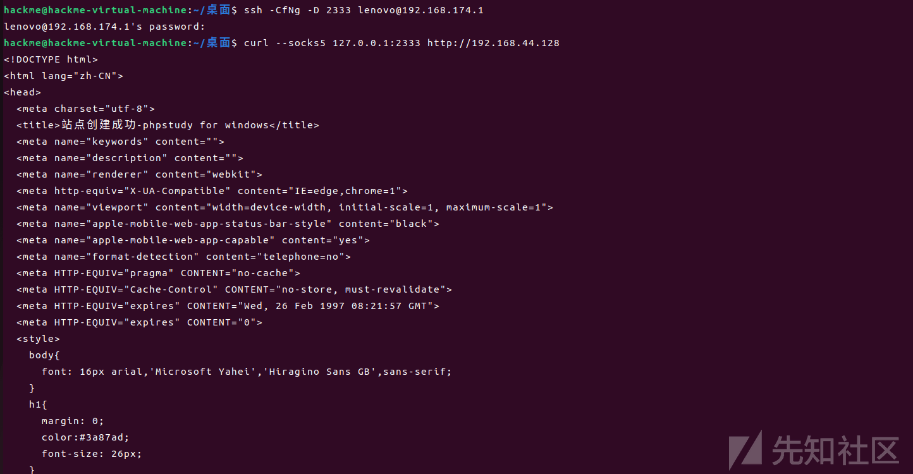
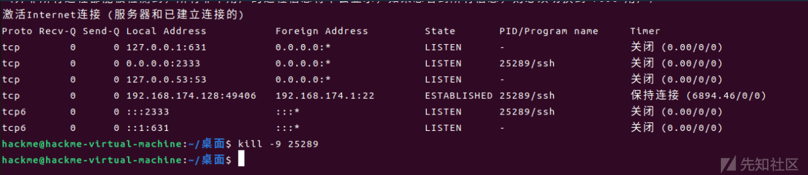
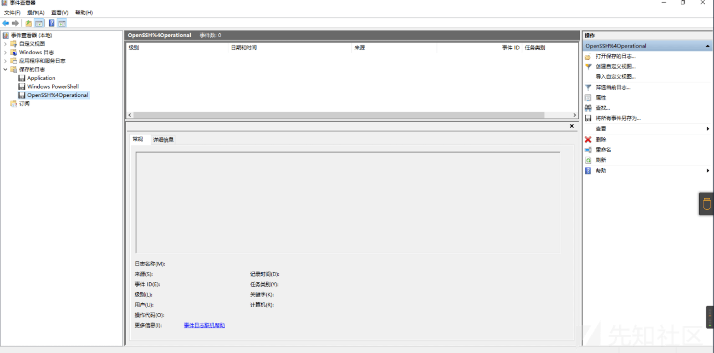
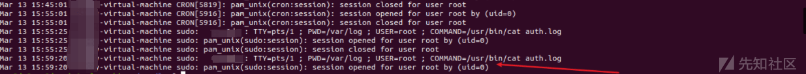
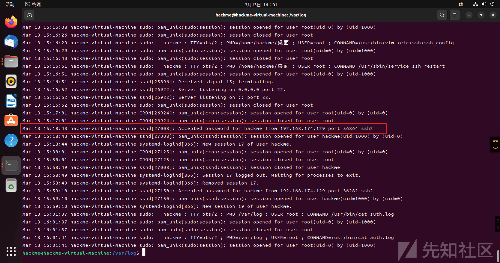
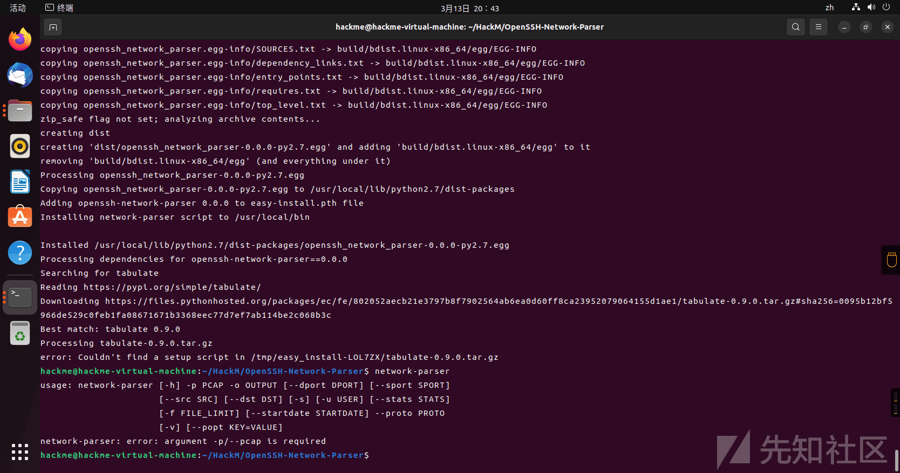
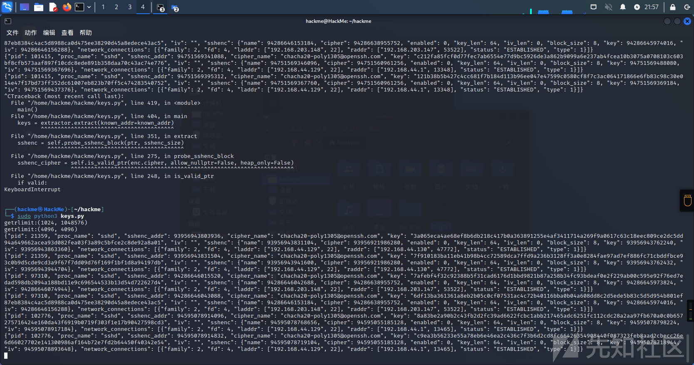

应急响应-隧道篇

- - -

# 应急响应-隧道篇

ssh命令：

-   \-C：压缩传输，提高传输速度
-   \-f：将ssh传输转入后台执行，不占用当前的shell
-   \-N：静默连接，连接后看不到具体会话
-   \-g：允许远程主机连接本地用于转发的端口
-   \-L：本地端口转发
-   \-R：远程端口转发
-   \-D：动态转发（SOCKS 代理）
-   \-p：指定ssh端口

### Windows下环境搭建

```plain
攻击机：Ubuntu22.04 | 192.168.174.128
跳板机：Windows11 | 192.168.174.1/192.168.44.1
目标机：win10 | 192.168.44.128
```

在应用-可选功能里安装openssh服务器

[](https://xzfile.aliyuncs.com/media/upload/picture/20240301150732-5f6a8ce2-d79a-1.png)

之后启动：`Start-Service sshd`

可以连接了，Windows 服务端配置完成

[](https://xzfile.aliyuncs.com/media/upload/picture/20240301150801-70a94174-d79a-1.png)

本地转发：在攻击机(192.168.174.128)执行：也就是主动连接

```plain
ssh -Cg -L 2333(攻击机端口):192.168.44.128(目标机ip):3389(目标端口) lenovo@192.168.174.1(跳板机)
```

[](https://xzfile.aliyuncs.com/media/upload/picture/20240301150840-88041fb0-d79a-1.png)

远程转发：

```plain
ssh -CfNg -R 2333(攻击机端口):192.168.44.128(目标机ip):3389(目标端口) hackme@192.168.174.128(攻击机)
```

动态转发：其实就是建立一个ssh加密的SOCKS代理通道

```plain
ssh -CfNg -D 2333 lenovo@192.168.174.1(跳板机)
```

[](https://xzfile.aliyuncs.com/media/upload/picture/20240301150849-8d8be1f2-d79a-1.png)

跳板机和目标机之间的流量是无加密的，直接HTTP传输

[](https://xzfile.aliyuncs.com/media/upload/picture/20240301150903-959ce5bc-d79a-1.png)

断开的时候kill掉进程就好

[](https://xzfile.aliyuncs.com/media/upload/picture/20240301150916-9dd316b6-d79a-1.png)

### Windows应急响应

首先看跳板机(192.168.174.1/192.168.44.1)的日志：OpenSSH/Operational，可以看到只有正常的跳板机与攻击机的连接记录，包括ip和端口，并不会记录具体执行的命令和返回结果

[](https://xzfile.aliyuncs.com/media/upload/picture/20240301150928-a50b626c-d79a-1.png)

再看跳板机的网络连接：细看这两个连接的pid，都是ssh的服务，这就属于是明显特征了

`netstat -ano | find "ESTABLISHED"`

[](https://xzfile.aliyuncs.com/media/upload/picture/20240301150940-abd86dec-d79a-1.png)

再来看目标机win10(192.168.44.128)：没有留下ssh日志，是空的(因为我是22端口转到了3389)

[](https://xzfile.aliyuncs.com/media/upload/picture/20240301150951-b265c268-d79a-1.png)

再看rdp相关的日志，首先是Microsoft-Windows-RemoteDesktopServices-RdpCoreTS/Operational，主要记录rdp隧道的链接与关闭，包括rdpcmd、rdplic等，以及连接的ip和端口

[](https://xzfile.aliyuncs.com/media/upload/picture/20240301151005-ba9c1928-d79a-1.png)

Microsoft-Windows-TerminalServices-LocalSessionManager/Operational，记录rdp会话的登录与注销，该日志不记录ip

[](https://xzfile.aliyuncs.com/media/upload/picture/20240301151014-c0325140-d79a-1.png)

再来看通讯：

192.168.174.1/192.168.44.1——192.168.44.128的流量：TPKT协议是一个传输服务协议，它为上层的COPT和下层TCP进行了过渡。RDP协议是基于TPKT的，并没有ssh的协议

[](https://xzfile.aliyuncs.com/media/upload/picture/20240301151019-c3317eac-d79a-1.png)

注意这个rdp流量中的mstshash=hackme，是攻击机(192.168.174.128)的用户id，一个溯源小技巧

[](https://xzfile.aliyuncs.com/media/upload/picture/20240301151052-d72b0b8a-d79a-1.png)

192.168.174.128——192.168.174.1/192.168.44.1的流量：很明显的ssh流量

[](https://xzfile.aliyuncs.com/media/upload/picture/20240301151038-ce5a768a-d79a-1.png)

综上是容易找到异常的地方主要还是跳板机(192.168.174.1/192.168.44.1)的ssh日志(不明ip连接)、网络连接(监听转发式的连接)、流量(不明ip和mstshash)，在没有流量的情况下发现隧道还是蛮难的。

### Linux下环境搭建

```plain
攻击机：Ubuntu22.04 | 192.168.174.128
跳板机：ubuntu20.04 | 192.168.44.130/192.168.174.129
目标机：kali | 192.168.44.129
```

设置个远程转发

```plain
ssh -CfNg -R 2333(攻击机端口):192.168.44.129(目标机ip):22(目标端口) hackme@192.168.174.128(攻击机)
```

[](https://xzfile.aliyuncs.com/media/upload/picture/20240301151120-e79cd336-d79a-1.png)

攻击机执行：

```plain
ssh hackme@127.0.0.1 -p 2333
```

[](https://xzfile.aliyuncs.com/media/upload/picture/20240301151133-ef92c49c-d79a-1.png)

### Linux应急响应

想比Windows，Linux的好处是日志记得全

一样的网络连接

[](https://xzfile.aliyuncs.com/media/upload/picture/20240301151148-f80fdc5e-d79a-1.png)

我们可以比较方便的看进程，跳板机：

```plain
~/桌面$ pstree -agplU | grep ssh
  │   │   │   │   ├─ssh-agent,4661,4661 /usr/bin/im-launch env GNOME_SHELL_SESSION_MODE=ubuntu /usr/bin/gnome-session --systemd --session=ubuntu
  │   ├─ssh-agent,5687,4425 -D -a /run/user/1000/keyring/.ssh
  ├─sshd,1061,1061
  │   │   │   ├─grep,5712,5711 --color=auto ssh
  │   ├─ssh,5688,5688 -CfNg -R 2333:192.168.44.129:22 hackme@192.168.174.128
~/桌面$
```

可以看到有反向连接的命令，然后看看auth.log

[](https://xzfile.aliyuncs.com/media/upload/picture/20240301151731-c4865182-d79b-1.png)

发现并没有ssh登录相关的，只有我打开auth日志的记录，也就是通过远程隧道转发不会留下相关的ssh日志，因为认证发生在攻击机上，看一眼攻击机。

如果这里用的是本地转发，日志就会留在跳板机上了，并且进程也会因为sshd子进程较多、网络连接本地转发而被发现（正常是不可能有本地转发的ssh），唯一的优势是不会留下history和登录日志。攻击机的截图：

[](https://xzfile.aliyuncs.com/media/upload/picture/20240301151236-14b3a48a-d79b-1.png)

[](https://xzfile.aliyuncs.com/media/upload/picture/20240301151243-19285178-d79b-1.png)

也可以直接看目标机，但是看起来是正常的

```plain
┌──(hackme㉿HackMe)-[/etc/ssh]
└─$ pstree -agplU | grep ssh
  │   │   │   ├─ssh-agent,1193,1193 x-session-manager
  │   │   ├─grep,11707,11706 --color=auto ssh
  ├─sshd,4870,4870
  │   └─sshd,10587,10587
  │       └─sshd,10605,10587
┌──(hackme㉿HackMe)-[/etc/ssh]
└─$ sudo lsof -p 10587 | grep ESTABLISHED
lsof: WARNING: can't stat() fuse.gvfsd-fuse file system /run/user/1000/gvfs
      Output information may be incomplete.
sshd    10587 root    4u  IPv4              42854      0t0     TCP 192.168.44.129:ssh->192.168.44.130:42260 (ESTABLISHED)
```

但是远程转发时，目标机的history里会记录在攻击机连接时执行过的命令，同样last日志也会留下登录日志，就是登录的是跳板机的ip

[](https://xzfile.aliyuncs.com/media/upload/picture/20240301151255-205fc4f8-d79b-1.png)

### SSH流量分析

在openssh版本比较高之后，流量中就没有秘钥、iv这些值了，需要在内存中找。负责发送和接收NEWKEYS帧的函数中有一个ssh结构体，里面有一个session\_state，依次保存着与当前SSH会话有关的所有信息，其中有一个newkeys，储存着加密、mac和压缩算法有关的信息。最后可以找到包含cipher，密钥，IV和分块长度的sshenc结构体，下面是一个SSH流量解析器，安装坑很多：

```plain
git clone https://github.com/fox-it/OpenSSH-Network-Parser.git
```

打开setup.py，有一行 setup\_requires=\['setuptools\_scm'\],删掉

[](https://xzfile.aliyuncs.com/media/upload/picture/20240301151306-26eb5512-d79b-1.png)

之后一步一步来

```plain
pip2 install dissect.cstruct==1.0.0
pip2 install psutil
pip2 install tabulate
pip2 install libnacl
pip2 install cryptography
sudo apt-get install python2.7-dev
下载https://files.pythonhosted.org/packages/ec/a0/6bc3a7aa5945ac26ff44775cd2df59fc89904392715aaa2af78065af0806/gevent-1.2.0-cp27-cp27mu-manylinux1_x86_64.whl
pip2 install gevent-1.2.0-cp27-cp27mu-manylinux1_x86_64.whl
git clone https://github.com/MITRECND/pynids
cd pynids/dist/
tar zxvf pynids-0.6.2.tar.gz
sudo apt-get install libnet-dev
sudo apt-get install libpcap-dev
sudo apt-get install libnids-dev
cd pynids-0.6.2/
sudo python2 setup.py install
cd OpenSSH-Network-Parser
sudo python2 setup.py install
```

成功安装network-parser

[](https://xzfile.aliyuncs.com/media/upload/picture/20240301151327-335bc264-d79b-1.png)

在之后

```plain
git clone https://github.com/fox-it/OpenSSH-Session-Key-Recovery.git
sudo apt-get install python3-ptrace
python3 key.py
```

这个OpenSSH-Session-Key-Recovery将每个sshenc结构打印出来，简单的说就是在内存中取出ssh的秘钥。可以直接在机子里跑，也可以配合vol进行内存取证，注意这里用不了python2，似乎是python2版本的ptrace有些问题，所以用python3代替

[](https://xzfile.aliyuncs.com/media/upload/picture/20240301151339-3a61eb88-d79b-1.png)

虽然iv是0，但是无伤大雅，最多有一点乱码

```plain
{"pid": 21359, "proc_name": "sshd", "sshenc_addr": 93956943803936, "cipher_name": "chacha20-poly1305@openssh.com", "key": "3a065eca4ae68ef8b6db218c417b0a363891255e4af3411714a269f9a0617c63c18eec809ce2dc5dd94a649662acea93d082fea03f3a89c5bfce2c8de92a8a01", "iv": "", "sshenc": {"name": 93956943831104, "cipher": 93956921986280, "enabled": 0, "key_len": 64, "iv_len": 0, "block_size": 8, "key": 93956943762240, "iv": 93956943863360}, "network_connections": [{"family": 2, "fd": 4, "laddr": ["192.168.44.129", 22], "raddr": ["192.168.44.130", 47772], "status": "ESTABLISHED", "type": 1}]}
{"pid": 21359, "proc_name": "sshd", "sshenc_addr": 93956943831504, "cipher_name": "chacha20-poly1305@openssh.com", "key": "7f910183ba11eb41b98b4cc72589dca7ffd9a236b3128ff3a0e8284fae97ad7ef886fc71cbddfbce93c0b9d5cde9cd3a9f67f7dd09d76f169f1bf1d8a94197db", "iv": "", "sshenc": {"name": 93956943941600, "cipher": 93956921986280, "enabled": 0, "key_len": 64, "iv_len": 0, "block_size": 8, "key": 93956943762432, "iv": 93956943944704}, "network_connections": [{"family": 2, "fd": 4, "laddr": ["192.168.44.129", 22], "raddr": ["192.168.44.130", 47772], "status": "ESTABLISHED", "type": 1}]}
{"pid": 97310, "proc_name": "sshd", "sshenc_addr": 94286646015520, "cipher_name": "chacha20-poly1305@openssh.com", "key": "7afebf4f32c92388b5f31cad6176d1bbd9821b87a258b34fc93bdeaf0e2f229ab00c595e92f76ed7edad598db2094a188bd11e9c696544533b13d54d722627d4", "iv": "", "sshenc": {"name": 94286646042688, "cipher": 94286638955752, "enabled": 0, "key_len": 64, "iv_len": 0, "block_size": 8, "key": 94286645973824, "iv": 94286646074944}, "network_connections": [{"family": 2, "fd": 4, "laddr": ["192.168.203.148", 22], "raddr": ["192.168.203.147", 53522], "status": "ESTABLISHED", "type": 1}]}
{"pid": 97310, "proc_name": "sshd", "sshenc_addr": 94286646043088, "cipher_name": "chacha20-poly1305@openssh.com", "key": "6df13ba361361a8eb2b05c0cf07531ac4c72b40116bba0b04a608dd8c2d5ede5b83c5d5d954b801ef87eb8384c4ac5d8988ca0d475ee38290d45a8edece43ac5", "iv": "", "sshenc": {"name": 94286646153184, "cipher": 94286638955752, "enabled": 0, "key_len": 64, "iv_len": 0, "block_size": 8, "key": 94286645974016, "iv": 94286646156288}, "network_connections": [{"family": 2, "fd": 4, "laddr": ["192.168.203.148", 22], "raddr": ["192.168.203.147", 53522], "status": "ESTABLISHED", "type": 1}]}
{"pid": 102776, "proc_name": "sshd", "sshenc_addr": 94595078914096, "cipher_name": "chacha20-poly1305@openssh.com", "key": "8a83be2a90b2c43fb2d2fc39ad6622fcbc1abb217465adc6251fc112cdc28a2aa97fb670a0c0b657275716424e160da43f6919b0719f303f1e17b90427598cd3", "iv": "", "sshenc": {"name": 94595078768656, "cipher": 94595055185128, "enabled": 0, "key_len": 64, "iv_len": 0, "block_size": 8, "key": 94595078798224, "iv": 94595078917184}, "network_connections": [{"family": 2, "fd": 4, "laddr": ["192.168.44.129", 22], "raddr": ["192.168.44.1", 13465], "status": "ESTABLISHED", "type": 1}]}
{"pid": 102776, "proc_name": "sshd", "sshenc_addr": 94595078914832, "cipher_name": "chacha20-poly1305@openssh.com", "key": "c9ea3b56233e55a78eb6e46ea2c436c7f3b6d2cd8fc66426354908440f087323feb8aad2cbecc26e6d66027702e141300986af164b72e7fd2b64450f40342e54", "iv": "", "sshenc": {"name": 94595078719104, "cipher": 94595055185128, "enabled": 0, "key_len": 64, "iv_len": 0, "block_size": 8, "key": 94595078718944, "iv": 94595078893648}, "network_connections": [{"family": 2, "fd": 4, "laddr": ["192.168.44.129", 22], "raddr": ["192.168.44.1", 13465], "status": "ESTABLISHED", "type": 1}]}
```

全部复制到/OpenSSH-Network-Parser/example/keys.json中，另一边执行一个cat flag

[](https://xzfile.aliyuncs.com/media/upload/picture/20240301151352-41f3637c-d79b-1.png)

之后保存抓取的流量，放在该目录下，执行example.sh，在tmp/ssh中看解密后的ssh流量，成功解密

[](https://xzfile.aliyuncs.com/media/upload/picture/20240301151417-512a11f6-d79b-1.png)
