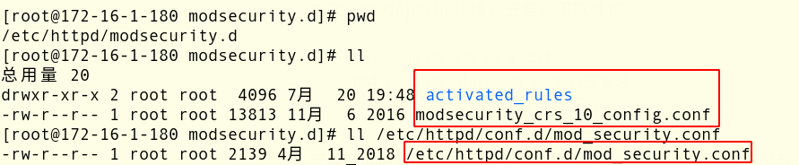

# [开源 WAF ModSecurity](https://www.raingray.com/archives/2766.html)

WAF 分类：

1.  硬件 WAF
2.  云 WAF
3.  开源 WAF
4.  软件 WAF

下面使用 Apache / Nginx 进行搭建。

## 目录

-   [目录](#%E7%9B%AE%E5%BD%95)
-   [Apache](#Apache)
-   [Nginx](#Nginx)
-   [问题](#%E9%97%AE%E9%A2%98)
-   [参考链接](#%E5%8F%82%E8%80%83%E9%93%BE%E6%8E%A5)

## Apache

**测试时可别忘了开放 80 端口，该死的防火墙浪费我不少时间！！！**

ModeSecurity 处理请求的几个阶段，至于触发规则后如何处理。

-   检测请求头 (Phase1)
-   检测请求体 (Phase2)
-   检测响应头 (Phase3)
-   检测响应体 (Phase4)
-   日志记录 (Phase5)

让规则不检测 GET/POST两种方式提交的参数。

```plaintext
!ARGS:参数名
```

modsecurity 默认是作为 Apache 组件存在的，同时支持多种环境 (IIS/NGINX/APACHE)。本次测试为 Apache 环境，安装以下软件包。

```plaintext
mod_security.x86_64 # 本体
mod_security-mlogc.x86_64 # 日志管理
mod_security_crs.noarch # 匹配规则
```

安装完成后在 `/etc/httpd` 下会多出一个 `modsecurity.d` 目录，它是规则配置目录，其中`activated_rules`目录下的文件是已启用的规则 `modsecurity_crs_10_config.conf`。`/etc/httpd/conf.d/mod_security.conf` 是 WAF 主配置文件。



`mod_security.conf` 解释

```plaintext
SecRuleEngine On # 总开关默认开启,其他选项：Off/DetectionOnly(只是检测并不拦截)。
SecRequestBodyAccess On # 检测请求中Body内容。
SecResponseBodyAccess Off # 是否检测返回包内容。
```

`SecAuditLogParts ABIJDEFHZ` 对应着日志属性

| 日志属性 | 参数说明 |
| --- | --- |
| A   | 审计日志头 |
| B   | 请求头 |
| C   | 请求 Body |
| D   | 保留  |
| E   | 响应 Body |
| F   | 响应头 |
| G   | 保留  |
| H   | 审计标记，包含额外审计会话数据 |
| I   | 保留  |
| J   | 保留  |
| K   | 所匹配的规则集合 |
| Z   | 终结标记 |

`modsecurity_crs_10_config.conf` 解释

`modsecurity` 有两种模式

-   第一个模式是匹配到恶意数据就直接拦截 (拦截模式)。
-   第二个模式是匹配到恶意数据，先计算它的分数，到达指定值才拦下来 (计算模式)。

在 SecDefaultAction 中的第二个值为 `deny` 则启用拦截模式 (默认值)，为 `pass` 则启用计算模式。

```plaintext
SecDefaultAction "phase:1,deny,log" # Self-Contained(拦截模式)
SecDefaultAction "phase:1,pass,log" # Collaborative Detection(计算模式)
```

对分数限制进行设置，其中 `inbound_anomaly_score_level` 是对入站分数进行设置。光设置完分数还不行还得启用模式，设置方法是将 900004 规则取消注释。要想配置生效，每次更改配置文件后还需重启 httpd 才行。

```plaintext
SecAction \
  "id:'900003', \
  phase:1, \
  t:none, \
  setvar:tx.inbound_anomaly_score_level=5, \
  setvar:tx.outbound_anomaly_score_level=4, \
  nolog, \
  pass"

SecAction \
  "id:'900004', \
  phase:1, \
  t:none, \
  setvar:tx.anomaly_score_blocking=on, \
  nolog, \
  pass"
```

生产环境中取上 WAF 需要注意的地方，在测试环境中去使用正常功能，观察分数最大和最小值，取一个合适的分值。接着使用攻击 Payload 跑一下看看结果，拦不住 Payload 就接着去设置一个合适的分数。

最后为了减小影响尝试上线一台服务器，将 WAF 引擎模式调为 `DetectionOnly` 只记录不拦截，去观察真实用户点击产生的分值最后确定合适的分数，将 WAF 引擎模式调成 `On` 正式上线，如果效果不错慢慢上线更多机器 (灰度发布)。

我个人感觉这个 WAF 只适合业务场景不复杂的时候使用 (比如一到两个站点)，当业务都聚集在一起，它起到的收益就不大了，因为每个站点 WAF 规则都相当于定制化 (调试成本过高)。

此规则用来设置允许使用的请求方法、请求资源的类型、允许使用的 HTTP 版本以及限制的扩展名，当使用了不在范围中的值，而你设置的模式是 `deny` 将被阻止访问。

```plaintext
SecAction \
  "id:'900012', \
  phase:1, \
  t:none, \
  setvar:'tx.allowed_methods=GET HEAD POST OPTIONS', \
  setvar:'tx.allowed_request_content_type=application/x-www-form-urlencoded|multipart/form-data|text/xml|application/xml|application/x-amf|application/json', \
  setvar:'tx.allowed_http_versions=HTTP/0.9 HTTP/1.0 HTTP/1.1', \
  setvar:'tx.restricted_extensions=.asa/ .asax/ .ascx/ .axd/ .backup/ .bak/ .bat/ .cdx/ .cer/ .cfg/ .cmd/ .com/ .config/ .conf/ .cs/ .csproj/ .csr/ .dat/ .db/ .dbf/ .dll/ .dos/ .htr/ .htw/ .ida/ .idc/ .idq/ .inc/ .ini/ .key/ .licx/ .lnk/ .log/ .mdb/ .old/ .pass/ .pdb/ .pol/ .printer/ .pwd/ .resources/ .resx/ .sql/ .sys/ .vb/ .vbs/ .vbproj/ .vsdisco/ .webinfo/ .xsd/ .xsx/', \
  setvar:'tx.restricted_headers=/Proxy-Connection/ /Lock-Token/ /Content-Range/ /Translate/ /via/ /if/', \
  nolog, \
  pass"
```

这条规则将 `192.168.1.100` 添加到白名单中，不拦截这台主机的 Payload，只记录哪些规则匹配到了。

```plaintext
SecRule REMOTE_ADDR "@ipMatch 192.168.1.100" \
  "id:'900005', \
  phase:1, \
  t:none, \
  ctl:ruleEngine=DetectionOnly, \
  setvar:tx.regression_testing=1, \
  nolog, \
  pass"
```

在一个大规模的网络同步环境下，批量管理上千台 Web 服务器的情况下，当防护策略发生变化，规则的同步将会是很麻烦的事情，在运维团队给力的情况下，可以通过内部的 gitlab 与 Jenkins 的整合进行规则同步。

## Nginx

第一种做法是让所有数据走反代过滤一遍，谁让不支持 Tomcat 呢，也可单用于 LNMP 这种架构。

官方称 3.x 规则比 2.x 在默认安装的情况下误报减少 90%。

`Libmodsecurity` 库用作 ModSecurity 接口的接口，用于接收 Web 流量并交给 `ModSecurity` 处理。

1.安装 `libModSecurity`

```plaintext
# 安装依赖
yum install gcc-c++ flex bison yajl yajl-devel curl-devel curl GeoIP-devel doxygen zlib-devel lmdb lmdb-devel libxml2 libxml2-devel ssdeep ssdeep-devel lua lua-devel

# 安装ModeSecurity
git clone --depth 1 -b v3/master --single-branch https://github.com/SpiderLabs/ModSecurity
cd ModSecurity
git submodule init
git submodule update
sh build.sh
./configure 
make 
make install
```

2.安装 `ModSecurity-nginx`

```plaintext
# 下载ModSecurity-Nginx
git clone https://github.com/SpiderLabs/ModSecurity-nginx
```

将 ModSecurity-nginx 作为 [tengine](http://tengine.taobao.org/download.html) 模块安装。

```plaintext
tar -xzvf tengine-2.3.1.tar.gz # 解压tengine
./configure --prefix=/usr/local/nginx --conf-path=/etc/nginx/nginx.conf --add-module=/usr/local/src/ModSecurity-nginx  # 作为模块安装(这里填源码路径)
make && make install
```

复制 ModSecurity 主配置文件到 Nginx 配置文件目录中。

```plaintext
cp modsecurity.conf-recommended /etc/nginx/modsecurity.conf
```

下载[规则](https://modsecurity.org/crs/)，并将规则文件目录复制到 Nginx 配置文件目录中。使用 `util/upgrade.py` 可以同步 github 最新规则，目录中有份 `INSTALL` 文件是[安装手册](https://raw.githubusercontent.com/SpiderLabs/owasp-modsecurity-crs/v3.1/dev/INSTALL)，非常详细。

```plaintext
cd /etc/nginx && git clone https://github.com/SpiderLabs/owasp-modsecurity-crs.git # 下载规则
cd owasp-modsecurity-crs && cp crs-setup.conf.example  crs-setup.conf # 将配置文件正确命名
```

4.编辑 `modsecurity.conf` 配置文件，把规则文件包含进来。

```plaintext
SecRuleEngine DetectionOnly # 设置为 On，前面说过 DetectionOnly 只做记录并不拦截。
Include owasp-modsecurity-crs/crs-setup.conf
Include owasp-modsecurity-crs/rules/*.conf
```

取消以下规则注释，900000 设置拦截等级，等级越高误报越高，900100 用来设置威胁等级的默认分数，900110 用来设置入站出站分数 (达到分数就出发拦截)。

```plaintext
SecAction \
  "id:900000,\
   phase:1,\
   nolog,\
   pass,\
   t:none,\
   setvar:tx.paranoia_level=1"

SecAction \
 "id:900100,\
  phase:1,\
  nolog,\
  pass,\
  t:none,\
  setvar:tx.critical_anomaly_score=5,\
  setvar:tx.error_anomaly_score=4,\
  setvar:tx.warning_anomaly_score=3,\
  setvar:tx.notice_anomaly_score=2"

SecAction \
 "id:900110,\
  phase:1,\
  nolog,\
  pass,\
  t:none,\
  setvar:tx.inbound_anomaly_score_threshold=5,\
  setvar:tx.outbound_anomaly_score_threshold=4"
```

5.对 Nginx 配置文件做[设置](https://github.com/SpiderLabs/ModSecurity-nginx)。整个设置完成使用 `nginx -t` 检查语法，最后重启 Nginx。

```plaintext
httpd {
    ...
    server {
        ...
        location / {
            #开启modsecurity
            modsecurity on;
            #这里填modsecurity主配置文件
            modsecurity_rules_file /etc/nginx/modsecurity.conf;
        }
        ...
    }
}
```

## 问题

规则如果更新会覆盖掉源规则吗

Apache 怎么安装 3.0 规则 (2.0 误报过高)

## 参考链接

-   [官方文档](https://github.com/SpiderLabs/ModSecurity/wiki)
-   [Including OWASP ModSecurity Core Rule Set](https://www.netnea.com/cms/apache-tutorial-7_including-modsecurity-core-rules)，Apache ModSecurity 规则处理
-   [Apache / ModSecurity Tutorials](https://www.netnea.com/cms/apache-tutorials/)，Apache ModSecurity 系列教程
-   [安全建设之 WAF 防御](https://l0gs.xf0rk.space/2018/12/21/step-into-modsecurity)
-   [编译安装 modsecurity](https://www.hi-linux.com/posts/45920.html#%E7%BC%96%E8%AF%91%E5%AE%89%E8%A3%85modsecurity)
-   [NGINX / ModSecurity Tutorials](https://www.netnea.com/cms/nginx-modsecurity-tutorials/)
-   [nginx 下安装配置 modsecurity waf 防火墙（附完整编译、配置、排错、详细规则）](http://f2ex.cn/nginx-installed-configuration-modsecurity-waf)

最近更新：2023 年 04 月 09 日 20:25:05

发布时间：2020 年 03 月 07 日 23:25:00
