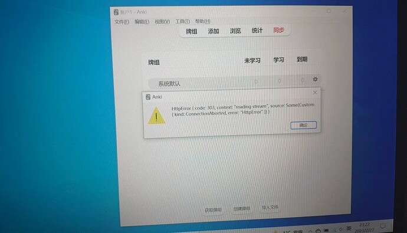

# 当我尝试同步时，得到 HTTPError（）代码：303- Anki 桌面 - Anki 论坛 --- Get HTTPError() code:303 when I try to sync - Anki Desktop - Anki Forums

​

Welcome! This is a place to discuss Anki, and ask any questions you may have. Before asking a question, please see [these instructions](https://faqs.ankiweb.net/getting-help.html).  
欢迎您的到来！这是一个讨论 Anki 的地方，并提出任何问题，你可能有。在提问之前，请先查看这些说明。

# 

[↓↓↓](https://forums.ankiweb.net/t/get-httperror-code-303-when-i-try-to-sync/27964)  
  
Get HTTPError() code:303 when I try to sync  
获取 HTTPError（）代码：303 当我尝试同步  
  
[↑↑↑](https://forums.ankiweb.net/t/get-httperror-code-303-when-i-try-to-sync/27964)

[Anki Desktop Anki 桌面](https://forums.ankiweb.net/c/anki-desktop/9)

Feb 2023 二〇二三年二月

1 / 6

Mar 2023 二〇二三年二月

Mar 2023 二〇二三年三月

[↓↓↓](https://forums.ankiweb.net/u/Habey)  
  
Habey  哈贝  
  
[↑↑↑](https://forums.ankiweb.net/u/Habey)

[Feb 2023 二〇二三年二月](https://forums.ankiweb.net/t/get-httperror-code-303-when-i-try-to-sync/27964 "Post date")

[↓↓↓](https://global.discourse-cdn.com/business7/uploads/anki2/original/2X/1/117cecb39ab7c9d1788e8c2a7b7bfd85860b8de8.jpeg "6df6499894a4c549333b07a36f84a9b")  
  

6df6499894a4c549333b07a36f84a9b1200×687 131 KB

  
  
[↑↑↑](https://global.discourse-cdn.com/business7/uploads/anki2/original/2X/1/117cecb39ab7c9d1788e8c2a7b7bfd85860b8de8.jpeg "6df6499894a4c549333b07a36f84a9b")

  
How can I solve it?  
我该怎么解决呢？

​

-   #### created 创建
    
     Feb 2023    2023 年 2 月
    
-   #### [last reply 最后答复](https://forums.ankiweb.net/t/get-httperror-code-303-when-i-try-to-sync/27964/6)
    
    [↓↓↓](https://forums.ankiweb.net/t/get-httperror-code-303-when-i-try-to-sync/27964/6)  
      
      
      
    [↑↑↑](https://forums.ankiweb.net/t/get-httperror-code-303-when-i-try-to-sync/27964/6)
    
     Mar 2023    2023 年 3 月
    
-   5
    
    #### replies 答复
    
-   324
    
    #### views 查看
    
-   3
    
    #### users 用户
    
-    3
    
    
    
    
    

[↓↓↓](https://forums.ankiweb.net/u/NameLessGO)  
  
NameLessGO  无名称 GO  
  
[↑↑↑](https://forums.ankiweb.net/u/NameLessGO)

[Feb 2023 二〇二三年二月](https://forums.ankiweb.net/t/get-httperror-code-303-when-i-try-to-sync/27964/2 "Post date")

Could you try [Antivirus/firewall software 6](https://docs.ankiweb.net/platform/windows/startup-issues.html#antivirusfirewall-software)  
您可以试用防病毒/防火墙软件 6 吗

if it fails, then will need to wait for a dev/user to help  
如果失败，则需要等待开发人员/用户的帮助

1 Reply

[dae](https://forums.ankiweb.net/u/dae)

[Feb 2023 二〇二三年二月](https://forums.ankiweb.net/t/get-httperror-code-303-when-i-try-to-sync/27964/3 "Post date")

This may be caused by an unreliable internet connection or firewall. If you have access to a VPN, syncing via the VPN may help.  
这可能是由不可靠的互联网连接或防火墙造成的。如果您可以访问 VPN，则通过 VPN 进行同步可能会有所帮助。

1 Reply

[↓↓↓](https://forums.ankiweb.net/u/Habey)  
  
Habey  哈贝  
  
[↑↑↑](https://forums.ankiweb.net/u/Habey)

  NameLessGO 无名称 GO

[Feb 2023 二〇二三年二月](https://forums.ankiweb.net/t/get-httperror-code-303-when-i-try-to-sync/27964/4 "Post date")

Thank you, I will try.  
谢谢，我会努力的。

[↓↓↓](https://forums.ankiweb.net/u/Habey)  
  
Habey  哈贝  
  
[↑↑↑](https://forums.ankiweb.net/u/Habey)

  dae

[Feb 2023 二〇二三年二月](https://forums.ankiweb.net/t/get-httperror-code-303-when-i-try-to-sync/27964/5 "Post date")

Thank you! 谢谢你，谢谢

1 month later 1 个月后

Closed on Mar 30, 2023  
2023 年 3 月 30 日关闭

This topic was automatically closed 30 days after the last reply. New replies are no longer allowed.  
此主题在最后一次回复 30 天后自动关闭。不再允许新回复。

Reply

  

### Related Topics 相关主题

| Topic 话题 | Replies 答复 | Views 查看 | Activity 活动 |
| --- | --- | --- | --- |
| [↓↓↓](https://forums.ankiweb.net/t/cant-sync-a-network-error-occured/10326)      Can’t sync - a network error occured   无法同步 - 发生网络错误      [↑↑↑](https://forums.ankiweb.net/t/cant-sync-a-network-error-occured/10326)  [Anki Desktop Anki 桌面](https://forums.ankiweb.net/c/anki-desktop/9) | 5   | 619 | [May 2021 五月 2021](https://forums.ankiweb.net/t/cant-sync-a-network-error-occured/10326/6) |
| [↓↓↓](https://forums.ankiweb.net/t/sync-error-invalid-http-version-parsed/31898)      Sync Error: Invalid HTTP Version Parsed   同步错误：分析的 HTTP 版本无效      [↑↑↑](https://forums.ankiweb.net/t/sync-error-invalid-http-version-parsed/31898)  [Anki Desktop Anki 桌面](https://forums.ankiweb.net/c/anki-desktop/9) | 7   | 285 | [Jul 2023 二〇二三年七月](https://forums.ankiweb.net/t/sync-error-invalid-http-version-parsed/31898/8) |
| [↓↓↓](https://forums.ankiweb.net/t/sync-error-sending-request-for-url/6657)      Sync error sending request for url()   发送 URL（）请求时出现同步错误      [↑↑↑](https://forums.ankiweb.net/t/sync-error-sending-request-for-url/6657)  [Anki Desktop Anki 桌面](https://forums.ankiweb.net/c/anki-desktop/9) | 3   | 1.2k | [Jan 2021 2021 年 1](https://forums.ankiweb.net/t/sync-error-sending-request-for-url/6657/4) |
| [↓↓↓](https://forums.ankiweb.net/t/anki-desktop-unable-to-sync-after-a-laptop-system-reinstalling/17425)      Anki desktop unable to sync after a laptop system reinstalling   Anki 桌面无法同步后，笔记本电脑系统重新安装      [↑↑↑](https://forums.ankiweb.net/t/anki-desktop-unable-to-sync-after-a-laptop-system-reinstalling/17425)  [Anki Desktop Anki 桌面](https://forums.ankiweb.net/c/anki-desktop/9) | 6   | 317 | [Feb 2022 二〇二二年二月](https://forums.ankiweb.net/t/anki-desktop-unable-to-sync-after-a-laptop-system-reinstalling/17425/7) |
| [↓↓↓](https://forums.ankiweb.net/t/error-when-syncing/4119)      Error when syncing  同步时出错      [↑↑↑](https://forums.ankiweb.net/t/error-when-syncing/4119)  [Anki Desktop Anki 桌面](https://forums.ankiweb.net/c/anki-desktop/9) | 3   | 522 | [Oct 2020 二〇二〇年十月](https://forums.ankiweb.net/t/error-when-syncing/4119/4) |
