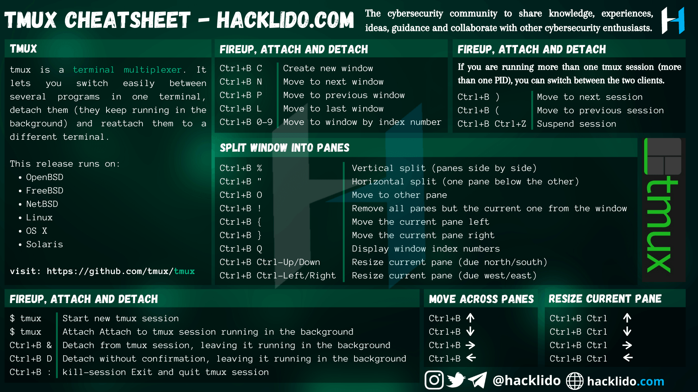

# [快速上手 tmux 终端](https://www.raingray.com/archives/3587.html)

## 目录

-   [目录](#%E7%9B%AE%E5%BD%95)
-   [简介](#%E7%AE%80%E4%BB%8B)
-   [会话操作](#%E4%BC%9A%E8%AF%9D%E6%93%8D%E4%BD%9C)
    -   [会话创建](#%E4%BC%9A%E8%AF%9D%E5%88%9B%E5%BB%BA)
    -   [基本操作](#%E5%9F%BA%E6%9C%AC%E6%93%8D%E4%BD%9C)
-   [窗口操作](#%E7%AA%97%E5%8F%A3%E6%93%8D%E4%BD%9C)
    -   [窗口创建](#%E7%AA%97%E5%8F%A3%E5%88%9B%E5%BB%BA)
    -   [窗口/会话切换](#%E7%AA%97%E5%8F%A3%2F%E4%BC%9A%E8%AF%9D%E5%88%87%E6%8D%A2)
    -   [窗口拆分](#%E7%AA%97%E5%8F%A3%E6%8B%86%E5%88%86)
    -   [窗口关闭](#%E7%AA%97%E5%8F%A3%E5%85%B3%E9%97%AD)
-   [总结](#%E6%80%BB%E7%BB%93)
-   [参考链接](#%E5%8F%82%E8%80%83%E9%93%BE%E6%8E%A5)

## 简介

当你远程通过 SSH 连接到服务器，想在 Shell 中长时间运行一个脚本或命令，当你关闭当前终端重新连上去会发现任务已经结束，因为关闭 Shell 时终端启动的所有进程收到此 SIGHUP 信号结束运行。

此时有两种解决方法，使用 `nohup` 让程序忽略信号放在后台继续运行，比如 `nohup ./test1.sh &`，不过无法实时查看程序在标准输出在屏幕的数据，不是很方便。

而 tmux 很好的解决此问题，对它的一个印象是终端管理器，最深刻的地方是它退出当前 Shell 此进程不会消失，当你重新登录服务器依旧可以进入查看之前程序运行实况。类似的应用还有 secreen。

## 会话操作

### 会话创建

创建会话有几种方式

直接默认就能创建或是用 `tmux new` 也成。

```shell
tmux
```

命名会话，命名为 ReconWork

```shell
tmux new -s ReconWork
```

### 基本操作

进到会话里如何操作 tmux 呢？由命令和快捷键组成，所有快捷键操作遵从前置键加功能键组合。在本文中前置键是 Ctrl + b 都会简写为 C-b，功能键则是按完松开前置键后再按下的键。

比如要在会话内查看帮忙文档，在键盘按前置键 `Ctrl + b`，放开再按功能键 `?` ——在 Shell 中直接运行 `tmux lsk` 也能获得快捷键。

如果你连续按两次 `Ctrl + b` 它会当作命令执行传到会话中。

`tmux ls`，查看当前有哪些会话

返回以下信息，其中 ReconWork 是会话名称，要是创建时没填名字就是数字

```http
ReconWork: 1 windows (createesd Fri Feb 26 13:52:17 2021)
```

`C-b $`，前面创建会话如果没有写名字或是你想改名字，输入后会在下方显示黄色长条提示你修改 session name。

`C-b d`，暂时退出会话回到当前系统 Shell 终端。

`tmux attach -t serssion_name`，进入会话，不加 -t 自动选择上一次使用过的会话，另外 attach 可以简写成 a。如果多人连接到同一会话会怎样？我试了试发现所有操作都会同步时显示，这也是一个协作的好工具。

## 窗口操作

### 窗口创建

`C-b c [command]`，也可以直接建立新窗口。

`C-b :`，准备输入 tumx 命令。  
`neww [-d] [-n] [-t] [command]`，-n 可以对窗口命名（创建后也可用 `C-b ,` 更改窗口名称），比如 -n test，-d 创建是不要切换到新窗口，-t 创建窗口指定一个索引（感觉没啥用，就切换窗口用），command 是说创建窗口顺带执行命令，要是有多个命令可以用分号隔开，像是 `top; echo 123123 > ~/number.txt`。

### 窗口/会话切换

`C-b N`，这个 n 是窗口索引，只能切换个位数索引。  
`C-b s`，显示所有会话和会话下所有窗口，通过↑↓←→箭选择，Enter 键切换。选择的时候时你可以用 `t` 键对会话进行高亮，`x` 键杀死会话/窗口。

### 窗口拆分

拆分相当于新建窗口。

`C-b %`，垂直分割，分割到左右一边一个  
`C-b "`，水平分割，分割上下各一个

分割后如何切换到分割的窗口？

`C-b q N`，切换窗口通过窗口编号切换，编号 N 通过 `C-b q` 查看，在数字显示的过程中顺便按 N 切换到指定窗口。  
`C-b <Up|Down|Left|Right>`，通过 ↓↑→← 来切换，在窗口比较少的时候好用。

`C-b C-<Up|Down|Left|Right>`，调整窗口大小。  
`C-b z`，开了一堆窗口，尺寸还很小，先将其他窗口暂时最小化，重新输入 `C-b z` 恢复。

### 窗口关闭

`C-b x`，会提示要不要关闭窗口，或者输入 exit 一样的。

## 总结

最后为你总结下在 `tmux` 存活下基本操作。

创建会话。

```plaintext
tmux new -s ReconWork
```

或是建立默认会话。

```plaintext
tmux
```

暂时离开会话回到系统 Shell。

```plaintext
C-b d
```

进入会话。

```plaintext
tmux a -t SessionName
```

也可直接进入最近一次操作过的会话。

```plaintext
tmux a
```



## 参考链接

-   [https://github.com/tmux/tmux/wiki/Getting-Started](https://github.com/tmux/tmux/wiki/Getting-Started), 官方 Wiki
-   [https://linux.cn/article-13107-1.html](https://linux.cn/article-13107-1.html), 基于 Tmux 的多会话终端管理示例
-   [https://www.ruanyifeng.com/blog/2019/10/tmux.html](https://www.ruanyifeng.com/blog/2019/10/tmux.html), Tmux 使用教程

最近更新：2023 年 03 月 11 日 17:30:10

发布时间：2021 年 02 月 26 日 23:16:00
