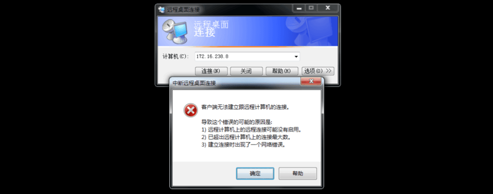
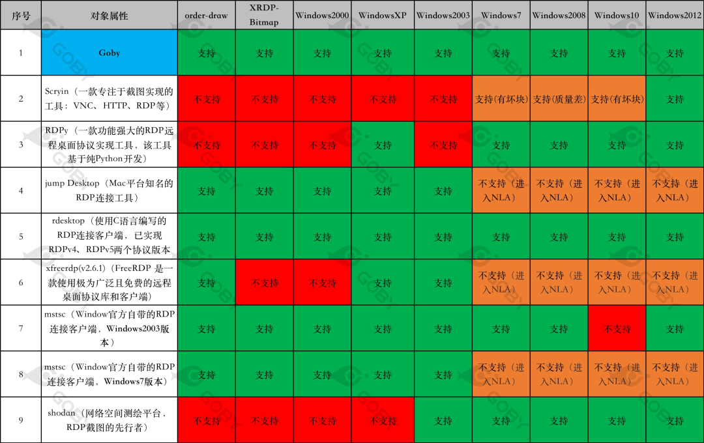
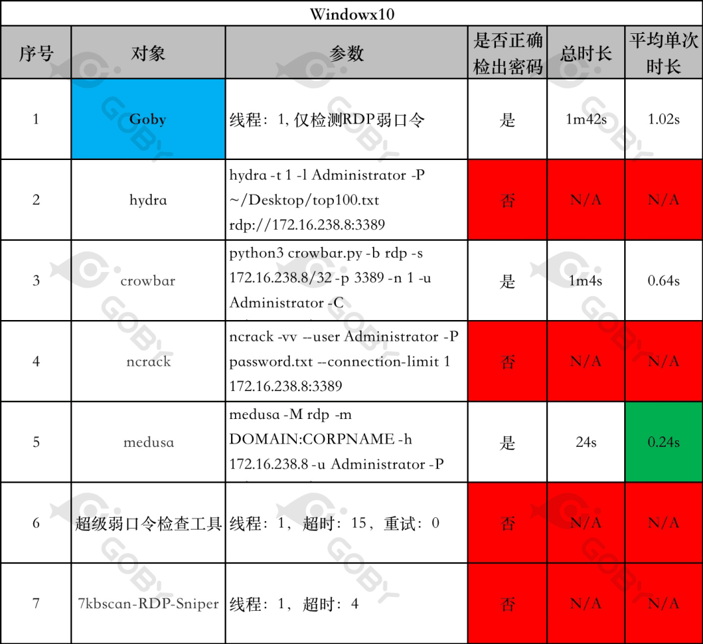
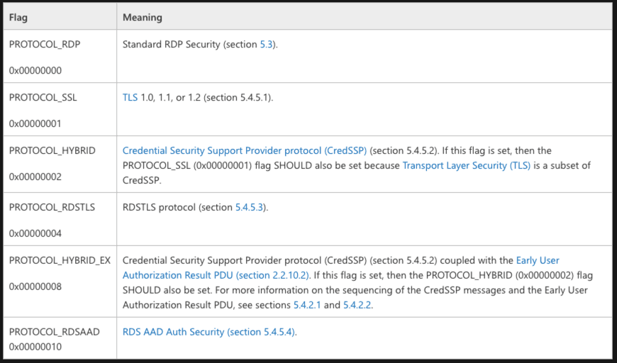
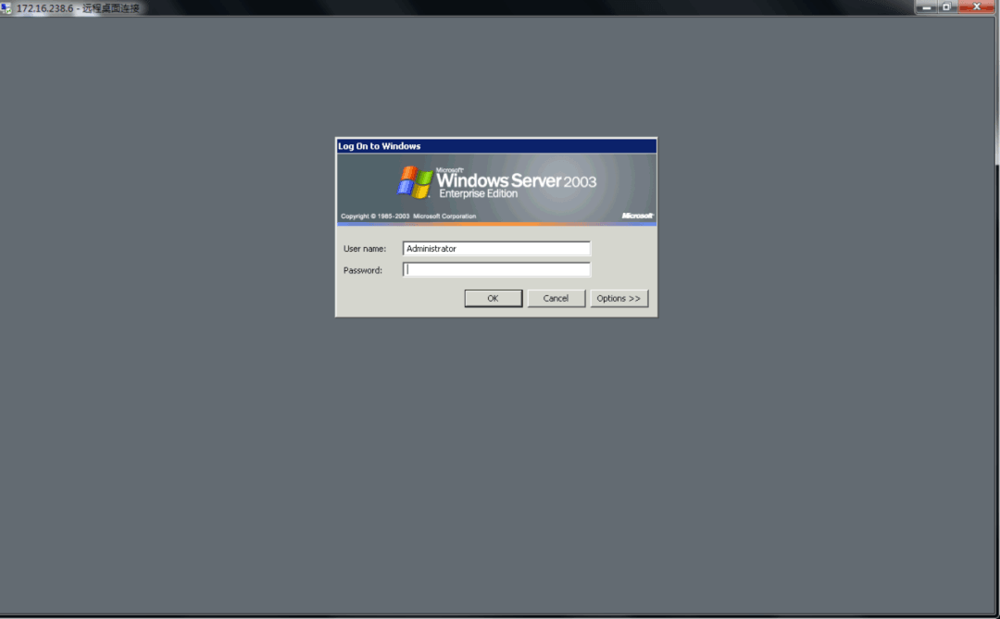
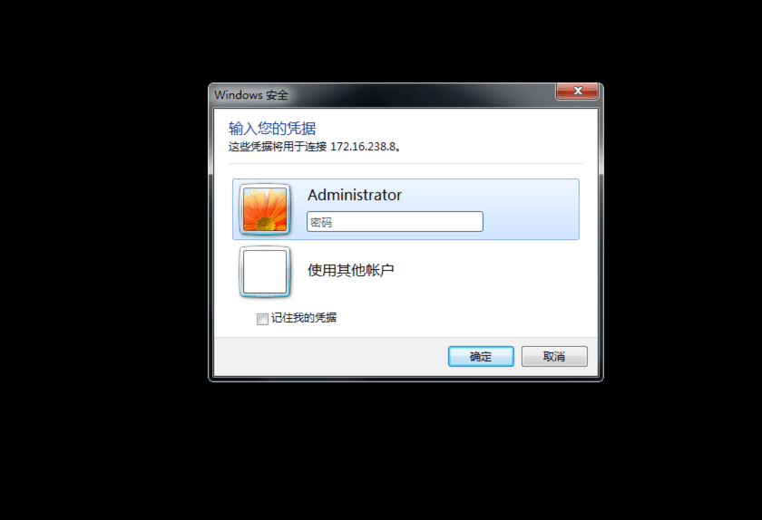
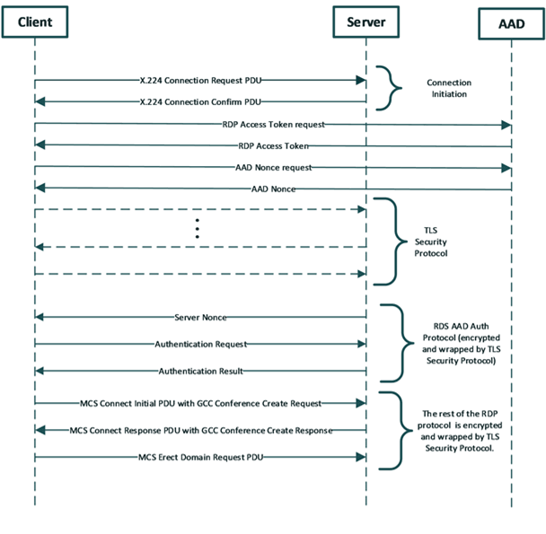

# 技术分享｜死磕 RDP 协议，从截图和爆破说起

原创 kv2

[↓↓↓](javascript:)  
  
GobySec  
  
[↑↑↑](javascript:)

*2023-04-28 10:10* *发表于北京*

  

  

Goby 社区第 27 篇技术分享文章

全文共：7380 字   预计阅读时间：19 分钟

  

 **01** **概述**

RDP（远程桌面协议）可以说是 Windows 下面使用最为广泛的协议了，RDP 之于 Windows，就跟 SSH 之于 Linux 一样，只要是做协议分析以及网络安全研究，必然绕不开 RDP。我们之前也写过相关的文章介绍，在 FOFA 平台和 Goby 产品中也都有所体现。事实上，大家聊到 RDP 除了协议信息提取之外，更多的是从两个方面来进行研究：密码爆破和截图。在 RDP 爆破领域用得比较多的是 ncrack/hydra/medusa 等，截图工具讨论比较多的是 RDPy 和 Scryin 等，但经过我们的实际测试，发现存在很多不足的地方。其结果甚至可以用惨不忍睹来形容。

之前，在 Goby 产品中为了获得更高协议兼容性（也是为了偷懒），通过内嵌 freerdp 的库用 CGO 编译的方式完成了封装来实现爆破和截图功能。**但****用户反馈并不好：兼容性低、效率低、容易报错以及程序包体积庞大****。因此我们决定用纯 Golang 的形式实现一份，最终，我们在 Goby 中完成了所有工作。**

  

 **02** **让我们看看吧**

### **2.1 我们的目标**

-   更强跨平台兼容性
    

采用 Golang 来实现，且没有使用 CGO，这使得工具的兼容性非常棒，而且无需忍受 C 语言糟糕的编译和移植体验；

-   更快登录检测速度
    

在不同的 RDP 协议版本下，登录检测的判断逻辑是完全不同的，但有一点相同：在确保准确的前提下，尽可能的快；

-   更多的协议版本兼容
    

尽可能的兼容了更多版本 RDP 协议和操作系统版本；

-   更全面的 RDP 截图
    

我们废了老大的劲，走通了从各版本 RDP 协议从建立连接到图像处理的全流程，自然不能只做 RDP 暴力破解这一件事情。

### **2.2 暴力破解能力对比**

既然做了，那就把目前行业内最好的一些工具拿来进行对比测试，让数据来说话，在暴力破解能力方面，我们一共**挑选了 7 个在业内广为流传的 RDP 暴力破解工具来进行横向对比**，更为详细的测试结果，可以在本文 3.3 看到：

### **2.3 RDP 截图能力对比**

#### **2.3.1 不是需要先输入密码才能看到画面吗？**

微软官方为了解决某些安全问题，推出了新的安全协议版本：PROTOCL\_HYBRID、PROTOCOL\_HYBRID\_EX，避免用户在未登录的状态下进入远程登录界面。但在默认状态下，为了更高的兼容性，Server 端会同时支持多种安全协议，所以我们只需要在 ClientConnectionRequest 做一些细微的调整，就可以不经过 NLA 认证，直接进入远程登录界面（当然，你依然是未登录状态）。

通常我们会选择使用低版本的 mstsc.exe 客户端来完成这件事情，但是在较新的 Windows 操作系统（Windows10）上，这并不好使：

#### **2.3.2 让数据来说话吧**

当然，我们最终肯定解决了这个问题，在此之前让我们看看数据吧，RDP 截图能力，我们选取了知名度较高的 RDP 连接客户端以及 RDP 截图工具来进行横向对比：

-   Scryin 作为一款专注截图实现的工具，在这次测试中的表现，无疑是非常差劲的，我几乎没有用它截到一张完整的图；
    
-   RDPy 实际上也很久没有维护了，但是其热度却异常的高，而且自带截图功能，经过我们测试，其对低版本的 Windows 的支持并不好，（PS：我必须要吐槽一下，RDPY 的环境实在是太难配置了！）；
    
-   JumpDesktop 作为一个在 Mac 平台的付费 RDP 连接客户端，是非常合格的，在高版本的操作系统会优先选择安全性更高的协议，不会直接进入界面；
    
-   rdesktop 虽然已经很久没有进行维护了，但其兼容性却非常棒！
    
-   xfreerdp 可以说是业界知名度最高的 RDP 库了，但我们实际测试时，在 XRDP、Windows2000 的场景下都是直接闪退，这可能与版本有关，但我们没有做更多的测试；
    
-   mstsc 作为 Windows 官方自带的 RDP 连接工具，其兼容性是毋容置疑的，Windows2003 版本的客户端仅在 Windows10 版本存在兼容性问题，而 Windows7 版本的客户端几乎没有兼容性的缺陷。
    
-   Shodan 是一个网络空间测绘平台，本不应该出现在这个对比清单中，但确实做了相当多的 RDP 截图实践，我们抽选了一部分 XRDP、Windows2000 和 WindowsXP 的资产，并没有找到截图成功的案例；
    

而 Goby 除了实现 Windows 全版本的兼容，还支持了部分比较特殊的版本，比如 XRDP 等：

，时长 00:17

### **2.4 更详细的测试结果**

所有的暴力破解能力对比测试都在内网环境下进行，使用单用户名、单线程、100 个字典（正确密码在最后），能够正确的检测出密码则判断为成功。

#### **2.4.1 WindowsXP 和 Windows2003**

由于 WindowsXP 和 Windows2003 都是使用的 PROTOCOL\_RDP 协议，需要走完全部的 RDP 协议协商流程，才能判断用户的登录状态，所以成功的工具检测时间都偏长。而 Ncrack 的表现非常差劲，虽然在直接使用正确的用户名和密码的情况下能够正确的识别，但是在暴力破解的场景下却直接卡死。

可以看到，Goby 的表现非常优异，这两类操作系统都是不支持 NLA 来进行验证的，我们不得不实现从建立连接到图像处理的全流程，利用自动登录的特性，我们可以成功登录系统，但在“如何确定我们成功登录系统”这一件事情上，我们做了相当多的实验工作，最终我们决定将：SAVE\_SESSION\_INFO 事件作为是否登录成功的依据，这使得我们在验证速度上有着相当的优势（PS：大约快了 40%）。

#### **2.4.2 Windows7 和 Windows2008**

Windows7 和 Windows2008 在理论上都是可以支持 NLA 的，但个别工具的单次检测时长却超过 10s，这是因为工具优先选择了 PROTOCL\_RDP，需要走完完整的协议协商流程，导致了这个效率问题。出乎意料的是 Hydra 和 Medusa 最终没能检测出正确的口令，Medusa 在尝试了第一次登陆之后，直接结束不再进行后续的暴力破解，而 Hydra 则报错：all children were disabled due too many connection errors。而 fscan 的表现则十分惊人，在 Windows2008 的场景下仅需 2s 就跑完了 100 个字典，并最终成功的检测出正确的口令。

Goby 的表现仍然在第一梯队，为了避免 Server 端选择低效的 PROTOCL\_RDP 协议，我们在 ClientConnectionRequest 阶段，做了一些细微的调整，这使得的检测速度有了质的飞跃，在网络条件好的情况下单次检测甚至只需要：0.02s 左右的时间。

#### **2.4.3 Windows10**

在 Windows10 下的测试结果十分令人意外，有超过一半的工具无法检测出正确的口令，这或许与 Windows10 优先选择的安全协议版本是：PROTOCOL\_HYBRID\_EX 有关，而在前面测试结果都非常不理想的 medusa，表现却非常出色。在 Windows10 的场景下，Goby 虽然表现并不是最优异的，但其检测速度也在可接受范围内，单次检测时长在 1s 左右。

#### **2.4.4 XRDP 和 Windows2000**

从前文的测试结果来看，目前是没有任何一款工具是能够完美实现在 XRDP 和 Windows2000 场景下的暴力破解的，其实 Medusa 是声称它具备 Windows2000 的暴力破解功能的，在一篇文档中，我们找到了 Medusa 针对 Windows2000 做暴力破解的专项优化方案 (http://foofus.net/goons/jmk/rdesktop.html)，其原理是借助 rdesktop 优秀的协议兼容性，再通过识别输入输出的反馈效果来判断是否登陆成功，但经过我们的测试，Medusa 并没有达到应有的效果。

我们同样尝试了很多方法来实现针对这 XRP、Windows2000 场景下的暴力破解能力实现，但遗憾的是我们最终也失败了。

我们实现了在 XRDP 场景下从建立连接到图像处理的全流程，而且 XRDP 是支持自动登录功能的，我们能够很顺畅的进入到登录后的界面，但进入到了桌面之后，我们缺乏一个明显的标识来判断登录状态，因为 XRDP 的可适用范围非常广，登录成功之后的界面也五花八门，很难找到一个漂亮的解法，这必然会带来一定的误报，这是我们不能接受的，所以我们放弃了。

而对于 Window2000，我们首先遇到的第一个阻碍就是它不具备自动登录功能，我们不得不模拟键盘输入来尝试登陆，幸运的是在这件事情上我们成功了，但我们仍然没有办法准确的来判断登录状态，因为可能是由于版本太早的缘故，Windows2000 在你登陆成功之后，并不会发送 SAVE\_SESSION\_INFO 事件，这使得我们遇到了 XRDP 同样的问题。

  

 **03** **为什么其他工具的结果会如此糟糕？**

要找到原因，还是得从 RDP 协议的历史背景着手。RDP 协议发展至今其安全协议（the security protocols）总共有六个版本：PROTOCOL\_RDP、PROTOCOL\_SSL、PROTOCOL\_HYBRID、PROTOCOL\_RDSTLS、PROTOCOL\_HYBRID\_EX、PROTOCOL\_RDSAAD。

简单的来说，这六个协议，决定了在 RDP 连接建立的过程中，将采用何种方式来进行身份认证和数据保护。

### **3.1 PROTOCL\_RDP, PROTOCL\_SSL**

PROTOCL\_RDP 是最初的 RDP 连接交互协议，由 RDP 协议自身实现传输数据的安全性，其通信数据通过 RC4 加密，具体的秘钥长度从 40 位至 128 位不等，而 PROTOCOL\_SSL 则是在 PROTOCOL\_RDP 的基础上，套了一层 TLS 的壳，其创建目的是因为 PROTOCOL\_RDP 存在中间人攻击（man-in-the-middle attacks）的风险，其关系可以认为是 HTTP 与 HTTPS 关系，在这两个协议中，从暴力破解这一话题上，我们需要注意的是：

-   PROTOCOL\_RDP 自身是不具备协议层面的 Windows 操作系统身份认证功能的，协议只负责数据的传输，这也是为什么在 Windows 较早的版本，会先进入图形界面，再输入密码的原因。
    
-   为了实现单点登录（无需在远程桌面界面输入用户名和密码即可进入桌面）这一需求，在 Windows2000 之后的版本，可以自动登录（AUTOLOGIN），其效果相当于客户端帮助用户完成了输入密码这一过程。
    

### **3.2 PROTOCL\_HYBRID, PROTOCOL\_HYBRID\_EX**

前文提到不管是 PROTOCL\_RDP 还是 PROTOCL\_SSL，在协议层面都只承载数据传输的功能，不承载操作系统鉴权功能，这使得所有人都可以在未经身份鉴别的情况下，访问操作系统的登录界面，这是有着相当大的安全隐患的，年纪稍微大一点的小伙伴可能还记得在那个年代一些独有的留后门手段：输入法后门、Shift 后门等，均是利用了这个 RDP 协议的这个特性。当然不止是安全角度，从使用角度来说在协议层面缺乏身份鉴别功能就意味着无法实现单点登录的操作，这无疑是有问题的。

PROTOCL\_HYBRID、PROTOCOL\_HYBRID\_EX 就是为了解决这个问题，从 PROTOCL\_HYBRID 协议起，操作系统身份鉴别功能由凭证安全支持提供商（CredSSP）协议在 TLS 协商阶段来提供，简单的来说，就是在进入远程桌面的界面之前，需要实现输入正确的用户名和密码，也就是我们常说的 NLA。这一改动在绝大多数情况下都是提高了 RDP 协议的安全性，但是其实也带了一些新的安全风险，在后文我会详细来说。

### **3.3 PROTOCOL\_RDSTLS, PROTOCOL\_RDSAAD**

PROTOCOL\_RDSTLS 是 PROTOCOL\_RDP 协议增强版本，通常应用于服务器重定向场景（RDP 协议负载均衡、堡垒机等），其数据保护、加密解密、完整性验证等与均由 TLS 来完成，用户身份认证，则是在 PDU 协商阶段，交换 RDSTLS PUD 来完成，而 PROTOCOL\_RDSAAD 则是 PROTOCL\_RDSTLS 的变体，其身份验证功能由 Azure AD 准入设备（Azure AD-joined device）来实现。这个协议一般不服务于常规的服务器或个人办公终端，而且经过测试，几乎所有兼容 PROTOCOL\_RDSTLS、PROTOCOL\_RDSAAD 协议的 RDP 对象，都会同时兼容 PROTOCL\_HYBRID、PROTOCOL\_HYBRID\_EX 中的至少一个，所以从暴力破解这一角度来说，我们可以忽略这两个协议。

### **3.4 重点来了**

请注意，**Server 端不一定只能支持一个安全协议（the security protocols），一个 Server 端可以支持多种安全协议，那么在独立的 RDP 连接中，到底使用哪一个安全协议是如何确定的呢？**

在所有 RDP 协议连接中，Client 端所发出的第一个包，我们称之为：ClientConnectionRequest，其中有一个参数：RequestedProtocol，该参数的值代表着，Client 端告诉 Server 端本次 RDP 连接，**可以**使用哪些协议（我们可以假定为：PROTOCOL\_SSL 和 PROTOCOL\_HYBRID），Server 端会**选择**一个（比如：PROTOCOL\_HYBRID），然后返回给 Client 端**确认**。这就**决定**了本次 RDP 连接所使用的安全协议：PROTOCOL\_HYBRID。

掌握了前文的一些前置条件，接下来我们就可以尝试来解答一下为什么这些工具的测试结果会这么惨不忍睹了：

#### **3.4.1 XRDP 和 Windows2000**

几乎所有的工具都无法对 XRDP 和 Windows2000 来做暴力破解，原因主要有以下几个：

-   Windows2000 和 XRDP 并不支持 NLA，所有 RDP 连接都会进入远程桌面界面。而部分工具把进入远程桌面界面作为登录成功的依据，所以会把错误的密码判断为登陆成功
    
-   Windows2000 是所使用的的安全协议版本为：PROTOCOL\_RDP，而 PROTOCOL\_RDP 也是区分版本的，Window2000 的版本为：RDP\_VERSION\_4，绝大部分工具无法兼容这个协议版本
    
-   Windows2000 并不支持自动登录（AUTOLOGIN）功能
    
-   XRDP 与 Windows 所使用的的 RDP 协议存在一定的差异性，绝大部分工具无法兼容这些差异
    

#### **3.4.2 WindowsXP 和 Window2003**

WindowsXP 和 Window2003 与 Windows2000 和 XRDP 一样，也不支持 NLA，但：超级弱口令检查工具、7kbscan-RDP-Sniper 依然能正常的完成暴力破解工作，是因为从 Windows2003 开始，就能够支持自动登录（AUTOLOGIN）功能了，而在登陆之后，工具可以有很多种方式来判断登录状态，从而准确识别是否登录成功。

#### **3.****4.3 Windows7 和 Window2008**

这两个版本的操作系统是几乎所有的暴力破解工具都能够支持的，因为这两个操作系统默认使用的安全协议为 PROTOCL\_HYBRID，暴力破解工具可以很方便的使用 NLA 来进行登录尝试，而无需处理后续复杂的、严格的 RDP 协议协商及图像处理流程，这也是我前文提到的为什么 NLA 的出现虽然完善了业务场景，解决了一部分安全问题，但却带来新的安全问题的原因。

#### **3.4.4 Windows10**

Windows10 默认使用的安全协议为 PROTOCL\_HYBRID\_EX，部分暴力破解工具无法支持这个协议。

  

 **04** **写在最后**

到这里，本篇文章已经接近尾声了，不论是工具的研发，还是各工具 RDP 截图或者暴力破解的测试，都花费了大量的时间和精力，最终成文的目的不是把其他工具贬的一文不值，它们都是先行者，前人开路，后人才能在更高的起点出发，只是希望我们都能在使用过程中发现工具存在的不完美的时候，敢于发声和吐槽，甚至尝试去改变，**借假修真**使工具变的更好。什么是假，什么是真？佛学中讲，身体是假，佛道是真。工具从无到有，又从有到精，工具是假，技术是真，于工具是如此，于行业、于自身亦是如此，最终目的其实**借事修人**。

**Goby 现已具备前文所提到的全部能力，欢迎各位小伙伴点击链接体验：https://gobysec.net/updates**

##   

##  **05** **参考**

文中相关技术细节若存在错误或疏漏，欢迎补充指正。

-   MS-RDPBCGR(https://learn.microsoft.com/en-us/openspecs/windows\_protocols/ms-rdpbcgr)
    
-   MS-RDPELE(https://learn.microsoft.com/en-us/openspecs/windows\_protocols/ms-rdpele)
    
-   像 fofa 一样解析 RDP 信息，RDP 提取操作系统，RDP 登录截屏 (https://xz.aliyun.com/t/11978)
    
-   网络空间测绘技术之：协议识别（RDP 篇）(https://zhuanlan.zhihu.com/p/336936793)
    
-   tomatome/grdp(https://github.com/tomatome/grdp)
    
-   citronneur/rdpy(https://github.com/citronneur/rdpy)
    
-   rdesktop/rdesktop(https://github.com/rdesktop/rdesktop)
    

  

  

  

  

**最新** **Goby 使用技巧分享****：**

- - -

[•](http://mp.weixin.qq.com/s?__biz=MzI4MzcwNTAzOQ==&mid=2247510124&idx=1&sn=de3aef91a47b6472d987c2fb7e6f3f6e&chksm=eb8443ccdcf3cadaa4c0ceb1905e14a9d7f3f01bf44f272bd0821c7359db0a847d8533c7abe2&scene=21#wechat_redirect) [su18 | Shell 中的王者\-JAVAWEB 内存马【认知篇】](http://mp.weixin.qq.com/s?__biz=MzI4MzcwNTAzOQ==&mid=2247521497&idx=1&sn=50e062aa20930102e6b787711d0e214a&chksm=eb847f79dcf3f66f1ac0d14065fdef2576393e9142f36c5add4e738eebbf3b71410a79e759ef&scene=21#wechat_redirect)

[•](http://mp.weixin.qq.com/s?__biz=MzI4MzcwNTAzOQ==&mid=2247510124&idx=1&sn=de3aef91a47b6472d987c2fb7e6f3f6e&chksm=eb8443ccdcf3cadaa4c0ceb1905e14a9d7f3f01bf44f272bd0821c7359db0a847d8533c7abe2&scene=21#wechat_redirect) [su18 | Goby 反序列化漏洞打入内存马【利用篇】](http://mp.weixin.qq.com/s?__biz=MzI4MzcwNTAzOQ==&mid=2247521997&idx=1&sn=d3c444f95c97f06b1d24240a91bd898d&chksm=eb847d6ddcf3f47b0c50ab4a97b2adbee3241149d9a3ac5a56958e76ac33ede48e0bbd108952&scene=21#wechat_redirect)  

[• su18 | Goby 利用内存马的一些技术细节【技术篇】](http://mp.weixin.qq.com/s?__biz=MzI4MzcwNTAzOQ==&mid=2247527264&idx=1&sn=7ccd2536dbe00cc13d655e4b13fe6fa9&chksm=eb8480c0dcf309d6daa2c6b25c73524b8ded42a3e835b510a6113557c630e01f0f8dbc5b3a83&scene=21#wechat_redirect)

[• 14m3ta7k | 跨越语言的艺术：Weblogic 序列化漏洞与 IIOP 协议](http://mp.weixin.qq.com/s?__biz=MzI4MzcwNTAzOQ==&mid=2247527734&idx=1&sn=93073a73437cfee6dd2c91dce0331a48&chksm=eb848696dcf30f80bd676f6000ec92283893ecce08ec2abe571d0a4d908b0f9046512259b727&scene=21#wechat_redirect)

[• 14m3ta7k | Weblogic CVE-2023-21931 漏洞挖掘技技巧：后反序列化利用](http://mp.weixin.qq.com/s?__biz=MzI4MzcwNTAzOQ==&mid=2247527913&idx=1&sn=f3dce554430b75bc9bd5c1e76dde5587&chksm=eb848649dcf30f5f829b8e51a85390b2581f29b0a164d67fa164609f84c9ddd6f72de2231100&scene=21#wechat_redirect)

更多 \>\>  技术分享

  

Goby 欢迎表哥/表姐们加入我们的社区大家庭，一起交流技术、生活趣事、奇闻八卦，结交无数白帽好友。

也欢迎投稿到 Goby（Goby 介绍/扫描/口令爆破/漏洞利用/插件开发/ PoC 编写/ IP 库使用场景/ Webshell /漏洞分析 等文章均可），审核通过后可奖励 Goby 红队版，快来加入微信群体验吧~~~

-   微信群：公众号发暗号“加群”，参与积分商城、抽奖等众多有趣的活动
    
-   获取版本：https://gobysec.net/sale
    

  

