# 攻防启示：Chromium 组件风险剖析与收敛

**文｜**腾讯研发安全团队 Martinzhou、腾讯蓝军 Neargle、Pass

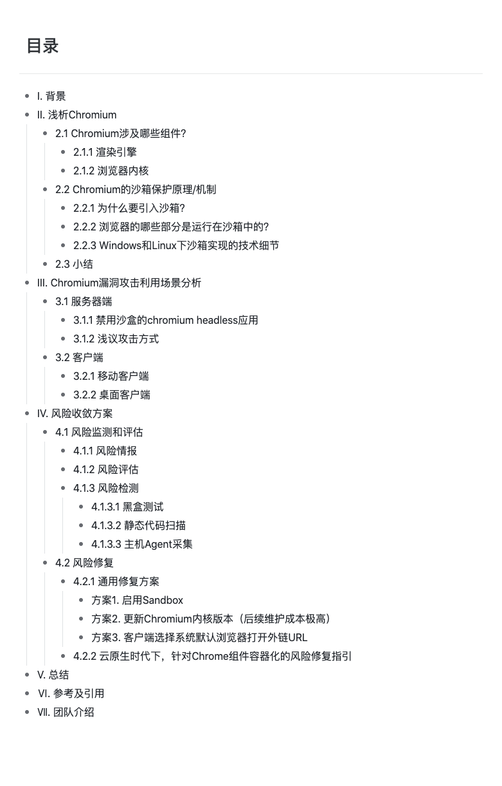

# I. 背景

数月前我们在攻防两个方向经历了一场“真枪实弹”的考验，期间团队的目光曾一度聚焦到 Chromium 组件上。其实，早在 Microsoft 2018 年宣布 Windows 的新浏览器 Microsoft Edge 将基于 Chromium 内核进行构建之前，伴随互联网发展至今的浏览器之争其实早就已经有了定论，Chromium 已然成为现代浏览器的事实标准，市场占有率也一骑绝尘。在服务端、桌面还是移动端，甚至据传 SpaceX 火箭亦搭载了基于 Chromium 开发的控制面板。


Chromium 内核的安全问题，早已悄无声息地牵动着互联网生活方方面面。基于对实战经历的复盘，本文将从 Chromium 架构及安全机制概况入手，剖析 Chromium 组件在多场景下给企业带来的安全风险并一探收敛方案。

# II. 浅析 Chromium

## 2.1 Chromium 涉及哪些组件？

Chromium 主要包含两大核心组成部分：渲染引擎和浏览器内核。

### 2.1.1 渲染引擎

Chromium 目前使用 Blink 作为渲染引擎，它是基于 webkit 定制而来的，核心逻辑位于项目仓库的 third\_party/blink/目录下。渲染引擎做的事情主要有：

-   解析并构建 DOM 树。Blink 引擎会把 DOM 树转化成 C++ 表示的结构，以供 V8 操作。
-   调用 V8 引擎处理 JavaScript 和 Web Assembly 代码，并对 HTML 文档做特定操作。
-   处理 HTML 文档定义的 CSS 样式
-   调用 Chrome Compositor，将 HTML 对应的元素绘制出来。这个阶段会调用 OpenGL，未来还会支持 Vulkan。在 Windows 平台上，该阶段还会调用 DirectX 库处理；在处理过程中，OpenGL 还会调用到 Skia，DirectX 还会调用到 ANGLE。

Blink 组件间的调用先后关系，可用下图概括：

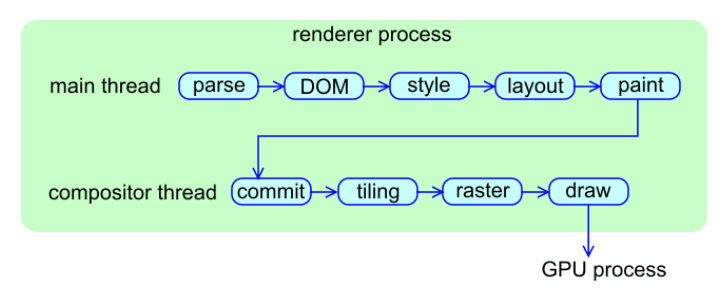

可以说，几乎所有发生在浏览器页签中的工作，都有 Blink 参与处理。由于涉及许多组件库，不难想象过程中可能会出现的安全风险一定不少。据《The Security Architecture of the Chromium Browser》一文的统计数据，约 67.4% 的浏览器漏洞都出在渲染引擎中，这也是为什么要引入 Sandbox 这么重要。

### 2.1.2 浏览器内核

浏览器内核扮演连接渲染引擎及系统的“中间人”角色，具有一定“特权”，负责处理的事务包括但不限于：

1) 管理收藏夹、cookies 以及保存的密码等重要用户信息

2) 负责处理网络通讯相关的事务

3) 在渲染引擎和系统间起中间人的角色。渲染引擎通过 Mojo 与浏览器内核交互，包含组件：download、payments 等等。

## 2.2 Chromium 的沙箱保护原理/机制

### 1、为什么要引入沙箱？

前述部分提到，Chromium 渲染引擎涉及大量 C++ 编写的组件，出现漏洞的概率不小。因此，基于纵深防御理念浏览器引入了涉及三层结构。渲染引擎等组件不直接与系统交互，而是通过一个被称为 MOJO 的 IPC 组件与浏览器引擎通讯（也被称为：broker），再与系统交互。进而可以实现：即便沙箱中的进程被攻破，但无法随意调用系统 API 产生更大的危害。有点类似：即便攻破了一个容器实例，在没有逃逸或提权漏洞的情况下，宿主机安全一定程度上不受影响（实际上，浏览器的 Sandbox 和容器隔离的部分技术原理是相似的）。

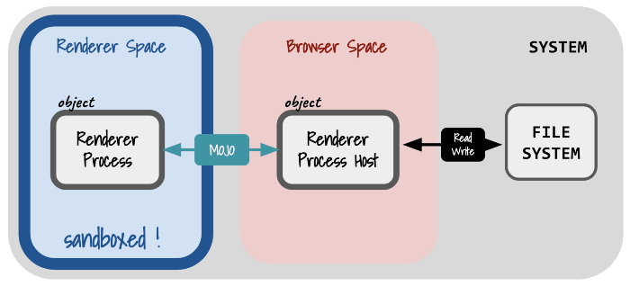

### 2、浏览器的哪些部分是运行在沙箱中的？

浏览器渲染引擎、GPU、PPAPI 插件以及语音识别服务等进程是运行在沙箱中的。此外不同系统平台下的部分服务也会受沙箱保护，例如 Windows 下打印时调用的 PDF 转换服务、icon 浏览服务；MacOS 下 NaCl loader、需要访问 IOSurface 的镜像服务等。

更多细节可查阅 Chromium 项目文件 sandbox\_type.h 和 sandbox\_type.cc 中的源码定义：

1.  `// sandbox/policy/sandbox_type.h`
2.  `Line 24 enum class SandboxType {`
4.  `// sandbox/policy/sandbox_type.cc`
5.  `Line 21 bool IsUnsandboxedSandboxType(SandboxType sandbox_type) {`

### 3、Windows 和 Linux 下沙箱实现的技术细节

#### Windows

在 Windows 平台上，Chrome 组合使用了系统提供的 Restricted Token、Integrity Level、The Windows job object、The Windows desktop object 机制来实现沙盒。其中最重要的一点是，把写操作权限限制起来，这样攻击这就无法通过写入文件或注册表键来攻击系统。

#### Linux

Chrome 在 Linux 系统上使用的沙箱技术主要涉及两层：

| **层级** | **功能** |
| --- | --- |
| Layer - 1 | 用于限制运行在其中的进程对资源的访问 |
| Layer - 2 | 用于有关进程对系统内核某些攻击面的访问 |

**第一层沙箱采用 setuid sandbox 方案。**

其主要功能封装在二进制文件 chrome\_sandbox 内，在编译项目时需要单独添加参数“ninja -C xxx chrome chrome\_sandbox”编译，可以通过设置环境变量 CHROME\_DEVEL\_SANDBOX 指定 Chrome 调用的 setuid sandbox 二进制文件。

setuid sandbox 主要依赖两项机制来构建沙盒环境：CLONE\_NEWPID 和 CLONE\_NEWNET 方法。CLONE\_NEWPID 一方面会借助 chroots，来限制相关进程对文件系统命名空间的访问；另一方面会在调用 clone() 时指定 CLONE\_NEWPID 选项，借助 PID namespace，让运行在沙盒中的进程无法调用 ptrace() 或 kill() 操作沙盒外的进程。而 CLONE\_NEWNET 则用于限制在沙盒内进程的网络请求访问，值得一提的是，使用该方法需要 CAP\_SYS\_ADMIN 权限。这也使得当 Chrome 组件在容器内运行时，沙箱能力所需的权限会和容器所管理的权限有冲突；我们无法用最小的权限在容器里启动 Chrome 沙箱，本文 4.2.2 部分会详细阐述此处的解决之道。

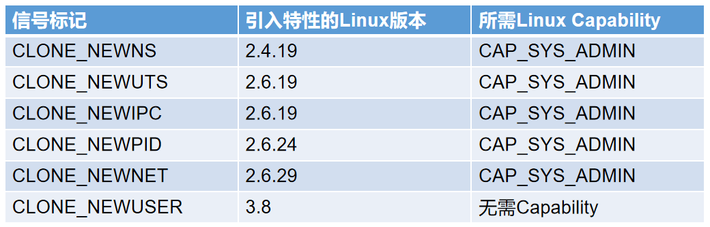

> 更多详参见 Linux Namespace 及 cgroups 介绍说明：《Resource management: Linux kernel Namespaces and cgroups》- [https://sites.cs.ucsb.edu/~rich/class/cs293b-cloud/papers/lxc-namespace.pdf](https://sites.cs.ucsb.edu/~rich/class/cs293b-cloud/papers/lxc-namespace.pdf)

由于 setuid sandbox 方案存在一定短板。自 Chrome 44 版本起已推荐 namespaces sandbox 来替代 setuid sandbox 方案，其主要依赖于 Linux 内核提供的 user namespaces 机制，相关逻辑可在项目的如下行代码看到：

```ruby
https://source.chromium.org/chromium/chromium/src/+/main:sandbox/policy/linux/sandbox_linux.cc;drc=2311701cab51ef03be34fba491e0a855371d4f84;l=544
```

**第二层沙箱采用 Seccomp-BPF 方案，用来限制进程访问内核特定攻击面。**

其原理是：通过将 Seccomp 和 BPF 规则结合，实现基于用户配置的策略白名单，对系统调用及其参数进行过滤限制。

1.  `// sandbox/policy/linux/sandbox_linux.cc` 
2.  `Line 413 StartSeccompBPF(sandbox_type, std::move(hook), options);`

[https://source.chromium.org/chromium/chromium/src/+/main:sandbox/policy/linux/bpf\_audio\_policy\_linux.cc;l=34;drc=8d990c92df3d03ff3d313428f25dd11b7e509bcf;bpv=1;bpt=1](https://source.chromium.org/chromium/chromium/src/+/main:sandbox/policy/linux/bpf_audio_policy_linux.cc;l=34;drc=8d990c92df3d03ff3d313428f25dd11b7e509bcf;bpv=1;bpt=1)

## 2.3 小结

Chromium 涉及的组件众多，使用的 C++ 语言天然决定了会潜在不少安全问题。例如：一个 V8 中的内存安全问题（如：CVE-2021-21220、CVE-2019–5782），组合 Web Assembly 将 Shellcode 写入 RWX Pages，在未受沙箱保护的情况下，就能实现远程代码执行。

沙箱机制组合使用了 OS 相关的隔离能力（如：Linux 平台上的 namespace、Seccomp-BPF 机制），限制了被沙箱保护进程的资源访问以及 syscall 能力，能很好的防止出现在渲染引擎中的漏洞，被用于直接实现 RCE：但沙箱机制也存在一些不足，历史上也出现过沙箱逃逸的漏洞，例如：Google Project Zero 团队曾发布的《Virtually Unlimited Memory: Escaping the Chrome Sandbox》一文。

综上，在无法 100% 预防 Chromium 渲染进程出现内存安全问题的情况下，开启沙箱保护是一项必须落地的最佳安全实践。

# III. Chromium 漏洞攻击利用场景分析

作为一款客户端组件，在评估 Chromium 漏洞时，常常会聚焦于客户端的攻防场景。但根据我们的经验，受 chromium 漏洞影响的不仅有客户端应用，也包含了服务器上运行的程序，例如：部署在服务器端、基于 Chrome Headless 应用的爬虫程序等。

## 3.1 服务器端

### 3.1.1 禁用沙盒的 chromium headless 应用

随着 Phantomjs 项目停止维护，Chromium headless 已经成为 Headless Browser 的首选。在日常开发、测试、安全扫描、运维中，有许多地方会用到 Headless Browser，包括不限于以下场景：

1.  `● 前端测试`
2.  `● 监控`
3.  `● 网站截图`
4.  `● 安全扫描器`
5.  `● 爬虫`

在这些场景中，如果程序本身使用的 Chromium 存在漏洞，且访问的 URL 可被外部控制，那么就可能受到攻击最终导致服务器被外部攻击者控制。

以常见的使用 Chrome headless 的爬虫为例，如果在一些网站测试投放包含 exploit 的链接，有概率会被爬虫获取，相关爬取逻辑的通常做法是新建 tab 导航至爬取到的链接。此时，如果爬虫依赖的 chromium 应用程序更新不及时，且启动时设置了—no-sandbox 参数，链接指向页面内的 exploit 会成功执行，进而允许攻击者控制爬虫对应的服务器。

为何 —no-sandbox 会如此泛滥呢？我们不妨来看一下，当我们在 ROOT 下启动 Chrome，会有什么样的提示呢？

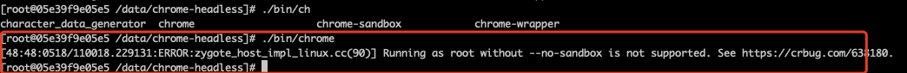

我们会得到 **Running as root without —no-sandbox is not supported** 的错误提示，且无法启动 Chrome；这对于以研发效率和产品功能优先的研发同学来说无异于提示“请使用 —no-sandbox 来启动 Chrome”, 应用容器化的进程也加剧了使用 ROOT 用户启动应用程序的情况。你不得不创建一个新的普通用户来启动 Chrome 服务，例如在 Dockerfile 里加入 **RUN** useradd chrome 和 **USER** chrome 语句；有些基于 Chrome 的著名第三方库甚至会在代码中隐形植入关闭 sandbox 的代码，当研发同学在 ROOT 下启动应用程序时，第三方库会默认关闭 sandbox，添加 —no-sandbox 参数，例如 Golang 第三方 package Chromedp 的代码：

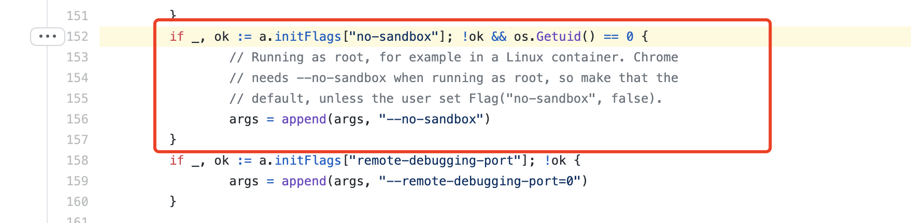

此时，对于开发同学来说使用 —no-sandbox 参数甚至是无感的，直至自己的容器或服务器被攻击者入侵控制。

即使研发同学 sandbox 来避免安全风险的意识，在容器化的应用内启动 chrome 也是不易的；为镜像创建一个新的非 ROOT 用户并非唯一的条件，Chrome sandbox 需要调用一些特定的 syscall 或 linux capabilities 权限用于启动 sandbox 逻辑，同时容器镜像需要打入 chrome-sandbox 二进制文件并写入环境变量以供 Chrome 进程找到 sandbox 程序。若未对 Chrome 容器进行特定的权限配置，chrome 将输出 Operation not permitted 报错信息并退出。

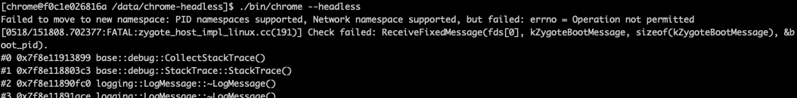

所以，网络上有大量的文档和博客推荐启用 —no-sandbox 来解决 Chrome headless 的使用问题，这也间接助长了 —no-sandbox 参数这种错误用法的泛滥：

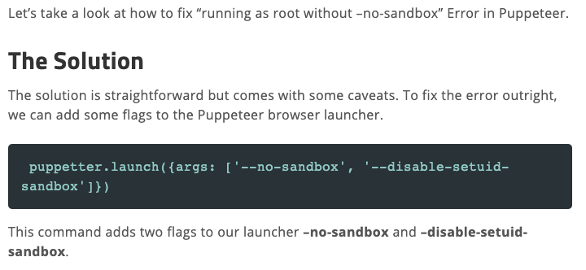

我们将在后面的章节里详细为您讲解 Chrome Sandbox 在容器以及容器集群中方便快捷且安全合理的部署解决方案。

### 3.1.2 浅议攻击方式

未知攻焉知防？虽然在已有 Exploit 的情况下进行漏洞利用并不困难，但知悉漏洞利用的流程和攻击行为有助于我们更好的构建安全能力。以下以最近的 CVE-2021-21224 漏洞为例，当服务端上程序使用的 chromium 版本存在漏洞时，且未开启 Sandbox，可以利用这个漏洞来获取服务器的权限。

首先攻击者使用 metasploit 生成 shellcode，这里假设 chromium 是在 linux 上运行且架构为 x64。同时，考虑到爬虫运行结束后往往会结束浏览器进程，通过设置 PrependFork 为 true 可以保证 session 的持久运行。

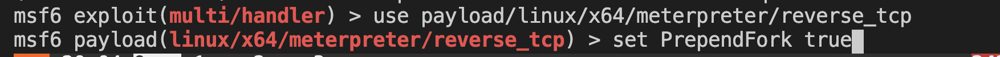

生成 shellcode 后监听端口：

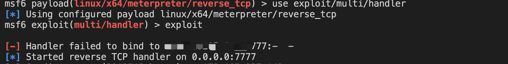

实战中，可以通过投递带 exploit 的链接到各个网站上，这里假设攻击者控制的服务器正在被爬取或者正在被渗透测试人员的扫描器扫描：

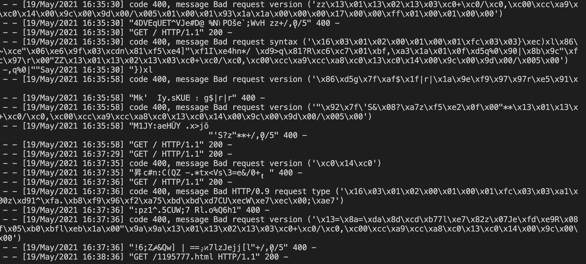

成功获取到爬虫/扫描器的服务器 session：

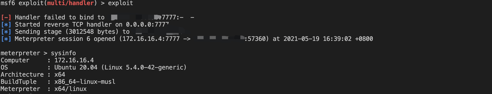

meterpreter 的进程是 fork 后的 chrome 子进程：

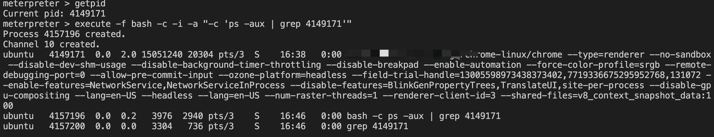

可以猜想，不仅是各种内嵌浏览器的客户端程序易受 chromium 相关漏洞影响，**可能有相当多的服务端程序也暴露在 chromium 0Day/Nday的攻击下。** chromium 漏洞将会成为企业防御边界的新的突破口，而这个突破口是自内而外的，相比开放端口在外的服务漏洞，这种攻击可能会更隐蔽。

作为防御方，我们也可以利用 chromium 漏洞来反制一些攻击者，如果攻击者安全意识较差或者使用的工具安全性不强，防御方在服务器上托管带有 exploit 的网页，攻击者的爬虫/扫描器扫到了这些网页就可能被反制攻击。

# 3.2 客户端

在面对 Chromium 组件风险时，客户端场景往往首当其冲。通常，其风险成立条件有两点：1、使用了存在漏洞的 Chromium 组件；2、可以指定 Webview 组件访问特定的网站地址。

### 3.2.1 移动客户端

目前，移动客户端主要分两大“阵营”：安卓和 iOS，最大相关风险是 Webview 类组件。前者 Android System Webview 是基于 Chromium 源代码开发的，所以当 1 Day 披露时，需要及时跟进影响；iOS App 一般会使用 WKWebView 和 JavaScriptCore，Chromium 1 Day 影响 iOS 应用的可能性较低。

#### 客户端内置 Webview 浏览器窗口

除了使用系统自带的 Webview 组件，另外一种比较常见且更容易引起注意的方式是使用应用内置或独立于系统之外的浏览器组件；此时，应用会选用 Chromium 体系的概率较高。应用选择自己内置并维护浏览器组件的原因有很多，例如以下几类需求：

1、在浏览器内核层回收更多用于 Debug 的客户端信息；  
2、支持如夜间模式、中文优化等用户需求；  
3、支持更多的视频格式和文件格式；

也有应用为了应对此前 App Store 在 WWDC 大会提出的限制（即 App Store 中的所有应用都必须启用 App Transport Security 安全功能并全量走 HTTPS），使用改过的 Webview 组件曲线救国，以便达到 App Store 的合规需求。

也因为应用自己维护所使用的浏览器组件，当系统的 WebView 跟随系统升级而修复漏洞时，应用所使用的的浏览器组件并不跟着更新；作为应用开发者自己维护的硬分支，Chromium 不断的功能变更和漏洞修复补丁都需要应用开发者自行合并和兼容；这不仅需要硬核的浏览器研发能力也需要日以继夜不断的坚持。再加上，无论在移动端还是桌面客户端，在使用应用内 WebView 时为了更加轻便和简洁，浏览器组件多是以单进程的方式启动；而在我们之前对 Sandbox 技术的介绍中，浏览器 Sandbox 和单进程 WebView 组件显然是冲突的；这也使得历史上关闭 Sandbox 能力的客户端程序，在漏洞修复过程中，对于开启 Sandbox 的修复操作存在历史包袱。

无论如何，我们始终不建议移动端应用的 WebView 组件可以由用户控制并打开开放性的页面；这会使得应用内加载的内容可能存在不可控或不可信的内容。WebView 组件可以打开的 URL，应该用白名单进行限制；特别是可以用 Deeplink 打开并且存在 URL 参数的 WebView。

### 3.2.2 桌面客户端

许多桌面客户端应用也是基于 Chromium 构建的。一类是基于 Chromium 定制的浏览器产品、或内置基于 Chromium 开发 Webview 组件的桌面客户端应用；另一类是基于 Electron 构建的桌面客户端应用。

前者与传统 Chrome 浏览器或是嵌入在移动客户端的 Webview 组件类似，如果未开启沙箱保护，面临很大的风险。而后者 Electron 则是在评估 Chromium 漏洞攻防利用场景时，比较容易被忽视的一块。Electron 基于 Chromium 和 Node 构建，其主要特性之一就是能在渲染进程中运行 Node.js。目前有许多客户端工具基于它开发，涉及：VS Code、Typora、Slack 等。默认情况下，渲染器进程为受沙箱保护，这是因为：大多数 Node.js 的 API 都需要系统权限，没有文件系统权限的情况下 require() 是不可用的，而该文件系统权限在沙箱环境下是不可用的，但功能性进程受沙箱保护。Electron 除面临渲染引擎本身的安全风险外，主要风险源自于其本身的功能特性 —— nodeIntegration。当该选项被设置为 true，表示 renderer 有权限访问 node.js API，进而执行“特权”操作。这时如果攻击者能自由控制渲染的页面内容，则可直接实现 RCE。

# IV. 风险收敛方案

回到我们今天的主题：修复和防御。如上我们知道，Chromium 的安全问题是方方面面的，各类安全风险也会在不同的场景上产生，那么如何收敛就是企业安全建设永恒的话题；最后我们想分享我们的安全实践经验，力求解答在安全实践中我们遇到的以下几个问题，如：Chrome 组件的漏洞都有哪些？Google 又是如何跟进它们的？我们又该如何评估和检测 Chrome 持续更新过程中所公开的 1Day 风险？最终如何修复？Linux 容器中开启 Chrome 沙盒的最佳实践又是什么？

## 4.1 风险监测和评估

### 4.1.1 风险情报

有两个渠道可以及时了解到 Chromium 漏洞披露情况：

● Chromium 工单系统。该平台上收录了所有已公开的 Chrome 安全 Issue，可借助特定关键词检索。如检索已公开的高风险安全问题，可访问：[https://bugs.chromium.org/p/chromium/issues/list?can=1&q=Security\_Severity%3DHigh%20&colspec=ID%20Pri%20M%20Stars%20ReleaseBlock%20Component%20Status%20Owner%20Summary%20OS%20Modified&sort=-modified&num=100&start=](https://bugs.chromium.org/p/chromium/issues/list?can=1&q=Security_Severity%3DHigh%20&colspec=ID%20Pri%20M%20Stars%20ReleaseBlock%20Component%20Status%20Owner%20Summary%20OS%20Modified&sort=-modified&num=100&start=)

● Chrome 发布日志。Chrome 稳定版本发布消息会在[https://chromereleases.googleblog.com/上发出，和稳定版本发布消息一起的还有该版本做了哪些安全更新以及对应漏洞的奖金。](https://chromereleases.googleblog.com/%E4%B8%8A%E5%8F%91%E5%87%BA%EF%BC%8C%E5%92%8C%E7%A8%B3%E5%AE%9A%E7%89%88%E6%9C%AC%E5%8F%91%E5%B8%83%E6%B6%88%E6%81%AF%E4%B8%80%E8%B5%B7%E7%9A%84%E8%BF%98%E6%9C%89%E8%AF%A5%E7%89%88%E6%9C%AC%E5%81%9A%E4%BA%86%E5%93%AA%E4%BA%9B%E5%AE%89%E5%85%A8%E6%9B%B4%E6%96%B0%E4%BB%A5%E5%8F%8A%E5%AF%B9%E5%BA%94%E6%BC%8F%E6%B4%9E%E7%9A%84%E5%A5%96%E9%87%91%E3%80%82)

事实上，甲方安全人员还可以借助一些技巧，提前了解安全问题的修复细节。Gerrit 是基于 git 的一款 Code Review 平台，chrome team 使用该平台进行 code review：[https://chromium-review.googlesource.com/。该平台上的主题会关联对应的issue](https://chromium-review.googlesource.com/%E3%80%82%E8%AF%A5%E5%B9%B3%E5%8F%B0%E4%B8%8A%E7%9A%84%E4%B8%BB%E9%A2%98%E4%BC%9A%E5%85%B3%E8%81%94%E5%AF%B9%E5%BA%94%E7%9A%84issue) id，通过对应修复 commit 的主题可以了解到 issue 的修复方案和代码。

chromium 使用[https://bugs.chromium.org对chromium的bug进行跟踪。可以用短链来访问对应的issue，例如issue](https://bugs.chromium.xn--orgchromiumbug-7z00as022acgzc57uazibm5s.xn--issue,issue-2u0ru1en70a2wti6i8ply33bqw6c7xfr8hor6jopzbwye/) 1195777 可以用该链接访问：[https://crbug.com/1195777。](https://crbug.com/1195777%E3%80%82)

chromium 安全问题对应关联的 issue 在修复期间并且在补丁发布后也不一定是可见的，官方给出的披露原则是在补丁广泛应用后才会开放 issue 的限制。但是 Gerrit 上对 issue 修复代码的 code review 和关联信息是一直可见的，我们如果想了解某个 issue 具体的修复代码和方案可以在 Gerrit 上找到。

以 issue 1195777 为例，在 Gerrit 使用 bug 搜索关键字可以搜到对应 commit 的 code review 主题：

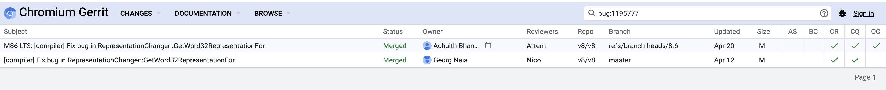

而如果只有 CVE 编号，CVE 的 References 一般会给出 issue 的短链，虽然通常该 issue 限制访问，但是仍可以通过 Gerrit 了解相关 issue 的具体修复代码，安全研究者可以根据这些修复代码对该问题进行分析，进而推测出漏洞复现代码。

难怪 Twitter 上某位研究员会说：“如果 0-Day 有 Chromium Bug Tracker 的编号，那它就不算 0-Day 了”。

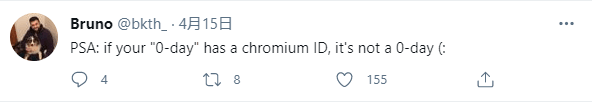

### 4.1.2 风险评估

通常，在 Chromium 官方披露漏洞或外部已出现在野利用的案例后，应进行风险评估，主要聚两个问题：

● 公司内哪些产品受漏洞影响？  
● 外部披露的 exp 是否能真实利用形成危害？

在获悉一个漏洞的存在后，安全人员需要评估漏洞对公司的影响如何。通常一个可利用的漏洞在披露后会马上有安全人员写出 exploit，而公开的 exploit 将导致利用门槛的大幅降低。因此，常常需要监控公开信息渠道的 exploit 信息，例如：监控 Github、Twitter 等平台的消息。但是早在 exploit 披露前，就可以通过

Chromium Monorail 系统中的 issues、代码 CL 或者更新日志提前了解风险。

**一个漏洞的影响评估流程可以按下面几步走：**

1、确定存在漏洞组件为哪个部分。

2、采集使用了该组件的产品（包括：使用了嵌入式浏览器的客户端、单纯使用 v8 引擎等组件的软件、使用了 chrome headless 的服务端程序）；有些产品仅使用 chrome 的一部分组件可能不受影响。例如：v8 就会影响所有用 Chromium 内核的产品，但 iOS 客户端如果用 JavaScriptCore，则不受影响。

3、确认使用存在漏洞组件的产品使用的版本是否受影响，如果产品本身对 chromium 进行定制化开发的情况下，难以根据版本确定，可以通过 PoC（部分场景下，可借助 Chromium 项目中的单元测试用例）进行黑盒测试或者白盒审计受影响代码是否存在，是否存在漏洞的触发路径。

4、原则上内存破坏类的漏洞在没有 exploit 公开的情况下也需要尽快修复，存在公开 exploit 的情况下，需要立即修复；有时候 exploit 使用到的 exploit 技术可能仅适用于某些版本的 chromium，但是并不代表这些版本之外的 chromium 完全没有利用的可能。例如使用 WebAssembly 创建 RWX pages 来写入 shellcode 的技术在客户端使用的 chromium 版本不支持，但依旧存在通过 ROP 等技术来到达 RCE 的可能性。

### 4.1.3 风险检测

#### 4.1.3.1 黑盒测试

V8 等组件会编写单元测试 js 文件，可以基于此修改形成页面，来通过黑盒的方式判断组件是否受对应漏洞影响。对于漏洞测试来说，这个资源也是极好的 TestCase。

以 CVE-2021-21224 为例，编写黑盒测试用例过程如下：

1、通过 Issue 编号定位到对应的 Chromium Gerrit 工单  
[https://chromium-review.googlesource.com/c/v8/v8/+/2838235](https://chromium-review.googlesource.com/c/v8/v8/+/2838235)

2、定位到官方提供的、针对该漏洞的单元测试文件  
[https://chromium-review.googlesource.com/c/v8/v8/+/2838235/4/test/mjsunit/compiler/regress-1195777.js](https://chromium-review.googlesource.com/c/v8/v8/+/2838235/4/test/mjsunit/compiler/regress-1195777.js)

1.  `(function() {`
2.    `function foo(b) {`
3.      `let y = (new Date(42)).getMilliseconds();`
4.      `let x = -1;`
5.      `if (b) x = 0xFFFF_FFFF;`
6.      `return y < Math.max(1 << y, x, 1 + y);`
7.    `}`
8.    `assertTrue(foo(true));`
9.    `%PrepareFunctionForOptimization(foo);`
10.    `assertTrue(foo(false));`
11.    `%OptimizeFunctionOnNextCall(foo);`
12.    `assertTrue(foo(true));`
13.  `})();`

3、基于单元测试文件修改生成黑盒测试用例  
如果仔细观察，会发现上述单元测试代码中包含%开头的函数。它们是 v8 引擎内置的 runtime 函数，用于触发 v8 引擎的某些功能特性，需要在 v8 的 debug 版本 d8 命令行工具启动时，追加—allow-natives-syntax 参数才会生效。因此，直接将上述单元测试 js 来测试是无法准确测出是否存在漏洞的。但可以通过编写 js 代码，实现相同的效果，例如：

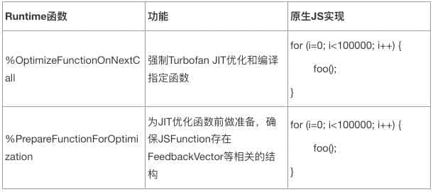

值得一提的是，前述漏洞的单元测试用例并不会造成浏览器 tab 崩溃，而只是输出的数值与预期不符。因此，可以看到上述单元测试用例中引入了 assertTrue、assertEquals 等断言方法，用于判断单元测试数值是否与预期相等。如果不等，则认为存在漏洞。在进行改造时，也要一并用自己的 JavaScript 代码替换。最终，前述官方提供的测试用例可改造如下：

1.  `function foo(b) {`
2.      `let y = (new Date(42)).getMilliseconds();`
3.      `let x = -1;`
4.      `if (b) x = 0xFFFF_FFFF;`
5.      `return y < Math.max(1 << y, x, 1 + y);`
6.  `}`
8.  `function check(val) {`
9.      `console.log(val);`
10.      `if(!val){`
11.          `alert("CVE-2021-21224 found!")`
12.      `}`
13.  `}`
15.  `// 断言函数，判断函数返回值是否为true`
16.  `// assertTrue(foo(true));`
17.  `let val1 = foo(true);`
18.  `check(val1);`
20.  `// v8内置runtime函数`
21.  `// %PrepareFunctionForOptimization(foo);`
22.  `for (i=0; i<100000; i++) {`
23.  `foo(false);`
24.  `}`
26.  `// 断言函数，判断函数返回值是否为true`
27.  `// assertTrue(foo(false));`
28.  `let val2 = foo(false);`
29.  `check(val2);`
31.  `// v8内置runtime函数`
32.  `// %OptimizeFunctionOnNextCall(foo);`
33.  `for (i=0; i<100000; i++) {`
34.  `foo(true);`
35.  `}`
37.  `// 断言函数，判断函数返回值是否为true`
38.  `// assertTrue(foo(true));`
39.  `let val3 = foo(true);`
40.  `check(val3);`

4、最终效果如下

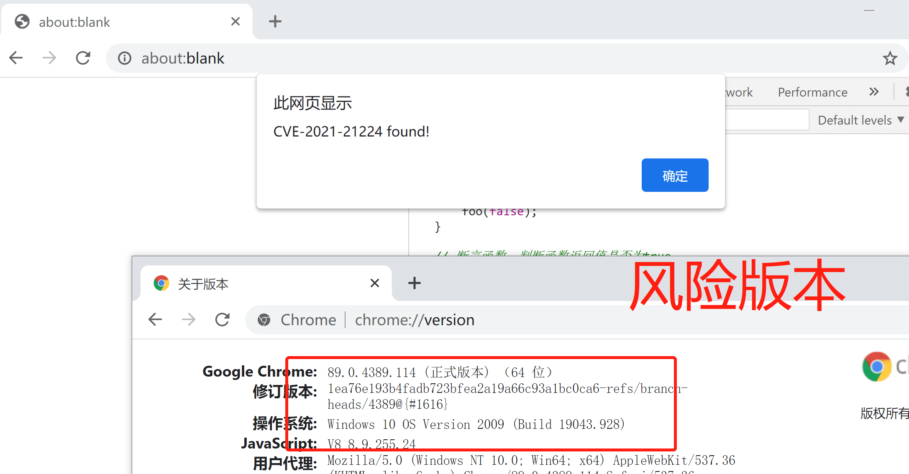  
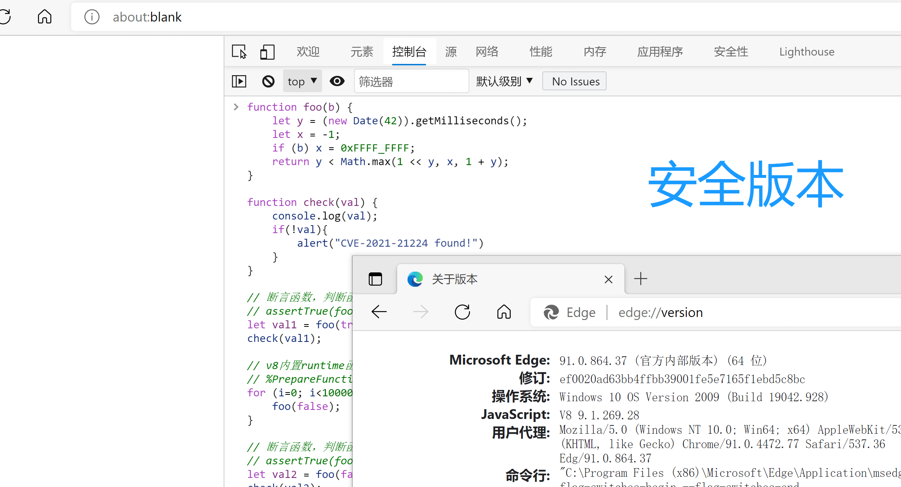

#### 4.1.3.2 静态代码扫描

如上面所述，由于 Chrome 漏洞即便在没有正式发布安全公告前，就已经有 Issue ID，且能通过 Gerrit 平台找到涉及的代码变动。因此，开发人员可以抢先在公司内部代码仓库进行全局静态代码扫描并修复问题。

| **目的** | **策略** | **目的** |
| --- | --- | --- |
| 收集包含 chromium 组件的仓库 | 扫描特定文件名特征（如有需要可添加一些代码特征） | 掌握企业内应用的组件指纹 |
| 精确判断某个 Issue 对应的代码是否已修复 | 扫描文件名特征 + 每个 Issue 对应的代码特征 | 追踪特定漏洞的修复情况 |

● **收集包含 chromium 组件的仓库**  
不同的项目可能会引入 Chromium 整体或部分相关的组件，通常可结合文件名、或特定的代码片段，在公司的代码仓库中收集包含相关指纹的仓库。

● **精确判断某个 Issue 对应的代码是否已修复**  
以要精准扫描全局代码仓库中是否存在涉及 v8 组件的 CVE-2021-21224 的漏洞代码为例。可基于 semgrep 类方案，对公司代码仓库进行全局检查，编写静态代码扫描步骤如下：

1、根据 Issue 号找到对应的漏洞修复代码变动  
● [https://chromium-review.googlesource.com/c/v8/v8/+/2838235](https://chromium-review.googlesource.com/c/v8/v8/+/2838235)  
● [https://chromium-review.googlesource.com/c/v8/v8/+/2838235/4/src/compiler/representation-change.cc](https://chromium-review.googlesource.com/c/v8/v8/+/2838235/4/src/compiler/representation-change.cc)

2、确定涉及文件 representation-change.cc，存在漏洞的代码特征为

1.  `if (output_type.Is(Type::Signed32()) ||`
2.          `output_type.Is(Type::Unsigned32())) {`
3.        `op = machine()->TruncateInt64ToInt32();`
4.      `} else if (output_type.Is(cache_->kSafeInteger) &&`
5.                 `use_info.truncation().IsUsedAsWord32()) {`
6.        `op = machine()->TruncateInt64ToInt32();`
7.  `}`

3、可编写 semgrep 规则如下

1.  `rules:`
2.  `- id: chromium-v8-1195777`
4.    `message: |`
5.      `A Type Confusion vulnerability in Chromium v8 Engine, labeled as CVE-2021-21224, is found in the project. Please fix this bug by following the [instructions](https://iwiki.woa.com/pages/viewpage.action?pageId=801201056) on iWiki.`
7.    `languages:`
8.    `- generic`
10.    `metadata:`
11.      `references:`
12.      `- https://chromereleases.googleblog.com/2021/04/stable-channel-update-for-desktop_20.html`
13.      `- https://chromium-review.googlesource.com/c/v8/v8/+/2817791/4/src/compiler/representation-change.cc`
14.      `category: security`
16.    `severity: WARNING`
18.    `pattern: |`
19.      `if (output_type.Is(Type::Signed32()) || output_type.Is(Type::Unsigned32())) {...} else if (output_type.Is(cache_->kSafeInteger) && use_info.truncation().IsUsedAsWord32()) {...}`
21.    `paths:`
22.      `include:`
23.        `- "representation-change.cc"`

4、调用命令扫描

```sql
semgrep --include=representation-change.cc --config=1195777.yml thirdparty_v8
```

5、最终效果，如下

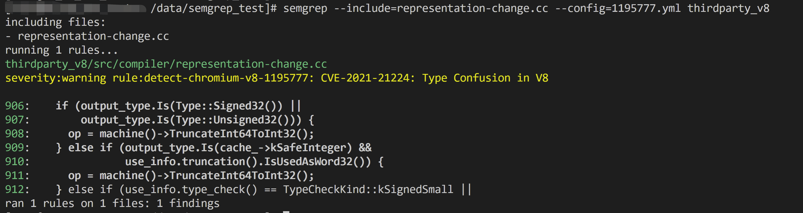

#### 4.1.3.3 主机 Agent 采集

针对部署在服务器端、且使用了 Chromium 的程序，除了上述方法之外，可以考虑借助 HIDS、EDR 或 RASP 等系统采集进程特征，排查存在风险的实例。

同时满足下面两个条件的 cmdline，其进程我们就可以认为是存在风险的：

● 程序名包含 Chrome 或 Chromium  
● 且 Cmdline 中包含 —no-sandbox 参数或 —disable-setuid-sandbox

#### 关于误报

这里大家可能会产生疑问，这里为什么单独检测 Sandbox 的开启与关闭就判断风险呢？若 Chromium 组件已经使用最新发布的 commit 编译而成，包含了所有的漏洞补丁，也一样不会受到 1Day 和 NDay 漏洞的影响。其实，这里主要考虑到 Chrome 在对漏洞修复是十分频繁的，持续的升级存在一定的维护成本，且不排除攻击者拥有 Chromium 0Day 的可能。相较之下，逃逸 Sandbox 以控制浏览器所在的主机，是比较困难的；所以要求线上业务，尽可能开启 Chromium Sandbox 特性。

#### 关于漏报

另外，以上方案若 Chrome 可执行文件被修改了文件名，则容易产生漏报。另一种可选的方案是：提取出多个 Chrome 的特有选项进行过滤。例如，headless 浏览器启动时一般不会导航至特定 url，此时命令行会存在 about:blank，再用 Chrome 特定的区别于其他浏览器的选项进行排除。

更复杂的方案可以提取出 Chrome 执行文件的文件特征，或者建立 Chrome 执行文件的 hashsum 数据库来判断进程的执行文件是否是 Chrome 浏览器，进而再筛选启动时用了不安全配置的进程。其实，我们在大规模观察相关的进程数据和运营之后，发现利用 —no-sandbox 单个因素进行进程数据分析并获取未开启 Sandbox 的 Chromium 进程，这样简单粗暴的做法并不会产生太多误报；有些进程看似非 Chromium 浏览器，但其实也集成了 Chromium 并使用 no-sandbox 参数。

## 4.2 风险修复

### 4.2.1 通用修复方案

无论是客户端还是服务端，为了解决 Chrome 漏洞的远程命令执行风险，启用 Chrome Sandbox，去除启动 Chrome 组件时的 —no-sandbox 参数都是必须推进的安全实践。

如果客户端程序直接使用了 Chrome 的最新版本，且未进行过于复杂的二次开发和迁移，没有历史包袱的话，在客户端里开启 Chrome Sandbox，其实就是使用 Chrome 组件的默认安全设计，障碍是比较小的。

此处根据不同场景和需求，存在三种不同的修复方案：

#### 方案 1. 启用 Sandbox

1、启动 Chrome 时切勿使用 —no-sandbox 参数，错误的例子如：`./bin/chrome --remote-debugging-address=0.0.0.0 --remote-debugging-port=9222 --disable-setuid-sandbox --no-sandbox`

2、使用普通用户而非 root 用户启动 chrome headless 进程

#### 方案 2. 更新 Chromium 内核版本（后续维护成本极高）:

下载 [https://download-chromium.appspot.com/](https://download-chromium.appspot.com/) 中的最新版本进行更新，并在后续迭代中持续升级到最新版（Chromium 的最新版本会编译最新的 MR 和 Commit，因此也会修复 Chrome 未修复的 0.5Day 漏洞，下载链接包含了所有的操作系统的 Chromium，例如 Linux 可访问 [https://download-chromium.appspot.com/?platform=Linux\_x64&type=snapshots](https://download-chromium.appspot.com/?platform=Linux_x64&type=snapshots) 下载）。

请注意，如果不希望相似的安全风险如之前的 Fastjson 那样需要反复跟进并且高频推动业务修复，强烈建议安全团队推动业务参考方案一开启 Sandbox，方案二可以当成短期方案规避当前风险。经统计，2010 年至今 Google 共对外公开 Chromium 高危漏洞 1800 多个；Chromium 的漏洞修复十分频繁，若不开启 Sandbox，需持续更新最新版本。

若要启用 Sandbox，需要解决一定的依赖：首先，Chrome 的 Sandbox 技术依赖于 Linux 内核版本，低版本的内核无法使用。各 Sandbox 技术 Linux 内核依赖可参考下图

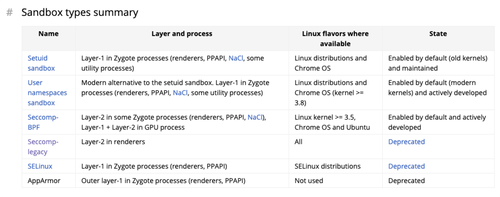

> （图片来源 官方文档 [https://chromium.googlesource.com/chromium/src/+/master/docs/linux/sandboxing.md#sandbox-types-summary）：](https://chromium.googlesource.com/chromium/src/+/master/docs/linux/sandboxing.md#sandbox-types-summary%EF%BC%89%EF%BC%9A)

Chrome 运行时会寻找 chrome-sandbox 文件，一般下载 Chrome 的 Release 时，Chrome 程序目录下都包含了 Sandbox 程序，若无法寻找到 chrome-sandbox 文件可能会产生下述 Error 信息：

\[0418/214027.785590:FATAL:zygote\_host\_impl\_linux.cc(116)\] No usable sandbox! Update your kernel or see [https://chromium.googlesource.com/chromium/src/+/master/docs/linux/suid\_sandbox\_development.md](https://chromium.googlesource.com/chromium/src/+/master/docs/linux/suid_sandbox_development.md) for more information on developing with the SUID sandbox. If you want to live dangerously and need an immediate workaround, you can try using —no-sandbox.

可参考  
[https://github.com/puppeteer/puppeteer/blob/main/docs/troubleshooting.md#alternative-setup-setuid-sandbox](https://github.com/puppeteer/puppeteer/blob/main/docs/troubleshooting.md#alternative-setup-setuid-sandbox) 进行配置。若服务器的 Chrome 目录下包含了 chrome-sandbox 文件，则可以直接修改配置运行，若不包含，可前往 [https://download-chromium.appspot.com/](https://download-chromium.appspot.com/) 下载对应版本的 chrome-sandbox 文件使用。(注：Chrome 可执行文件的同一目录内包含 chrome-sandbox 程序，则无需手动设置 CHROME\_DEVEL\_SANDBOX 环境变量)

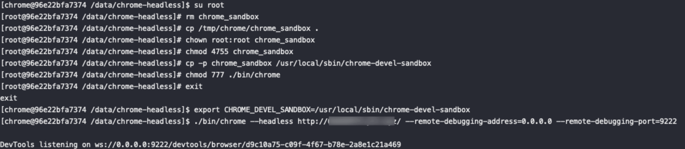

#### 方案 3、客户端选择系统默认浏览器打开外链 URL

另外一个更加合适合理的设计是尽量避免使用应用内置的浏览器打开开放性 URL 页面。我们应该尽量使用系统的浏览器去打开非公司域名的 URL 链接（同时应该注意公司域名下的 URL 跳转风险）；把打开 URL 的能力和场景交还给系统浏览器或专门的浏览器应用；保障应用内加载的资源都是可控的。

此方案同样适用于：客户端内置的 Chromium Webview 组件短时间内无法随系统快速更新，且由于历史包袱无法 Webview 组件无法开启沙箱。此时，在客户端引入一个“降级”逻辑，将不可信的页面跳转交给系统默认的浏览器打开。由于系统默认的浏览器通常默认是打开沙箱的，因此不失为一种“缓兵之计”。

### 4.2.2 云原生时代下，针对 Chrome 组件容器化的风险修复指引

业界云原生实践的发展非常迅速，企业应用容器化、组件容器化的脚步也势不可挡。从当前的 Kubernetes 应用设计的角度出发，Chrome Headless 组件在逻辑上是非常适用于无状态应用的设计的，所以 Chrome 组件在容器化的进程也比较快。也因此，在 HIDS 进程大盘中，启用 —no-sandbox 的 Chrome headless 进程也一直在持续增多。

如果 Chrome 浏览器组件已经实现了容器化，那么您想使用 Chrome sandbox 肯定会遇到各种麻烦；网络上有很多不完全安全的建议和文档，请尽量不要给容器添加 privileged 权限和 SYS\_ADMIN 权限，这将可能引入新的风险，详情可参考我们之前的文章《[红蓝对抗中的云原生漏洞挖掘及利用实录](https://mp.weixin.qq.com/s/Aq8RrH34PTkmF8lKzdY38g "红蓝对抗中的云原生漏洞挖掘及利用实录")》。

我们应该尽量使用例如 —security-opt 的方案对容器权限进行可控范围内的限制，构建一个 Seccomp 白名单用于更安全的支持容器场景，这是一个足够优雅且较为通用的方式。如果企业已经践行了 K8s 容器集群安全管理的规范和能力，在集群内新建带有 privileged 权限或 SYS\_ADMIN 权限的应用容器是会被集群管理员明确拒绝的，Seccomp 是一个安全且可管理的方案。

你可以参考下述方式启动一个带有 seccomp 配置的容器：  
docker run -it —security-opt seccomp:./chrome.json chrome-sandbox-hub-image-near —headless —dump-dom [https://github.com/neargle](https://github.com/neargle)

实际上 seccomp 配置文件规定了一个可管理的 syscall 白名单，我们的配置文件就是需要把 Sandbox 所需的系统权限用白名单方式赋予给容器，使得容器可以调用多个原本默认禁止的 syscall。可以使用下列命令来检测当前的操作系统是否支持 seccomp:  
➜ grep CONFIG\_SECCOMP= /boot/config-$(uname -r)  
CONFIG\_SECCOMP=y

如果你的容器使用 K8s 进行部署，那你可以在 spec.securityContext.seccompProfile 中配置上述 chrome.json 文件。

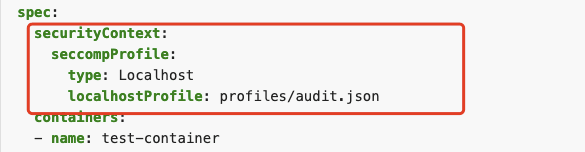

通过白名单设置 Chrome 所需的 syscall 以最小化容器权限，避免容器逃逸的风险，同时也符合多租户容器集群的安全设计，是一个推荐的方案；设置 Seccomp 后，容器内可正常启用 chrome-sandbox，如下图。

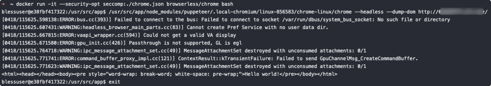

根据在 HIDS 收集到的资产和内部操作系统的特性，可以利用 strace 工具很容易收集到启动 Sandbox 所需的 SysCall，并根据 SysCall 编写所需的 seccomp 配置文件。当然直接使用开源社区里现成的配置文件也能适用于绝大部分环境，著名前端测试工具 lighthouse 所用的配置文件是一个非常不错的参考：[https://github.com/GoogleChrome/lighthouse-ci/blob/main/docs/recipes/docker-client/seccomp-chrome.json。](https://github.com/GoogleChrome/lighthouse-ci/blob/main/docs/recipes/docker-client/seccomp-chrome.json%E3%80%82)

# V. 总结

随着 Chromium 在企业各场景下的广泛应用，需要针对性地设置风险例行检测及应急响应方案，涉及的风险与应用场景、检查及修复方式，可概括如下：

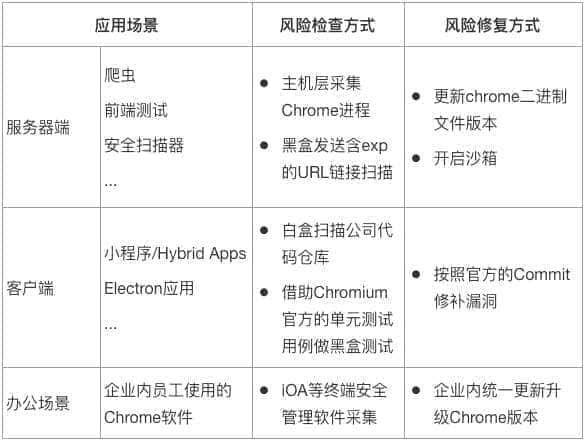

除 Chromium 外，企业开发时也不乏会涉及到 Safari、Firefox 等其他浏览器类组件的场景，在进行风险排查和响应时可借鉴类似的思路。

# 参考及引用

\[1\] Linux Sandboxing  
[https://chromium.googlesource.com/chromium/src/+/HEAD/docs/linux/sandboxing.md](https://chromium.googlesource.com/chromium/src/+/HEAD/docs/linux/sandboxing.md)  
\[2\] The Security Architecture of the Chromium Browser  
[https://seclab.stanford.edu/websec/chromium/chromium-security-architecture.pdf](https://seclab.stanford.edu/websec/chromium/chromium-security-architecture.pdf)  
\[3\] My Take on Chrome Sandbox Escape Exploit Chain  
[https://medium.com/swlh/my-take-on-chrome-sandbox-escape-exploit-chain-dbf5a616eec5](https://medium.com/swlh/my-take-on-chrome-sandbox-escape-exploit-chain-dbf5a616eec5)  
\[4\] Linux SUID Sandbox  
[https://chromium.googlesource.com/chromium/src/+/HEAD/docs/linux/suid\_sandbox.md](https://chromium.googlesource.com/chromium/src/+/HEAD/docs/linux/suid_sandbox.md)  
\[5\] How Blink Works  
[https://docs.google.com/document/d/1aitSOucL0VHZa9Z2vbRJSyAIsAz24kX8LFByQ5xQnUg/edit](https://docs.google.com/document/d/1aitSOucL0VHZa9Z2vbRJSyAIsAz24kX8LFByQ5xQnUg/edit)  
\[6\] Chrome 浏览器引擎 Blink & V8  
[https://zhuanlan.zhihu.com/p/279920830](https://zhuanlan.zhihu.com/p/279920830)  
\[7\] Blink-in-JavaScript  
[https://docs.google.com/presentation/d/1XvZdAF29Fgn19GCjDhHhlsECJAfOR49tpUFWrbtQAwU/htmlpresent](https://docs.google.com/presentation/d/1XvZdAF29Fgn19GCjDhHhlsECJAfOR49tpUFWrbtQAwU/htmlpresent)  
\[8\] core/script: How a Script Element Works in Blink  
[https://docs.google.com/presentation/d/1H-1U9LmCghOmviw0nYE\_SP\_r49-bU42SkViBn539-vg/edit#slide=id.gc6f73](https://docs.google.com/presentation/d/1H-1U9LmCghOmviw0nYE_SP_r49-bU42SkViBn539-vg/edit#slide=id.gc6f73)  
\[9\] \[TPSA21-12\] 关于 Chrome 存在安全问题可能影响 Windows 版本微信的通告  
[https://mp.weixin.qq.com/s/qAnxwM1Udulj1K3Wn2awVQ](https://mp.weixin.qq.com/s/qAnxwM1Udulj1K3Wn2awVQ)  
\[10\] Hacking Team Android Browser Exploit 代码分析  
[https://security.tencent.com/index.php/blog/msg/87](https://security.tencent.com/index.php/blog/msg/87)  
\[11\] 物联网安全系列之远程破解 Google Home  
[https://security.tencent.com/index.php/blog/msg/141](https://security.tencent.com/index.php/blog/msg/141)  
\[12\] Android Webview UXSS 漏洞攻防  
[https://security.tencent.com/index.php/blog/msg/70](https://security.tencent.com/index.php/blog/msg/70)

# VI. 团队介绍

### 关于腾讯蓝军

腾讯蓝军（Tencent Force）由腾讯 TEG 安全平台部于 2006 年组建，十余年专注前沿安全攻防技术研究、实战演练、渗透测试、安全评估、培训赋能等，采用 APT 攻击者视角在真实网络环境开展实战演习，全方位检验安全防护策略、响应机制的充分性与有效性，最大程度发现业务系统的潜在安全风险，并推动优化提升，助力企业领先于攻击者，防患于未然。

腾讯蓝军坚持以攻促防、攻防相长，始终与时俱进，走在网络安全攻防实战研究的最前沿。未来，腾讯蓝军也将继续通过攻防多方视角，探索互联网安全新方向，共建互联网生态安全。

### 关于腾讯研发安全团队

腾讯公司内部与自研业务贴合最紧密的一线安全工程团队之一。团队负责软件生命周期各阶段的安全机制建设，包括：制定安全规范/标准/流程、实施内部安全培训、设计安全编码方案、构建安全漏洞检测（SAST/DAST/IAST）与 Web 应用防护（WAF）系统等。

在持续为 QQ、微信、云、游戏等重点业务提供服务外，也将积累十余年的安全经验向外部输出。通过为腾讯云的漏洞扫描、WAF 等产品提供底层技术支撑，助力产业互联网客户安全能力升级。
