# 智能合约安全之业务逻辑缺陷介绍 - 先知社区

智能合约安全之业务逻辑缺陷介绍

- - -

## 文章前言

智能合约作为区块链技术的重要组成部分正在逐渐改变着金融、供应链和其他行业的商业模式，然而随着智能合约应用的快速增长，合约中的业务逻辑缺陷也成为了一个严重的安全挑战。智能合约的业务逻辑缺陷是指在合约的设计和实现过程中存在的错误或漏洞，导致意外的行为或安全漏洞，这些缺陷可能导致资金丢失、数据泄露、访问控制问题以及恶意操作等风险，因此了解和预防常见的业务逻辑缺陷对于确保智能合约的安全性至关重要，本文将重点介绍智能合约安全中的常见业务逻辑缺陷

## 逻辑缺陷

### 任意转账缺陷

#### 风险介绍

在智能合约中 transferFrom 是一种常见的函数或方法，它主要用于在代币合约中实现转账功能，它是基于以太坊平台上的 ERC-20 标准合约的一部分，用于允许授权的地址从发送者账户中转移代币到目标地址，transferFrom 函数通常需要满足一些前置条件以确保转账的安全性和合法性。首先，合约调用者必须获得发送者账户的授权，这可以通过 approve 函数来实现，发送者账户授权给合约调用者一定数量的代币。其次，转账的数量必须小于等于发送者账户的余额并且发送者账户必须有足够的代币可供转移，然而部分开发人员在开发时并没有考虑授权检测业务逻辑以及数值的溢出校验，导致授权检测被绕过

#### 风险示例

在下面的合约中的 allowed\[\_from\]\[msg.sender\] -= \_value;用于更新授权额度，但是在更新之前没有做授权检查，也就是说如果一个用户去调用 transferFrom 从 A 账户向 B 账户转账时，不校验授权额度，同时由于初始授权额度为 0，而转账的额度不为 0，所以后期导致用户授权额度会在 L85 发生下溢，从而变为一个较大的值，使得用户可以转走 A 账户的所有资产，用一句话来说就是任意用户可以调用合约的 transferFrom 函数转走任意用户任意数量的 token，而无需用户进行授权，从而间接性的绕过授权校验  
[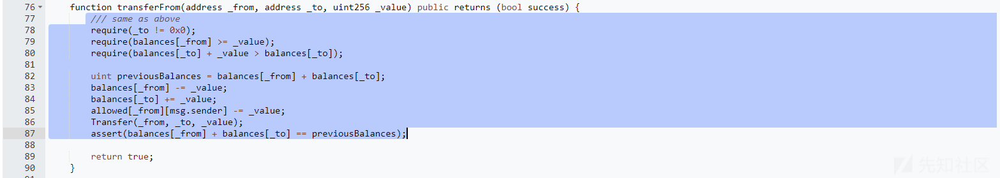](https://xzfile.aliyuncs.com/media/upload/picture/20240229160255-f201ee82-d6d8-1.png)

#### 处置建议

建议在转账之前优先校验授权额度是否大于要转账的额度，例如：

```plain
require(allowed[_from][msg.sender] >= _value);
```

### 不一致性检查

#### 风险介绍

智能合约中所谓的不一致性检查是指我们要更新的操作和前置的预检查内容不同，例如：我们在转账时要更新发送者账户所持的资产数量，而在此之前我们需要预检查该账户所持的资产数量是否足够，而常见的不一致性则是在检查时检查的资产数量为其他地址账户的资产数量，后续更新则是更新的是当前地址账户所持有的资产数量，在这种情况下如果没有使用 SafeMath 函数进行数值运算或者通过编译器高版本进行溢出防御则会进一步引发溢出风险，攻击者可以结合业务逻辑缺陷实施恶意转账

#### 简易示例

如下面的代码所示，条件检测语句"require(balances\[msg.sender\] >= \_value);"与"balances\[\_from\] -= \_value;"更新语句存在不一致性，攻击者能够通过溢出让`_from`账户余额获得极大的 token 数量

[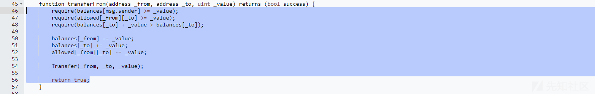](https://xzfile.aliyuncs.com/media/upload/picture/20240229161017-f94e407c-d6d9-1.png)

下面我们进行一个简单的演示：

-   管理者：0x5B38Da6a701c568545dCfcB03FcB875f56beddC4
-   攻击者 1:0xAb8483F64d9C6d1EcF9b849Ae677dD3315835cb2
-   攻击者 2:0x4B20993Bc481177ec7E8f571ceCaE8A9e22C02db

我们首先通过管理者地址给攻击者 1 地址打一定数量的代币进去，来模拟攻击者 1 充值 token：

```plain
0xAb8483F64d9C6d1EcF9b849Ae677dD3315835cb2,100000000000000
```

[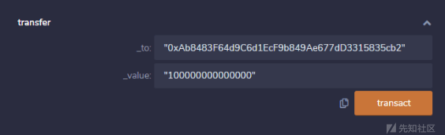](https://xzfile.aliyuncs.com/media/upload/picture/20240229161150-3116b264-d6da-1.png)  
交易日志信息：  
[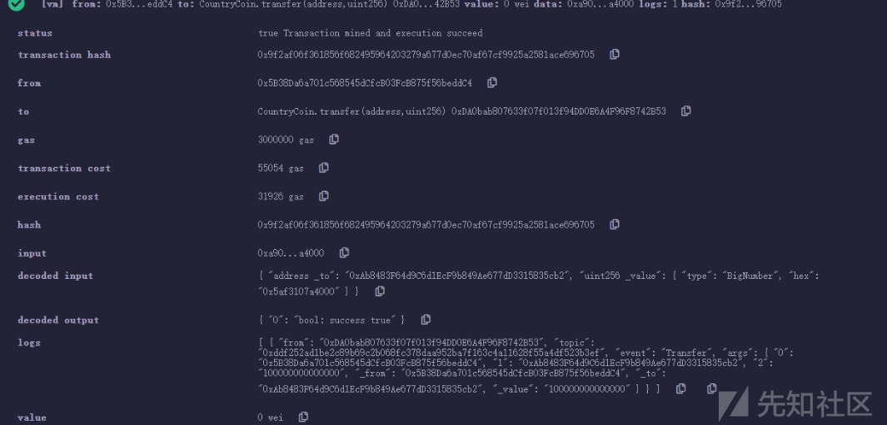](https://xzfile.aliyuncs.com/media/upload/picture/20240229161204-393d67b2-d6da-1.png)  
之后攻击者 1 的地址所拥有的 token 数量为：  
[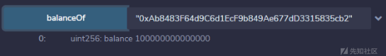](https://xzfile.aliyuncs.com/media/upload/picture/20240229161216-4047f874-d6da-1.png)  
另一个攻击者 2 地址账户余额为 0  
[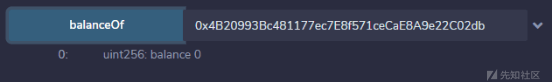](https://xzfile.aliyuncs.com/media/upload/picture/20240229161229-485220f8-d6da-1.png)  
接下来我们的攻击就是让第二个账户溢出，之后使用攻击者 2 给予攻击者 1 一定的转账额度权限

```plain
approve: 
"0xAb8483F64d9C6d1EcF9b849Ae677dD3315835cb2",10000
```

切换回攻击者 1，然后使用 transferFrom 向自己进行转账操作

```plain
transferFrom： 
"0x4B20993Bc481177ec7E8f571ceCaE8A9e22C02db","0xAb8483F64d9C6d1EcF9b849Ae677dD3315835cb2",10000
```

[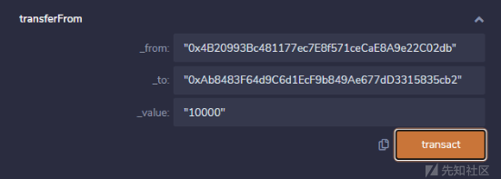](https://xzfile.aliyuncs.com/media/upload/picture/20240229161304-5ca3a004-d6da-1.png)  
交易日志如下：

[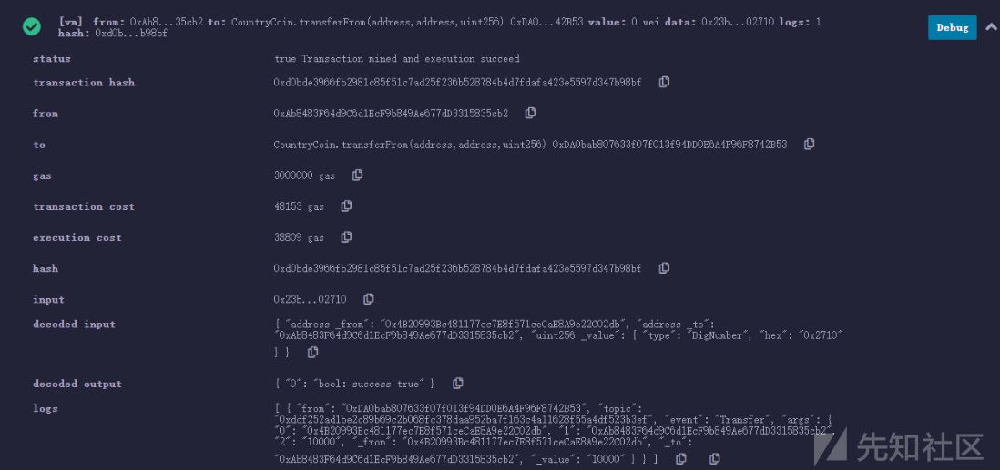](https://xzfile.aliyuncs.com/media/upload/picture/20240229161315-63b8f4f2-d6da-1.png)

此时攻击者 2 地址上余额本来为 0，但经过“的减法计算下溢变为了一个极大值

[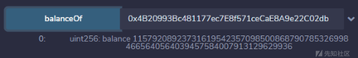](https://xzfile.aliyuncs.com/media/upload/picture/20240229161325-6974b7f0-d6da-1.png)

#### 处置建议

1、使用 safeMath 方法进行计算  
2、使用 balances\[\_from\] >= \_value 作为条件判断而非 balances\[msg.sender\]  
3、检查 allowed\[\_from\]\[msg.sender\]并对 allowed\[\_from\]\[msg.sender\]进行操作不要与 allowed\[\_from\]\[\_to\]混用

### 紧急提款缺陷

#### 风险介绍

智能合约中的 emergencyWithdraw 是指在合约发生异常情况时，用户可以通过该函数将其余的资金提取出来，避免资金损失，该函数通常被用于紧急情况下的资金提取，例如：合约被黑客攻击或合约出现漏洞等，但是如果合约中的该函数业务逻辑设计不当也会导致严重的提款安全问题

#### 风险示例

下面合约中的 emergencyWithdraw 函数用于紧急提款操作，但是在提款时用户资产 (user.amount) 未提前保留状态值，之后直接置空，导致在 L178 进行提款操作时用户提取的资产永久为 0，此时只要用户调用 emergencyWithdraw 进行提款操作，那么必然会导致最终提款的资产数量归零，此时的 emergencyWithdraw 函数相当喻一个"死亡"函数  
[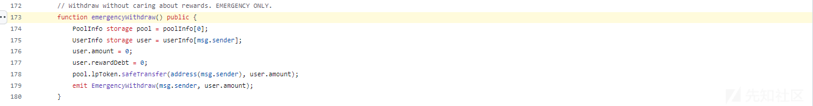](https://xzfile.aliyuncs.com/media/upload/picture/20240229161709-ef1e6716-d6da-1.png)

#### 修复方案

关于上述安全问题我们可以通过使用一个临时变量来缓存我们的提款数值，随后在进行转账函数调用的时候直接传入此临时变量即可，简易修复代码如下所示：

```plain
function emergencyWithdraw(uint256 _pid) public {
        PoolInfo storage pool = poolInfo[_pid];
        UserInfo storage user = userInfo[_pid][msg.sender];
        uint256 amount = user.amount;
        user.amount = 0;
        user.rewardDebt = 0;
        pool.lpToken.safeTransfer(address(msg.sender), amount);
        emit EmergencyWithdraw(msg.sender, _pid, amount);
    }
```

### 代币销毁缺陷

#### 风险描述

智能合约提供了代币销毁函数 (通常为 burn) 用于进行代币的销毁操作，其中主要涉及两个参数，一个是要销毁的代币的持有者地址参数，另外一个是要销毁的代币的资产数量，这两个参数其实都可能会导致安全问题，当我们的代币销毁函数中的代币销毁数量缺乏额度检查且没有任何防止溢出检查时，那么将导致整形溢出问题，当然这不是我们这一个小环节讨论的安全问题，我们这里要介绍的时另外一种情况————代币销毁地址参数可控，当我们的代币销毁地址参数可控时，我们可以通过传入任意用户的地址来实现对任意用户资产数量的销毁操作

#### 示例代码

从下面的代码中可以看到该函数被 OnlyOwner 修饰器修饰，此修饰器要求合约的 owner 才能调用此函数，但是此时的关键问题在于此处的 from 地址参数是可控的，此时我们的 owner 可以传入任意用户的地址实现对任意地址所持资产数量的销毁操作，智能合约中的——中级后门 (因为只能进行恶意操作，并不能将任意地址所持的资产直接划分到自己的地址中去)

```plain
/**
     * @dev Burns a specific amount of tokens.
     * @param _from The address that will burn the tokens.
     * @param _unitAmount The amount of token to be burned.
     */
    function burn(address _from, uint256 _unitAmount) onlyOwner public {
      require(_unitAmount > 0
              && balanceOf(_from) >= _unitAmount);

      balances[_from] = SafeMath.sub(balances[_from], _unitAmount);
      totalSupply = SafeMath.sub(totalSupply, _unitAmount);
      Burn(_from, _unitAmount);
    }
```

#### 处置建议

目前 Opeenzeepline 官方提供了标准函数-burn，我们可以通过使用官方提供的函数来实现安全防护：

```plain
// SPDX-License-Identifier: MIT
// OpenZeppelin Contracts (last updated v5.0.0) (token/ERC20/extensions/ERC20Burnable.sol)

pragma solidity ^0.8.20;

import {ERC20} from "../ERC20.sol";
import {Context} from "../../../utils/Context.sol";

/**
 * @dev Extension of {ERC20} that allows token holders to destroy both their own
 * tokens and those that they have an allowance for, in a way that can be
 * recognized off-chain (via event analysis).
 */
abstract contract ERC20Burnable is Context, ERC20 {
    /**
     * @dev Destroys a `value` amount of tokens from the caller.
     *
     * See {ERC20-_burn}.
     */
    function burn(uint256 value) public virtual {
        _burn(_msgSender(), value);
    }

    /**
     * @dev Destroys a `value` amount of tokens from `account`, deducting from
     * the caller's allowance.
     *
     * See {ERC20-_burn} and {ERC20-allowance}.
     *
     * Requirements:
     *
     * - the caller must have allowance for ``accounts``'s tokens of at least
     * `value`.
     */
    function burnFrom(address account, uint256 value) public virtual {
        _spendAllowance(account, _msgSender(), value);
        _burn(account, value);
    }
}
```

### 冻结账户检测

#### 风险介绍

在智能合约中有一种安全机制————账户冻结机制，当出现恶意操作的地址账户时可以通过冻结操作将地址账户进行冻结，使其无法进行正常的交易操作，但是有时候我们在进行转账时可能并不是很了解我们要转账过去的地址是否已被冻结，所以部分存在账户冻结机制的合约在转账函数中都有提供对账户是否冻结的检查，而此类风险点在于很多研发人员缺少安全意识或者是偷懒，只检查了 from 地址账户是否处于冻结，而对于 to 地址账户的状态一点点也不关心，从而导致我们自己在转账的时候永远有资产可以被转出，目标地址的资产由于被冻结也导致无法使用，白白浪费

#### 风险示例

在下面的代码中代币转账时只单方面的校验了代币来源账户是否冻结而未校验目标还在那更好是否冻结，从而导致转入冻结账户的代币后续无法转出。

[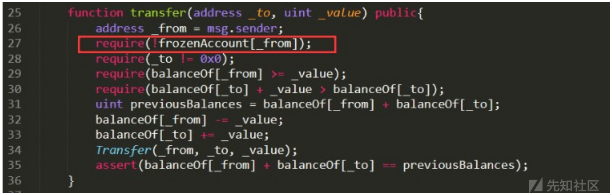](https://xzfile.aliyuncs.com/media/upload/picture/20240229174107-a9c7eea6-d6e6-1.png)

#### 修复建议

在进行代币转账时对代币来源账户、代币接受账户全部进行检查，判断是否处于冻结状态

### Require 条件检查

#### 风险介绍

在智能合约中 require 是一种常见的函数或指令，用于实现条件检查和错误处理，它在智能合约编程中起着重要的作用，用于确保在执行合约代码时满足特定的条件，以避免潜在的错误或异常情况。require 函数可以用于检查合约执行过程中的条件是否满足。例如：可以使用 require 来检查输入参数的有效性、检查账户的余额是否足够、检查合约调用者是否具有特定的权限等，如果条件不满足，require 函数会中止当前的合约执行，并将所有状态还原到调用前的状态，而我们在进行业务逻辑判断的时候会使用到一系列的逻辑关系运算符包括：||、&&等，如果中间使用不当或者判断条件边界容易被打破，那么依旧会造成资产损失

#### 风险示例

如下图所示，这里的 withdrawalSecurity 用于提取保证金，在对应的逻辑中 user 为函数调用者，经过一系列的结构化查找 (从 user 地址到 index，在从 mapping 中的 index 索引到 mapping 等等一系列操作)，之后来到提现判断条件：require(msg.value == amount, "amount not equals required value"); ，该条件看似没有什么问题，但是此时如果任意用户转入一笔很小量的资金到调用者账户来打破 msg.value == amount 的平衡，那么将导致直接回滚之前的操作，此时的用户无法提取保证金，导致 DOS 问题产生，但是该漏洞有一个弊端就是攻击者需要花费一部分资产来打破这种平衡，属于"自损利用型 DOS 攻击"  
[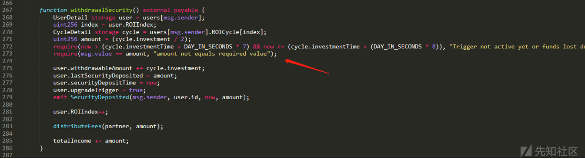](https://xzfile.aliyuncs.com/media/upload/picture/20240229175703-e362c224-d6e8-1.png)

#### 修复建议

更改判断逻辑中的边界条件：  
require(msg.value >= amount, "amount not equals required value");

## 文末小结

本篇文章我们主要对智能合约中的业务逻辑设计缺陷进行了介绍并给出了对应的实际示例，由于部分涉及到攻击操作，所以这里就不给出合约的地址了，当然大家在平时进行审计的时候也阔以多多啃一下业务逻辑，其中多看几遍可能有新的发现~
