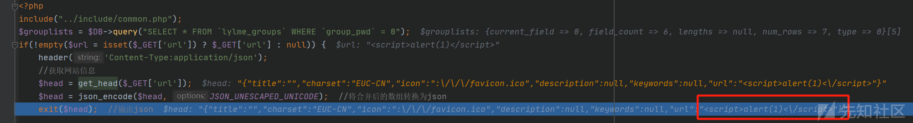
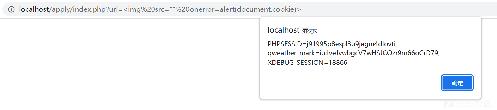
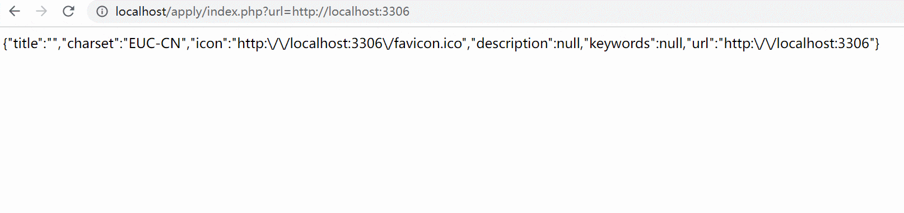
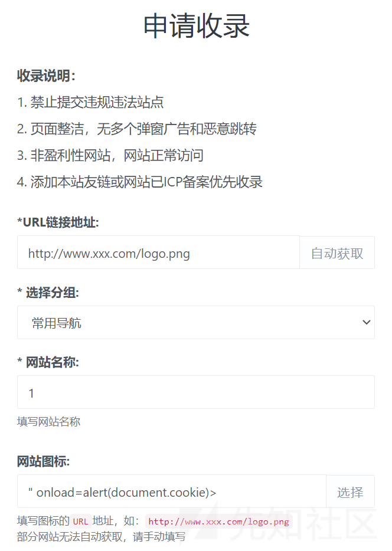
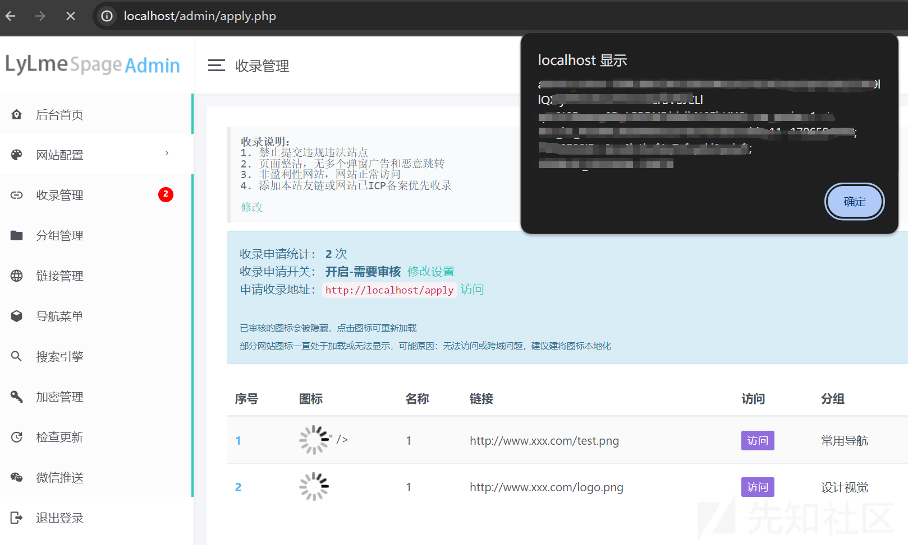
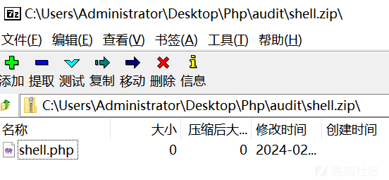
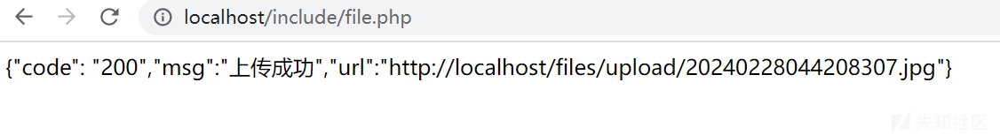
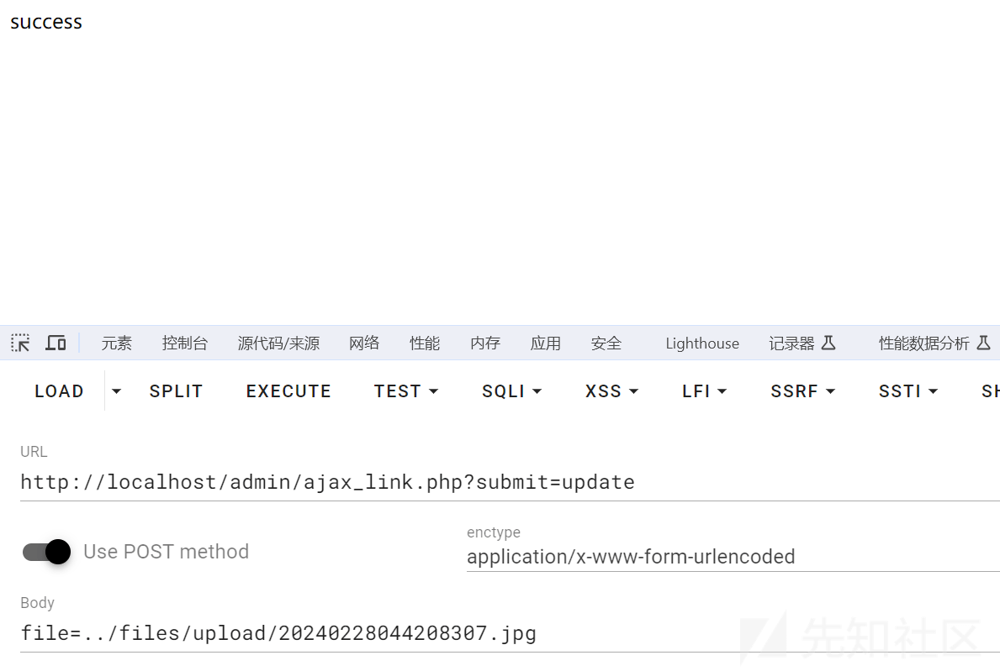
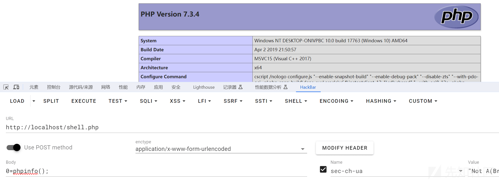

# 某导航站系统代码审计 - 先知社区

某导航站系统代码审计

- - -

### 前言

六零导航页 (LyLme Spage) 是一款上网导航和搜索入口 web 应用，支持后台添加链接、自定义搜索引擎。使用 PHP+MySql。

### 反射型 XSS&SSRF

在 apply\\index.php 中 url 参数被传递给 get\_head()。

```plain
<?php
include("../include/common.php");
$grouplists = $DB->query("SELECT * FROM `lylme_groups` WHERE `group_pwd` = 0");
if(!empty($url = isset($_GET['url']) ? $_GET['url'] : null)) {
    header('Content-Type:application/json');
    //获取网站信息
    $head = get_head($_GET['url']);
    $head = json_encode($head, JSON_UNESCAPED_UNICODE);  //将合并后的数组转换为 json
    exit($head);  //输出 json
```

跟进 include\\function.php#get\_head()，url 参数被添加到了数组 $get\_heads 并返回，那么这里是存在 XSS 的。

```plain
function get_head($url)
{
    header("Content-type:text/html;charset=utf-8");
    $data = get_curl($url);
    //获取网站 title
    preg_match('/<title.*?>(?<title>.*?)<\/title>/sim', $data, $title);
    $encode = mb_detect_encoding($title['title'], array('GB2312','GBK','UTF-8', 'CP936'));
    //得到字符串编码
    $file_charset = iconv_get_encoding()['internal_encoding'];
    //当前文件编码
    if ($encode != 'CP936' && $encode != $file_charset) {
        $title =  iconv($encode, $file_charset, $title['title']);
        $data = iconv($encode, $file_charset, $data);
    } else {
        $title = $title['title'];
    }
    // 获取网站 icon
    preg_match('/<link rel=".*?icon" * href="(.*?)".*?>/is', $data, $icon);
    preg_match('/<meta +name *=["\']?description["\']? *content=["\']?([^<>"]+)["\']?/i', $data, $description);
    preg_match('/<meta +name *=["\']?keywords["\']? *content=["\']?([^<>"]+)["\']?/i', $data, $keywords);
    $icon = $icon[1];
    if(!empty($icon)) {
        $icon = get_urlpath($icon, $url);
    } else {
        $parse = parse_url($url);
        $port = $parse['port'] == 80 || $parse['port'] == "" ? '' : ":" . $parse['port'];
        $iconurl = $parse['scheme'] . '://' . $parse['host'] . $port . '/favicon.ico';
        if(get_curl($iconurl) != 404) {
            $icon = $iconurl;
        }
    }
    $get_heads = array("title" => $title,"charset" => $encode,"icon" => $icon,"description" => $description[1],"keywords" => $keywords[1],"url" => $url);
    return $get_heads;
}
```

发起请求 [http://localhost/apply/index.php?url=%3Cscript%3Ealert(1)%3C/script%3E&XDEBUG\_SESSION\_START=18866](http://localhost/apply/index.php?url=%3Cscript%3Ealert(1)%3C/script%3E&XDEBUG_SESSION_START=18866) 调试。url 参数在经过 json\_encode() 的处理之后 / 被转义了。  
[](https://xzfile.aliyuncs.com/media/upload/picture/20240226131302-b763d562-d465-1.png)

这里可以使用  的方式进行绕过。  
[](https://xzfile.aliyuncs.com/media/upload/picture/20240226131714-4d997348-d466-1.png)

除了 XSS 此处还存在 SSRF。在 include\\function.php#get\_head() 中，url 参数被传递给 include\\function.php#get\_curl()，跟进到该函数，可以看到该函数里调用了 curl 请求，那么这里是存在 SSRF 漏洞的，可以用于探测内网，由于没有回显数据，所以无法使用 file:// 达到任意文件读取。

```plain
function get_curl($url)
{
    $curl = curl_init();
    curl_setopt_array($curl, array(
        CURLOPT_URL => $url,
        CURLOPT_RETURNTRANSFER => true,
        CURLOPT_ENCODING => '',
        CURLOPT_MAXREDIRS => 10,
        CURLOPT_TIMEOUT => 0,
        CURLOPT_FOLLOWLOCATION => true,
        CURLOPT_HTTP_VERSION => CURL_HTTP_VERSION_1_1,
        CURLOPT_CUSTOMREQUEST => 'GET',
        CURLOPT_HTTPHEADER => array(
            'Mozilla/5.0 (Windows NT 10.0; Win64; x64) AppleWebKit/537.36 (KHTML, like Gecko) Chrome/101.0.4951.54 Safari/537.36 Edg/101.0.1210.39 Lylme/11.24'
            ),
        ));
    $contents = curl_exec($curl);
    $httpCode = curl_getinfo($curl, CURLINFO_HTTP_CODE);
    curl_close($curl);
    if($httpCode == 404) {
        return $httpCode;
    }
    return $contents;
}
```

可以通过请求的延时来判断内网是否启动某些服务。  
[](https://xzfile.aliyuncs.com/media/upload/picture/20240226132853-ee263cd2-d467-1.gif)

### 存储型 XSS

在 apply\\index.php，apply() 方法传入了一些 POST 参数。

```plain
} elseif(isset($_GET['submit']) == 'post') {
    if(isset($_REQUEST['authcode'])) {
        session_start();
        if(strtolower($_REQUEST['authcode']) == $_SESSION['authcode']) {
            $status = isset($conf["apply"]) ? $conf["apply"] : 0;
            if($status == 2) {
                exit('{"code": "400", "msg": "网站已关闭收录"}');
            }
            exit(apply($_POST['name'], $_POST['url'], $_POST['icon'], $_POST['group_id'], $status));
        } else {
            exit('{"code": "-6", "msg": "验证码错误"}');
        }
    }
    exit();
}
```

跟进 include\\function.php#apply()，可以看到传入的参数会经过 daddslashes() 和 strip\_tags() 处理，然后被插入数据库中，那么完整的 HTML 标签是无法使用了。

```plain
function apply($name, $url, $icon, $group_id, $status)
{
    $name = strip_tags(daddslashes($name));
    $url = strip_tags(daddslashes($url));
    $icon = strip_tags(daddslashes($icon));
    $group_id = strip_tags(daddslashes($group_id));
    $userip = get_real_ip();
    $date = date("Y-m-d H:i:s");
    if(empty($name) || empty($url) || empty($group_id)) {
        //|| empty($icon)
        return('{"code": "-1", "msg": "必填项不能为空"}');
    } elseif(!preg_match('/^http*/i', $url)) {
        return('{"code": "-2", "msg": "链接不符合要求"}');
    } elseif(strlens($name) || strlens($url) || strlens($icon) || strlens($group_id) || strlens($userip)) {
        return('{"code": "500", "msg": "非法参数"}');
    } else {
        global $DB;
        if($DB->num_rows($DB->query("SELECT * FROM `lylme_apply` WHERE `apply_url` LIKE '" . $url . "';")) > 0) {
            return('{"code": "-3", "msg": "链接已存在，请勿重复提交"}');
        }
        $sql = "INSERT INTO `lylme_apply` (`apply_id`, `apply_name`, `apply_url`, `apply_group`, `apply_icon`, `apply_desc`, `apply_time`, `apply_status`) VALUES (NULL, '" . $name . "', '" . $url . "', '" . $group_id . "', '" . $icon . "', '" . $userip . "', '" . $date . "', '" . $status . "');";
        if($DB->query($sql)) {
            switch ($status) {
                case 0:
                    return('{"code": "200", "msg": "请等待管理员审核"}');
                    break;
                case 1:
                    if(ins_link($name, $url, $icon, $group_id, $status, $userip)) {
                        return('{"code": "200", "msg": "网站已收录"}');
                    } else {
                        return('{"code": "-5", "msg": "请联系网站管理员"}');
                    }
                    break;
            }
        } else {
            return('{"code": "-4", "msg": "未知错误，请联系网站管理员"}');
        }
    }
}
```

跟进 include\\function.php#daddslashes()，可以看到调用了 addslashes()，那么 SQL 注入也不存在了。

```plain
function daddslashes($string)
{
    if(is_array($string)) {
        foreach($string as $key => $val) {
            $string[$key] = daddslashes($val);
        }
    } else {
        $string = addslashes($string);
    }
    return $string;
}
```

提交的数据会被后台管理员审核，在后台审核页面 admin\\apply.php 代码里看到 $res\["apply\_icon"\] 被拼接到 img 标签里，那么这里我们可以构造没有完整 HTML 标签的 XSS payload：`" onload=alert(document.cookie)>`即可绕过 daddslashes() 和 strip\_tags()。

```plain
<?php
            $rs = $DB->query("SELECT * FROM `lylme_apply` ORDER BY `lylme_apply`.`apply_time` DESC");
    $i=0;
    while ($res = $DB->fetch($rs)) {
        $i++;
        echo '<tr><td>';

        if($res["apply_status"]==0) {echo '<font color="#48b0f7"><b>'.$i.'</b></font>';}
        else{echo '<b>'.$i.'</b>';}
        echo '</td><td>';
        if($res["apply_status"]==0) {
        if(empty($res["apply_icon"])){
            echo '未提交图标';
        }
        else if (preg_match("/^<svg*/", $link["icon"])) {
            echo $link["icon"];
        }
        else{ 
            echo '';
        }
```

测试触发漏洞。  
[](https://xzfile.aliyuncs.com/media/upload/picture/20240228151101-874dfa3e-d608-1.png)  
[](https://xzfile.aliyuncs.com/media/upload/picture/20240228151451-1040e7d4-d609-1.png)

### RCE

在 admin\\ajax\_link.php，copy 函数复制文件之后将文件解压到网站根目录。那么我们可以寻找一处上传点来上传恶意压缩包。

```plain
$RemoteFile = $_POST['file'];
        $ZipFile = "lylme_spage-update.zip";
        copy($RemoteFile,$ZipFile) or die("无从更新服务器下载更新包文件！");
        if (zipExtract($ZipFile,ROOT)) {
            if($admin_path!='admin' && is_dir(ROOT.'admin')) {
                //修改后台地址
                deldir(ROOT.$admin_path);
                rename(ROOT.'admin',ROOT.$admin_path);
            }
            unlink($ZipFile);
            exit ('success');
        }
```

找到一处文件上传点在 include\\file.php，只对文件名和类型做了检测，可以利用。

```plain
function upload_img($upfile) {
    $maxsize = pow(1024,2)*5;
    //文件大小 5M
    $dir = ROOT.SAVE_PATH.'upload/';
    if(!is_dir($dir)) {
        mkdir($dir,0755,true);
        //创建路径
    }
    $type = $upfile ["type"];
    $size = $upfile ["size"];
    $tmp_name = $upfile ["tmp_name"];
    switch ($type) {
        case 'image/jpeg' :
        case 'image/jpg' :
            $extend = ".jpg";
        break;
        case 'image/gif' :
            $extend = ".gif";
        break;
        case 'image/png' :
            $extend = ".png";
        break;
        case 'image/x-icon':
            $extend = ".ico";
        break;

    }
    if (empty( $extend )) {
        exit('{"code": "-1","msg":"上传的图片类型不支持"}');
    }
    if ($size > $maxsize) {
        exit('{"code": "-1","msg":"图片不能超过'.$maxsize/pow(1024,2).'M"}');
    }
    $img_name = IMG_NAME.$extend;
    //文件名
    $save_to = $dir.$img_name;
    $url = siteurl().'/'.SAVE_PATH.'upload/'.$img_name;
    if (move_uploaded_file ( $tmp_name, $dir . $img_name )) {
        echo('{"code": "200","msg":"上传成功","url":"'.$url.'"}');
        return  $dir . $img_name;
    }
}
```

```plain
if(empty($_POST["url"]) &&!empty($_FILES["file"])) {
    $filename = upload_img($_FILES["file"]);
```

构造文件上传页：

```plain
<form action="http://localhost/include/file.php" method="post" enctype="multipart/form-data">
    <input type="file" name="file">
    <input type="submit" value="提交">
</form>
```

把 shell.php 压缩之后改名为 shell.jpg 然后上传。  
[](https://xzfile.aliyuncs.com/media/upload/picture/20240228170044-db43a1f2-d617-1.png)  
[](https://xzfile.aliyuncs.com/media/upload/picture/20240228170210-0e5fdd4e-d618-1.png)  
之后进行解压。  
[](https://xzfile.aliyuncs.com/media/upload/picture/20240228170313-342fa162-d618-1.png)  
触发 RCE。  
[](https://xzfile.aliyuncs.com/media/upload/picture/20240228171113-52564082-d619-1.png)
