# 某次众测的加解密对抗 - 先知社区

某次众测的加解密对抗

- - -

### 前言

起源于某次众测中，遇到请求包响应包全密文的情况，最终实现burp中加解密。

用到的工具有

-   sekiro（rpc转发）
    
-   flask（autodecoder自定义接口）
    
-   autodecoder（burp插件转发）
    

### debug部分

开局搜索框，随意输入字符。  
[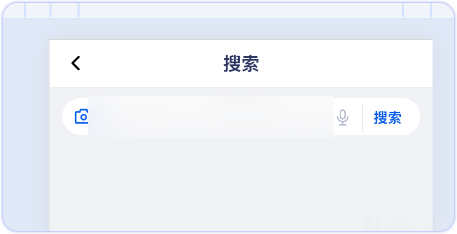](https://xzfile.aliyuncs.com/media/upload/picture/20240301215726-a2b5a30e-d7d3-1.png)

从burp查看后端请求，发现请求包响应包均为密文

[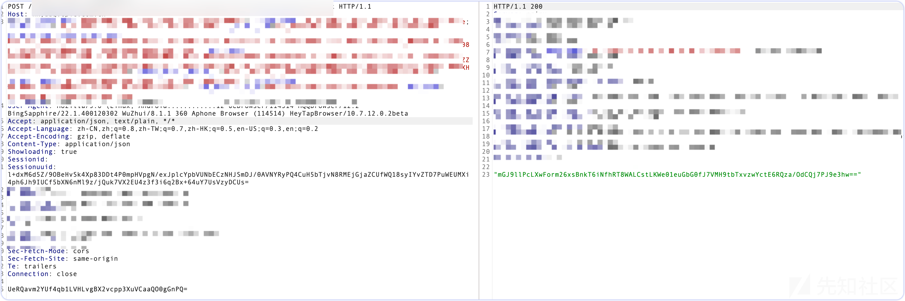](https://xzfile.aliyuncs.com/media/upload/picture/20240301215801-b7e467a6-d7d3-1.png)

猜测应该是前端进行了加密操作，接着尝试debug出加密逻辑。

先从启动器中寻找接口触发的函数，这里通过定位`getData`函数  
[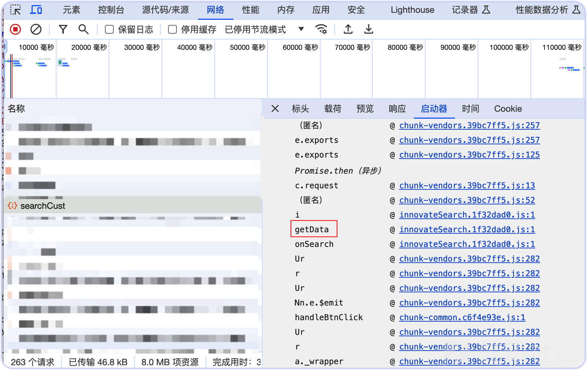](https://xzfile.aliyuncs.com/media/upload/picture/20240301215844-d19caad2-d7d3-1.png)

然后通过F10跳过函数，最终到加密处如下  
[](https://xzfile.aliyuncs.com/media/upload/picture/20240301221602-3c04bbd8-d7d6-1.png)

发现加密函数为`Object(r["b"])`，通过控制台打印它，双击即可跟进函数  
[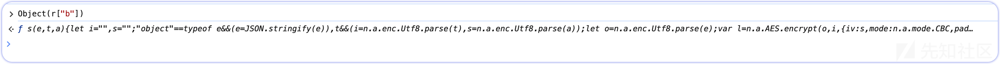](https://xzfile.aliyuncs.com/media/upload/picture/20240301221642-53a2bb5a-d7d6-1.png)

具体定义如下。  
[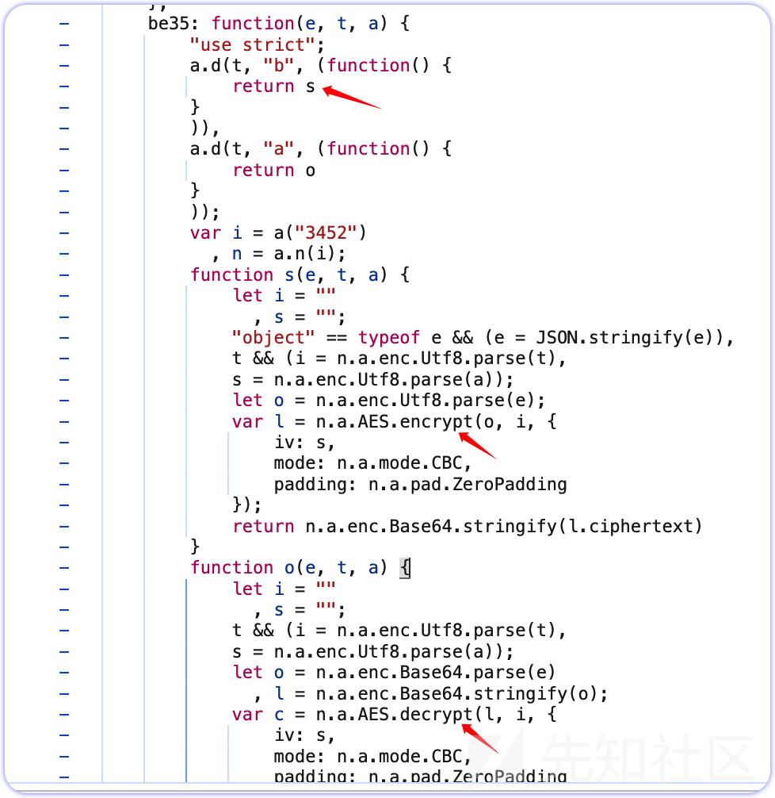](https://xzfile.aliyuncs.com/media/upload/picture/20240301220118-2cf0297c-d7d4-1.png)

观察`be35`包，当调用b的时候，返回了s，及AES加密。当调用a的时候，返回了o，及AES解密。分析这个AES的加解密，key和iv均不为硬编码，这也是后续`RPC`的最难点。

对于RPC来说，这一步需要我们将加解密函数添加到全局，也就是

```plain
window.enc=Object(r["b"]) //加密
window.dec=Object(r["a"]) //解密
```

添加完之后，还有key和iv需要解决。

这里当时临时解决办法是通过debug当时的key和iv，通过硬编码的形式来进行加解密。

### js注入部分

首先需要在`sekiro`中新建`group`，不然匿名分组会慢很多。

[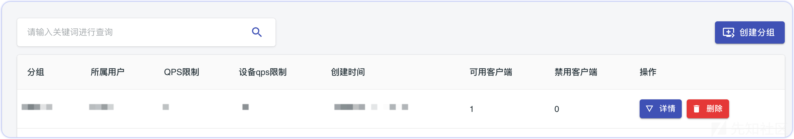](https://xzfile.aliyuncs.com/media/upload/picture/20240301220142-3b314d0e-d7d4-1.png)

由于这里使用的是`sekiro`的浏览器js环境，可参考官方文档，注入浏览器js代码

[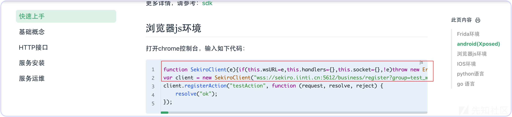](https://xzfile.aliyuncs.com/media/upload/picture/20240301220210-4bfd935e-d7d4-1.png)

这里由于我进行的本地`rpc`，需要将`wss`协议更换为`ws`。

```plain
var client = new SekiroClient("ws://localhost:端口号/business/register?group=分组名&clientId=" + Math.random());
```

在完成`cleint`创建后，还需要具体注册加解密的`Action`。

下面是针对debug的函数做出的加解密方法注册。

```plain
client.registerAction("aes_enc", function (request, resolve, reject) {//加密
    resolve(enc(request["enc_par"],request["key"],request["iv"]); 
});

client.registerAction("aes_dec", function (request, resolve, reject) {//解密
    resolve(enc(request["dec_par"],request["key"],request["iv"]); 
});
```

其中 `enc` 调用的是debug时注册的全局加密函数，`request["xxx"]`为调用 `sekiro` http接口的参数名，其他用法可参考使用文档。

### burp上游代理部分

这里使用的`autodecoder`这款burp插件的接口加解密来作为上游代理，这里通过python的`flask`框架来编写二层接口加解密。以下是加密接口实现，解密同理。

```plain
@app.route('/aes_encode', methods=["POST"])
def encrypt():
    param = request.form.get('dataBody')  # 获取  post 参数
    data = {
        "group": "分组名",
        "sekiro_token": "xxxxx", #在sekiro的管理页面
        "action": "aes_enc", #注册的action名字
        "enc_par": param,
        "bind_client": "设备名",
        "key": key,
        "iv": iv
    }
    res = requests.post(url, data)
    enc = json.loads(res.text)['data']
    return enc
```

需要注意的是`bind_client`参数为设备ID，这个参数需要加上，不然会导致多设备转发出错，参考官方文档。

[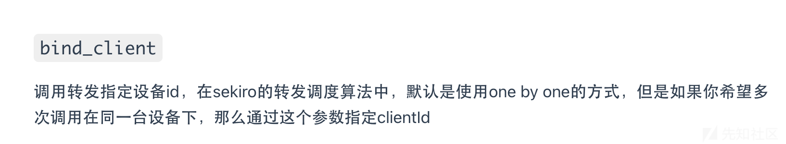](https://xzfile.aliyuncs.com/media/upload/picture/20240301220255-6735fb34-d7d4-1.png)

bind\_client参数位置如下。

[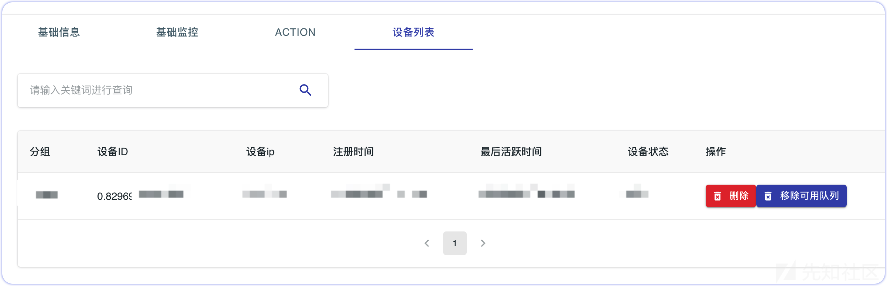](https://xzfile.aliyuncs.com/media/upload/picture/20240301220331-7c508c3c-d7d4-1.png)

做完这些部分之后，即可在burp的拦截、重放功能中对密文解密。

### key和iv随机问题解决

由于当时临时解决办法为，将key和iv通过debug出来后，硬编码赋值给上游代理的flask，但后续刷新页面，key和iv却发生了变化。于是重新debug出key和iv的生成逻辑。

debug回到之前的加密处

[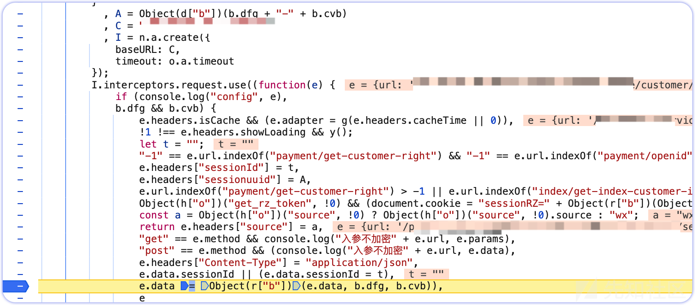](https://xzfile.aliyuncs.com/media/upload/picture/20240301220353-89cab892-d7d4-1.png)

带着之前的思路，加密处为

```plain
Object(r["b"])(e.data, b.dfg, b.cvb)
```

其中key、iv对应的b.dfg、b.cvb。而对象b的定义如下

[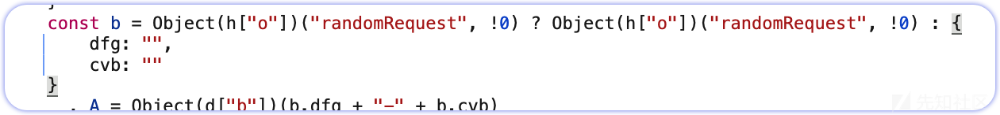](https://xzfile.aliyuncs.com/media/upload/picture/20240301220428-9e5c3baa-d7d4-1.png)

也就是由 `Object(h["o"])("randomRequest", !0)` 生成。同样通过控制台跟进`Object(h["o"])`

[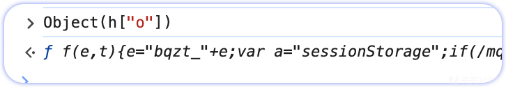](https://xzfile.aliyuncs.com/media/upload/picture/20240301220453-ad6424e6-d7d4-1.png)

来到 `f(t,e)` 函数，如下

[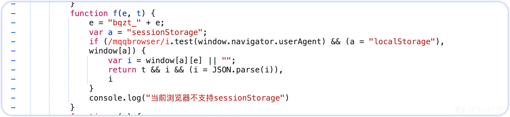](https://xzfile.aliyuncs.com/media/upload/picture/20240301220536-c6f05e7a-d7d4-1.png)

具体代码如下

```plain
function f(e, t) {
            e = "bqzt_" + e;
            var a = "sessionStorage";
            if (/mqqbrowser/i.test(window.navigator.userAgent) && (a = "localStorage"),
            window[a]) {
                var i = window[a][e] || "";
                return t && i && (i = JSON.parse(i)),
                i
            }
            console.log("当前浏览器不支持sessionStorage")
        }
```

分析这段代码，发现是正则匹配是否是QQ浏览器的`user-agent`来判断存储位置，如果正则匹配满足 `/mqqbrowser/i` ，则存储e到`localStorage`，如果不满足，则e存储到`sessionStorage`。

而这里的`f(e，t)`函数中，e是什么呢，这里我们直接查看`sessionStorage`，也就是会话储存，发现e就是AES加解密的key和iv。

[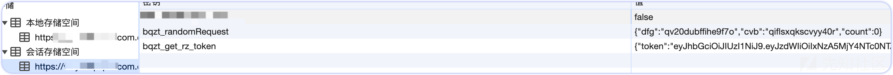](https://xzfile.aliyuncs.com/media/upload/picture/20240301220557-d379c316-d7d4-1.png)

debug到这一步，问题解决的关键就在于`sessionStorage`和`localStorage`。

当页面刷新时`sessionStorage`会发生变化，导致key和iv发生变化，我们设置的硬编码就失效了。而localStorage并不会随着页面刷新而重置，它存储于浏览器当前状态。

所以我们只需要将user-agent更换为QQ浏览器即可将`bqzt_randomRequest`存储进`localStorage`。  
这里解释一下为什么改为`localStorage`就能动态获取key和iv，因为在js注入后，存储的也是`sessionStorage`，刷新就会消失。而存储为`localStorage`之后，只要保持`jsrpc`注入的页面和具体渗透测试的页面处于同一浏览器即可。

最后一步，我们需要修改注册的action，将key和iv分别利用 `localStorage` 来获取。具体代码如下：

```plain
client.registerAction("aes_enc", function (request, resolve, reject) {
    resolve(enc(request["enc_par"],JSON.parse(localStorage.getItem("bqzt_randomRequest")).dfg,JSON.parse(localStorage.getItem("bqzt_randomRequest")).cvb));
});
```

到这问题基本解决了，autoDecoder中效果图如下。

[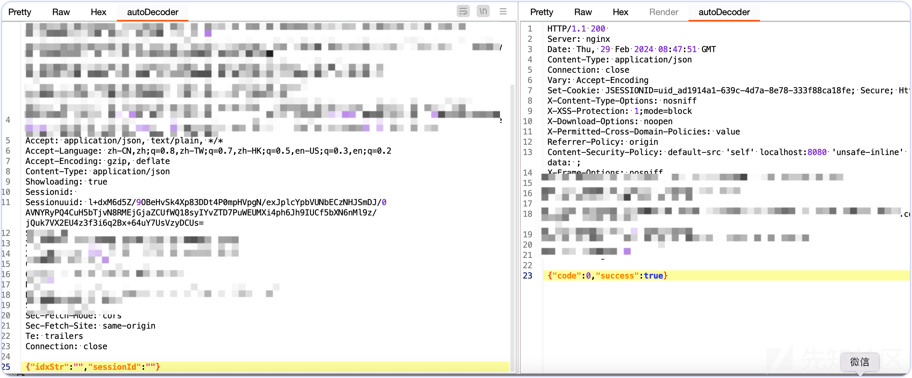](https://xzfile.aliyuncs.com/media/upload/picture/20240301220630-e73880d6-d7d4-1.png)

后续笔者也成功通过此加解密技巧，成功挖掘出高危漏洞。

## 参考

[https://sekiro.iinti.cn/sekiro-doc/](https://sekiro.iinti.cn/sekiro-doc/)  
[https://github.com/f0ng/autoDecoder](https://github.com/f0ng/autoDecoder)
