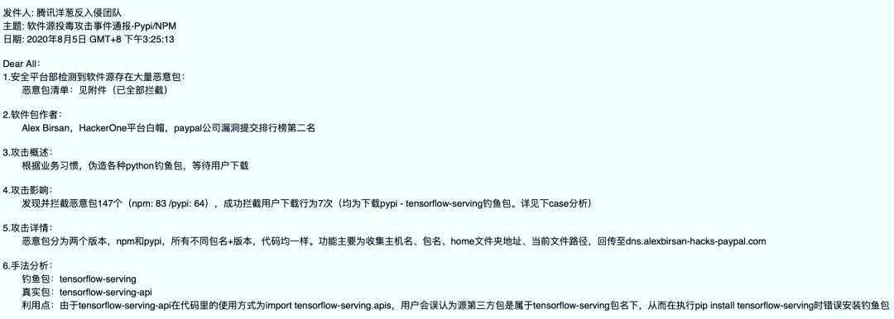
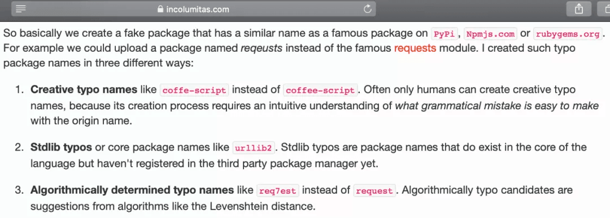
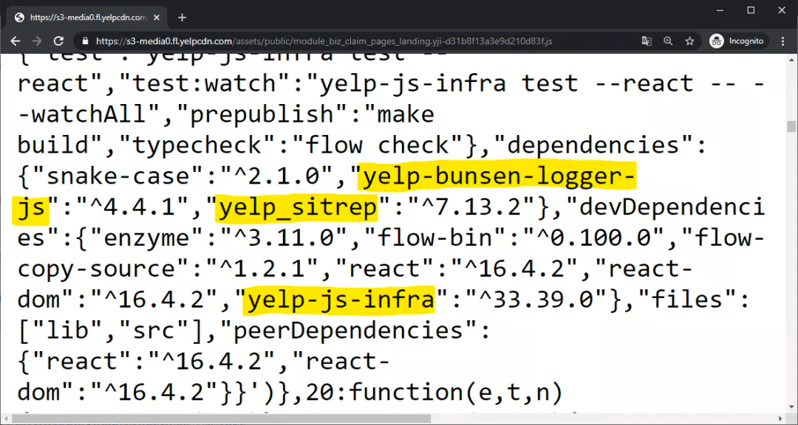
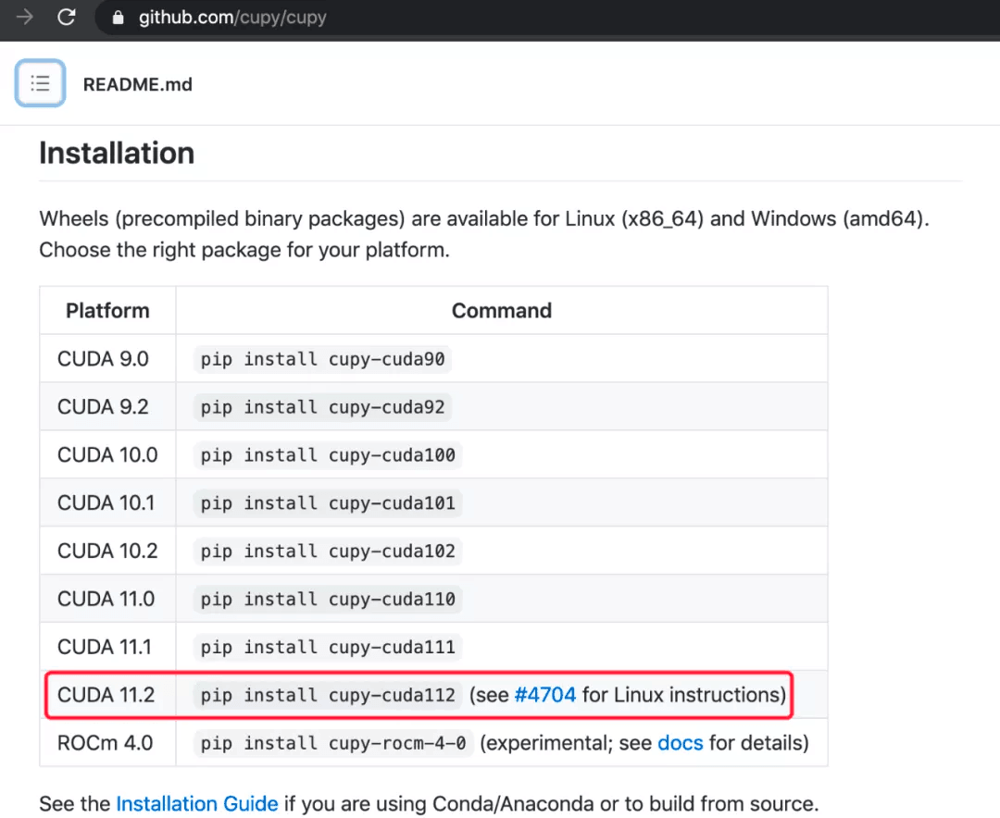

# 浅析软件供应链攻击之包抢注低成本钓鱼

# 一、背景介绍

为了提高企业研发与办公效率，降低时间与人力成本，任何一家企业的服务器和办公电脑都离不开第三方的开源或商业软件。通常大多数企业会假设上游供应商安全有保障，或者说大多数情况下无法确认供应商的安全性，即便知道供应商没那么可靠，对其安全也强制不了，但为了满足自身需求也会妥协采用。因此软件供应链攻击的伤害效果注定显著，黑客攻击上游后，控制下游也就水到渠成。这类攻击具有隐蔽性强、影响范围广、投入产出比高等特点，一直是恶意攻击者热衷的渗透打点手段，也是企业、个人及安全保障团队难以完全杜绝的攻击场景。

在 2021 年春节期间，国外安全研究员发表 Python/Nodejs/Ruby 依赖混淆攻击的安全测试成果，可获取 Apple、Microsoft、PayPal、Tesla 等多家国际知名企业的服务器控制权限，立即引起我们关注，当天紧急跟进分析发现庆幸在 2020 年 8 月份有监测到并拦截攻击。

最近笔者在由国内多名安全研究员联合组织的“第四届冰山安全闭门会”分享了团队研究的小小心得，本文为脱敏分享，希望更多的安全从业者可以参与交流探讨，共同应对恶意软件供应链攻击，也希望研发运维等人员可以了解到软件供应链的攻击风险，谨慎对待每一个第三方软件。

随着国家级安全攻防演练中攻击队手段不断深化升级，从 0/Nday 远程攻击互联网系统，到社工钓鱼攻击企业员工，再到机房职场近源攻击，相信今年软件供应链攻击也必不可少。

# 二、什么是供应链攻击

黑客通过攻击或伪造第三方软硬件产品，或劫持中间流量去植入木马，甚至供应商自身也可能预留后门，在用户使用时，达到攻击用户的目的。

供应链攻击并不是一个新的攻击方式，至少在十多年前就存在，只是近些年多起用户量大的知名软件、硬件被植入木马后门，影响范围广，风险越来越突显。

这里探讨的供应链攻击只包括刻意植入/预留木马后门的情况，不包括无意制造漏洞的情况。在开发阶段、分发阶段、使用阶段都可能会出现供应链攻击，我们一起回顾一些典型案例。

## 1\. 产品开发阶段

### 1）源代码编译遭攻击污染，典型案例有：

2015 年 Xcode 事件：使用恶意 Xcode IDE 编译出来的 APP 会被注入恶意代码，造成在 AppStore 发布的多款 APP 携带病毒。

2017 年 Xshell、CCleaner 事件：官方被黑客入侵，黑客在源代码加入远控木马代码，造成官方提供的软件携带远控木马后门。

2020 年 SolarWinds 事件：SolarWinds 官方被黑客入侵，软件包被篡改植入后门，18000 个客户安装了带毒软件，包括多个美国政府单位和大型企业。

### 2）供应商预留后门，典型案例有：

2015 年 Juniper VPN 后门事件：预留通用 SSH 密码，可窃取设备管理权限。

2017 年惠普笔记本音频驱动内置键盘记录后门事件：预留键盘记录后门，可造成用户输入信息泄漏。

2017 年多款 Chrome 插件被爆存在后门，窃取浏览器用户密码。

## 2\. 产品分发阶段

### 1）捆绑下载，正常软件被捆绑了恶意代码，典型案例有：

2012 年 putty 汉化版后门事件：黑客将 putty 汉化并植入记录输入的用户密码功能，国人下载使用后大量 SSH 密码遭窃取。

2017 年某知名下载站木马事件：第三方外包人员在下载器植入恶意代码，造成用户被植入广告木马。

### 2）下载劫持，包括官网下载链接遭替换、HTTP 流量/域名劫持等中间人劫持、P2P 缓存毒化劫持等，典型案例有：

2013 年台湾社区版 Firefox 浏览器官网下载连接遭黑客替换成恶意木马，3 天近 7 万下载数量。

2015 年恶意 Xcode IDE 毒化迅雷 P2P 下载，在迅雷下载 Xcode 可能会下载到恶意版本。

### 3）依赖包抢注，典型案例有：

2017 年多款 Python/Nodejs 库包被爆存在恶意代码，主要利用名称相似性误导用户安装，数万主机误安装受到影响。

2020 年国外安全研究员发现多家国际知名企业的内部私有包名在 GitHub、Web 页面泄露，随后在 PyPI/NPM/RubyGems 抢注并上传同名包，最终这些企业的内部服务器被迫安装恶意包受到影响。

### 4）物流链劫持，硬件产品（比如服务器、笔记本、U 盘等）在物理运输过程中被调包或加料植入木马后门：

据报道称美国国家安全局 NSA 技术员斯诺登透露 NSA 采用物流链劫持的方式对思科路由器设备植入后门。

## 3\. 产品使用阶段

### 1）升级更新劫持，包括官网升级程序被替换，HTTP 流量/域名劫持等中间人劫持，典型案例有：

2017 年乌克兰 MeDoc 软件官网升级服务器被攻击植入木马，用户电脑升级 MeDoc 时被植入 NotPetya 勒索病毒。

### 2）官方云控作恶，官方下发命令操控用户主机：

据报道称 2014 年卡巴斯基杀毒软件收集 NSA 员工主机文件回传到卡巴斯基云端。

# 三、低成本高收获的供应链黑客攻击方式

那哪种攻击方式最容易实施并且成功率高？

纵观上述案例，笔者认为“伪造供应商”相比于“攻击供应商”、“劫持中间链路”，是投入产出比最高的攻击方式。尤其是“包抢注”，抢注相似包名的攻击可撒网影响全球主机，抢注企业内部包名的攻击可定向影响目标企业，并且往 Python/Nodejs/Ruby 等官方源上传发布库包非常简单随意，黑客甚至可以实现自动化批量抢注投毒。

虽然攻击案例持续曝光，但是风险口子却没有堵住，黑客必然不会放过如此攻击方式。

## 1\. 抢注相似包名的攻击

2016 年，国外安全研究员 Nikolai Tschacher 发表论文《Typosquatting programming language package managers》，通过抢注 200 多个 Python/Nodejs/Ruby 相似包名，在几周时间内全球有 1 万多台计算机被迫安装抢注包，包括美国政府和国防部主机。

2017 年，国内安全研究员 fatezero 发表文章《Package 钓鱼》，也抢注几十个常见软件包名，在一周时间内全球也有 1 万多台计算机安装。

## 2\. 抢注企业内部包名的攻击

为满足企业内研发人员对内部私有软件包的管理和使用需求，各大互联网公司会在企业内部自建软件源用于存放自研软件包，但若员工在安装自研软件包时没有指定仅从企业内部下载，就有可能遭遇包抢注攻击。

2020 年，国外安全研究员 Alex Birsan 发现 Apple、Microsoft 等多家国际知名公司的 Github 开源项目和 Web 页面泄漏的信息中存在“企业内部软件包”与“第三方开源软件包”混合的依赖配置，随后在 Python/Nodejs/Ruby 官方源上注册并上传与“企业内部软件包”同名的抢注包，并等待上述公司员工进行安装，最终这些企业的内部服务器安装了恶意包。

## 3\. 包抢注攻击的常见场景归纳

### 1）开发者没有及时到官方源注册包名，造成攻击者可以抢先注册。

比如 2021 年 CuPy 官方提供了 cupy-cuda112 安装指引，但并没有及时在 PyPI 注册，安全研究员抢注提示 CuPy 注意攻击风险。

### 2）开发者生成依赖配置文件引用了官方源不存在的包

这种 GitHub 开源软件，用户想尝试使用连安装都不成功，攻击者可以抢注攻击。

### 3）开发者包命名不够规范，造成使用者容易被误导。

由于部分软件包的注册名称并非和导入名称一致，用户可能根据报错信息进行依赖包安装，导致错误安装了恶意软件包。比如 Python 软件包 tensorflow-serving-api 在代码里的使用方式为“import tensorflow-serving.apis”，当用户误执行“pip install tensorflow-serving”用于安装 tensorflow-serving-api 时，导致安装恶意软件包。

### 4）使用者安装知名软件时，根据直觉直接敲打广为人知的名称，但实际上官方包另有其名。

比如为安装 OpenCV，用户根据直觉直接执行“pip install opencv”，但官方包名为 opencv-python，导致安装恶意软件包。

### 5）使用者在使用命令行手敲安装包名时，漏敲或多敲或错敲个别字符，或不经意粘贴其他内容，造成安装恶意软件包。

比如在 2020 年 7 月 31 日，黑客在 Python 软件包官方源注册 request 包名并上传恶意代码，当用户打算安装 Python 知名软件包 requests 却误执行“pip install request”时，导致安装恶意软件包。

### 6）开发者错误指引或使用者错误使用不安全的安装选项。

比如企业内部包 Xcompany-http 既依赖内部包 Xcompany-sdk 又依赖外部包 requests，企业员工安装 Xcompany-http 时极有可能执行 pip install Xcompany-http —index-url [https://pypi.Xcompany.com/simple](https://pypi.xcompany.com/simple) —extra-index-url [https://pypi.python.org/simple](https://pypi.python.org/simple)

由于 pip 安装机制问题，会从两个源都下载 Xcompany-http、Xcompany-sdk、requests，并选择高版本或指定版本安装，如果企业没有在 PyPI 官方源注册 Xcompany-http 或 Xcompany-sdk，那么黑客就可以抢注上传恶意包进而攻击企业员工电脑。

## 4\. 攻击者抢注包名的一些手段

攻击者特别需要思考抢注的包名是否会有受害者安装，有点类似安全团队要思考如何更好地引诱黑客进入蜜罐。所以攻击者很可能会通过以下几种手段，构造及抢注高命中率的包名。

### 1）分析官方源库全部包名称

包名简化：比如从 xx-sdk-python 到抢注 xx-sdk，从 yy-sdk2021 到抢注 yy-sdk，从 yy-sdk 到抢注 yy 或 yysdk

包名前后调换：比如从 zz-python 到抢注 python-zz

### 2）分析软件包的引用方式

如上文提到的 tensorflow-serving-api 在代码里的使用方式为“import tensorflow-serving.apis”，那么攻击者可能会抢注 tensorflow-serving。

### 3）分析 GitHub 开源项目的名称、README.md、依赖关系文件

通过分析 README.md 的安装操作指引（如 pip/npm/gem install 命令）和依赖关系文件（如 requirements.txt、package.json、Gemfile），排查相关包是否还没有在官方源注册。若针对企业官方开源项目或企业员工个人开源项目进行分析，有可能发现内部包名泄露，有很大可能性可以定向攻击目标企业。另外攻击者甚至有可能抢注 GitHub 头部 Star/Fork 项目的同名包，静等鱼儿上钩。

### 4）挖掘网站泄露信息

通过扫描目标企业全部网站诸如 package.json、requirements.txt、\*.js 等文件，获取目标依赖包名称，有可能实施定向攻击目标企业。

### 5）直接抢注知名软件名称、常见名词

互联网知名软件千千万万，比如 C 语言开发的软件 aaaaa，有人以为 pip/npm/gem 也可以安装，误操作 pip/npm/gem install aaaaa，常见名词也是差不多的道理。

# 四、软件供应链攻击蓝军安全演习

开展互联网软件供应链攻击演习的风险隐患是很大的，首先可能是不道德的，抢注他人已使用的软件包名可能会影响他人项目发展，给无关人员制造麻烦；

其次可能涉及未授权攻击，由于很难控制影响范围，会影响到演习授权范围以外的企业和人员，可能会影响业务正常部署和扩容，甚至引发业务不可用重大故障；

然后抢注“投毒”的影响是长久的，即使及时删掉了官方源上的恶意包，但国内外多个镜像站可能并不会同步删除，而是长期保留恶意包。

所以开展蓝军安全演习务必谨慎，建议避免可能影响未授权范围的互联网软件供应链攻击演习。

# 五、软件供应链攻击应对防范措施

企业的发展离不开供应链，软件供应链攻击是全球性风险，彻底杜绝不太可能，需要大家谨慎对待每一个上游供应链软件，一些应对防范小建议：

### For 安全人员

1）企业内部维护可信软件仓库，尽量减少企业人员从各种未知渠道下载软件。

2）监测服务器和 PC 运行软件的异常操作和流量，甚至提前对软件进行沙盒检测，主动发现潜在隐患。

3）全面梳理和维护企业在用软硬件信息，在供应链攻击曝光时做到快速止损定损。

### For 开发人员

1）使用官方渠道下载的 IDE；软件分发及升级采用 HTTPS 等加密传输；避免内置远程控制能力；定期自检官网代码和执行程序是否存在恶意篡改。

2）关于防范包抢注攻击：对于企业内部包，可以及时到 PyPI/NPM/RubyGems 等官方源注册包名（可以上传空包占位以免内部代码泄露），防止企业自身遭遇抢注攻击；对于开源包，也及时到官方源注册并上传最新代码，既方便用户也能防止用户遭遇攻击。

### For 使用人员

1）始终保持任何外来软件都不是完全安全可信的态度，优先选择知名有口碑有安全意识的软件。

2）关于防范包抢注攻击：安装软件时务必谨慎，按照官方指引确保安装方式正确，如命令行手敲命令时注意拼写准确，以防一不小心机器就成肉鸡。

本文主要从供应链攻击典型案例中引出实施容易、中招率高的包抢注钓鱼攻击的场景和手段，目的是希望提醒大家注意软件供应链攻击，然后阐述一些应对防范小建议，希望对防御攻击带来一点帮助。

> 本文主要从供应链攻击典型案例中引出实施容易、中招率高的包抢注钓鱼攻击的场景和手段，目的是希望提醒大家注意软件供应链攻击，然后阐述一些应对防范小建议，希望对防御攻击带来一点帮助。
> 
> 文章形成离不开腾讯蓝军（攻击方）和洋葱团队（防御方）兄弟们的长期研究学习总结，包括不限于 KINGX、pass、neargle、海星、七夜、柯南等兄弟。文中涉及到的内容只限用于提高安全意识，切勿用于非法用途，行文仓促，不足之处，敬请不吝赐教。

## 附录：参考资料

1、[Typosquatting programming language package managers](https://incolumitas.com/2016/06/08/typosquatting-package-managers/ "Typosquatting programming language package managers")

2、[Package 钓鱼](http://blog.fatezero.org/2017/06/01/package-fishing/ "Package 钓鱼")

3、[软件供应链来源攻击分析报告](https://ti.qianxin.com/blog/articles/supply-chain-attacks-of-software/ "软件供应链来源攻击分析报告")

4、[2017 网络安全威胁的回顾与展望](https://www.antiy.com/response/20180707.html "2017网络安全威胁的回顾与展望")

5、[源头之战，不断升级的攻防对抗技术 —— 软件供应链攻击防御探索](https://mp.weixin.qq.com/s/3P70fr3Yxb3X7SsYdNKn_Q "源头之战，不断升级的攻防对抗技术 —— 软件供应链攻击防御探索")

6、[腾讯洋葱反入侵系统检测到多例恶意 Python 库供应链投毒](https://mp.weixin.qq.com/s/TT9zVrGKpcd11aOI3WkL7g "腾讯洋葱反入侵系统检测到多例恶意Python库供应链投毒")

7、[PyPI 官方仓库遭遇 request 恶意包投毒](https://mp.weixin.qq.com/s/dkPdXfGfSK097GI6Ln92lA "PyPI官方仓库遭遇request恶意包投毒")

8、[NPM 遭遇供应链投毒攻击窃取 K8S 集群凭证](https://mp.weixin.qq.com/s/Qx7WCVicPsZQvYarskqB8w "NPM遭遇供应链投毒攻击窃取K8S集群凭证")

9、[对 SolarWinds 事件更深的思考：如何防御供应链攻击](https://mp.weixin.qq.com/s/GdER32Z7K86boHVc-Kic3g "对SolarWinds事件更深的思考：如何防御供应链攻击")

10, Dependency Confusion: How I Hacked Into Apple, Microsoft and Dozens of Other Companies
